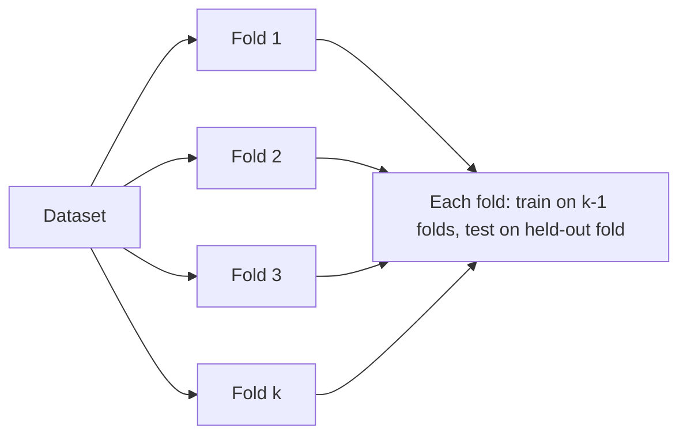
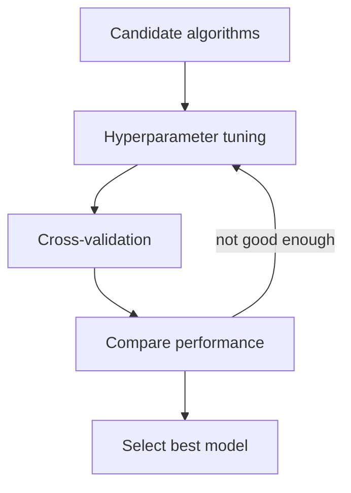
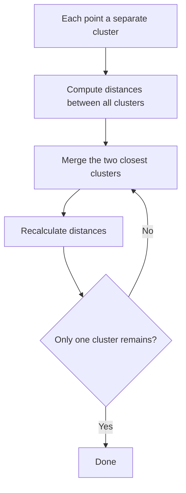
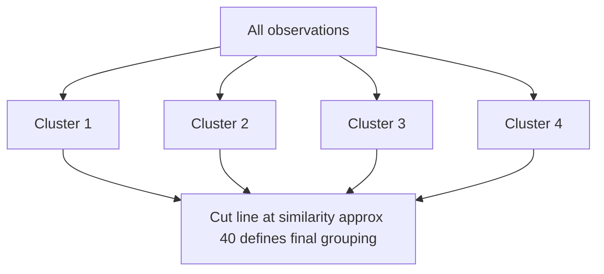
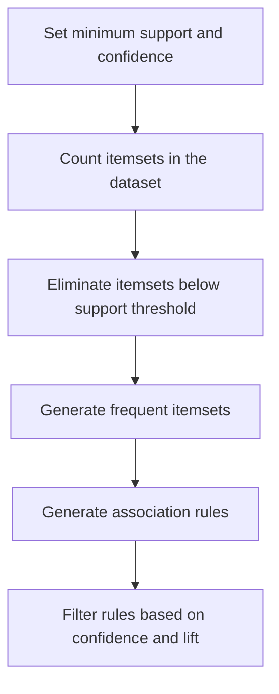
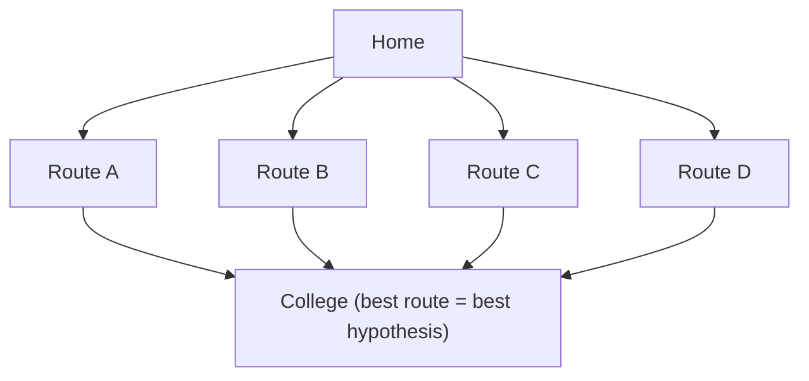
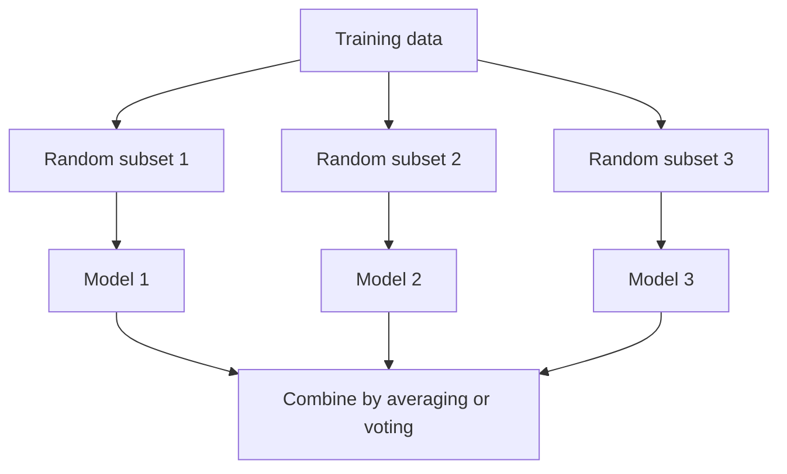
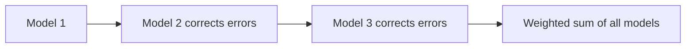

# Unit III — Unsupervised Learning & Algorithms

## 3.1 Evaluating Machine Learning Algorithms and Model Selection

### Introduction

- Why evaluation is important in ML?
- Difference between training performance and real-world performance
- Bias–variance tradeoff

## Performance Metrics

### For Classification

- Accuracy, Precision, Recall, F1-score
- Confusion matrix
- ROC curve, AUC

Standard formulas:

$$\text{Accuracy} = \frac{TP + TN}{TP + TN + FP + FN}$$

$$\text{Precision} = \frac{TP}{TP + FP}$$

$$\text{Recall} = \frac{TP}{TP + FN}$$

$$F_1 = 2 \cdot \frac{\text{Precision} \cdot \text{Recall}}{\text{Precision} + \text{Recall}}$$

### For Regression

- Mean Squared Error (MSE), Root Mean Squared Error (RMSE)
- Mean Absolute Error (MAE)
- R² score (coefficient of determination)

Standard formulas:

$$\text{MSE} = \frac{1}{n} \sum_{i=1}^{n} (y_i - \hat{y}_i)^2$$

$$\text{RMSE} = \sqrt{\frac{1}{n} \sum_{i=1}^{n} (y_i - \hat{y}_i)^2}$$

$$\text{MAE} = \frac{1}{n} \sum_{i=1}^{n} |y_i - \hat{y}_i|$$

$$R^2 = 1 - \frac{\sum_{i=1}^{n} (y_i - \hat{y}_i)^2}{\sum_{i=1}^{n} (y_i - \bar{y})^2}$$

### For Ranking/Recommendation

- Precision@k, Recall@k, MAP, NDCG

## Validation Techniques

- Hold-out method (train/test split)
- k-Fold Cross-Validation
- Leave-One-Out Cross-Validation (LOOCV)
- Stratified sampling (for imbalanced datasets)

## Model Selection Strategies

- Comparing multiple algorithms
- Hyperparameter tuning
  - Grid Search
  - Random Search
  - Bayesian Optimization
- Automated Machine Learning (AutoML)

## Overfitting and Underfitting

- Causes and detection
- Regularization (L1, L2, dropout)
- Early stopping

## Model Complexity and Generalization

- Bias–variance tradeoff revisited
- Model capacity vs dataset size
- Occam's razor principle in ML

## 3.2 Introduction to Statistical Learning Theory

- Statistical Learning Theory (SLT) is a theoretical framework for understanding how machines learn from data and make predictions.
- It provides the mathematical foundations behind many modern machine learning algorithms and helps explain their performance, limitations, and generalization ability.

### Learning Problem

- Input: A dataset consisting of feature vectors and corresponding labels.
- Goal: Learn a function (hypothesis) that maps inputs to outputs with minimal error.

### Hypothesis Space (H)

- The set of all possible models the learning algorithm can choose from.
- Example: In linear regression, the hypothesis space is the set of all linear functions.

### Risk and Loss Functions

- Loss function: Measures the error of predictions (e.g., squared error, hinge loss, cross-entropy).
- Expected Risk (True Risk): Average loss over the entire data distribution (unknown in practice).
- Empirical Risk: Average loss over the training dataset (known).

Empirical Risk:

$$R_{\text{emp}}(h) = \frac{1}{n} \sum_{i=1}^{n} L(y_i, h(x_i))$$

#### Empirical Risk Minimization (ERM)

- A principle where the learner chooses the hypothesis that minimizes the training error.
- Problem: ERM may lead to overfitting if the hypothesis is too complex.

### Generalization

- The ability of a model to perform well on unseen data.
- Statistical Learning Theory provides tools (like VC dimension, bounds, and regularization) to study generalization.

### VC Dimension and Capacity Control

- Vapnik–Chervonenkis (VC) dimension: A measure of the complexity or capacity of a hypothesis space.
- Models with very high VC dimension can overfit; too low VC dimension may underfit.

### Structural Risk Minimization (SRM)

- An approach that balances model complexity and training error.
- Introduces regularization to avoid overfitting and improve generalization.

### PAC Learning (Probably Approximately Correct)

- Framework that defines conditions under which a learning algorithm can guarantee that the learned hypothesis is close to the true function, with high probability.

## Hierarchical Clustering

- Hierarchical clustering is an unsupervised machine learning technique used to group similar data points into clusters.
- Unlike algorithms such as K-Means, it does not require the number of clusters to be specified in advance.

### Agglomerative Hierarchical Clustering (Bottom-Up)

- Starts with each data point as an individual cluster.
- Repeatedly merges the two most similar clusters.
- Continues until all points belong to a single cluster or a stopping criterion is reached.
- This is the most commonly used approach.

#### How Agglomerative Hierarchical Clustering Works

1. Suppose you have five data points: A, B, C, D, E.
2. Treat each point as a separate cluster.
3. Compute the distance between all clusters.
4. Merge the two closest clusters.
5. Recalculate distances.
6. Repeat until only one cluster remains.

#### Linkage Methods

| Linkage Method | Description |
| --- | --- |
| Single Linkage | Minimum distance between two clusters |
| Complete Linkage | Maximum distance between two clusters |
| Average Linkage | Average distance between all pairs of points |
| Ward's Linkage | Minimizes the increase in within-cluster variance |

### Divisive Hierarchical Clustering (Top-Down)

- Starts with all data points in one cluster.
- Repeatedly splits clusters into smaller clusters.
- Continues until each data point forms its own cluster or the desired number of clusters is obtained.

## Dendrograms

- A dendrogram is a tree-like diagram that shows how clusters are merged.
- The dendrogram is a tree diagram that displays the groups that are formed by clustering observations at each step and their similarity levels.
- The similarity level is measured along the vertical axis (alternately, you can display the distance level), and the different observations are listed along the horizontal axis.

### Interpretation

1. Use the dendrogram to view how the clusters are formed at each step and to assess the similarity (or distance) levels of the clusters that are formed.
2. To view the similarity (or distance) levels, hold your pointer over a horizontal line in the dendrogram. The pattern of how similarity or distance values change from step to step can help you to choose the final grouping for your data.
3. The step where the values change abruptly may identify a good point to define the final grouping.
4. The decision about final grouping is also called cutting the dendrogram. Cutting the dendrogram is similar to drawing a line across the dendrogram to specify the final grouping.
5. You can also compare dendrograms for different final groupings to determine which final grouping makes the most sense for your data.

### Example Dendrogram

1. This dendrogram was created using a final partition of 4 clusters, which occurs at a similarity level of approximately 40.
2. The first cluster (far left) is composed of seven observations (the observations in rows 1, 3, 6, 9, 10, 11, and 15 of the worksheet).
3. The second cluster, directly to the right, is composed of 3 observations (the observations in rows 4, 12, and 19 in the worksheet).
4. The third cluster is composed of 7 observations (the observations in rows 2, 14, 17, 20, 18, 5, and 8). The fourth cluster, on the far right, is composed of 3 observations (the observations in rows 7, 13, and 16).
5. If you cut the dendrogram higher, then there would be fewer final clusters, but their similarity level would be lower.
6. If you cut the dendrogram lower, then the similarity level would be higher, but there would be more final clusters.

## Apriori Algorithm for Association Rules

- Association rule learning is a rule-based machine learning method to find relationships (associations) between variables in large datasets.

Real life example:

- If a customer buys bread and butter, they are likely to buy jam.
- This is an example of a market basket analysis.

### Steps of Apriori Algorithm

- Set minimum support and confidence
- Generate all frequent itemsets:
  - Count itemsets in the dataset
  - Eliminate itemsets below the support threshold
- Generate association rules from the frequent item sets
- Filter rules based on confidence and lift

### Applications of Apriori Algorithm

- E-commerce: Used to recommend products that are often bought together like laptop + laptop bag, increasing sales.
- Food Delivery Services: Identifies popular combos such as burger + fries, to offer combo deals to customers.
- Streaming Services: Recommends related movies or shows based on what users often watch together like action + superhero movies.
- Financial Services: Analyzes spending habits to suggest personalized offers such as credit card deals based on frequent purchases.
- Travel & Hospitality: Creates travel packages like flight + hotel by finding commonly purchased services together.
- Health & Fitness: Suggests workout plans or supplements based on users' past activities like protein shakes + workouts.

## Discriminant Functions

- A discriminant function is a function used in pattern recognition and machine learning to classify data points into different classes.
- It evaluates a feature vector and assigns it to one of the predefined classes by comparing the function values.

### Why Use Discriminant Functions?

- They provide a decision boundary between classes.
- Useful in supervised learning for classification tasks.
- Allow for probabilistic or distance-based interpretations.

### Types of Discriminant Functions

- Linear Discriminant Function (LDF)
- Quadratic Discriminant Function (QDF)
- Bayesian Discriminant Function (BDF)

### Applications Of Discriminant Functions

- Face recognition
- Handwriting digit recognition
- Medical diagnosis
- Spam detection

### Linear Discriminant Function

- Linear discriminant analysis (LDA) is a supervised learning algorithm used for classification and dimensionality reduction in machine learning.
- It aims to find a linear combination of features that best separates different classes in a dataset.

## Hypothesis Space

### What is a Hypothesis?

- In Machine Learning, a hypothesis is a mathematical function or model that maps input features (X) to an output (Y).
- It is the model's prediction function learned from the training data.
- Mathematically, $Y = h(X)$ where:
  - X = Input (Features)
  - Y = Output (Target/Class)
  - h = Hypothesis

#### Example

Suppose we want to predict the marks of a student based on study hours.

| Study Hours | Marks |
| --- | --- |
| 2 | 35 |
| 4 | 55 |
| 6 | 72 |

A possible hypothesis is $h(x)$, where:

- x = Study Hours
- h(x) = Predicted Marks

### What is Hypothesis Space?

- The Hypothesis Space is the set of all possible hypotheses (models) that a learning algorithm can choose from to solve a problem.
- It is denoted by $H$, where each hypothesis represents a different model.
- Hypothesis Space is the collection of all candidate functions that can approximate the relationship between inputs and outputs.

### Why is Hypothesis Space Needed?

1. A machine learning algorithm does not know the correct model initially.
2. Instead, it searches among many possible models to find the one that best fits the training data.
3. The collection of all these possible models is called the Hypothesis Space.

### Real-Life Analogy

- "Find the best route from your home to college."
- Possible routes are: 1. Route A  2. Route B  3. Route C  4. Route D
- Each route is a possible solution.
- Similarly,
  1. Each model = one hypothesis
  2. All models together = hypothesis space
  3. The ML algorithm chooses the best route (best hypothesis).

### Example of Hypothesis Space

Suppose we want to classify emails as Spam or Not Spam. Possible hypotheses:

1. Hypothesis 1: If email contains "Lottery" → Spam
2. Hypothesis 2: If email contains "Free" → Spam
3. Hypothesis 3: If email contains "Lottery" AND "Prize" → Spam
4. Hypothesis 4: Always predict Not Spam

All these hypothesis together form Hypothesis SPACE.

### Mathematical Representation

- Suppose $h(x) = wx + b$.
- Different values of w and b produce different hypotheses.

## VC Dimension

### VC Dimension (Vapnik–Chervonenkis Dimension)

1. VC dimension measures the capacity (complexity) of a hypothesis space — how well a model can fit various patterns.
2. It is the maximum number of points that can be shattered (i.e., classified correctly in all possible ways) by the hypothesis class.

Examples:

- VC Dimension of a linear classifier in 2D: 3
- VC Dimension of a decision stump (1-level decision tree): 1
- VC Dimension of a k-nearest neighbor (if k=1): infinite

### VC Dimension (Detail)

- The Vapnik-Chervonenkis (VC) dimension is a measure of the capacity of a hypothesis set to fit different data sets.
- It was introduced by Vladimir Vapnik and Alexey Chervonenkis in the 1970s and has become a fundamental concept in statistical learning theory.
- The VC dimension is a measure of the complexity of a model, which can help us understand how well it can fit different data sets.
- The VC dimension of a hypothesis set H is the largest number of points that can be shattered by H.
- A hypothesis set H shatters a set of points S if, for every possible labeling of the points in S, there exists a hypothesis in H that correctly classifies the points.

### Why is it important?

- Helps understand underfitting vs overfitting
- A model with high VC dimension can overfit.
- A balance is needed between model complexity and generalization.

## 3.3 Ensemble Methods

Ensemble Methods (Boosting, Bagging, Random Forests)

### Ensemble learning

- Ensemble learning is a technique in machine learning where multiple models (often called "weak learners") are trained and combined to solve the same problem.
- The idea is that a group of models working together can outperform a single strong model.

### When to Use Ensemble Learning?

- You have high variance or high bias in your model.
- Your base models are diverse and complementary.
- You want to increase model performance in competitions (e.g., Kaggle).

#### Real-Life Example

- Imagine trying to guess a movie's rating:
  - One friend uses past ratings
  - Another reads online reviews
  - A third watches the trailer
- Each has weaknesses alone, but combining their opinions gives a better estimate. That's ensemble learning!

Accuracy: Highest

### Types of Ensemble learning

#### Bagging (Bootstrap Aggregating)

- Models are trained independently on different random subsets of the training data.
- Their results are then combined—usually by averaging (for regression) or voting (for classification).
- This helps reduce variance and prevents over fitting.
- Example Algorithms:
  - Random Forest (uses decision trees + bagging)

#### Boosting

- Models are trained one after another. Each new model focuses on fixing the errors made by the previous ones.
- The final prediction is a weighted combination of all models, which helps reduce bias and improve accuracy.
- Models are trained sequentially, each new model focusing on correcting the errors of the previous ones.
- Final prediction is a weighted sum of all models.
- Reduces bias and variance

Popular Boosting Algorithms:

- AdaBoost (Adaptive Boosting)
- Gradient Boosting (GBM)
- XGBoost
- LightGBM
- CatBoost

#### Stacking (Stacked Generalization)

- Multiple different models (often of different types) are trained, and their predictions are used as inputs to a final model, called a meta-model.
- The meta-model learns how to best combine the predictions of the base models, aiming for better performance than any individual model.
- The predictions of base models are fed to a meta-model (e.g., logistic regression) that learns how to best combine them.
- Leverages strengths of different models
- Useful when base learners are diverse.

#### Real-Life Example

- Imagine trying to guess a movie's rating:
  - One friend uses past ratings
  - Another reads online reviews
  - A third watches the trailer
- Each has weaknesses alone, but combining their opinions gives a better estimate. That's ensemble learning!
