# Unit I - Introduction to Machine Learning

Source PDF: `ml class/Unit-I Introduction to Machine Learning.pptx.pdf`
Total pages: 153

These notes are written page by page. Every page includes the rendered slide image as visual output, the extracted text, and a detailed explanation of how to read the slide.

## Page 1: Machine Learning

### Extracted Slide Text

- Machine Learning
- PROGRAMME: B.tech Computer Engineering
- Semester:- VII
- Subject Teaching Faculty:- Mrs. Ashwini R.Vaidya

### Page Description And Teaching Notes

Slide type: concept explanation slide.
Main idea: PROGRAMME: B.tech Computer Engineering Semester:- VII Subject Teaching Faculty:- Mrs. Ashwini R.Vaidya.
This page explains a core concept in prose. The main task is to convert the definition into a clear statement of what the concept is, why it is used, and where it appears in a machine-learning workflow.
Detailed page understanding:
- `PROGRAMME: B.tech Computer Engineering` is a core visible point. Explain what it means, why it matters, and how it connects to the slide title.
- `Semester:- VII` is a core visible point. Explain what it means, why it matters, and how it connects to the slide title.
- `Subject Teaching Faculty:- Mrs. Ashwini R.Vaidya` is a core visible point. Explain what it means, why it matters, and how it connects to the slide title.
Important visible terms: Machine Learning PROGRAMME, Computer Engineering Semester, VII Subject Teaching Faculty, Mrs, Ashwini R, Vaidya.
Visual/layout description: the embedded image preserves the actual slide. Describe the title area first, then read bullets, formulas, tables, arrows, grouped boxes, or diagrams in their visible order. If the slide contains a diagram, explain the relationship shown by arrows/positioning before explaining the text labels.
Teaching note: after reading the slide, ask the learner to restate the page in one or two sentences and give one example. For formula or metric slides, also ask what each variable or metric means and when it should be used.
Exam/viva note: prepare the slide title as a short-answer question, then use the bullets or visual labels as the expected answer points.

## Page 2: What is Machine Learning?

### Extracted Slide Text

- What is Machine Learning?
- Machine learning is an application
- of artificial intelligence that
- involves algorithms and data that
- automatically analyze and make
- decision by itself without human
- intervention.

### Page Description And Teaching Notes

Slide type: concept explanation slide.
Main idea: Machine learning is an application of artificial intelligence that involves algorithms and data that automatically analyze and make decision by itself without human intervention.
This page explains a core concept in prose. The main task is to convert the definition into a clear statement of what the concept is, why it is used, and where it appears in a machine-learning workflow.
Detailed page understanding:
- `Machine learning is an application` gives the definition-level meaning. Explain it first in simple words, then connect it to how a model learns from data.
- `of artificial intelligence that` is a core visible point. Explain what it means, why it matters, and how it connects to the slide title.
- `involves algorithms and data that` is a core visible point. Explain what it means, why it matters, and how it connects to the slide title.
- `automatically analyze and make` is a core visible point. Explain what it means, why it matters, and how it connects to the slide title.
- `decision by itself without human` is a core visible point. Explain what it means, why it matters, and how it connects to the slide title.
- `intervention.` is a core visible point. Explain what it means, why it matters, and how it connects to the slide title.
Important visible terms: What, Machine Learning, Machine.
Visual/layout description: the embedded image preserves the actual slide. Describe the title area first, then read bullets, formulas, tables, arrows, grouped boxes, or diagrams in their visible order. If the slide contains a diagram, explain the relationship shown by arrows/positioning before explaining the text labels.
Teaching note: after reading the slide, ask the learner to restate the page in one or two sentences and give one example. For formula or metric slides, also ask what each variable or metric means and when it should be used.
Exam/viva note: prepare the slide title as a short-answer question, then use the bullets or visual labels as the expected answer points.

## Page 3: OR

### Extracted Slide Text

- OR
- Machine Learning (ML) is a branch of
- Artificial Intelligence (AI) that enables
- systems to learn from data, identify
- patterns, and make decisions with
- minimal human intervention.
- Instead of being explicitly programmed
- to perform a task, ML algorithms learn
- from experience.

### Page Description And Teaching Notes

Slide type: concept explanation slide.
Main idea: Machine Learning (ML) is a branch of Artificial Intelligence (AI) that enables systems to learn from data, identify patterns, and make decisions with minimal human intervention. Instead of being explicitly programmed.
This page explains a core concept in prose. The main task is to convert the definition into a clear statement of what the concept is, why it is used, and where it appears in a machine-learning workflow.
Detailed page understanding:
- `Machine Learning (ML) is a branch of` gives the definition-level meaning. Explain it first in simple words, then connect it to how a model learns from data.
- `Artificial Intelligence (AI) that enables` is a core visible point. Explain what it means, why it matters, and how it connects to the slide title.
- `systems to learn from data, identify` is a core visible point. Explain what it means, why it matters, and how it connects to the slide title.
- `patterns, and make decisions with` is a core visible point. Explain what it means, why it matters, and how it connects to the slide title.
- `minimal human intervention.` is a core visible point. Explain what it means, why it matters, and how it connects to the slide title.
- `Instead of being explicitly programmed` is a core visible point. Explain what it means, why it matters, and how it connects to the slide title.
- `to perform a task, ML algorithms learn` is a core visible point. Explain what it means, why it matters, and how it connects to the slide title.
- `from experience.` is a core visible point. Explain what it means, why it matters, and how it connects to the slide title.
Important visible terms: OR Machine Learning, Artificial Intelligence, Instead.
Visual/layout description: the embedded image preserves the actual slide. Describe the title area first, then read bullets, formulas, tables, arrows, grouped boxes, or diagrams in their visible order. If the slide contains a diagram, explain the relationship shown by arrows/positioning before explaining the text labels.
Teaching note: after reading the slide, ask the learner to restate the page in one or two sentences and give one example. For formula or metric slides, also ask what each variable or metric means and when it should be used.
Exam/viva note: prepare the slide title as a short-answer question, then use the bullets or visual labels as the expected answer points.

## Page 4: ML Applications

### Extracted Slide Text

- ML Applications
- ❑ Technology / Internet
- Search engines → Google, Bing use ML for ranking search results.
- Recommendation systems → Netflix, YouTube, Amazon suggest
- content/products based on your behavior.
- Spam detection → Email providers use ML to filter out spam and
- phishing emails.
- Speech recognition & virtual assistants → Siri, Alexa, Google
- Assistant rely on ML to understand voice commands.

### Page Description And Teaching Notes

Slide type: bullet explanation slide.
Main idea: ❑ Technology / Internet Search engines → Google, Bing use ML for ranking search results. Recommendation systems → Netflix, YouTube, Amazon suggest content/products based on your behavior. Spam detection → Email providers use ML to filter out spam and phishing emails.
This page breaks the topic into separate points. Each bullet should be treated as a distinct exam or viva talking point, with the learner able to define it and give a small example.
Detailed page understanding:
- `❑ Technology / Internet` is one item in the slide's list. Treat it as a separate subtopic and prepare a one-line explanation for it.
- `Search engines → Google, Bing use ML for ranking search results.` is an application/example point. Convert it into a concrete real-world case while teaching.
- `Recommendation systems → Netflix, YouTube, Amazon suggest` is a core visible point. Explain what it means, why it matters, and how it connects to the slide title.
- `content/products based on your behavior.` is a core visible point. Explain what it means, why it matters, and how it connects to the slide title.
- `Spam detection → Email providers use ML to filter out spam and` is an application/example point. Convert it into a concrete real-world case while teaching.
- `phishing emails.` is a core visible point. Explain what it means, why it matters, and how it connects to the slide title.
- `Speech recognition & virtual assistants → Siri, Alexa, Google` is a core visible point. Explain what it means, why it matters, and how it connects to the slide title.
- `Assistant rely on ML to understand voice commands.` is a core visible point. Explain what it means, why it matters, and how it connects to the slide title.
Important visible terms: ML Applications, Technology, Internet Search, Google, Bing, Recommendation, Netflix, YouTube.
Visual/layout description: the embedded image preserves the actual slide. Describe the title area first, then read bullets, formulas, tables, arrows, grouped boxes, or diagrams in their visible order. If the slide contains a diagram, explain the relationship shown by arrows/positioning before explaining the text labels.
Teaching note: after reading the slide, ask the learner to restate the page in one or two sentences and give one example. For formula or metric slides, also ask what each variable or metric means and when it should be used.
Exam/viva note: prepare the slide title as a short-answer question, then use the bullets or visual labels as the expected answer points.

## Page 5: Applications

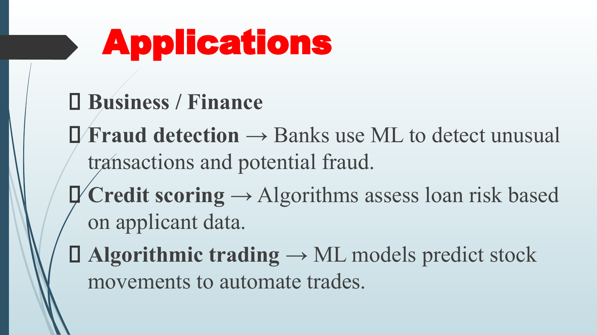

### Extracted Slide Text

- Applications
- Business / Finance
- Fraud detection → Banks use ML to detect unusual
- transactions and potential fraud.
- Credit scoring → Algorithms assess loan risk based
- on applicant data.
- Algorithmic trading → ML models predict stock
- movements to automate trades.

### Page Description And Teaching Notes

Slide type: concept explanation slide.
Main idea: Business / Finance Fraud detection → Banks use ML to detect unusual transactions and potential fraud. Credit scoring → Algorithms assess loan risk based on applicant data. Algorithmic trading → ML models predict stock.
This page explains a core concept in prose. The main task is to convert the definition into a clear statement of what the concept is, why it is used, and where it appears in a machine-learning workflow.
Detailed page understanding:
- `Business / Finance` is a core visible point. Explain what it means, why it matters, and how it connects to the slide title.
- `Fraud detection → Banks use ML to detect unusual` is an application/example point. Convert it into a concrete real-world case while teaching.
- `transactions and potential fraud.` is a core visible point. Explain what it means, why it matters, and how it connects to the slide title.
- `Credit scoring → Algorithms assess loan risk based` is a core visible point. Explain what it means, why it matters, and how it connects to the slide title.
- `on applicant data.` is a core visible point. Explain what it means, why it matters, and how it connects to the slide title.
- `Algorithmic trading → ML models predict stock` is a core visible point. Explain what it means, why it matters, and how it connects to the slide title.
- `movements to automate trades.` is a core visible point. Explain what it means, why it matters, and how it connects to the slide title.
Important visible terms: Applications Business, Finance Fraud, Banks, Credit, Algorithms, Algorithmic.
Visual/layout description: the embedded image preserves the actual slide. Describe the title area first, then read bullets, formulas, tables, arrows, grouped boxes, or diagrams in their visible order. If the slide contains a diagram, explain the relationship shown by arrows/positioning before explaining the text labels.
Teaching note: after reading the slide, ask the learner to restate the page in one or two sentences and give one example. For formula or metric slides, also ask what each variable or metric means and when it should be used.
Exam/viva note: prepare the slide title as a short-answer question, then use the bullets or visual labels as the expected answer points.

## Page 6: Applications

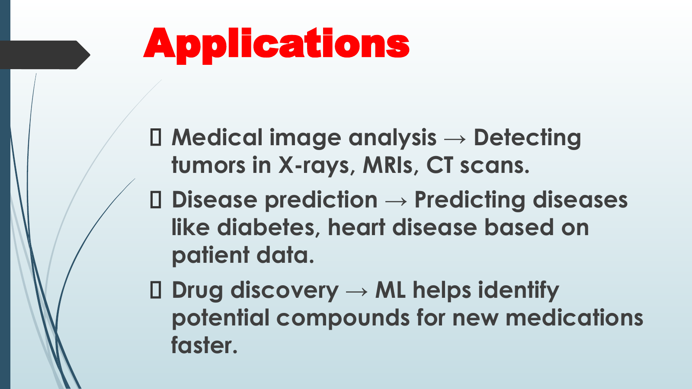

### Extracted Slide Text

- Applications
- Medical image analysis → Detecting
- tumors in X-rays, MRIs, CT scans.
- Disease prediction → Predicting diseases
- like diabetes, heart disease based on
- patient data.
- Drug discovery → ML helps identify
- potential compounds for new medications
- faster.

### Page Description And Teaching Notes

Slide type: concept explanation slide.
Main idea: Medical image analysis → Detecting tumors in X-rays, MRIs, CT scans. Disease prediction → Predicting diseases like diabetes, heart disease based on patient data. Drug discovery → ML helps identify.
This page explains a core concept in prose. The main task is to convert the definition into a clear statement of what the concept is, why it is used, and where it appears in a machine-learning workflow.
Detailed page understanding:
- `Medical image analysis → Detecting` is a core visible point. Explain what it means, why it matters, and how it connects to the slide title.
- `tumors in X-rays, MRIs, CT scans.` is a core visible point. Explain what it means, why it matters, and how it connects to the slide title.
- `Disease prediction → Predicting diseases` is a core visible point. Explain what it means, why it matters, and how it connects to the slide title.
- `like diabetes, heart disease based on` is a core visible point. Explain what it means, why it matters, and how it connects to the slide title.
- `patient data.` is a core visible point. Explain what it means, why it matters, and how it connects to the slide title.
- `Drug discovery → ML helps identify` states a benefit. Use it to justify why this method or concept is useful in a machine-learning workflow.
- `potential compounds for new medications` is a core visible point. Explain what it means, why it matters, and how it connects to the slide title.
- `faster.` is a core visible point. Explain what it means, why it matters, and how it connects to the slide title.
Important visible terms: Applications Medical, Detecting, X-rays, MRIs, Disease, Predicting, Drug.
Progressive reveal note: compared with the previous page, this page adds or exposes: Medical image analysis → Detecting; tumors in X-rays, MRIs, CT scans.; Disease prediction → Predicting diseases; like diabetes, heart disease based on; ...; faster..
Visual/layout description: the embedded image preserves the actual slide. Describe the title area first, then read bullets, formulas, tables, arrows, grouped boxes, or diagrams in their visible order. If the slide contains a diagram, explain the relationship shown by arrows/positioning before explaining the text labels.
Teaching note: after reading the slide, ask the learner to restate the page in one or two sentences and give one example. For formula or metric slides, also ask what each variable or metric means and when it should be used.
Exam/viva note: prepare the slide title as a short-answer question, then use the bullets or visual labels as the expected answer points.

## Page 7: Applications

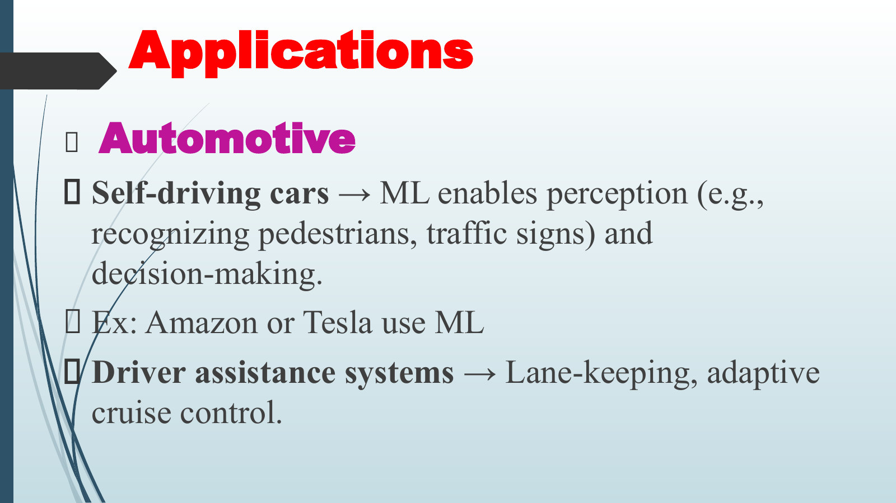

### Extracted Slide Text

- Applications
- Automotive
- Self-driving cars → ML enables perception (e.g.,
- recognizing pedestrians, traffic signs) and
- decision-making.
- Ex: Amazon or Tesla use ML
- Driver assistance systems → Lane-keeping, adaptive
- cruise control.

### Page Description And Teaching Notes

Slide type: concept explanation slide.
Main idea: Automotive Self-driving cars → ML enables perception (e.g., recognizing pedestrians, traffic signs) and decision-making. Ex: Amazon or Tesla use ML Driver assistance systems → Lane-keeping, adaptive.
This page explains a core concept in prose. The main task is to convert the definition into a clear statement of what the concept is, why it is used, and where it appears in a machine-learning workflow.
Detailed page understanding:
- `Automotive` is a core visible point. Explain what it means, why it matters, and how it connects to the slide title.
- `Self-driving cars → ML enables perception (e.g.,` is a core visible point. Explain what it means, why it matters, and how it connects to the slide title.
- `recognizing pedestrians, traffic signs) and` is a core visible point. Explain what it means, why it matters, and how it connects to the slide title.
- `decision-making.` is a core visible point. Explain what it means, why it matters, and how it connects to the slide title.
- `Ex: Amazon or Tesla use ML` is an application/example point. Convert it into a concrete real-world case while teaching.
- `Driver assistance systems → Lane-keeping, adaptive` is a core visible point. Explain what it means, why it matters, and how it connects to the slide title.
- `cruise control.` is a core visible point. Explain what it means, why it matters, and how it connects to the slide title.
Important visible terms: Applications Automotive Self-driving, Amazon, Tesla, ML Driver, Lane-keeping.
Progressive reveal note: compared with the previous page, this page adds or exposes: Automotive; Self-driving cars → ML enables perception (e.g.,; recognizing pedestrians, traffic signs) and; decision-making.; ...; cruise control..
Visual/layout description: the embedded image preserves the actual slide. Describe the title area first, then read bullets, formulas, tables, arrows, grouped boxes, or diagrams in their visible order. If the slide contains a diagram, explain the relationship shown by arrows/positioning before explaining the text labels.
Teaching note: after reading the slide, ask the learner to restate the page in one or two sentences and give one example. For formula or metric slides, also ask what each variable or metric means and when it should be used.
Exam/viva note: prepare the slide title as a short-answer question, then use the bullets or visual labels as the expected answer points.

## Page 8: Agriculture

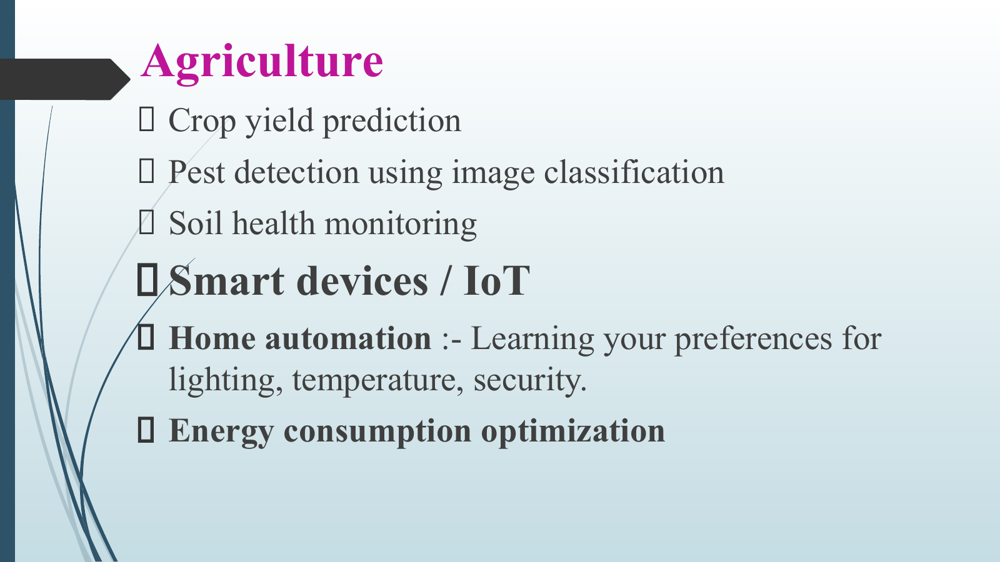

### Extracted Slide Text

- Agriculture
- Crop yield prediction
- Pest detection using image classification
- Soil health monitoring
- Smart devices / IoT
- Home automation :- Learning your preferences for
- lighting, temperature, security.
- Energy consumption optimization

### Page Description And Teaching Notes

Slide type: concept explanation slide.
Main idea: Crop yield prediction Pest detection using image classification Soil health monitoring Smart devices / IoT Home automation :- Learning your preferences for lighting, temperature, security.
This page explains a core concept in prose. The main task is to convert the definition into a clear statement of what the concept is, why it is used, and where it appears in a machine-learning workflow.
Detailed page understanding:
- `Crop yield prediction` is a core visible point. Explain what it means, why it matters, and how it connects to the slide title.
- `Pest detection using image classification` is a core visible point. Explain what it means, why it matters, and how it connects to the slide title.
- `Soil health monitoring` is a core visible point. Explain what it means, why it matters, and how it connects to the slide title.
- `Smart devices / IoT` is a core visible point. Explain what it means, why it matters, and how it connects to the slide title.
- `Home automation :- Learning your preferences for` is a core visible point. Explain what it means, why it matters, and how it connects to the slide title.
- `lighting, temperature, security.` is a core visible point. Explain what it means, why it matters, and how it connects to the slide title.
- `Energy consumption optimization` is a core visible point. Explain what it means, why it matters, and how it connects to the slide title.
Important visible terms: Agriculture Crop, Pest, Soil, Smart, IoT Home, Learning, Energy.
Visual/layout description: the embedded image preserves the actual slide. Describe the title area first, then read bullets, formulas, tables, arrows, grouped boxes, or diagrams in their visible order. If the slide contains a diagram, explain the relationship shown by arrows/positioning before explaining the text labels.
Teaching note: after reading the slide, ask the learner to restate the page in one or two sentences and give one example. For formula or metric slides, also ask what each variable or metric means and when it should be used.
Exam/viva note: prepare the slide title as a short-answer question, then use the bullets or visual labels as the expected answer points.

## Page 9: Entertainment

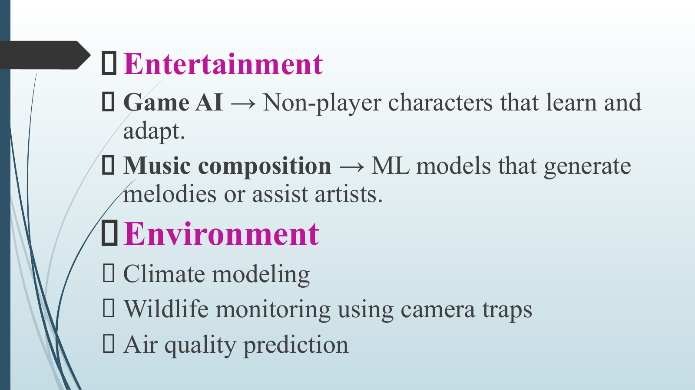

### Extracted Slide Text

- Entertainment
- Game AI → Non-player characters that learn and
- adapt.
- Music composition → ML models that generate
- melodies or assist artists.
- Environment
- Climate modeling
- Wildlife monitoring using camera traps
- Air quality prediction

### Page Description And Teaching Notes

Slide type: concept explanation slide.
Main idea: Game AI → Non-player characters that learn and adapt. Music composition → ML models that generate melodies or assist artists. Environment Climate modeling.
This page explains a core concept in prose. The main task is to convert the definition into a clear statement of what the concept is, why it is used, and where it appears in a machine-learning workflow.
Detailed page understanding:
- `Game AI → Non-player characters that learn and` is a core visible point. Explain what it means, why it matters, and how it connects to the slide title.
- `adapt.` is a core visible point. Explain what it means, why it matters, and how it connects to the slide title.
- `Music composition → ML models that generate` is a core visible point. Explain what it means, why it matters, and how it connects to the slide title.
- `melodies or assist artists.` is a core visible point. Explain what it means, why it matters, and how it connects to the slide title.
- `Environment` is a core visible point. Explain what it means, why it matters, and how it connects to the slide title.
- `Climate modeling` is a core visible point. Explain what it means, why it matters, and how it connects to the slide title.
- `Wildlife monitoring using camera traps` is a core visible point. Explain what it means, why it matters, and how it connects to the slide title.
- `Air quality prediction` is a core visible point. Explain what it means, why it matters, and how it connects to the slide title.
Important visible terms: Entertainment Game AI, Non-player, Music, Environment Climate, Wildlife, Air.
Visual/layout description: the embedded image preserves the actual slide. Describe the title area first, then read bullets, formulas, tables, arrows, grouped boxes, or diagrams in their visible order. If the slide contains a diagram, explain the relationship shown by arrows/positioning before explaining the text labels.
Teaching note: after reading the slide, ask the learner to restate the page in one or two sentences and give one example. For formula or metric slides, also ask what each variable or metric means and when it should be used.
Exam/viva note: prepare the slide title as a short-answer question, then use the bullets or visual labels as the expected answer points.

## Page 10: Major Categories of ML

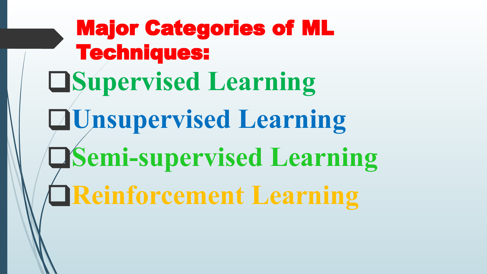

### Extracted Slide Text

- Major Categories of ML
- Techniques:
- ❑Supervised Learning
- ❑Unsupervised Learning
- ❑Semi-supervised Learning
- ❑Reinforcement Learning

### Page Description And Teaching Notes

Slide type: bullet explanation slide.
Main idea: Techniques: ❑Supervised Learning ❑Unsupervised Learning ❑Semi-supervised Learning ❑Reinforcement Learning.
This page breaks the topic into separate points. Each bullet should be treated as a distinct exam or viva talking point, with the learner able to define it and give a small example.
Detailed page understanding:
- `Techniques:` is a core visible point. Explain what it means, why it matters, and how it connects to the slide title.
- `❑Supervised Learning` is one item in the slide's list. Treat it as a separate subtopic and prepare a one-line explanation for it.
- `❑Unsupervised Learning` is one item in the slide's list. Treat it as a separate subtopic and prepare a one-line explanation for it.
- `❑Semi-supervised Learning` is one item in the slide's list. Treat it as a separate subtopic and prepare a one-line explanation for it.
- `❑Reinforcement Learning` is one item in the slide's list. Treat it as a separate subtopic and prepare a one-line explanation for it.
Important visible terms: Major Categories, ML Techniques, Supervised Learning, Unsupervised Learning, Semi-supervised Learning, Reinforcement Learning.
Visual/layout description: the embedded image preserves the actual slide. Describe the title area first, then read bullets, formulas, tables, arrows, grouped boxes, or diagrams in their visible order. If the slide contains a diagram, explain the relationship shown by arrows/positioning before explaining the text labels.
Teaching note: after reading the slide, ask the learner to restate the page in one or two sentences and give one example. For formula or metric slides, also ask what each variable or metric means and when it should be used.
Exam/viva note: prepare the slide title as a short-answer question, then use the bullets or visual labels as the expected answer points.

## Page 11: 1. Supervised Learning

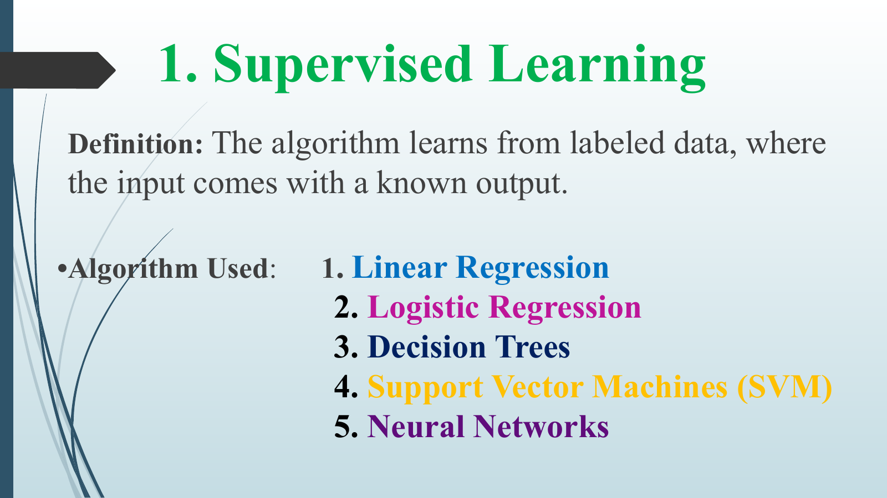

### Extracted Slide Text

- 1. Supervised Learning
- Definition: The algorithm learns from labeled data, where
- the input comes with a known output.
- •Algorithm Used: 1. Linear Regression
- 2. Logistic Regression
- 3. Decision Trees
- 4. Support Vector Machines (SVM)
- 5. Neural Networks

### Page Description And Teaching Notes

Slide type: bullet explanation slide.
Main idea: Definition: The algorithm learns from labeled data, where the input comes with a known output. •Algorithm Used: 1. Linear Regression 2. Logistic Regression 3. Decision Trees 4. Support Vector Machines (SVM).
This page breaks the topic into separate points. Each bullet should be treated as a distinct exam or viva talking point, with the learner able to define it and give a small example.
Detailed page understanding:
- `Definition: The algorithm learns from labeled data, where` gives the definition-level meaning. Explain it first in simple words, then connect it to how a model learns from data.
- `the input comes with a known output.` is a core visible point. Explain what it means, why it matters, and how it connects to the slide title.
- `•Algorithm Used: 1. Linear Regression` is an application/example point. Convert it into a concrete real-world case while teaching.
- `2. Logistic Regression` is one item in the slide's list. Treat it as a separate subtopic and prepare a one-line explanation for it.
- `3. Decision Trees` is one item in the slide's list. Treat it as a separate subtopic and prepare a one-line explanation for it.
- `4. Support Vector Machines (SVM)` is one item in the slide's list. Treat it as a separate subtopic and prepare a one-line explanation for it.
- `5. Neural Networks` is one item in the slide's list. Treat it as a separate subtopic and prepare a one-line explanation for it.
Important visible terms: Supervised Learning Definition, The, Algorithm Used, Linear Regression, Logistic Regression, Decision Trees, Support Vector Machines, SVM.
Visual/layout description: the embedded image preserves the actual slide. Describe the title area first, then read bullets, formulas, tables, arrows, grouped boxes, or diagrams in their visible order. If the slide contains a diagram, explain the relationship shown by arrows/positioning before explaining the text labels.
Teaching note: after reading the slide, ask the learner to restate the page in one or two sentences and give one example. For formula or metric slides, also ask what each variable or metric means and when it should be used.
Exam/viva note: prepare the slide title as a short-answer question, then use the bullets or visual labels as the expected answer points.

## Page 12: Linear Regression:

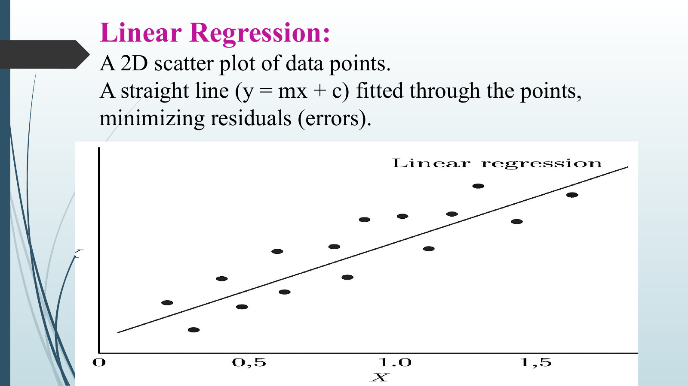

### Extracted Slide Text

- Linear Regression:
- A 2D scatter plot of data points.
- A straight line (y = mx + c) fitted through the points,
- minimizing residuals (errors).

### Page Description And Teaching Notes

Slide type: formula or calculation slide.
Main idea: A 2D scatter plot of data points. A straight line (y = mx + c) fitted through the points, minimizing residuals (errors).
This page should be read carefully because it introduces a calculation, objective, or optimization idea. Identify the variables in the formula, what quantity is being minimized or measured, and how the equation supports model training or evaluation.
Detailed page understanding:
- `A 2D scatter plot of data points.` is a core visible point. Explain what it means, why it matters, and how it connects to the slide title.
- `A straight line (y = mx + c) fitted through the points,` is a core visible point. Explain what it means, why it matters, and how it connects to the slide title.
- `minimizing residuals (errors).` is a limitation or risk. Mention when the method may fail and what alternative or precaution can reduce the issue.
Important visible terms: Linear Regression.
Visual/layout description: the embedded image preserves the actual slide. Describe the title area first, then read bullets, formulas, tables, arrows, grouped boxes, or diagrams in their visible order. If the slide contains a diagram, explain the relationship shown by arrows/positioning before explaining the text labels.
Teaching note: after reading the slide, ask the learner to restate the page in one or two sentences and give one example. For formula or metric slides, also ask what each variable or metric means and when it should be used.
Exam/viva note: prepare the slide title as a short-answer question, then use the bullets or visual labels as the expected answer points.

## Page 13: Logistic Regression: Logistic Regression is a

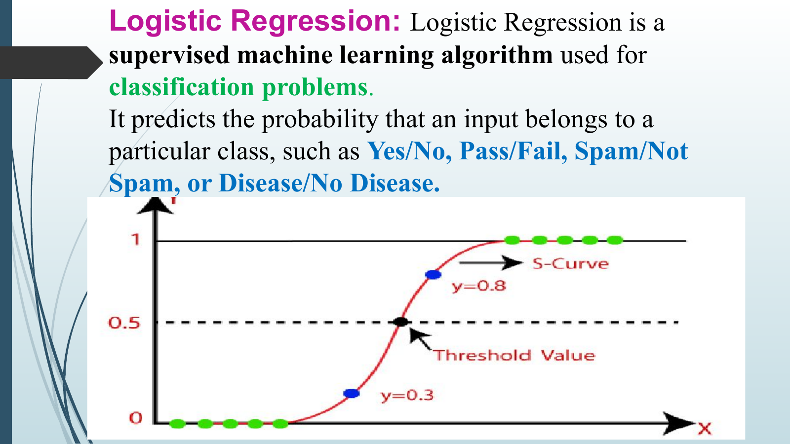

### Extracted Slide Text

- Logistic Regression: Logistic Regression is a
- supervised machine learning algorithm used for
- classification problems.
- It predicts the probability that an input belongs to a
- particular class, such as Yes/No, Pass/Fail, Spam/Not
- Spam, or Disease/No Disease.

### Page Description And Teaching Notes

Slide type: concept explanation slide.
Main idea: supervised machine learning algorithm used for classification problems. It predicts the probability that an input belongs to a particular class, such as Yes/No, Pass/Fail, Spam/Not Spam, or Disease/No Disease.
This page explains a core concept in prose. The main task is to convert the definition into a clear statement of what the concept is, why it is used, and where it appears in a machine-learning workflow.
Detailed page understanding:
- `supervised machine learning algorithm used for` is an application/example point. Convert it into a concrete real-world case while teaching.
- `classification problems.` is a limitation or risk. Mention when the method may fail and what alternative or precaution can reduce the issue.
- `It predicts the probability that an input belongs to a` is a core visible point. Explain what it means, why it matters, and how it connects to the slide title.
- `particular class, such as Yes/No, Pass/Fail, Spam/Not` is a core visible point. Explain what it means, why it matters, and how it connects to the slide title.
- `Spam, or Disease/No Disease.` is a core visible point. Explain what it means, why it matters, and how it connects to the slide title.
Important visible terms: Logistic Regression, Yes/No, Pass/Fail, Spam/Not Spam, Disease/No Disease.
Visual/layout description: the embedded image preserves the actual slide. Describe the title area first, then read bullets, formulas, tables, arrows, grouped boxes, or diagrams in their visible order. If the slide contains a diagram, explain the relationship shown by arrows/positioning before explaining the text labels.
Teaching note: after reading the slide, ask the learner to restate the page in one or two sentences and give one example. For formula or metric slides, also ask what each variable or metric means and when it should be used.
Exam/viva note: prepare the slide title as a short-answer question, then use the bullets or visual labels as the expected answer points.

## Page 14: Application of Supervised

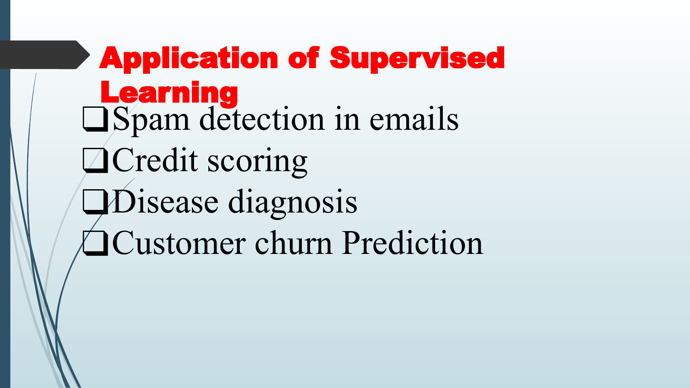

### Extracted Slide Text

- Application of Supervised
- Learning
- ❑Spam detection in emails
- ❑Credit scoring
- ❑Disease diagnosis
- ❑Customer churn Prediction

### Page Description And Teaching Notes

Slide type: bullet explanation slide.
Main idea: Learning ❑Spam detection in emails ❑Credit scoring ❑Disease diagnosis ❑Customer churn Prediction.
This page breaks the topic into separate points. Each bullet should be treated as a distinct exam or viva talking point, with the learner able to define it and give a small example.
Detailed page understanding:
- `Learning` is a core visible point. Explain what it means, why it matters, and how it connects to the slide title.
- `❑Spam detection in emails` is one item in the slide's list. Treat it as a separate subtopic and prepare a one-line explanation for it.
- `❑Credit scoring` is one item in the slide's list. Treat it as a separate subtopic and prepare a one-line explanation for it.
- `❑Disease diagnosis` is one item in the slide's list. Treat it as a separate subtopic and prepare a one-line explanation for it.
- `❑Customer churn Prediction` is one item in the slide's list. Treat it as a separate subtopic and prepare a one-line explanation for it.
Important visible terms: Application, Supervised Learning, Spam, Credit, Disease, Customer, Prediction.
Visual/layout description: the embedded image preserves the actual slide. Describe the title area first, then read bullets, formulas, tables, arrows, grouped boxes, or diagrams in their visible order. If the slide contains a diagram, explain the relationship shown by arrows/positioning before explaining the text labels.
Teaching note: after reading the slide, ask the learner to restate the page in one or two sentences and give one example. For formula or metric slides, also ask what each variable or metric means and when it should be used.
Exam/viva note: prepare the slide title as a short-answer question, then use the bullets or visual labels as the expected answer points.

## Page 15: 2. Unsupervised Learning

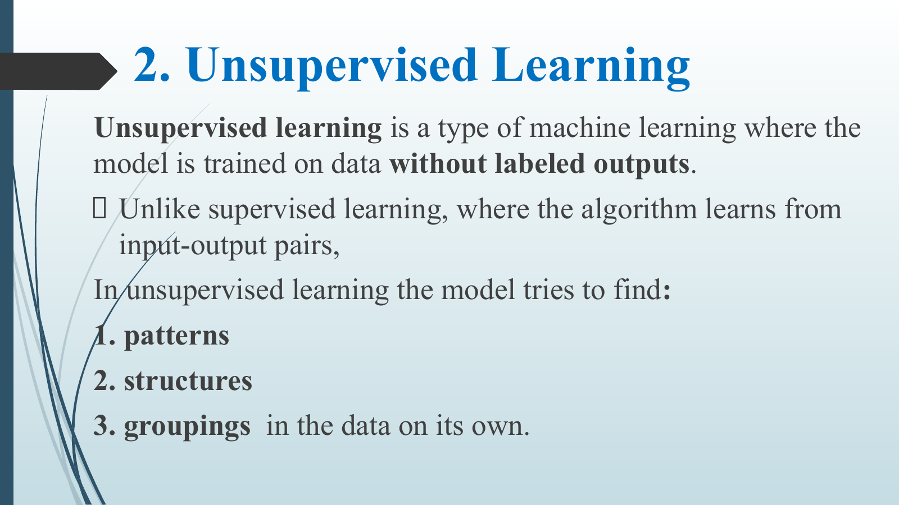

### Extracted Slide Text

- 2. Unsupervised Learning
- Unsupervised learning is a type of machine learning where the
- model is trained on data without labeled outputs.
- Unlike supervised learning, where the algorithm learns from
- input-output pairs,
- In unsupervised learning the model tries to find:
- 1. patterns
- 2. structures
- 3. groupings in the data on its own.

### Page Description And Teaching Notes

Slide type: bullet explanation slide.
Main idea: Unsupervised learning is a type of machine learning where the model is trained on data without labeled outputs. Unlike supervised learning, where the algorithm learns from input-output pairs, In unsupervised learning the model tries to find: 1. patterns.
This page breaks the topic into separate points. Each bullet should be treated as a distinct exam or viva talking point, with the learner able to define it and give a small example.
Detailed page understanding:
- `Unsupervised learning is a type of machine learning where the` gives the definition-level meaning. Explain it first in simple words, then connect it to how a model learns from data.
- `model is trained on data without labeled outputs.` is a core visible point. Explain what it means, why it matters, and how it connects to the slide title.
- `Unlike supervised learning, where the algorithm learns from` is a core visible point. Explain what it means, why it matters, and how it connects to the slide title.
- `input-output pairs,` is a core visible point. Explain what it means, why it matters, and how it connects to the slide title.
- `In unsupervised learning the model tries to find:` is a core visible point. Explain what it means, why it matters, and how it connects to the slide title.
- `1. patterns` is one item in the slide's list. Treat it as a separate subtopic and prepare a one-line explanation for it.
- `2. structures` is one item in the slide's list. Treat it as a separate subtopic and prepare a one-line explanation for it.
- `3. groupings in the data on its own.` is one item in the slide's list. Treat it as a separate subtopic and prepare a one-line explanation for it.
Important visible terms: Unsupervised Learning Unsupervised, Unlike.
Visual/layout description: the embedded image preserves the actual slide. Describe the title area first, then read bullets, formulas, tables, arrows, grouped boxes, or diagrams in their visible order. If the slide contains a diagram, explain the relationship shown by arrows/positioning before explaining the text labels.
Teaching note: after reading the slide, ask the learner to restate the page in one or two sentences and give one example. For formula or metric slides, also ask what each variable or metric means and when it should be used.
Exam/viva note: prepare the slide title as a short-answer question, then use the bullets or visual labels as the expected answer points.

## Page 16: Unsupervised learning works with unlabeled data, meaning

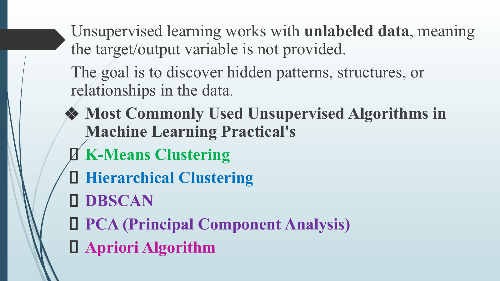

### Extracted Slide Text

- Unsupervised learning works with unlabeled data, meaning
- the target/output variable is not provided.
- The goal is to discover hidden patterns, structures, or
- relationships in the data.
- ❖ Most Commonly Used Unsupervised Algorithms in
- Machine Learning Practical's
- K-Means Clustering
- Hierarchical Clustering
- DBSCAN
- PCA (Principal Component Analysis)
- Apriori Algorithm

### Page Description And Teaching Notes

Slide type: concept explanation slide.
Main idea: the target/output variable is not provided. The goal is to discover hidden patterns, structures, or relationships in the data. ❖ Most Commonly Used Unsupervised Algorithms in Machine Learning Practical's K-Means Clustering.
This page explains a core concept in prose. The main task is to convert the definition into a clear statement of what the concept is, why it is used, and where it appears in a machine-learning workflow.
Detailed page understanding:
- `the target/output variable is not provided.` is a core visible point. Explain what it means, why it matters, and how it connects to the slide title.
- `The goal is to discover hidden patterns, structures, or` is a core visible point. Explain what it means, why it matters, and how it connects to the slide title.
- `relationships in the data.` is a core visible point. Explain what it means, why it matters, and how it connects to the slide title.
- `❖ Most Commonly Used Unsupervised Algorithms in` is an application/example point. Convert it into a concrete real-world case while teaching.
- `Machine Learning Practical's` is a core visible point. Explain what it means, why it matters, and how it connects to the slide title.
- `K-Means Clustering` is a core visible point. Explain what it means, why it matters, and how it connects to the slide title.
- `Hierarchical Clustering` is a core visible point. Explain what it means, why it matters, and how it connects to the slide title.
- `DBSCAN` is a core visible point. Explain what it means, why it matters, and how it connects to the slide title.
- `PCA (Principal Component Analysis)` is a core visible point. Explain what it means, why it matters, and how it connects to the slide title.
- `Apriori Algorithm` is a core visible point. Explain what it means, why it matters, and how it connects to the slide title.
Important visible terms: Unsupervised, The, Most Commonly Used Unsupervised, Algorithms, Machine Learning Practical, K-Means Clustering Hierarchical Clustering, DBSCAN PCA, Principal Component Analysis.
Visual/layout description: the embedded image preserves the actual slide. Describe the title area first, then read bullets, formulas, tables, arrows, grouped boxes, or diagrams in their visible order. If the slide contains a diagram, explain the relationship shown by arrows/positioning before explaining the text labels.
Teaching note: after reading the slide, ask the learner to restate the page in one or two sentences and give one example. For formula or metric slides, also ask what each variable or metric means and when it should be used.
Exam/viva note: prepare the slide title as a short-answer question, then use the bullets or visual labels as the expected answer points.

## Page 17: Characteristics:-

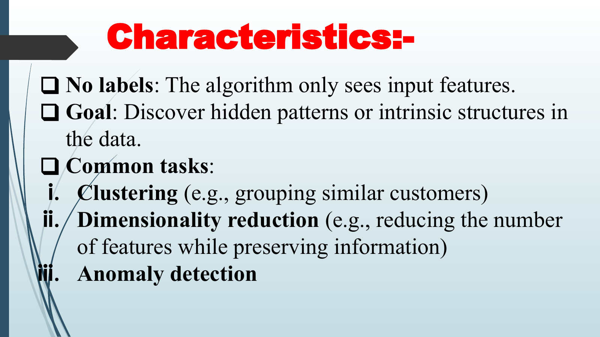

### Extracted Slide Text

- Characteristics:-
- ❑ No labels: The algorithm only sees input features.
- ❑ Goal: Discover hidden patterns or intrinsic structures in
- the data.
- ❑ Common tasks:
- i. Clustering (e.g., grouping similar customers)
- ii. Dimensionality reduction (e.g., reducing the number
- of features while preserving information)
- iii. Anomaly detection

### Page Description And Teaching Notes

Slide type: bullet explanation slide.
Main idea: ❑ No labels: The algorithm only sees input features. ❑ Goal: Discover hidden patterns or intrinsic structures in the data. ❑ Common tasks: i. Clustering (e.g., grouping similar customers) ii. Dimensionality reduction (e.g., reducing the number.
This page breaks the topic into separate points. Each bullet should be treated as a distinct exam or viva talking point, with the learner able to define it and give a small example.
Detailed page understanding:
- `❑ No labels: The algorithm only sees input features.` is one item in the slide's list. Treat it as a separate subtopic and prepare a one-line explanation for it.
- `❑ Goal: Discover hidden patterns or intrinsic structures in` is one item in the slide's list. Treat it as a separate subtopic and prepare a one-line explanation for it.
- `the data.` is a core visible point. Explain what it means, why it matters, and how it connects to the slide title.
- `❑ Common tasks:` is one item in the slide's list. Treat it as a separate subtopic and prepare a one-line explanation for it.
- `i. Clustering (e.g., grouping similar customers)` is a core visible point. Explain what it means, why it matters, and how it connects to the slide title.
- `ii. Dimensionality reduction (e.g., reducing the number` is a core visible point. Explain what it means, why it matters, and how it connects to the slide title.
- `of features while preserving information)` is a core visible point. Explain what it means, why it matters, and how it connects to the slide title.
- `iii. Anomaly detection` is a core visible point. Explain what it means, why it matters, and how it connects to the slide title.
Important visible terms: Characteristics, The, Goal, Discover, Common, Clustering, Dimensionality, Anomaly.
Visual/layout description: the embedded image preserves the actual slide. Describe the title area first, then read bullets, formulas, tables, arrows, grouped boxes, or diagrams in their visible order. If the slide contains a diagram, explain the relationship shown by arrows/positioning before explaining the text labels.
Teaching note: after reading the slide, ask the learner to restate the page in one or two sentences and give one example. For formula or metric slides, also ask what each variable or metric means and when it should be used.
Exam/viva note: prepare the slide title as a short-answer question, then use the bullets or visual labels as the expected answer points.

## Page 18: Algorithm Technique Main Use

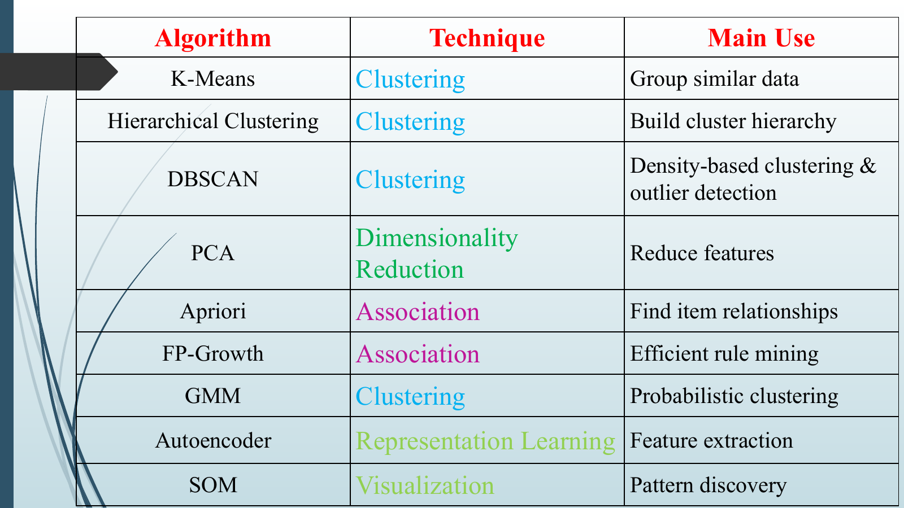

### Extracted Slide Text

- Algorithm Technique Main Use
- K-Means Clustering Group similar data
- Hierarchical Clustering Clustering Build cluster hierarchy
- Density-based clustering &
- DBSCAN Clustering outlier detection
- Dimensionality
- PCA Reduce features
- Reduction
- Apriori Association Find item relationships
- FP-Growth Association Efficient rule mining
- GMM Clustering Probabilistic clustering
- Autoencoder Representation Learning Feature extraction
- SOM Visualization Pattern discovery

### Page Description And Teaching Notes

Slide type: concept explanation slide.
Main idea: K-Means Clustering Group similar data Hierarchical Clustering Clustering Build cluster hierarchy Density-based clustering & DBSCAN Clustering outlier detection Dimensionality PCA Reduce features.
This page explains a core concept in prose. The main task is to convert the definition into a clear statement of what the concept is, why it is used, and where it appears in a machine-learning workflow.
Detailed page understanding:
- `K-Means Clustering Group similar data` is a core visible point. Explain what it means, why it matters, and how it connects to the slide title.
- `Hierarchical Clustering Clustering Build cluster hierarchy` is a core visible point. Explain what it means, why it matters, and how it connects to the slide title.
- `Density-based clustering &` is a core visible point. Explain what it means, why it matters, and how it connects to the slide title.
- `DBSCAN Clustering outlier detection` is a core visible point. Explain what it means, why it matters, and how it connects to the slide title.
- `Dimensionality` is a core visible point. Explain what it means, why it matters, and how it connects to the slide title.
- `PCA Reduce features` is a core visible point. Explain what it means, why it matters, and how it connects to the slide title.
- `Reduction` is a core visible point. Explain what it means, why it matters, and how it connects to the slide title.
- `Apriori Association Find item relationships` is a core visible point. Explain what it means, why it matters, and how it connects to the slide title.
- Additional bullets continue on the slide; use the extracted text list above for the complete wording.
- `SOM Visualization Pattern discovery` is a core visible point. Explain what it means, why it matters, and how it connects to the slide title.
Important visible terms: Algorithm Technique Main Use, K-Means Clustering Group, Hierarchical Clustering Clustering Build, Density-based, DBSCAN Clustering, Dimensionality PCA Reduce, Reduction Apriori Association Find, FP-Growth Association Efficient.
Visual/layout description: the embedded image preserves the actual slide. Describe the title area first, then read bullets, formulas, tables, arrows, grouped boxes, or diagrams in their visible order. If the slide contains a diagram, explain the relationship shown by arrows/positioning before explaining the text labels.
Teaching note: after reading the slide, ask the learner to restate the page in one or two sentences and give one example. For formula or metric slides, also ask what each variable or metric means and when it should be used.
Exam/viva note: prepare the slide title as a short-answer question, then use the bullets or visual labels as the expected answer points.

## Page 19: 3. Semi-supervised Learning

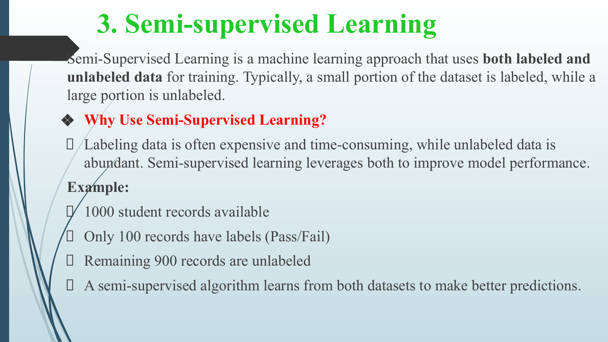

### Extracted Slide Text

- 3. Semi-supervised Learning
- Semi-Supervised Learning is a machine learning approach that uses both labeled and
- unlabeled data for training. Typically, a small portion of the dataset is labeled, while a
- large portion is unlabeled.
- ❖ Why Use Semi-Supervised Learning?
- Labeling data is often expensive and time-consuming, while unlabeled data is
- abundant. Semi-supervised learning leverages both to improve model performance.
- Example:
- 1000 student records available
- Only 100 records have labels (Pass/Fail)
- Remaining 900 records are unlabeled
- A semi-supervised algorithm learns from both datasets to make better predictions.

### Page Description And Teaching Notes

Slide type: bullet explanation slide.
Main idea: Semi-Supervised Learning is a machine learning approach that uses both labeled and unlabeled data for training. Typically, a small portion of the dataset is labeled, while a large portion is unlabeled. ❖ Why Use Semi-Supervised Learning? Labeling data is often expensive and time-consuming, while unlabeled data is abundant. Semi-supervised learning leverages both to improve model performance.
This page breaks the topic into separate points. Each bullet should be treated as a distinct exam or viva talking point, with the learner able to define it and give a small example.
Detailed page understanding:
- `Semi-Supervised Learning is a machine learning approach that uses both labeled and` gives the definition-level meaning. Explain it first in simple words, then connect it to how a model learns from data.
- `unlabeled data for training. Typically, a small portion of the dataset is labeled, while a` is a core visible point. Explain what it means, why it matters, and how it connects to the slide title.
- `large portion is unlabeled.` is a core visible point. Explain what it means, why it matters, and how it connects to the slide title.
- `❖ Why Use Semi-Supervised Learning?` is an application/example point. Convert it into a concrete real-world case while teaching.
- `Labeling data is often expensive and time-consuming, while unlabeled data is` is a core visible point. Explain what it means, why it matters, and how it connects to the slide title.
- `abundant. Semi-supervised learning leverages both to improve model performance.` is a core visible point. Explain what it means, why it matters, and how it connects to the slide title.
- `Example:` is an application/example point. Convert it into a concrete real-world case while teaching.
- `1000 student records available` is a core visible point. Explain what it means, why it matters, and how it connects to the slide title.
- Additional bullets continue on the slide; use the extracted text list above for the complete wording.
- `A semi-supervised algorithm learns from both datasets to make better predictions.` is a core visible point. Explain what it means, why it matters, and how it connects to the slide title.
Important visible terms: Semi-supervised Learning Semi-Supervised Learning, Typically, Why Use Semi-Supervised Learning, Labeling, Semi-supervised, Example, Only, Pass/Fail.
Visual/layout description: the embedded image preserves the actual slide. Describe the title area first, then read bullets, formulas, tables, arrows, grouped boxes, or diagrams in their visible order. If the slide contains a diagram, explain the relationship shown by arrows/positioning before explaining the text labels.
Teaching note: after reading the slide, ask the learner to restate the page in one or two sentences and give one example. For formula or metric slides, also ask what each variable or metric means and when it should be used.
Exam/viva note: prepare the slide title as a short-answer question, then use the bullets or visual labels as the expected answer points.

## Page 20: Applications

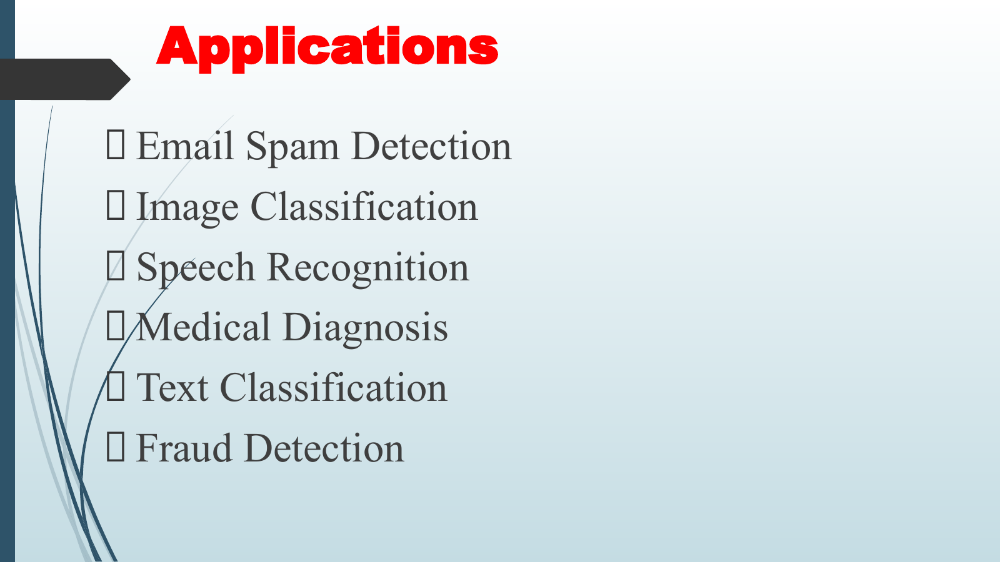

### Extracted Slide Text

- Applications
- Email Spam Detection
- Image Classification
- Speech Recognition
- Medical Diagnosis
- Text Classification
- Fraud Detection

### Page Description And Teaching Notes

Slide type: concept explanation slide.
Main idea: Email Spam Detection Image Classification Speech Recognition Medical Diagnosis Text Classification Fraud Detection.
This page explains a core concept in prose. The main task is to convert the definition into a clear statement of what the concept is, why it is used, and where it appears in a machine-learning workflow.
Detailed page understanding:
- `Email Spam Detection` is a core visible point. Explain what it means, why it matters, and how it connects to the slide title.
- `Image Classification` is a core visible point. Explain what it means, why it matters, and how it connects to the slide title.
- `Speech Recognition` is a core visible point. Explain what it means, why it matters, and how it connects to the slide title.
- `Medical Diagnosis` is a core visible point. Explain what it means, why it matters, and how it connects to the slide title.
- `Text Classification` is a core visible point. Explain what it means, why it matters, and how it connects to the slide title.
- `Fraud Detection` is a core visible point. Explain what it means, why it matters, and how it connects to the slide title.
Important visible terms: Applications Email Spam Detection, Image Classification Speech Recognition, Medical Diagnosis Text Classification, Fraud Detection.
Visual/layout description: the embedded image preserves the actual slide. Describe the title area first, then read bullets, formulas, tables, arrows, grouped boxes, or diagrams in their visible order. If the slide contains a diagram, explain the relationship shown by arrows/positioning before explaining the text labels.
Teaching note: after reading the slide, ask the learner to restate the page in one or two sentences and give one example. For formula or metric slides, also ask what each variable or metric means and when it should be used.
Exam/viva note: prepare the slide title as a short-answer question, then use the bullets or visual labels as the expected answer points.

## Page 21: 4. Reinforcement Learning

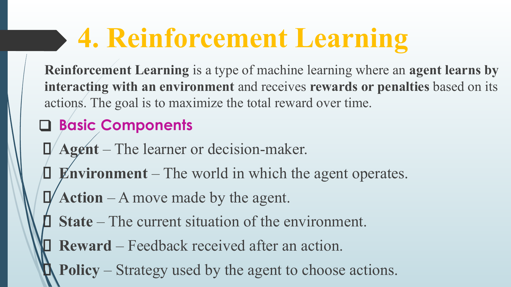

### Extracted Slide Text

- 4. Reinforcement Learning
- Reinforcement Learning is a type of machine learning where an agent learns by
- interacting with an environment and receives rewards or penalties based on its
- actions. The goal is to maximize the total reward over time.
- ❑ Basic Components
- Agent – The learner or decision-maker.
- Environment – The world in which the agent operates.
- Action – A move made by the agent.
- State – The current situation of the environment.
- Reward – Feedback received after an action.
- Policy – Strategy used by the agent to choose actions.

### Page Description And Teaching Notes

Slide type: bullet explanation slide.
Main idea: Reinforcement Learning is a type of machine learning where an agent learns by interacting with an environment and receives rewards or penalties based on its actions. The goal is to maximize the total reward over time. ❑ Basic Components Agent – The learner or decision-maker. Environment – The world in which the agent operates.
This page breaks the topic into separate points. Each bullet should be treated as a distinct exam or viva talking point, with the learner able to define it and give a small example.
Detailed page understanding:
- `Reinforcement Learning is a type of machine learning where an agent learns by` gives the definition-level meaning. Explain it first in simple words, then connect it to how a model learns from data.
- `interacting with an environment and receives rewards or penalties based on its` is a core visible point. Explain what it means, why it matters, and how it connects to the slide title.
- `actions. The goal is to maximize the total reward over time.` is a core visible point. Explain what it means, why it matters, and how it connects to the slide title.
- `❑ Basic Components` is one item in the slide's list. Treat it as a separate subtopic and prepare a one-line explanation for it.
- `Agent – The learner or decision-maker.` is a core visible point. Explain what it means, why it matters, and how it connects to the slide title.
- `Environment – The world in which the agent operates.` is a core visible point. Explain what it means, why it matters, and how it connects to the slide title.
- `Action – A move made by the agent.` is a core visible point. Explain what it means, why it matters, and how it connects to the slide title.
- `State – The current situation of the environment.` is a core visible point. Explain what it means, why it matters, and how it connects to the slide title.
- `Reward – Feedback received after an action.` is a core visible point. Explain what it means, why it matters, and how it connects to the slide title.
- `Policy – Strategy used by the agent to choose actions.` is an application/example point. Convert it into a concrete real-world case while teaching.
Important visible terms: Reinforcement Learning Reinforcement Learning, The, Basic Components Agent, Environment, Action, State, Reward, Feedback.
Visual/layout description: the embedded image preserves the actual slide. Describe the title area first, then read bullets, formulas, tables, arrows, grouped boxes, or diagrams in their visible order. If the slide contains a diagram, explain the relationship shown by arrows/positioning before explaining the text labels.
Teaching note: after reading the slide, ask the learner to restate the page in one or two sentences and give one example. For formula or metric slides, also ask what each variable or metric means and when it should be used.
Exam/viva note: prepare the slide title as a short-answer question, then use the bullets or visual labels as the expected answer points.

## Page 22: Working Process

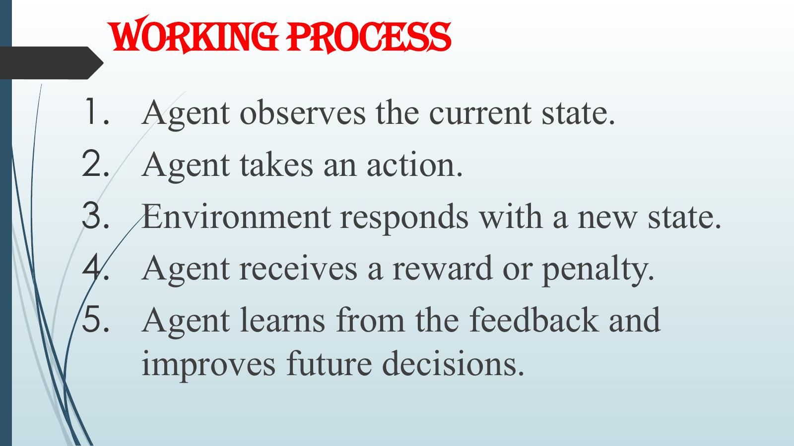

### Extracted Slide Text

- Working Process
- 1. Agent observes the current state.
- 2. Agent takes an action.
- 3. Environment responds with a new state.
- 4. Agent receives a reward or penalty.
- 5. Agent learns from the feedback and
- improves future decisions.

### Page Description And Teaching Notes

Slide type: process or diagram slide.
Main idea: 1. Agent observes the current state. 2. Agent takes an action. 3. Environment responds with a new state. 4. Agent receives a reward or penalty. 5. Agent learns from the feedback and improves future decisions.
This page describes a flow, algorithm, or sequence. Read the visual from start to finish and explain how each stage transforms data, parameters, or decisions into the next stage.
Detailed page understanding:
- `1. Agent observes the current state.` is one item in the slide's list. Treat it as a separate subtopic and prepare a one-line explanation for it.
- `2. Agent takes an action.` is one item in the slide's list. Treat it as a separate subtopic and prepare a one-line explanation for it.
- `3. Environment responds with a new state.` is one item in the slide's list. Treat it as a separate subtopic and prepare a one-line explanation for it.
- `4. Agent receives a reward or penalty.` is one item in the slide's list. Treat it as a separate subtopic and prepare a one-line explanation for it.
- `5. Agent learns from the feedback and` is one item in the slide's list. Treat it as a separate subtopic and prepare a one-line explanation for it.
- `improves future decisions.` states a benefit. Use it to justify why this method or concept is useful in a machine-learning workflow.
Important visible terms: Working Process, Agent, Environment.
Visual/layout description: the embedded image preserves the actual slide. Describe the title area first, then read bullets, formulas, tables, arrows, grouped boxes, or diagrams in their visible order. If the slide contains a diagram, explain the relationship shown by arrows/positioning before explaining the text labels.
Teaching note: after reading the slide, ask the learner to restate the page in one or two sentences and give one example. For formula or metric slides, also ask what each variable or metric means and when it should be used.
Exam/viva note: prepare the slide title as a short-answer question, then use the bullets or visual labels as the expected answer points.

## Page 23: Example: Maze Game

### Extracted Slide Text

- Example: Maze Game
- Agent: Robot
- Environment: Maze
- Action: Move Up, Down, Left, Right
- Reward: +10 for reaching the goal
- Penalty: -1 for hitting a wall
- The robot learns the shortest path by maximizing
- rewards.

### Page Description And Teaching Notes

Slide type: concept explanation slide.
Main idea: Agent: Robot Environment: Maze Action: Move Up, Down, Left, Right Reward: +10 for reaching the goal Penalty: -1 for hitting a wall The robot learns the shortest path by maximizing.
This page explains a core concept in prose. The main task is to convert the definition into a clear statement of what the concept is, why it is used, and where it appears in a machine-learning workflow.
Detailed page understanding:
- `Agent: Robot` is a core visible point. Explain what it means, why it matters, and how it connects to the slide title.
- `Environment: Maze` is a core visible point. Explain what it means, why it matters, and how it connects to the slide title.
- `Action: Move Up, Down, Left, Right` is a core visible point. Explain what it means, why it matters, and how it connects to the slide title.
- `Reward: +10 for reaching the goal` is a core visible point. Explain what it means, why it matters, and how it connects to the slide title.
- `Penalty: -1 for hitting a wall` is a core visible point. Explain what it means, why it matters, and how it connects to the slide title.
- `The robot learns the shortest path by maximizing` is a core visible point. Explain what it means, why it matters, and how it connects to the slide title.
- `rewards.` is a core visible point. Explain what it means, why it matters, and how it connects to the slide title.
Important visible terms: Example, Maze Game Agent, Robot Environment, Maze Action, Move Up, Down, Left, Right Reward.
Visual/layout description: the embedded image preserves the actual slide. Describe the title area first, then read bullets, formulas, tables, arrows, grouped boxes, or diagrams in their visible order. If the slide contains a diagram, explain the relationship shown by arrows/positioning before explaining the text labels.
Teaching note: after reading the slide, ask the learner to restate the page in one or two sentences and give one example. For formula or metric slides, also ask what each variable or metric means and when it should be used.
Exam/viva note: prepare the slide title as a short-answer question, then use the bullets or visual labels as the expected answer points.

## Page 24: Common Reinforcement Learning

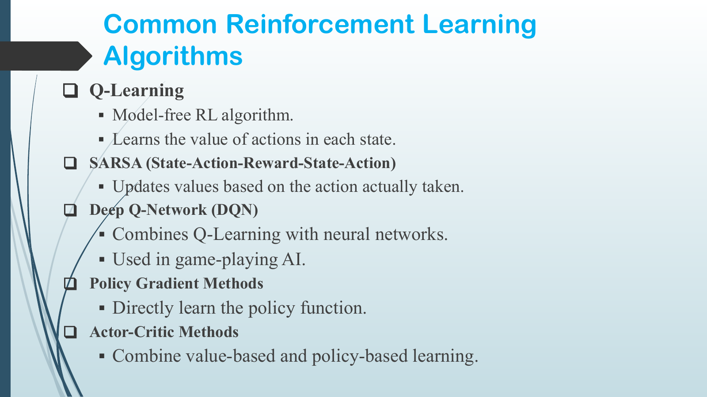

### Extracted Slide Text

- Common Reinforcement Learning
- Algorithms
- ❑ Q-Learning
- ▪ Model-free RL algorithm.
- ▪ Learns the value of actions in each state.
- ❑ SARSA (State-Action-Reward-State-Action)
- ▪ Updates values based on the action actually taken.
- ❑ Deep Q-Network (DQN)
- ▪ Combines Q-Learning with neural networks.
- ▪ Used in game-playing AI.
- ❑ Policy Gradient Methods
- ▪ Directly learn the policy function.
- ❑ Actor-Critic Methods
- ▪ Combine value-based and policy-based learning.

### Page Description And Teaching Notes

Slide type: bullet explanation slide.
Main idea: Algorithms ❑ Q-Learning ▪ Model-free RL algorithm. ▪ Learns the value of actions in each state. ❑ SARSA (State-Action-Reward-State-Action) ▪ Updates values based on the action actually taken.
This page breaks the topic into separate points. Each bullet should be treated as a distinct exam or viva talking point, with the learner able to define it and give a small example.
Detailed page understanding:
- `Algorithms` is a core visible point. Explain what it means, why it matters, and how it connects to the slide title.
- `❑ Q-Learning` is one item in the slide's list. Treat it as a separate subtopic and prepare a one-line explanation for it.
- `▪ Model-free RL algorithm.` is one item in the slide's list. Treat it as a separate subtopic and prepare a one-line explanation for it.
- `▪ Learns the value of actions in each state.` is one item in the slide's list. Treat it as a separate subtopic and prepare a one-line explanation for it.
- `❑ SARSA (State-Action-Reward-State-Action)` is one item in the slide's list. Treat it as a separate subtopic and prepare a one-line explanation for it.
- `▪ Updates values based on the action actually taken.` is one item in the slide's list. Treat it as a separate subtopic and prepare a one-line explanation for it.
- `❑ Deep Q-Network (DQN)` is one item in the slide's list. Treat it as a separate subtopic and prepare a one-line explanation for it.
- `▪ Combines Q-Learning with neural networks.` is one item in the slide's list. Treat it as a separate subtopic and prepare a one-line explanation for it.
- Additional bullets continue on the slide; use the extracted text list above for the complete wording.
- `▪ Combine value-based and policy-based learning.` is one item in the slide's list. Treat it as a separate subtopic and prepare a one-line explanation for it.
Important visible terms: Common Reinforcement Learning Algorithms, Q-Learning, Model-free RL, Learns, SARSA, State-Action-Reward-State-Action, Updates, Deep Q-Network.
Visual/layout description: the embedded image preserves the actual slide. Describe the title area first, then read bullets, formulas, tables, arrows, grouped boxes, or diagrams in their visible order. If the slide contains a diagram, explain the relationship shown by arrows/positioning before explaining the text labels.
Teaching note: after reading the slide, ask the learner to restate the page in one or two sentences and give one example. For formula or metric slides, also ask what each variable or metric means and when it should be used.
Exam/viva note: prepare the slide title as a short-answer question, then use the bullets or visual labels as the expected answer points.

## Page 25: Applications

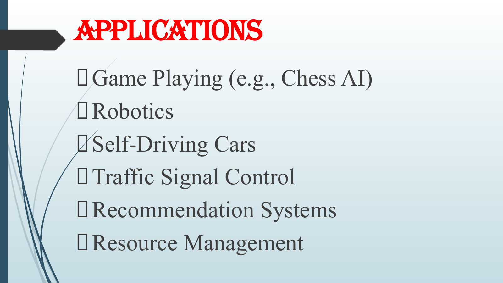

### Extracted Slide Text

- Applications
- Game Playing (e.g., Chess AI)
- Robotics
- Self-Driving Cars
- Traffic Signal Control
- Recommendation Systems
- Resource Management

### Page Description And Teaching Notes

Slide type: concept explanation slide.
Main idea: Game Playing (e.g., Chess AI) Robotics Self-Driving Cars Traffic Signal Control Recommendation Systems Resource Management.
This page explains a core concept in prose. The main task is to convert the definition into a clear statement of what the concept is, why it is used, and where it appears in a machine-learning workflow.
Detailed page understanding:
- `Game Playing (e.g., Chess AI)` is a core visible point. Explain what it means, why it matters, and how it connects to the slide title.
- `Robotics` is a core visible point. Explain what it means, why it matters, and how it connects to the slide title.
- `Self-Driving Cars` is a core visible point. Explain what it means, why it matters, and how it connects to the slide title.
- `Traffic Signal Control` is a core visible point. Explain what it means, why it matters, and how it connects to the slide title.
- `Recommendation Systems` is a core visible point. Explain what it means, why it matters, and how it connects to the slide title.
- `Resource Management` is a core visible point. Explain what it means, why it matters, and how it connects to the slide title.
Important visible terms: Applications Game Playing, Chess AI, Robotics Self-Driving Cars Traffic, Signal Control Recommendation Systems, Resource Management.
Visual/layout description: the embedded image preserves the actual slide. Describe the title area first, then read bullets, formulas, tables, arrows, grouped boxes, or diagrams in their visible order. If the slide contains a diagram, explain the relationship shown by arrows/positioning before explaining the text labels.
Teaching note: after reading the slide, ask the learner to restate the page in one or two sentences and give one example. For formula or metric slides, also ask what each variable or metric means and when it should be used.
Exam/viva note: prepare the slide title as a short-answer question, then use the bullets or visual labels as the expected answer points.

## Page 26: Comparison of all Learning Types

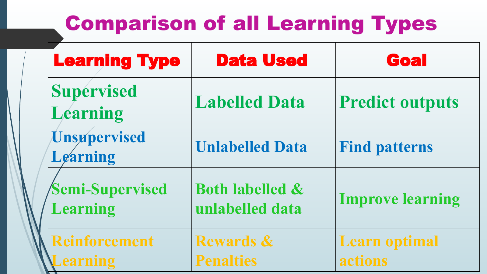

### Extracted Slide Text

- Comparison of all Learning Types
- Learning Type Data Used Goal
- Supervised
- Labelled Data Predict outputs
- Learning
- Unsupervised
- Unlabelled Data Find patterns
- Learning
- Semi-Supervised Both labelled &
- Improve learning
- Learning unlabelled data
- Reinforcement Rewards & Learn optimal
- Learning Penalties actions

### Page Description And Teaching Notes

Slide type: concept explanation slide.
Main idea: Learning Type Data Used Goal Supervised Labelled Data Predict outputs Learning Unsupervised Unlabelled Data Find patterns.
This page explains a core concept in prose. The main task is to convert the definition into a clear statement of what the concept is, why it is used, and where it appears in a machine-learning workflow.
Detailed page understanding:
- `Learning Type Data Used Goal` is an application/example point. Convert it into a concrete real-world case while teaching.
- `Supervised` is a core visible point. Explain what it means, why it matters, and how it connects to the slide title.
- `Labelled Data Predict outputs` is a core visible point. Explain what it means, why it matters, and how it connects to the slide title.
- `Learning` is a core visible point. Explain what it means, why it matters, and how it connects to the slide title.
- `Unsupervised` is a core visible point. Explain what it means, why it matters, and how it connects to the slide title.
- `Unlabelled Data Find patterns` is a core visible point. Explain what it means, why it matters, and how it connects to the slide title.
- `Learning` is a core visible point. Explain what it means, why it matters, and how it connects to the slide title.
- `Semi-Supervised Both labelled &` is a core visible point. Explain what it means, why it matters, and how it connects to the slide title.
- Additional bullets continue on the slide; use the extracted text list above for the complete wording.
- `Learning Penalties actions` is a core visible point. Explain what it means, why it matters, and how it connects to the slide title.
Important visible terms: Comparison, Learning Types Learning Type, Data Used Goal Supervised, Labelled Data Predict, Learning Unsupervised Unlabelled Data, Find, Learning Semi-Supervised Both, Improve.
Visual/layout description: the embedded image preserves the actual slide. Describe the title area first, then read bullets, formulas, tables, arrows, grouped boxes, or diagrams in their visible order. If the slide contains a diagram, explain the relationship shown by arrows/positioning before explaining the text labels.
Teaching note: after reading the slide, ask the learner to restate the page in one or two sentences and give one example. For formula or metric slides, also ask what each variable or metric means and when it should be used.
Exam/viva note: prepare the slide title as a short-answer question, then use the bullets or visual labels as the expected answer points.

## Page 27: Machine Learning PIPELINE

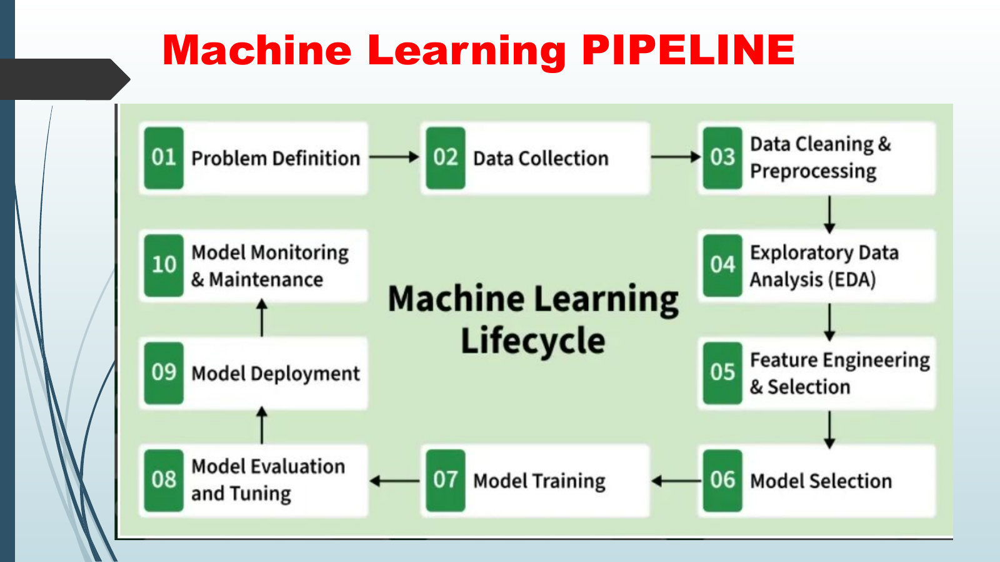

### Extracted Slide Text

- Machine Learning PIPELINE

### Page Description And Teaching Notes

Slide type: title or transition slide.
Main idea: the slide is visual-first, so the image should be treated as the source for the content and structure.
This page sets the context for the next topic. Treat it as a section marker: it tells the learner what concept or unit is starting before the deck moves into definitions, examples, or formulas.
- No reliable selectable text was extracted; use the slide image for the visible diagram, chart, or screenshot.
Important visible terms: Machine Learning PIPELINE.
Visual/layout description: the embedded image preserves the actual slide. Describe the title area first, then read bullets, formulas, tables, arrows, grouped boxes, or diagrams in their visible order. If the slide contains a diagram, explain the relationship shown by arrows/positioning before explaining the text labels.
Teaching note: after reading the slide, ask the learner to restate the page in one or two sentences and give one example. For formula or metric slides, also ask what each variable or metric means and when it should be used.
Exam/viva note: prepare the slide title as a short-answer question, then use the bullets or visual labels as the expected answer points.

## Page 28: Unit I - Introduction to Machine Learning Page 28

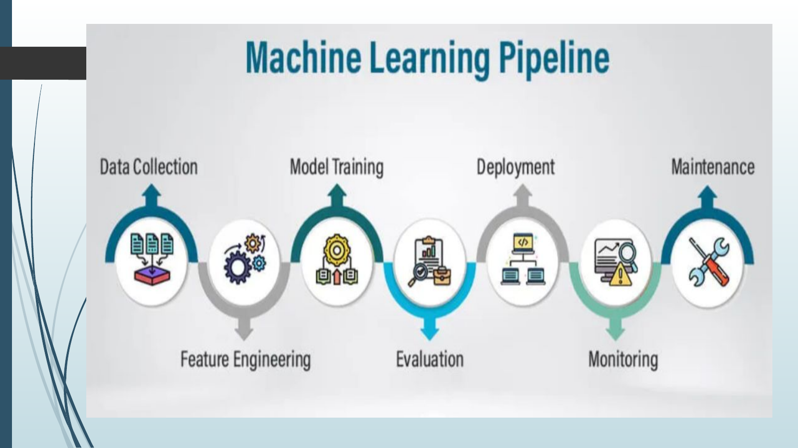

### Extracted Slide Text

- No selectable text extracted from this page.

### Page Description And Teaching Notes

Slide type: visual-only or image-heavy slide.
Main idea: the slide is visual-first, so the image should be treated as the source for the content and structure.
This page is primarily visual. The embedded slide image is the authoritative visual output; read it as a diagram or illustration first, then connect any visible labels to the surrounding pages.
- No reliable selectable text was extracted; use the slide image for the visible diagram, chart, or screenshot.
Visual/layout description: the embedded image preserves the actual slide. Describe the title area first, then read bullets, formulas, tables, arrows, grouped boxes, or diagrams in their visible order. If the slide contains a diagram, explain the relationship shown by arrows/positioning before explaining the text labels.
Teaching note: after reading the slide, ask the learner to restate the page in one or two sentences and give one example. For formula or metric slides, also ask what each variable or metric means and when it should be used.
Exam/viva note: prepare the slide title as a short-answer question, then use the bullets or visual labels as the expected answer points.

## Page 29: Unit I - Introduction to Machine Learning Page 29

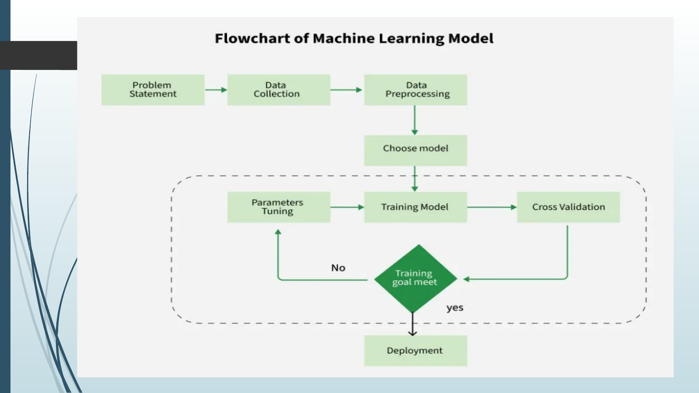

### Extracted Slide Text

- No selectable text extracted from this page.

### Page Description And Teaching Notes

Slide type: visual-only or image-heavy slide.
Main idea: the slide is visual-first, so the image should be treated as the source for the content and structure.
This page is primarily visual. The embedded slide image is the authoritative visual output; read it as a diagram or illustration first, then connect any visible labels to the surrounding pages.
- No reliable selectable text was extracted; use the slide image for the visible diagram, chart, or screenshot.
Visual/layout description: the embedded image preserves the actual slide. Describe the title area first, then read bullets, formulas, tables, arrows, grouped boxes, or diagrams in their visible order. If the slide contains a diagram, explain the relationship shown by arrows/positioning before explaining the text labels.
Teaching note: after reading the slide, ask the learner to restate the page in one or two sentences and give one example. For formula or metric slides, also ask what each variable or metric means and when it should be used.
Exam/viva note: prepare the slide title as a short-answer question, then use the bullets or visual labels as the expected answer points.

## Page 30: Step 1: Problem Definition

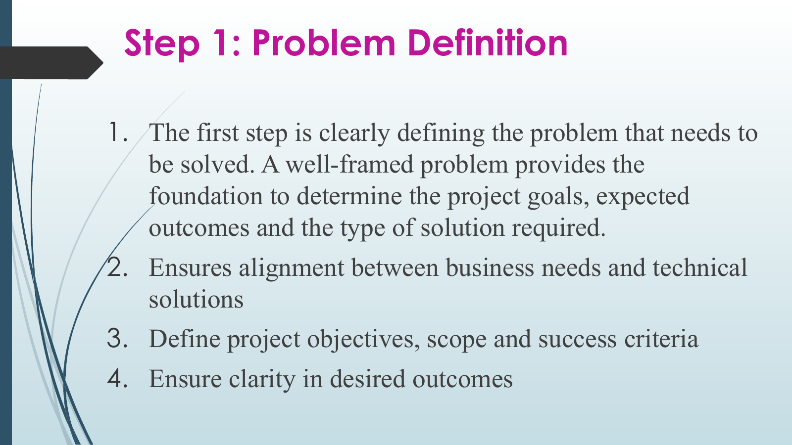

### Extracted Slide Text

- Step 1: Problem Definition
- 1. The first step is clearly defining the problem that needs to
- be solved. A well-framed problem provides the
- foundation to determine the project goals, expected
- outcomes and the type of solution required.
- 2. Ensures alignment between business needs and technical
- solutions
- 3. Define project objectives, scope and success criteria
- 4. Ensure clarity in desired outcomes

### Page Description And Teaching Notes

Slide type: bullet explanation slide.
Main idea: 1. The first step is clearly defining the problem that needs to be solved. A well-framed problem provides the foundation to determine the project goals, expected outcomes and the type of solution required. 2. Ensures alignment between business needs and technical solutions.
This page breaks the topic into separate points. Each bullet should be treated as a distinct exam or viva talking point, with the learner able to define it and give a small example.
Detailed page understanding:
- `1. The first step is clearly defining the problem that needs to` is a limitation or risk. Mention when the method may fail and what alternative or precaution can reduce the issue.
- `be solved. A well-framed problem provides the` is a limitation or risk. Mention when the method may fail and what alternative or precaution can reduce the issue.
- `foundation to determine the project goals, expected` is a core visible point. Explain what it means, why it matters, and how it connects to the slide title.
- `outcomes and the type of solution required.` is a core visible point. Explain what it means, why it matters, and how it connects to the slide title.
- `2. Ensures alignment between business needs and technical` is one item in the slide's list. Treat it as a separate subtopic and prepare a one-line explanation for it.
- `solutions` is a core visible point. Explain what it means, why it matters, and how it connects to the slide title.
- `3. Define project objectives, scope and success criteria` is one item in the slide's list. Treat it as a separate subtopic and prepare a one-line explanation for it.
- `4. Ensure clarity in desired outcomes` is one item in the slide's list. Treat it as a separate subtopic and prepare a one-line explanation for it.
Important visible terms: Step, Problem Definition, The, Ensures, Define, Ensure.
Visual/layout description: the embedded image preserves the actual slide. Describe the title area first, then read bullets, formulas, tables, arrows, grouped boxes, or diagrams in their visible order. If the slide contains a diagram, explain the relationship shown by arrows/positioning before explaining the text labels.
Teaching note: after reading the slide, ask the learner to restate the page in one or two sentences and give one example. For formula or metric slides, also ask what each variable or metric means and when it should be used.
Exam/viva note: prepare the slide title as a short-answer question, then use the bullets or visual labels as the expected answer points.

## Page 31: Step 2: Data Collection

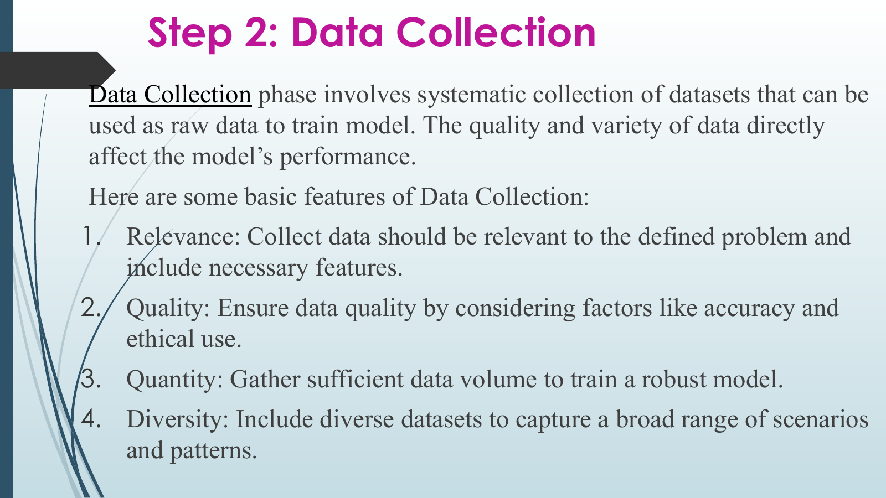

### Extracted Slide Text

- Step 2: Data Collection
- Data Collection phase involves systematic collection of datasets that can be
- used as raw data to train model. The quality and variety of data directly
- affect the model’s performance.
- Here are some basic features of Data Collection:
- 1. Relevance: Collect data should be relevant to the defined problem and
- include necessary features.
- 2. Quality: Ensure data quality by considering factors like accuracy and
- ethical use.
- 3. Quantity: Gather sufficient data volume to train a robust model.
- 4. Diversity: Include diverse datasets to capture a broad range of scenarios
- and patterns.

### Page Description And Teaching Notes

Slide type: metric/table slide.
Main idea: Data Collection phase involves systematic collection of datasets that can be used as raw data to train model. The quality and variety of data directly affect the model’s performance. Here are some basic features of Data Collection: 1. Relevance: Collect data should be relevant to the defined problem and include necessary features.
This page organizes evaluation or comparison information. Focus on what each metric measures, when it is useful, and what mistake it prevents when judging a machine-learning model.
Detailed page understanding:
- `Data Collection phase involves systematic collection of datasets that can be` is a core visible point. Explain what it means, why it matters, and how it connects to the slide title.
- `used as raw data to train model. The quality and variety of data directly` is an application/example point. Convert it into a concrete real-world case while teaching.
- `affect the model’s performance.` is a core visible point. Explain what it means, why it matters, and how it connects to the slide title.
- `Here are some basic features of Data Collection:` is a core visible point. Explain what it means, why it matters, and how it connects to the slide title.
- `1. Relevance: Collect data should be relevant to the defined problem and` is a limitation or risk. Mention when the method may fail and what alternative or precaution can reduce the issue.
- `include necessary features.` is a core visible point. Explain what it means, why it matters, and how it connects to the slide title.
- `2. Quality: Ensure data quality by considering factors like accuracy and` is one item in the slide's list. Treat it as a separate subtopic and prepare a one-line explanation for it.
- `ethical use.` is an application/example point. Convert it into a concrete real-world case while teaching.
- Additional bullets continue on the slide; use the extracted text list above for the complete wording.
- `and patterns.` is a core visible point. Explain what it means, why it matters, and how it connects to the slide title.
Important visible terms: Step, Data Collection Data Collection, The, Here, Data Collection, Relevance, Collect, Quality.
Visual/layout description: the embedded image preserves the actual slide. Describe the title area first, then read bullets, formulas, tables, arrows, grouped boxes, or diagrams in their visible order. If the slide contains a diagram, explain the relationship shown by arrows/positioning before explaining the text labels.
Teaching note: after reading the slide, ask the learner to restate the page in one or two sentences and give one example. For formula or metric slides, also ask what each variable or metric means and when it should be used.
Exam/viva note: prepare the slide title as a short-answer question, then use the bullets or visual labels as the expected answer points.

## Page 32: Step 3: Data Cleaning and

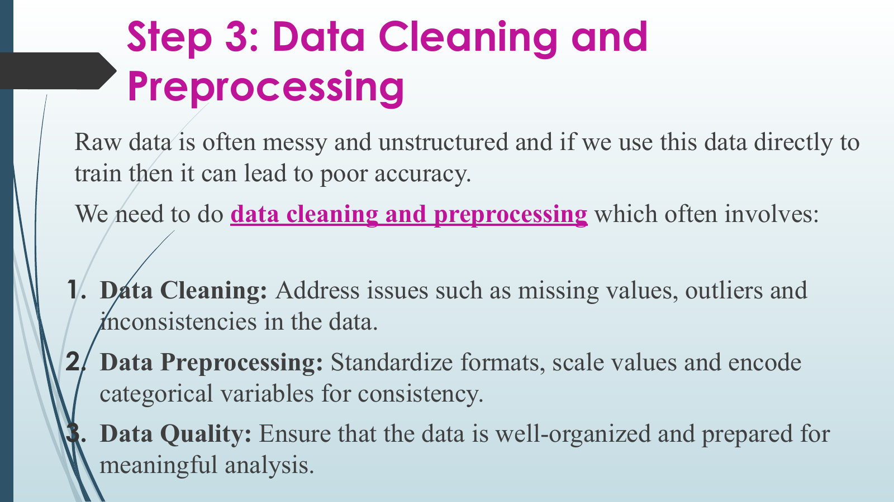

### Extracted Slide Text

- Step 3: Data Cleaning and
- Preprocessing
- Raw data is often messy and unstructured and if we use this data directly to
- train then it can lead to poor accuracy.
- We need to do data cleaning and preprocessing which often involves:
- 1. Data Cleaning: Address issues such as missing values, outliers and
- inconsistencies in the data.
- 2. Data Preprocessing: Standardize formats, scale values and encode
- categorical variables for consistency.
- 3. Data Quality: Ensure that the data is well-organized and prepared for
- meaningful analysis.

### Page Description And Teaching Notes

Slide type: metric/table slide.
Main idea: Preprocessing Raw data is often messy and unstructured and if we use this data directly to train then it can lead to poor accuracy. We need to do data cleaning and preprocessing which often involves: 1. Data Cleaning: Address issues such as missing values, outliers and inconsistencies in the data.
This page organizes evaluation or comparison information. Focus on what each metric measures, when it is useful, and what mistake it prevents when judging a machine-learning model.
Detailed page understanding:
- `Preprocessing` is a core visible point. Explain what it means, why it matters, and how it connects to the slide title.
- `Raw data is often messy and unstructured and if we use this data directly to` is an application/example point. Convert it into a concrete real-world case while teaching.
- `train then it can lead to poor accuracy.` is a core visible point. Explain what it means, why it matters, and how it connects to the slide title.
- `We need to do data cleaning and preprocessing which often involves:` is a core visible point. Explain what it means, why it matters, and how it connects to the slide title.
- `1. Data Cleaning: Address issues such as missing values, outliers and` is one item in the slide's list. Treat it as a separate subtopic and prepare a one-line explanation for it.
- `inconsistencies in the data.` is a core visible point. Explain what it means, why it matters, and how it connects to the slide title.
- `2. Data Preprocessing: Standardize formats, scale values and encode` is one item in the slide's list. Treat it as a separate subtopic and prepare a one-line explanation for it.
- `categorical variables for consistency.` is a core visible point. Explain what it means, why it matters, and how it connects to the slide title.
- `3. Data Quality: Ensure that the data is well-organized and prepared for` is one item in the slide's list. Treat it as a separate subtopic and prepare a one-line explanation for it.
- `meaningful analysis.` is a core visible point. Explain what it means, why it matters, and how it connects to the slide title.
Important visible terms: Step, Data Cleaning, Preprocessing Raw, Address, Data Preprocessing, Standardize, Data Quality, Ensure.
Visual/layout description: the embedded image preserves the actual slide. Describe the title area first, then read bullets, formulas, tables, arrows, grouped boxes, or diagrams in their visible order. If the slide contains a diagram, explain the relationship shown by arrows/positioning before explaining the text labels.
Teaching note: after reading the slide, ask the learner to restate the page in one or two sentences and give one example. For formula or metric slides, also ask what each variable or metric means and when it should be used.
Exam/viva note: prepare the slide title as a short-answer question, then use the bullets or visual labels as the expected answer points.

## Page 33: Step 4: Exploratory Data Analysis

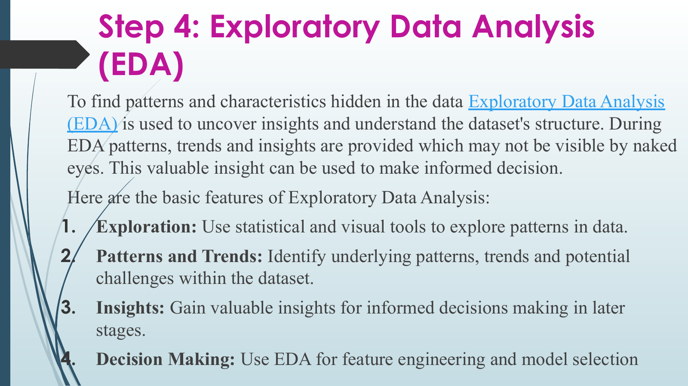

### Extracted Slide Text

- Step 4: Exploratory Data Analysis
- (EDA)
- To find patterns and characteristics hidden in the data Exploratory Data Analysis
- (EDA) is used to uncover insights and understand the dataset's structure. During
- EDA patterns, trends and insights are provided which may not be visible by naked
- eyes. This valuable insight can be used to make informed decision.
- Here are the basic features of Exploratory Data Analysis:
- 1. Exploration: Use statistical and visual tools to explore patterns in data.
- 2. Patterns and Trends: Identify underlying patterns, trends and potential
- challenges within the dataset.
- 3. Insights: Gain valuable insights for informed decisions making in later
- stages.
- 4. Decision Making: Use EDA for feature engineering and model selection

### Page Description And Teaching Notes

Slide type: bullet explanation slide.
Main idea: (EDA) To find patterns and characteristics hidden in the data Exploratory Data Analysis (EDA) is used to uncover insights and understand the dataset's structure. During EDA patterns, trends and insights are provided which may not be visible by naked eyes. This valuable insight can be used to make informed decision. Here are the basic features of Exploratory Data Analysis:.
This page breaks the topic into separate points. Each bullet should be treated as a distinct exam or viva talking point, with the learner able to define it and give a small example.
Detailed page understanding:
- `(EDA)` is a core visible point. Explain what it means, why it matters, and how it connects to the slide title.
- `To find patterns and characteristics hidden in the data Exploratory Data Analysis` is a core visible point. Explain what it means, why it matters, and how it connects to the slide title.
- `(EDA) is used to uncover insights and understand the dataset's structure. During` is an application/example point. Convert it into a concrete real-world case while teaching.
- `EDA patterns, trends and insights are provided which may not be visible by naked` is a core visible point. Explain what it means, why it matters, and how it connects to the slide title.
- `eyes. This valuable insight can be used to make informed decision.` is an application/example point. Convert it into a concrete real-world case while teaching.
- `Here are the basic features of Exploratory Data Analysis:` is a core visible point. Explain what it means, why it matters, and how it connects to the slide title.
- `1. Exploration: Use statistical and visual tools to explore patterns in data.` is an application/example point. Convert it into a concrete real-world case while teaching.
- `2. Patterns and Trends: Identify underlying patterns, trends and potential` is one item in the slide's list. Treat it as a separate subtopic and prepare a one-line explanation for it.
- Additional bullets continue on the slide; use the extracted text list above for the complete wording.
- `4. Decision Making: Use EDA for feature engineering and model selection` is an application/example point. Convert it into a concrete real-world case while teaching.
Important visible terms: Step, Exploratory Data Analysis, EDA, During EDA, This, Here, Exploration, Use.
Visual/layout description: the embedded image preserves the actual slide. Describe the title area first, then read bullets, formulas, tables, arrows, grouped boxes, or diagrams in their visible order. If the slide contains a diagram, explain the relationship shown by arrows/positioning before explaining the text labels.
Teaching note: after reading the slide, ask the learner to restate the page in one or two sentences and give one example. For formula or metric slides, also ask what each variable or metric means and when it should be used.
Exam/viva note: prepare the slide title as a short-answer question, then use the bullets or visual labels as the expected answer points.

## Page 34: Step 5: Feature Engineering and

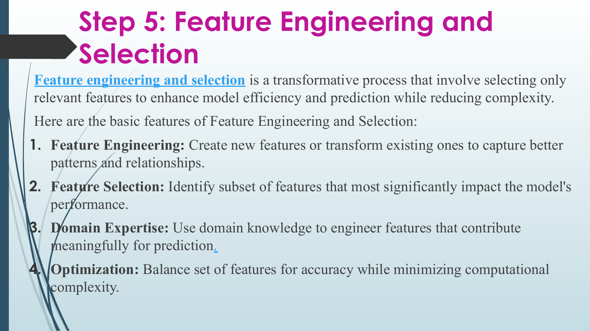

### Extracted Slide Text

- Step 5: Feature Engineering and
- Selection
- Feature engineering and selection is a transformative process that involve selecting only
- relevant features to enhance model efficiency and prediction while reducing complexity.
- Here are the basic features of Feature Engineering and Selection:
- 1. Feature Engineering: Create new features or transform existing ones to capture better
- patterns and relationships.
- 2. Feature Selection: Identify subset of features that most significantly impact the model's
- performance.
- 3. Domain Expertise: Use domain knowledge to engineer features that contribute
- meaningfully for prediction.
- 4. Optimization: Balance set of features for accuracy while minimizing computational
- complexity.

### Page Description And Teaching Notes

Slide type: metric/table slide.
Main idea: Selection Feature engineering and selection is a transformative process that involve selecting only relevant features to enhance model efficiency and prediction while reducing complexity. Here are the basic features of Feature Engineering and Selection: 1. Feature Engineering: Create new features or transform existing ones to capture better patterns and relationships.
This page organizes evaluation or comparison information. Focus on what each metric measures, when it is useful, and what mistake it prevents when judging a machine-learning model.
Detailed page understanding:
- `Selection` is a core visible point. Explain what it means, why it matters, and how it connects to the slide title.
- `Feature engineering and selection is a transformative process that involve selecting only` gives the definition-level meaning. Explain it first in simple words, then connect it to how a model learns from data.
- `relevant features to enhance model efficiency and prediction while reducing complexity.` is a core visible point. Explain what it means, why it matters, and how it connects to the slide title.
- `Here are the basic features of Feature Engineering and Selection:` is a core visible point. Explain what it means, why it matters, and how it connects to the slide title.
- `1. Feature Engineering: Create new features or transform existing ones to capture better` is one item in the slide's list. Treat it as a separate subtopic and prepare a one-line explanation for it.
- `patterns and relationships.` is a core visible point. Explain what it means, why it matters, and how it connects to the slide title.
- `2. Feature Selection: Identify subset of features that most significantly impact the model's` is one item in the slide's list. Treat it as a separate subtopic and prepare a one-line explanation for it.
- `performance.` is a core visible point. Explain what it means, why it matters, and how it connects to the slide title.
- Additional bullets continue on the slide; use the extracted text list above for the complete wording.
- `complexity.` is a core visible point. Explain what it means, why it matters, and how it connects to the slide title.
Important visible terms: Step, Feature Engineering, Selection Feature, Here, Selection, Create, Feature Selection, Identify.
Visual/layout description: the embedded image preserves the actual slide. Describe the title area first, then read bullets, formulas, tables, arrows, grouped boxes, or diagrams in their visible order. If the slide contains a diagram, explain the relationship shown by arrows/positioning before explaining the text labels.
Teaching note: after reading the slide, ask the learner to restate the page in one or two sentences and give one example. For formula or metric slides, also ask what each variable or metric means and when it should be used.
Exam/viva note: prepare the slide title as a short-answer question, then use the bullets or visual labels as the expected answer points.

## Page 35: Aspect Feature Selection Feature Engineering

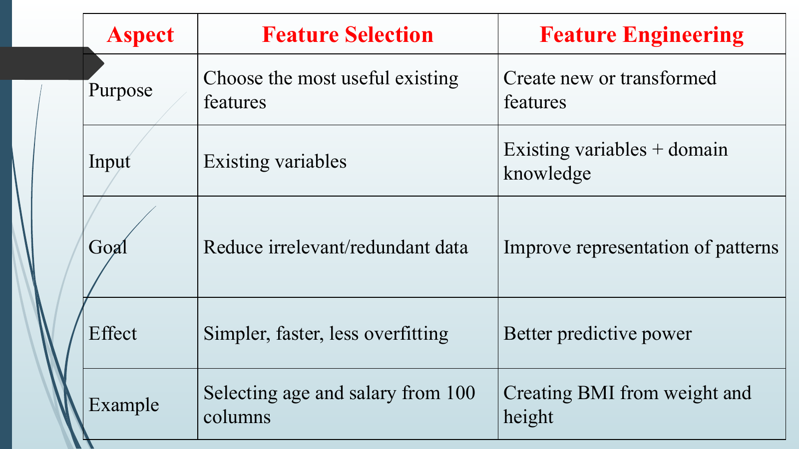

### Extracted Slide Text

- Aspect Feature Selection Feature Engineering
- Choose the most useful existing Create new or transformed
- Purpose
- features features
- Existing variables + domain
- Input Existing variables
- knowledge
- Goal Reduce irrelevant/redundant data Improve representation of patterns
- Effect Simpler, faster, less overfitting Better predictive power
- Selecting age and salary from 100 Creating BMI from weight and
- Example
- columns height

### Page Description And Teaching Notes

Slide type: concept explanation slide.
Main idea: Choose the most useful existing Create new or transformed Purpose features features Existing variables + domain Input Existing variables knowledge.
This page explains a core concept in prose. The main task is to convert the definition into a clear statement of what the concept is, why it is used, and where it appears in a machine-learning workflow.
Detailed page understanding:
- `Choose the most useful existing Create new or transformed` is an application/example point. Convert it into a concrete real-world case while teaching.
- `Purpose` is a core visible point. Explain what it means, why it matters, and how it connects to the slide title.
- `features features` is a core visible point. Explain what it means, why it matters, and how it connects to the slide title.
- `Existing variables + domain` is a core visible point. Explain what it means, why it matters, and how it connects to the slide title.
- `Input Existing variables` is a core visible point. Explain what it means, why it matters, and how it connects to the slide title.
- `knowledge` is a core visible point. Explain what it means, why it matters, and how it connects to the slide title.
- `Goal Reduce irrelevant/redundant data Improve representation of patterns` is a core visible point. Explain what it means, why it matters, and how it connects to the slide title.
- `Effect Simpler, faster, less overfitting Better predictive power` is a core visible point. Explain what it means, why it matters, and how it connects to the slide title.
- Additional bullets continue on the slide; use the extracted text list above for the complete wording.
- `columns height` is a core visible point. Explain what it means, why it matters, and how it connects to the slide title.
Important visible terms: Aspect Feature Selection Feature, Engineering Choose, Create, Purpose, Existing, Input Existing, Goal Reduce, Improve.
Visual/layout description: the embedded image preserves the actual slide. Describe the title area first, then read bullets, formulas, tables, arrows, grouped boxes, or diagrams in their visible order. If the slide contains a diagram, explain the relationship shown by arrows/positioning before explaining the text labels.
Teaching note: after reading the slide, ask the learner to restate the page in one or two sentences and give one example. For formula or metric slides, also ask what each variable or metric means and when it should be used.
Exam/viva note: prepare the slide title as a short-answer question, then use the bullets or visual labels as the expected answer points.

## Page 36: Unit I - Introduction to Machine Learning Page 36

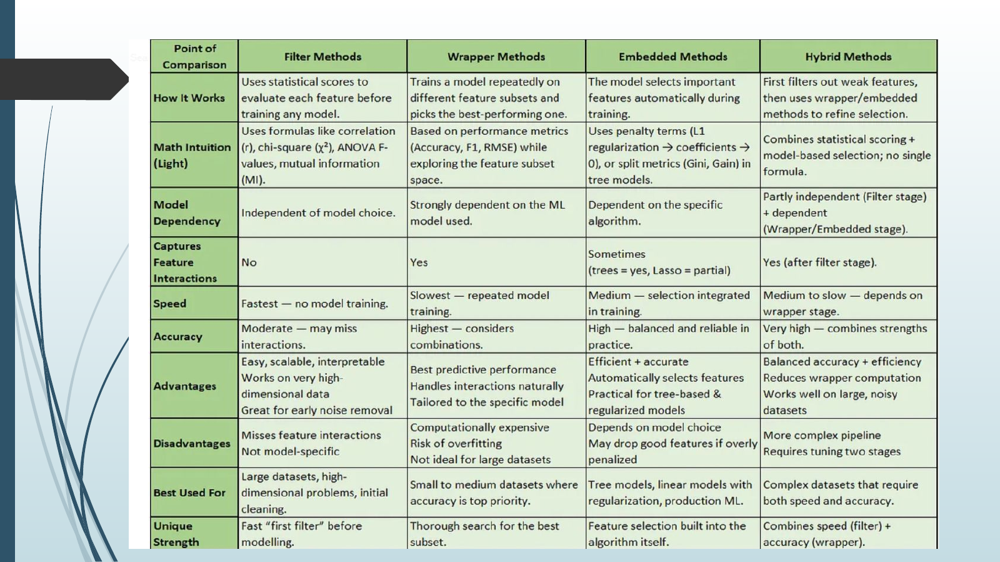

### Extracted Slide Text

- No selectable text extracted from this page.

### Page Description And Teaching Notes

Slide type: visual-only or image-heavy slide.
Main idea: the slide is visual-first, so the image should be treated as the source for the content and structure.
This page is primarily visual. The embedded slide image is the authoritative visual output; read it as a diagram or illustration first, then connect any visible labels to the surrounding pages.
- No reliable selectable text was extracted; use the slide image for the visible diagram, chart, or screenshot.
Visual/layout description: the embedded image preserves the actual slide. Describe the title area first, then read bullets, formulas, tables, arrows, grouped boxes, or diagrams in their visible order. If the slide contains a diagram, explain the relationship shown by arrows/positioning before explaining the text labels.
Teaching note: after reading the slide, ask the learner to restate the page in one or two sentences and give one example. For formula or metric slides, also ask what each variable or metric means and when it should be used.
Exam/viva note: prepare the slide title as a short-answer question, then use the bullets or visual labels as the expected answer points.

## Page 37: Step 6: Model Selection

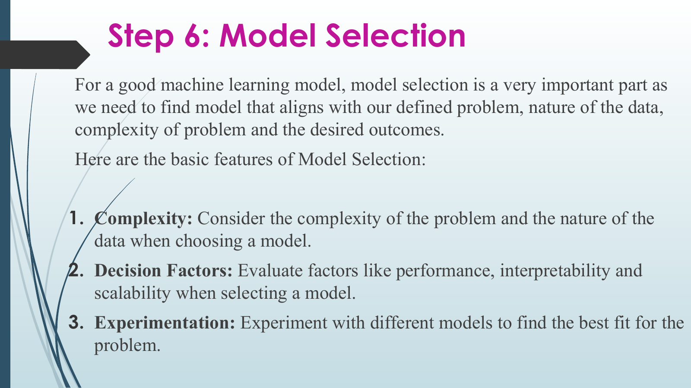

### Extracted Slide Text

- Step 6: Model Selection
- For a good machine learning model, model selection is a very important part as
- we need to find model that aligns with our defined problem, nature of the data,
- complexity of problem and the desired outcomes.
- Here are the basic features of Model Selection:
- 1. Complexity: Consider the complexity of the problem and the nature of the
- data when choosing a model.
- 2. Decision Factors: Evaluate factors like performance, interpretability and
- scalability when selecting a model.
- 3. Experimentation: Experiment with different models to find the best fit for the
- problem.

### Page Description And Teaching Notes

Slide type: bullet explanation slide.
Main idea: For a good machine learning model, model selection is a very important part as we need to find model that aligns with our defined problem, nature of the data, complexity of problem and the desired outcomes. Here are the basic features of Model Selection: 1. Complexity: Consider the complexity of the problem and the nature of the data when choosing a model.
This page breaks the topic into separate points. Each bullet should be treated as a distinct exam or viva talking point, with the learner able to define it and give a small example.
Detailed page understanding:
- `For a good machine learning model, model selection is a very important part as` gives the definition-level meaning. Explain it first in simple words, then connect it to how a model learns from data.
- `we need to find model that aligns with our defined problem, nature of the data,` is a limitation or risk. Mention when the method may fail and what alternative or precaution can reduce the issue.
- `complexity of problem and the desired outcomes.` is a limitation or risk. Mention when the method may fail and what alternative or precaution can reduce the issue.
- `Here are the basic features of Model Selection:` is a core visible point. Explain what it means, why it matters, and how it connects to the slide title.
- `1. Complexity: Consider the complexity of the problem and the nature of the` is a limitation or risk. Mention when the method may fail and what alternative or precaution can reduce the issue.
- `data when choosing a model.` is a core visible point. Explain what it means, why it matters, and how it connects to the slide title.
- `2. Decision Factors: Evaluate factors like performance, interpretability and` is one item in the slide's list. Treat it as a separate subtopic and prepare a one-line explanation for it.
- `scalability when selecting a model.` is a core visible point. Explain what it means, why it matters, and how it connects to the slide title.
- `3. Experimentation: Experiment with different models to find the best fit for the` is one item in the slide's list. Treat it as a separate subtopic and prepare a one-line explanation for it.
- `problem.` is a limitation or risk. Mention when the method may fail and what alternative or precaution can reduce the issue.
Important visible terms: Step, Model Selection For, Here, Model Selection, Complexity, Consider, Decision Factors, Evaluate.
Visual/layout description: the embedded image preserves the actual slide. Describe the title area first, then read bullets, formulas, tables, arrows, grouped boxes, or diagrams in their visible order. If the slide contains a diagram, explain the relationship shown by arrows/positioning before explaining the text labels.
Teaching note: after reading the slide, ask the learner to restate the page in one or two sentences and give one example. For formula or metric slides, also ask what each variable or metric means and when it should be used.
Exam/viva note: prepare the slide title as a short-answer question, then use the bullets or visual labels as the expected answer points.

## Page 38: Step 7: Model Training

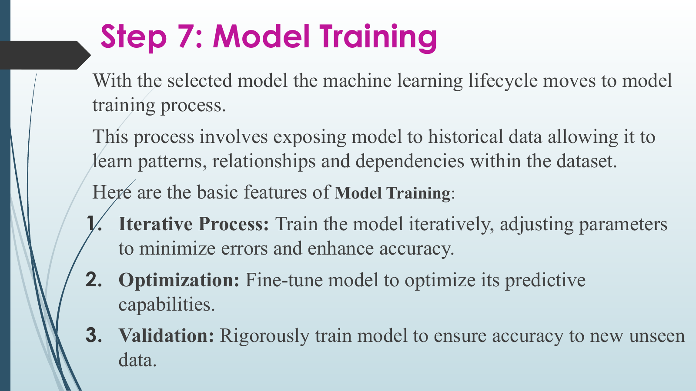

### Extracted Slide Text

- Step 7: Model Training
- With the selected model the machine learning lifecycle moves to model
- training process.
- This process involves exposing model to historical data allowing it to
- learn patterns, relationships and dependencies within the dataset.
- Here are the basic features of Model Training:
- 1. Iterative Process: Train the model iteratively, adjusting parameters
- to minimize errors and enhance accuracy.
- 2. Optimization: Fine-tune model to optimize its predictive
- capabilities.
- 3. Validation: Rigorously train model to ensure accuracy to new unseen
- data.

### Page Description And Teaching Notes

Slide type: metric/table slide.
Main idea: With the selected model the machine learning lifecycle moves to model training process. This process involves exposing model to historical data allowing it to learn patterns, relationships and dependencies within the dataset. Here are the basic features of Model Training: 1. Iterative Process: Train the model iteratively, adjusting parameters.
This page organizes evaluation or comparison information. Focus on what each metric measures, when it is useful, and what mistake it prevents when judging a machine-learning model.
Detailed page understanding:
- `With the selected model the machine learning lifecycle moves to model` is a core visible point. Explain what it means, why it matters, and how it connects to the slide title.
- `training process.` is a core visible point. Explain what it means, why it matters, and how it connects to the slide title.
- `This process involves exposing model to historical data allowing it to` is a core visible point. Explain what it means, why it matters, and how it connects to the slide title.
- `learn patterns, relationships and dependencies within the dataset.` is a core visible point. Explain what it means, why it matters, and how it connects to the slide title.
- `Here are the basic features of Model Training:` is a core visible point. Explain what it means, why it matters, and how it connects to the slide title.
- `1. Iterative Process: Train the model iteratively, adjusting parameters` is one item in the slide's list. Treat it as a separate subtopic and prepare a one-line explanation for it.
- `to minimize errors and enhance accuracy.` is a limitation or risk. Mention when the method may fail and what alternative or precaution can reduce the issue.
- `2. Optimization: Fine-tune model to optimize its predictive` is one item in the slide's list. Treat it as a separate subtopic and prepare a one-line explanation for it.
- Additional bullets continue on the slide; use the extracted text list above for the complete wording.
- `data.` is a core visible point. Explain what it means, why it matters, and how it connects to the slide title.
Important visible terms: Step, Model Training With, This, Here, Model Training, Iterative Process, Train, Optimization.
Visual/layout description: the embedded image preserves the actual slide. Describe the title area first, then read bullets, formulas, tables, arrows, grouped boxes, or diagrams in their visible order. If the slide contains a diagram, explain the relationship shown by arrows/positioning before explaining the text labels.
Teaching note: after reading the slide, ask the learner to restate the page in one or two sentences and give one example. For formula or metric slides, also ask what each variable or metric means and when it should be used.
Exam/viva note: prepare the slide title as a short-answer question, then use the bullets or visual labels as the expected answer points.

## Page 39: Step 8: Model Evaluation and Tuning

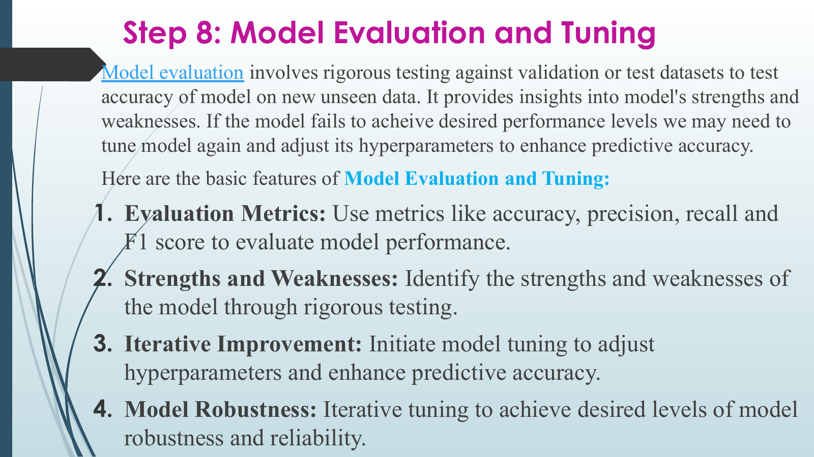

### Extracted Slide Text

- Step 8: Model Evaluation and Tuning
- Model evaluation involves rigorous testing against validation or test datasets to test
- accuracy of model on new unseen data. It provides insights into model's strengths and
- weaknesses. If the model fails to acheive desired performance levels we may need to
- tune model again and adjust its hyperparameters to enhance predictive accuracy.
- Here are the basic features of Model Evaluation and Tuning:
- 1. Evaluation Metrics: Use metrics like accuracy, precision, recall and
- F1 score to evaluate model performance.
- 2. Strengths and Weaknesses: Identify the strengths and weaknesses of
- the model through rigorous testing.
- 3. Iterative Improvement: Initiate model tuning to adjust
- hyperparameters and enhance predictive accuracy.
- 4. Model Robustness: Iterative tuning to achieve desired levels of model
- robustness and reliability.

### Page Description And Teaching Notes

Slide type: metric/table slide.
Main idea: Model evaluation involves rigorous testing against validation or test datasets to test accuracy of model on new unseen data. It provides insights into model's strengths and weaknesses. If the model fails to acheive desired performance levels we may need to tune model again and adjust its hyperparameters to enhance predictive accuracy. Here are the basic features of Model Evaluation and Tuning: 1. Evaluation Metrics: Use metrics like accuracy, precision, recall and.
This page organizes evaluation or comparison information. Focus on what each metric measures, when it is useful, and what mistake it prevents when judging a machine-learning model.
Detailed page understanding:
- `Model evaluation involves rigorous testing against validation or test datasets to test` is a core visible point. Explain what it means, why it matters, and how it connects to the slide title.
- `accuracy of model on new unseen data. It provides insights into model's strengths and` is a core visible point. Explain what it means, why it matters, and how it connects to the slide title.
- `weaknesses. If the model fails to acheive desired performance levels we may need to` is a core visible point. Explain what it means, why it matters, and how it connects to the slide title.
- `tune model again and adjust its hyperparameters to enhance predictive accuracy.` is a core visible point. Explain what it means, why it matters, and how it connects to the slide title.
- `Here are the basic features of Model Evaluation and Tuning:` is a core visible point. Explain what it means, why it matters, and how it connects to the slide title.
- `1. Evaluation Metrics: Use metrics like accuracy, precision, recall and` is an application/example point. Convert it into a concrete real-world case while teaching.
- `F1 score to evaluate model performance.` is a core visible point. Explain what it means, why it matters, and how it connects to the slide title.
- `2. Strengths and Weaknesses: Identify the strengths and weaknesses of` is one item in the slide's list. Treat it as a separate subtopic and prepare a one-line explanation for it.
- Additional bullets continue on the slide; use the extracted text list above for the complete wording.
- `robustness and reliability.` is a core visible point. Explain what it means, why it matters, and how it connects to the slide title.
Important visible terms: Step, Model Evaluation, Tuning Model, Here, Tuning, Evaluation Metrics, Use, Strengths.
Visual/layout description: the embedded image preserves the actual slide. Describe the title area first, then read bullets, formulas, tables, arrows, grouped boxes, or diagrams in their visible order. If the slide contains a diagram, explain the relationship shown by arrows/positioning before explaining the text labels.
Teaching note: after reading the slide, ask the learner to restate the page in one or two sentences and give one example. For formula or metric slides, also ask what each variable or metric means and when it should be used.
Exam/viva note: prepare the slide title as a short-answer question, then use the bullets or visual labels as the expected answer points.

## Page 40: Step 9: Model Deployment

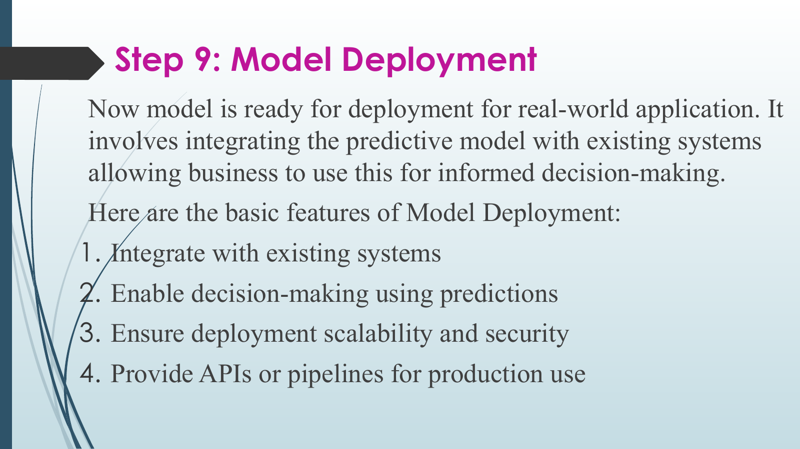

### Extracted Slide Text

- Step 9: Model Deployment
- Now model is ready for deployment for real-world application. It
- involves integrating the predictive model with existing systems
- allowing business to use this for informed decision-making.
- Here are the basic features of Model Deployment:
- 1. Integrate with existing systems
- 2. Enable decision-making using predictions
- 3. Ensure deployment scalability and security
- 4. Provide APIs or pipelines for production use

### Page Description And Teaching Notes

Slide type: bullet explanation slide.
Main idea: Now model is ready for deployment for real-world application. It involves integrating the predictive model with existing systems allowing business to use this for informed decision-making. Here are the basic features of Model Deployment: 1. Integrate with existing systems 2. Enable decision-making using predictions.
This page breaks the topic into separate points. Each bullet should be treated as a distinct exam or viva talking point, with the learner able to define it and give a small example.
Detailed page understanding:
- `Now model is ready for deployment for real-world application. It` is an application/example point. Convert it into a concrete real-world case while teaching.
- `involves integrating the predictive model with existing systems` is a core visible point. Explain what it means, why it matters, and how it connects to the slide title.
- `allowing business to use this for informed decision-making.` is an application/example point. Convert it into a concrete real-world case while teaching.
- `Here are the basic features of Model Deployment:` is a core visible point. Explain what it means, why it matters, and how it connects to the slide title.
- `1. Integrate with existing systems` is one item in the slide's list. Treat it as a separate subtopic and prepare a one-line explanation for it.
- `2. Enable decision-making using predictions` is one item in the slide's list. Treat it as a separate subtopic and prepare a one-line explanation for it.
- `3. Ensure deployment scalability and security` is one item in the slide's list. Treat it as a separate subtopic and prepare a one-line explanation for it.
- `4. Provide APIs or pipelines for production use` is an application/example point. Convert it into a concrete real-world case while teaching.
Important visible terms: Step, Model Deployment Now, Here, Model Deployment, Integrate, Enable, Ensure, Provide APIs.
Visual/layout description: the embedded image preserves the actual slide. Describe the title area first, then read bullets, formulas, tables, arrows, grouped boxes, or diagrams in their visible order. If the slide contains a diagram, explain the relationship shown by arrows/positioning before explaining the text labels.
Teaching note: after reading the slide, ask the learner to restate the page in one or two sentences and give one example. For formula or metric slides, also ask what each variable or metric means and when it should be used.
Exam/viva note: prepare the slide title as a short-answer question, then use the bullets or visual labels as the expected answer points.

## Page 41: Step 10: Model Monitoring and

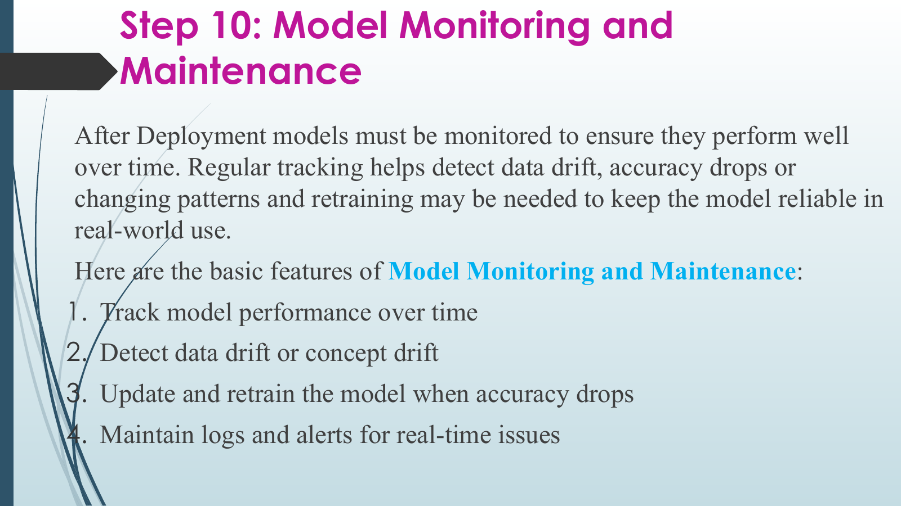

### Extracted Slide Text

- Step 10: Model Monitoring and
- Maintenance
- After Deployment models must be monitored to ensure they perform well
- over time. Regular tracking helps detect data drift, accuracy drops or
- changing patterns and retraining may be needed to keep the model reliable in
- real-world use.
- Here are the basic features of Model Monitoring and Maintenance:
- 1. Track model performance over time
- 2. Detect data drift or concept drift
- 3. Update and retrain the model when accuracy drops
- 4. Maintain logs and alerts for real-time issues

### Page Description And Teaching Notes

Slide type: metric/table slide.
Main idea: Maintenance After Deployment models must be monitored to ensure they perform well over time. Regular tracking helps detect data drift, accuracy drops or changing patterns and retraining may be needed to keep the model reliable in real-world use. Here are the basic features of Model Monitoring and Maintenance:.
This page organizes evaluation or comparison information. Focus on what each metric measures, when it is useful, and what mistake it prevents when judging a machine-learning model.
Detailed page understanding:
- `Maintenance` is a core visible point. Explain what it means, why it matters, and how it connects to the slide title.
- `After Deployment models must be monitored to ensure they perform well` is a core visible point. Explain what it means, why it matters, and how it connects to the slide title.
- `over time. Regular tracking helps detect data drift, accuracy drops or` states a benefit. Use it to justify why this method or concept is useful in a machine-learning workflow.
- `changing patterns and retraining may be needed to keep the model reliable in` is a core visible point. Explain what it means, why it matters, and how it connects to the slide title.
- `real-world use.` is an application/example point. Convert it into a concrete real-world case while teaching.
- `Here are the basic features of Model Monitoring and Maintenance:` is a core visible point. Explain what it means, why it matters, and how it connects to the slide title.
- `1. Track model performance over time` is one item in the slide's list. Treat it as a separate subtopic and prepare a one-line explanation for it.
- `2. Detect data drift or concept drift` is one item in the slide's list. Treat it as a separate subtopic and prepare a one-line explanation for it.
- `3. Update and retrain the model when accuracy drops` is one item in the slide's list. Treat it as a separate subtopic and prepare a one-line explanation for it.
- `4. Maintain logs and alerts for real-time issues` is one item in the slide's list. Treat it as a separate subtopic and prepare a one-line explanation for it.
Important visible terms: Step, Model Monitoring, Maintenance After Deployment, Regular, Here, Maintenance, Track, Detect.
Visual/layout description: the embedded image preserves the actual slide. Describe the title area first, then read bullets, formulas, tables, arrows, grouped boxes, or diagrams in their visible order. If the slide contains a diagram, explain the relationship shown by arrows/positioning before explaining the text labels.
Teaching note: after reading the slide, ask the learner to restate the page in one or two sentences and give one example. For formula or metric slides, also ask what each variable or metric means and when it should be used.
Exam/viva note: prepare the slide title as a short-answer question, then use the bullets or visual labels as the expected answer points.

## Page 42: Data Preprocessing in Machine

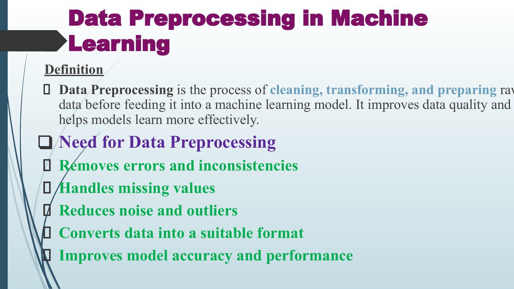

### Extracted Slide Text

- Data Preprocessing in Machine
- Learning
- Definition
- Data Preprocessing is the process of cleaning, transforming, and preparing raw
- data before feeding it into a machine learning model. It improves data quality and
- helps models learn more effectively.
- ❑ Need for Data Preprocessing
- Removes errors and inconsistencies
- Handles missing values
- Reduces noise and outliers
- Converts data into a suitable format
- Improves model accuracy and performance

### Page Description And Teaching Notes

Slide type: metric/table slide.
Main idea: Learning Definition Data Preprocessing is the process of cleaning, transforming, and preparing raw data before feeding it into a machine learning model. It improves data quality and helps models learn more effectively. ❑ Need for Data Preprocessing.
This page organizes evaluation or comparison information. Focus on what each metric measures, when it is useful, and what mistake it prevents when judging a machine-learning model.
Detailed page understanding:
- `Learning` is a core visible point. Explain what it means, why it matters, and how it connects to the slide title.
- `Definition` gives the definition-level meaning. Explain it first in simple words, then connect it to how a model learns from data.
- `Data Preprocessing is the process of cleaning, transforming, and preparing raw` is a core visible point. Explain what it means, why it matters, and how it connects to the slide title.
- `data before feeding it into a machine learning model. It improves data quality and` states a benefit. Use it to justify why this method or concept is useful in a machine-learning workflow.
- `helps models learn more effectively.` states a benefit. Use it to justify why this method or concept is useful in a machine-learning workflow.
- `❑ Need for Data Preprocessing` is one item in the slide's list. Treat it as a separate subtopic and prepare a one-line explanation for it.
- `Removes errors and inconsistencies` is a limitation or risk. Mention when the method may fail and what alternative or precaution can reduce the issue.
- `Handles missing values` is a core visible point. Explain what it means, why it matters, and how it connects to the slide title.
- Additional bullets continue on the slide; use the extracted text list above for the complete wording.
- `Improves model accuracy and performance` states a benefit. Use it to justify why this method or concept is useful in a machine-learning workflow.
Important visible terms: Data Preprocessing, Machine Learning Definition Data, Preprocessing, Need, Data Preprocessing Removes, Handles, Reduces, Converts.
Visual/layout description: the embedded image preserves the actual slide. Describe the title area first, then read bullets, formulas, tables, arrows, grouped boxes, or diagrams in their visible order. If the slide contains a diagram, explain the relationship shown by arrows/positioning before explaining the text labels.
Teaching note: after reading the slide, ask the learner to restate the page in one or two sentences and give one example. For formula or metric slides, also ask what each variable or metric means and when it should be used.
Exam/viva note: prepare the slide title as a short-answer question, then use the bullets or visual labels as the expected answer points.

## Page 43: Unit I - Introduction to Machine Learning Page 43

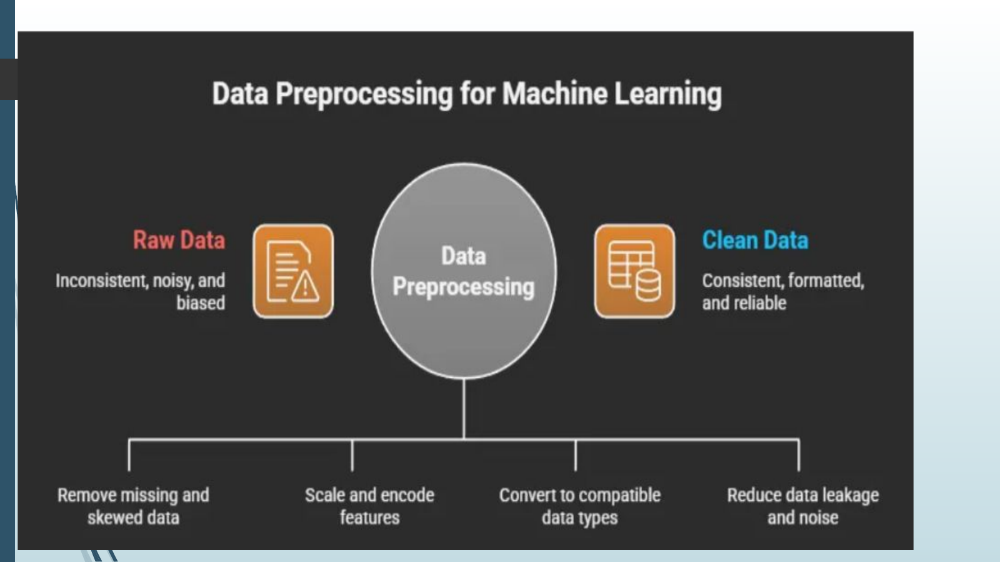

### Extracted Slide Text

- No selectable text extracted from this page.

### Page Description And Teaching Notes

Slide type: visual-only or image-heavy slide.
Main idea: the slide is visual-first, so the image should be treated as the source for the content and structure.
This page is primarily visual. The embedded slide image is the authoritative visual output; read it as a diagram or illustration first, then connect any visible labels to the surrounding pages.
- No reliable selectable text was extracted; use the slide image for the visible diagram, chart, or screenshot.
Visual/layout description: the embedded image preserves the actual slide. Describe the title area first, then read bullets, formulas, tables, arrows, grouped boxes, or diagrams in their visible order. If the slide contains a diagram, explain the relationship shown by arrows/positioning before explaining the text labels.
Teaching note: after reading the slide, ask the learner to restate the page in one or two sentences and give one example. For formula or metric slides, also ask what each variable or metric means and when it should be used.
Exam/viva note: prepare the slide title as a short-answer question, then use the bullets or visual labels as the expected answer points.

## Page 44: Unit I - Introduction to Machine Learning Page 44

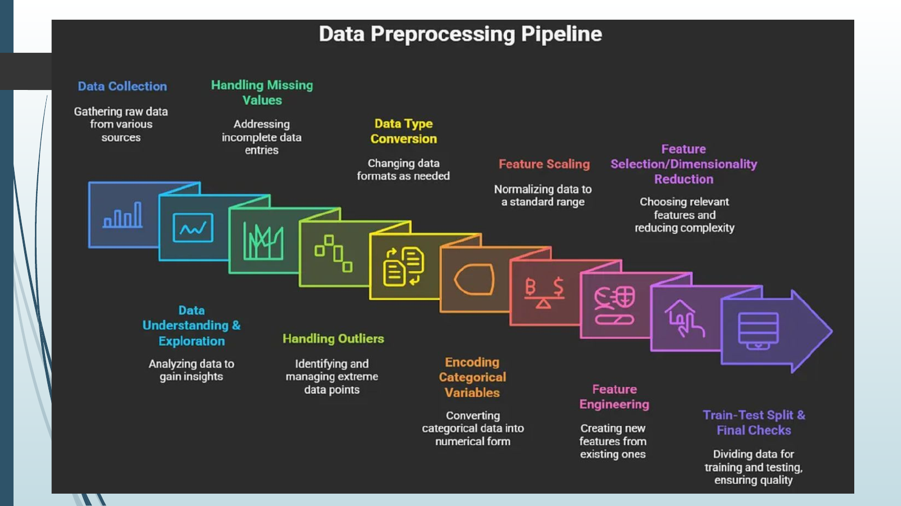

### Extracted Slide Text

- No selectable text extracted from this page.

### Page Description And Teaching Notes

Slide type: visual-only or image-heavy slide.
Main idea: the slide is visual-first, so the image should be treated as the source for the content and structure.
This page is primarily visual. The embedded slide image is the authoritative visual output; read it as a diagram or illustration first, then connect any visible labels to the surrounding pages.
- No reliable selectable text was extracted; use the slide image for the visible diagram, chart, or screenshot.
Visual/layout description: the embedded image preserves the actual slide. Describe the title area first, then read bullets, formulas, tables, arrows, grouped boxes, or diagrams in their visible order. If the slide contains a diagram, explain the relationship shown by arrows/positioning before explaining the text labels.
Teaching note: after reading the slide, ask the learner to restate the page in one or two sentences and give one example. For formula or metric slides, also ask what each variable or metric means and when it should be used.
Exam/viva note: prepare the slide title as a short-answer question, then use the bullets or visual labels as the expected answer points.

## Page 45: Unit I - Introduction to Machine Learning Page 45

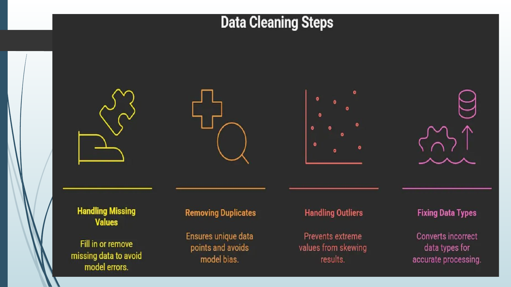

### Extracted Slide Text

- No selectable text extracted from this page.

### Page Description And Teaching Notes

Slide type: visual-only or image-heavy slide.
Main idea: the slide is visual-first, so the image should be treated as the source for the content and structure.
This page is primarily visual. The embedded slide image is the authoritative visual output; read it as a diagram or illustration first, then connect any visible labels to the surrounding pages.
- No reliable selectable text was extracted; use the slide image for the visible diagram, chart, or screenshot.
Visual/layout description: the embedded image preserves the actual slide. Describe the title area first, then read bullets, formulas, tables, arrows, grouped boxes, or diagrams in their visible order. If the slide contains a diagram, explain the relationship shown by arrows/positioning before explaining the text labels.
Teaching note: after reading the slide, ask the learner to restate the page in one or two sentences and give one example. For formula or metric slides, also ask what each variable or metric means and when it should be used.
Exam/viva note: prepare the slide title as a short-answer question, then use the bullets or visual labels as the expected answer points.

## Page 46: Unit I - Introduction to Machine Learning Page 46

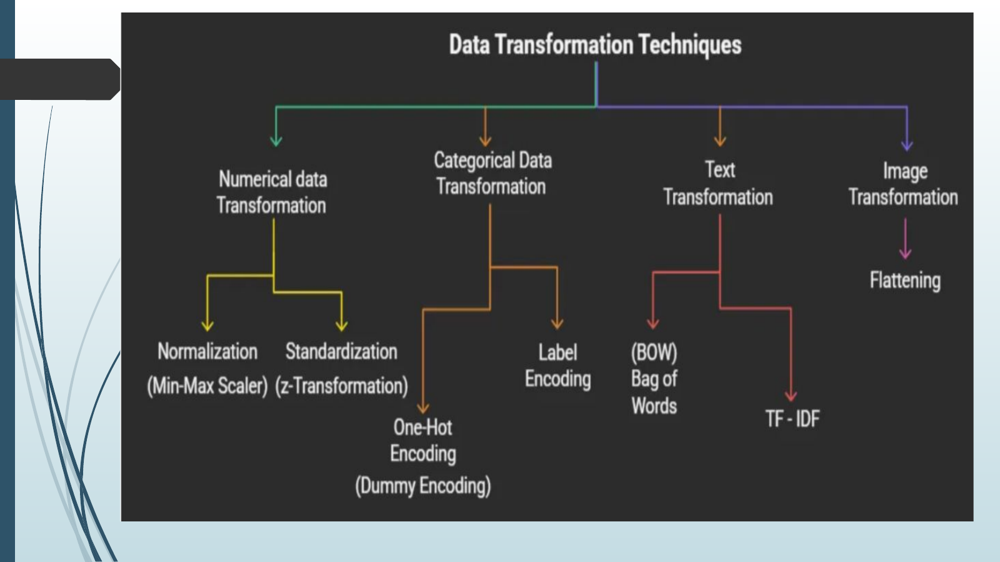

### Extracted Slide Text

- No selectable text extracted from this page.

### Page Description And Teaching Notes

Slide type: visual-only or image-heavy slide.
Main idea: the slide is visual-first, so the image should be treated as the source for the content and structure.
This page is primarily visual. The embedded slide image is the authoritative visual output; read it as a diagram or illustration first, then connect any visible labels to the surrounding pages.
- No reliable selectable text was extracted; use the slide image for the visible diagram, chart, or screenshot.
Visual/layout description: the embedded image preserves the actual slide. Describe the title area first, then read bullets, formulas, tables, arrows, grouped boxes, or diagrams in their visible order. If the slide contains a diagram, explain the relationship shown by arrows/positioning before explaining the text labels.
Teaching note: after reading the slide, ask the learner to restate the page in one or two sentences and give one example. For formula or metric slides, also ask what each variable or metric means and when it should be used.
Exam/viva note: prepare the slide title as a short-answer question, then use the bullets or visual labels as the expected answer points.

## Page 47: Feature Scaling : Standardization

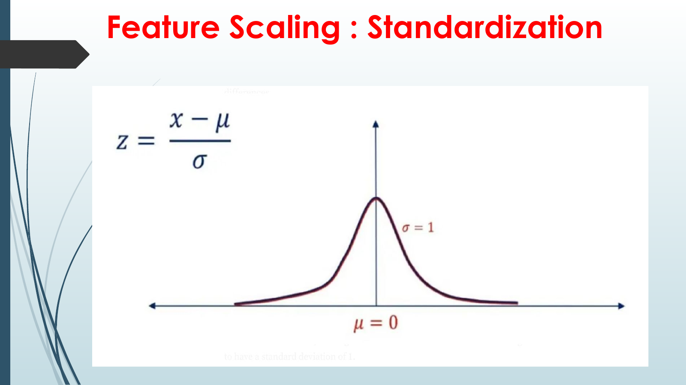

### Extracted Slide Text

- Feature Scaling : Standardization

### Page Description And Teaching Notes

Slide type: title or transition slide.
Main idea: the slide is visual-first, so the image should be treated as the source for the content and structure.
This page sets the context for the next topic. Treat it as a section marker: it tells the learner what concept or unit is starting before the deck moves into definitions, examples, or formulas.
- No reliable selectable text was extracted; use the slide image for the visible diagram, chart, or screenshot.
Important visible terms: Feature Scaling, Standardization.
Visual/layout description: the embedded image preserves the actual slide. Describe the title area first, then read bullets, formulas, tables, arrows, grouped boxes, or diagrams in their visible order. If the slide contains a diagram, explain the relationship shown by arrows/positioning before explaining the text labels.
Teaching note: after reading the slide, ask the learner to restate the page in one or two sentences and give one example. For formula or metric slides, also ask what each variable or metric means and when it should be used.
Exam/viva note: prepare the slide title as a short-answer question, then use the bullets or visual labels as the expected answer points.

## Page 48: Normalization

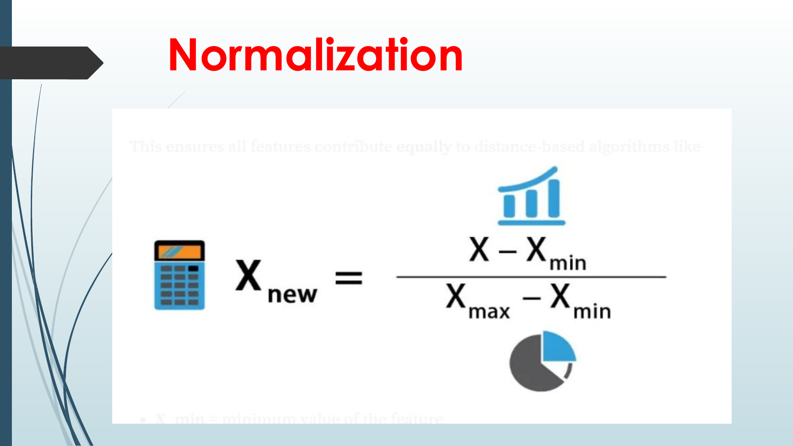

### Extracted Slide Text

- Normalization

### Page Description And Teaching Notes

Slide type: title or transition slide.
Main idea: the slide is visual-first, so the image should be treated as the source for the content and structure.
This page sets the context for the next topic. Treat it as a section marker: it tells the learner what concept or unit is starting before the deck moves into definitions, examples, or formulas.
- No reliable selectable text was extracted; use the slide image for the visible diagram, chart, or screenshot.
Important visible terms: Normalization.
Visual/layout description: the embedded image preserves the actual slide. Describe the title area first, then read bullets, formulas, tables, arrows, grouped boxes, or diagrams in their visible order. If the slide contains a diagram, explain the relationship shown by arrows/positioning before explaining the text labels.
Teaching note: after reading the slide, ask the learner to restate the page in one or two sentences and give one example. For formula or metric slides, also ask what each variable or metric means and when it should be used.
Exam/viva note: prepare the slide title as a short-answer question, then use the bullets or visual labels as the expected answer points.

## Page 49: Unit I - Introduction to Machine Learning Page 49

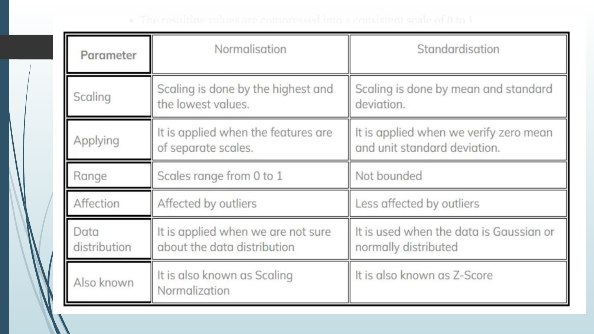

### Extracted Slide Text

- No selectable text extracted from this page.

### Page Description And Teaching Notes

Slide type: visual-only or image-heavy slide.
Main idea: the slide is visual-first, so the image should be treated as the source for the content and structure.
This page is primarily visual. The embedded slide image is the authoritative visual output; read it as a diagram or illustration first, then connect any visible labels to the surrounding pages.
- No reliable selectable text was extracted; use the slide image for the visible diagram, chart, or screenshot.
Visual/layout description: the embedded image preserves the actual slide. Describe the title area first, then read bullets, formulas, tables, arrows, grouped boxes, or diagrams in their visible order. If the slide contains a diagram, explain the relationship shown by arrows/positioning before explaining the text labels.
Teaching note: after reading the slide, ask the learner to restate the page in one or two sentences and give one example. For formula or metric slides, also ask what each variable or metric means and when it should be used.
Exam/viva note: prepare the slide title as a short-answer question, then use the bullets or visual labels as the expected answer points.

## Page 50: Steps in Data Preprocessing

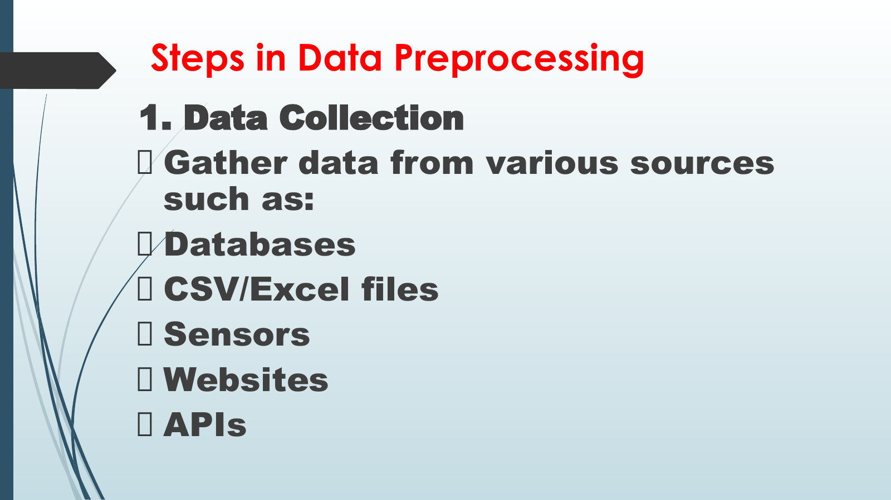

### Extracted Slide Text

- Steps in Data Preprocessing
- 1. Data Collection
- Gather data from various sources
- such as:
- Databases
- CSV/Excel files
- Sensors
- Websites
- APIs

### Page Description And Teaching Notes

Slide type: process or diagram slide.
Main idea: 1. Data Collection Gather data from various sources such as: Databases CSV/Excel files Sensors.
This page describes a flow, algorithm, or sequence. Read the visual from start to finish and explain how each stage transforms data, parameters, or decisions into the next stage.
Detailed page understanding:
- `1. Data Collection` is one item in the slide's list. Treat it as a separate subtopic and prepare a one-line explanation for it.
- `Gather data from various sources` is a core visible point. Explain what it means, why it matters, and how it connects to the slide title.
- `such as:` is a core visible point. Explain what it means, why it matters, and how it connects to the slide title.
- `Databases` is a core visible point. Explain what it means, why it matters, and how it connects to the slide title.
- `CSV/Excel files` is a core visible point. Explain what it means, why it matters, and how it connects to the slide title.
- `Sensors` is a core visible point. Explain what it means, why it matters, and how it connects to the slide title.
- `Websites` is a core visible point. Explain what it means, why it matters, and how it connects to the slide title.
- `APIs` is a core visible point. Explain what it means, why it matters, and how it connects to the slide title.
Important visible terms: Steps, Data Preprocessing, Data Collection Gather, Databases CSV/Excel, Sensors Websites APIs.
Visual/layout description: the embedded image preserves the actual slide. Describe the title area first, then read bullets, formulas, tables, arrows, grouped boxes, or diagrams in their visible order. If the slide contains a diagram, explain the relationship shown by arrows/positioning before explaining the text labels.
Teaching note: after reading the slide, ask the learner to restate the page in one or two sentences and give one example. For formula or metric slides, also ask what each variable or metric means and when it should be used.
Exam/viva note: prepare the slide title as a short-answer question, then use the bullets or visual labels as the expected answer points.

## Page 51: 2. Data Cleaning

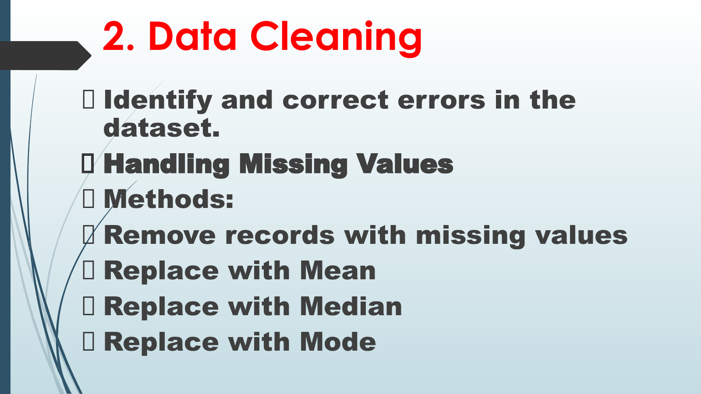

### Extracted Slide Text

- 2. Data Cleaning
- Identify and correct errors in the
- dataset.
- Handling Missing Values
- Methods:
- Remove records with missing values
- Replace with Mean
- Replace with Median
- Replace with Mode

### Page Description And Teaching Notes

Slide type: bullet explanation slide.
Main idea: Identify and correct errors in the dataset. Handling Missing Values Methods: Remove records with missing values Replace with Mean.
This page breaks the topic into separate points. Each bullet should be treated as a distinct exam or viva talking point, with the learner able to define it and give a small example.
Detailed page understanding:
- `Identify and correct errors in the` is a limitation or risk. Mention when the method may fail and what alternative or precaution can reduce the issue.
- `dataset.` is a core visible point. Explain what it means, why it matters, and how it connects to the slide title.
- `Handling Missing Values` is a core visible point. Explain what it means, why it matters, and how it connects to the slide title.
- `Methods:` is a core visible point. Explain what it means, why it matters, and how it connects to the slide title.
- `Remove records with missing values` is a core visible point. Explain what it means, why it matters, and how it connects to the slide title.
- `Replace with Mean` is a core visible point. Explain what it means, why it matters, and how it connects to the slide title.
- `Replace with Median` is a core visible point. Explain what it means, why it matters, and how it connects to the slide title.
- `Replace with Mode` is a core visible point. Explain what it means, why it matters, and how it connects to the slide title.
Important visible terms: Data Cleaning Identify, Handling Missing Values Methods, Remove, Replace, Mean Replace, Median Replace, Mode.
Visual/layout description: the embedded image preserves the actual slide. Describe the title area first, then read bullets, formulas, tables, arrows, grouped boxes, or diagrams in their visible order. If the slide contains a diagram, explain the relationship shown by arrows/positioning before explaining the text labels.
Teaching note: after reading the slide, ask the learner to restate the page in one or two sentences and give one example. For formula or metric slides, also ask what each variable or metric means and when it should be used.
Exam/viva note: prepare the slide title as a short-answer question, then use the bullets or visual labels as the expected answer points.

## Page 52: ❑ Handling Duplicate Data

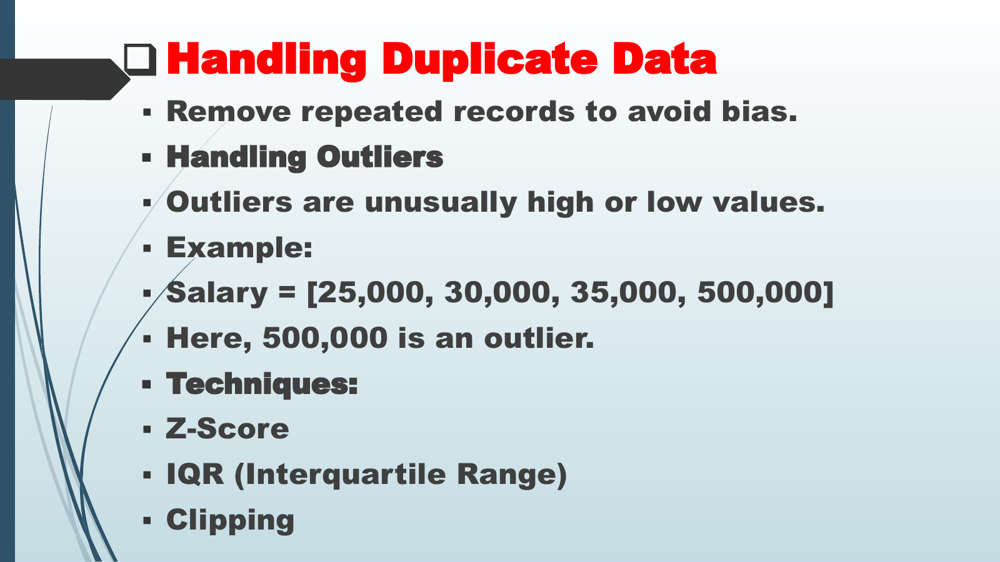

### Extracted Slide Text

- ❑ Handling Duplicate Data
- ▪ Remove repeated records to avoid bias.
- ▪ Handling Outliers
- ▪ Outliers are unusually high or low values.
- ▪ Example:
- ▪ Salary = [25,000, 30,000, 35,000, 500,000]
- ▪ Here, 500,000 is an outlier.
- ▪ Techniques:
- ▪ Z-Score
- ▪ IQR (Interquartile Range)
- ▪ Clipping

### Page Description And Teaching Notes

Slide type: formula or calculation slide.
Main idea: ▪ Remove repeated records to avoid bias. ▪ Handling Outliers ▪ Outliers are unusually high or low values. ▪ Example: ▪ Salary = [25,000, 30,000, 35,000, 500,000] ▪ Here, 500,000 is an outlier.
This page should be read carefully because it introduces a calculation, objective, or optimization idea. Identify the variables in the formula, what quantity is being minimized or measured, and how the equation supports model training or evaluation.
Detailed page understanding:
- `▪ Remove repeated records to avoid bias.` is one item in the slide's list. Treat it as a separate subtopic and prepare a one-line explanation for it.
- `▪ Handling Outliers` is one item in the slide's list. Treat it as a separate subtopic and prepare a one-line explanation for it.
- `▪ Outliers are unusually high or low values.` is one item in the slide's list. Treat it as a separate subtopic and prepare a one-line explanation for it.
- `▪ Example:` is an application/example point. Convert it into a concrete real-world case while teaching.
- `▪ Salary = [25,000, 30,000, 35,000, 500,000]` is one item in the slide's list. Treat it as a separate subtopic and prepare a one-line explanation for it.
- `▪ Here, 500,000 is an outlier.` gives the definition-level meaning. Explain it first in simple words, then connect it to how a model learns from data.
- `▪ Techniques:` is one item in the slide's list. Treat it as a separate subtopic and prepare a one-line explanation for it.
- `▪ Z-Score` is one item in the slide's list. Treat it as a separate subtopic and prepare a one-line explanation for it.
- `▪ IQR (Interquartile Range)` is one item in the slide's list. Treat it as a separate subtopic and prepare a one-line explanation for it.
- `▪ Clipping` is one item in the slide's list. Treat it as a separate subtopic and prepare a one-line explanation for it.
Important visible terms: Handling Duplicate Data, Remove, Handling Outliers, Outliers, Example, Salary, Here, Techniques.
Visual/layout description: the embedded image preserves the actual slide. Describe the title area first, then read bullets, formulas, tables, arrows, grouped boxes, or diagrams in their visible order. If the slide contains a diagram, explain the relationship shown by arrows/positioning before explaining the text labels.
Teaching note: after reading the slide, ask the learner to restate the page in one or two sentences and give one example. For formula or metric slides, also ask what each variable or metric means and when it should be used.
Exam/viva note: prepare the slide title as a short-answer question, then use the bullets or visual labels as the expected answer points.

## Page 53: ❑ B. Standardization

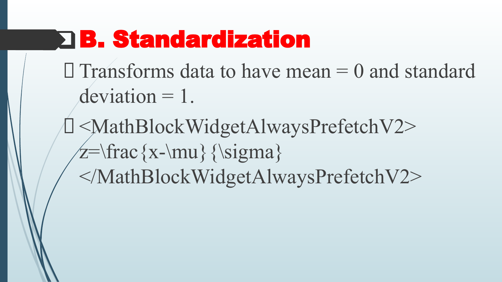

### Extracted Slide Text

- ❑ B. Standardization
- Transforms data to have mean = 0 and standard
- deviation = 1.
- <MathBlockWidgetAlwaysPrefetchV2>
- z=\frac{x-\mu}{\sigma}
- </MathBlockWidgetAlwaysPrefetchV2>

### Page Description And Teaching Notes

Slide type: formula or calculation slide.
Main idea: Transforms data to have mean = 0 and standard deviation = 1. <MathBlockWidgetAlwaysPrefetchV2> z=\frac{x-\mu}{\sigma} </MathBlockWidgetAlwaysPrefetchV2>.
This page should be read carefully because it introduces a calculation, objective, or optimization idea. Identify the variables in the formula, what quantity is being minimized or measured, and how the equation supports model training or evaluation.
Detailed page understanding:
- `Transforms data to have mean = 0 and standard` is a core visible point. Explain what it means, why it matters, and how it connects to the slide title.
- `deviation = 1.` is a core visible point. Explain what it means, why it matters, and how it connects to the slide title.
- `<MathBlockWidgetAlwaysPrefetchV2>` is a core visible point. Explain what it means, why it matters, and how it connects to the slide title.
- `z=\frac{x-\mu}{\sigma}` is a core visible point. Explain what it means, why it matters, and how it connects to the slide title.
- `</MathBlockWidgetAlwaysPrefetchV2>` is a core visible point. Explain what it means, why it matters, and how it connects to the slide title.
Important visible terms: Standardization Transforms, MathBlockWidgetAlwaysPrefetchV2.
Visual/layout description: the embedded image preserves the actual slide. Describe the title area first, then read bullets, formulas, tables, arrows, grouped boxes, or diagrams in their visible order. If the slide contains a diagram, explain the relationship shown by arrows/positioning before explaining the text labels.
Teaching note: after reading the slide, ask the learner to restate the page in one or two sentences and give one example. For formula or metric slides, also ask what each variable or metric means and when it should be used.
Exam/viva note: prepare the slide title as a short-answer question, then use the bullets or visual labels as the expected answer points.

## Page 54: 4. Data Transformation

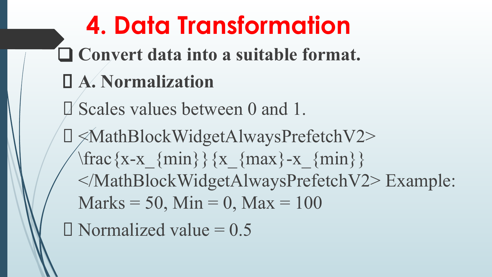

### Extracted Slide Text

- 4. Data Transformation
- ❑ Convert data into a suitable format.
- A. Normalization
- Scales values between 0 and 1.
- <MathBlockWidgetAlwaysPrefetchV2>
- \frac{x-x_{min}}{x_{max}-x_{min}}
- </MathBlockWidgetAlwaysPrefetchV2> Example:
- Marks = 50, Min = 0, Max = 100
- Normalized value = 0.5

### Page Description And Teaching Notes

Slide type: formula or calculation slide.
Main idea: ❑ Convert data into a suitable format. A. Normalization Scales values between 0 and 1. <MathBlockWidgetAlwaysPrefetchV2> \frac{x-x_{min}}{x_{max}-x_{min}} </MathBlockWidgetAlwaysPrefetchV2> Example:.
This page should be read carefully because it introduces a calculation, objective, or optimization idea. Identify the variables in the formula, what quantity is being minimized or measured, and how the equation supports model training or evaluation.
Detailed page understanding:
- `❑ Convert data into a suitable format.` is one item in the slide's list. Treat it as a separate subtopic and prepare a one-line explanation for it.
- `A. Normalization` is a core visible point. Explain what it means, why it matters, and how it connects to the slide title.
- `Scales values between 0 and 1.` is a core visible point. Explain what it means, why it matters, and how it connects to the slide title.
- `<MathBlockWidgetAlwaysPrefetchV2>` is a core visible point. Explain what it means, why it matters, and how it connects to the slide title.
- `\frac{x-x_{min}}{x_{max}-x_{min}}` is a core visible point. Explain what it means, why it matters, and how it connects to the slide title.
- `</MathBlockWidgetAlwaysPrefetchV2> Example:` is an application/example point. Convert it into a concrete real-world case while teaching.
- `Marks = 50, Min = 0, Max = 100` is a core visible point. Explain what it means, why it matters, and how it connects to the slide title.
- `Normalized value = 0.5` is a core visible point. Explain what it means, why it matters, and how it connects to the slide title.
Important visible terms: Data Transformation, Convert, Normalization Scales, MathBlockWidgetAlwaysPrefetchV2, Example, Marks, Min, Max.
Visual/layout description: the embedded image preserves the actual slide. Describe the title area first, then read bullets, formulas, tables, arrows, grouped boxes, or diagrams in their visible order. If the slide contains a diagram, explain the relationship shown by arrows/positioning before explaining the text labels.
Teaching note: after reading the slide, ask the learner to restate the page in one or two sentences and give one example. For formula or metric slides, also ask what each variable or metric means and when it should be used.
Exam/viva note: prepare the slide title as a short-answer question, then use the bullets or visual labels as the expected answer points.

## Page 55: 3. Data Integration

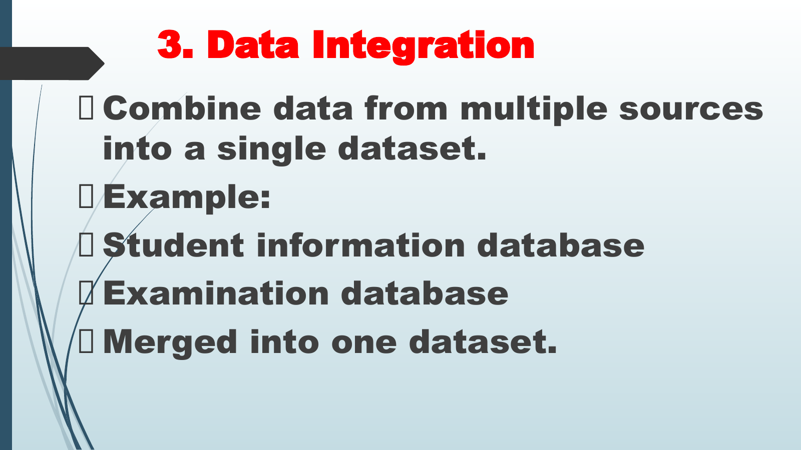

### Extracted Slide Text

- 3. Data Integration
- Combine data from multiple sources
- into a single dataset.
- Example:
- Student information database
- Examination database
- Merged into one dataset.

### Page Description And Teaching Notes

Slide type: bullet explanation slide.
Main idea: Combine data from multiple sources into a single dataset. Example: Student information database Examination database Merged into one dataset.
This page breaks the topic into separate points. Each bullet should be treated as a distinct exam or viva talking point, with the learner able to define it and give a small example.
Detailed page understanding:
- `Combine data from multiple sources` is a core visible point. Explain what it means, why it matters, and how it connects to the slide title.
- `into a single dataset.` is a core visible point. Explain what it means, why it matters, and how it connects to the slide title.
- `Example:` is an application/example point. Convert it into a concrete real-world case while teaching.
- `Student information database` is a core visible point. Explain what it means, why it matters, and how it connects to the slide title.
- `Examination database` is a core visible point. Explain what it means, why it matters, and how it connects to the slide title.
- `Merged into one dataset.` is a core visible point. Explain what it means, why it matters, and how it connects to the slide title.
Important visible terms: Data Integration Combine, Example, Student, Examination, Merged.
Visual/layout description: the embedded image preserves the actual slide. Describe the title area first, then read bullets, formulas, tables, arrows, grouped boxes, or diagrams in their visible order. If the slide contains a diagram, explain the relationship shown by arrows/positioning before explaining the text labels.
Teaching note: after reading the slide, ask the learner to restate the page in one or two sentences and give one example. For formula or metric slides, also ask what each variable or metric means and when it should be used.
Exam/viva note: prepare the slide title as a short-answer question, then use the bullets or visual labels as the expected answer points.

## Page 56: C. Encoding Categorical

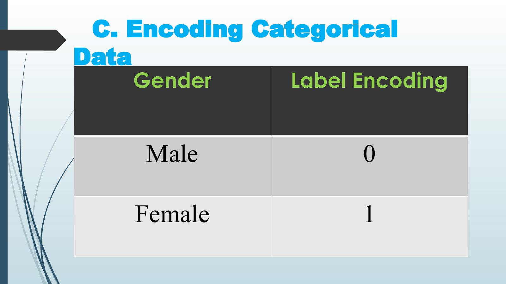

### Extracted Slide Text

- C. Encoding Categorical
- Data
- Gender Label Encoding
- Male 0
- Female 1

### Page Description And Teaching Notes

Slide type: concept explanation slide.
Main idea: Data Gender Label Encoding Male 0 Female 1.
This page explains a core concept in prose. The main task is to convert the definition into a clear statement of what the concept is, why it is used, and where it appears in a machine-learning workflow.
Detailed page understanding:
- `Data` is a core visible point. Explain what it means, why it matters, and how it connects to the slide title.
- `Gender Label Encoding` is a core visible point. Explain what it means, why it matters, and how it connects to the slide title.
- `Male 0` is a core visible point. Explain what it means, why it matters, and how it connects to the slide title.
- `Female 1` is a core visible point. Explain what it means, why it matters, and how it connects to the slide title.
Important visible terms: Encoding Categorical Data Gender, Label Encoding Male, Female.
Visual/layout description: the embedded image preserves the actual slide. Describe the title area first, then read bullets, formulas, tables, arrows, grouped boxes, or diagrams in their visible order. If the slide contains a diagram, explain the relationship shown by arrows/positioning before explaining the text labels.
Teaching note: after reading the slide, ask the learner to restate the page in one or two sentences and give one example. For formula or metric slides, also ask what each variable or metric means and when it should be used.
Exam/viva note: prepare the slide title as a short-answer question, then use the bullets or visual labels as the expected answer points.

## Page 57: Pattern Recognition

### Extracted Slide Text

- Pattern Recognition

### Page Description And Teaching Notes

Slide type: title or transition slide.
Main idea: the slide is visual-first, so the image should be treated as the source for the content and structure.
This page sets the context for the next topic. Treat it as a section marker: it tells the learner what concept or unit is starting before the deck moves into definitions, examples, or formulas.
- No reliable selectable text was extracted; use the slide image for the visible diagram, chart, or screenshot.
Important visible terms: Pattern Recognition.
Visual/layout description: the embedded image preserves the actual slide. Describe the title area first, then read bullets, formulas, tables, arrows, grouped boxes, or diagrams in their visible order. If the slide contains a diagram, explain the relationship shown by arrows/positioning before explaining the text labels.
Teaching note: after reading the slide, ask the learner to restate the page in one or two sentences and give one example. For formula or metric slides, also ask what each variable or metric means and when it should be used.
Exam/viva note: prepare the slide title as a short-answer question, then use the bullets or visual labels as the expected answer points.

## Page 58: What is Pattern

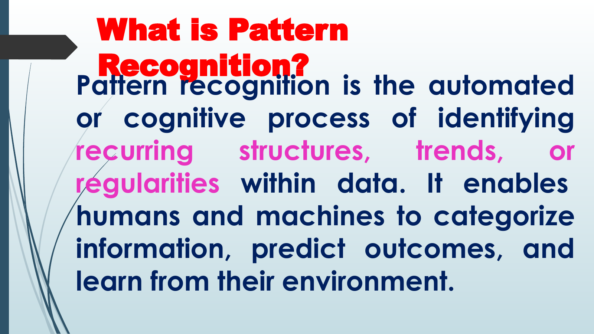

### Extracted Slide Text

- What is Pattern
- Recognition?
- Pattern recognition is the automated
- or cognitive process of identifying
- recurring structures, trends, or
- regularities within data. It enables
- humans and machines to categorize
- information, predict outcomes, and
- learn from their environment.

### Page Description And Teaching Notes

Slide type: process or diagram slide.
Main idea: Recognition? Pattern recognition is the automated or cognitive process of identifying recurring structures, trends, or regularities within data. It enables humans and machines to categorize.
This page describes a flow, algorithm, or sequence. Read the visual from start to finish and explain how each stage transforms data, parameters, or decisions into the next stage.
Detailed page understanding:
- `Recognition?` is a core visible point. Explain what it means, why it matters, and how it connects to the slide title.
- `Pattern recognition is the automated` is a core visible point. Explain what it means, why it matters, and how it connects to the slide title.
- `or cognitive process of identifying` is a core visible point. Explain what it means, why it matters, and how it connects to the slide title.
- `recurring structures, trends, or` is a core visible point. Explain what it means, why it matters, and how it connects to the slide title.
- `regularities within data. It enables` is a core visible point. Explain what it means, why it matters, and how it connects to the slide title.
- `humans and machines to categorize` is a core visible point. Explain what it means, why it matters, and how it connects to the slide title.
- `information, predict outcomes, and` is a core visible point. Explain what it means, why it matters, and how it connects to the slide title.
- `learn from their environment.` is a core visible point. Explain what it means, why it matters, and how it connects to the slide title.
Important visible terms: What, Pattern Recognition, Pattern.
Visual/layout description: the embedded image preserves the actual slide. Describe the title area first, then read bullets, formulas, tables, arrows, grouped boxes, or diagrams in their visible order. If the slide contains a diagram, explain the relationship shown by arrows/positioning before explaining the text labels.
Teaching note: after reading the slide, ask the learner to restate the page in one or two sentences and give one example. For formula or metric slides, also ask what each variable or metric means and when it should be used.
Exam/viva note: prepare the slide title as a short-answer question, then use the bullets or visual labels as the expected answer points.

## Page 59: Pattern recognition is the automated discovery

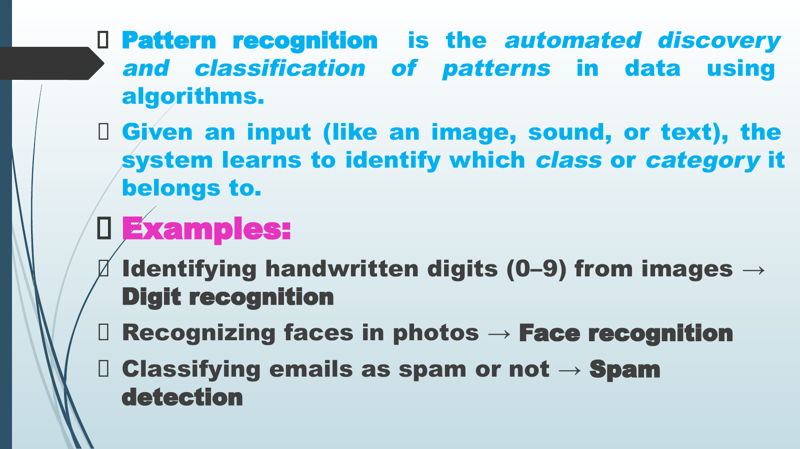

### Extracted Slide Text

- Pattern recognition is the automated discovery
- and classification of patterns in data using
- algorithms.
- Given an input (like an image, sound, or text), the
- system learns to identify which class or category it
- belongs to.
- Examples:
- Identifying handwritten digits (0–9) from images →
- Digit recognition
- Recognizing faces in photos → Face recognition
- Classifying emails as spam or not → Spam
- detection

### Page Description And Teaching Notes

Slide type: concept explanation slide.
Main idea: and classification of patterns in data using algorithms. Given an input (like an image, sound, or text), the system learns to identify which class or category it belongs to. Examples:.
This page explains a core concept in prose. The main task is to convert the definition into a clear statement of what the concept is, why it is used, and where it appears in a machine-learning workflow.
Detailed page understanding:
- `and classification of patterns in data using` is a core visible point. Explain what it means, why it matters, and how it connects to the slide title.
- `algorithms.` is a core visible point. Explain what it means, why it matters, and how it connects to the slide title.
- `Given an input (like an image, sound, or text), the` is a core visible point. Explain what it means, why it matters, and how it connects to the slide title.
- `system learns to identify which class or category it` is a core visible point. Explain what it means, why it matters, and how it connects to the slide title.
- `belongs to.` is a core visible point. Explain what it means, why it matters, and how it connects to the slide title.
- `Examples:` is an application/example point. Convert it into a concrete real-world case while teaching.
- `Identifying handwritten digits (0–9) from images →` is a core visible point. Explain what it means, why it matters, and how it connects to the slide title.
- `Digit recognition` is a core visible point. Explain what it means, why it matters, and how it connects to the slide title.
- Additional bullets continue on the slide; use the extracted text list above for the complete wording.
- `detection` is a core visible point. Explain what it means, why it matters, and how it connects to the slide title.
Important visible terms: Pattern, Given, Examples, Identifying, Digit, Recognizing, Face, Classifying.
Visual/layout description: the embedded image preserves the actual slide. Describe the title area first, then read bullets, formulas, tables, arrows, grouped boxes, or diagrams in their visible order. If the slide contains a diagram, explain the relationship shown by arrows/positioning before explaining the text labels.
Teaching note: after reading the slide, ask the learner to restate the page in one or two sentences and give one example. For formula or metric slides, also ask what each variable or metric means and when it should be used.
Exam/viva note: prepare the slide title as a short-answer question, then use the bullets or visual labels as the expected answer points.

## Page 60: Pattern Recognition is the process of using machine learning algorithms to

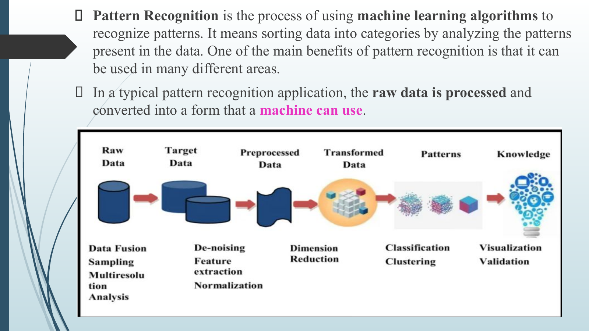

### Extracted Slide Text

- Pattern Recognition is the process of using machine learning algorithms to
- recognize patterns. It means sorting data into categories by analyzing the patterns
- present in the data. One of the main benefits of pattern recognition is that it can
- be used in many different areas.
- In a typical pattern recognition application, the raw data is processed and
- converted into a form that a machine can use.

### Page Description And Teaching Notes

Slide type: process or diagram slide.
Main idea: recognize patterns. It means sorting data into categories by analyzing the patterns present in the data. One of the main benefits of pattern recognition is that it can be used in many different areas. In a typical pattern recognition application, the raw data is processed and converted into a form that a machine can use.
This page describes a flow, algorithm, or sequence. Read the visual from start to finish and explain how each stage transforms data, parameters, or decisions into the next stage.
Detailed page understanding:
- `recognize patterns. It means sorting data into categories by analyzing the patterns` is a core visible point. Explain what it means, why it matters, and how it connects to the slide title.
- `present in the data. One of the main benefits of pattern recognition is that it can` states a benefit. Use it to justify why this method or concept is useful in a machine-learning workflow.
- `be used in many different areas.` is an application/example point. Convert it into a concrete real-world case while teaching.
- `In a typical pattern recognition application, the raw data is processed and` is an application/example point. Convert it into a concrete real-world case while teaching.
- `converted into a form that a machine can use.` is an application/example point. Convert it into a concrete real-world case while teaching.
Important visible terms: Pattern Recognition, One.
Visual/layout description: the embedded image preserves the actual slide. Describe the title area first, then read bullets, formulas, tables, arrows, grouped boxes, or diagrams in their visible order. If the slide contains a diagram, explain the relationship shown by arrows/positioning before explaining the text labels.
Teaching note: after reading the slide, ask the learner to restate the page in one or two sentences and give one example. For formula or metric slides, also ask what each variable or metric means and when it should be used.
Exam/viva note: prepare the slide title as a short-answer question, then use the bullets or visual labels as the expected answer points.

## Page 61: Pattern recognition involves classifying and clustering patterns.

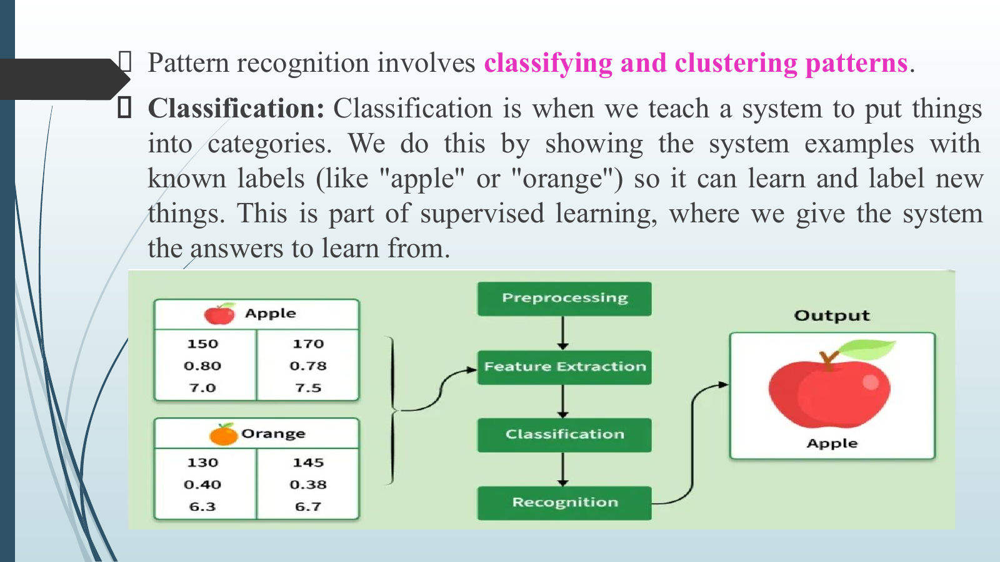

### Extracted Slide Text

- Pattern recognition involves classifying and clustering patterns.
- Classification: Classification is when we teach a system to put things
- into categories. We do this by showing the system examples with
- known labels (like "apple" or "orange") so it can learn and label new
- things. This is part of supervised learning, where we give the system
- the answers to learn from.

### Page Description And Teaching Notes

Slide type: concept explanation slide.
Main idea: Classification: Classification is when we teach a system to put things into categories. We do this by showing the system examples with known labels (like "apple" or "orange") so it can learn and label new things. This is part of supervised learning, where we give the system the answers to learn from.
This page explains a core concept in prose. The main task is to convert the definition into a clear statement of what the concept is, why it is used, and where it appears in a machine-learning workflow.
Detailed page understanding:
- `Classification: Classification is when we teach a system to put things` is a core visible point. Explain what it means, why it matters, and how it connects to the slide title.
- `into categories. We do this by showing the system examples with` is an application/example point. Convert it into a concrete real-world case while teaching.
- `known labels (like "apple" or "orange") so it can learn and label new` is a core visible point. Explain what it means, why it matters, and how it connects to the slide title.
- `things. This is part of supervised learning, where we give the system` is a core visible point. Explain what it means, why it matters, and how it connects to the slide title.
- `the answers to learn from.` is a core visible point. Explain what it means, why it matters, and how it connects to the slide title.
Important visible terms: Pattern, Classification, This.
Visual/layout description: the embedded image preserves the actual slide. Describe the title area first, then read bullets, formulas, tables, arrows, grouped boxes, or diagrams in their visible order. If the slide contains a diagram, explain the relationship shown by arrows/positioning before explaining the text labels.
Teaching note: after reading the slide, ask the learner to restate the page in one or two sentences and give one example. For formula or metric slides, also ask what each variable or metric means and when it should be used.
Exam/viva note: prepare the slide title as a short-answer question, then use the bullets or visual labels as the expected answer points.

## Page 62: Clustering: Clustering is when the system groups similar

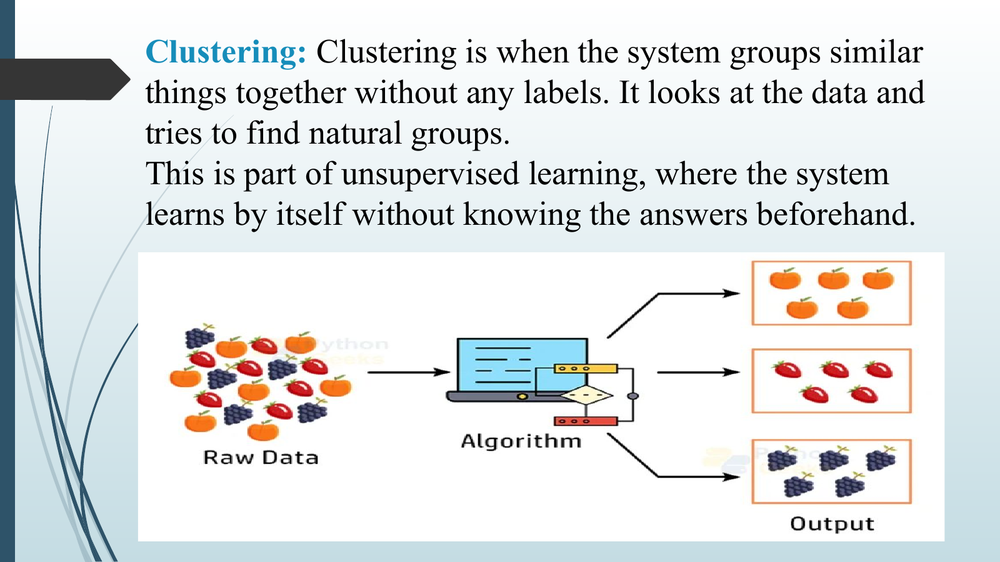

### Extracted Slide Text

- Clustering: Clustering is when the system groups similar
- things together without any labels. It looks at the data and
- tries to find natural groups.
- This is part of unsupervised learning, where the system
- learns by itself without knowing the answers beforehand.

### Page Description And Teaching Notes

Slide type: concept explanation slide.
Main idea: things together without any labels. It looks at the data and tries to find natural groups. This is part of unsupervised learning, where the system learns by itself without knowing the answers beforehand.
This page explains a core concept in prose. The main task is to convert the definition into a clear statement of what the concept is, why it is used, and where it appears in a machine-learning workflow.
Detailed page understanding:
- `things together without any labels. It looks at the data and` is a core visible point. Explain what it means, why it matters, and how it connects to the slide title.
- `tries to find natural groups.` is a core visible point. Explain what it means, why it matters, and how it connects to the slide title.
- `This is part of unsupervised learning, where the system` is a core visible point. Explain what it means, why it matters, and how it connects to the slide title.
- `learns by itself without knowing the answers beforehand.` is a core visible point. Explain what it means, why it matters, and how it connects to the slide title.
Important visible terms: Clustering, This.
Visual/layout description: the embedded image preserves the actual slide. Describe the title area first, then read bullets, formulas, tables, arrows, grouped boxes, or diagrams in their visible order. If the slide contains a diagram, explain the relationship shown by arrows/positioning before explaining the text labels.
Teaching note: after reading the slide, ask the learner to restate the page in one or two sentences and give one example. For formula or metric slides, also ask what each variable or metric means and when it should be used.
Exam/viva note: prepare the slide title as a short-answer question, then use the bullets or visual labels as the expected answer points.

## Page 63: Core concepts of pattern

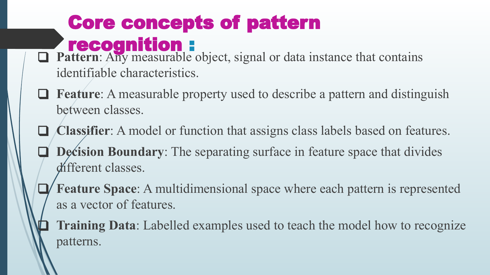

### Extracted Slide Text

- Core concepts of pattern
- recognition :
- ❑ Pattern: Any measurable object, signal or data instance that contains
- identifiable characteristics.
- ❑ Feature: A measurable property used to describe a pattern and distinguish
- between classes.
- ❑ Classifier: A model or function that assigns class labels based on features.
- ❑ Decision Boundary: The separating surface in feature space that divides
- different classes.
- ❑ Feature Space: A multidimensional space where each pattern is represented
- as a vector of features.
- ❑ Training Data: Labelled examples used to teach the model how to recognize
- patterns.

### Page Description And Teaching Notes

Slide type: bullet explanation slide.
Main idea: recognition : ❑ Pattern: Any measurable object, signal or data instance that contains identifiable characteristics. ❑ Feature: A measurable property used to describe a pattern and distinguish between classes. ❑ Classifier: A model or function that assigns class labels based on features.
This page breaks the topic into separate points. Each bullet should be treated as a distinct exam or viva talking point, with the learner able to define it and give a small example.
Detailed page understanding:
- `recognition :` is a core visible point. Explain what it means, why it matters, and how it connects to the slide title.
- `❑ Pattern: Any measurable object, signal or data instance that contains` is one item in the slide's list. Treat it as a separate subtopic and prepare a one-line explanation for it.
- `identifiable characteristics.` is a core visible point. Explain what it means, why it matters, and how it connects to the slide title.
- `❑ Feature: A measurable property used to describe a pattern and distinguish` is an application/example point. Convert it into a concrete real-world case while teaching.
- `between classes.` is a core visible point. Explain what it means, why it matters, and how it connects to the slide title.
- `❑ Classifier: A model or function that assigns class labels based on features.` is one item in the slide's list. Treat it as a separate subtopic and prepare a one-line explanation for it.
- `❑ Decision Boundary: The separating surface in feature space that divides` is one item in the slide's list. Treat it as a separate subtopic and prepare a one-line explanation for it.
- `different classes.` is a core visible point. Explain what it means, why it matters, and how it connects to the slide title.
- Additional bullets continue on the slide; use the extracted text list above for the complete wording.
- `patterns.` is a core visible point. Explain what it means, why it matters, and how it connects to the slide title.
Important visible terms: Core, Pattern, Any, Feature, Classifier, Decision Boundary, The, Feature Space.
Visual/layout description: the embedded image preserves the actual slide. Describe the title area first, then read bullets, formulas, tables, arrows, grouped boxes, or diagrams in their visible order. If the slide contains a diagram, explain the relationship shown by arrows/positioning before explaining the text labels.
Teaching note: after reading the slide, ask the learner to restate the page in one or two sentences and give one example. For formula or metric slides, also ask what each variable or metric means and when it should be used.
Exam/viva note: prepare the slide title as a short-answer question, then use the bullets or visual labels as the expected answer points.

## Page 64: Working of a Pattern Recognition

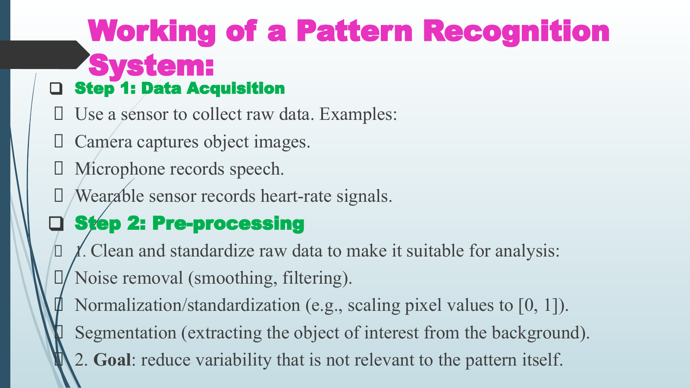

### Extracted Slide Text

- Working of a Pattern Recognition
- System:
- ❑ Step 1: Data Acquisition
- Use a sensor to collect raw data. Examples:
- Camera captures object images.
- Microphone records speech.
- Wearable sensor records heart-rate signals.
- ❑ Step 2: Pre-processing
- 1. Clean and standardize raw data to make it suitable for analysis:
- Noise removal (smoothing, filtering).
- Normalization/standardization (e.g., scaling pixel values to [0, 1]).
- Segmentation (extracting the object of interest from the background).
- 2. Goal: reduce variability that is not relevant to the pattern itself.

### Page Description And Teaching Notes

Slide type: metric/table slide.
Main idea: System: ❑ Step 1: Data Acquisition Use a sensor to collect raw data. Examples: Camera captures object images. Microphone records speech. Wearable sensor records heart-rate signals.
This page organizes evaluation or comparison information. Focus on what each metric measures, when it is useful, and what mistake it prevents when judging a machine-learning model.
Detailed page understanding:
- `System:` is a core visible point. Explain what it means, why it matters, and how it connects to the slide title.
- `❑ Step 1: Data Acquisition` is one item in the slide's list. Treat it as a separate subtopic and prepare a one-line explanation for it.
- `Use a sensor to collect raw data. Examples:` is an application/example point. Convert it into a concrete real-world case while teaching.
- `Camera captures object images.` is a core visible point. Explain what it means, why it matters, and how it connects to the slide title.
- `Microphone records speech.` is a core visible point. Explain what it means, why it matters, and how it connects to the slide title.
- `Wearable sensor records heart-rate signals.` is a core visible point. Explain what it means, why it matters, and how it connects to the slide title.
- `❑ Step 2: Pre-processing` is one item in the slide's list. Treat it as a separate subtopic and prepare a one-line explanation for it.
- `1. Clean and standardize raw data to make it suitable for analysis:` is one item in the slide's list. Treat it as a separate subtopic and prepare a one-line explanation for it.
- Additional bullets continue on the slide; use the extracted text list above for the complete wording.
- `2. Goal: reduce variability that is not relevant to the pattern itself.` is one item in the slide's list. Treat it as a separate subtopic and prepare a one-line explanation for it.
Important visible terms: Working, Pattern Recognition System, Step, Data Acquisition Use, Examples, Camera, Microphone, Wearable.
Visual/layout description: the embedded image preserves the actual slide. Describe the title area first, then read bullets, formulas, tables, arrows, grouped boxes, or diagrams in their visible order. If the slide contains a diagram, explain the relationship shown by arrows/positioning before explaining the text labels.
Teaching note: after reading the slide, ask the learner to restate the page in one or two sentences and give one example. For formula or metric slides, also ask what each variable or metric means and when it should be used.
Exam/viva note: prepare the slide title as a short-answer question, then use the bullets or visual labels as the expected answer points.

## Page 65: Step 3: Feature Extraction

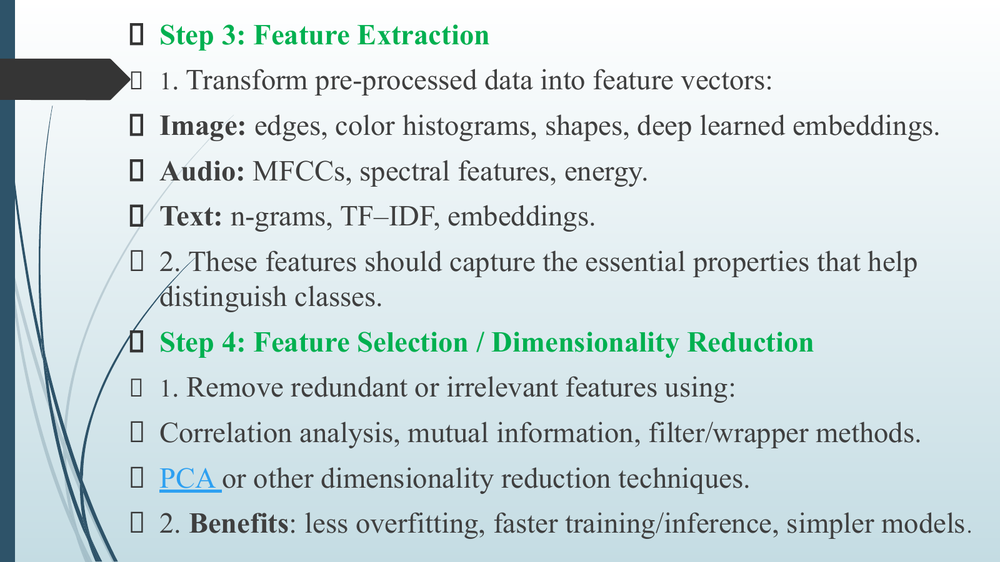

### Extracted Slide Text

- Step 3: Feature Extraction
- 1. Transform pre-processed data into feature vectors:
- Image: edges, color histograms, shapes, deep learned embeddings.
- Audio: MFCCs, spectral features, energy.
- Text: n-grams, TF–IDF, embeddings.
- 2. These features should capture the essential properties that help
- distinguish classes.
- Step 4: Feature Selection / Dimensionality Reduction
- 1. Remove redundant or irrelevant features using:
- Correlation analysis, mutual information, filter/wrapper methods.
- PCA or other dimensionality reduction techniques.
- 2. Benefits: less overfitting, faster training/inference, simpler models.

### Page Description And Teaching Notes

Slide type: process or diagram slide.
Main idea: 1. Transform pre-processed data into feature vectors: Image: edges, color histograms, shapes, deep learned embeddings. Audio: MFCCs, spectral features, energy. Text: n-grams, TF–IDF, embeddings. 2. These features should capture the essential properties that help distinguish classes.
This page describes a flow, algorithm, or sequence. Read the visual from start to finish and explain how each stage transforms data, parameters, or decisions into the next stage.
Detailed page understanding:
- `1. Transform pre-processed data into feature vectors:` is one item in the slide's list. Treat it as a separate subtopic and prepare a one-line explanation for it.
- `Image: edges, color histograms, shapes, deep learned embeddings.` is a core visible point. Explain what it means, why it matters, and how it connects to the slide title.
- `Audio: MFCCs, spectral features, energy.` is a core visible point. Explain what it means, why it matters, and how it connects to the slide title.
- `Text: n-grams, TF–IDF, embeddings.` is a core visible point. Explain what it means, why it matters, and how it connects to the slide title.
- `2. These features should capture the essential properties that help` is one item in the slide's list. Treat it as a separate subtopic and prepare a one-line explanation for it.
- `distinguish classes.` is a core visible point. Explain what it means, why it matters, and how it connects to the slide title.
- `Step 4: Feature Selection / Dimensionality Reduction` is a core visible point. Explain what it means, why it matters, and how it connects to the slide title.
- `1. Remove redundant or irrelevant features using:` is one item in the slide's list. Treat it as a separate subtopic and prepare a one-line explanation for it.
- Additional bullets continue on the slide; use the extracted text list above for the complete wording.
- `2. Benefits: less overfitting, faster training/inference, simpler models.` states a benefit. Use it to justify why this method or concept is useful in a machine-learning workflow.
Important visible terms: Step, Feature Extraction, Transform, Image, Audio, MFCCs, Text, IDF.
Visual/layout description: the embedded image preserves the actual slide. Describe the title area first, then read bullets, formulas, tables, arrows, grouped boxes, or diagrams in their visible order. If the slide contains a diagram, explain the relationship shown by arrows/positioning before explaining the text labels.
Teaching note: after reading the slide, ask the learner to restate the page in one or two sentences and give one example. For formula or metric slides, also ask what each variable or metric means and when it should be used.
Exam/viva note: prepare the slide title as a short-answer question, then use the bullets or visual labels as the expected answer points.

## Page 66: ❑ Step 5: Classifier Design and Training

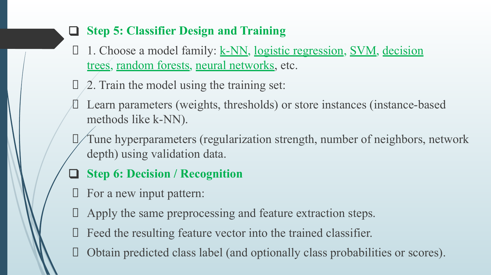

### Extracted Slide Text

- ❑ Step 5: Classifier Design and Training
- 1. Choose a model family: k-NN, logistic regression, SVM, decision
- trees, random forests, neural networks, etc.
- 2. Train the model using the training set:
- Learn parameters (weights, thresholds) or store instances (instance-based
- methods like k-NN).
- Tune hyperparameters (regularization strength, number of neighbors, network
- depth) using validation data.
- ❑ Step 6: Decision / Recognition
- For a new input pattern:
- Apply the same preprocessing and feature extraction steps.
- Feed the resulting feature vector into the trained classifier.
- Obtain predicted class label (and optionally class probabilities or scores).

### Page Description And Teaching Notes

Slide type: process or diagram slide.
Main idea: 1. Choose a model family: k-NN, logistic regression, SVM, decision trees, random forests, neural networks, etc. 2. Train the model using the training set: Learn parameters (weights, thresholds) or store instances (instance-based methods like k-NN). Tune hyperparameters (regularization strength, number of neighbors, network.
This page describes a flow, algorithm, or sequence. Read the visual from start to finish and explain how each stage transforms data, parameters, or decisions into the next stage.
Detailed page understanding:
- `1. Choose a model family: k-NN, logistic regression, SVM, decision` is one item in the slide's list. Treat it as a separate subtopic and prepare a one-line explanation for it.
- `trees, random forests, neural networks, etc.` is a core visible point. Explain what it means, why it matters, and how it connects to the slide title.
- `2. Train the model using the training set:` is one item in the slide's list. Treat it as a separate subtopic and prepare a one-line explanation for it.
- `Learn parameters (weights, thresholds) or store instances (instance-based` is a core visible point. Explain what it means, why it matters, and how it connects to the slide title.
- `methods like k-NN).` is a core visible point. Explain what it means, why it matters, and how it connects to the slide title.
- `Tune hyperparameters (regularization strength, number of neighbors, network` is a core visible point. Explain what it means, why it matters, and how it connects to the slide title.
- `depth) using validation data.` is a core visible point. Explain what it means, why it matters, and how it connects to the slide title.
- `❑ Step 6: Decision / Recognition` is one item in the slide's list. Treat it as a separate subtopic and prepare a one-line explanation for it.
- Additional bullets continue on the slide; use the extracted text list above for the complete wording.
- `Obtain predicted class label (and optionally class probabilities or scores).` is a core visible point. Explain what it means, why it matters, and how it connects to the slide title.
Important visible terms: Step, Classifier Design, Training, Choose, SVM, Train, Learn, Tune.
Visual/layout description: the embedded image preserves the actual slide. Describe the title area first, then read bullets, formulas, tables, arrows, grouped boxes, or diagrams in their visible order. If the slide contains a diagram, explain the relationship shown by arrows/positioning before explaining the text labels.
Teaching note: after reading the slide, ask the learner to restate the page in one or two sentences and give one example. For formula or metric slides, also ask what each variable or metric means and when it should be used.
Exam/viva note: prepare the slide title as a short-answer question, then use the bullets or visual labels as the expected answer points.

## Page 67: ❑ Step 7: Evaluation and Iteration

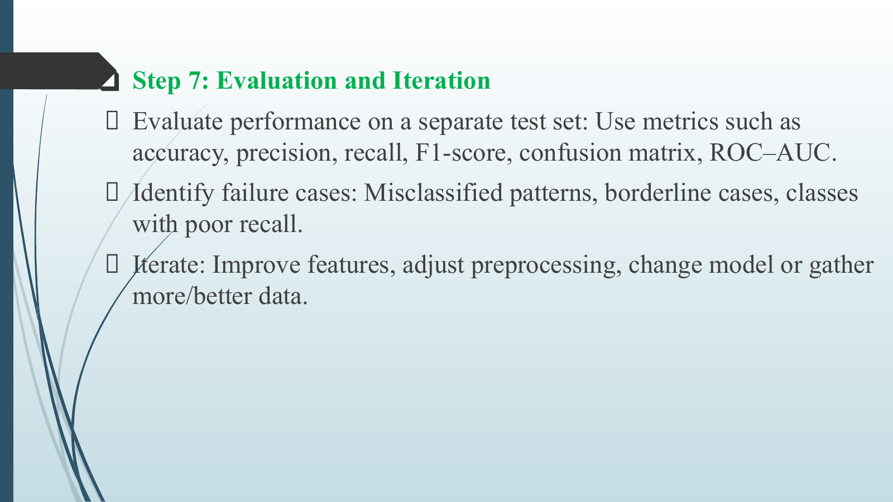

### Extracted Slide Text

- ❑ Step 7: Evaluation and Iteration
- Evaluate performance on a separate test set: Use metrics such as
- accuracy, precision, recall, F1-score, confusion matrix, ROC–AUC.
- Identify failure cases: Misclassified patterns, borderline cases, classes
- with poor recall.
- Iterate: Improve features, adjust preprocessing, change model or gather
- more/better data.

### Page Description And Teaching Notes

Slide type: metric/table slide.
Main idea: Evaluate performance on a separate test set: Use metrics such as accuracy, precision, recall, F1-score, confusion matrix, ROC–AUC. Identify failure cases: Misclassified patterns, borderline cases, classes with poor recall. Iterate: Improve features, adjust preprocessing, change model or gather more/better data.
This page organizes evaluation or comparison information. Focus on what each metric measures, when it is useful, and what mistake it prevents when judging a machine-learning model.
Detailed page understanding:
- `Evaluate performance on a separate test set: Use metrics such as` is an application/example point. Convert it into a concrete real-world case while teaching.
- `accuracy, precision, recall, F1-score, confusion matrix, ROC–AUC.` is a core visible point. Explain what it means, why it matters, and how it connects to the slide title.
- `Identify failure cases: Misclassified patterns, borderline cases, classes` is a core visible point. Explain what it means, why it matters, and how it connects to the slide title.
- `with poor recall.` is a core visible point. Explain what it means, why it matters, and how it connects to the slide title.
- `Iterate: Improve features, adjust preprocessing, change model or gather` is a core visible point. Explain what it means, why it matters, and how it connects to the slide title.
- `more/better data.` is a core visible point. Explain what it means, why it matters, and how it connects to the slide title.
Important visible terms: Step, Evaluation, Iteration Evaluate, Use, F1-score, ROC, AUC, Identify.
Visual/layout description: the embedded image preserves the actual slide. Describe the title area first, then read bullets, formulas, tables, arrows, grouped boxes, or diagrams in their visible order. If the slide contains a diagram, explain the relationship shown by arrows/positioning before explaining the text labels.
Teaching note: after reading the slide, ask the learner to restate the page in one or two sentences and give one example. For formula or metric slides, also ask what each variable or metric means and when it should be used.
Exam/viva note: prepare the slide title as a short-answer question, then use the bullets or visual labels as the expected answer points.

## Page 68: Unit I - Introduction to Machine Learning Page 68

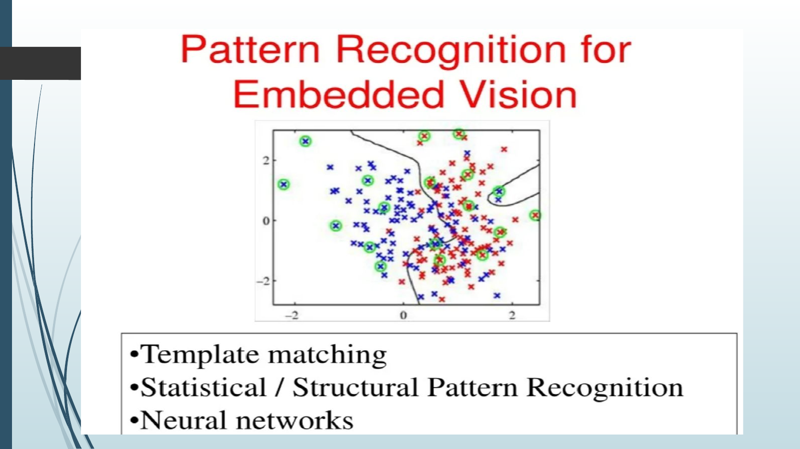

### Extracted Slide Text

- No selectable text extracted from this page.

### Page Description And Teaching Notes

Slide type: visual-only or image-heavy slide.
Main idea: the slide is visual-first, so the image should be treated as the source for the content and structure.
This page is primarily visual. The embedded slide image is the authoritative visual output; read it as a diagram or illustration first, then connect any visible labels to the surrounding pages.
- No reliable selectable text was extracted; use the slide image for the visible diagram, chart, or screenshot.
Visual/layout description: the embedded image preserves the actual slide. Describe the title area first, then read bullets, formulas, tables, arrows, grouped boxes, or diagrams in their visible order. If the slide contains a diagram, explain the relationship shown by arrows/positioning before explaining the text labels.
Teaching note: after reading the slide, ask the learner to restate the page in one or two sentences and give one example. For formula or metric slides, also ask what each variable or metric means and when it should be used.
Exam/viva note: prepare the slide title as a short-answer question, then use the bullets or visual labels as the expected answer points.

## Page 69: Unit I - Introduction to Machine Learning Page 69

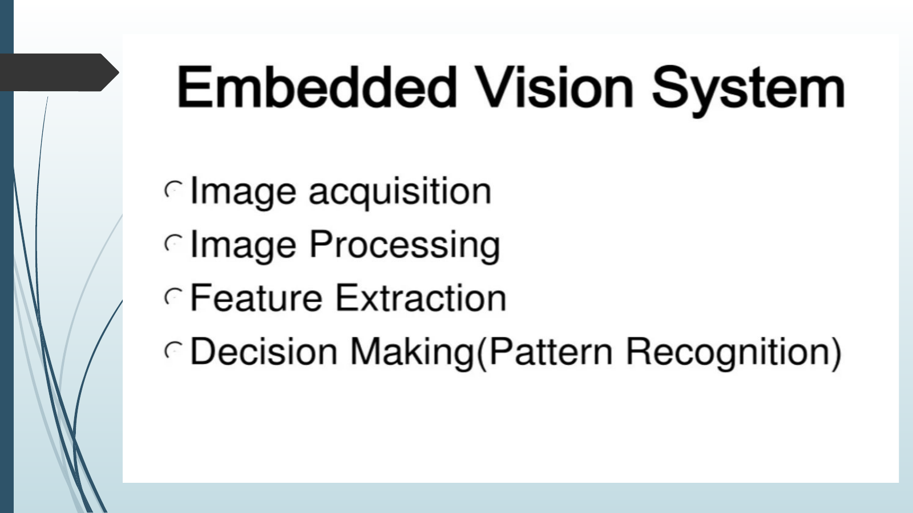

### Extracted Slide Text

- No selectable text extracted from this page.

### Page Description And Teaching Notes

Slide type: visual-only or image-heavy slide.
Main idea: the slide is visual-first, so the image should be treated as the source for the content and structure.
This page is primarily visual. The embedded slide image is the authoritative visual output; read it as a diagram or illustration first, then connect any visible labels to the surrounding pages.
- No reliable selectable text was extracted; use the slide image for the visible diagram, chart, or screenshot.
Visual/layout description: the embedded image preserves the actual slide. Describe the title area first, then read bullets, formulas, tables, arrows, grouped boxes, or diagrams in their visible order. If the slide contains a diagram, explain the relationship shown by arrows/positioning before explaining the text labels.
Teaching note: after reading the slide, ask the learner to restate the page in one or two sentences and give one example. For formula or metric slides, also ask what each variable or metric means and when it should be used.
Exam/viva note: prepare the slide title as a short-answer question, then use the bullets or visual labels as the expected answer points.

## Page 70: Unit I - Introduction to Machine Learning Page 70

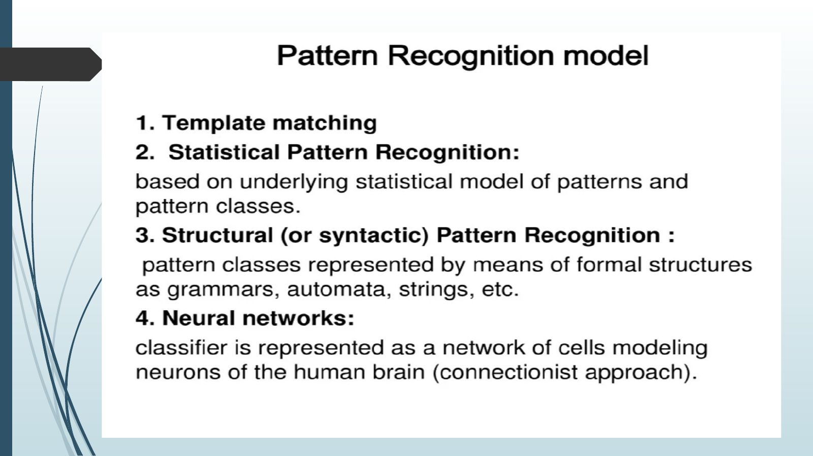

### Extracted Slide Text

- No selectable text extracted from this page.

### Page Description And Teaching Notes

Slide type: visual-only or image-heavy slide.
Main idea: the slide is visual-first, so the image should be treated as the source for the content and structure.
This page is primarily visual. The embedded slide image is the authoritative visual output; read it as a diagram or illustration first, then connect any visible labels to the surrounding pages.
- No reliable selectable text was extracted; use the slide image for the visible diagram, chart, or screenshot.
Visual/layout description: the embedded image preserves the actual slide. Describe the title area first, then read bullets, formulas, tables, arrows, grouped boxes, or diagrams in their visible order. If the slide contains a diagram, explain the relationship shown by arrows/positioning before explaining the text labels.
Teaching note: after reading the slide, ask the learner to restate the page in one or two sentences and give one example. For formula or metric slides, also ask what each variable or metric means and when it should be used.
Exam/viva note: prepare the slide title as a short-answer question, then use the bullets or visual labels as the expected answer points.

## Page 71: Unit I - Introduction to Machine Learning Page 71

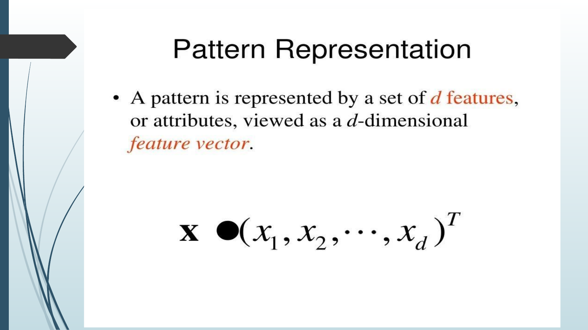

### Extracted Slide Text

- No selectable text extracted from this page.

### Page Description And Teaching Notes

Slide type: visual-only or image-heavy slide.
Main idea: the slide is visual-first, so the image should be treated as the source for the content and structure.
This page is primarily visual. The embedded slide image is the authoritative visual output; read it as a diagram or illustration first, then connect any visible labels to the surrounding pages.
- No reliable selectable text was extracted; use the slide image for the visible diagram, chart, or screenshot.
Visual/layout description: the embedded image preserves the actual slide. Describe the title area first, then read bullets, formulas, tables, arrows, grouped boxes, or diagrams in their visible order. If the slide contains a diagram, explain the relationship shown by arrows/positioning before explaining the text labels.
Teaching note: after reading the slide, ask the learner to restate the page in one or two sentences and give one example. For formula or metric slides, also ask what each variable or metric means and when it should be used.
Exam/viva note: prepare the slide title as a short-answer question, then use the bullets or visual labels as the expected answer points.

## Page 72: Unit I - Introduction to Machine Learning Page 72

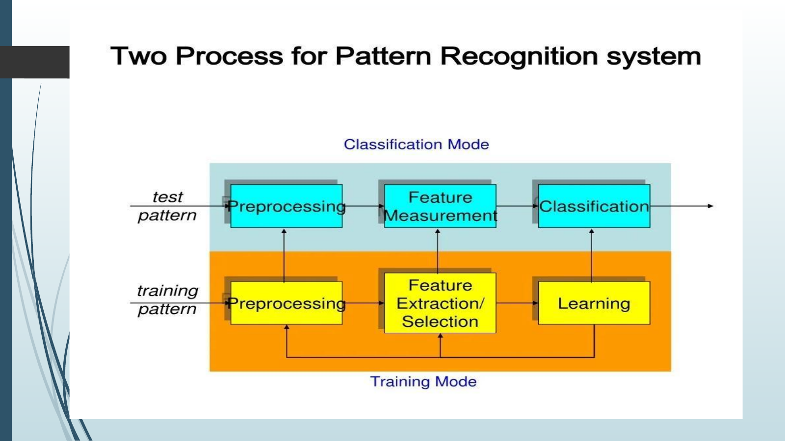

### Extracted Slide Text

- No selectable text extracted from this page.

### Page Description And Teaching Notes

Slide type: visual-only or image-heavy slide.
Main idea: the slide is visual-first, so the image should be treated as the source for the content and structure.
This page is primarily visual. The embedded slide image is the authoritative visual output; read it as a diagram or illustration first, then connect any visible labels to the surrounding pages.
- No reliable selectable text was extracted; use the slide image for the visible diagram, chart, or screenshot.
Visual/layout description: the embedded image preserves the actual slide. Describe the title area first, then read bullets, formulas, tables, arrows, grouped boxes, or diagrams in their visible order. If the slide contains a diagram, explain the relationship shown by arrows/positioning before explaining the text labels.
Teaching note: after reading the slide, ask the learner to restate the page in one or two sentences and give one example. For formula or metric slides, also ask what each variable or metric means and when it should be used.
Exam/viva note: prepare the slide title as a short-answer question, then use the bullets or visual labels as the expected answer points.

## Page 73: Unit I - Introduction to Machine Learning Page 73

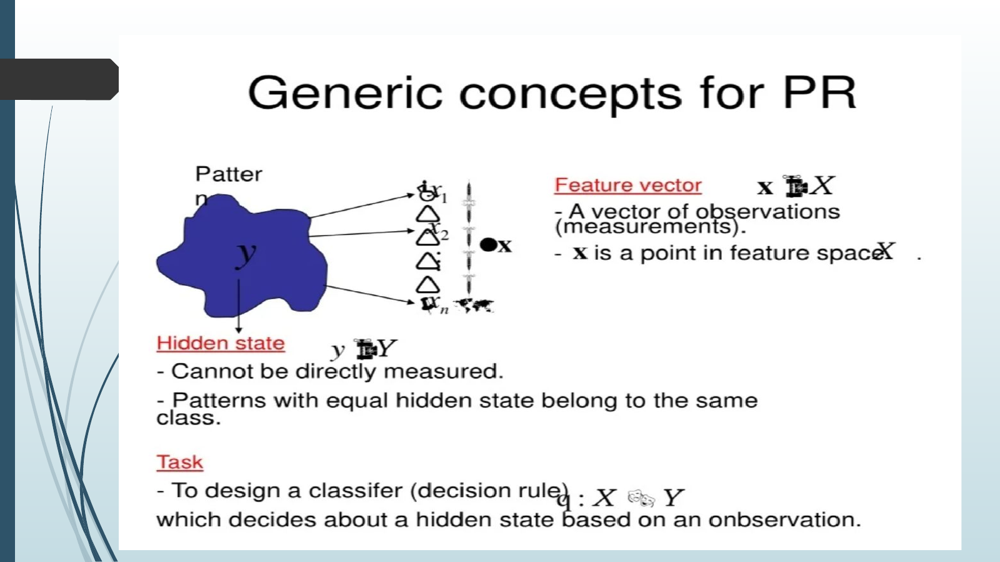

### Extracted Slide Text

- No selectable text extracted from this page.

### Page Description And Teaching Notes

Slide type: visual-only or image-heavy slide.
Main idea: the slide is visual-first, so the image should be treated as the source for the content and structure.
This page is primarily visual. The embedded slide image is the authoritative visual output; read it as a diagram or illustration first, then connect any visible labels to the surrounding pages.
- No reliable selectable text was extracted; use the slide image for the visible diagram, chart, or screenshot.
Visual/layout description: the embedded image preserves the actual slide. Describe the title area first, then read bullets, formulas, tables, arrows, grouped boxes, or diagrams in their visible order. If the slide contains a diagram, explain the relationship shown by arrows/positioning before explaining the text labels.
Teaching note: after reading the slide, ask the learner to restate the page in one or two sentences and give one example. For formula or metric slides, also ask what each variable or metric means and when it should be used.
Exam/viva note: prepare the slide title as a short-answer question, then use the bullets or visual labels as the expected answer points.

## Page 74: Unit I - Introduction to Machine Learning Page 74

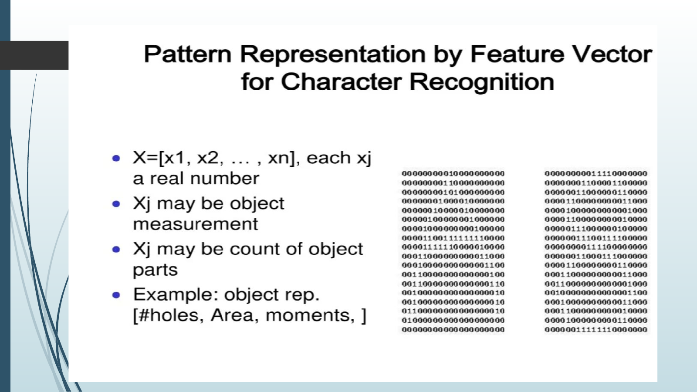

### Extracted Slide Text

- No selectable text extracted from this page.

### Page Description And Teaching Notes

Slide type: visual-only or image-heavy slide.
Main idea: the slide is visual-first, so the image should be treated as the source for the content and structure.
This page is primarily visual. The embedded slide image is the authoritative visual output; read it as a diagram or illustration first, then connect any visible labels to the surrounding pages.
- No reliable selectable text was extracted; use the slide image for the visible diagram, chart, or screenshot.
Visual/layout description: the embedded image preserves the actual slide. Describe the title area first, then read bullets, formulas, tables, arrows, grouped boxes, or diagrams in their visible order. If the slide contains a diagram, explain the relationship shown by arrows/positioning before explaining the text labels.
Teaching note: after reading the slide, ask the learner to restate the page in one or two sentences and give one example. For formula or metric slides, also ask what each variable or metric means and when it should be used.
Exam/viva note: prepare the slide title as a short-answer question, then use the bullets or visual labels as the expected answer points.

## Page 75: Unit I - Introduction to Machine Learning Page 75

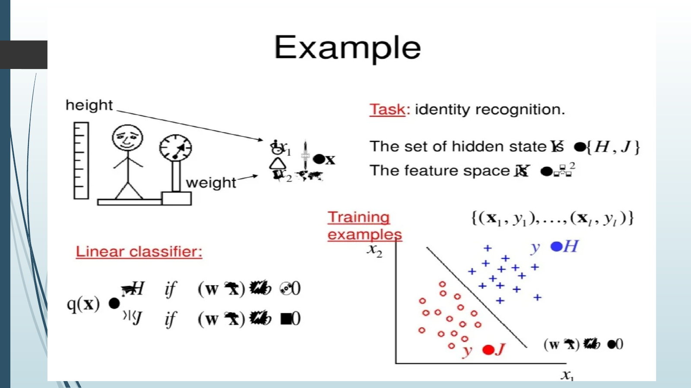

### Extracted Slide Text

- No selectable text extracted from this page.

### Page Description And Teaching Notes

Slide type: visual-only or image-heavy slide.
Main idea: the slide is visual-first, so the image should be treated as the source for the content and structure.
This page is primarily visual. The embedded slide image is the authoritative visual output; read it as a diagram or illustration first, then connect any visible labels to the surrounding pages.
- No reliable selectable text was extracted; use the slide image for the visible diagram, chart, or screenshot.
Visual/layout description: the embedded image preserves the actual slide. Describe the title area first, then read bullets, formulas, tables, arrows, grouped boxes, or diagrams in their visible order. If the slide contains a diagram, explain the relationship shown by arrows/positioning before explaining the text labels.
Teaching note: after reading the slide, ask the learner to restate the page in one or two sentences and give one example. For formula or metric slides, also ask what each variable or metric means and when it should be used.
Exam/viva note: prepare the slide title as a short-answer question, then use the bullets or visual labels as the expected answer points.

## Page 76: Unit I - Introduction to Machine Learning Page 76

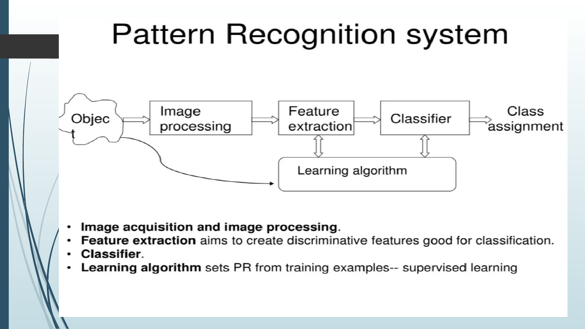

### Extracted Slide Text

- No selectable text extracted from this page.

### Page Description And Teaching Notes

Slide type: visual-only or image-heavy slide.
Main idea: the slide is visual-first, so the image should be treated as the source for the content and structure.
This page is primarily visual. The embedded slide image is the authoritative visual output; read it as a diagram or illustration first, then connect any visible labels to the surrounding pages.
- No reliable selectable text was extracted; use the slide image for the visible diagram, chart, or screenshot.
Visual/layout description: the embedded image preserves the actual slide. Describe the title area first, then read bullets, formulas, tables, arrows, grouped boxes, or diagrams in their visible order. If the slide contains a diagram, explain the relationship shown by arrows/positioning before explaining the text labels.
Teaching note: after reading the slide, ask the learner to restate the page in one or two sentences and give one example. For formula or metric slides, also ask what each variable or metric means and when it should be used.
Exam/viva note: prepare the slide title as a short-answer question, then use the bullets or visual labels as the expected answer points.

## Page 77: Unit I - Introduction to Machine Learning Page 77

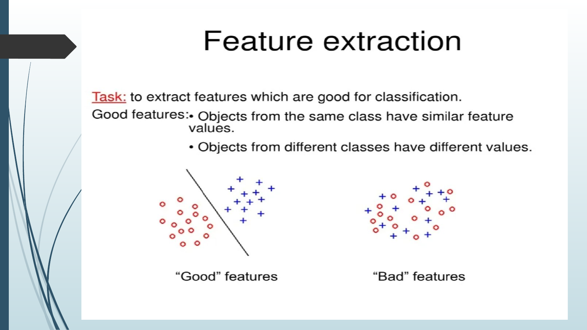

### Extracted Slide Text

- No selectable text extracted from this page.

### Page Description And Teaching Notes

Slide type: visual-only or image-heavy slide.
Main idea: the slide is visual-first, so the image should be treated as the source for the content and structure.
This page is primarily visual. The embedded slide image is the authoritative visual output; read it as a diagram or illustration first, then connect any visible labels to the surrounding pages.
- No reliable selectable text was extracted; use the slide image for the visible diagram, chart, or screenshot.
Visual/layout description: the embedded image preserves the actual slide. Describe the title area first, then read bullets, formulas, tables, arrows, grouped boxes, or diagrams in their visible order. If the slide contains a diagram, explain the relationship shown by arrows/positioning before explaining the text labels.
Teaching note: after reading the slide, ask the learner to restate the page in one or two sentences and give one example. For formula or metric slides, also ask what each variable or metric means and when it should be used.
Exam/viva note: prepare the slide title as a short-answer question, then use the bullets or visual labels as the expected answer points.

## Page 78: Unit I - Introduction to Machine Learning Page 78

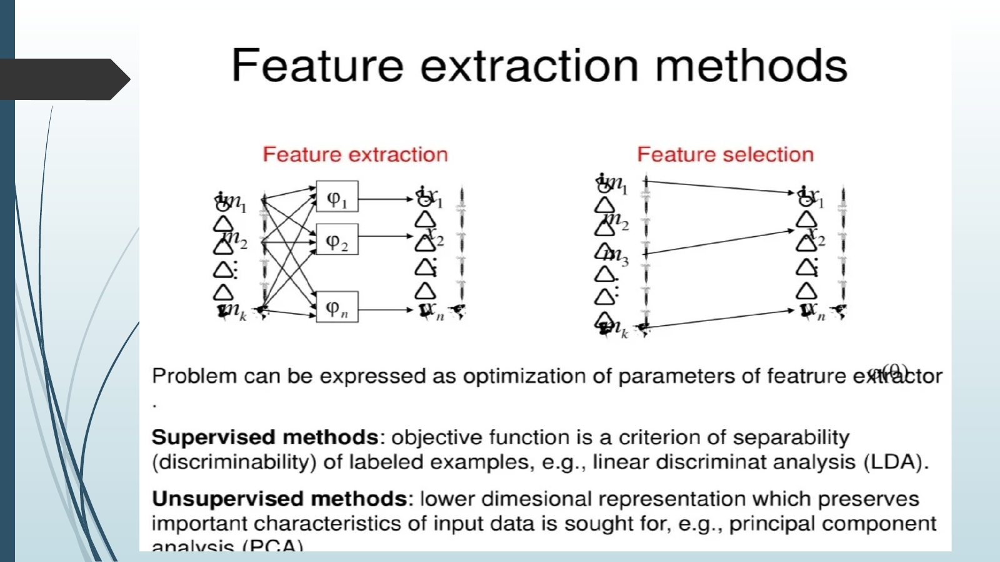

### Extracted Slide Text

- No selectable text extracted from this page.

### Page Description And Teaching Notes

Slide type: visual-only or image-heavy slide.
Main idea: the slide is visual-first, so the image should be treated as the source for the content and structure.
This page is primarily visual. The embedded slide image is the authoritative visual output; read it as a diagram or illustration first, then connect any visible labels to the surrounding pages.
- No reliable selectable text was extracted; use the slide image for the visible diagram, chart, or screenshot.
Visual/layout description: the embedded image preserves the actual slide. Describe the title area first, then read bullets, formulas, tables, arrows, grouped boxes, or diagrams in their visible order. If the slide contains a diagram, explain the relationship shown by arrows/positioning before explaining the text labels.
Teaching note: after reading the slide, ask the learner to restate the page in one or two sentences and give one example. For formula or metric slides, also ask what each variable or metric means and when it should be used.
Exam/viva note: prepare the slide title as a short-answer question, then use the bullets or visual labels as the expected answer points.

## Page 79: Unit I - Introduction to Machine Learning Page 79

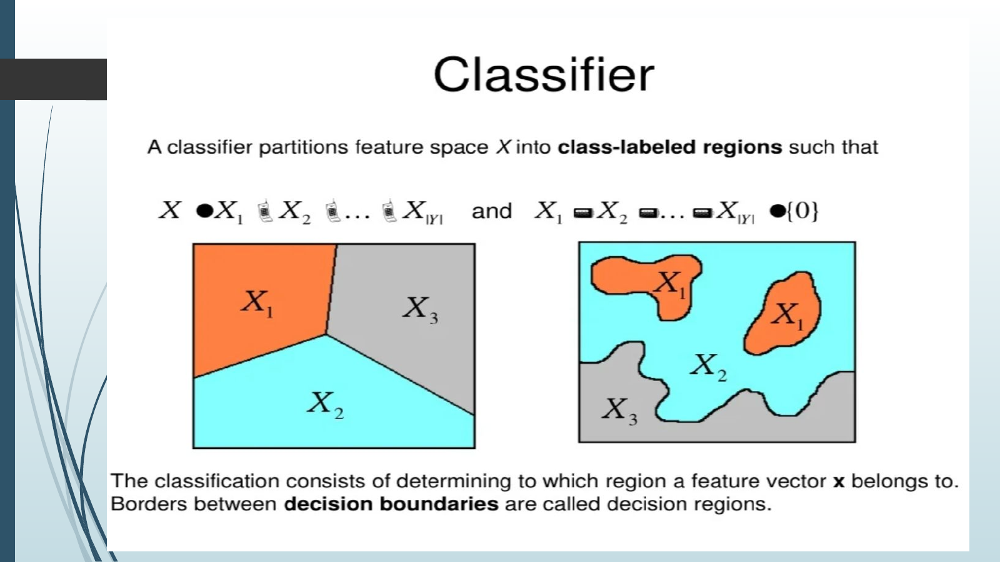

### Extracted Slide Text

- No selectable text extracted from this page.

### Page Description And Teaching Notes

Slide type: visual-only or image-heavy slide.
Main idea: the slide is visual-first, so the image should be treated as the source for the content and structure.
This page is primarily visual. The embedded slide image is the authoritative visual output; read it as a diagram or illustration first, then connect any visible labels to the surrounding pages.
- No reliable selectable text was extracted; use the slide image for the visible diagram, chart, or screenshot.
Visual/layout description: the embedded image preserves the actual slide. Describe the title area first, then read bullets, formulas, tables, arrows, grouped boxes, or diagrams in their visible order. If the slide contains a diagram, explain the relationship shown by arrows/positioning before explaining the text labels.
Teaching note: after reading the slide, ask the learner to restate the page in one or two sentences and give one example. For formula or metric slides, also ask what each variable or metric means and when it should be used.
Exam/viva note: prepare the slide title as a short-answer question, then use the bullets or visual labels as the expected answer points.

## Page 80: Unit I - Introduction to Machine Learning Page 80

### Extracted Slide Text

- No selectable text extracted from this page.

### Page Description And Teaching Notes

Slide type: visual-only or image-heavy slide.
Main idea: the slide is visual-first, so the image should be treated as the source for the content and structure.
This page is primarily visual. The embedded slide image is the authoritative visual output; read it as a diagram or illustration first, then connect any visible labels to the surrounding pages.
- No reliable selectable text was extracted; use the slide image for the visible diagram, chart, or screenshot.
Visual/layout description: the embedded image preserves the actual slide. Describe the title area first, then read bullets, formulas, tables, arrows, grouped boxes, or diagrams in their visible order. If the slide contains a diagram, explain the relationship shown by arrows/positioning before explaining the text labels.
Teaching note: after reading the slide, ask the learner to restate the page in one or two sentences and give one example. For formula or metric slides, also ask what each variable or metric means and when it should be used.
Exam/viva note: prepare the slide title as a short-answer question, then use the bullets or visual labels as the expected answer points.

## Page 81: Unit I - Introduction to Machine Learning Page 81

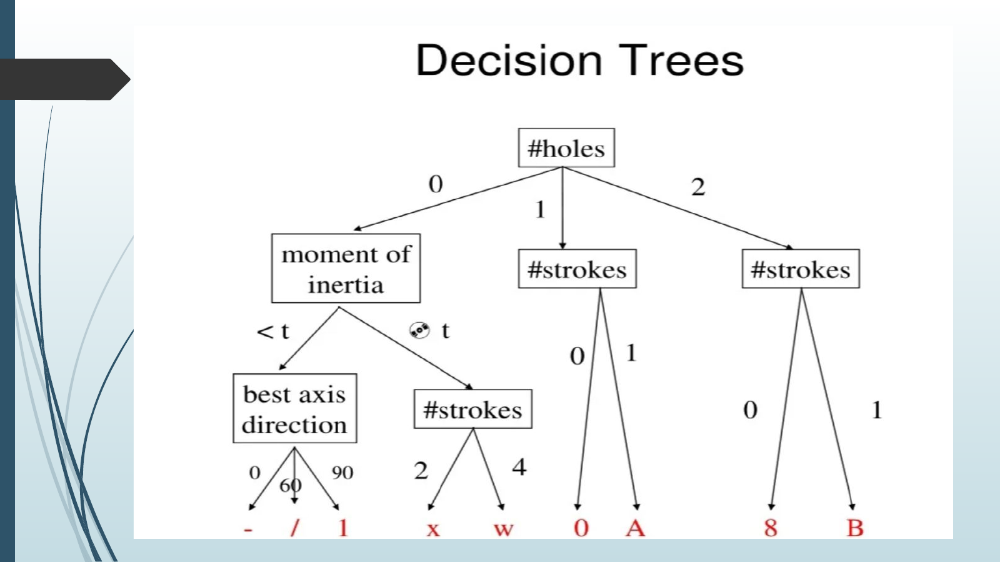

### Extracted Slide Text

- No selectable text extracted from this page.

### Page Description And Teaching Notes

Slide type: visual-only or image-heavy slide.
Main idea: the slide is visual-first, so the image should be treated as the source for the content and structure.
This page is primarily visual. The embedded slide image is the authoritative visual output; read it as a diagram or illustration first, then connect any visible labels to the surrounding pages.
- No reliable selectable text was extracted; use the slide image for the visible diagram, chart, or screenshot.
Visual/layout description: the embedded image preserves the actual slide. Describe the title area first, then read bullets, formulas, tables, arrows, grouped boxes, or diagrams in their visible order. If the slide contains a diagram, explain the relationship shown by arrows/positioning before explaining the text labels.
Teaching note: after reading the slide, ask the learner to restate the page in one or two sentences and give one example. For formula or metric slides, also ask what each variable or metric means and when it should be used.
Exam/viva note: prepare the slide title as a short-answer question, then use the bullets or visual labels as the expected answer points.

## Page 82: Unit I - Introduction to Machine Learning Page 82

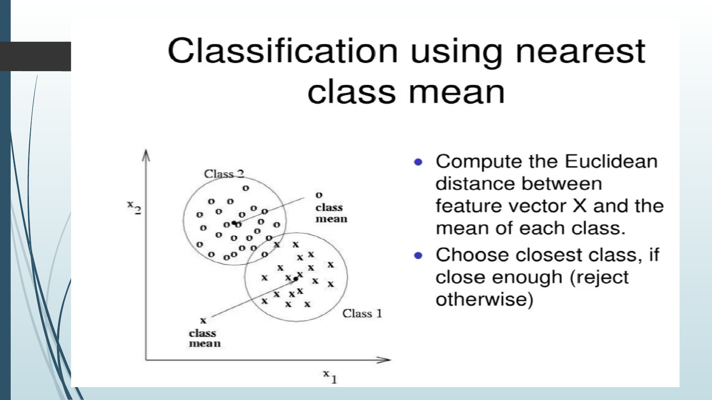

### Extracted Slide Text

- No selectable text extracted from this page.

### Page Description And Teaching Notes

Slide type: visual-only or image-heavy slide.
Main idea: the slide is visual-first, so the image should be treated as the source for the content and structure.
This page is primarily visual. The embedded slide image is the authoritative visual output; read it as a diagram or illustration first, then connect any visible labels to the surrounding pages.
- No reliable selectable text was extracted; use the slide image for the visible diagram, chart, or screenshot.
Visual/layout description: the embedded image preserves the actual slide. Describe the title area first, then read bullets, formulas, tables, arrows, grouped boxes, or diagrams in their visible order. If the slide contains a diagram, explain the relationship shown by arrows/positioning before explaining the text labels.
Teaching note: after reading the slide, ask the learner to restate the page in one or two sentences and give one example. For formula or metric slides, also ask what each variable or metric means and when it should be used.
Exam/viva note: prepare the slide title as a short-answer question, then use the bullets or visual labels as the expected answer points.

## Page 83: Unit I - Introduction to Machine Learning Page 83

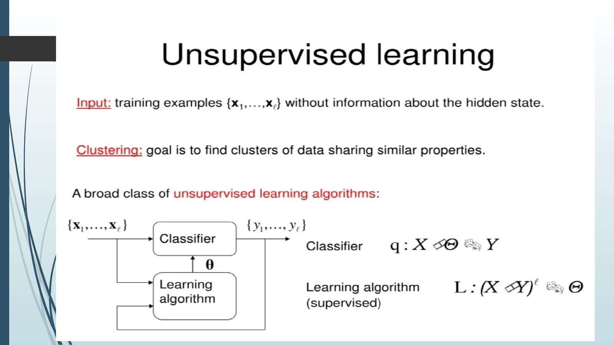

### Extracted Slide Text

- No selectable text extracted from this page.

### Page Description And Teaching Notes

Slide type: visual-only or image-heavy slide.
Main idea: the slide is visual-first, so the image should be treated as the source for the content and structure.
This page is primarily visual. The embedded slide image is the authoritative visual output; read it as a diagram or illustration first, then connect any visible labels to the surrounding pages.
- No reliable selectable text was extracted; use the slide image for the visible diagram, chart, or screenshot.
Visual/layout description: the embedded image preserves the actual slide. Describe the title area first, then read bullets, formulas, tables, arrows, grouped boxes, or diagrams in their visible order. If the slide contains a diagram, explain the relationship shown by arrows/positioning before explaining the text labels.
Teaching note: after reading the slide, ask the learner to restate the page in one or two sentences and give one example. For formula or metric slides, also ask what each variable or metric means and when it should be used.
Exam/viva note: prepare the slide title as a short-answer question, then use the bullets or visual labels as the expected answer points.

## Page 84: Unit I - Introduction to Machine Learning Page 84

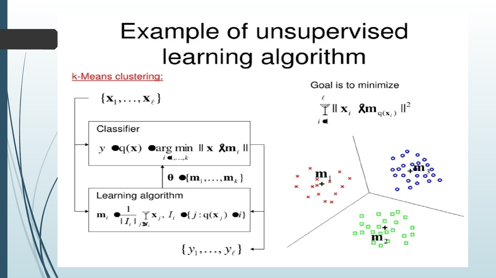

### Extracted Slide Text

- No selectable text extracted from this page.

### Page Description And Teaching Notes

Slide type: visual-only or image-heavy slide.
Main idea: the slide is visual-first, so the image should be treated as the source for the content and structure.
This page is primarily visual. The embedded slide image is the authoritative visual output; read it as a diagram or illustration first, then connect any visible labels to the surrounding pages.
- No reliable selectable text was extracted; use the slide image for the visible diagram, chart, or screenshot.
Visual/layout description: the embedded image preserves the actual slide. Describe the title area first, then read bullets, formulas, tables, arrows, grouped boxes, or diagrams in their visible order. If the slide contains a diagram, explain the relationship shown by arrows/positioning before explaining the text labels.
Teaching note: after reading the slide, ask the learner to restate the page in one or two sentences and give one example. For formula or metric slides, also ask what each variable or metric means and when it should be used.
Exam/viva note: prepare the slide title as a short-answer question, then use the bullets or visual labels as the expected answer points.

## Page 85: Unit I - Introduction to Machine Learning Page 85

### Extracted Slide Text

- No selectable text extracted from this page.

### Page Description And Teaching Notes

Slide type: visual-only or image-heavy slide.
Main idea: the slide is visual-first, so the image should be treated as the source for the content and structure.
This page is primarily visual. The embedded slide image is the authoritative visual output; read it as a diagram or illustration first, then connect any visible labels to the surrounding pages.
- No reliable selectable text was extracted; use the slide image for the visible diagram, chart, or screenshot.
Visual/layout description: the embedded image preserves the actual slide. Describe the title area first, then read bullets, formulas, tables, arrows, grouped boxes, or diagrams in their visible order. If the slide contains a diagram, explain the relationship shown by arrows/positioning before explaining the text labels.
Teaching note: after reading the slide, ask the learner to restate the page in one or two sentences and give one example. For formula or metric slides, also ask what each variable or metric means and when it should be used.
Exam/viva note: prepare the slide title as a short-answer question, then use the bullets or visual labels as the expected answer points.

## Page 86: Pattern Representation

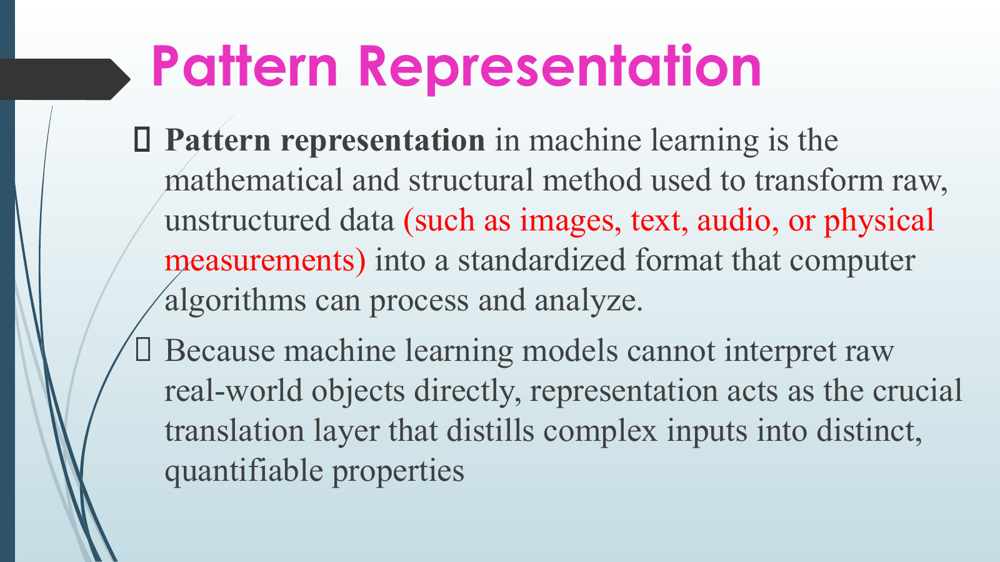

### Extracted Slide Text

- Pattern Representation
- Pattern representation in machine learning is the
- mathematical and structural method used to transform raw,
- unstructured data (such as images, text, audio, or physical
- measurements) into a standardized format that computer
- algorithms can process and analyze.
- Because machine learning models cannot interpret raw
- real-world objects directly, representation acts as the crucial
- translation layer that distills complex inputs into distinct,
- quantifiable properties

### Page Description And Teaching Notes

Slide type: process or diagram slide.
Main idea: Pattern representation in machine learning is the mathematical and structural method used to transform raw, unstructured data (such as images, text, audio, or physical measurements) into a standardized format that computer algorithms can process and analyze. Because machine learning models cannot interpret raw.
This page describes a flow, algorithm, or sequence. Read the visual from start to finish and explain how each stage transforms data, parameters, or decisions into the next stage.
Detailed page understanding:
- `Pattern representation in machine learning is the` is a core visible point. Explain what it means, why it matters, and how it connects to the slide title.
- `mathematical and structural method used to transform raw,` is an application/example point. Convert it into a concrete real-world case while teaching.
- `unstructured data (such as images, text, audio, or physical` is a core visible point. Explain what it means, why it matters, and how it connects to the slide title.
- `measurements) into a standardized format that computer` is a core visible point. Explain what it means, why it matters, and how it connects to the slide title.
- `algorithms can process and analyze.` is a core visible point. Explain what it means, why it matters, and how it connects to the slide title.
- `Because machine learning models cannot interpret raw` is a limitation or risk. Mention when the method may fail and what alternative or precaution can reduce the issue.
- `real-world objects directly, representation acts as the crucial` is a core visible point. Explain what it means, why it matters, and how it connects to the slide title.
- `translation layer that distills complex inputs into distinct,` is a core visible point. Explain what it means, why it matters, and how it connects to the slide title.
- `quantifiable properties` is a core visible point. Explain what it means, why it matters, and how it connects to the slide title.
Important visible terms: Pattern Representation Pattern, Because.
Visual/layout description: the embedded image preserves the actual slide. Describe the title area first, then read bullets, formulas, tables, arrows, grouped boxes, or diagrams in their visible order. If the slide contains a diagram, explain the relationship shown by arrows/positioning before explaining the text labels.
Teaching note: after reading the slide, ask the learner to restate the page in one or two sentences and give one example. For formula or metric slides, also ask what each variable or metric means and when it should be used.
Exam/viva note: prepare the slide title as a short-answer question, then use the bullets or visual labels as the expected answer points.

## Page 87: Core Paradigms of Pattern

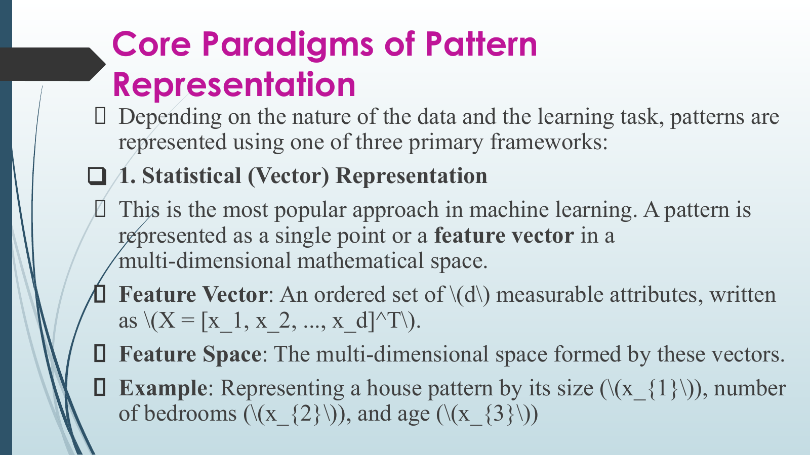

### Extracted Slide Text

- Core Paradigms of Pattern
- Representation
- Depending on the nature of the data and the learning task, patterns are
- represented using one of three primary frameworks:
- ❑ 1. Statistical (Vector) Representation
- This is the most popular approach in machine learning. A pattern is
- represented as a single point or a feature vector in a
- multi-dimensional mathematical space.
- Feature Vector: An ordered set of \(d\) measurable attributes, written
- as \(X = [x_1, x_2, ..., x_d]^T\).
- Feature Space: The multi-dimensional space formed by these vectors.
- Example: Representing a house pattern by its size (\(x_{1}\)), number
- of bedrooms (\(x_{2}\)), and age (\(x_{3}\))

### Page Description And Teaching Notes

Slide type: formula or calculation slide.
Main idea: Representation Depending on the nature of the data and the learning task, patterns are represented using one of three primary frameworks: ❑ 1. Statistical (Vector) Representation This is the most popular approach in machine learning. A pattern is represented as a single point or a feature vector in a.
This page should be read carefully because it introduces a calculation, objective, or optimization idea. Identify the variables in the formula, what quantity is being minimized or measured, and how the equation supports model training or evaluation.
Detailed page understanding:
- `Representation` is a core visible point. Explain what it means, why it matters, and how it connects to the slide title.
- `Depending on the nature of the data and the learning task, patterns are` is a core visible point. Explain what it means, why it matters, and how it connects to the slide title.
- `represented using one of three primary frameworks:` is a core visible point. Explain what it means, why it matters, and how it connects to the slide title.
- `❑ 1. Statistical (Vector) Representation` is one item in the slide's list. Treat it as a separate subtopic and prepare a one-line explanation for it.
- `This is the most popular approach in machine learning. A pattern is` is a core visible point. Explain what it means, why it matters, and how it connects to the slide title.
- `represented as a single point or a feature vector in a` is a core visible point. Explain what it means, why it matters, and how it connects to the slide title.
- `multi-dimensional mathematical space.` is a core visible point. Explain what it means, why it matters, and how it connects to the slide title.
- `Feature Vector: An ordered set of \(d\) measurable attributes, written` is a core visible point. Explain what it means, why it matters, and how it connects to the slide title.
- Additional bullets continue on the slide; use the extracted text list above for the complete wording.
- `of bedrooms (\(x_{2}\)), and age (\(x_{3}\))` is a core visible point. Explain what it means, why it matters, and how it connects to the slide title.
Important visible terms: Core Paradigms, Pattern Representation Depending, Statistical, Vector, Representation This, Feature Vector, Feature Space, The.
Visual/layout description: the embedded image preserves the actual slide. Describe the title area first, then read bullets, formulas, tables, arrows, grouped boxes, or diagrams in their visible order. If the slide contains a diagram, explain the relationship shown by arrows/positioning before explaining the text labels.
Teaching note: after reading the slide, ask the learner to restate the page in one or two sentences and give one example. For formula or metric slides, also ask what each variable or metric means and when it should be used.
Exam/viva note: prepare the slide title as a short-answer question, then use the bullets or visual labels as the expected answer points.

## Page 88: ❑ 2. Structural (Syntactic) Representation

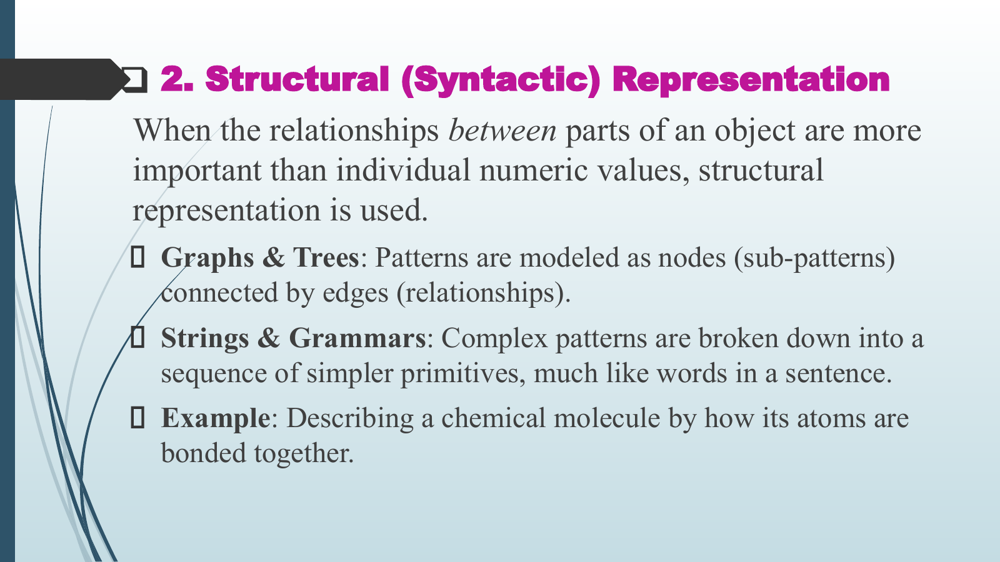

### Extracted Slide Text

- ❑ 2. Structural (Syntactic) Representation
- When the relationships between parts of an object are more
- important than individual numeric values, structural
- representation is used.
- Graphs & Trees: Patterns are modeled as nodes (sub-patterns)
- connected by edges (relationships).
- Strings & Grammars: Complex patterns are broken down into a
- sequence of simpler primitives, much like words in a sentence.
- Example: Describing a chemical molecule by how its atoms are
- bonded together.

### Page Description And Teaching Notes

Slide type: bullet explanation slide.
Main idea: When the relationships between parts of an object are more important than individual numeric values, structural representation is used. Graphs & Trees: Patterns are modeled as nodes (sub-patterns) connected by edges (relationships). Strings & Grammars: Complex patterns are broken down into a.
This page breaks the topic into separate points. Each bullet should be treated as a distinct exam or viva talking point, with the learner able to define it and give a small example.
Detailed page understanding:
- `When the relationships between parts of an object are more` is a core visible point. Explain what it means, why it matters, and how it connects to the slide title.
- `important than individual numeric values, structural` is a core visible point. Explain what it means, why it matters, and how it connects to the slide title.
- `representation is used.` is an application/example point. Convert it into a concrete real-world case while teaching.
- `Graphs & Trees: Patterns are modeled as nodes (sub-patterns)` is a core visible point. Explain what it means, why it matters, and how it connects to the slide title.
- `connected by edges (relationships).` is a core visible point. Explain what it means, why it matters, and how it connects to the slide title.
- `Strings & Grammars: Complex patterns are broken down into a` is a core visible point. Explain what it means, why it matters, and how it connects to the slide title.
- `sequence of simpler primitives, much like words in a sentence.` is a core visible point. Explain what it means, why it matters, and how it connects to the slide title.
- `Example: Describing a chemical molecule by how its atoms are` is an application/example point. Convert it into a concrete real-world case while teaching.
- `bonded together.` is a core visible point. Explain what it means, why it matters, and how it connects to the slide title.
Important visible terms: Structural, Syntactic, Representation When, Graphs, Trees, Patterns, Strings, Grammars.
Visual/layout description: the embedded image preserves the actual slide. Describe the title area first, then read bullets, formulas, tables, arrows, grouped boxes, or diagrams in their visible order. If the slide contains a diagram, explain the relationship shown by arrows/positioning before explaining the text labels.
Teaching note: after reading the slide, ask the learner to restate the page in one or two sentences and give one example. For formula or metric slides, also ask what each variable or metric means and when it should be used.
Exam/viva note: prepare the slide title as a short-answer question, then use the bullets or visual labels as the expected answer points.

## Page 89: ❑ 3. Neural-Based (Hierarchical)

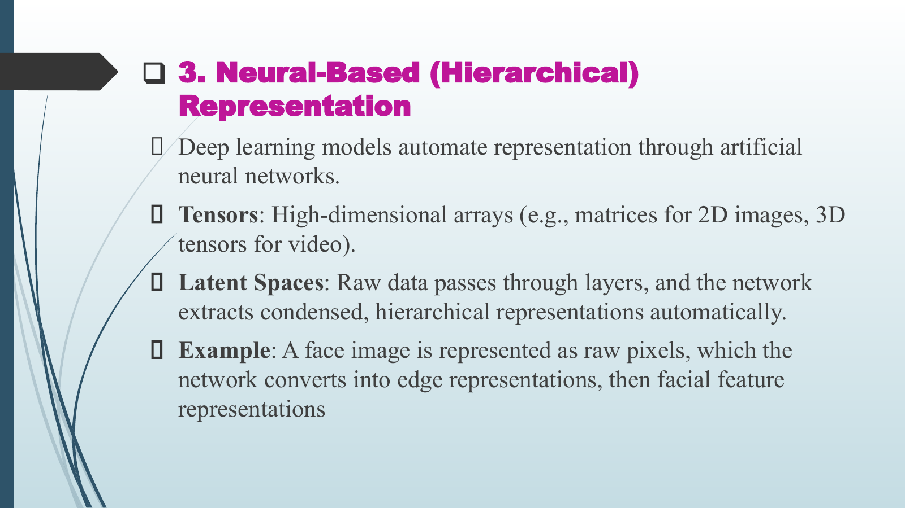

### Extracted Slide Text

- ❑ 3. Neural-Based (Hierarchical)
- Representation
- Deep learning models automate representation through artificial
- neural networks.
- Tensors: High-dimensional arrays (e.g., matrices for 2D images, 3D
- tensors for video).
- Latent Spaces: Raw data passes through layers, and the network
- extracts condensed, hierarchical representations automatically.
- Example: A face image is represented as raw pixels, which the
- network converts into edge representations, then facial feature
- representations

### Page Description And Teaching Notes

Slide type: bullet explanation slide.
Main idea: Representation Deep learning models automate representation through artificial neural networks. Tensors: High-dimensional arrays (e.g., matrices for 2D images, 3D tensors for video). Latent Spaces: Raw data passes through layers, and the network.
This page breaks the topic into separate points. Each bullet should be treated as a distinct exam or viva talking point, with the learner able to define it and give a small example.
Detailed page understanding:
- `Representation` is a core visible point. Explain what it means, why it matters, and how it connects to the slide title.
- `Deep learning models automate representation through artificial` is a core visible point. Explain what it means, why it matters, and how it connects to the slide title.
- `neural networks.` is a core visible point. Explain what it means, why it matters, and how it connects to the slide title.
- `Tensors: High-dimensional arrays (e.g., matrices for 2D images, 3D` is a core visible point. Explain what it means, why it matters, and how it connects to the slide title.
- `tensors for video).` is a core visible point. Explain what it means, why it matters, and how it connects to the slide title.
- `Latent Spaces: Raw data passes through layers, and the network` is a core visible point. Explain what it means, why it matters, and how it connects to the slide title.
- `extracts condensed, hierarchical representations automatically.` is a core visible point. Explain what it means, why it matters, and how it connects to the slide title.
- `Example: A face image is represented as raw pixels, which the` is an application/example point. Convert it into a concrete real-world case while teaching.
- `network converts into edge representations, then facial feature` is a core visible point. Explain what it means, why it matters, and how it connects to the slide title.
- `representations` is a core visible point. Explain what it means, why it matters, and how it connects to the slide title.
Important visible terms: Neural-Based, Hierarchical, Representation Deep, Tensors, High-dimensional, Latent Spaces, Raw, Example.
Visual/layout description: the embedded image preserves the actual slide. Describe the title area first, then read bullets, formulas, tables, arrows, grouped boxes, or diagrams in their visible order. If the slide contains a diagram, explain the relationship shown by arrows/positioning before explaining the text labels.
Teaching note: after reading the slide, ask the learner to restate the page in one or two sentences and give one example. For formula or metric slides, also ask what each variable or metric means and when it should be used.
Exam/viva note: prepare the slide title as a short-answer question, then use the bullets or visual labels as the expected answer points.

## Page 90: Unit I - Introduction to Machine Learning Page 90

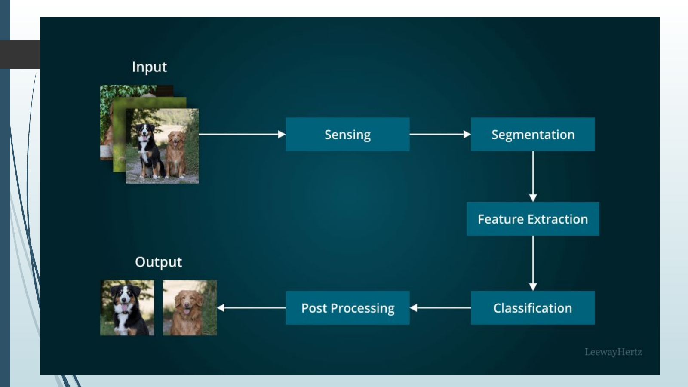

### Extracted Slide Text

- No selectable text extracted from this page.

### Page Description And Teaching Notes

Slide type: visual-only or image-heavy slide.
Main idea: the slide is visual-first, so the image should be treated as the source for the content and structure.
This page is primarily visual. The embedded slide image is the authoritative visual output; read it as a diagram or illustration first, then connect any visible labels to the surrounding pages.
- No reliable selectable text was extracted; use the slide image for the visible diagram, chart, or screenshot.
Visual/layout description: the embedded image preserves the actual slide. Describe the title area first, then read bullets, formulas, tables, arrows, grouped boxes, or diagrams in their visible order. If the slide contains a diagram, explain the relationship shown by arrows/positioning before explaining the text labels.
Teaching note: after reading the slide, ask the learner to restate the page in one or two sentences and give one example. For formula or metric slides, also ask what each variable or metric means and when it should be used.
Exam/viva note: prepare the slide title as a short-answer question, then use the bullets or visual labels as the expected answer points.

## Page 91: Pattern Recognition Models

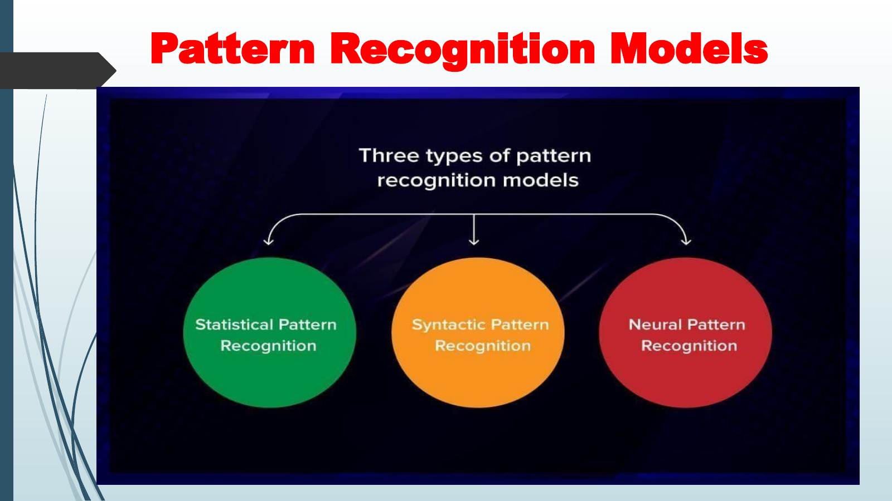

### Extracted Slide Text

- Pattern Recognition Models

### Page Description And Teaching Notes

Slide type: title or transition slide.
Main idea: the slide is visual-first, so the image should be treated as the source for the content and structure.
This page sets the context for the next topic. Treat it as a section marker: it tells the learner what concept or unit is starting before the deck moves into definitions, examples, or formulas.
- No reliable selectable text was extracted; use the slide image for the visible diagram, chart, or screenshot.
Important visible terms: Pattern Recognition Models.
Visual/layout description: the embedded image preserves the actual slide. Describe the title area first, then read bullets, formulas, tables, arrows, grouped boxes, or diagrams in their visible order. If the slide contains a diagram, explain the relationship shown by arrows/positioning before explaining the text labels.
Teaching note: after reading the slide, ask the learner to restate the page in one or two sentences and give one example. For formula or metric slides, also ask what each variable or metric means and when it should be used.
Exam/viva note: prepare the slide title as a short-answer question, then use the bullets or visual labels as the expected answer points.

## Page 92: Unit I - Introduction to Machine Learning Page 92

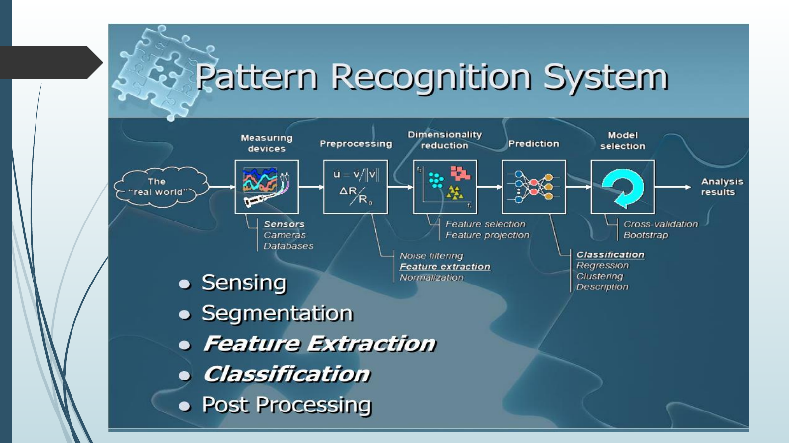

### Extracted Slide Text

- No selectable text extracted from this page.

### Page Description And Teaching Notes

Slide type: visual-only or image-heavy slide.
Main idea: the slide is visual-first, so the image should be treated as the source for the content and structure.
This page is primarily visual. The embedded slide image is the authoritative visual output; read it as a diagram or illustration first, then connect any visible labels to the surrounding pages.
- No reliable selectable text was extracted; use the slide image for the visible diagram, chart, or screenshot.
Visual/layout description: the embedded image preserves the actual slide. Describe the title area first, then read bullets, formulas, tables, arrows, grouped boxes, or diagrams in their visible order. If the slide contains a diagram, explain the relationship shown by arrows/positioning before explaining the text labels.
Teaching note: after reading the slide, ask the learner to restate the page in one or two sentences and give one example. For formula or metric slides, also ask what each variable or metric means and when it should be used.
Exam/viva note: prepare the slide title as a short-answer question, then use the bullets or visual labels as the expected answer points.

## Page 93: Steps involved in PR System

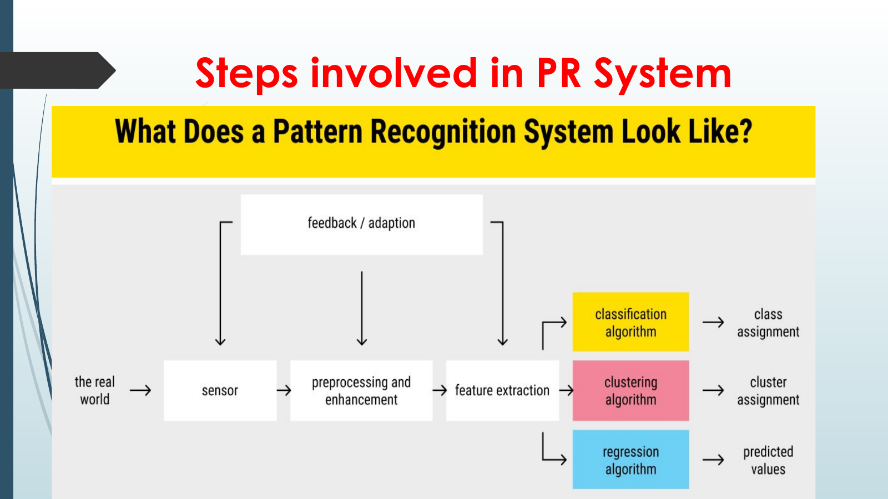

### Extracted Slide Text

- Steps involved in PR System

### Page Description And Teaching Notes

Slide type: title or transition slide.
Main idea: the slide is visual-first, so the image should be treated as the source for the content and structure.
This page sets the context for the next topic. Treat it as a section marker: it tells the learner what concept or unit is starting before the deck moves into definitions, examples, or formulas.
- No reliable selectable text was extracted; use the slide image for the visible diagram, chart, or screenshot.
Important visible terms: Steps, PR System.
Visual/layout description: the embedded image preserves the actual slide. Describe the title area first, then read bullets, formulas, tables, arrows, grouped boxes, or diagrams in their visible order. If the slide contains a diagram, explain the relationship shown by arrows/positioning before explaining the text labels.
Teaching note: after reading the slide, ask the learner to restate the page in one or two sentences and give one example. For formula or metric slides, also ask what each variable or metric means and when it should be used.
Exam/viva note: prepare the slide title as a short-answer question, then use the bullets or visual labels as the expected answer points.

## Page 94: Applications of PR

### Extracted Slide Text

- Applications of PR

### Page Description And Teaching Notes

Slide type: title or transition slide.
Main idea: the slide is visual-first, so the image should be treated as the source for the content and structure.
This page sets the context for the next topic. Treat it as a section marker: it tells the learner what concept or unit is starting before the deck moves into definitions, examples, or formulas.
- No reliable selectable text was extracted; use the slide image for the visible diagram, chart, or screenshot.
Important visible terms: Applications.
Visual/layout description: the embedded image preserves the actual slide. Describe the title area first, then read bullets, formulas, tables, arrows, grouped boxes, or diagrams in their visible order. If the slide contains a diagram, explain the relationship shown by arrows/positioning before explaining the text labels.
Teaching note: after reading the slide, ask the learner to restate the page in one or two sentences and give one example. For formula or metric slides, also ask what each variable or metric means and when it should be used.
Exam/viva note: prepare the slide title as a short-answer question, then use the bullets or visual labels as the expected answer points.

## Page 95: Pattern representation

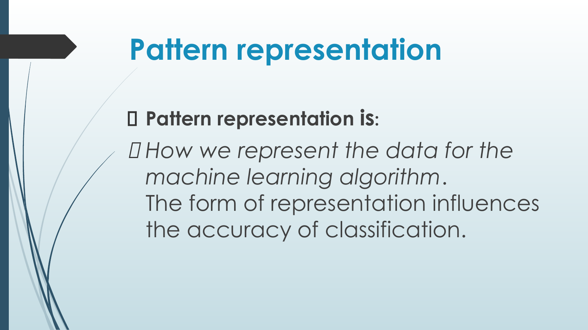

### Extracted Slide Text

- Pattern representation
- Pattern representation is:
- How we represent the data for the
- machine learning algorithm.
- The form of representation influences
- the accuracy of classification.

### Page Description And Teaching Notes

Slide type: metric/table slide.
Main idea: Pattern representation is: How we represent the data for the machine learning algorithm. The form of representation influences the accuracy of classification.
This page organizes evaluation or comparison information. Focus on what each metric measures, when it is useful, and what mistake it prevents when judging a machine-learning model.
Detailed page understanding:
- `Pattern representation is:` is a core visible point. Explain what it means, why it matters, and how it connects to the slide title.
- `How we represent the data for the` is a core visible point. Explain what it means, why it matters, and how it connects to the slide title.
- `machine learning algorithm.` is a core visible point. Explain what it means, why it matters, and how it connects to the slide title.
- `The form of representation influences` is a core visible point. Explain what it means, why it matters, and how it connects to the slide title.
- `the accuracy of classification.` is a core visible point. Explain what it means, why it matters, and how it connects to the slide title.
Important visible terms: Pattern, How, The.
Visual/layout description: the embedded image preserves the actual slide. Describe the title area first, then read bullets, formulas, tables, arrows, grouped boxes, or diagrams in their visible order. If the slide contains a diagram, explain the relationship shown by arrows/positioning before explaining the text labels.
Teaching note: after reading the slide, ask the learner to restate the page in one or two sentences and give one example. For formula or metric slides, also ask what each variable or metric means and when it should be used.
Exam/viva note: prepare the slide title as a short-answer question, then use the bullets or visual labels as the expected answer points.

## Page 96: Concept of Pattern Recognition

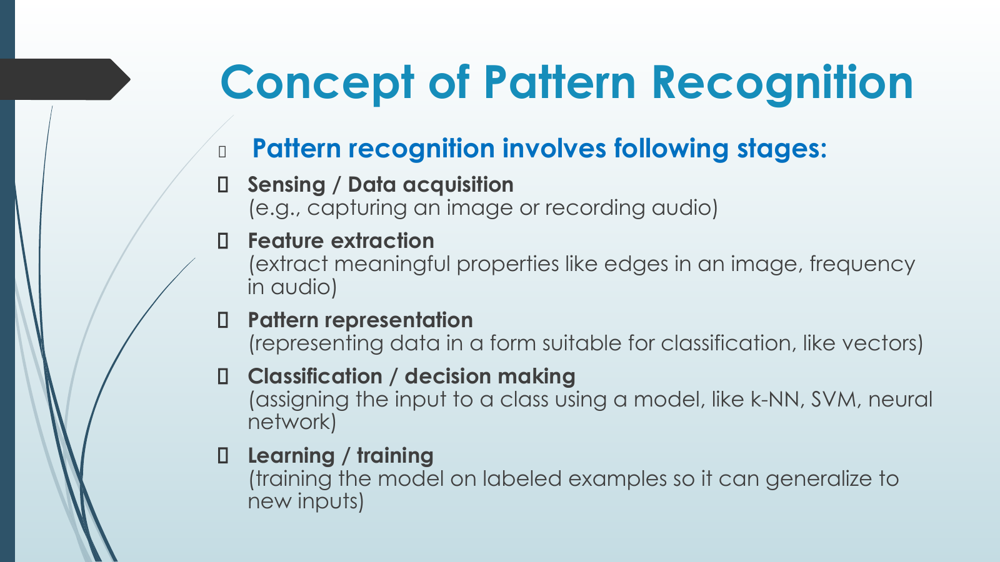

### Extracted Slide Text

- Concept of Pattern Recognition
- Pattern recognition involves following stages:
- Sensing / Data acquisition
- (e.g., capturing an image or recording audio)
- Feature extraction
- (extract meaningful properties like edges in an image, frequency
- in audio)
- Pattern representation
- (representing data in a form suitable for classification, like vectors)
- Classification / decision making
- (assigning the input to a class using a model, like k-NN, SVM, neural
- network)
- Learning / training
- (training the model on labeled examples so it can generalize to
- new inputs)

### Page Description And Teaching Notes

Slide type: metric/table slide.
Main idea: Pattern recognition involves following stages: Sensing / Data acquisition (e.g., capturing an image or recording audio) Feature extraction (extract meaningful properties like edges in an image, frequency in audio).
This page organizes evaluation or comparison information. Focus on what each metric measures, when it is useful, and what mistake it prevents when judging a machine-learning model.
Detailed page understanding:
- `Pattern recognition involves following stages:` is a core visible point. Explain what it means, why it matters, and how it connects to the slide title.
- `Sensing / Data acquisition` is a core visible point. Explain what it means, why it matters, and how it connects to the slide title.
- `(e.g., capturing an image or recording audio)` is a core visible point. Explain what it means, why it matters, and how it connects to the slide title.
- `Feature extraction` is a core visible point. Explain what it means, why it matters, and how it connects to the slide title.
- `(extract meaningful properties like edges in an image, frequency` is a core visible point. Explain what it means, why it matters, and how it connects to the slide title.
- `in audio)` is a core visible point. Explain what it means, why it matters, and how it connects to the slide title.
- `Pattern representation` is a core visible point. Explain what it means, why it matters, and how it connects to the slide title.
- `(representing data in a form suitable for classification, like vectors)` is a core visible point. Explain what it means, why it matters, and how it connects to the slide title.
- Additional bullets continue on the slide; use the extracted text list above for the complete wording.
- `new inputs)` is a core visible point. Explain what it means, why it matters, and how it connects to the slide title.
Important visible terms: Concept, Pattern Recognition Pattern, Sensing, Data, Feature, Pattern, Classification, SVM.
Visual/layout description: the embedded image preserves the actual slide. Describe the title area first, then read bullets, formulas, tables, arrows, grouped boxes, or diagrams in their visible order. If the slide contains a diagram, explain the relationship shown by arrows/positioning before explaining the text labels.
Teaching note: after reading the slide, ask the learner to restate the page in one or two sentences and give one example. For formula or metric slides, also ask what each variable or metric means and when it should be used.
Exam/viva note: prepare the slide title as a short-answer question, then use the bullets or visual labels as the expected answer points.

## Page 97: Example:

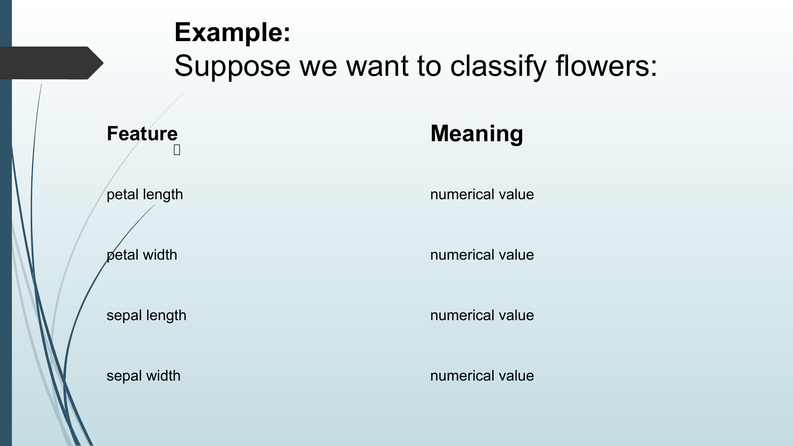

### Extracted Slide Text

- Example:
- Suppose we want to classify flowers:
- Feature Meaning
- petal length numerical value
- petal width numerical value
- sepal length numerical value
- sepal width numerical value

### Page Description And Teaching Notes

Slide type: process or diagram slide.
Main idea: Suppose we want to classify flowers: Feature Meaning petal length numerical value petal width numerical value sepal length numerical value sepal width numerical value.
This page describes a flow, algorithm, or sequence. Read the visual from start to finish and explain how each stage transforms data, parameters, or decisions into the next stage.
Detailed page understanding:
- `Suppose we want to classify flowers:` is a core visible point. Explain what it means, why it matters, and how it connects to the slide title.
- `Feature Meaning` is a core visible point. Explain what it means, why it matters, and how it connects to the slide title.
- `petal length numerical value` is a core visible point. Explain what it means, why it matters, and how it connects to the slide title.
- `petal width numerical value` is a core visible point. Explain what it means, why it matters, and how it connects to the slide title.
- `sepal length numerical value` is a core visible point. Explain what it means, why it matters, and how it connects to the slide title.
- `sepal width numerical value` is a core visible point. Explain what it means, why it matters, and how it connects to the slide title.
Important visible terms: Example, Suppose, Feature Meaning.
Visual/layout description: the embedded image preserves the actual slide. Describe the title area first, then read bullets, formulas, tables, arrows, grouped boxes, or diagrams in their visible order. If the slide contains a diagram, explain the relationship shown by arrows/positioning before explaining the text labels.
Teaching note: after reading the slide, ask the learner to restate the page in one or two sentences and give one example. For formula or metric slides, also ask what each variable or metric means and when it should be used.
Exam/viva note: prepare the slide title as a short-answer question, then use the bullets or visual labels as the expected answer points.

## Page 98: A flower can be represented as a vector of features:

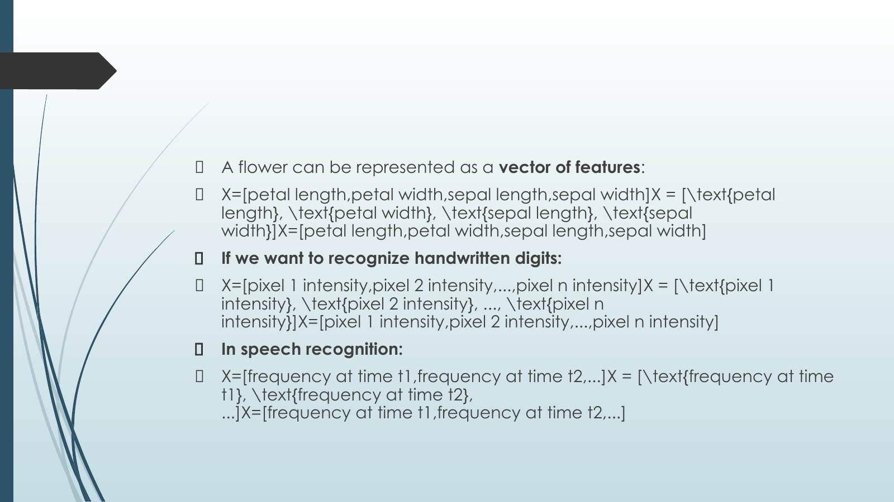

### Extracted Slide Text

- A flower can be represented as a vector of features:
- X=[petal length,petal width,sepal length,sepal width]X = [\text{petal
- length}, \text{petal width}, \text{sepal length}, \text{sepal
- width}]X=[petal length,petal width,sepal length,sepal width]
- If we want to recognize handwritten digits:
- X=[pixel 1 intensity,pixel 2 intensity,...,pixel n intensity]X = [\text{pixel 1
- intensity}, \text{pixel 2 intensity}, ..., \text{pixel n
- intensity}]X=[pixel 1 intensity,pixel 2 intensity,...,pixel n intensity]
- In speech recognition:
- X=[frequency at time t1,frequency at time t2,...]X = [\text{frequency at time
- t1}, \text{frequency at time t2},
- ...]X=[frequency at time t1,frequency at time t2,...]

### Page Description And Teaching Notes

Slide type: formula or calculation slide.
Main idea: X=[petal length,petal width,sepal length,sepal width]X = [\text{petal length}, \text{petal width}, \text{sepal length}, \text{sepal width}]X=[petal length,petal width,sepal length,sepal width] If we want to recognize handwritten digits: X=[pixel 1 intensity,pixel 2 intensity,...,pixel n intensity]X = [\text{pixel 1 intensity}, \text{pixel 2 intensity}, ..., \text{pixel n.
This page should be read carefully because it introduces a calculation, objective, or optimization idea. Identify the variables in the formula, what quantity is being minimized or measured, and how the equation supports model training or evaluation.
Detailed page understanding:
- `X=[petal length,petal width,sepal length,sepal width]X = [\text{petal` is a core visible point. Explain what it means, why it matters, and how it connects to the slide title.
- `length}, \text{petal width}, \text{sepal length}, \text{sepal` is a core visible point. Explain what it means, why it matters, and how it connects to the slide title.
- `width}]X=[petal length,petal width,sepal length,sepal width]` is a core visible point. Explain what it means, why it matters, and how it connects to the slide title.
- `If we want to recognize handwritten digits:` is a core visible point. Explain what it means, why it matters, and how it connects to the slide title.
- `X=[pixel 1 intensity,pixel 2 intensity,...,pixel n intensity]X = [\text{pixel 1` is a core visible point. Explain what it means, why it matters, and how it connects to the slide title.
- `intensity}, \text{pixel 2 intensity}, ..., \text{pixel n` is a core visible point. Explain what it means, why it matters, and how it connects to the slide title.
- `intensity}]X=[pixel 1 intensity,pixel 2 intensity,...,pixel n intensity]` is a core visible point. Explain what it means, why it matters, and how it connects to the slide title.
- `In speech recognition:` is a core visible point. Explain what it means, why it matters, and how it connects to the slide title.
- Additional bullets continue on the slide; use the extracted text list above for the complete wording.
- `...]X=[frequency at time t1,frequency at time t2,...]` is a core visible point. Explain what it means, why it matters, and how it connects to the slide title.
Visual/layout description: the embedded image preserves the actual slide. Describe the title area first, then read bullets, formulas, tables, arrows, grouped boxes, or diagrams in their visible order. If the slide contains a diagram, explain the relationship shown by arrows/positioning before explaining the text labels.
Teaching note: after reading the slide, ask the learner to restate the page in one or two sentences and give one example. For formula or metric slides, also ask what each variable or metric means and when it should be used.
Exam/viva note: prepare the slide title as a short-answer question, then use the bullets or visual labels as the expected answer points.

## Page 99: Pattern representation forms:

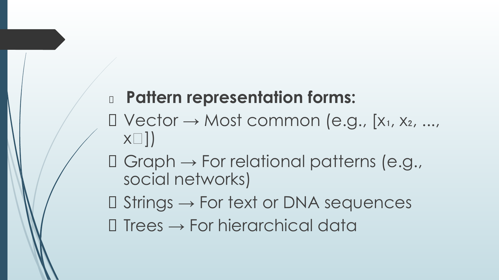

### Extracted Slide Text

- Pattern representation forms:
- Vector → Most common (e.g., [x₁, x₂, ...,
- xₙ])
- Graph → For relational patterns (e.g.,
- social networks)
- Strings → For text or DNA sequences
- Trees → For hierarchical data

### Page Description And Teaching Notes

Slide type: concept explanation slide.
Main idea: Vector → Most common (e.g., [x₁, x₂, ..., xₙ]) Graph → For relational patterns (e.g., social networks) Strings → For text or DNA sequences Trees → For hierarchical data.
This page explains a core concept in prose. The main task is to convert the definition into a clear statement of what the concept is, why it is used, and where it appears in a machine-learning workflow.
Detailed page understanding:
- `Vector → Most common (e.g., [x₁, x₂, ...,` is a core visible point. Explain what it means, why it matters, and how it connects to the slide title.
- `xₙ])` is a core visible point. Explain what it means, why it matters, and how it connects to the slide title.
- `Graph → For relational patterns (e.g.,` is a core visible point. Explain what it means, why it matters, and how it connects to the slide title.
- `social networks)` is a core visible point. Explain what it means, why it matters, and how it connects to the slide title.
- `Strings → For text or DNA sequences` is a core visible point. Explain what it means, why it matters, and how it connects to the slide title.
- `Trees → For hierarchical data` is a core visible point. Explain what it means, why it matters, and how it connects to the slide title.
Important visible terms: Pattern, Vector, Most, Graph, For, Strings, DNA, Trees.
Visual/layout description: the embedded image preserves the actual slide. Describe the title area first, then read bullets, formulas, tables, arrows, grouped boxes, or diagrams in their visible order. If the slide contains a diagram, explain the relationship shown by arrows/positioning before explaining the text labels.
Teaching note: after reading the slide, ask the learner to restate the page in one or two sentences and give one example. For formula or metric slides, also ask what each variable or metric means and when it should be used.
Exam/viva note: prepare the slide title as a short-answer question, then use the bullets or visual labels as the expected answer points.

## Page 100: Basics of Probability

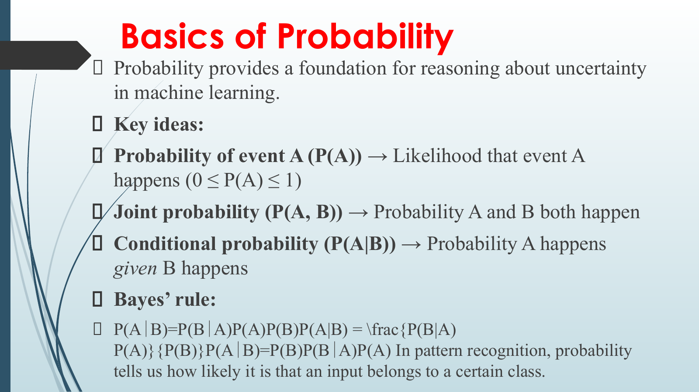

### Extracted Slide Text

- Basics of Probability
- Probability provides a foundation for reasoning about uncertainty
- in machine learning.
- Key ideas:
- Probability of event A (P(A)) → Likelihood that event A
- happens (0 ≤ P(A) ≤ 1)
- Joint probability (P(A, B)) → Probability A and B both happen
- Conditional probability (P(A|B)) → Probability A happens
- given B happens
- Bayes’ rule:
- P(A∣B)=P(B∣A)P(A)P(B)P(A|B) = \frac{P(B|A)
- P(A)}{P(B)}P(A∣B)=P(B)P(B∣A)P(A) In pattern recognition, probability
- tells us how likely it is that an input belongs to a certain class.

### Page Description And Teaching Notes

Slide type: formula or calculation slide.
Main idea: Probability provides a foundation for reasoning about uncertainty in machine learning. Key ideas: Probability of event A (P(A)) → Likelihood that event A happens (0 ≤ P(A) ≤ 1) Joint probability (P(A, B)) → Probability A and B both happen.
This page should be read carefully because it introduces a calculation, objective, or optimization idea. Identify the variables in the formula, what quantity is being minimized or measured, and how the equation supports model training or evaluation.
Detailed page understanding:
- `Probability provides a foundation for reasoning about uncertainty` is a core visible point. Explain what it means, why it matters, and how it connects to the slide title.
- `in machine learning.` is a core visible point. Explain what it means, why it matters, and how it connects to the slide title.
- `Key ideas:` is a core visible point. Explain what it means, why it matters, and how it connects to the slide title.
- `Probability of event A (P(A)) → Likelihood that event A` is a core visible point. Explain what it means, why it matters, and how it connects to the slide title.
- `happens (0 ≤ P(A) ≤ 1)` is a core visible point. Explain what it means, why it matters, and how it connects to the slide title.
- `Joint probability (P(A, B)) → Probability A and B both happen` is a core visible point. Explain what it means, why it matters, and how it connects to the slide title.
- `Conditional probability (P(A|B)) → Probability A happens` is a core visible point. Explain what it means, why it matters, and how it connects to the slide title.
- `given B happens` is a core visible point. Explain what it means, why it matters, and how it connects to the slide title.
- Additional bullets continue on the slide; use the extracted text list above for the complete wording.
- `tells us how likely it is that an input belongs to a certain class.` is a core visible point. Explain what it means, why it matters, and how it connects to the slide title.
Important visible terms: Basics, Probability Probability, Key, Probability, Likelihood, Joint, Probability A, Conditional.
Visual/layout description: the embedded image preserves the actual slide. Describe the title area first, then read bullets, formulas, tables, arrows, grouped boxes, or diagrams in their visible order. If the slide contains a diagram, explain the relationship shown by arrows/positioning before explaining the text labels.
Teaching note: after reading the slide, ask the learner to restate the page in one or two sentences and give one example. For formula or metric slides, also ask what each variable or metric means and when it should be used.
Exam/viva note: prepare the slide title as a short-answer question, then use the bullets or visual labels as the expected answer points.

## Page 101: Conditional Probability:

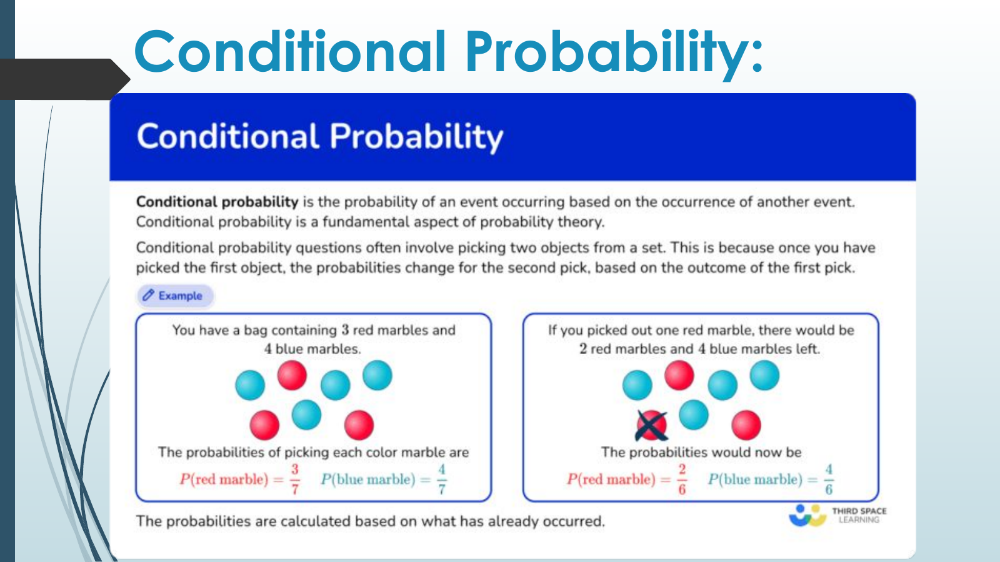

### Extracted Slide Text

- Conditional Probability:

### Page Description And Teaching Notes

Slide type: title or transition slide.
Main idea: the slide is visual-first, so the image should be treated as the source for the content and structure.
This page sets the context for the next topic. Treat it as a section marker: it tells the learner what concept or unit is starting before the deck moves into definitions, examples, or formulas.
- No reliable selectable text was extracted; use the slide image for the visible diagram, chart, or screenshot.
Important visible terms: Conditional Probability.
Visual/layout description: the embedded image preserves the actual slide. Describe the title area first, then read bullets, formulas, tables, arrows, grouped boxes, or diagrams in their visible order. If the slide contains a diagram, explain the relationship shown by arrows/positioning before explaining the text labels.
Teaching note: after reading the slide, ask the learner to restate the page in one or two sentences and give one example. For formula or metric slides, also ask what each variable or metric means and when it should be used.
Exam/viva note: prepare the slide title as a short-answer question, then use the bullets or visual labels as the expected answer points.

## Page 102: Unit I - Introduction to Machine Learning Page 102

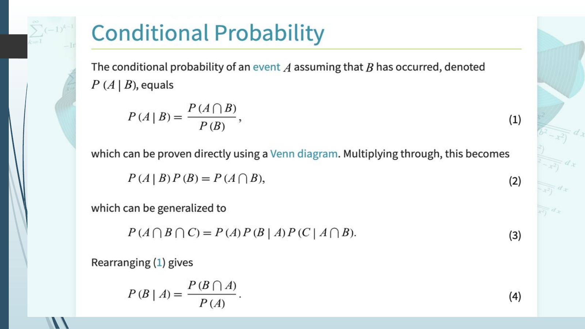

### Extracted Slide Text

- No selectable text extracted from this page.

### Page Description And Teaching Notes

Slide type: visual-only or image-heavy slide.
Main idea: the slide is visual-first, so the image should be treated as the source for the content and structure.
This page is primarily visual. The embedded slide image is the authoritative visual output; read it as a diagram or illustration first, then connect any visible labels to the surrounding pages.
- No reliable selectable text was extracted; use the slide image for the visible diagram, chart, or screenshot.
Visual/layout description: the embedded image preserves the actual slide. Describe the title area first, then read bullets, formulas, tables, arrows, grouped boxes, or diagrams in their visible order. If the slide contains a diagram, explain the relationship shown by arrows/positioning before explaining the text labels.
Teaching note: after reading the slide, ask the learner to restate the page in one or two sentences and give one example. For formula or metric slides, also ask what each variable or metric means and when it should be used.
Exam/viva note: prepare the slide title as a short-answer question, then use the bullets or visual labels as the expected answer points.

## Page 103: Example:

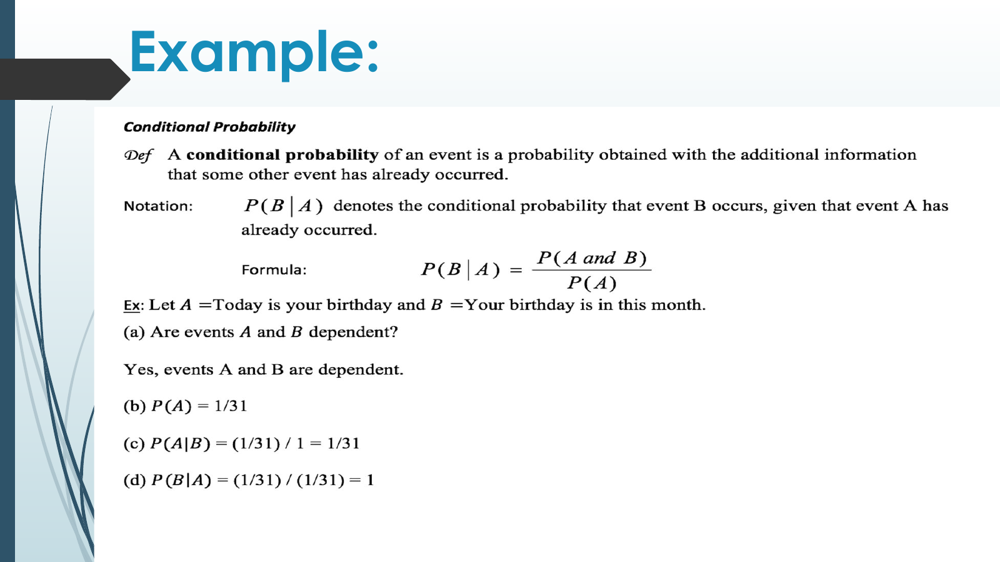

### Extracted Slide Text

- Example:

### Page Description And Teaching Notes

Slide type: title or transition slide.
Main idea: the slide is visual-first, so the image should be treated as the source for the content and structure.
This page sets the context for the next topic. Treat it as a section marker: it tells the learner what concept or unit is starting before the deck moves into definitions, examples, or formulas.
- No reliable selectable text was extracted; use the slide image for the visible diagram, chart, or screenshot.
Important visible terms: Example.
Visual/layout description: the embedded image preserves the actual slide. Describe the title area first, then read bullets, formulas, tables, arrows, grouped boxes, or diagrams in their visible order. If the slide contains a diagram, explain the relationship shown by arrows/positioning before explaining the text labels.
Teaching note: after reading the slide, ask the learner to restate the page in one or two sentences and give one example. For formula or metric slides, also ask what each variable or metric means and when it should be used.
Exam/viva note: prepare the slide title as a short-answer question, then use the bullets or visual labels as the expected answer points.

## Page 104: Bayes’ Theorem

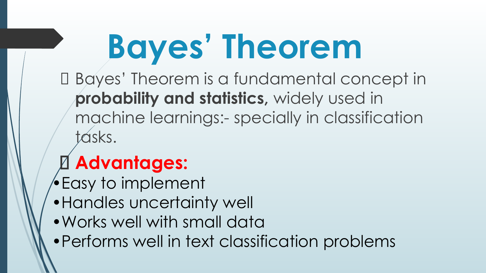

### Extracted Slide Text

- Bayes’ Theorem
- Bayes’ Theorem is a fundamental concept in
- probability and statistics, widely used in
- machine learnings:- specially in classification
- tasks.
- Advantages:
- •Easy to implement
- •Handles uncertainty well
- •Works well with small data
- •Performs well in text classification problems

### Page Description And Teaching Notes

Slide type: bullet explanation slide.
Main idea: Bayes’ Theorem is a fundamental concept in probability and statistics, widely used in machine learnings:- specially in classification tasks. Advantages: •Easy to implement.
This page breaks the topic into separate points. Each bullet should be treated as a distinct exam or viva talking point, with the learner able to define it and give a small example.
Detailed page understanding:
- `Bayes’ Theorem is a fundamental concept in` gives the definition-level meaning. Explain it first in simple words, then connect it to how a model learns from data.
- `probability and statistics, widely used in` is an application/example point. Convert it into a concrete real-world case while teaching.
- `machine learnings:- specially in classification` is a core visible point. Explain what it means, why it matters, and how it connects to the slide title.
- `tasks.` is a core visible point. Explain what it means, why it matters, and how it connects to the slide title.
- `Advantages:` states a benefit. Use it to justify why this method or concept is useful in a machine-learning workflow.
- `•Easy to implement` is one item in the slide's list. Treat it as a separate subtopic and prepare a one-line explanation for it.
- `•Handles uncertainty well` is one item in the slide's list. Treat it as a separate subtopic and prepare a one-line explanation for it.
- `•Works well with small data` is one item in the slide's list. Treat it as a separate subtopic and prepare a one-line explanation for it.
- `•Performs well in text classification problems` is a limitation or risk. Mention when the method may fail and what alternative or precaution can reduce the issue.
Important visible terms: Bayes, Theorem Bayes, Theorem, Advantages, Easy, Handles, Works, Performs.
Visual/layout description: the embedded image preserves the actual slide. Describe the title area first, then read bullets, formulas, tables, arrows, grouped boxes, or diagrams in their visible order. If the slide contains a diagram, explain the relationship shown by arrows/positioning before explaining the text labels.
Teaching note: after reading the slide, ask the learner to restate the page in one or two sentences and give one example. For formula or metric slides, also ask what each variable or metric means and when it should be used.
Exam/viva note: prepare the slide title as a short-answer question, then use the bullets or visual labels as the expected answer points.

## Page 105: Bayes’ Theorem

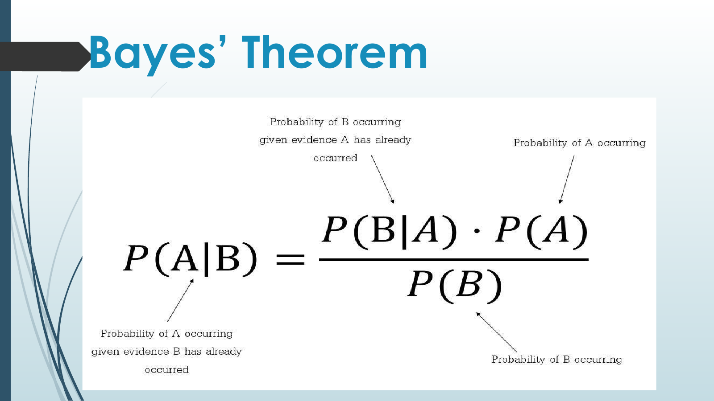

### Extracted Slide Text

- Bayes’ Theorem

### Page Description And Teaching Notes

Slide type: title or transition slide.
Main idea: the slide is visual-first, so the image should be treated as the source for the content and structure.
This page sets the context for the next topic. Treat it as a section marker: it tells the learner what concept or unit is starting before the deck moves into definitions, examples, or formulas.
- No reliable selectable text was extracted; use the slide image for the visible diagram, chart, or screenshot.
Important visible terms: Bayes, Theorem.
Progressive reveal note: this page appears to continue the same slide state as the previous page, so compare the embedded images for the exact visual change.
Visual/layout description: the embedded image preserves the actual slide. Describe the title area first, then read bullets, formulas, tables, arrows, grouped boxes, or diagrams in their visible order. If the slide contains a diagram, explain the relationship shown by arrows/positioning before explaining the text labels.
Teaching note: after reading the slide, ask the learner to restate the page in one or two sentences and give one example. For formula or metric slides, also ask what each variable or metric means and when it should be used.
Exam/viva note: prepare the slide title as a short-answer question, then use the bullets or visual labels as the expected answer points.

## Page 106: Components of Bayes’ Theorem:

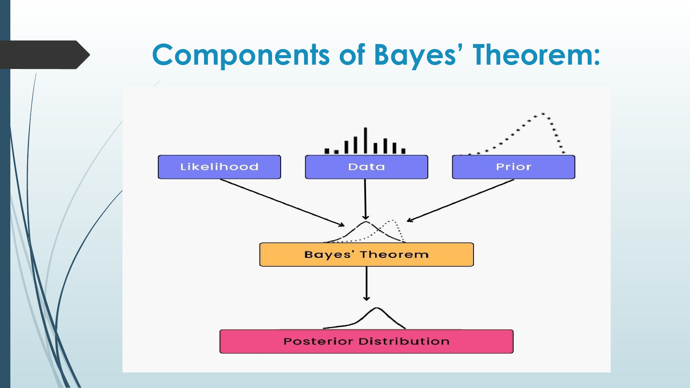

### Extracted Slide Text

- Components of Bayes’ Theorem:

### Page Description And Teaching Notes

Slide type: title or transition slide.
Main idea: the slide is visual-first, so the image should be treated as the source for the content and structure.
This page sets the context for the next topic. Treat it as a section marker: it tells the learner what concept or unit is starting before the deck moves into definitions, examples, or formulas.
- No reliable selectable text was extracted; use the slide image for the visible diagram, chart, or screenshot.
Important visible terms: Components, Bayes, Theorem.
Visual/layout description: the embedded image preserves the actual slide. Describe the title area first, then read bullets, formulas, tables, arrows, grouped boxes, or diagrams in their visible order. If the slide contains a diagram, explain the relationship shown by arrows/positioning before explaining the text labels.
Teaching note: after reading the slide, ask the learner to restate the page in one or two sentences and give one example. For formula or metric slides, also ask what each variable or metric means and when it should be used.
Exam/viva note: prepare the slide title as a short-answer question, then use the bullets or visual labels as the expected answer points.

## Page 107: Unit I - Introduction to Machine Learning Page 107

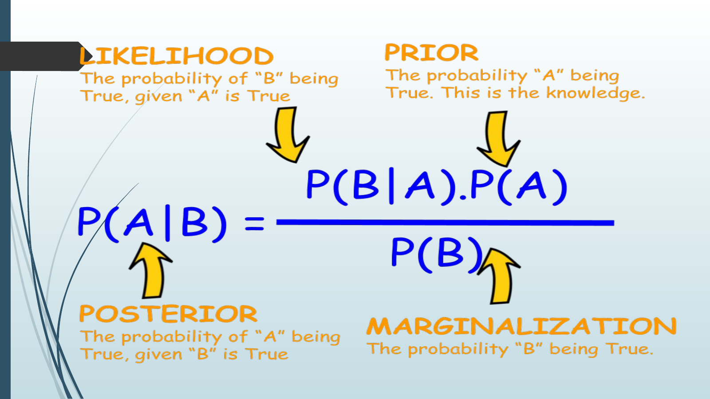

### Extracted Slide Text

- No selectable text extracted from this page.

### Page Description And Teaching Notes

Slide type: visual-only or image-heavy slide.
Main idea: the slide is visual-first, so the image should be treated as the source for the content and structure.
This page is primarily visual. The embedded slide image is the authoritative visual output; read it as a diagram or illustration first, then connect any visible labels to the surrounding pages.
- No reliable selectable text was extracted; use the slide image for the visible diagram, chart, or screenshot.
Visual/layout description: the embedded image preserves the actual slide. Describe the title area first, then read bullets, formulas, tables, arrows, grouped boxes, or diagrams in their visible order. If the slide contains a diagram, explain the relationship shown by arrows/positioning before explaining the text labels.
Teaching note: after reading the slide, ask the learner to restate the page in one or two sentences and give one example. For formula or metric slides, also ask what each variable or metric means and when it should be used.
Exam/viva note: prepare the slide title as a short-answer question, then use the bullets or visual labels as the expected answer points.

## Page 108: Applications of Bayes Theorem:

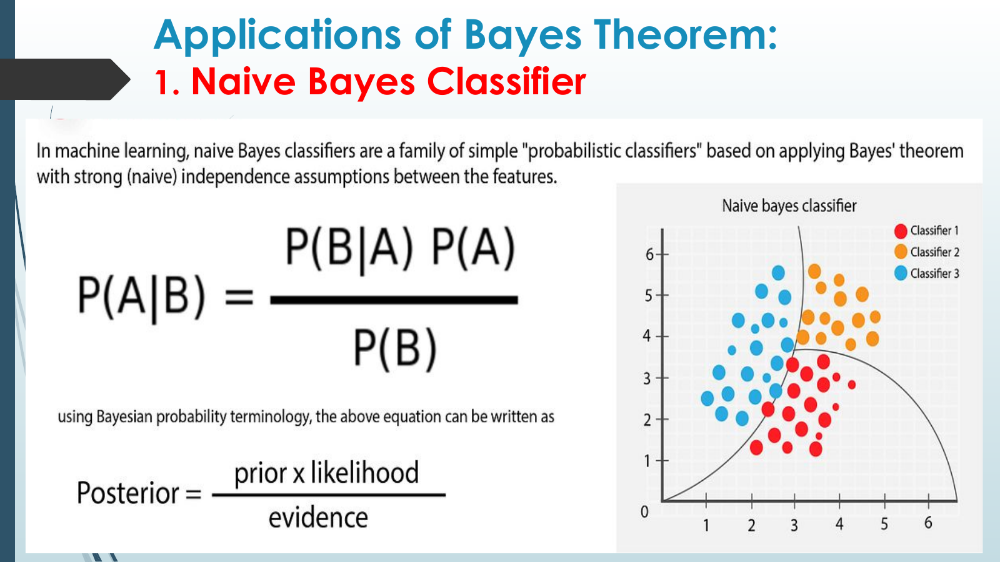

### Extracted Slide Text

- Applications of Bayes Theorem:
- 1. Naive Bayes Classifier
- Bayes optimal classifier
- Bayesian Optimization

### Page Description And Teaching Notes

Slide type: bullet explanation slide.
Main idea: 1. Naive Bayes Classifier Bayes optimal classifier Bayesian Optimization.
This page breaks the topic into separate points. Each bullet should be treated as a distinct exam or viva talking point, with the learner able to define it and give a small example.
Detailed page understanding:
- `1. Naive Bayes Classifier` is one item in the slide's list. Treat it as a separate subtopic and prepare a one-line explanation for it.
- `Bayes optimal classifier` is a core visible point. Explain what it means, why it matters, and how it connects to the slide title.
- `Bayesian Optimization` is a core visible point. Explain what it means, why it matters, and how it connects to the slide title.
Important visible terms: Applications, Bayes Theorem, Naive Bayes Classifier Bayes, Bayesian Optimization.
Visual/layout description: the embedded image preserves the actual slide. Describe the title area first, then read bullets, formulas, tables, arrows, grouped boxes, or diagrams in their visible order. If the slide contains a diagram, explain the relationship shown by arrows/positioning before explaining the text labels.
Teaching note: after reading the slide, ask the learner to restate the page in one or two sentences and give one example. For formula or metric slides, also ask what each variable or metric means and when it should be used.
Exam/viva note: prepare the slide title as a short-answer question, then use the bullets or visual labels as the expected answer points.

## Page 109: Bayes' Theorem is used in Naive Bayes classifiers to calculate

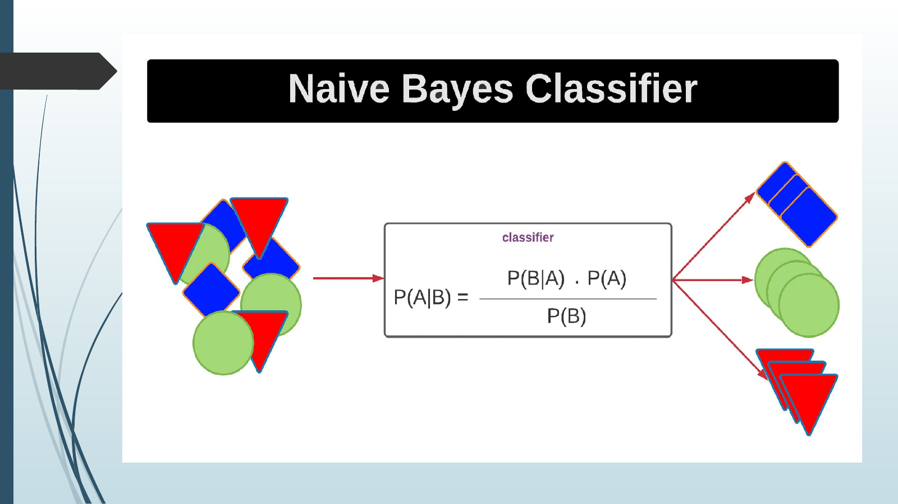

### Extracted Slide Text

- Bayes' Theorem is used in Naive Bayes classifiers to calculate
- the probability of a class label given a set of features,
- assuming that the features are conditionally independent.

### Page Description And Teaching Notes

Slide type: title or transition slide.
Main idea: the probability of a class label given a set of features, assuming that the features are conditionally independent.
This page sets the context for the next topic. Treat it as a section marker: it tells the learner what concept or unit is starting before the deck moves into definitions, examples, or formulas.
Detailed page understanding:
- `the probability of a class label given a set of features,` is a core visible point. Explain what it means, why it matters, and how it connects to the slide title.
- `assuming that the features are conditionally independent.` is a core visible point. Explain what it means, why it matters, and how it connects to the slide title.
Important visible terms: Bayes, Theorem, Naive Bayes.
Visual/layout description: the embedded image preserves the actual slide. Describe the title area first, then read bullets, formulas, tables, arrows, grouped boxes, or diagrams in their visible order. If the slide contains a diagram, explain the relationship shown by arrows/positioning before explaining the text labels.
Teaching note: after reading the slide, ask the learner to restate the page in one or two sentences and give one example. For formula or metric slides, also ask what each variable or metric means and when it should be used.
Exam/viva note: prepare the slide title as a short-answer question, then use the bullets or visual labels as the expected answer points.

## Page 110: Role of Bayes' Theorem in Naive Bayes

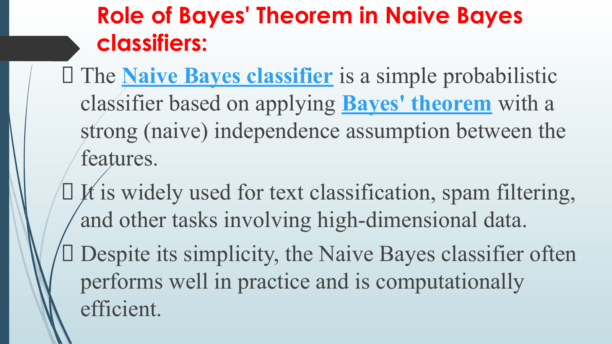

### Extracted Slide Text

- Role of Bayes' Theorem in Naive Bayes
- classifiers:
- The Naive Bayes classifier is a simple probabilistic
- classifier based on applying Bayes' theorem with a
- strong (naive) independence assumption between the
- features.
- It is widely used for text classification, spam filtering,
- and other tasks involving high-dimensional data.
- Despite its simplicity, the Naive Bayes classifier often
- performs well in practice and is computationally
- efficient.

### Page Description And Teaching Notes

Slide type: concept explanation slide.
Main idea: classifiers: The Naive Bayes classifier is a simple probabilistic classifier based on applying Bayes' theorem with a strong (naive) independence assumption between the features. It is widely used for text classification, spam filtering,.
This page explains a core concept in prose. The main task is to convert the definition into a clear statement of what the concept is, why it is used, and where it appears in a machine-learning workflow.
Detailed page understanding:
- `classifiers:` is a core visible point. Explain what it means, why it matters, and how it connects to the slide title.
- `The Naive Bayes classifier is a simple probabilistic` gives the definition-level meaning. Explain it first in simple words, then connect it to how a model learns from data.
- `classifier based on applying Bayes' theorem with a` is a core visible point. Explain what it means, why it matters, and how it connects to the slide title.
- `strong (naive) independence assumption between the` is a core visible point. Explain what it means, why it matters, and how it connects to the slide title.
- `features.` is a core visible point. Explain what it means, why it matters, and how it connects to the slide title.
- `It is widely used for text classification, spam filtering,` is an application/example point. Convert it into a concrete real-world case while teaching.
- `and other tasks involving high-dimensional data.` is a core visible point. Explain what it means, why it matters, and how it connects to the slide title.
- `Despite its simplicity, the Naive Bayes classifier often` is a core visible point. Explain what it means, why it matters, and how it connects to the slide title.
- `performs well in practice and is computationally` is a core visible point. Explain what it means, why it matters, and how it connects to the slide title.
- `efficient.` is a core visible point. Explain what it means, why it matters, and how it connects to the slide title.
Important visible terms: Role, Bayes, Theorem, Naive Bayes, The Naive Bayes, Despite.
Visual/layout description: the embedded image preserves the actual slide. Describe the title area first, then read bullets, formulas, tables, arrows, grouped boxes, or diagrams in their visible order. If the slide contains a diagram, explain the relationship shown by arrows/positioning before explaining the text labels.
Teaching note: after reading the slide, ask the learner to restate the page in one or two sentences and give one example. For formula or metric slides, also ask what each variable or metric means and when it should be used.
Exam/viva note: prepare the slide title as a short-answer question, then use the bullets or visual labels as the expected answer points.

## Page 111: Maximum likelihood Estimator:

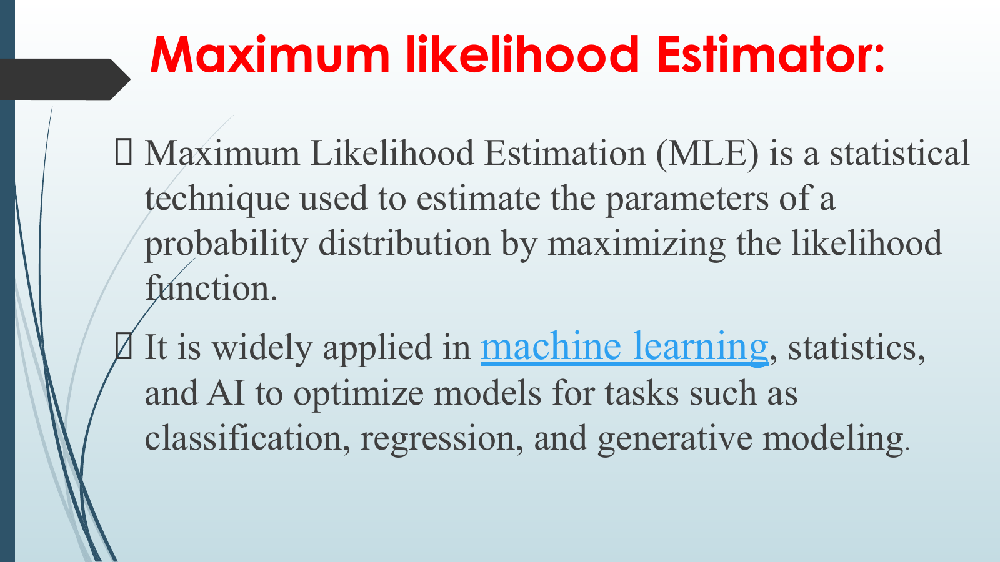

### Extracted Slide Text

- Maximum likelihood Estimator:
- Maximum Likelihood Estimation (MLE) is a statistical
- technique used to estimate the parameters of a
- probability distribution by maximizing the likelihood
- function.
- It is widely applied in machine learning, statistics,
- and AI to optimize models for tasks such as
- classification, regression, and generative modeling.

### Page Description And Teaching Notes

Slide type: concept explanation slide.
Main idea: Maximum Likelihood Estimation (MLE) is a statistical technique used to estimate the parameters of a probability distribution by maximizing the likelihood function. It is widely applied in machine learning, statistics, and AI to optimize models for tasks such as.
This page explains a core concept in prose. The main task is to convert the definition into a clear statement of what the concept is, why it is used, and where it appears in a machine-learning workflow.
Detailed page understanding:
- `Maximum Likelihood Estimation (MLE) is a statistical` gives the definition-level meaning. Explain it first in simple words, then connect it to how a model learns from data.
- `technique used to estimate the parameters of a` is an application/example point. Convert it into a concrete real-world case while teaching.
- `probability distribution by maximizing the likelihood` is a core visible point. Explain what it means, why it matters, and how it connects to the slide title.
- `function.` is a core visible point. Explain what it means, why it matters, and how it connects to the slide title.
- `It is widely applied in machine learning, statistics,` is a core visible point. Explain what it means, why it matters, and how it connects to the slide title.
- `and AI to optimize models for tasks such as` is a core visible point. Explain what it means, why it matters, and how it connects to the slide title.
- `classification, regression, and generative modeling.` is a core visible point. Explain what it means, why it matters, and how it connects to the slide title.
Important visible terms: Maximum, Estimator, Maximum Likelihood Estimation, MLE.
Visual/layout description: the embedded image preserves the actual slide. Describe the title area first, then read bullets, formulas, tables, arrows, grouped boxes, or diagrams in their visible order. If the slide contains a diagram, explain the relationship shown by arrows/positioning before explaining the text labels.
Teaching note: after reading the slide, ask the learner to restate the page in one or two sentences and give one example. For formula or metric slides, also ask what each variable or metric means and when it should be used.
Exam/viva note: prepare the slide title as a short-answer question, then use the bullets or visual labels as the expected answer points.

## Page 112: Maximum likelihood Estimator:

### Extracted Slide Text

- Maximum likelihood Estimator:

### Page Description And Teaching Notes

Slide type: title or transition slide.
Main idea: the slide is visual-first, so the image should be treated as the source for the content and structure.
This page sets the context for the next topic. Treat it as a section marker: it tells the learner what concept or unit is starting before the deck moves into definitions, examples, or formulas.
- No reliable selectable text was extracted; use the slide image for the visible diagram, chart, or screenshot.
Important visible terms: Maximum, Estimator.
Progressive reveal note: this page appears to continue the same slide state as the previous page, so compare the embedded images for the exact visual change.
Visual/layout description: the embedded image preserves the actual slide. Describe the title area first, then read bullets, formulas, tables, arrows, grouped boxes, or diagrams in their visible order. If the slide contains a diagram, explain the relationship shown by arrows/positioning before explaining the text labels.
Teaching note: after reading the slide, ask the learner to restate the page in one or two sentences and give one example. For formula or metric slides, also ask what each variable or metric means and when it should be used.
Exam/viva note: prepare the slide title as a short-answer question, then use the bullets or visual labels as the expected answer points.

## Page 113: What does Likelihood mean?

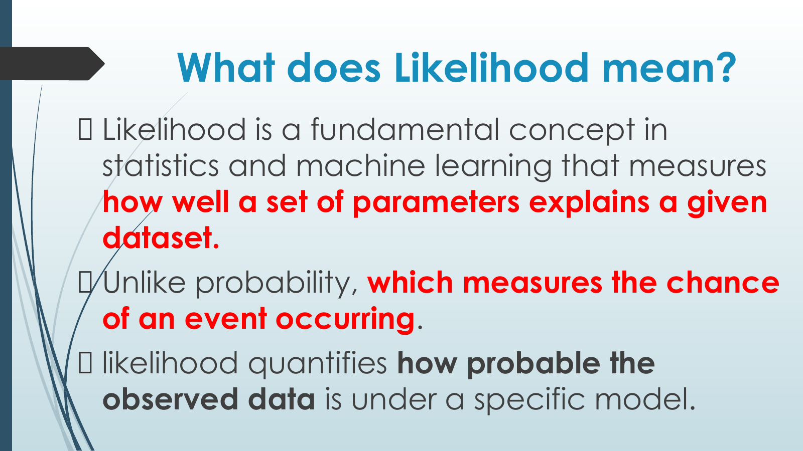

### Extracted Slide Text

- What does Likelihood mean?
- Likelihood is a fundamental concept in
- statistics and machine learning that measures
- how well a set of parameters explains a given
- dataset.
- Unlike probability, which measures the chance
- of an event occurring.
- likelihood quantifies how probable the
- observed data is under a specific model.

### Page Description And Teaching Notes

Slide type: concept explanation slide.
Main idea: Likelihood is a fundamental concept in statistics and machine learning that measures how well a set of parameters explains a given dataset. Unlike probability, which measures the chance of an event occurring.
This page explains a core concept in prose. The main task is to convert the definition into a clear statement of what the concept is, why it is used, and where it appears in a machine-learning workflow.
Detailed page understanding:
- `Likelihood is a fundamental concept in` gives the definition-level meaning. Explain it first in simple words, then connect it to how a model learns from data.
- `statistics and machine learning that measures` is a core visible point. Explain what it means, why it matters, and how it connects to the slide title.
- `how well a set of parameters explains a given` is a core visible point. Explain what it means, why it matters, and how it connects to the slide title.
- `dataset.` is a core visible point. Explain what it means, why it matters, and how it connects to the slide title.
- `Unlike probability, which measures the chance` is a core visible point. Explain what it means, why it matters, and how it connects to the slide title.
- `of an event occurring.` is a core visible point. Explain what it means, why it matters, and how it connects to the slide title.
- `likelihood quantifies how probable the` is a core visible point. Explain what it means, why it matters, and how it connects to the slide title.
- `observed data is under a specific model.` is a core visible point. Explain what it means, why it matters, and how it connects to the slide title.
Important visible terms: What, Likelihood, Unlike.
Visual/layout description: the embedded image preserves the actual slide. Describe the title area first, then read bullets, formulas, tables, arrows, grouped boxes, or diagrams in their visible order. If the slide contains a diagram, explain the relationship shown by arrows/positioning before explaining the text labels.
Teaching note: after reading the slide, ask the learner to restate the page in one or two sentences and give one example. For formula or metric slides, also ask what each variable or metric means and when it should be used.
Exam/viva note: prepare the slide title as a short-answer question, then use the bullets or visual labels as the expected answer points.

## Page 114: Difference between Likelihood and

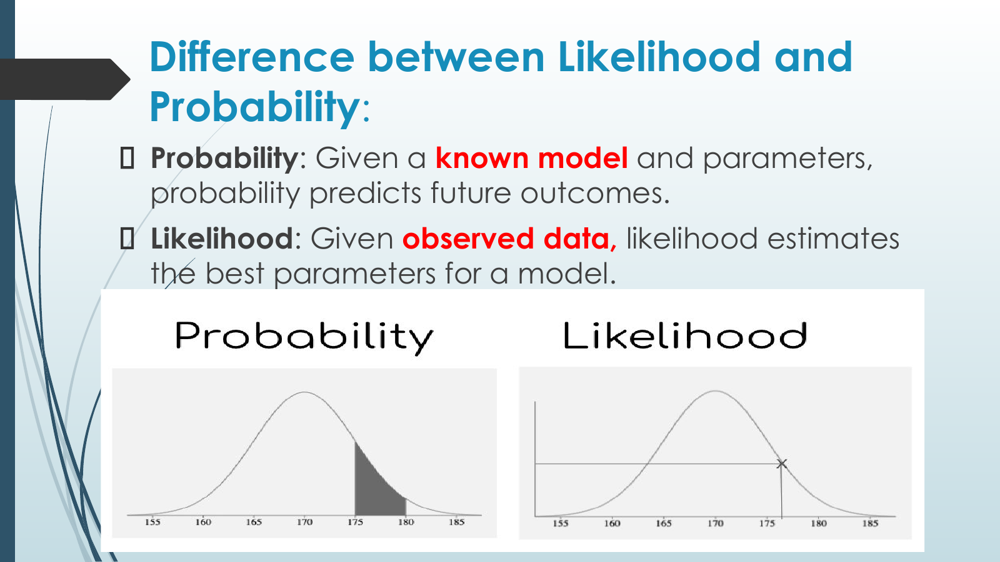

### Extracted Slide Text

- Difference between Likelihood and
- Probability:
- Probability: Given a known model and parameters,
- probability predicts future outcomes.
- Likelihood: Given observed data, likelihood estimates
- the best parameters for a model.

### Page Description And Teaching Notes

Slide type: concept explanation slide.
Main idea: Probability: Probability: Given a known model and parameters, probability predicts future outcomes. Likelihood: Given observed data, likelihood estimates the best parameters for a model.
This page explains a core concept in prose. The main task is to convert the definition into a clear statement of what the concept is, why it is used, and where it appears in a machine-learning workflow.
Detailed page understanding:
- `Probability:` is a core visible point. Explain what it means, why it matters, and how it connects to the slide title.
- `Probability: Given a known model and parameters,` is a core visible point. Explain what it means, why it matters, and how it connects to the slide title.
- `probability predicts future outcomes.` is a core visible point. Explain what it means, why it matters, and how it connects to the slide title.
- `Likelihood: Given observed data, likelihood estimates` is a core visible point. Explain what it means, why it matters, and how it connects to the slide title.
- `the best parameters for a model.` is a core visible point. Explain what it means, why it matters, and how it connects to the slide title.
Important visible terms: Difference, Likelihood, Probability, Given.
Visual/layout description: the embedded image preserves the actual slide. Describe the title area first, then read bullets, formulas, tables, arrows, grouped boxes, or diagrams in their visible order. If the slide contains a diagram, explain the relationship shown by arrows/positioning before explaining the text labels.
Teaching note: after reading the slide, ask the learner to restate the page in one or two sentences and give one example. For formula or metric slides, also ask what each variable or metric means and when it should be used.
Exam/viva note: prepare the slide title as a short-answer question, then use the bullets or visual labels as the expected answer points.

## Page 115: Unit I - Introduction to Machine Learning Page 115

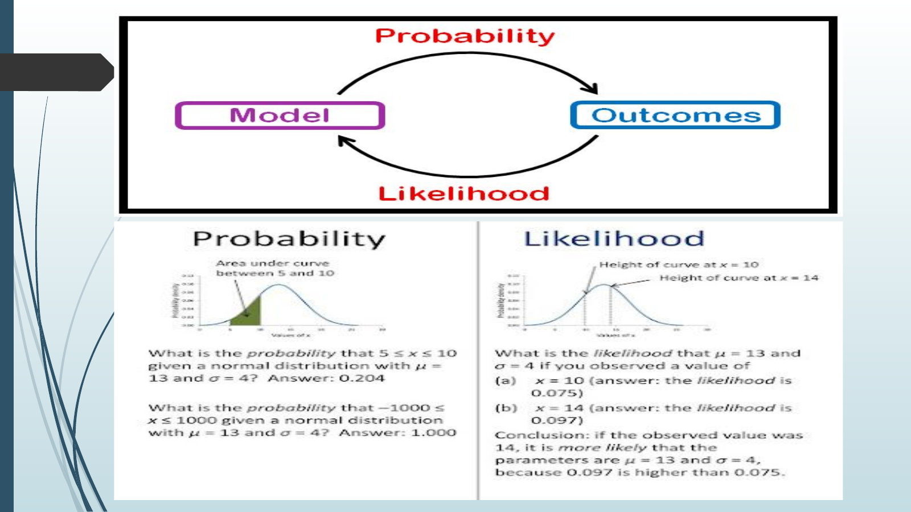

### Extracted Slide Text

- No selectable text extracted from this page.

### Page Description And Teaching Notes

Slide type: visual-only or image-heavy slide.
Main idea: the slide is visual-first, so the image should be treated as the source for the content and structure.
This page is primarily visual. The embedded slide image is the authoritative visual output; read it as a diagram or illustration first, then connect any visible labels to the surrounding pages.
- No reliable selectable text was extracted; use the slide image for the visible diagram, chart, or screenshot.
Visual/layout description: the embedded image preserves the actual slide. Describe the title area first, then read bullets, formulas, tables, arrows, grouped boxes, or diagrams in their visible order. If the slide contains a diagram, explain the relationship shown by arrows/positioning before explaining the text labels.
Teaching note: after reading the slide, ask the learner to restate the page in one or two sentences and give one example. For formula or metric slides, also ask what each variable or metric means and when it should be used.
Exam/viva note: prepare the slide title as a short-answer question, then use the bullets or visual labels as the expected answer points.

## Page 116: Maximum Likelihood Estimation

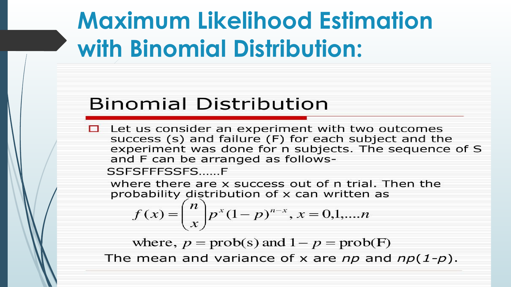

### Extracted Slide Text

- Maximum Likelihood Estimation
- with Binomial Distribution:

### Page Description And Teaching Notes

Slide type: title or transition slide.
Main idea: with Binomial Distribution:.
This page sets the context for the next topic. Treat it as a section marker: it tells the learner what concept or unit is starting before the deck moves into definitions, examples, or formulas.
Detailed page understanding:
- `with Binomial Distribution:` is a core visible point. Explain what it means, why it matters, and how it connects to the slide title.
Important visible terms: Maximum Likelihood Estimation, Binomial Distribution.
Visual/layout description: the embedded image preserves the actual slide. Describe the title area first, then read bullets, formulas, tables, arrows, grouped boxes, or diagrams in their visible order. If the slide contains a diagram, explain the relationship shown by arrows/positioning before explaining the text labels.
Teaching note: after reading the slide, ask the learner to restate the page in one or two sentences and give one example. For formula or metric slides, also ask what each variable or metric means and when it should be used.
Exam/viva note: prepare the slide title as a short-answer question, then use the bullets or visual labels as the expected answer points.

## Page 117: Unit I - Introduction to Machine Learning Page 117

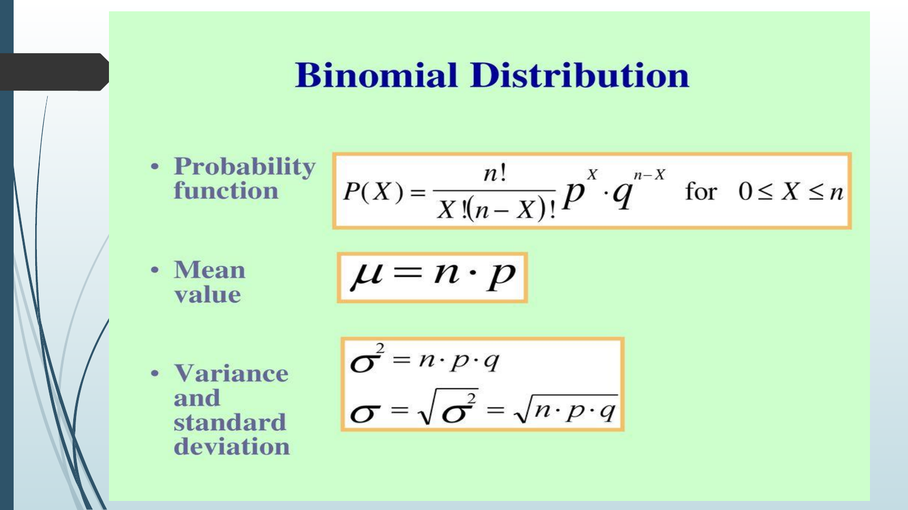

### Extracted Slide Text

- No selectable text extracted from this page.

### Page Description And Teaching Notes

Slide type: visual-only or image-heavy slide.
Main idea: the slide is visual-first, so the image should be treated as the source for the content and structure.
This page is primarily visual. The embedded slide image is the authoritative visual output; read it as a diagram or illustration first, then connect any visible labels to the surrounding pages.
- No reliable selectable text was extracted; use the slide image for the visible diagram, chart, or screenshot.
Visual/layout description: the embedded image preserves the actual slide. Describe the title area first, then read bullets, formulas, tables, arrows, grouped boxes, or diagrams in their visible order. If the slide contains a diagram, explain the relationship shown by arrows/positioning before explaining the text labels.
Teaching note: after reading the slide, ask the learner to restate the page in one or two sentences and give one example. For formula or metric slides, also ask what each variable or metric means and when it should be used.
Exam/viva note: prepare the slide title as a short-answer question, then use the bullets or visual labels as the expected answer points.

## Page 118: What is Modeling?

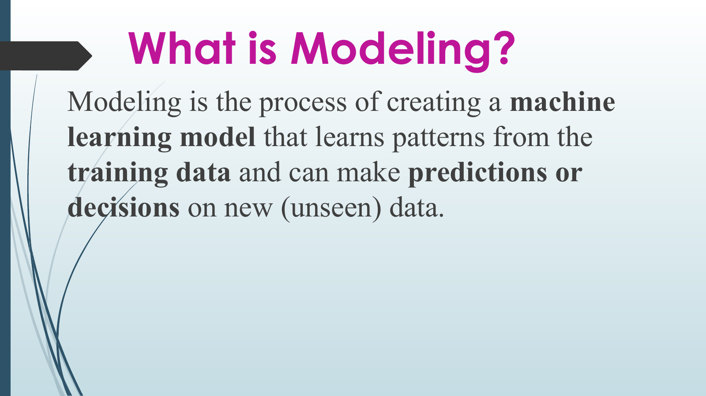

### Extracted Slide Text

- What is Modeling?
- Modeling is the process of creating a machine
- learning model that learns patterns from the
- training data and can make predictions or
- decisions on new (unseen) data.

### Page Description And Teaching Notes

Slide type: process or diagram slide.
Main idea: Modeling is the process of creating a machine learning model that learns patterns from the training data and can make predictions or decisions on new (unseen) data.
This page describes a flow, algorithm, or sequence. Read the visual from start to finish and explain how each stage transforms data, parameters, or decisions into the next stage.
Detailed page understanding:
- `Modeling is the process of creating a machine` is a core visible point. Explain what it means, why it matters, and how it connects to the slide title.
- `learning model that learns patterns from the` is a core visible point. Explain what it means, why it matters, and how it connects to the slide title.
- `training data and can make predictions or` is a core visible point. Explain what it means, why it matters, and how it connects to the slide title.
- `decisions on new (unseen) data.` is a core visible point. Explain what it means, why it matters, and how it connects to the slide title.
Important visible terms: What, Modeling.
Visual/layout description: the embedded image preserves the actual slide. Describe the title area first, then read bullets, formulas, tables, arrows, grouped boxes, or diagrams in their visible order. If the slide contains a diagram, explain the relationship shown by arrows/positioning before explaining the text labels.
Teaching note: after reading the slide, ask the learner to restate the page in one or two sentences and give one example. For formula or metric slides, also ask what each variable or metric means and when it should be used.
Exam/viva note: prepare the slide title as a short-answer question, then use the bullets or visual labels as the expected answer points.

## Page 119: Modeling Workflow:

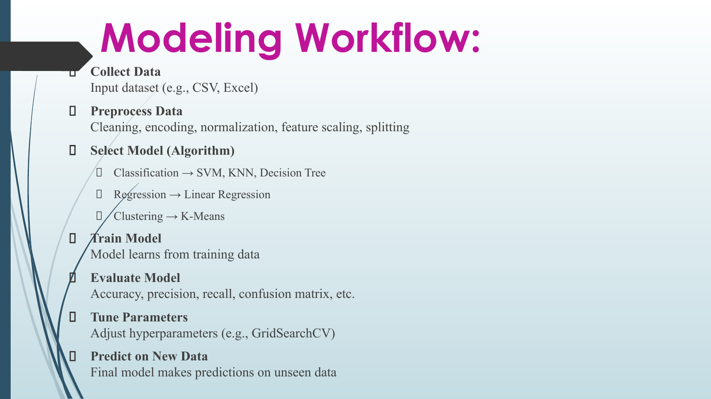

### Extracted Slide Text

- Modeling Workflow:
- Collect Data
- Input dataset (e.g., CSV, Excel)
- Preprocess Data
- Cleaning, encoding, normalization, feature scaling, splitting
- Select Model (Algorithm)
- Classification → SVM, KNN, Decision Tree
- Regression → Linear Regression
- Clustering → K-Means
- Train Model
- Model learns from training data
- Evaluate Model
- Accuracy, precision, recall, confusion matrix, etc.
- Tune Parameters
- Adjust hyperparameters (e.g., GridSearchCV)
- Predict on New Data
- Final model makes predictions on unseen data

### Page Description And Teaching Notes

Slide type: metric/table slide.
Main idea: Collect Data Input dataset (e.g., CSV, Excel) Preprocess Data Cleaning, encoding, normalization, feature scaling, splitting Select Model (Algorithm) Classification → SVM, KNN, Decision Tree.
This page organizes evaluation or comparison information. Focus on what each metric measures, when it is useful, and what mistake it prevents when judging a machine-learning model.
Detailed page understanding:
- `Collect Data` is a core visible point. Explain what it means, why it matters, and how it connects to the slide title.
- `Input dataset (e.g., CSV, Excel)` is a core visible point. Explain what it means, why it matters, and how it connects to the slide title.
- `Preprocess Data` is a core visible point. Explain what it means, why it matters, and how it connects to the slide title.
- `Cleaning, encoding, normalization, feature scaling, splitting` is a core visible point. Explain what it means, why it matters, and how it connects to the slide title.
- `Select Model (Algorithm)` is a core visible point. Explain what it means, why it matters, and how it connects to the slide title.
- `Classification → SVM, KNN, Decision Tree` is a core visible point. Explain what it means, why it matters, and how it connects to the slide title.
- `Regression → Linear Regression` is a core visible point. Explain what it means, why it matters, and how it connects to the slide title.
- `Clustering → K-Means` is a core visible point. Explain what it means, why it matters, and how it connects to the slide title.
- Additional bullets continue on the slide; use the extracted text list above for the complete wording.
- `Final model makes predictions on unseen data` is a core visible point. Explain what it means, why it matters, and how it connects to the slide title.
Important visible terms: Modeling Workflow, Collect Data Input, CSV, Excel, Preprocess Data Cleaning, Select Model, Algorithm, Classification.
Visual/layout description: the embedded image preserves the actual slide. Describe the title area first, then read bullets, formulas, tables, arrows, grouped boxes, or diagrams in their visible order. If the slide contains a diagram, explain the relationship shown by arrows/positioning before explaining the text labels.
Teaching note: after reading the slide, ask the learner to restate the page in one or two sentences and give one example. For formula or metric slides, also ask what each variable or metric means and when it should be used.
Exam/viva note: prepare the slide title as a short-answer question, then use the bullets or visual labels as the expected answer points.

## Page 120: Goal of Modeling

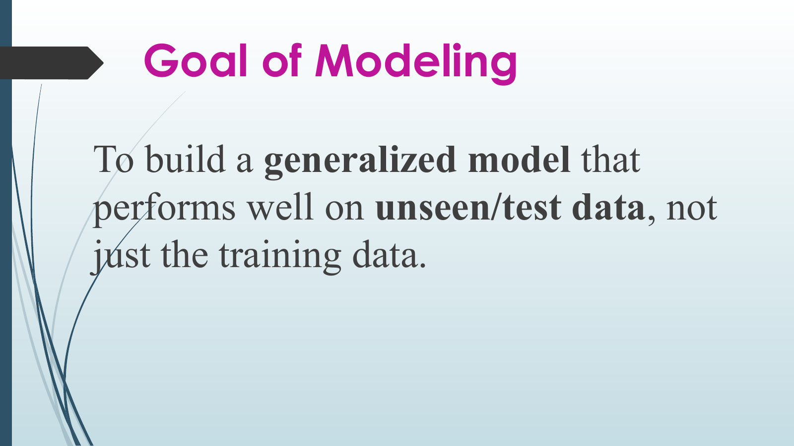

### Extracted Slide Text

- Goal of Modeling
- To build a generalized model that
- performs well on unseen/test data, not
- just the training data.

### Page Description And Teaching Notes

Slide type: concept explanation slide.
Main idea: To build a generalized model that performs well on unseen/test data, not just the training data.
This page explains a core concept in prose. The main task is to convert the definition into a clear statement of what the concept is, why it is used, and where it appears in a machine-learning workflow.
Detailed page understanding:
- `To build a generalized model that` is a core visible point. Explain what it means, why it matters, and how it connects to the slide title.
- `performs well on unseen/test data, not` is a core visible point. Explain what it means, why it matters, and how it connects to the slide title.
- `just the training data.` is a core visible point. Explain what it means, why it matters, and how it connects to the slide title.
Important visible terms: Goal, Modeling To.
Visual/layout description: the embedded image preserves the actual slide. Describe the title area first, then read bullets, formulas, tables, arrows, grouped boxes, or diagrams in their visible order. If the slide contains a diagram, explain the relationship shown by arrows/positioning before explaining the text labels.
Teaching note: after reading the slide, ask the learner to restate the page in one or two sentences and give one example. For formula or metric slides, also ask what each variable or metric means and when it should be used.
Exam/viva note: prepare the slide title as a short-answer question, then use the bullets or visual labels as the expected answer points.

## Page 121: Good Modeling Practices:

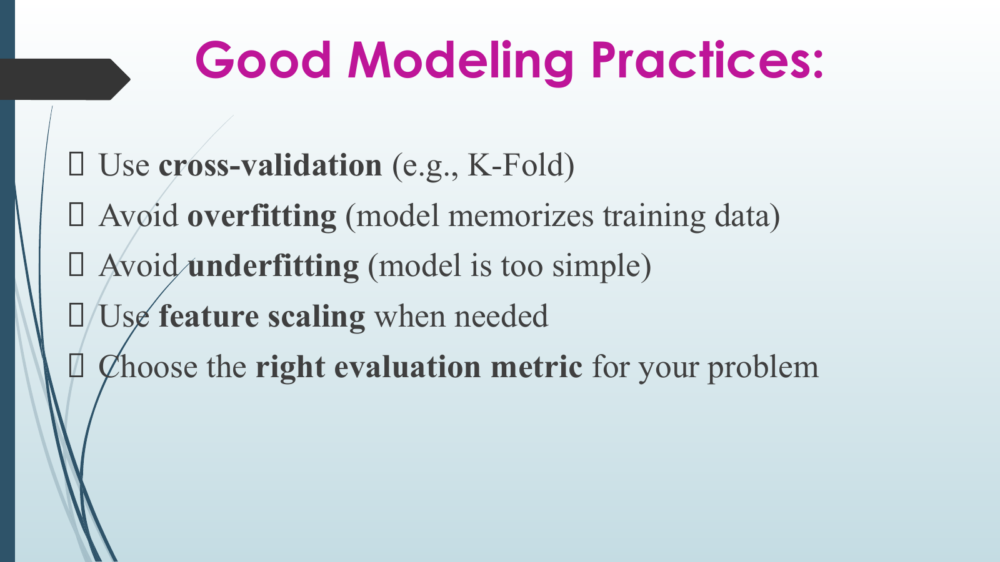

### Extracted Slide Text

- Good Modeling Practices:
- Use cross-validation (e.g., K-Fold)
- Avoid overfitting (model memorizes training data)
- Avoid underfitting (model is too simple)
- Use feature scaling when needed
- Choose the right evaluation metric for your problem

### Page Description And Teaching Notes

Slide type: concept explanation slide.
Main idea: Use cross-validation (e.g., K-Fold) Avoid overfitting (model memorizes training data) Avoid underfitting (model is too simple) Use feature scaling when needed Choose the right evaluation metric for your problem.
This page explains a core concept in prose. The main task is to convert the definition into a clear statement of what the concept is, why it is used, and where it appears in a machine-learning workflow.
Detailed page understanding:
- `Use cross-validation (e.g., K-Fold)` is an application/example point. Convert it into a concrete real-world case while teaching.
- `Avoid overfitting (model memorizes training data)` is a core visible point. Explain what it means, why it matters, and how it connects to the slide title.
- `Avoid underfitting (model is too simple)` is a core visible point. Explain what it means, why it matters, and how it connects to the slide title.
- `Use feature scaling when needed` is an application/example point. Convert it into a concrete real-world case while teaching.
- `Choose the right evaluation metric for your problem` is a limitation or risk. Mention when the method may fail and what alternative or precaution can reduce the issue.
Important visible terms: Good Modeling Practices, Use, K-Fold, Avoid, Choose.
Visual/layout description: the embedded image preserves the actual slide. Describe the title area first, then read bullets, formulas, tables, arrows, grouped boxes, or diagrams in their visible order. If the slide contains a diagram, explain the relationship shown by arrows/positioning before explaining the text labels.
Teaching note: after reading the slide, ask the learner to restate the page in one or two sentences and give one example. For formula or metric slides, also ask what each variable or metric means and when it should be used.
Exam/viva note: prepare the slide title as a short-answer question, then use the bullets or visual labels as the expected answer points.

## Page 122: Types of ML Models Based on Task

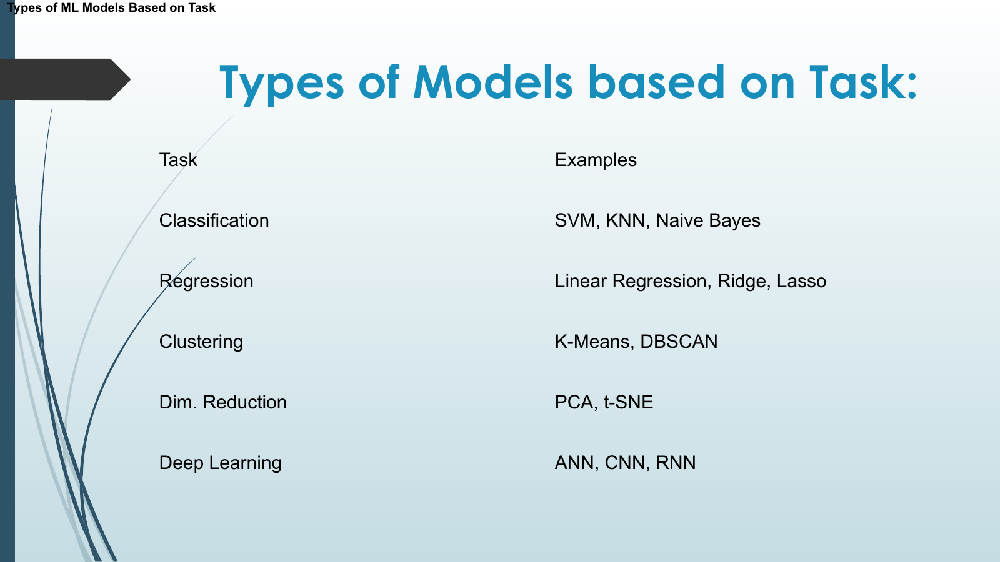

### Extracted Slide Text

- Types of ML Models Based on Task
- Types of Models based on Task:
- Task Examples
- Classification SVM, KNN, Naive Bayes
- Regression Linear Regression, Ridge, Lasso
- Clustering K-Means, DBSCAN
- Dim. Reduction PCA, t-SNE
- Deep Learning ANN, CNN, RNN

### Page Description And Teaching Notes

Slide type: concept explanation slide.
Main idea: Types of Models based on Task: Task Examples Classification SVM, KNN, Naive Bayes Regression Linear Regression, Ridge, Lasso Clustering K-Means, DBSCAN Dim. Reduction PCA, t-SNE.
This page explains a core concept in prose. The main task is to convert the definition into a clear statement of what the concept is, why it is used, and where it appears in a machine-learning workflow.
Detailed page understanding:
- `Types of Models based on Task:` is a core visible point. Explain what it means, why it matters, and how it connects to the slide title.
- `Task Examples` is an application/example point. Convert it into a concrete real-world case while teaching.
- `Classification SVM, KNN, Naive Bayes` is a core visible point. Explain what it means, why it matters, and how it connects to the slide title.
- `Regression Linear Regression, Ridge, Lasso` is a core visible point. Explain what it means, why it matters, and how it connects to the slide title.
- `Clustering K-Means, DBSCAN` is a core visible point. Explain what it means, why it matters, and how it connects to the slide title.
- `Dim. Reduction PCA, t-SNE` is a core visible point. Explain what it means, why it matters, and how it connects to the slide title.
- `Deep Learning ANN, CNN, RNN` is a core visible point. Explain what it means, why it matters, and how it connects to the slide title.
Important visible terms: Types, ML Models Based, Task Types, Models, Task, Task Examples Classification SVM, KNN, Naive Bayes Regression Linear.
Visual/layout description: the embedded image preserves the actual slide. Describe the title area first, then read bullets, formulas, tables, arrows, grouped boxes, or diagrams in their visible order. If the slide contains a diagram, explain the relationship shown by arrows/positioning before explaining the text labels.
Teaching note: after reading the slide, ask the learner to restate the page in one or two sentences and give one example. For formula or metric slides, also ask what each variable or metric means and when it should be used.
Exam/viva note: prepare the slide title as a short-answer question, then use the bullets or visual labels as the expected answer points.

## Page 123: What is Regression?

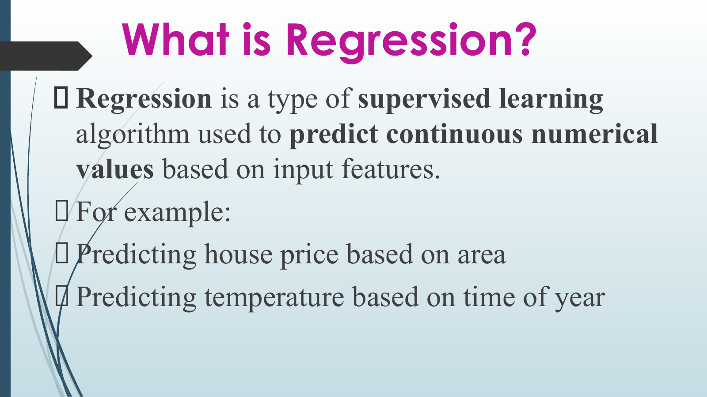

### Extracted Slide Text

- What is Regression?
- Regression is a type of supervised learning
- algorithm used to predict continuous numerical
- values based on input features.
- For example:
- Predicting house price based on area
- Predicting temperature based on time of year

### Page Description And Teaching Notes

Slide type: concept explanation slide.
Main idea: Regression is a type of supervised learning algorithm used to predict continuous numerical values based on input features. For example: Predicting house price based on area Predicting temperature based on time of year.
This page explains a core concept in prose. The main task is to convert the definition into a clear statement of what the concept is, why it is used, and where it appears in a machine-learning workflow.
Detailed page understanding:
- `Regression is a type of supervised learning` gives the definition-level meaning. Explain it first in simple words, then connect it to how a model learns from data.
- `algorithm used to predict continuous numerical` is an application/example point. Convert it into a concrete real-world case while teaching.
- `values based on input features.` is a core visible point. Explain what it means, why it matters, and how it connects to the slide title.
- `For example:` is an application/example point. Convert it into a concrete real-world case while teaching.
- `Predicting house price based on area` is an application/example point. Convert it into a concrete real-world case while teaching.
- `Predicting temperature based on time of year` is a core visible point. Explain what it means, why it matters, and how it connects to the slide title.
Important visible terms: What, Regression, For, Predicting.
Visual/layout description: the embedded image preserves the actual slide. Describe the title area first, then read bullets, formulas, tables, arrows, grouped boxes, or diagrams in their visible order. If the slide contains a diagram, explain the relationship shown by arrows/positioning before explaining the text labels.
Teaching note: after reading the slide, ask the learner to restate the page in one or two sentences and give one example. For formula or metric slides, also ask what each variable or metric means and when it should be used.
Exam/viva note: prepare the slide title as a short-answer question, then use the bullets or visual labels as the expected answer points.

## Page 124: Types of Regression:

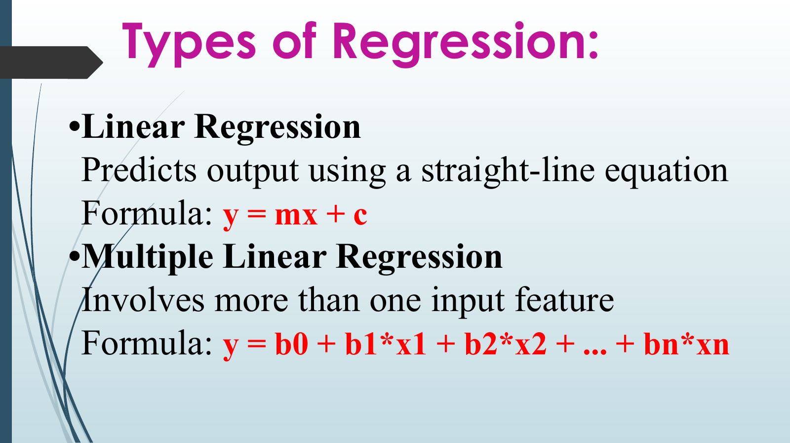

### Extracted Slide Text

- Types of Regression:
- •Linear Regression
- Predicts output using a straight-line equation
- Formula: y = mx + c
- •Multiple Linear Regression
- Involves more than one input feature
- Formula: y = b0 + b1*x1 + b2*x2 + ... + bn*xn

### Page Description And Teaching Notes

Slide type: formula or calculation slide.
Main idea: •Linear Regression Predicts output using a straight-line equation Formula: y = mx + c •Multiple Linear Regression Involves more than one input feature Formula: y = b0 + b1*x1 + b2*x2 + ... + bn*xn.
This page should be read carefully because it introduces a calculation, objective, or optimization idea. Identify the variables in the formula, what quantity is being minimized or measured, and how the equation supports model training or evaluation.
Detailed page understanding:
- `•Linear Regression` is one item in the slide's list. Treat it as a separate subtopic and prepare a one-line explanation for it.
- `Predicts output using a straight-line equation` is a core visible point. Explain what it means, why it matters, and how it connects to the slide title.
- `Formula: y = mx + c` is a core visible point. Explain what it means, why it matters, and how it connects to the slide title.
- `•Multiple Linear Regression` is one item in the slide's list. Treat it as a separate subtopic and prepare a one-line explanation for it.
- `Involves more than one input feature` is a core visible point. Explain what it means, why it matters, and how it connects to the slide title.
- `Formula: y = b0 + b1*x1 + b2*x2 + ... + bn*xn` is a core visible point. Explain what it means, why it matters, and how it connects to the slide title.
Important visible terms: Types, Regression, Linear Regression Predicts, Formula, Multiple Linear Regression Involves.
Visual/layout description: the embedded image preserves the actual slide. Describe the title area first, then read bullets, formulas, tables, arrows, grouped boxes, or diagrams in their visible order. If the slide contains a diagram, explain the relationship shown by arrows/positioning before explaining the text labels.
Teaching note: after reading the slide, ask the learner to restate the page in one or two sentences and give one example. For formula or metric slides, also ask what each variable or metric means and when it should be used.
Exam/viva note: prepare the slide title as a short-answer question, then use the bullets or visual labels as the expected answer points.

## Page 125: Types of Regression:

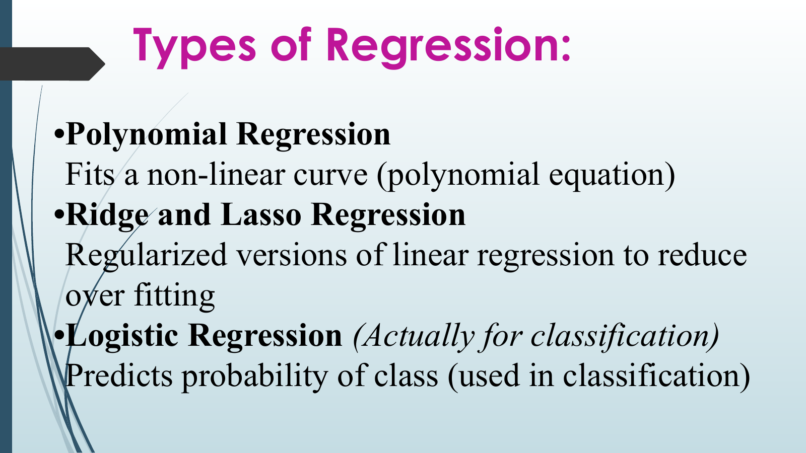

### Extracted Slide Text

- Types of Regression:
- •Polynomial Regression
- Fits a non-linear curve (polynomial equation)
- •Ridge and Lasso Regression
- Regularized versions of linear regression to reduce
- over fitting
- •Logistic Regression (Actually for classification)
- Predicts probability of class (used in classification)

### Page Description And Teaching Notes

Slide type: formula or calculation slide.
Main idea: •Polynomial Regression Fits a non-linear curve (polynomial equation) •Ridge and Lasso Regression Regularized versions of linear regression to reduce over fitting •Logistic Regression (Actually for classification).
This page should be read carefully because it introduces a calculation, objective, or optimization idea. Identify the variables in the formula, what quantity is being minimized or measured, and how the equation supports model training or evaluation.
Detailed page understanding:
- `•Polynomial Regression` is one item in the slide's list. Treat it as a separate subtopic and prepare a one-line explanation for it.
- `Fits a non-linear curve (polynomial equation)` is a core visible point. Explain what it means, why it matters, and how it connects to the slide title.
- `•Ridge and Lasso Regression` is one item in the slide's list. Treat it as a separate subtopic and prepare a one-line explanation for it.
- `Regularized versions of linear regression to reduce` is a core visible point. Explain what it means, why it matters, and how it connects to the slide title.
- `over fitting` is a core visible point. Explain what it means, why it matters, and how it connects to the slide title.
- `•Logistic Regression (Actually for classification)` is one item in the slide's list. Treat it as a separate subtopic and prepare a one-line explanation for it.
- `Predicts probability of class (used in classification)` is an application/example point. Convert it into a concrete real-world case while teaching.
Important visible terms: Types, Regression, Polynomial Regression Fits, Ridge, Lasso Regression Regularized, Logistic Regression, Actually, Predicts.
Progressive reveal note: compared with the previous page, this page adds or exposes: •Polynomial Regression; Fits a non-linear curve (polynomial equation); •Ridge and Lasso Regression; Regularized versions of linear regression to reduce; ...; Predicts probability of class (used in classification).
Visual/layout description: the embedded image preserves the actual slide. Describe the title area first, then read bullets, formulas, tables, arrows, grouped boxes, or diagrams in their visible order. If the slide contains a diagram, explain the relationship shown by arrows/positioning before explaining the text labels.
Teaching note: after reading the slide, ask the learner to restate the page in one or two sentences and give one example. For formula or metric slides, also ask what each variable or metric means and when it should be used.
Exam/viva note: prepare the slide title as a short-answer question, then use the bullets or visual labels as the expected answer points.

## Page 126: Steps in Regression Modeling:

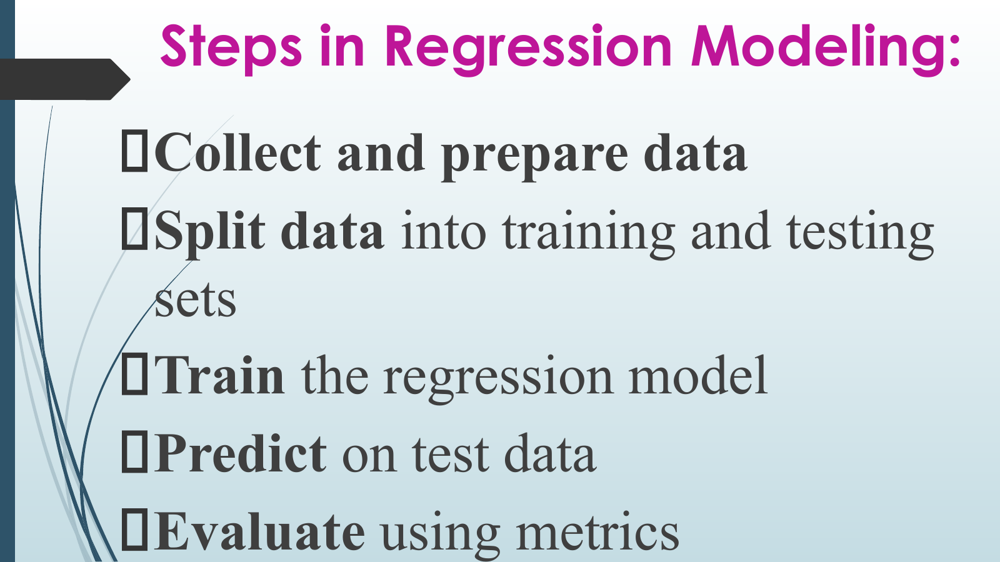

### Extracted Slide Text

- Steps in Regression Modeling:
- Collect and prepare data
- Split data into training and testing
- sets
- Train the regression model
- Predict on test data
- Evaluate using metrics

### Page Description And Teaching Notes

Slide type: process or diagram slide.
Main idea: Collect and prepare data Split data into training and testing sets Train the regression model Predict on test data Evaluate using metrics.
This page describes a flow, algorithm, or sequence. Read the visual from start to finish and explain how each stage transforms data, parameters, or decisions into the next stage.
Detailed page understanding:
- `Collect and prepare data` is a core visible point. Explain what it means, why it matters, and how it connects to the slide title.
- `Split data into training and testing` is a core visible point. Explain what it means, why it matters, and how it connects to the slide title.
- `sets` is a core visible point. Explain what it means, why it matters, and how it connects to the slide title.
- `Train the regression model` is a core visible point. Explain what it means, why it matters, and how it connects to the slide title.
- `Predict on test data` is a core visible point. Explain what it means, why it matters, and how it connects to the slide title.
- `Evaluate using metrics` is a core visible point. Explain what it means, why it matters, and how it connects to the slide title.
Important visible terms: Steps, Regression Modeling, Collect, Split, Train, Predict, Evaluate.
Visual/layout description: the embedded image preserves the actual slide. Describe the title area first, then read bullets, formulas, tables, arrows, grouped boxes, or diagrams in their visible order. If the slide contains a diagram, explain the relationship shown by arrows/positioning before explaining the text labels.
Teaching note: after reading the slide, ask the learner to restate the page in one or two sentences and give one example. For formula or metric slides, also ask what each variable or metric means and when it should be used.
Exam/viva note: prepare the slide title as a short-answer question, then use the bullets or visual labels as the expected answer points.

## Page 127: Linear Regression Equation:

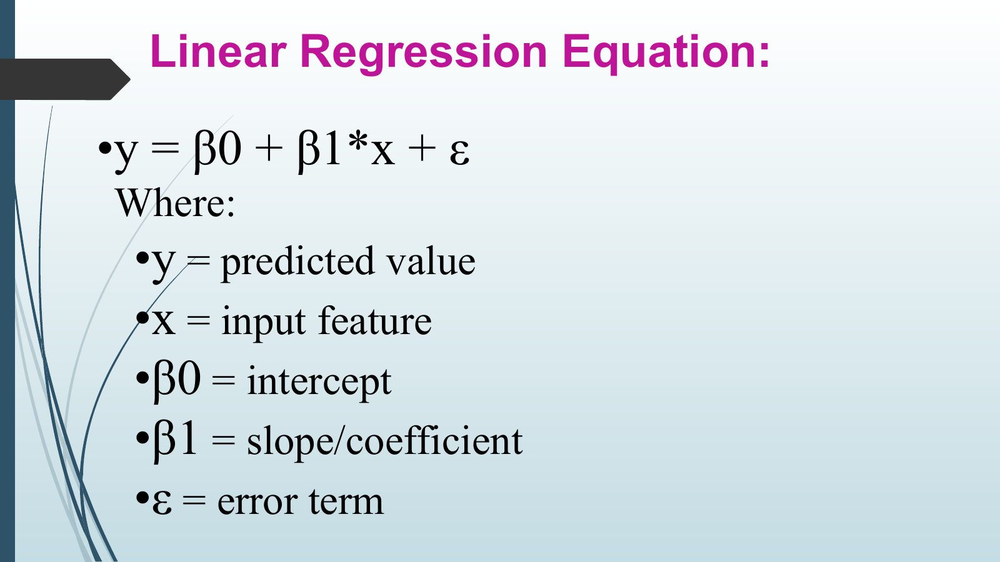

### Extracted Slide Text

- Linear Regression Equation:
- •y = β0 + β1*x + ε
- Where:
- •y = predicted value
- •x = input feature
- •β0 = intercept
- •β1 = slope/coefficient
- •ε = error term

### Page Description And Teaching Notes

Slide type: formula or calculation slide.
Main idea: •y = β0 + β1*x + ε Where: •y = predicted value •x = input feature •β0 = intercept •β1 = slope/coefficient.
This page should be read carefully because it introduces a calculation, objective, or optimization idea. Identify the variables in the formula, what quantity is being minimized or measured, and how the equation supports model training or evaluation.
Detailed page understanding:
- `•y = β0 + β1*x + ε` is one item in the slide's list. Treat it as a separate subtopic and prepare a one-line explanation for it.
- `Where:` is a core visible point. Explain what it means, why it matters, and how it connects to the slide title.
- `•y = predicted value` is one item in the slide's list. Treat it as a separate subtopic and prepare a one-line explanation for it.
- `•x = input feature` is one item in the slide's list. Treat it as a separate subtopic and prepare a one-line explanation for it.
- `•β0 = intercept` is one item in the slide's list. Treat it as a separate subtopic and prepare a one-line explanation for it.
- `•β1 = slope/coefficient` is one item in the slide's list. Treat it as a separate subtopic and prepare a one-line explanation for it.
- `•ε = error term` is a limitation or risk. Mention when the method may fail and what alternative or precaution can reduce the issue.
Important visible terms: Linear Regression Equation, Where.
Visual/layout description: the embedded image preserves the actual slide. Describe the title area first, then read bullets, formulas, tables, arrows, grouped boxes, or diagrams in their visible order. If the slide contains a diagram, explain the relationship shown by arrows/positioning before explaining the text labels.
Teaching note: after reading the slide, ask the learner to restate the page in one or two sentences and give one example. For formula or metric slides, also ask what each variable or metric means and when it should be used.
Exam/viva note: prepare the slide title as a short-answer question, then use the bullets or visual labels as the expected answer points.

## Page 128: Unit I - Introduction to Machine Learning Page 128

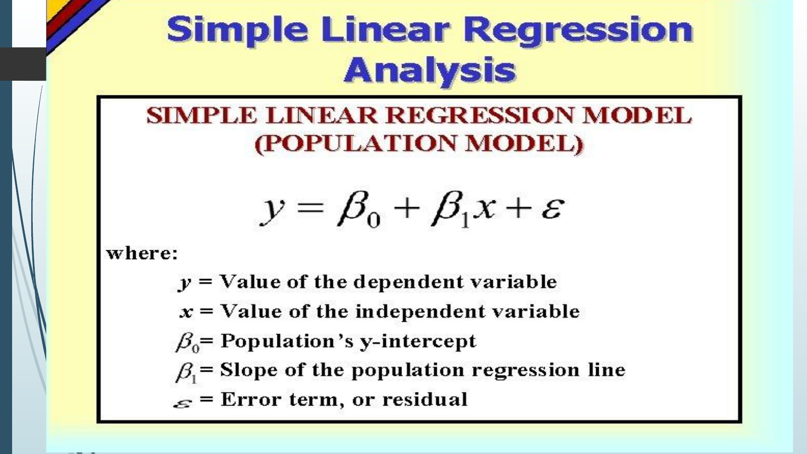

### Extracted Slide Text

- No selectable text extracted from this page.

### Page Description And Teaching Notes

Slide type: visual-only or image-heavy slide.
Main idea: the slide is visual-first, so the image should be treated as the source for the content and structure.
This page is primarily visual. The embedded slide image is the authoritative visual output; read it as a diagram or illustration first, then connect any visible labels to the surrounding pages.
- No reliable selectable text was extracted; use the slide image for the visible diagram, chart, or screenshot.
Visual/layout description: the embedded image preserves the actual slide. Describe the title area first, then read bullets, formulas, tables, arrows, grouped boxes, or diagrams in their visible order. If the slide contains a diagram, explain the relationship shown by arrows/positioning before explaining the text labels.
Teaching note: after reading the slide, ask the learner to restate the page in one or two sentences and give one example. For formula or metric slides, also ask what each variable or metric means and when it should be used.
Exam/viva note: prepare the slide title as a short-answer question, then use the bullets or visual labels as the expected answer points.

## Page 129: Unit I - Introduction to Machine Learning Page 129

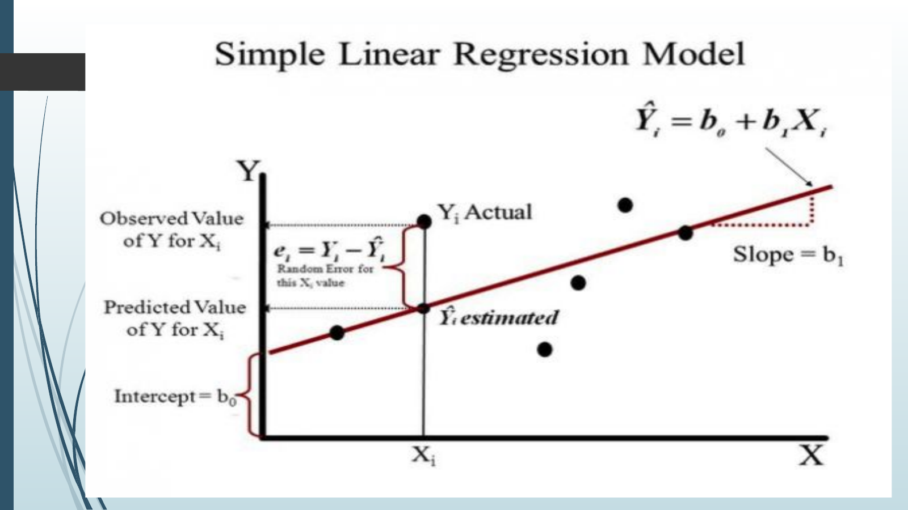

### Extracted Slide Text

- No selectable text extracted from this page.

### Page Description And Teaching Notes

Slide type: visual-only or image-heavy slide.
Main idea: the slide is visual-first, so the image should be treated as the source for the content and structure.
This page is primarily visual. The embedded slide image is the authoritative visual output; read it as a diagram or illustration first, then connect any visible labels to the surrounding pages.
- No reliable selectable text was extracted; use the slide image for the visible diagram, chart, or screenshot.
Visual/layout description: the embedded image preserves the actual slide. Describe the title area first, then read bullets, formulas, tables, arrows, grouped boxes, or diagrams in their visible order. If the slide contains a diagram, explain the relationship shown by arrows/positioning before explaining the text labels.
Teaching note: after reading the slide, ask the learner to restate the page in one or two sentences and give one example. For formula or metric slides, also ask what each variable or metric means and when it should be used.
Exam/viva note: prepare the slide title as a short-answer question, then use the bullets or visual labels as the expected answer points.

## Page 130: Unit I - Introduction to Machine Learning Page 130

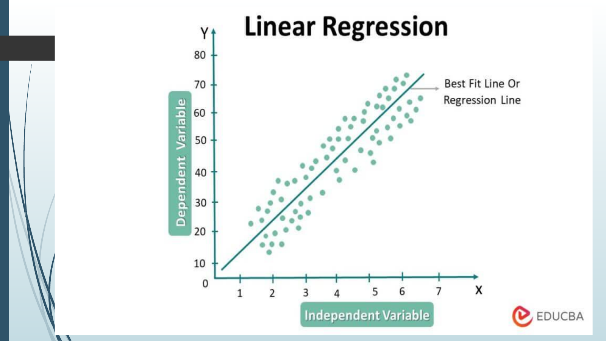

### Extracted Slide Text

- No selectable text extracted from this page.

### Page Description And Teaching Notes

Slide type: visual-only or image-heavy slide.
Main idea: the slide is visual-first, so the image should be treated as the source for the content and structure.
This page is primarily visual. The embedded slide image is the authoritative visual output; read it as a diagram or illustration first, then connect any visible labels to the surrounding pages.
- No reliable selectable text was extracted; use the slide image for the visible diagram, chart, or screenshot.
Visual/layout description: the embedded image preserves the actual slide. Describe the title area first, then read bullets, formulas, tables, arrows, grouped boxes, or diagrams in their visible order. If the slide contains a diagram, explain the relationship shown by arrows/positioning before explaining the text labels.
Teaching note: after reading the slide, ask the learner to restate the page in one or two sentences and give one example. For formula or metric slides, also ask what each variable or metric means and when it should be used.
Exam/viva note: prepare the slide title as a short-answer question, then use the bullets or visual labels as the expected answer points.

## Page 131: Multiple Linear Regression:

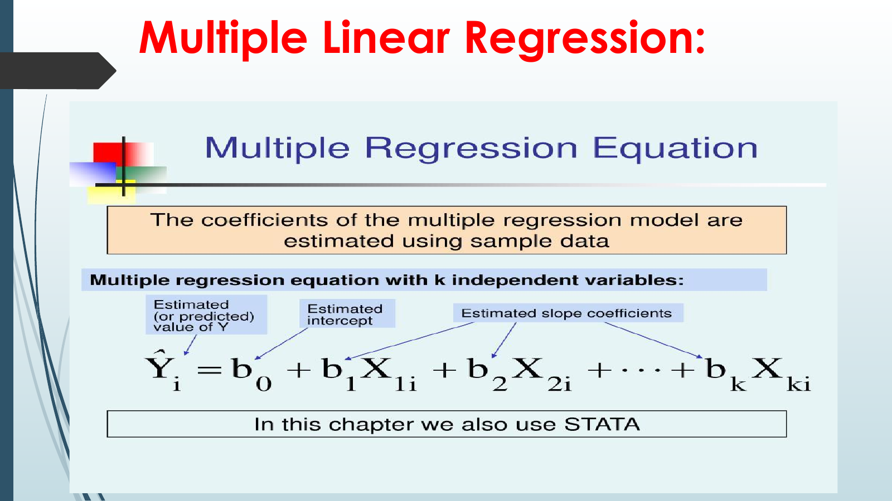

### Extracted Slide Text

- Multiple Linear Regression:

### Page Description And Teaching Notes

Slide type: title or transition slide.
Main idea: the slide is visual-first, so the image should be treated as the source for the content and structure.
This page sets the context for the next topic. Treat it as a section marker: it tells the learner what concept or unit is starting before the deck moves into definitions, examples, or formulas.
- No reliable selectable text was extracted; use the slide image for the visible diagram, chart, or screenshot.
Important visible terms: Multiple Linear Regression.
Visual/layout description: the embedded image preserves the actual slide. Describe the title area first, then read bullets, formulas, tables, arrows, grouped boxes, or diagrams in their visible order. If the slide contains a diagram, explain the relationship shown by arrows/positioning before explaining the text labels.
Teaching note: after reading the slide, ask the learner to restate the page in one or two sentences and give one example. For formula or metric slides, also ask what each variable or metric means and when it should be used.
Exam/viva note: prepare the slide title as a short-answer question, then use the bullets or visual labels as the expected answer points.

## Page 132: Unit I - Introduction to Machine Learning Page 132

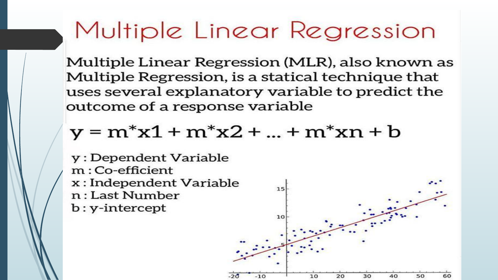

### Extracted Slide Text

- No selectable text extracted from this page.

### Page Description And Teaching Notes

Slide type: visual-only or image-heavy slide.
Main idea: the slide is visual-first, so the image should be treated as the source for the content and structure.
This page is primarily visual. The embedded slide image is the authoritative visual output; read it as a diagram or illustration first, then connect any visible labels to the surrounding pages.
- No reliable selectable text was extracted; use the slide image for the visible diagram, chart, or screenshot.
Visual/layout description: the embedded image preserves the actual slide. Describe the title area first, then read bullets, formulas, tables, arrows, grouped boxes, or diagrams in their visible order. If the slide contains a diagram, explain the relationship shown by arrows/positioning before explaining the text labels.
Teaching note: after reading the slide, ask the learner to restate the page in one or two sentences and give one example. For formula or metric slides, also ask what each variable or metric means and when it should be used.
Exam/viva note: prepare the slide title as a short-answer question, then use the bullets or visual labels as the expected answer points.

## Page 133: Unit I - Introduction to Machine Learning Page 133

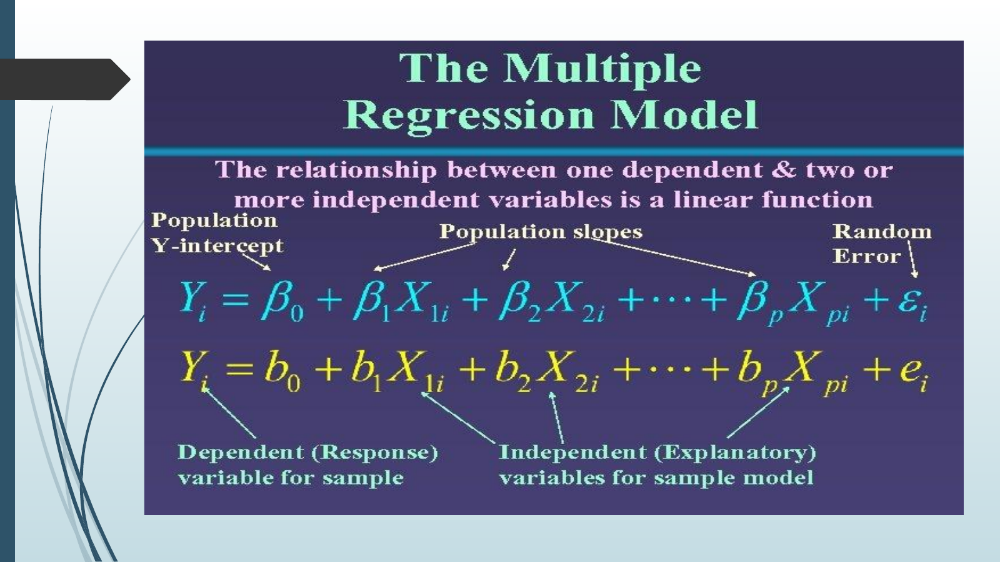

### Extracted Slide Text

- No selectable text extracted from this page.

### Page Description And Teaching Notes

Slide type: visual-only or image-heavy slide.
Main idea: the slide is visual-first, so the image should be treated as the source for the content and structure.
This page is primarily visual. The embedded slide image is the authoritative visual output; read it as a diagram or illustration first, then connect any visible labels to the surrounding pages.
- No reliable selectable text was extracted; use the slide image for the visible diagram, chart, or screenshot.
Visual/layout description: the embedded image preserves the actual slide. Describe the title area first, then read bullets, formulas, tables, arrows, grouped boxes, or diagrams in their visible order. If the slide contains a diagram, explain the relationship shown by arrows/positioning before explaining the text labels.
Teaching note: after reading the slide, ask the learner to restate the page in one or two sentences and give one example. For formula or metric slides, also ask what each variable or metric means and when it should be used.
Exam/viva note: prepare the slide title as a short-answer question, then use the bullets or visual labels as the expected answer points.

## Page 134: Discriminant function

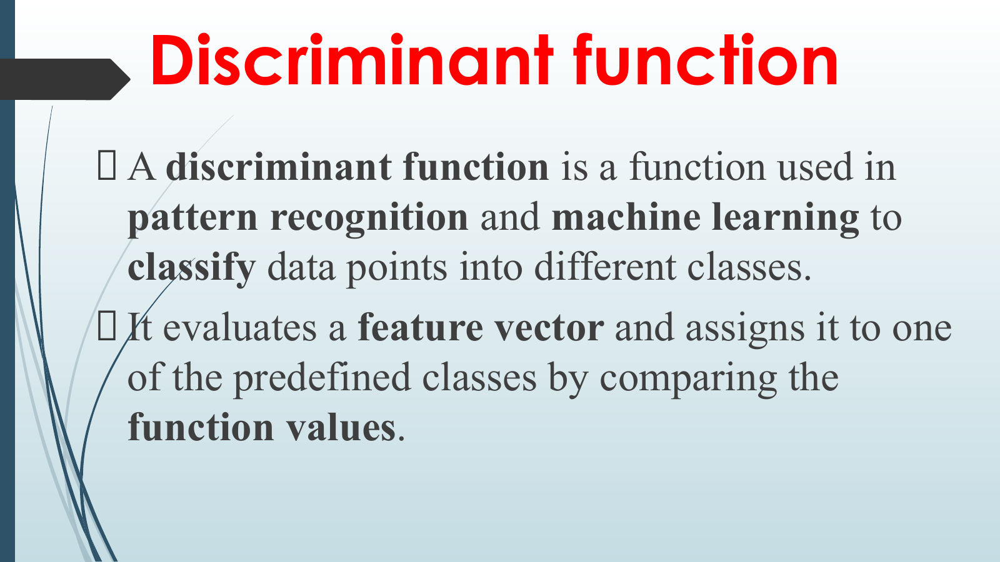

### Extracted Slide Text

- Discriminant function
- A discriminant function is a function used in
- pattern recognition and machine learning to
- classify data points into different classes.
- It evaluates a feature vector and assigns it to one
- of the predefined classes by comparing the
- function values.

### Page Description And Teaching Notes

Slide type: concept explanation slide.
Main idea: A discriminant function is a function used in pattern recognition and machine learning to classify data points into different classes. It evaluates a feature vector and assigns it to one of the predefined classes by comparing the function values.
This page explains a core concept in prose. The main task is to convert the definition into a clear statement of what the concept is, why it is used, and where it appears in a machine-learning workflow.
Detailed page understanding:
- `A discriminant function is a function used in` gives the definition-level meaning. Explain it first in simple words, then connect it to how a model learns from data.
- `pattern recognition and machine learning to` is a core visible point. Explain what it means, why it matters, and how it connects to the slide title.
- `classify data points into different classes.` is a core visible point. Explain what it means, why it matters, and how it connects to the slide title.
- `It evaluates a feature vector and assigns it to one` is a core visible point. Explain what it means, why it matters, and how it connects to the slide title.
- `of the predefined classes by comparing the` is a core visible point. Explain what it means, why it matters, and how it connects to the slide title.
- `function values.` is a core visible point. Explain what it means, why it matters, and how it connects to the slide title.
Important visible terms: Discriminant.
Visual/layout description: the embedded image preserves the actual slide. Describe the title area first, then read bullets, formulas, tables, arrows, grouped boxes, or diagrams in their visible order. If the slide contains a diagram, explain the relationship shown by arrows/positioning before explaining the text labels.
Teaching note: after reading the slide, ask the learner to restate the page in one or two sentences and give one example. For formula or metric slides, also ask what each variable or metric means and when it should be used.
Exam/viva note: prepare the slide title as a short-answer question, then use the bullets or visual labels as the expected answer points.

## Page 135: Unit I - Introduction to Machine Learning Page 135

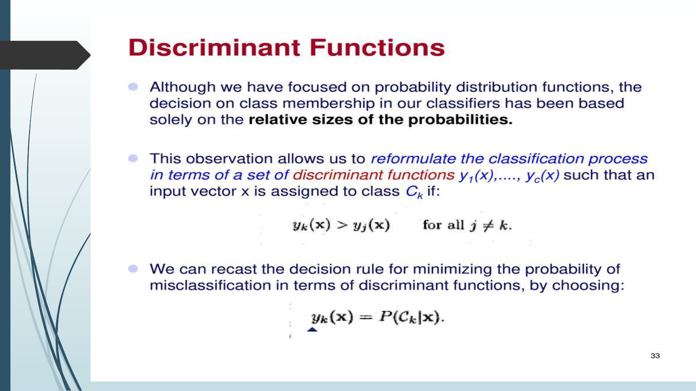

### Extracted Slide Text

- No selectable text extracted from this page.

### Page Description And Teaching Notes

Slide type: visual-only or image-heavy slide.
Main idea: the slide is visual-first, so the image should be treated as the source for the content and structure.
This page is primarily visual. The embedded slide image is the authoritative visual output; read it as a diagram or illustration first, then connect any visible labels to the surrounding pages.
- No reliable selectable text was extracted; use the slide image for the visible diagram, chart, or screenshot.
Visual/layout description: the embedded image preserves the actual slide. Describe the title area first, then read bullets, formulas, tables, arrows, grouped boxes, or diagrams in their visible order. If the slide contains a diagram, explain the relationship shown by arrows/positioning before explaining the text labels.
Teaching note: after reading the slide, ask the learner to restate the page in one or two sentences and give one example. For formula or metric slides, also ask what each variable or metric means and when it should be used.
Exam/viva note: prepare the slide title as a short-answer question, then use the bullets or visual labels as the expected answer points.

## Page 136: Unit I - Introduction to Machine Learning Page 136

### Extracted Slide Text

- No selectable text extracted from this page.

### Page Description And Teaching Notes

Slide type: visual-only or image-heavy slide.
Main idea: the slide is visual-first, so the image should be treated as the source for the content and structure.
This page is primarily visual. The embedded slide image is the authoritative visual output; read it as a diagram or illustration first, then connect any visible labels to the surrounding pages.
- No reliable selectable text was extracted; use the slide image for the visible diagram, chart, or screenshot.
Visual/layout description: the embedded image preserves the actual slide. Describe the title area first, then read bullets, formulas, tables, arrows, grouped boxes, or diagrams in their visible order. If the slide contains a diagram, explain the relationship shown by arrows/positioning before explaining the text labels.
Teaching note: after reading the slide, ask the learner to restate the page in one or two sentences and give one example. For formula or metric slides, also ask what each variable or metric means and when it should be used.
Exam/viva note: prepare the slide title as a short-answer question, then use the bullets or visual labels as the expected answer points.

## Page 137: Unit I - Introduction to Machine Learning Page 137

### Extracted Slide Text

- No selectable text extracted from this page.

### Page Description And Teaching Notes

Slide type: visual-only or image-heavy slide.
Main idea: the slide is visual-first, so the image should be treated as the source for the content and structure.
This page is primarily visual. The embedded slide image is the authoritative visual output; read it as a diagram or illustration first, then connect any visible labels to the surrounding pages.
- No reliable selectable text was extracted; use the slide image for the visible diagram, chart, or screenshot.
Visual/layout description: the embedded image preserves the actual slide. Describe the title area first, then read bullets, formulas, tables, arrows, grouped boxes, or diagrams in their visible order. If the slide contains a diagram, explain the relationship shown by arrows/positioning before explaining the text labels.
Teaching note: after reading the slide, ask the learner to restate the page in one or two sentences and give one example. For formula or metric slides, also ask what each variable or metric means and when it should be used.
Exam/viva note: prepare the slide title as a short-answer question, then use the bullets or visual labels as the expected answer points.

## Page 138: Why Use Discriminant

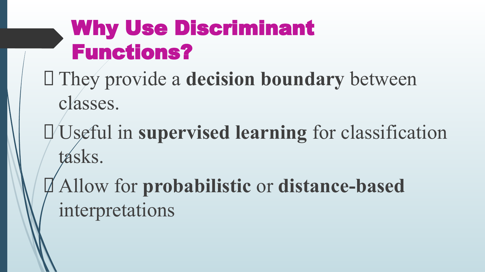

### Extracted Slide Text

- Why Use Discriminant
- Functions?
- They provide a decision boundary between
- classes.
- Useful in supervised learning for classification
- tasks.
- Allow for probabilistic or distance-based
- interpretations

### Page Description And Teaching Notes

Slide type: concept explanation slide.
Main idea: Functions? They provide a decision boundary between classes. Useful in supervised learning for classification tasks. Allow for probabilistic or distance-based.
This page explains a core concept in prose. The main task is to convert the definition into a clear statement of what the concept is, why it is used, and where it appears in a machine-learning workflow.
Detailed page understanding:
- `Functions?` is a core visible point. Explain what it means, why it matters, and how it connects to the slide title.
- `They provide a decision boundary between` is a core visible point. Explain what it means, why it matters, and how it connects to the slide title.
- `classes.` is a core visible point. Explain what it means, why it matters, and how it connects to the slide title.
- `Useful in supervised learning for classification` is an application/example point. Convert it into a concrete real-world case while teaching.
- `tasks.` is a core visible point. Explain what it means, why it matters, and how it connects to the slide title.
- `Allow for probabilistic or distance-based` is a core visible point. Explain what it means, why it matters, and how it connects to the slide title.
- `interpretations` is a core visible point. Explain what it means, why it matters, and how it connects to the slide title.
Important visible terms: Why Use Discriminant Functions, They, Useful, Allow.
Visual/layout description: the embedded image preserves the actual slide. Describe the title area first, then read bullets, formulas, tables, arrows, grouped boxes, or diagrams in their visible order. If the slide contains a diagram, explain the relationship shown by arrows/positioning before explaining the text labels.
Teaching note: after reading the slide, ask the learner to restate the page in one or two sentences and give one example. For formula or metric slides, also ask what each variable or metric means and when it should be used.
Exam/viva note: prepare the slide title as a short-answer question, then use the bullets or visual labels as the expected answer points.

## Page 139: Types of Discriminant

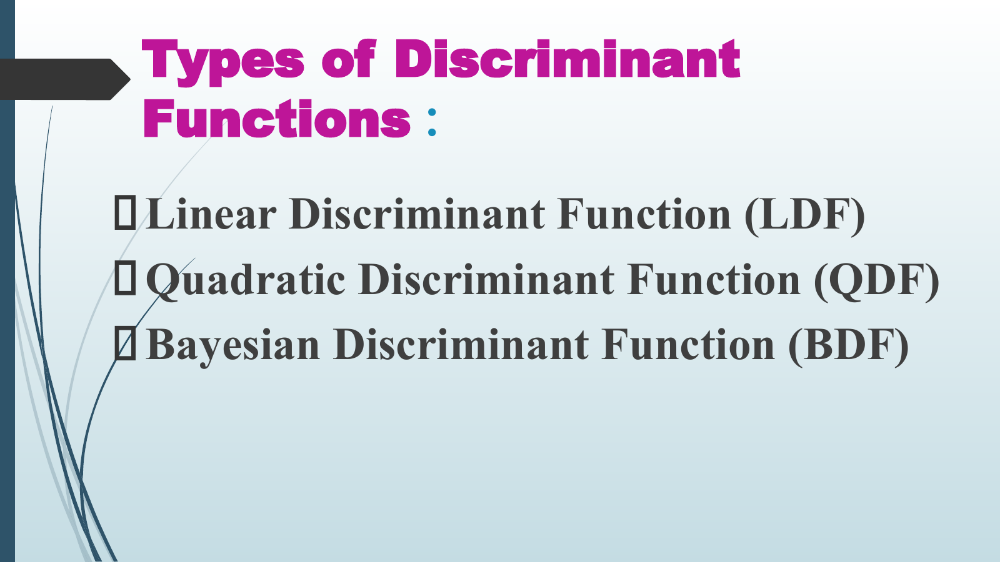

### Extracted Slide Text

- Types of Discriminant
- Functions :
- Linear Discriminant Function (LDF)
- Quadratic Discriminant Function (QDF)
- Bayesian Discriminant Function (BDF)

### Page Description And Teaching Notes

Slide type: concept explanation slide.
Main idea: Functions : Linear Discriminant Function (LDF) Quadratic Discriminant Function (QDF) Bayesian Discriminant Function (BDF).
This page explains a core concept in prose. The main task is to convert the definition into a clear statement of what the concept is, why it is used, and where it appears in a machine-learning workflow.
Detailed page understanding:
- `Functions :` is a core visible point. Explain what it means, why it matters, and how it connects to the slide title.
- `Linear Discriminant Function (LDF)` is a core visible point. Explain what it means, why it matters, and how it connects to the slide title.
- `Quadratic Discriminant Function (QDF)` is a core visible point. Explain what it means, why it matters, and how it connects to the slide title.
- `Bayesian Discriminant Function (BDF)` is a core visible point. Explain what it means, why it matters, and how it connects to the slide title.
Important visible terms: Types, Discriminant Functions, Linear Discriminant Function, LDF, Quadratic Discriminant Function, QDF, Bayesian Discriminant Function, BDF.
Visual/layout description: the embedded image preserves the actual slide. Describe the title area first, then read bullets, formulas, tables, arrows, grouped boxes, or diagrams in their visible order. If the slide contains a diagram, explain the relationship shown by arrows/positioning before explaining the text labels.
Teaching note: after reading the slide, ask the learner to restate the page in one or two sentences and give one example. For formula or metric slides, also ask what each variable or metric means and when it should be used.
Exam/viva note: prepare the slide title as a short-answer question, then use the bullets or visual labels as the expected answer points.

## Page 140: Applications Of Discriminant

### Extracted Slide Text

- Applications Of Discriminant
- Functions:
- Face recognition
- Handwriting digit recognition
- Medical diagnosis
- Spam detection

### Page Description And Teaching Notes

Slide type: concept explanation slide.
Main idea: Functions: Face recognition Handwriting digit recognition Medical diagnosis Spam detection.
This page explains a core concept in prose. The main task is to convert the definition into a clear statement of what the concept is, why it is used, and where it appears in a machine-learning workflow.
Detailed page understanding:
- `Functions:` is a core visible point. Explain what it means, why it matters, and how it connects to the slide title.
- `Face recognition` is a core visible point. Explain what it means, why it matters, and how it connects to the slide title.
- `Handwriting digit recognition` is a core visible point. Explain what it means, why it matters, and how it connects to the slide title.
- `Medical diagnosis` is a core visible point. Explain what it means, why it matters, and how it connects to the slide title.
- `Spam detection` is a core visible point. Explain what it means, why it matters, and how it connects to the slide title.
Important visible terms: Applications Of Discriminant Functions, Face, Handwriting, Medical, Spam.
Visual/layout description: the embedded image preserves the actual slide. Describe the title area first, then read bullets, formulas, tables, arrows, grouped boxes, or diagrams in their visible order. If the slide contains a diagram, explain the relationship shown by arrows/positioning before explaining the text labels.
Teaching note: after reading the slide, ask the learner to restate the page in one or two sentences and give one example. For formula or metric slides, also ask what each variable or metric means and when it should be used.
Exam/viva note: prepare the slide title as a short-answer question, then use the bullets or visual labels as the expected answer points.

## Page 141: Linear Discriminant Function:

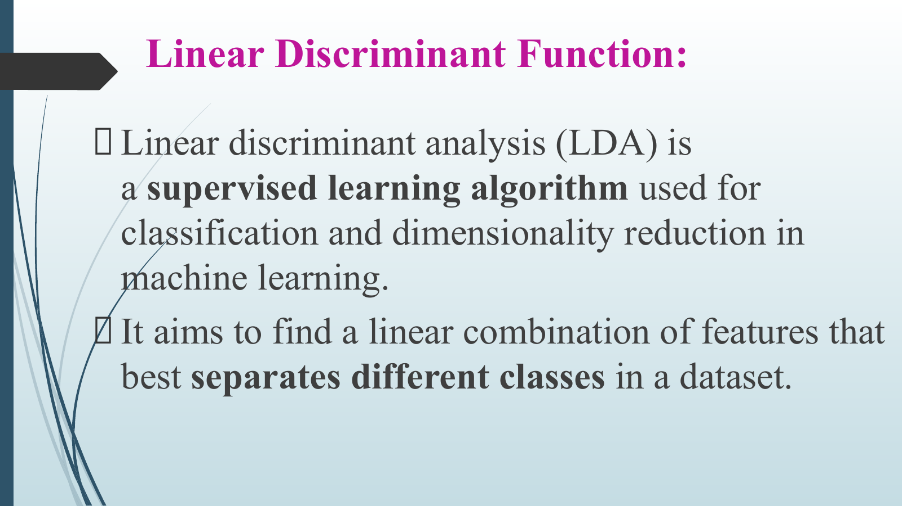

### Extracted Slide Text

- Linear Discriminant Function:
- Linear discriminant analysis (LDA) is
- a supervised learning algorithm used for
- classification and dimensionality reduction in
- machine learning.
- It aims to find a linear combination of features that
- best separates different classes in a dataset.

### Page Description And Teaching Notes

Slide type: concept explanation slide.
Main idea: Linear discriminant analysis (LDA) is a supervised learning algorithm used for classification and dimensionality reduction in machine learning. It aims to find a linear combination of features that best separates different classes in a dataset.
This page explains a core concept in prose. The main task is to convert the definition into a clear statement of what the concept is, why it is used, and where it appears in a machine-learning workflow.
Detailed page understanding:
- `Linear discriminant analysis (LDA) is` is a core visible point. Explain what it means, why it matters, and how it connects to the slide title.
- `a supervised learning algorithm used for` is an application/example point. Convert it into a concrete real-world case while teaching.
- `classification and dimensionality reduction in` is a core visible point. Explain what it means, why it matters, and how it connects to the slide title.
- `machine learning.` is a core visible point. Explain what it means, why it matters, and how it connects to the slide title.
- `It aims to find a linear combination of features that` is a core visible point. Explain what it means, why it matters, and how it connects to the slide title.
- `best separates different classes in a dataset.` is a core visible point. Explain what it means, why it matters, and how it connects to the slide title.
Important visible terms: Linear Discriminant Function, Linear, LDA.
Visual/layout description: the embedded image preserves the actual slide. Describe the title area first, then read bullets, formulas, tables, arrows, grouped boxes, or diagrams in their visible order. If the slide contains a diagram, explain the relationship shown by arrows/positioning before explaining the text labels.
Teaching note: after reading the slide, ask the learner to restate the page in one or two sentences and give one example. For formula or metric slides, also ask what each variable or metric means and when it should be used.
Exam/viva note: prepare the slide title as a short-answer question, then use the bullets or visual labels as the expected answer points.

## Page 142: +

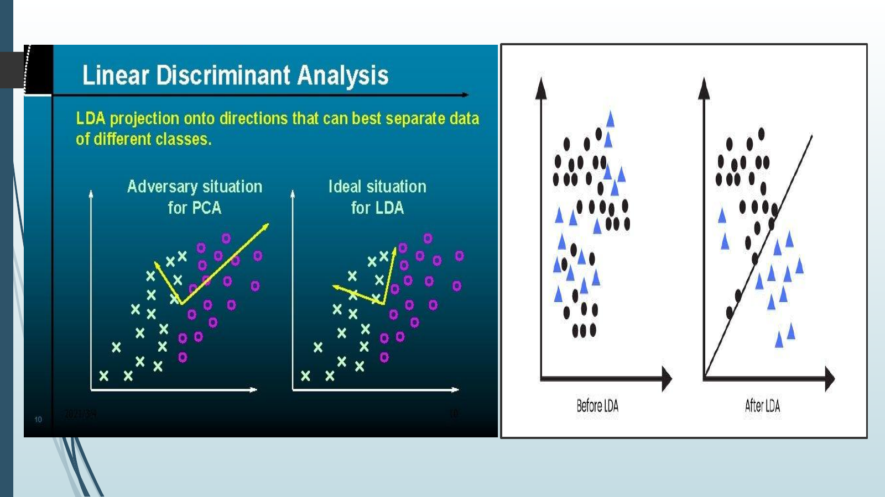

### Extracted Slide Text

- +

### Page Description And Teaching Notes

Slide type: title or transition slide.
Main idea: the slide is visual-first, so the image should be treated as the source for the content and structure.
This page sets the context for the next topic. Treat it as a section marker: it tells the learner what concept or unit is starting before the deck moves into definitions, examples, or formulas.
- No reliable selectable text was extracted; use the slide image for the visible diagram, chart, or screenshot.
Visual/layout description: the embedded image preserves the actual slide. Describe the title area first, then read bullets, formulas, tables, arrows, grouped boxes, or diagrams in their visible order. If the slide contains a diagram, explain the relationship shown by arrows/positioning before explaining the text labels.
Teaching note: after reading the slide, ask the learner to restate the page in one or two sentences and give one example. For formula or metric slides, also ask what each variable or metric means and when it should be used.
Exam/viva note: prepare the slide title as a short-answer question, then use the bullets or visual labels as the expected answer points.

## Page 143: Unit I - Introduction to Machine Learning Page 143

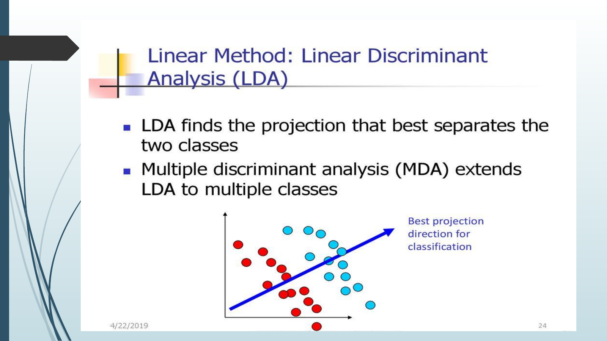

### Extracted Slide Text

- No selectable text extracted from this page.

### Page Description And Teaching Notes

Slide type: visual-only or image-heavy slide.
Main idea: the slide is visual-first, so the image should be treated as the source for the content and structure.
This page is primarily visual. The embedded slide image is the authoritative visual output; read it as a diagram or illustration first, then connect any visible labels to the surrounding pages.
- No reliable selectable text was extracted; use the slide image for the visible diagram, chart, or screenshot.
Visual/layout description: the embedded image preserves the actual slide. Describe the title area first, then read bullets, formulas, tables, arrows, grouped boxes, or diagrams in their visible order. If the slide contains a diagram, explain the relationship shown by arrows/positioning before explaining the text labels.
Teaching note: after reading the slide, ask the learner to restate the page in one or two sentences and give one example. For formula or metric slides, also ask what each variable or metric means and when it should be used.
Exam/viva note: prepare the slide title as a short-answer question, then use the bullets or visual labels as the expected answer points.

## Page 144: Decision surface

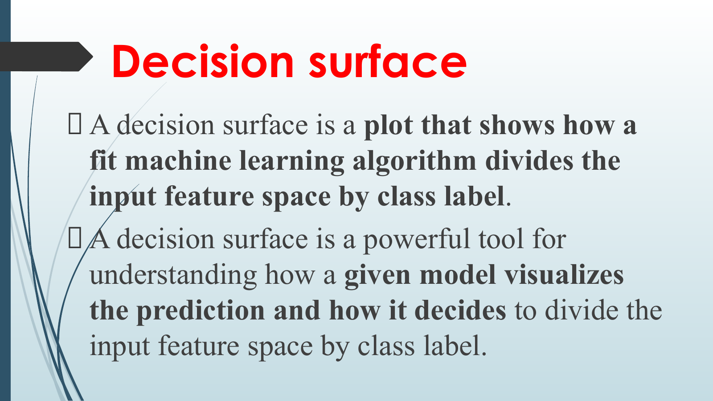

### Extracted Slide Text

- Decision surface
- A decision surface is a plot that shows how a
- fit machine learning algorithm divides the
- input feature space by class label.
- A decision surface is a powerful tool for
- understanding how a given model visualizes
- the prediction and how it decides to divide the
- input feature space by class label.

### Page Description And Teaching Notes

Slide type: concept explanation slide.
Main idea: A decision surface is a plot that shows how a fit machine learning algorithm divides the input feature space by class label. A decision surface is a powerful tool for understanding how a given model visualizes the prediction and how it decides to divide the.
This page explains a core concept in prose. The main task is to convert the definition into a clear statement of what the concept is, why it is used, and where it appears in a machine-learning workflow.
Detailed page understanding:
- `A decision surface is a plot that shows how a` gives the definition-level meaning. Explain it first in simple words, then connect it to how a model learns from data.
- `fit machine learning algorithm divides the` is a core visible point. Explain what it means, why it matters, and how it connects to the slide title.
- `input feature space by class label.` is a core visible point. Explain what it means, why it matters, and how it connects to the slide title.
- `A decision surface is a powerful tool for` gives the definition-level meaning. Explain it first in simple words, then connect it to how a model learns from data.
- `understanding how a given model visualizes` is a core visible point. Explain what it means, why it matters, and how it connects to the slide title.
- `the prediction and how it decides to divide the` is a core visible point. Explain what it means, why it matters, and how it connects to the slide title.
- `input feature space by class label.` is a core visible point. Explain what it means, why it matters, and how it connects to the slide title.
Important visible terms: Decision.
Visual/layout description: the embedded image preserves the actual slide. Describe the title area first, then read bullets, formulas, tables, arrows, grouped boxes, or diagrams in their visible order. If the slide contains a diagram, explain the relationship shown by arrows/positioning before explaining the text labels.
Teaching note: after reading the slide, ask the learner to restate the page in one or two sentences and give one example. For formula or metric slides, also ask what each variable or metric means and when it should be used.
Exam/viva note: prepare the slide title as a short-answer question, then use the bullets or visual labels as the expected answer points.

## Page 145: Visualization Of Decision

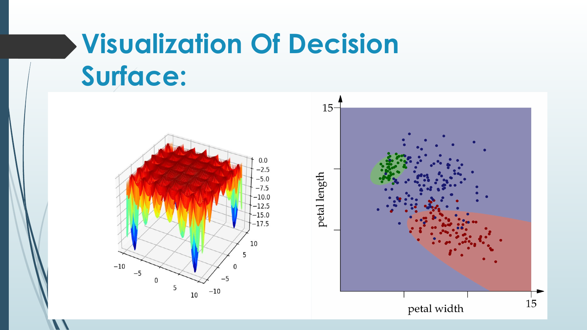

### Extracted Slide Text

- Visualization Of Decision
- Surface:

### Page Description And Teaching Notes

Slide type: title or transition slide.
Main idea: Surface:.
This page sets the context for the next topic. Treat it as a section marker: it tells the learner what concept or unit is starting before the deck moves into definitions, examples, or formulas.
Detailed page understanding:
- `Surface:` is a core visible point. Explain what it means, why it matters, and how it connects to the slide title.
Important visible terms: Visualization Of Decision Surface.
Visual/layout description: the embedded image preserves the actual slide. Describe the title area first, then read bullets, formulas, tables, arrows, grouped boxes, or diagrams in their visible order. If the slide contains a diagram, explain the relationship shown by arrows/positioning before explaining the text labels.
Teaching note: after reading the slide, ask the learner to restate the page in one or two sentences and give one example. For formula or metric slides, also ask what each variable or metric means and when it should be used.
Exam/viva note: prepare the slide title as a short-answer question, then use the bullets or visual labels as the expected answer points.

## Page 146: Learning Theory

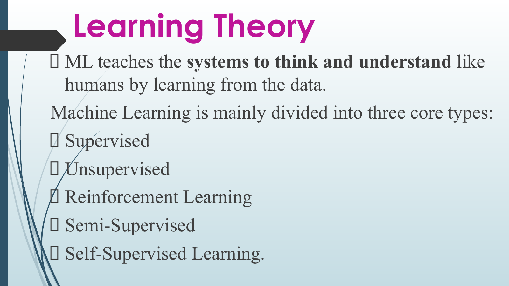

### Extracted Slide Text

- Learning Theory
- ML teaches the systems to think and understand like
- humans by learning from the data.
- Machine Learning is mainly divided into three core types:
- Supervised
- Unsupervised
- Reinforcement Learning
- Semi-Supervised
- Self-Supervised Learning.

### Page Description And Teaching Notes

Slide type: concept explanation slide.
Main idea: ML teaches the systems to think and understand like humans by learning from the data. Machine Learning is mainly divided into three core types: Supervised Unsupervised Reinforcement Learning.
This page explains a core concept in prose. The main task is to convert the definition into a clear statement of what the concept is, why it is used, and where it appears in a machine-learning workflow.
Detailed page understanding:
- `ML teaches the systems to think and understand like` is a core visible point. Explain what it means, why it matters, and how it connects to the slide title.
- `humans by learning from the data.` is a core visible point. Explain what it means, why it matters, and how it connects to the slide title.
- `Machine Learning is mainly divided into three core types:` is a core visible point. Explain what it means, why it matters, and how it connects to the slide title.
- `Supervised` is a core visible point. Explain what it means, why it matters, and how it connects to the slide title.
- `Unsupervised` is a core visible point. Explain what it means, why it matters, and how it connects to the slide title.
- `Reinforcement Learning` is a core visible point. Explain what it means, why it matters, and how it connects to the slide title.
- `Semi-Supervised` is a core visible point. Explain what it means, why it matters, and how it connects to the slide title.
- `Self-Supervised Learning.` is a core visible point. Explain what it means, why it matters, and how it connects to the slide title.
Important visible terms: Learning Theory ML, Machine Learning, Supervised Unsupervised Reinforcement Learning, Semi-Supervised Self-Supervised Learning.
Visual/layout description: the embedded image preserves the actual slide. Describe the title area first, then read bullets, formulas, tables, arrows, grouped boxes, or diagrams in their visible order. If the slide contains a diagram, explain the relationship shown by arrows/positioning before explaining the text labels.
Teaching note: after reading the slide, ask the learner to restate the page in one or two sentences and give one example. For formula or metric slides, also ask what each variable or metric means and when it should be used.
Exam/viva note: prepare the slide title as a short-answer question, then use the bullets or visual labels as the expected answer points.

## Page 147: Fisher’s linear discriminant:

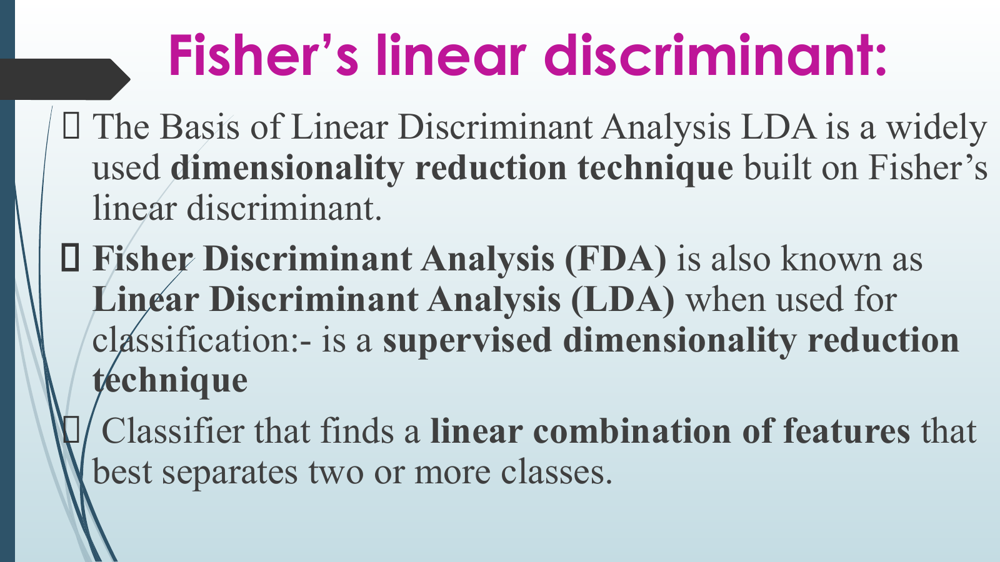

### Extracted Slide Text

- Fisher’s linear discriminant:
- The Basis of Linear Discriminant Analysis LDA is a widely
- used dimensionality reduction technique built on Fisher’s
- linear discriminant.
- Fisher Discriminant Analysis (FDA) is also known as
- Linear Discriminant Analysis (LDA) when used for
- classification:- is a supervised dimensionality reduction
- technique
- Classifier that finds a linear combination of features that
- best separates two or more classes.

### Page Description And Teaching Notes

Slide type: concept explanation slide.
Main idea: The Basis of Linear Discriminant Analysis LDA is a widely used dimensionality reduction technique built on Fisher’s linear discriminant. Fisher Discriminant Analysis (FDA) is also known as Linear Discriminant Analysis (LDA) when used for classification:- is a supervised dimensionality reduction.
This page explains a core concept in prose. The main task is to convert the definition into a clear statement of what the concept is, why it is used, and where it appears in a machine-learning workflow.
Detailed page understanding:
- `The Basis of Linear Discriminant Analysis LDA is a widely` gives the definition-level meaning. Explain it first in simple words, then connect it to how a model learns from data.
- `used dimensionality reduction technique built on Fisher’s` is an application/example point. Convert it into a concrete real-world case while teaching.
- `linear discriminant.` is a core visible point. Explain what it means, why it matters, and how it connects to the slide title.
- `Fisher Discriminant Analysis (FDA) is also known as` gives the definition-level meaning. Explain it first in simple words, then connect it to how a model learns from data.
- `Linear Discriminant Analysis (LDA) when used for` is an application/example point. Convert it into a concrete real-world case while teaching.
- `classification:- is a supervised dimensionality reduction` gives the definition-level meaning. Explain it first in simple words, then connect it to how a model learns from data.
- `technique` is a core visible point. Explain what it means, why it matters, and how it connects to the slide title.
- `Classifier that finds a linear combination of features that` is a core visible point. Explain what it means, why it matters, and how it connects to the slide title.
- `best separates two or more classes.` is a core visible point. Explain what it means, why it matters, and how it connects to the slide title.
Important visible terms: Fisher, The Basis, Linear Discriminant Analysis LDA, Fisher Discriminant Analysis, FDA, Linear Discriminant Analysis, LDA, Classifier.
Visual/layout description: the embedded image preserves the actual slide. Describe the title area first, then read bullets, formulas, tables, arrows, grouped boxes, or diagrams in their visible order. If the slide contains a diagram, explain the relationship shown by arrows/positioning before explaining the text labels.
Teaching note: after reading the slide, ask the learner to restate the page in one or two sentences and give one example. For formula or metric slides, also ask what each variable or metric means and when it should be used.
Exam/viva note: prepare the slide title as a short-answer question, then use the bullets or visual labels as the expected answer points.

## Page 148: Fisher’s linear discriminant can be used as a supervised

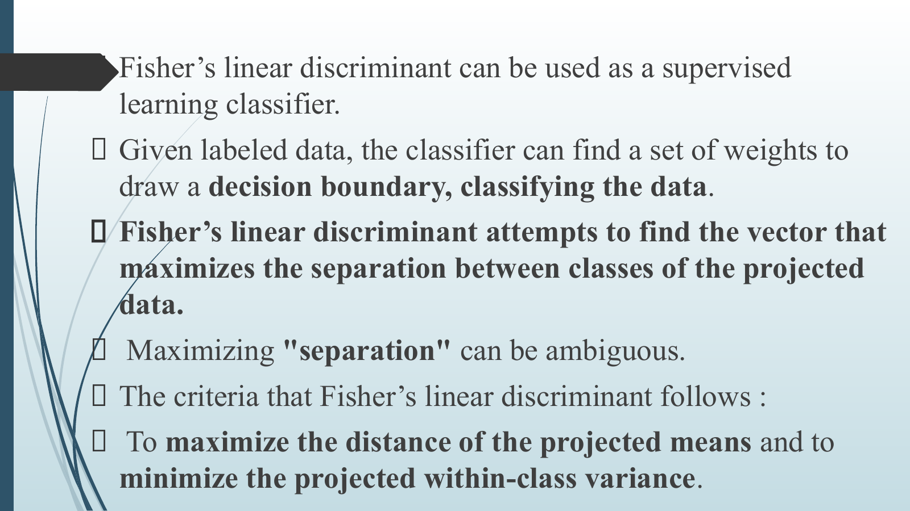

### Extracted Slide Text

- Fisher’s linear discriminant can be used as a supervised
- learning classifier.
- Given labeled data, the classifier can find a set of weights to
- draw a decision boundary, classifying the data.
- Fisher’s linear discriminant attempts to find the vector that
- maximizes the separation between classes of the projected
- data.
- Maximizing "separation" can be ambiguous.
- The criteria that Fisher’s linear discriminant follows :
- To maximize the distance of the projected means and to
- minimize the projected within-class variance.

### Page Description And Teaching Notes

Slide type: concept explanation slide.
Main idea: learning classifier. Given labeled data, the classifier can find a set of weights to draw a decision boundary, classifying the data. Fisher’s linear discriminant attempts to find the vector that maximizes the separation between classes of the projected data.
This page explains a core concept in prose. The main task is to convert the definition into a clear statement of what the concept is, why it is used, and where it appears in a machine-learning workflow.
Detailed page understanding:
- `learning classifier.` is a core visible point. Explain what it means, why it matters, and how it connects to the slide title.
- `Given labeled data, the classifier can find a set of weights to` is a core visible point. Explain what it means, why it matters, and how it connects to the slide title.
- `draw a decision boundary, classifying the data.` is a core visible point. Explain what it means, why it matters, and how it connects to the slide title.
- `Fisher’s linear discriminant attempts to find the vector that` is a core visible point. Explain what it means, why it matters, and how it connects to the slide title.
- `maximizes the separation between classes of the projected` is a core visible point. Explain what it means, why it matters, and how it connects to the slide title.
- `data.` is a core visible point. Explain what it means, why it matters, and how it connects to the slide title.
- `Maximizing "separation" can be ambiguous.` is a core visible point. Explain what it means, why it matters, and how it connects to the slide title.
- `The criteria that Fisher’s linear discriminant follows :` is a core visible point. Explain what it means, why it matters, and how it connects to the slide title.
- `To maximize the distance of the projected means and to` is a core visible point. Explain what it means, why it matters, and how it connects to the slide title.
- `minimize the projected within-class variance.` is a core visible point. Explain what it means, why it matters, and how it connects to the slide title.
Important visible terms: Fisher, Given, Maximizing, The.
Visual/layout description: the embedded image preserves the actual slide. Describe the title area first, then read bullets, formulas, tables, arrows, grouped boxes, or diagrams in their visible order. If the slide contains a diagram, explain the relationship shown by arrows/positioning before explaining the text labels.
Teaching note: after reading the slide, ask the learner to restate the page in one or two sentences and give one example. For formula or metric slides, also ask what each variable or metric means and when it should be used.
Exam/viva note: prepare the slide title as a short-answer question, then use the bullets or visual labels as the expected answer points.

## Page 149: A random vector and plot the

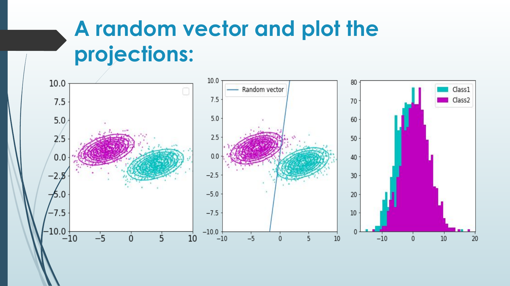

### Extracted Slide Text

- A random vector and plot the
- projections:

### Page Description And Teaching Notes

Slide type: title or transition slide.
Main idea: projections:.
This page sets the context for the next topic. Treat it as a section marker: it tells the learner what concept or unit is starting before the deck moves into definitions, examples, or formulas.
Detailed page understanding:
- `projections:` is a core visible point. Explain what it means, why it matters, and how it connects to the slide title.
Visual/layout description: the embedded image preserves the actual slide. Describe the title area first, then read bullets, formulas, tables, arrows, grouped boxes, or diagrams in their visible order. If the slide contains a diagram, explain the relationship shown by arrows/positioning before explaining the text labels.
Teaching note: after reading the slide, ask the learner to restate the page in one or two sentences and give one example. For formula or metric slides, also ask what each variable or metric means and when it should be used.
Exam/viva note: prepare the slide title as a short-answer question, then use the bullets or visual labels as the expected answer points.

## Page 150: For fully separate them, Fisher’s linear discriminant

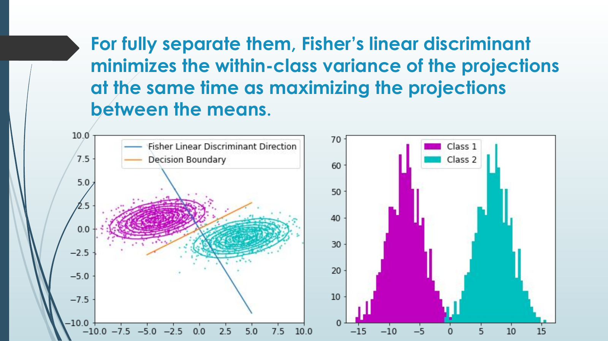

### Extracted Slide Text

- For fully separate them, Fisher’s linear discriminant
- minimizes the within-class variance of the projections
- at the same time as maximizing the projections
- between the means.

### Page Description And Teaching Notes

Slide type: concept explanation slide.
Main idea: minimizes the within-class variance of the projections at the same time as maximizing the projections between the means.
This page explains a core concept in prose. The main task is to convert the definition into a clear statement of what the concept is, why it is used, and where it appears in a machine-learning workflow.
Detailed page understanding:
- `minimizes the within-class variance of the projections` is a core visible point. Explain what it means, why it matters, and how it connects to the slide title.
- `at the same time as maximizing the projections` is a core visible point. Explain what it means, why it matters, and how it connects to the slide title.
- `between the means.` is a core visible point. Explain what it means, why it matters, and how it connects to the slide title.
Important visible terms: For, Fisher.
Visual/layout description: the embedded image preserves the actual slide. Describe the title area first, then read bullets, formulas, tables, arrows, grouped boxes, or diagrams in their visible order. If the slide contains a diagram, explain the relationship shown by arrows/positioning before explaining the text labels.
Teaching note: after reading the slide, ask the learner to restate the page in one or two sentences and give one example. For formula or metric slides, also ask what each variable or metric means and when it should be used.
Exam/viva note: prepare the slide title as a short-answer question, then use the bullets or visual labels as the expected answer points.

## Page 151: GOAL OF FDA:

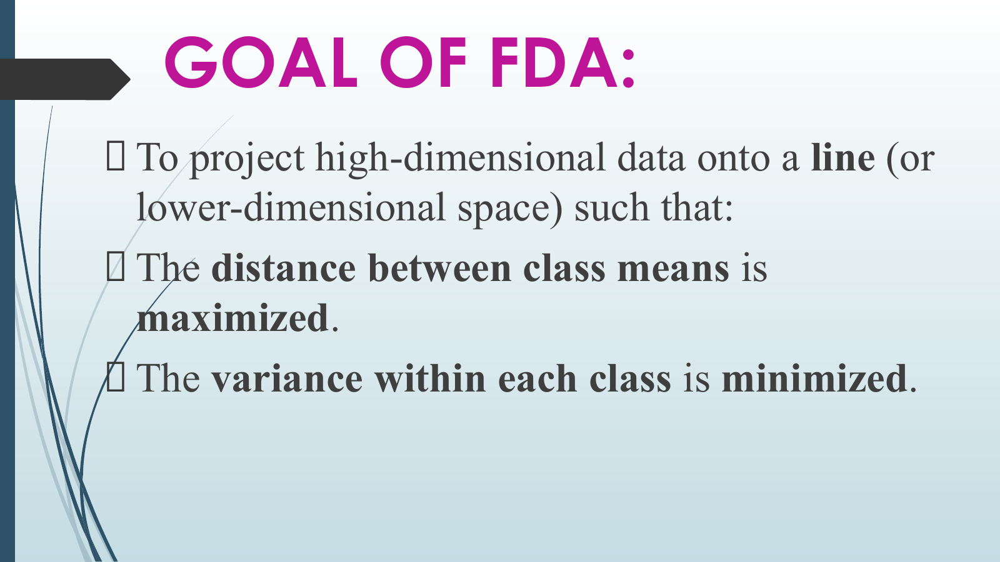

### Extracted Slide Text

- GOAL OF FDA:
- To project high-dimensional data onto a line (or
- lower-dimensional space) such that:
- The distance between class means is
- maximized.
- The variance within each class is minimized.

### Page Description And Teaching Notes

Slide type: concept explanation slide.
Main idea: To project high-dimensional data onto a line (or lower-dimensional space) such that: The distance between class means is maximized. The variance within each class is minimized.
This page explains a core concept in prose. The main task is to convert the definition into a clear statement of what the concept is, why it is used, and where it appears in a machine-learning workflow.
Detailed page understanding:
- `To project high-dimensional data onto a line (or` is a core visible point. Explain what it means, why it matters, and how it connects to the slide title.
- `lower-dimensional space) such that:` is a core visible point. Explain what it means, why it matters, and how it connects to the slide title.
- `The distance between class means is` is a core visible point. Explain what it means, why it matters, and how it connects to the slide title.
- `maximized.` is a core visible point. Explain what it means, why it matters, and how it connects to the slide title.
- `The variance within each class is minimized.` is a core visible point. Explain what it means, why it matters, and how it connects to the slide title.
Important visible terms: GOAL OF FDA, The.
Visual/layout description: the embedded image preserves the actual slide. Describe the title area first, then read bullets, formulas, tables, arrows, grouped boxes, or diagrams in their visible order. If the slide contains a diagram, explain the relationship shown by arrows/positioning before explaining the text labels.
Teaching note: after reading the slide, ask the learner to restate the page in one or two sentences and give one example. For formula or metric slides, also ask what each variable or metric means and when it should be used.
Exam/viva note: prepare the slide title as a short-answer question, then use the bullets or visual labels as the expected answer points.

## Page 152: Difference between FDA and PCA

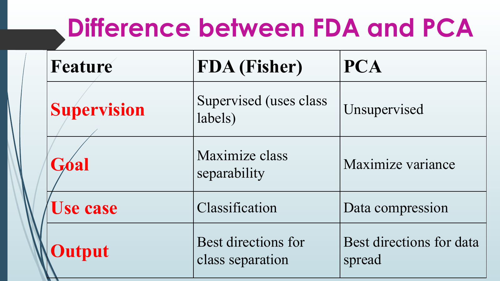

### Extracted Slide Text

- Difference between FDA and PCA
- Feature FDA (Fisher) PCA
- Supervised (uses class
- Supervision labels)
- Unsupervised
- Maximize class
- Goal separability
- Maximize variance
- Use case Classification Data compression
- Best directions for Best directions for data
- Output class separation spread

### Page Description And Teaching Notes

Slide type: concept explanation slide.
Main idea: Feature FDA (Fisher) PCA Supervised (uses class Supervision labels) Unsupervised Maximize class Goal separability.
This page explains a core concept in prose. The main task is to convert the definition into a clear statement of what the concept is, why it is used, and where it appears in a machine-learning workflow.
Detailed page understanding:
- `Feature FDA (Fisher) PCA` is a core visible point. Explain what it means, why it matters, and how it connects to the slide title.
- `Supervised (uses class` is an application/example point. Convert it into a concrete real-world case while teaching.
- `Supervision labels)` is a core visible point. Explain what it means, why it matters, and how it connects to the slide title.
- `Unsupervised` is a core visible point. Explain what it means, why it matters, and how it connects to the slide title.
- `Maximize class` is a core visible point. Explain what it means, why it matters, and how it connects to the slide title.
- `Goal separability` is a core visible point. Explain what it means, why it matters, and how it connects to the slide title.
- `Maximize variance` is a core visible point. Explain what it means, why it matters, and how it connects to the slide title.
- `Use case Classification Data compression` is an application/example point. Convert it into a concrete real-world case while teaching.
- `Best directions for Best directions for data` is a core visible point. Explain what it means, why it matters, and how it connects to the slide title.
- `Output class separation spread` is a core visible point. Explain what it means, why it matters, and how it connects to the slide title.
Important visible terms: Difference, FDA, PCA Feature FDA, Fisher, PCA Supervised, Supervision, Unsupervised Maximize, Goal.
Visual/layout description: the embedded image preserves the actual slide. Describe the title area first, then read bullets, formulas, tables, arrows, grouped boxes, or diagrams in their visible order. If the slide contains a diagram, explain the relationship shown by arrows/positioning before explaining the text labels.
Teaching note: after reading the slide, ask the learner to restate the page in one or two sentences and give one example. For formula or metric slides, also ask what each variable or metric means and when it should be used.
Exam/viva note: prepare the slide title as a short-answer question, then use the bullets or visual labels as the expected answer points.

## Page 153: How does LDA compare to other

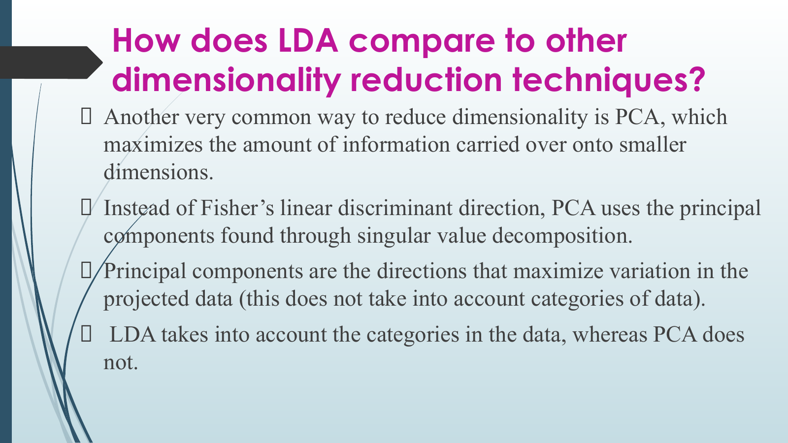

### Extracted Slide Text

- How does LDA compare to other
- dimensionality reduction techniques?
- Another very common way to reduce dimensionality is PCA, which
- maximizes the amount of information carried over onto smaller
- dimensions.
- Instead of Fisher’s linear discriminant direction, PCA uses the principal
- components found through singular value decomposition.
- Principal components are the directions that maximize variation in the
- projected data (this does not take into account categories of data).
- LDA takes into account the categories in the data, whereas PCA does
- not.

### Page Description And Teaching Notes

Slide type: concept explanation slide.
Main idea: dimensionality reduction techniques? Another very common way to reduce dimensionality is PCA, which maximizes the amount of information carried over onto smaller dimensions. Instead of Fisher’s linear discriminant direction, PCA uses the principal components found through singular value decomposition.
This page explains a core concept in prose. The main task is to convert the definition into a clear statement of what the concept is, why it is used, and where it appears in a machine-learning workflow.
Detailed page understanding:
- `dimensionality reduction techniques?` is a core visible point. Explain what it means, why it matters, and how it connects to the slide title.
- `Another very common way to reduce dimensionality is PCA, which` is a core visible point. Explain what it means, why it matters, and how it connects to the slide title.
- `maximizes the amount of information carried over onto smaller` is a core visible point. Explain what it means, why it matters, and how it connects to the slide title.
- `dimensions.` is a core visible point. Explain what it means, why it matters, and how it connects to the slide title.
- `Instead of Fisher’s linear discriminant direction, PCA uses the principal` is an application/example point. Convert it into a concrete real-world case while teaching.
- `components found through singular value decomposition.` is a core visible point. Explain what it means, why it matters, and how it connects to the slide title.
- `Principal components are the directions that maximize variation in the` is a core visible point. Explain what it means, why it matters, and how it connects to the slide title.
- `projected data (this does not take into account categories of data).` is a core visible point. Explain what it means, why it matters, and how it connects to the slide title.
- `LDA takes into account the categories in the data, whereas PCA does` is a core visible point. Explain what it means, why it matters, and how it connects to the slide title.
- `not.` is a core visible point. Explain what it means, why it matters, and how it connects to the slide title.
Important visible terms: How, LDA, Another, PCA, Instead, Fisher, Principal.
Visual/layout description: the embedded image preserves the actual slide. Describe the title area first, then read bullets, formulas, tables, arrows, grouped boxes, or diagrams in their visible order. If the slide contains a diagram, explain the relationship shown by arrows/positioning before explaining the text labels.
Teaching note: after reading the slide, ask the learner to restate the page in one or two sentences and give one example. For formula or metric slides, also ask what each variable or metric means and when it should be used.
Exam/viva note: prepare the slide title as a short-answer question, then use the bullets or visual labels as the expected answer points.
