# Unit II - Supervised Learning (Full Deck)

Source PDF: `ml class/ML_UNIT-2 Supervised Learning.pptx (1).pdf`
Total pages: 101

These notes are written page by page. Every page includes the rendered slide image as visual output, the extracted text, and a detailed explanation of how to read the slide.

## Page 1: UNIT-II SUPERVISED

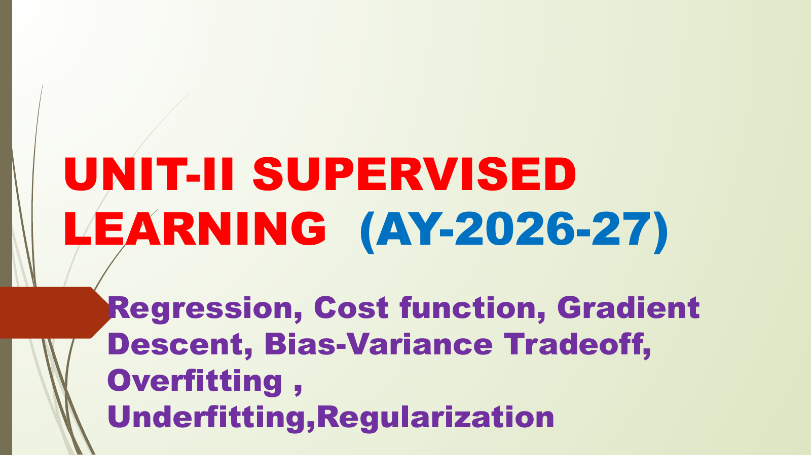

### Extracted Slide Text

- UNIT-II SUPERVISED
- LEARNING (AY-2026-27)
- Regression, Cost function, Gradient
- Descent, Bias-Variance Tradeoff,
- Overfitting ,
- Underfitting,Regularization

### Page Description And Teaching Notes

Slide type: formula or calculation slide.
Main idea: LEARNING (AY-2026-27) Regression, Cost function, Gradient Descent, Bias-Variance Tradeoff, Overfitting , Underfitting,Regularization.
This page should be read carefully because it introduces a calculation, objective, or optimization idea. Identify the variables in the formula, what quantity is being minimized or measured, and how the equation supports model training or evaluation.
Detailed page understanding:
- `LEARNING (AY-2026-27)` is a core visible point. Explain what it means, why it matters, and how it connects to the slide title.
- `Regression, Cost function, Gradient` is a core visible point. Explain what it means, why it matters, and how it connects to the slide title.
- `Descent, Bias-Variance Tradeoff,` is a core visible point. Explain what it means, why it matters, and how it connects to the slide title.
- `Overfitting ,` is a core visible point. Explain what it means, why it matters, and how it connects to the slide title.
- `Underfitting,Regularization` is a core visible point. Explain what it means, why it matters, and how it connects to the slide title.
Important visible terms: UNIT-II SUPERVISED LEARNING, AY-2026-27, Regression, Cost, Gradient Descent, Bias-Variance Tradeoff, Overfitting, Underfitting.
Visual/layout description: the embedded image preserves the actual slide. Describe the title area first, then read bullets, formulas, tables, arrows, grouped boxes, or diagrams in their visible order. If the slide contains a diagram, explain the relationship shown by arrows/positioning before explaining the text labels.
Teaching note: after reading the slide, ask the learner to restate the page in one or two sentences and give one example. For formula or metric slides, also ask what each variable or metric means and when it should be used.
Exam/viva note: prepare the slide title as a short-answer question, then use the bullets or visual labels as the expected answer points.

## Page 2: Regression

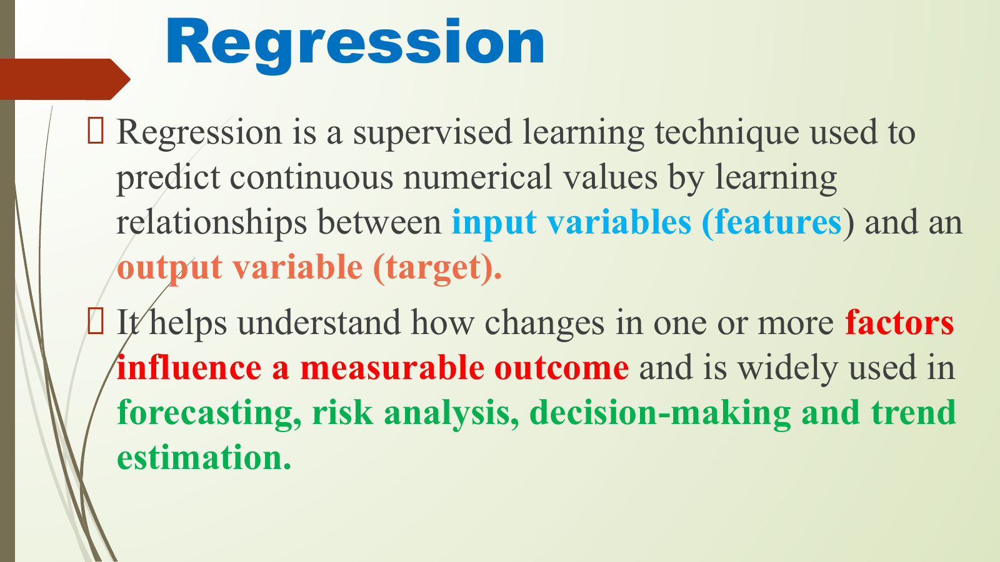

### Extracted Slide Text

- Regression
- Regression is a supervised learning technique used to
- predict continuous numerical values by learning
- relationships between input variables (features) and an
- output variable (target).
- It helps understand how changes in one or more factors
- influence a measurable outcome and is widely used in
- forecasting, risk analysis, decision-making and trend
- estimation.

### Page Description And Teaching Notes

Slide type: concept explanation slide.
Main idea: Regression is a supervised learning technique used to predict continuous numerical values by learning relationships between input variables (features) and an output variable (target). It helps understand how changes in one or more factors influence a measurable outcome and is widely used in.
This page explains a core concept in prose. The main task is to convert the definition into a clear statement of what the concept is, why it is used, and where it appears in a machine-learning workflow.
Detailed page understanding:
- `Regression is a supervised learning technique used to` gives the definition-level meaning. Explain it first in simple words, then connect it to how a model learns from data.
- `predict continuous numerical values by learning` is a core visible point. Explain what it means, why it matters, and how it connects to the slide title.
- `relationships between input variables (features) and an` is a core visible point. Explain what it means, why it matters, and how it connects to the slide title.
- `output variable (target).` is a core visible point. Explain what it means, why it matters, and how it connects to the slide title.
- `It helps understand how changes in one or more factors` states a benefit. Use it to justify why this method or concept is useful in a machine-learning workflow.
- `influence a measurable outcome and is widely used in` is an application/example point. Convert it into a concrete real-world case while teaching.
- `forecasting, risk analysis, decision-making and trend` is a core visible point. Explain what it means, why it matters, and how it connects to the slide title.
- `estimation.` is a core visible point. Explain what it means, why it matters, and how it connects to the slide title.
Important visible terms: Regression Regression.
Visual/layout description: the embedded image preserves the actual slide. Describe the title area first, then read bullets, formulas, tables, arrows, grouped boxes, or diagrams in their visible order. If the slide contains a diagram, explain the relationship shown by arrows/positioning before explaining the text labels.
Teaching note: after reading the slide, ask the learner to restate the page in one or two sentences and give one example. For formula or metric slides, also ask what each variable or metric means and when it should be used.
Exam/viva note: prepare the slide title as a short-answer question, then use the bullets or visual labels as the expected answer points.

## Page 3: How and where it

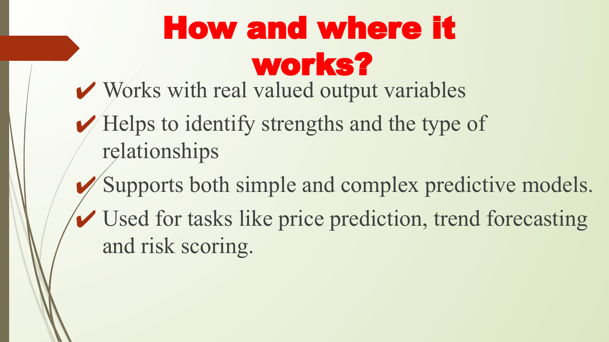

### Extracted Slide Text

- How and where it
- works?
- ✔ Works with real valued output variables
- ✔ Helps to identify strengths and the type of
- relationships
- ✔ Supports both simple and complex predictive models.
- ✔ Used for tasks like price prediction, trend forecasting
- and risk scoring.

### Page Description And Teaching Notes

Slide type: bullet explanation slide.
Main idea: works? ✔ Works with real valued output variables ✔ Helps to identify strengths and the type of relationships ✔ Supports both simple and complex predictive models. ✔ Used for tasks like price prediction, trend forecasting.
This page breaks the topic into separate points. Each bullet should be treated as a distinct exam or viva talking point, with the learner able to define it and give a small example.
Detailed page understanding:
- `works?` is a core visible point. Explain what it means, why it matters, and how it connects to the slide title.
- `✔ Works with real valued output variables` is one item in the slide's list. Treat it as a separate subtopic and prepare a one-line explanation for it.
- `✔ Helps to identify strengths and the type of` states a benefit. Use it to justify why this method or concept is useful in a machine-learning workflow.
- `relationships` is a core visible point. Explain what it means, why it matters, and how it connects to the slide title.
- `✔ Supports both simple and complex predictive models.` states a benefit. Use it to justify why this method or concept is useful in a machine-learning workflow.
- `✔ Used for tasks like price prediction, trend forecasting` is an application/example point. Convert it into a concrete real-world case while teaching.
- `and risk scoring.` is a core visible point. Explain what it means, why it matters, and how it connects to the slide title.
Important visible terms: How, Works, Helps, Supports, Used.
Visual/layout description: the embedded image preserves the actual slide. Describe the title area first, then read bullets, formulas, tables, arrows, grouped boxes, or diagrams in their visible order. If the slide contains a diagram, explain the relationship shown by arrows/positioning before explaining the text labels.
Teaching note: after reading the slide, ask the learner to restate the page in one or two sentences and give one example. For formula or metric slides, also ask what each variable or metric means and when it should be used.
Exam/viva note: prepare the slide title as a short-answer question, then use the bullets or visual labels as the expected answer points.

## Page 4: Types of Regression

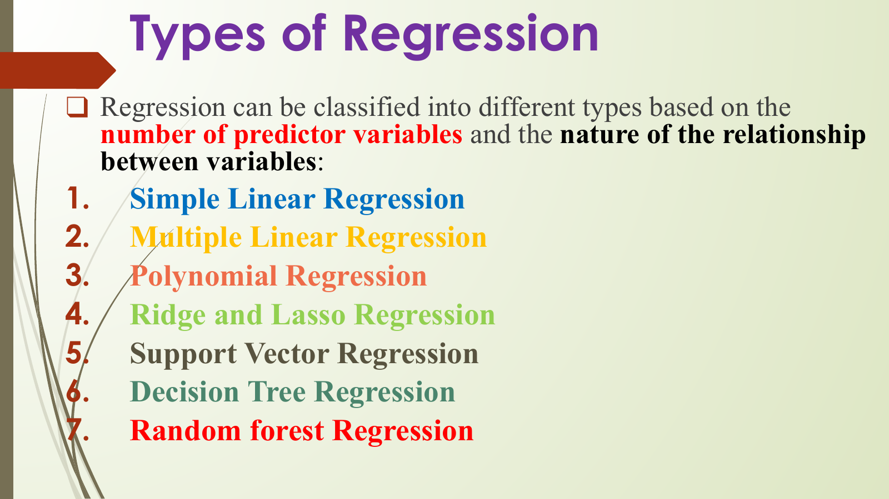

### Extracted Slide Text

- Types of Regression
- ❑ Regression can be classified into different types based on the
- number of predictor variables and the nature of the relationship
- between variables:
- 1. Simple Linear Regression
- 2. Multiple Linear Regression
- 3. Polynomial Regression
- 4. Ridge and Lasso Regression
- 5. Support Vector Regression
- 6. Decision Tree Regression
- 7. Random forest Regression

### Page Description And Teaching Notes

Slide type: bullet explanation slide.
Main idea: ❑ Regression can be classified into different types based on the number of predictor variables and the nature of the relationship between variables: 1. Simple Linear Regression 2. Multiple Linear Regression 3. Polynomial Regression.
This page breaks the topic into separate points. Each bullet should be treated as a distinct exam or viva talking point, with the learner able to define it and give a small example.
Detailed page understanding:
- `❑ Regression can be classified into different types based on the` is one item in the slide's list. Treat it as a separate subtopic and prepare a one-line explanation for it.
- `number of predictor variables and the nature of the relationship` is a core visible point. Explain what it means, why it matters, and how it connects to the slide title.
- `between variables:` is a core visible point. Explain what it means, why it matters, and how it connects to the slide title.
- `1. Simple Linear Regression` is one item in the slide's list. Treat it as a separate subtopic and prepare a one-line explanation for it.
- `2. Multiple Linear Regression` is one item in the slide's list. Treat it as a separate subtopic and prepare a one-line explanation for it.
- `3. Polynomial Regression` is one item in the slide's list. Treat it as a separate subtopic and prepare a one-line explanation for it.
- `4. Ridge and Lasso Regression` is one item in the slide's list. Treat it as a separate subtopic and prepare a one-line explanation for it.
- `5. Support Vector Regression` is one item in the slide's list. Treat it as a separate subtopic and prepare a one-line explanation for it.
- `6. Decision Tree Regression` is one item in the slide's list. Treat it as a separate subtopic and prepare a one-line explanation for it.
- `7. Random forest Regression` is one item in the slide's list. Treat it as a separate subtopic and prepare a one-line explanation for it.
Important visible terms: Types, Regression, Simple Linear Regression, Multiple Linear Regression, Polynomial Regression, Ridge, Lasso Regression, Support Vector Regression.
Visual/layout description: the embedded image preserves the actual slide. Describe the title area first, then read bullets, formulas, tables, arrows, grouped boxes, or diagrams in their visible order. If the slide contains a diagram, explain the relationship shown by arrows/positioning before explaining the text labels.
Teaching note: after reading the slide, ask the learner to restate the page in one or two sentences and give one example. For formula or metric slides, also ask what each variable or metric means and when it should be used.
Exam/viva note: prepare the slide title as a short-answer question, then use the bullets or visual labels as the expected answer points.

## Page 5: 1. Simple Linear Regression

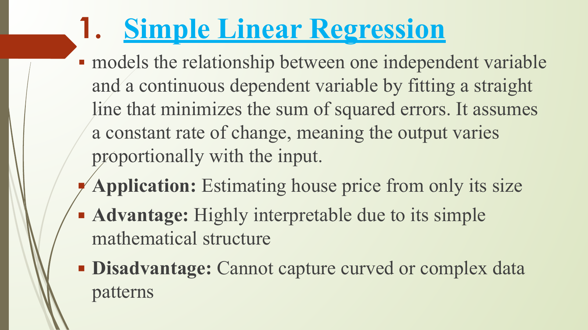

### Extracted Slide Text

- 1. Simple Linear Regression
- ▪ models the relationship between one independent variable
- and a continuous dependent variable by fitting a straight
- line that minimizes the sum of squared errors. It assumes
- a constant rate of change, meaning the output varies
- proportionally with the input.
- ▪ Application: Estimating house price from only its size
- ▪ Advantage: Highly interpretable due to its simple
- mathematical structure
- ▪ Disadvantage: Cannot capture curved or complex data
- patterns

### Page Description And Teaching Notes

Slide type: metric/table slide.
Main idea: ▪ models the relationship between one independent variable and a continuous dependent variable by fitting a straight line that minimizes the sum of squared errors. It assumes a constant rate of change, meaning the output varies proportionally with the input. ▪ Application: Estimating house price from only its size.
This page organizes evaluation or comparison information. Focus on what each metric measures, when it is useful, and what mistake it prevents when judging a machine-learning model.
Detailed page understanding:
- `▪ models the relationship between one independent variable` is one item in the slide's list. Treat it as a separate subtopic and prepare a one-line explanation for it.
- `and a continuous dependent variable by fitting a straight` is a core visible point. Explain what it means, why it matters, and how it connects to the slide title.
- `line that minimizes the sum of squared errors. It assumes` is a limitation or risk. Mention when the method may fail and what alternative or precaution can reduce the issue.
- `a constant rate of change, meaning the output varies` is a core visible point. Explain what it means, why it matters, and how it connects to the slide title.
- `proportionally with the input.` is a core visible point. Explain what it means, why it matters, and how it connects to the slide title.
- `▪ Application: Estimating house price from only its size` is an application/example point. Convert it into a concrete real-world case while teaching.
- `▪ Advantage: Highly interpretable due to its simple` states a benefit. Use it to justify why this method or concept is useful in a machine-learning workflow.
- `mathematical structure` is a core visible point. Explain what it means, why it matters, and how it connects to the slide title.
- `▪ Disadvantage: Cannot capture curved or complex data` states a benefit. Use it to justify why this method or concept is useful in a machine-learning workflow.
- `patterns` is a core visible point. Explain what it means, why it matters, and how it connects to the slide title.
Important visible terms: Simple Linear Regression, Application, Estimating, Advantage, Highly, Disadvantage, Cannot.
Visual/layout description: the embedded image preserves the actual slide. Describe the title area first, then read bullets, formulas, tables, arrows, grouped boxes, or diagrams in their visible order. If the slide contains a diagram, explain the relationship shown by arrows/positioning before explaining the text labels.
Teaching note: after reading the slide, ask the learner to restate the page in one or two sentences and give one example. For formula or metric slides, also ask what each variable or metric means and when it should be used.
Exam/viva note: prepare the slide title as a short-answer question, then use the bullets or visual labels as the expected answer points.

## Page 6: Gradient Descent for Convex

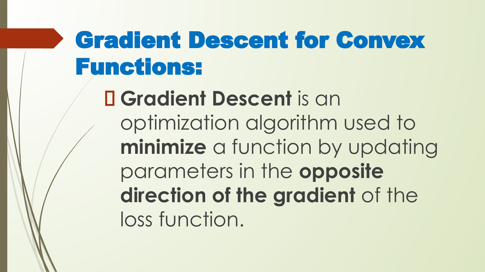

### Extracted Slide Text

- Gradient Descent for Convex
- Functions:
- Gradient Descent is an
- optimization algorithm used to
- minimize a function by updating
- parameters in the opposite
- direction of the gradient of the
- loss function.

### Page Description And Teaching Notes

Slide type: concept explanation slide.
Main idea: Functions: Gradient Descent is an optimization algorithm used to minimize a function by updating parameters in the opposite direction of the gradient of the.
This page explains a core concept in prose. The main task is to convert the definition into a clear statement of what the concept is, why it is used, and where it appears in a machine-learning workflow.
Detailed page understanding:
- `Functions:` is a core visible point. Explain what it means, why it matters, and how it connects to the slide title.
- `Gradient Descent is an` gives the definition-level meaning. Explain it first in simple words, then connect it to how a model learns from data.
- `optimization algorithm used to` is an application/example point. Convert it into a concrete real-world case while teaching.
- `minimize a function by updating` is a core visible point. Explain what it means, why it matters, and how it connects to the slide title.
- `parameters in the opposite` is a core visible point. Explain what it means, why it matters, and how it connects to the slide title.
- `direction of the gradient of the` is a core visible point. Explain what it means, why it matters, and how it connects to the slide title.
- `loss function.` is a core visible point. Explain what it means, why it matters, and how it connects to the slide title.
Important visible terms: Gradient Descent, Convex Functions.
Visual/layout description: the embedded image preserves the actual slide. Describe the title area first, then read bullets, formulas, tables, arrows, grouped boxes, or diagrams in their visible order. If the slide contains a diagram, explain the relationship shown by arrows/positioning before explaining the text labels.
Teaching note: after reading the slide, ask the learner to restate the page in one or two sentences and give one example. For formula or metric slides, also ask what each variable or metric means and when it should be used.
Exam/viva note: prepare the slide title as a short-answer question, then use the bullets or visual labels as the expected answer points.

## Page 7: Gradient Descent is an optimization

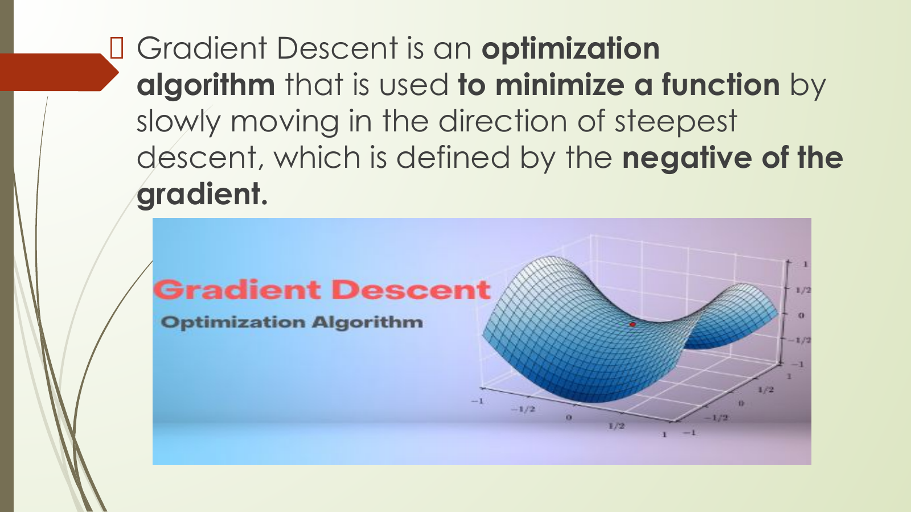

### Extracted Slide Text

- Gradient Descent is an optimization
- algorithm that is used to minimize a function by
- slowly moving in the direction of steepest
- descent, which is defined by the negative of the
- gradient.

### Page Description And Teaching Notes

Slide type: concept explanation slide.
Main idea: algorithm that is used to minimize a function by slowly moving in the direction of steepest descent, which is defined by the negative of the gradient.
This page explains a core concept in prose. The main task is to convert the definition into a clear statement of what the concept is, why it is used, and where it appears in a machine-learning workflow.
Detailed page understanding:
- `algorithm that is used to minimize a function by` is an application/example point. Convert it into a concrete real-world case while teaching.
- `slowly moving in the direction of steepest` is a core visible point. Explain what it means, why it matters, and how it connects to the slide title.
- `descent, which is defined by the negative of the` is a core visible point. Explain what it means, why it matters, and how it connects to the slide title.
- `gradient.` is a core visible point. Explain what it means, why it matters, and how it connects to the slide title.
Important visible terms: Gradient Descent.
Visual/layout description: the embedded image preserves the actual slide. Describe the title area first, then read bullets, formulas, tables, arrows, grouped boxes, or diagrams in their visible order. If the slide contains a diagram, explain the relationship shown by arrows/positioning before explaining the text labels.
Teaching note: after reading the slide, ask the learner to restate the page in one or two sentences and give one example. For formula or metric slides, also ask what each variable or metric means and when it should be used.
Exam/viva note: prepare the slide title as a short-answer question, then use the bullets or visual labels as the expected answer points.

## Page 8: Types of Gradient

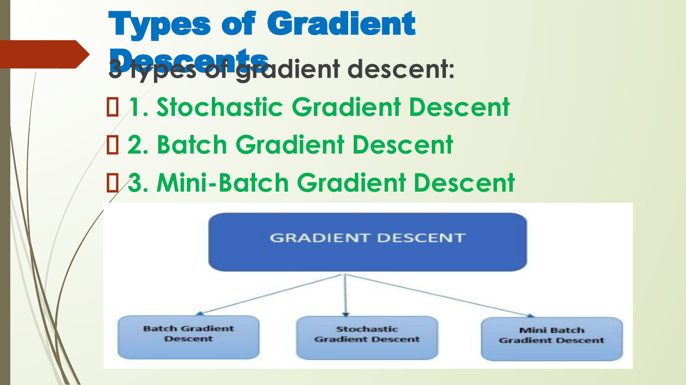

### Extracted Slide Text

- Types of Gradient
- Descents
- 3 types of gradient descent:
- 1. Stochastic Gradient Descent
- 2. Batch Gradient Descent
- 3. Mini-Batch Gradient Descent

### Page Description And Teaching Notes

Slide type: bullet explanation slide.
Main idea: Descents 3 types of gradient descent: 1. Stochastic Gradient Descent 2. Batch Gradient Descent 3. Mini-Batch Gradient Descent.
This page breaks the topic into separate points. Each bullet should be treated as a distinct exam or viva talking point, with the learner able to define it and give a small example.
Detailed page understanding:
- `Descents` is a core visible point. Explain what it means, why it matters, and how it connects to the slide title.
- `3 types of gradient descent:` is a core visible point. Explain what it means, why it matters, and how it connects to the slide title.
- `1. Stochastic Gradient Descent` is one item in the slide's list. Treat it as a separate subtopic and prepare a one-line explanation for it.
- `2. Batch Gradient Descent` is one item in the slide's list. Treat it as a separate subtopic and prepare a one-line explanation for it.
- `3. Mini-Batch Gradient Descent` is one item in the slide's list. Treat it as a separate subtopic and prepare a one-line explanation for it.
Important visible terms: Types, Gradient Descents, Stochastic Gradient Descent, Batch Gradient Descent, Mini-Batch Gradient Descent.
Visual/layout description: the embedded image preserves the actual slide. Describe the title area first, then read bullets, formulas, tables, arrows, grouped boxes, or diagrams in their visible order. If the slide contains a diagram, explain the relationship shown by arrows/positioning before explaining the text labels.
Teaching note: after reading the slide, ask the learner to restate the page in one or two sentences and give one example. For formula or metric slides, also ask what each variable or metric means and when it should be used.
Exam/viva note: prepare the slide title as a short-answer question, then use the bullets or visual labels as the expected answer points.

## Page 9: Stochastic Gradient Descent — in extreme cases,

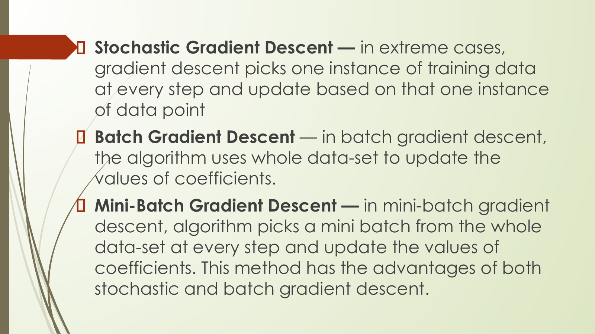

### Extracted Slide Text

- Stochastic Gradient Descent — in extreme cases,
- gradient descent picks one instance of training data
- at every step and update based on that one instance
- of data point
- Batch Gradient Descent — in batch gradient descent,
- the algorithm uses whole data-set to update the
- values of coefficients.
- Mini-Batch Gradient Descent — in mini-batch gradient
- descent, algorithm picks a mini batch from the whole
- data-set at every step and update the values of
- coefficients. This method has the advantages of both
- stochastic and batch gradient descent.

### Page Description And Teaching Notes

Slide type: concept explanation slide.
Main idea: gradient descent picks one instance of training data at every step and update based on that one instance of data point Batch Gradient Descent — in batch gradient descent, the algorithm uses whole data-set to update the values of coefficients.
This page explains a core concept in prose. The main task is to convert the definition into a clear statement of what the concept is, why it is used, and where it appears in a machine-learning workflow.
Detailed page understanding:
- `gradient descent picks one instance of training data` is a core visible point. Explain what it means, why it matters, and how it connects to the slide title.
- `at every step and update based on that one instance` is a core visible point. Explain what it means, why it matters, and how it connects to the slide title.
- `of data point` is a core visible point. Explain what it means, why it matters, and how it connects to the slide title.
- `Batch Gradient Descent — in batch gradient descent,` is a core visible point. Explain what it means, why it matters, and how it connects to the slide title.
- `the algorithm uses whole data-set to update the` is an application/example point. Convert it into a concrete real-world case while teaching.
- `values of coefficients.` is a core visible point. Explain what it means, why it matters, and how it connects to the slide title.
- `Mini-Batch Gradient Descent — in mini-batch gradient` is a core visible point. Explain what it means, why it matters, and how it connects to the slide title.
- `descent, algorithm picks a mini batch from the whole` is a core visible point. Explain what it means, why it matters, and how it connects to the slide title.
- Additional bullets continue on the slide; use the extracted text list above for the complete wording.
- `stochastic and batch gradient descent.` is a core visible point. Explain what it means, why it matters, and how it connects to the slide title.
Important visible terms: Stochastic Gradient Descent, Batch Gradient Descent, Mini-Batch Gradient Descent, This.
Visual/layout description: the embedded image preserves the actual slide. Describe the title area first, then read bullets, formulas, tables, arrows, grouped boxes, or diagrams in their visible order. If the slide contains a diagram, explain the relationship shown by arrows/positioning before explaining the text labels.
Teaching note: after reading the slide, ask the learner to restate the page in one or two sentences and give one example. For formula or metric slides, also ask what each variable or metric means and when it should be used.
Exam/viva note: prepare the slide title as a short-answer question, then use the bullets or visual labels as the expected answer points.

## Page 10: Different Types of Gradient Descent

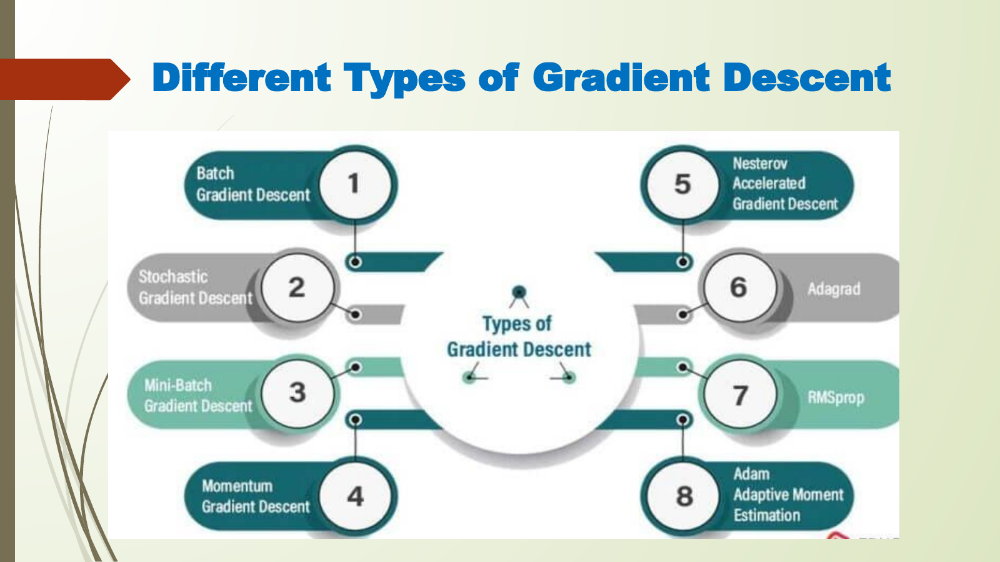

### Extracted Slide Text

- Different Types of Gradient Descent

### Page Description And Teaching Notes

Slide type: title or transition slide.
Main idea: the slide is visual-first, so the image should be treated as the source for the content and structure.
This page sets the context for the next topic. Treat it as a section marker: it tells the learner what concept or unit is starting before the deck moves into definitions, examples, or formulas.
- No reliable selectable text was extracted; use the slide image for the visible diagram, chart, or screenshot.
Important visible terms: Different Types, Gradient Descent.
Visual/layout description: the embedded image preserves the actual slide. Describe the title area first, then read bullets, formulas, tables, arrows, grouped boxes, or diagrams in their visible order. If the slide contains a diagram, explain the relationship shown by arrows/positioning before explaining the text labels.
Teaching note: after reading the slide, ask the learner to restate the page in one or two sentences and give one example. For formula or metric slides, also ask what each variable or metric means and when it should be used.
Exam/viva note: prepare the slide title as a short-answer question, then use the bullets or visual labels as the expected answer points.

## Page 11: Unit II - Supervised Learning (Full Deck) Page 11

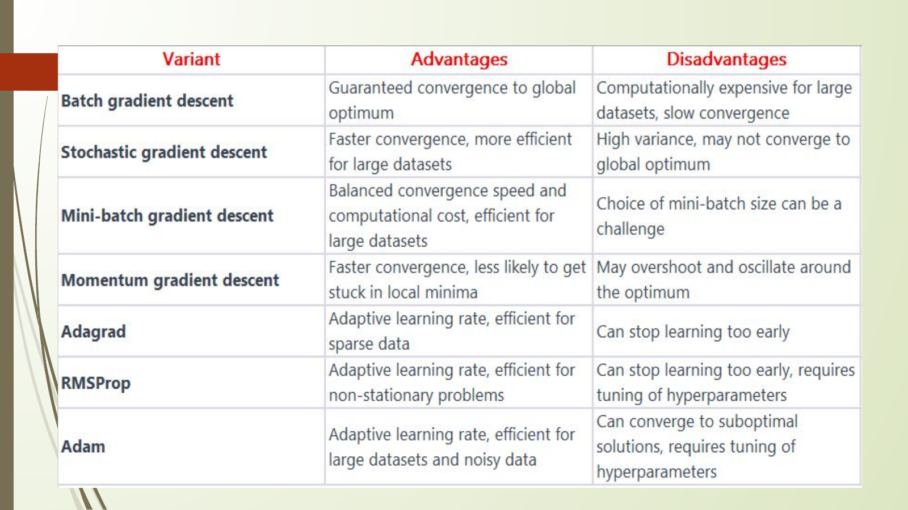

### Extracted Slide Text

- No selectable text extracted from this page.

### Page Description And Teaching Notes

Slide type: visual-only or image-heavy slide.
Main idea: the slide is visual-first, so the image should be treated as the source for the content and structure.
This page is primarily visual. The embedded slide image is the authoritative visual output; read it as a diagram or illustration first, then connect any visible labels to the surrounding pages.
- No reliable selectable text was extracted; use the slide image for the visible diagram, chart, or screenshot.
Visual/layout description: the embedded image preserves the actual slide. Describe the title area first, then read bullets, formulas, tables, arrows, grouped boxes, or diagrams in their visible order. If the slide contains a diagram, explain the relationship shown by arrows/positioning before explaining the text labels.
Teaching note: after reading the slide, ask the learner to restate the page in one or two sentences and give one example. For formula or metric slides, also ask what each variable or metric means and when it should be used.
Exam/viva note: prepare the slide title as a short-answer question, then use the bullets or visual labels as the expected answer points.

## Page 12: Unit II - Supervised Learning (Full Deck) Page 12

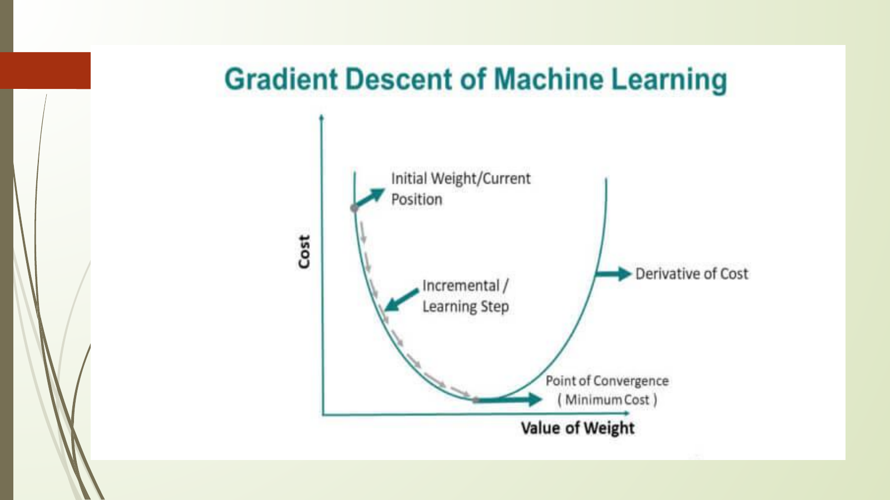

### Extracted Slide Text

- No selectable text extracted from this page.

### Page Description And Teaching Notes

Slide type: visual-only or image-heavy slide.
Main idea: the slide is visual-first, so the image should be treated as the source for the content and structure.
This page is primarily visual. The embedded slide image is the authoritative visual output; read it as a diagram or illustration first, then connect any visible labels to the surrounding pages.
- No reliable selectable text was extracted; use the slide image for the visible diagram, chart, or screenshot.
Visual/layout description: the embedded image preserves the actual slide. Describe the title area first, then read bullets, formulas, tables, arrows, grouped boxes, or diagrams in their visible order. If the slide contains a diagram, explain the relationship shown by arrows/positioning before explaining the text labels.
Teaching note: after reading the slide, ask the learner to restate the page in one or two sentences and give one example. For formula or metric slides, also ask what each variable or metric means and when it should be used.
Exam/viva note: prepare the slide title as a short-answer question, then use the bullets or visual labels as the expected answer points.

## Page 13: What is Convex Function?

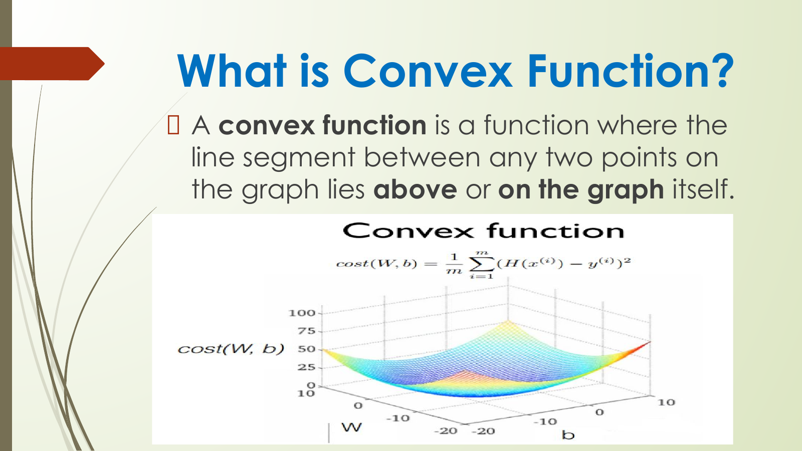

### Extracted Slide Text

- What is Convex Function?
- A convex function is a function where the
- line segment between any two points on
- the graph lies above or on the graph itself.

### Page Description And Teaching Notes

Slide type: concept explanation slide.
Main idea: A convex function is a function where the line segment between any two points on the graph lies above or on the graph itself.
This page explains a core concept in prose. The main task is to convert the definition into a clear statement of what the concept is, why it is used, and where it appears in a machine-learning workflow.
Detailed page understanding:
- `A convex function is a function where the` gives the definition-level meaning. Explain it first in simple words, then connect it to how a model learns from data.
- `line segment between any two points on` is a core visible point. Explain what it means, why it matters, and how it connects to the slide title.
- `the graph lies above or on the graph itself.` is a core visible point. Explain what it means, why it matters, and how it connects to the slide title.
Important visible terms: What, Convex Function.
Visual/layout description: the embedded image preserves the actual slide. Describe the title area first, then read bullets, formulas, tables, arrows, grouped boxes, or diagrams in their visible order. If the slide contains a diagram, explain the relationship shown by arrows/positioning before explaining the text labels.
Teaching note: after reading the slide, ask the learner to restate the page in one or two sentences and give one example. For formula or metric slides, also ask what each variable or metric means and when it should be used.
Exam/viva note: prepare the slide title as a short-answer question, then use the bullets or visual labels as the expected answer points.

## Page 14: Properties of Convex

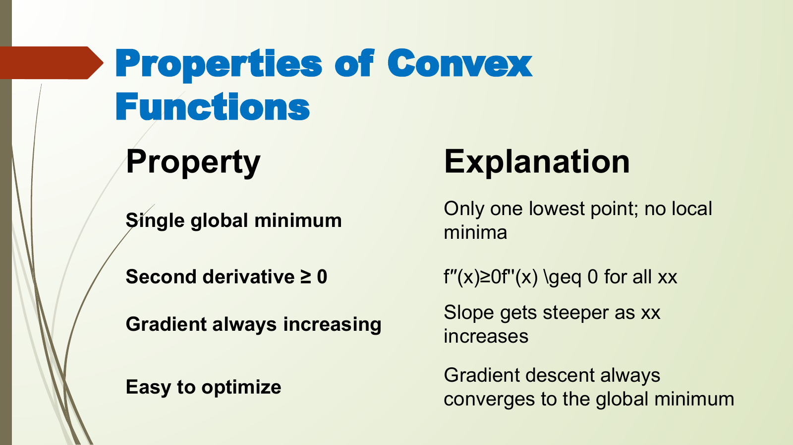

### Extracted Slide Text

- Properties of Convex
- Functions
- Property Explanation
- Only one lowest point; no local
- Single global minimum
- minima
- Second derivative ≥ 0 f′′(x)≥0f''(x) \geq 0 for all xx
- Slope gets steeper as xx
- Gradient always increasing
- increases
- Gradient descent always
- Easy to optimize
- converges to the global minimum

### Page Description And Teaching Notes

Slide type: concept explanation slide.
Main idea: Functions Property Explanation Only one lowest point; no local Single global minimum minima Second derivative ≥ 0 f′′(x)≥0f''(x) \geq 0 for all xx.
This page explains a core concept in prose. The main task is to convert the definition into a clear statement of what the concept is, why it is used, and where it appears in a machine-learning workflow.
Detailed page understanding:
- `Functions` is a core visible point. Explain what it means, why it matters, and how it connects to the slide title.
- `Property Explanation` is a core visible point. Explain what it means, why it matters, and how it connects to the slide title.
- `Only one lowest point; no local` is a core visible point. Explain what it means, why it matters, and how it connects to the slide title.
- `Single global minimum` is a core visible point. Explain what it means, why it matters, and how it connects to the slide title.
- `minima` is a core visible point. Explain what it means, why it matters, and how it connects to the slide title.
- `Second derivative ≥ 0 f′′(x)≥0f''(x) \geq 0 for all xx` is a core visible point. Explain what it means, why it matters, and how it connects to the slide title.
- `Slope gets steeper as xx` is a core visible point. Explain what it means, why it matters, and how it connects to the slide title.
- `Gradient always increasing` is a core visible point. Explain what it means, why it matters, and how it connects to the slide title.
- Additional bullets continue on the slide; use the extracted text list above for the complete wording.
- `converges to the global minimum` is a core visible point. Explain what it means, why it matters, and how it connects to the slide title.
Important visible terms: Properties, Convex Functions Property Explanation, Only, Single, Second, Slope, Gradient, Easy.
Visual/layout description: the embedded image preserves the actual slide. Describe the title area first, then read bullets, formulas, tables, arrows, grouped boxes, or diagrams in their visible order. If the slide contains a diagram, explain the relationship shown by arrows/positioning before explaining the text labels.
Teaching note: after reading the slide, ask the learner to restate the page in one or two sentences and give one example. For formula or metric slides, also ask what each variable or metric means and when it should be used.
Exam/viva note: prepare the slide title as a short-answer question, then use the bullets or visual labels as the expected answer points.

## Page 15: Why Are Convex Functions

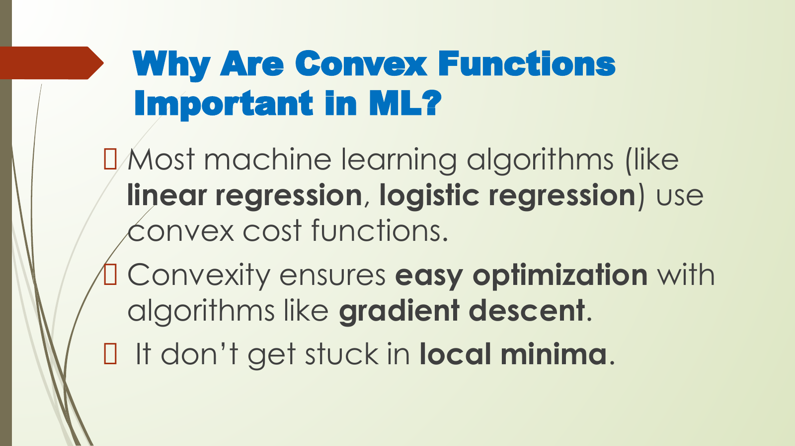

### Extracted Slide Text

- Why Are Convex Functions
- Important in ML?
- Most machine learning algorithms (like
- linear regression, logistic regression) use
- convex cost functions.
- Convexity ensures easy optimization with
- algorithms like gradient descent.
- It don’t get stuck in local minima.

### Page Description And Teaching Notes

Slide type: formula or calculation slide.
Main idea: Important in ML? Most machine learning algorithms (like linear regression, logistic regression) use convex cost functions. Convexity ensures easy optimization with algorithms like gradient descent.
This page should be read carefully because it introduces a calculation, objective, or optimization idea. Identify the variables in the formula, what quantity is being minimized or measured, and how the equation supports model training or evaluation.
Detailed page understanding:
- `Important in ML?` is a core visible point. Explain what it means, why it matters, and how it connects to the slide title.
- `Most machine learning algorithms (like` is a core visible point. Explain what it means, why it matters, and how it connects to the slide title.
- `linear regression, logistic regression) use` is an application/example point. Convert it into a concrete real-world case while teaching.
- `convex cost functions.` is a core visible point. Explain what it means, why it matters, and how it connects to the slide title.
- `Convexity ensures easy optimization with` is a core visible point. Explain what it means, why it matters, and how it connects to the slide title.
- `algorithms like gradient descent.` is a core visible point. Explain what it means, why it matters, and how it connects to the slide title.
- `It don’t get stuck in local minima.` is a core visible point. Explain what it means, why it matters, and how it connects to the slide title.
Important visible terms: Why Are Convex Functions, Important, Most, Convexity.
Visual/layout description: the embedded image preserves the actual slide. Describe the title area first, then read bullets, formulas, tables, arrows, grouped boxes, or diagrams in their visible order. If the slide contains a diagram, explain the relationship shown by arrows/positioning before explaining the text labels.
Teaching note: after reading the slide, ask the learner to restate the page in one or two sentences and give one example. For formula or metric slides, also ask what each variable or metric means and when it should be used.
Exam/viva note: prepare the slide title as a short-answer question, then use the bullets or visual labels as the expected answer points.

## Page 16: Real-World Applications of

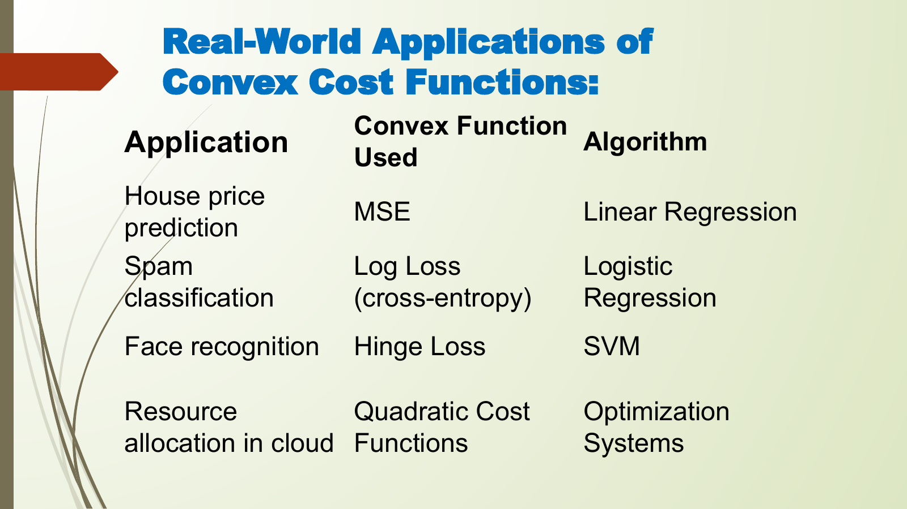

### Extracted Slide Text

- Real-World Applications of
- Convex Cost Functions:
- Convex Function
- Application Used
- Algorithm
- House price
- MSE Linear Regression
- prediction
- Spam Log Loss Logistic
- classification (cross-entropy) Regression
- Face recognition Hinge Loss SVM
- Resource Quadratic Cost Optimization
- allocation in cloud Functions Systems

### Page Description And Teaching Notes

Slide type: formula or calculation slide.
Main idea: Convex Cost Functions: Convex Function Application Used Algorithm House price MSE Linear Regression.
This page should be read carefully because it introduces a calculation, objective, or optimization idea. Identify the variables in the formula, what quantity is being minimized or measured, and how the equation supports model training or evaluation.
Detailed page understanding:
- `Convex Cost Functions:` is a core visible point. Explain what it means, why it matters, and how it connects to the slide title.
- `Convex Function` is a core visible point. Explain what it means, why it matters, and how it connects to the slide title.
- `Application Used` is an application/example point. Convert it into a concrete real-world case while teaching.
- `Algorithm` is a core visible point. Explain what it means, why it matters, and how it connects to the slide title.
- `House price` is an application/example point. Convert it into a concrete real-world case while teaching.
- `MSE Linear Regression` is a core visible point. Explain what it means, why it matters, and how it connects to the slide title.
- `prediction` is a core visible point. Explain what it means, why it matters, and how it connects to the slide title.
- `Spam Log Loss Logistic` is a core visible point. Explain what it means, why it matters, and how it connects to the slide title.
- Additional bullets continue on the slide; use the extracted text list above for the complete wording.
- `allocation in cloud Functions Systems` is a core visible point. Explain what it means, why it matters, and how it connects to the slide title.
Important visible terms: Real-World Applications, Convex Cost Functions, Convex Function Application Used, Algorithm House, MSE Linear Regression, Spam Log Loss Logistic, Regression Face, Hinge Loss SVM Resource.
Visual/layout description: the embedded image preserves the actual slide. Describe the title area first, then read bullets, formulas, tables, arrows, grouped boxes, or diagrams in their visible order. If the slide contains a diagram, explain the relationship shown by arrows/positioning before explaining the text labels.
Teaching note: after reading the slide, ask the learner to restate the page in one or two sentences and give one example. For formula or metric slides, also ask what each variable or metric means and when it should be used.
Exam/viva note: prepare the slide title as a short-answer question, then use the bullets or visual labels as the expected answer points.

## Page 17: Real Time Example:

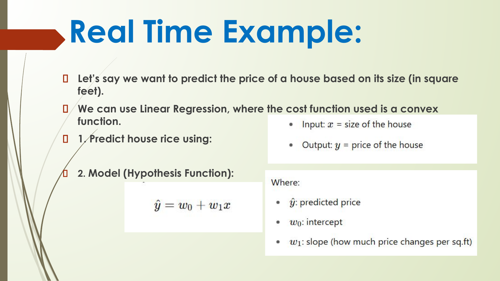

### Extracted Slide Text

- Real Time Example:
- Let’s say we want to predict the price of a house based on its size (in square
- feet).
- We can use Linear Regression, where the cost function used is a convex
- function.
- 1. Predict house rice using:
- 2. Model (Hypothesis Function):

### Page Description And Teaching Notes

Slide type: formula or calculation slide.
Main idea: Let’s say we want to predict the price of a house based on its size (in square feet). We can use Linear Regression, where the cost function used is a convex function. 1. Predict house rice using: 2. Model (Hypothesis Function):.
This page should be read carefully because it introduces a calculation, objective, or optimization idea. Identify the variables in the formula, what quantity is being minimized or measured, and how the equation supports model training or evaluation.
Detailed page understanding:
- `Let’s say we want to predict the price of a house based on its size (in square` is an application/example point. Convert it into a concrete real-world case while teaching.
- `feet).` is a core visible point. Explain what it means, why it matters, and how it connects to the slide title.
- `We can use Linear Regression, where the cost function used is a convex` gives the definition-level meaning. Explain it first in simple words, then connect it to how a model learns from data.
- `function.` is a core visible point. Explain what it means, why it matters, and how it connects to the slide title.
- `1. Predict house rice using:` is an application/example point. Convert it into a concrete real-world case while teaching.
- `2. Model (Hypothesis Function):` is one item in the slide's list. Treat it as a separate subtopic and prepare a one-line explanation for it.
Important visible terms: Real Time Example, Let, Linear Regression, Predict, Model, Hypothesis Function.
Visual/layout description: the embedded image preserves the actual slide. Describe the title area first, then read bullets, formulas, tables, arrows, grouped boxes, or diagrams in their visible order. If the slide contains a diagram, explain the relationship shown by arrows/positioning before explaining the text labels.
Teaching note: after reading the slide, ask the learner to restate the page in one or two sentences and give one example. For formula or metric slides, also ask what each variable or metric means and when it should be used.
Exam/viva note: prepare the slide title as a short-answer question, then use the bullets or visual labels as the expected answer points.

## Page 18: This is a convex function. Its plot looks like a

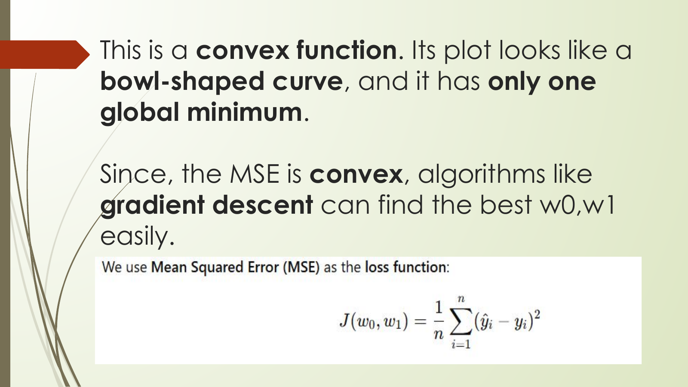

### Extracted Slide Text

- This is a convex function. Its plot looks like a
- bowl-shaped curve, and it has only one
- global minimum.
- Since, the MSE is convex, algorithms like
- gradient descent can find the best w0,w1
- easily.

### Page Description And Teaching Notes

Slide type: metric/table slide.
Main idea: bowl-shaped curve, and it has only one global minimum. Since, the MSE is convex, algorithms like gradient descent can find the best w0,w1 easily.
This page organizes evaluation or comparison information. Focus on what each metric measures, when it is useful, and what mistake it prevents when judging a machine-learning model.
Detailed page understanding:
- `bowl-shaped curve, and it has only one` is a core visible point. Explain what it means, why it matters, and how it connects to the slide title.
- `global minimum.` is a core visible point. Explain what it means, why it matters, and how it connects to the slide title.
- `Since, the MSE is convex, algorithms like` is a core visible point. Explain what it means, why it matters, and how it connects to the slide title.
- `gradient descent can find the best w0,w1` is a core visible point. Explain what it means, why it matters, and how it connects to the slide title.
- `easily.` is a core visible point. Explain what it means, why it matters, and how it connects to the slide title.
Important visible terms: This, Its, Since, MSE.
Visual/layout description: the embedded image preserves the actual slide. Describe the title area first, then read bullets, formulas, tables, arrows, grouped boxes, or diagrams in their visible order. If the slide contains a diagram, explain the relationship shown by arrows/positioning before explaining the text labels.
Teaching note: after reading the slide, ask the learner to restate the page in one or two sentences and give one example. For formula or metric slides, also ask what each variable or metric means and when it should be used.
Exam/viva note: prepare the slide title as a short-answer question, then use the bullets or visual labels as the expected answer points.

## Page 19: Logistic Regression:

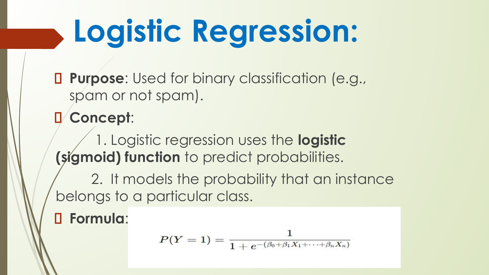

### Extracted Slide Text

- Logistic Regression:
- Purpose: Used for binary classification (e.g.,
- spam or not spam).
- Concept:
- 1. Logistic regression uses the logistic
- (sigmoid) function to predict probabilities.
- 2. It models the probability that an instance
- belongs to a particular class.
- Formula:

### Page Description And Teaching Notes

Slide type: formula or calculation slide.
Main idea: Purpose: Used for binary classification (e.g., spam or not spam). Concept: 1. Logistic regression uses the logistic (sigmoid) function to predict probabilities. 2. It models the probability that an instance.
This page should be read carefully because it introduces a calculation, objective, or optimization idea. Identify the variables in the formula, what quantity is being minimized or measured, and how the equation supports model training or evaluation.
Detailed page understanding:
- `Purpose: Used for binary classification (e.g.,` is an application/example point. Convert it into a concrete real-world case while teaching.
- `spam or not spam).` is a core visible point. Explain what it means, why it matters, and how it connects to the slide title.
- `Concept:` is a core visible point. Explain what it means, why it matters, and how it connects to the slide title.
- `1. Logistic regression uses the logistic` is an application/example point. Convert it into a concrete real-world case while teaching.
- `(sigmoid) function to predict probabilities.` is a core visible point. Explain what it means, why it matters, and how it connects to the slide title.
- `2. It models the probability that an instance` is one item in the slide's list. Treat it as a separate subtopic and prepare a one-line explanation for it.
- `belongs to a particular class.` is a core visible point. Explain what it means, why it matters, and how it connects to the slide title.
- `Formula:` is a core visible point. Explain what it means, why it matters, and how it connects to the slide title.
Important visible terms: Logistic Regression, Purpose, Used, Concept, Logistic, Formula.
Visual/layout description: the embedded image preserves the actual slide. Describe the title area first, then read bullets, formulas, tables, arrows, grouped boxes, or diagrams in their visible order. If the slide contains a diagram, explain the relationship shown by arrows/positioning before explaining the text labels.
Teaching note: after reading the slide, ask the learner to restate the page in one or two sentences and give one example. For formula or metric slides, also ask what each variable or metric means and when it should be used.
Exam/viva note: prepare the slide title as a short-answer question, then use the bullets or visual labels as the expected answer points.

## Page 20: Decision Tree

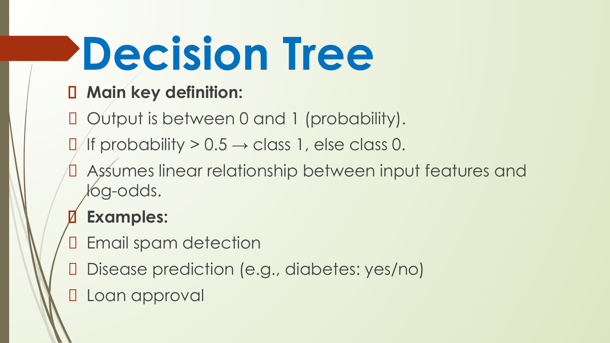

### Extracted Slide Text

- Decision Tree
- Main key definition:
- Output is between 0 and 1 (probability).
- If probability > 0.5 → class 1, else class 0.
- Assumes linear relationship between input features and
- log-odds.
- Examples:
- Email spam detection
- Disease prediction (e.g., diabetes: yes/no)
- Loan approval

### Page Description And Teaching Notes

Slide type: concept explanation slide.
Main idea: Main key definition: Output is between 0 and 1 (probability). If probability > 0.5 → class 1, else class 0. Assumes linear relationship between input features and log-odds. Examples:.
This page explains a core concept in prose. The main task is to convert the definition into a clear statement of what the concept is, why it is used, and where it appears in a machine-learning workflow.
Detailed page understanding:
- `Main key definition:` gives the definition-level meaning. Explain it first in simple words, then connect it to how a model learns from data.
- `Output is between 0 and 1 (probability).` is a core visible point. Explain what it means, why it matters, and how it connects to the slide title.
- `If probability > 0.5 → class 1, else class 0.` is a core visible point. Explain what it means, why it matters, and how it connects to the slide title.
- `Assumes linear relationship between input features and` is a core visible point. Explain what it means, why it matters, and how it connects to the slide title.
- `log-odds.` is a core visible point. Explain what it means, why it matters, and how it connects to the slide title.
- `Examples:` is an application/example point. Convert it into a concrete real-world case while teaching.
- `Email spam detection` is a core visible point. Explain what it means, why it matters, and how it connects to the slide title.
- `Disease prediction (e.g., diabetes: yes/no)` is a core visible point. Explain what it means, why it matters, and how it connects to the slide title.
- `Loan approval` is a core visible point. Explain what it means, why it matters, and how it connects to the slide title.
Important visible terms: Decision Tree Main, Output, Assumes, Examples, Email, Disease, Loan.
Visual/layout description: the embedded image preserves the actual slide. Describe the title area first, then read bullets, formulas, tables, arrows, grouped boxes, or diagrams in their visible order. If the slide contains a diagram, explain the relationship shown by arrows/positioning before explaining the text labels.
Teaching note: after reading the slide, ask the learner to restate the page in one or two sentences and give one example. For formula or metric slides, also ask what each variable or metric means and when it should be used.
Exam/viva note: prepare the slide title as a short-answer question, then use the bullets or visual labels as the expected answer points.

## Page 21: Decision Tree

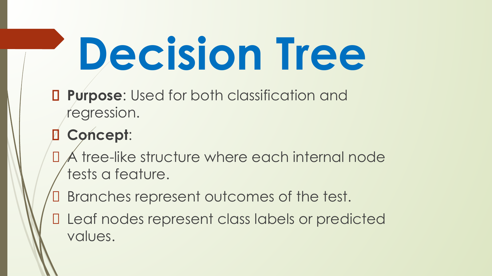

### Extracted Slide Text

- Decision Tree
- Purpose: Used for both classification and
- regression.
- Concept:
- A tree-like structure where each internal node
- tests a feature.
- Branches represent outcomes of the test.
- Leaf nodes represent class labels or predicted
- values.

### Page Description And Teaching Notes

Slide type: concept explanation slide.
Main idea: Purpose: Used for both classification and regression. Concept: A tree-like structure where each internal node tests a feature. Branches represent outcomes of the test.
This page explains a core concept in prose. The main task is to convert the definition into a clear statement of what the concept is, why it is used, and where it appears in a machine-learning workflow.
Detailed page understanding:
- `Purpose: Used for both classification and` is an application/example point. Convert it into a concrete real-world case while teaching.
- `regression.` is a core visible point. Explain what it means, why it matters, and how it connects to the slide title.
- `Concept:` is a core visible point. Explain what it means, why it matters, and how it connects to the slide title.
- `A tree-like structure where each internal node` is a core visible point. Explain what it means, why it matters, and how it connects to the slide title.
- `tests a feature.` is a core visible point. Explain what it means, why it matters, and how it connects to the slide title.
- `Branches represent outcomes of the test.` is a core visible point. Explain what it means, why it matters, and how it connects to the slide title.
- `Leaf nodes represent class labels or predicted` is a core visible point. Explain what it means, why it matters, and how it connects to the slide title.
- `values.` is a core visible point. Explain what it means, why it matters, and how it connects to the slide title.
Important visible terms: Decision Tree Purpose, Used, Concept, Branches, Leaf.
Progressive reveal note: compared with the previous page, this page adds or exposes: Purpose: Used for both classification and; regression.; Concept:; A tree-like structure where each internal node; ...; values..
Visual/layout description: the embedded image preserves the actual slide. Describe the title area first, then read bullets, formulas, tables, arrows, grouped boxes, or diagrams in their visible order. If the slide contains a diagram, explain the relationship shown by arrows/positioning before explaining the text labels.
Teaching note: after reading the slide, ask the learner to restate the page in one or two sentences and give one example. For formula or metric slides, also ask what each variable or metric means and when it should be used.
Exam/viva note: prepare the slide title as a short-answer question, then use the bullets or visual labels as the expected answer points.

## Page 22: A decision tree is a type of

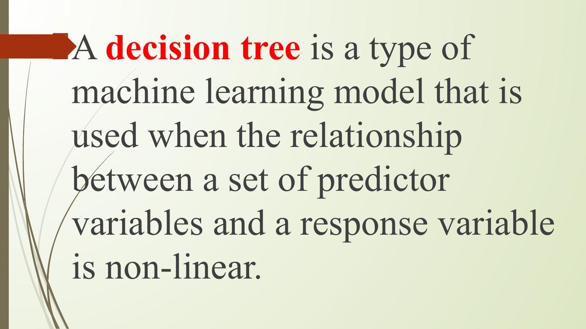

### Extracted Slide Text

- A decision tree is a type of
- machine learning model that is
- used when the relationship
- between a set of predictor
- variables and a response variable
- is non-linear.

### Page Description And Teaching Notes

Slide type: concept explanation slide.
Main idea: machine learning model that is used when the relationship between a set of predictor variables and a response variable is non-linear.
This page explains a core concept in prose. The main task is to convert the definition into a clear statement of what the concept is, why it is used, and where it appears in a machine-learning workflow.
Detailed page understanding:
- `machine learning model that is` is a core visible point. Explain what it means, why it matters, and how it connects to the slide title.
- `used when the relationship` is an application/example point. Convert it into a concrete real-world case while teaching.
- `between a set of predictor` is a core visible point. Explain what it means, why it matters, and how it connects to the slide title.
- `variables and a response variable` is a core visible point. Explain what it means, why it matters, and how it connects to the slide title.
- `is non-linear.` is a core visible point. Explain what it means, why it matters, and how it connects to the slide title.
Visual/layout description: the embedded image preserves the actual slide. Describe the title area first, then read bullets, formulas, tables, arrows, grouped boxes, or diagrams in their visible order. If the slide contains a diagram, explain the relationship shown by arrows/positioning before explaining the text labels.
Teaching note: after reading the slide, ask the learner to restate the page in one or two sentences and give one example. For formula or metric slides, also ask what each variable or metric means and when it should be used.
Exam/viva note: prepare the slide title as a short-answer question, then use the bullets or visual labels as the expected answer points.

## Page 23: Decision Tree

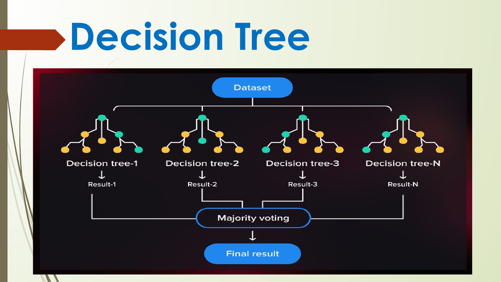

### Extracted Slide Text

- Decision Tree

### Page Description And Teaching Notes

Slide type: title or transition slide.
Main idea: the slide is visual-first, so the image should be treated as the source for the content and structure.
This page sets the context for the next topic. Treat it as a section marker: it tells the learner what concept or unit is starting before the deck moves into definitions, examples, or formulas.
- No reliable selectable text was extracted; use the slide image for the visible diagram, chart, or screenshot.
Important visible terms: Decision Tree.
Visual/layout description: the embedded image preserves the actual slide. Describe the title area first, then read bullets, formulas, tables, arrows, grouped boxes, or diagrams in their visible order. If the slide contains a diagram, explain the relationship shown by arrows/positioning before explaining the text labels.
Teaching note: after reading the slide, ask the learner to restate the page in one or two sentences and give one example. For formula or metric slides, also ask what each variable or metric means and when it should be used.
Exam/viva note: prepare the slide title as a short-answer question, then use the bullets or visual labels as the expected answer points.

## Page 24: How it works:

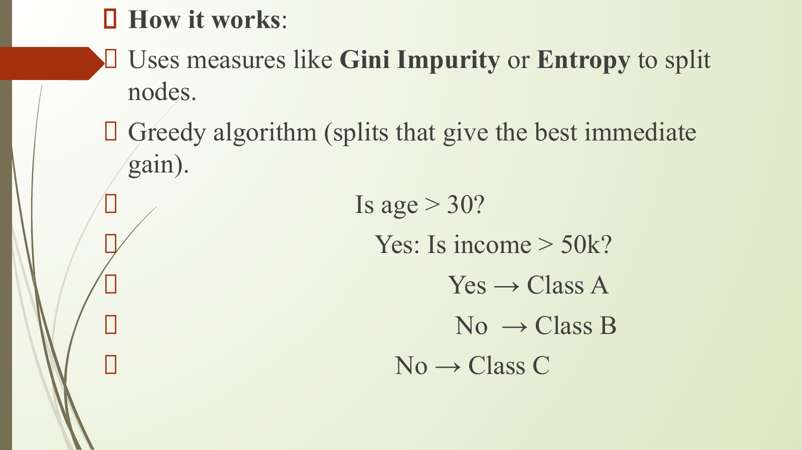

### Extracted Slide Text

- How it works:
- Uses measures like Gini Impurity or Entropy to split
- nodes.
- Greedy algorithm (splits that give the best immediate
- gain).
- Is age > 30?
- Yes: Is income > 50k?
- Yes → Class A
- No → Class B
- No → Class C

### Page Description And Teaching Notes

Slide type: concept explanation slide.
Main idea: Uses measures like Gini Impurity or Entropy to split nodes. Greedy algorithm (splits that give the best immediate gain). Is age > 30? Yes: Is income > 50k?.
This page explains a core concept in prose. The main task is to convert the definition into a clear statement of what the concept is, why it is used, and where it appears in a machine-learning workflow.
Detailed page understanding:
- `Uses measures like Gini Impurity or Entropy to split` is an application/example point. Convert it into a concrete real-world case while teaching.
- `nodes.` is a core visible point. Explain what it means, why it matters, and how it connects to the slide title.
- `Greedy algorithm (splits that give the best immediate` is a core visible point. Explain what it means, why it matters, and how it connects to the slide title.
- `gain).` is a core visible point. Explain what it means, why it matters, and how it connects to the slide title.
- `Is age > 30?` gives the definition-level meaning. Explain it first in simple words, then connect it to how a model learns from data.
- `Yes: Is income > 50k?` is a core visible point. Explain what it means, why it matters, and how it connects to the slide title.
- `Yes → Class A` is a core visible point. Explain what it means, why it matters, and how it connects to the slide title.
- `No → Class B` is a core visible point. Explain what it means, why it matters, and how it connects to the slide title.
- `No → Class C` is a core visible point. Explain what it means, why it matters, and how it connects to the slide title.
Important visible terms: How, Uses, Gini Impurity, Entropy, Greedy, Yes, Class A No, Class B No.
Visual/layout description: the embedded image preserves the actual slide. Describe the title area first, then read bullets, formulas, tables, arrows, grouped boxes, or diagrams in their visible order. If the slide contains a diagram, explain the relationship shown by arrows/positioning before explaining the text labels.
Teaching note: after reading the slide, ask the learner to restate the page in one or two sentences and give one example. For formula or metric slides, also ask what each variable or metric means and when it should be used.
Exam/viva note: prepare the slide title as a short-answer question, then use the bullets or visual labels as the expected answer points.

## Page 25: Advantages:

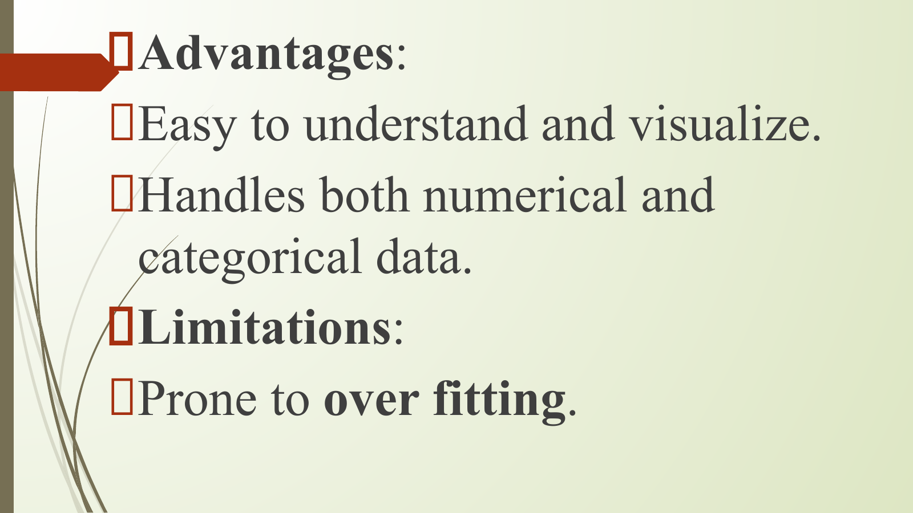

### Extracted Slide Text

- Advantages:
- Easy to understand and visualize.
- Handles both numerical and
- categorical data.
- Limitations:
- Prone to over fitting.

### Page Description And Teaching Notes

Slide type: concept explanation slide.
Main idea: Easy to understand and visualize. Handles both numerical and categorical data. Limitations: Prone to over fitting.
This page explains a core concept in prose. The main task is to convert the definition into a clear statement of what the concept is, why it is used, and where it appears in a machine-learning workflow.
Detailed page understanding:
- `Easy to understand and visualize.` is a core visible point. Explain what it means, why it matters, and how it connects to the slide title.
- `Handles both numerical and` is a core visible point. Explain what it means, why it matters, and how it connects to the slide title.
- `categorical data.` is a core visible point. Explain what it means, why it matters, and how it connects to the slide title.
- `Limitations:` is a limitation or risk. Mention when the method may fail and what alternative or precaution can reduce the issue.
- `Prone to over fitting.` is a core visible point. Explain what it means, why it matters, and how it connects to the slide title.
Important visible terms: Advantages, Easy, Handles, Limitations, Prone.
Visual/layout description: the embedded image preserves the actual slide. Describe the title area first, then read bullets, formulas, tables, arrows, grouped boxes, or diagrams in their visible order. If the slide contains a diagram, explain the relationship shown by arrows/positioning before explaining the text labels.
Teaching note: after reading the slide, ask the learner to restate the page in one or two sentences and give one example. For formula or metric slides, also ask what each variable or metric means and when it should be used.
Exam/viva note: prepare the slide title as a short-answer question, then use the bullets or visual labels as the expected answer points.

## Page 26: Random Forest

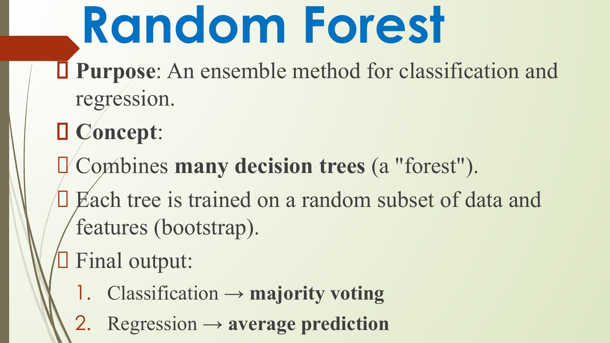

### Extracted Slide Text

- Random Forest
- Purpose: An ensemble method for classification and
- regression.
- Concept:
- Combines many decision trees (a "forest").
- Each tree is trained on a random subset of data and
- features (bootstrap).
- Final output:
- 1. Classification → majority voting
- 2. Regression → average prediction

### Page Description And Teaching Notes

Slide type: bullet explanation slide.
Main idea: Purpose: An ensemble method for classification and regression. Concept: Combines many decision trees (a "forest"). Each tree is trained on a random subset of data and features (bootstrap).
This page breaks the topic into separate points. Each bullet should be treated as a distinct exam or viva talking point, with the learner able to define it and give a small example.
Detailed page understanding:
- `Purpose: An ensemble method for classification and` is a core visible point. Explain what it means, why it matters, and how it connects to the slide title.
- `regression.` is a core visible point. Explain what it means, why it matters, and how it connects to the slide title.
- `Concept:` is a core visible point. Explain what it means, why it matters, and how it connects to the slide title.
- `Combines many decision trees (a "forest").` is a core visible point. Explain what it means, why it matters, and how it connects to the slide title.
- `Each tree is trained on a random subset of data and` is a core visible point. Explain what it means, why it matters, and how it connects to the slide title.
- `features (bootstrap).` is a core visible point. Explain what it means, why it matters, and how it connects to the slide title.
- `Final output:` is a core visible point. Explain what it means, why it matters, and how it connects to the slide title.
- `1. Classification → majority voting` is one item in the slide's list. Treat it as a separate subtopic and prepare a one-line explanation for it.
- `2. Regression → average prediction` is one item in the slide's list. Treat it as a separate subtopic and prepare a one-line explanation for it.
Important visible terms: Random Forest Purpose, Concept, Combines, Each, Final, Classification, Regression.
Visual/layout description: the embedded image preserves the actual slide. Describe the title area first, then read bullets, formulas, tables, arrows, grouped boxes, or diagrams in their visible order. If the slide contains a diagram, explain the relationship shown by arrows/positioning before explaining the text labels.
Teaching note: after reading the slide, ask the learner to restate the page in one or two sentences and give one example. For formula or metric slides, also ask what each variable or metric means and when it should be used.
Exam/viva note: prepare the slide title as a short-answer question, then use the bullets or visual labels as the expected answer points.

## Page 27: Unit II - Supervised Learning (Full Deck) Page 27

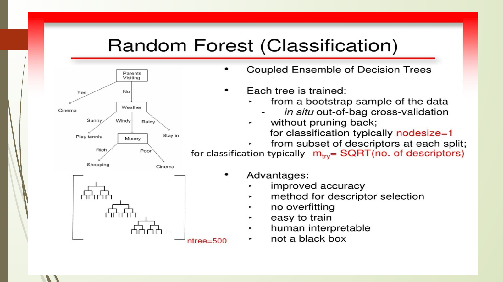

### Extracted Slide Text

- No selectable text extracted from this page.

### Page Description And Teaching Notes

Slide type: visual-only or image-heavy slide.
Main idea: the slide is visual-first, so the image should be treated as the source for the content and structure.
This page is primarily visual. The embedded slide image is the authoritative visual output; read it as a diagram or illustration first, then connect any visible labels to the surrounding pages.
- No reliable selectable text was extracted; use the slide image for the visible diagram, chart, or screenshot.
Visual/layout description: the embedded image preserves the actual slide. Describe the title area first, then read bullets, formulas, tables, arrows, grouped boxes, or diagrams in their visible order. If the slide contains a diagram, explain the relationship shown by arrows/positioning before explaining the text labels.
Teaching note: after reading the slide, ask the learner to restate the page in one or two sentences and give one example. For formula or metric slides, also ask what each variable or metric means and when it should be used.
Exam/viva note: prepare the slide title as a short-answer question, then use the bullets or visual labels as the expected answer points.

## Page 28: Unit II - Supervised Learning (Full Deck) Page 28

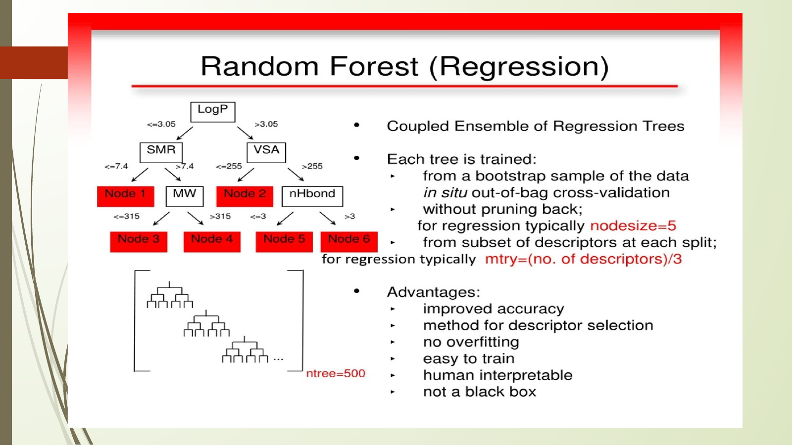

### Extracted Slide Text

- No selectable text extracted from this page.

### Page Description And Teaching Notes

Slide type: visual-only or image-heavy slide.
Main idea: the slide is visual-first, so the image should be treated as the source for the content and structure.
This page is primarily visual. The embedded slide image is the authoritative visual output; read it as a diagram or illustration first, then connect any visible labels to the surrounding pages.
- No reliable selectable text was extracted; use the slide image for the visible diagram, chart, or screenshot.
Visual/layout description: the embedded image preserves the actual slide. Describe the title area first, then read bullets, formulas, tables, arrows, grouped boxes, or diagrams in their visible order. If the slide contains a diagram, explain the relationship shown by arrows/positioning before explaining the text labels.
Teaching note: after reading the slide, ask the learner to restate the page in one or two sentences and give one example. For formula or metric slides, also ask what each variable or metric means and when it should be used.
Exam/viva note: prepare the slide title as a short-answer question, then use the bullets or visual labels as the expected answer points.

## Page 29: Unit II - Supervised Learning (Full Deck) Page 29

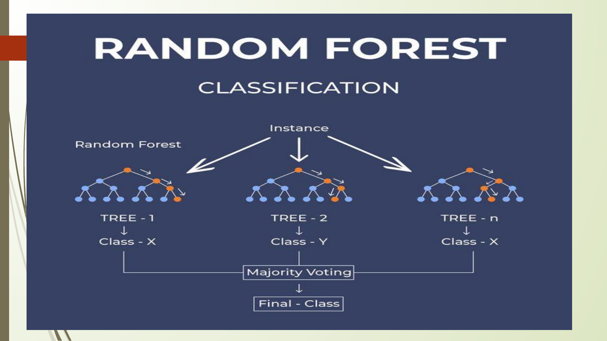

### Extracted Slide Text

- No selectable text extracted from this page.

### Page Description And Teaching Notes

Slide type: visual-only or image-heavy slide.
Main idea: the slide is visual-first, so the image should be treated as the source for the content and structure.
This page is primarily visual. The embedded slide image is the authoritative visual output; read it as a diagram or illustration first, then connect any visible labels to the surrounding pages.
- No reliable selectable text was extracted; use the slide image for the visible diagram, chart, or screenshot.
Visual/layout description: the embedded image preserves the actual slide. Describe the title area first, then read bullets, formulas, tables, arrows, grouped boxes, or diagrams in their visible order. If the slide contains a diagram, explain the relationship shown by arrows/positioning before explaining the text labels.
Teaching note: after reading the slide, ask the learner to restate the page in one or two sentences and give one example. For formula or metric slides, also ask what each variable or metric means and when it should be used.
Exam/viva note: prepare the slide title as a short-answer question, then use the bullets or visual labels as the expected answer points.

## Page 30: Reduces over fitting of individual trees.

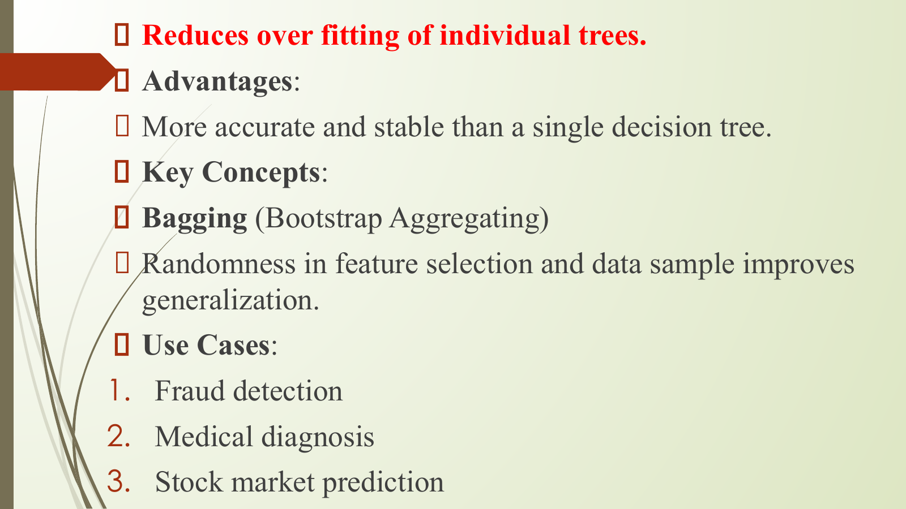

### Extracted Slide Text

- Reduces over fitting of individual trees.
- Advantages:
- More accurate and stable than a single decision tree.
- Key Concepts:
- Bagging (Bootstrap Aggregating)
- Randomness in feature selection and data sample improves
- generalization.
- Use Cases:
- 1. Fraud detection
- 2. Medical diagnosis
- 3. Stock market prediction

### Page Description And Teaching Notes

Slide type: metric/table slide.
Main idea: Advantages: More accurate and stable than a single decision tree. Key Concepts: Bagging (Bootstrap Aggregating) Randomness in feature selection and data sample improves generalization.
This page organizes evaluation or comparison information. Focus on what each metric measures, when it is useful, and what mistake it prevents when judging a machine-learning model.
Detailed page understanding:
- `Advantages:` states a benefit. Use it to justify why this method or concept is useful in a machine-learning workflow.
- `More accurate and stable than a single decision tree.` is a core visible point. Explain what it means, why it matters, and how it connects to the slide title.
- `Key Concepts:` is a core visible point. Explain what it means, why it matters, and how it connects to the slide title.
- `Bagging (Bootstrap Aggregating)` is a core visible point. Explain what it means, why it matters, and how it connects to the slide title.
- `Randomness in feature selection and data sample improves` states a benefit. Use it to justify why this method or concept is useful in a machine-learning workflow.
- `generalization.` is a core visible point. Explain what it means, why it matters, and how it connects to the slide title.
- `Use Cases:` is an application/example point. Convert it into a concrete real-world case while teaching.
- `1. Fraud detection` is one item in the slide's list. Treat it as a separate subtopic and prepare a one-line explanation for it.
- `2. Medical diagnosis` is one item in the slide's list. Treat it as a separate subtopic and prepare a one-line explanation for it.
- `3. Stock market prediction` is one item in the slide's list. Treat it as a separate subtopic and prepare a one-line explanation for it.
Important visible terms: Reduces, Advantages, More, Key Concepts, Bagging, Bootstrap Aggregating, Randomness, Use Cases.
Visual/layout description: the embedded image preserves the actual slide. Describe the title area first, then read bullets, formulas, tables, arrows, grouped boxes, or diagrams in their visible order. If the slide contains a diagram, explain the relationship shown by arrows/positioning before explaining the text labels.
Teaching note: after reading the slide, ask the learner to restate the page in one or two sentences and give one example. For formula or metric slides, also ask what each variable or metric means and when it should be used.
Exam/viva note: prepare the slide title as a short-answer question, then use the bullets or visual labels as the expected answer points.

## Page 31: Unit II - Supervised Learning (Full Deck) Page 31

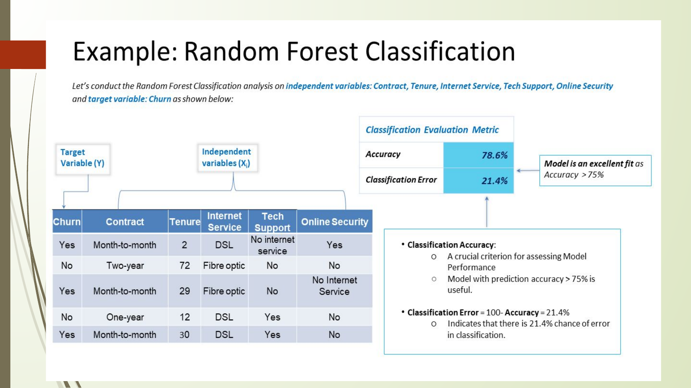

### Extracted Slide Text

- No selectable text extracted from this page.

### Page Description And Teaching Notes

Slide type: visual-only or image-heavy slide.
Main idea: the slide is visual-first, so the image should be treated as the source for the content and structure.
This page is primarily visual. The embedded slide image is the authoritative visual output; read it as a diagram or illustration first, then connect any visible labels to the surrounding pages.
- No reliable selectable text was extracted; use the slide image for the visible diagram, chart, or screenshot.
Visual/layout description: the embedded image preserves the actual slide. Describe the title area first, then read bullets, formulas, tables, arrows, grouped boxes, or diagrams in their visible order. If the slide contains a diagram, explain the relationship shown by arrows/positioning before explaining the text labels.
Teaching note: after reading the slide, ask the learner to restate the page in one or two sentences and give one example. For formula or metric slides, also ask what each variable or metric means and when it should be used.
Exam/viva note: prepare the slide title as a short-answer question, then use the bullets or visual labels as the expected answer points.

## Page 32: Difference Between Random

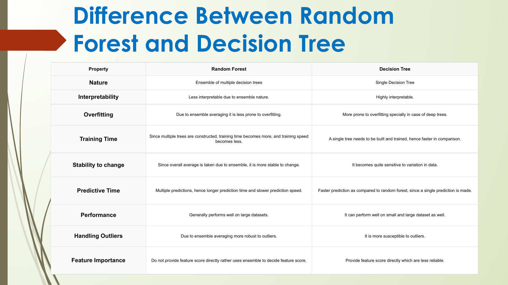

### Extracted Slide Text

- Difference Between Random
- Forest and Decision Tree
- Property Random Forest Decision Tree
- Nature Ensemble of multiple decision trees Single Decision Tree
- Interpretability Less interpretable due to ensemble nature. Highly interpretable.
- Overfitting Due to ensemble averaging it is less prone to overfitting. More prone to overfitting specially in case of deep trees.
- Since multiple trees are constructed, training time becomes more, and training speed
- Training Time becomes less.
- A single tree needs to be built and trained, hence faster in comparison.
- Stability to change Since overall average is taken due to ensemble, it is more stable to change. It becomes quite sensitive to variation in data.
- Predictive Time Multiple predictions, hence longer prediction time and slower prediction speed. Faster prediction as compared to random forest, since a single prediction is made.
- Performance Generally performs well on large datasets. It can perform well on small and large dataset as well.
- Handling Outliers Due to ensemble averaging more robust to outliers. It is more susceptible to outliers.
- Feature Importance Do not provide feature score directly rather uses ensemble to decide feature score. Provide feature score directly which are less reliable.

### Page Description And Teaching Notes

Slide type: metric/table slide.
Main idea: Forest and Decision Tree Property Random Forest Decision Tree Nature Ensemble of multiple decision trees Single Decision Tree Interpretability Less interpretable due to ensemble nature. Highly interpretable. Overfitting Due to ensemble averaging it is less prone to overfitting. More prone to overfitting specially in case of deep trees. Since multiple trees are constructed, training time becomes more, and training speed.
This page organizes evaluation or comparison information. Focus on what each metric measures, when it is useful, and what mistake it prevents when judging a machine-learning model.
Detailed page understanding:
- `Forest and Decision Tree` is a core visible point. Explain what it means, why it matters, and how it connects to the slide title.
- `Property Random Forest Decision Tree` is a core visible point. Explain what it means, why it matters, and how it connects to the slide title.
- `Nature Ensemble of multiple decision trees Single Decision Tree` is a core visible point. Explain what it means, why it matters, and how it connects to the slide title.
- `Interpretability Less interpretable due to ensemble nature. Highly interpretable.` is a core visible point. Explain what it means, why it matters, and how it connects to the slide title.
- `Overfitting Due to ensemble averaging it is less prone to overfitting. More prone to overfitting specially in case of deep trees.` is a core visible point. Explain what it means, why it matters, and how it connects to the slide title.
- `Since multiple trees are constructed, training time becomes more, and training speed` is a core visible point. Explain what it means, why it matters, and how it connects to the slide title.
- `Training Time becomes less.` is a core visible point. Explain what it means, why it matters, and how it connects to the slide title.
- `A single tree needs to be built and trained, hence faster in comparison.` is a core visible point. Explain what it means, why it matters, and how it connects to the slide title.
- Additional bullets continue on the slide; use the extracted text list above for the complete wording.
- `Feature Importance Do not provide feature score directly rather uses ensemble to decide feature score. Provide feature score directly which are less reliable.` is an application/example point. Convert it into a concrete real-world case while teaching.
Important visible terms: Difference Between Random Forest, Decision Tree Property Random, Forest Decision Tree Nature, Ensemble, Single Decision Tree Interpretability, Less, Highly, Overfitting Due.
Visual/layout description: the embedded image preserves the actual slide. Describe the title area first, then read bullets, formulas, tables, arrows, grouped boxes, or diagrams in their visible order. If the slide contains a diagram, explain the relationship shown by arrows/positioning before explaining the text labels.
Teaching note: after reading the slide, ask the learner to restate the page in one or two sentences and give one example. For formula or metric slides, also ask what each variable or metric means and when it should be used.
Exam/viva note: prepare the slide title as a short-answer question, then use the bullets or visual labels as the expected answer points.

## Page 33: Ensemble learning

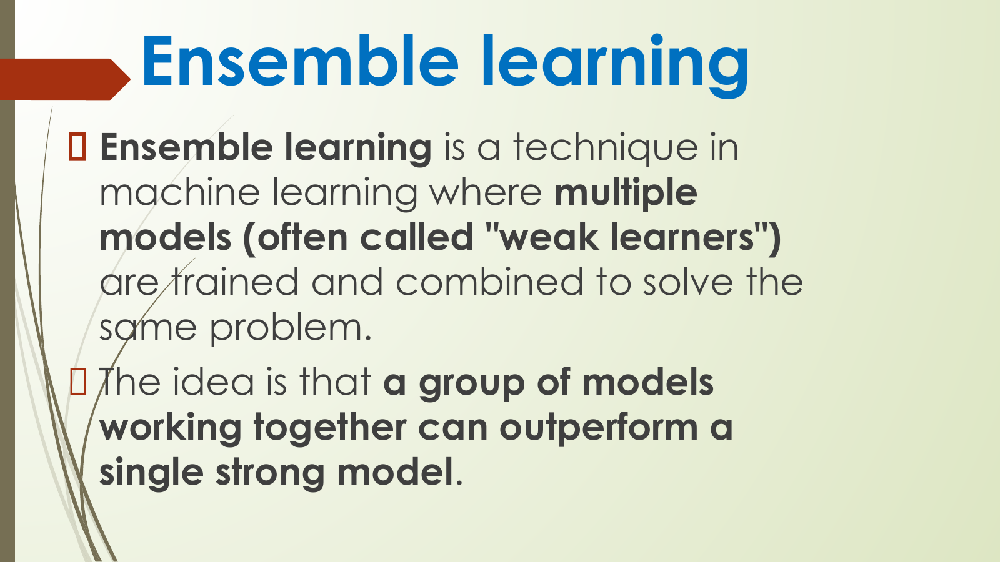

### Extracted Slide Text

- Ensemble learning
- Ensemble learning is a technique in
- machine learning where multiple
- models (often called "weak learners")
- are trained and combined to solve the
- same problem.
- The idea is that a group of models
- working together can outperform a
- single strong model.

### Page Description And Teaching Notes

Slide type: concept explanation slide.
Main idea: Ensemble learning is a technique in machine learning where multiple models (often called "weak learners") are trained and combined to solve the same problem. The idea is that a group of models.
This page explains a core concept in prose. The main task is to convert the definition into a clear statement of what the concept is, why it is used, and where it appears in a machine-learning workflow.
Detailed page understanding:
- `Ensemble learning is a technique in` gives the definition-level meaning. Explain it first in simple words, then connect it to how a model learns from data.
- `machine learning where multiple` is a core visible point. Explain what it means, why it matters, and how it connects to the slide title.
- `models (often called "weak learners")` is a core visible point. Explain what it means, why it matters, and how it connects to the slide title.
- `are trained and combined to solve the` is a core visible point. Explain what it means, why it matters, and how it connects to the slide title.
- `same problem.` is a limitation or risk. Mention when the method may fail and what alternative or precaution can reduce the issue.
- `The idea is that a group of models` is a core visible point. Explain what it means, why it matters, and how it connects to the slide title.
- `working together can outperform a` is a core visible point. Explain what it means, why it matters, and how it connects to the slide title.
- `single strong model.` is a core visible point. Explain what it means, why it matters, and how it connects to the slide title.
Important visible terms: Ensemble, The.
Visual/layout description: the embedded image preserves the actual slide. Describe the title area first, then read bullets, formulas, tables, arrows, grouped boxes, or diagrams in their visible order. If the slide contains a diagram, explain the relationship shown by arrows/positioning before explaining the text labels.
Teaching note: after reading the slide, ask the learner to restate the page in one or two sentences and give one example. For formula or metric slides, also ask what each variable or metric means and when it should be used.
Exam/viva note: prepare the slide title as a short-answer question, then use the bullets or visual labels as the expected answer points.

## Page 34: When to Use Ensemble Learning?

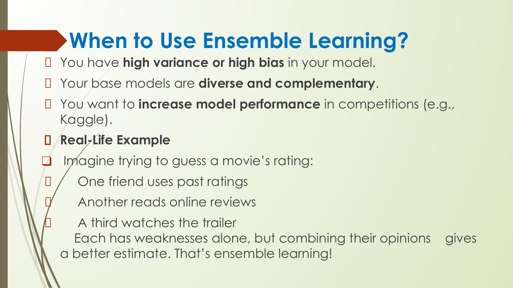

### Extracted Slide Text

- When to Use Ensemble Learning?
- You have high variance or high bias in your model.
- Your base models are diverse and complementary.
- You want to increase model performance in competitions (e.g.,
- Kaggle).
- Real-Life Example
- ❑ Imagine trying to guess a movie’s rating:
- One friend uses past ratings
- Another reads online reviews
- A third watches the trailer
- Each has weaknesses alone, but combining their opinions gives
- a better estimate. That’s ensemble learning!

### Page Description And Teaching Notes

Slide type: bullet explanation slide.
Main idea: You have high variance or high bias in your model. Your base models are diverse and complementary. You want to increase model performance in competitions (e.g., Kaggle). Real-Life Example ❑ Imagine trying to guess a movie’s rating:.
This page breaks the topic into separate points. Each bullet should be treated as a distinct exam or viva talking point, with the learner able to define it and give a small example.
Detailed page understanding:
- `You have high variance or high bias in your model.` is a core visible point. Explain what it means, why it matters, and how it connects to the slide title.
- `Your base models are diverse and complementary.` is a core visible point. Explain what it means, why it matters, and how it connects to the slide title.
- `You want to increase model performance in competitions (e.g.,` is a core visible point. Explain what it means, why it matters, and how it connects to the slide title.
- `Kaggle).` is a core visible point. Explain what it means, why it matters, and how it connects to the slide title.
- `Real-Life Example` is an application/example point. Convert it into a concrete real-world case while teaching.
- `❑ Imagine trying to guess a movie’s rating:` is one item in the slide's list. Treat it as a separate subtopic and prepare a one-line explanation for it.
- `One friend uses past ratings` is an application/example point. Convert it into a concrete real-world case while teaching.
- `Another reads online reviews` is a core visible point. Explain what it means, why it matters, and how it connects to the slide title.
- Additional bullets continue on the slide; use the extracted text list above for the complete wording.
- `a better estimate. That’s ensemble learning!` is a core visible point. Explain what it means, why it matters, and how it connects to the slide title.
Important visible terms: When, Use Ensemble Learning, You, Your, Kaggle, Real-Life Example, Imagine, One.
Visual/layout description: the embedded image preserves the actual slide. Describe the title area first, then read bullets, formulas, tables, arrows, grouped boxes, or diagrams in their visible order. If the slide contains a diagram, explain the relationship shown by arrows/positioning before explaining the text labels.
Teaching note: after reading the slide, ask the learner to restate the page in one or two sentences and give one example. For formula or metric slides, also ask what each variable or metric means and when it should be used.
Exam/viva note: prepare the slide title as a short-answer question, then use the bullets or visual labels as the expected answer points.

## Page 35: Unit II - Supervised Learning (Full Deck) Page 35

### Extracted Slide Text

- No selectable text extracted from this page.

### Page Description And Teaching Notes

Slide type: visual-only or image-heavy slide.
Main idea: the slide is visual-first, so the image should be treated as the source for the content and structure.
This page is primarily visual. The embedded slide image is the authoritative visual output; read it as a diagram or illustration first, then connect any visible labels to the surrounding pages.
- No reliable selectable text was extracted; use the slide image for the visible diagram, chart, or screenshot.
Visual/layout description: the embedded image preserves the actual slide. Describe the title area first, then read bullets, formulas, tables, arrows, grouped boxes, or diagrams in their visible order. If the slide contains a diagram, explain the relationship shown by arrows/positioning before explaining the text labels.
Teaching note: after reading the slide, ask the learner to restate the page in one or two sentences and give one example. For formula or metric slides, also ask what each variable or metric means and when it should be used.
Exam/viva note: prepare the slide title as a short-answer question, then use the bullets or visual labels as the expected answer points.

## Page 36: Unit II - Supervised Learning (Full Deck) Page 36

### Extracted Slide Text

- No selectable text extracted from this page.

### Page Description And Teaching Notes

Slide type: visual-only or image-heavy slide.
Main idea: the slide is visual-first, so the image should be treated as the source for the content and structure.
This page is primarily visual. The embedded slide image is the authoritative visual output; read it as a diagram or illustration first, then connect any visible labels to the surrounding pages.
- No reliable selectable text was extracted; use the slide image for the visible diagram, chart, or screenshot.
Visual/layout description: the embedded image preserves the actual slide. Describe the title area first, then read bullets, formulas, tables, arrows, grouped boxes, or diagrams in their visible order. If the slide contains a diagram, explain the relationship shown by arrows/positioning before explaining the text labels.
Teaching note: after reading the slide, ask the learner to restate the page in one or two sentences and give one example. For formula or metric slides, also ask what each variable or metric means and when it should be used.
Exam/viva note: prepare the slide title as a short-answer question, then use the bullets or visual labels as the expected answer points.

## Page 37: Accuracy: Highest

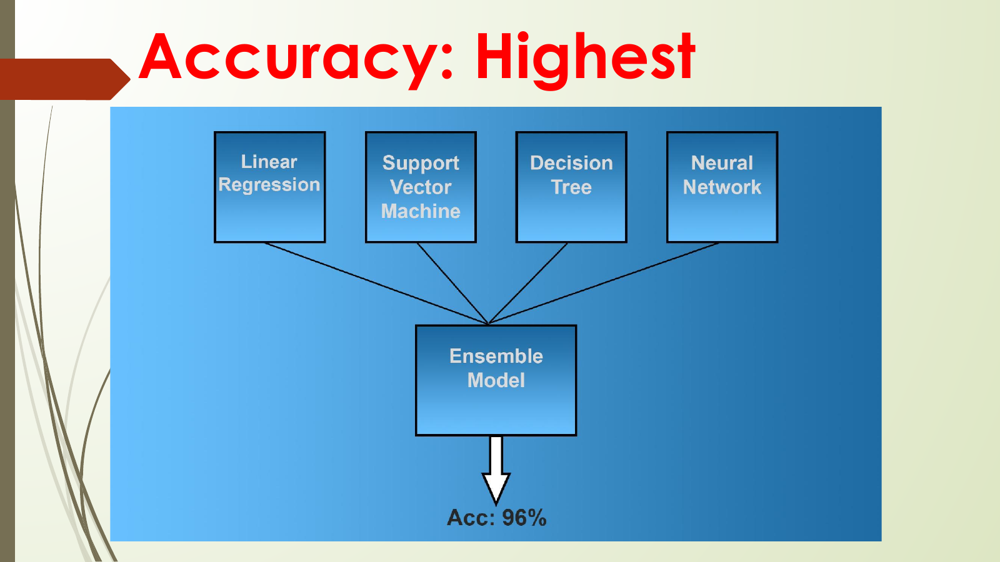

### Extracted Slide Text

- Accuracy: Highest

### Page Description And Teaching Notes

Slide type: title or transition slide.
Main idea: the slide is visual-first, so the image should be treated as the source for the content and structure.
This page sets the context for the next topic. Treat it as a section marker: it tells the learner what concept or unit is starting before the deck moves into definitions, examples, or formulas.
- No reliable selectable text was extracted; use the slide image for the visible diagram, chart, or screenshot.
Important visible terms: Accuracy, Highest.
Visual/layout description: the embedded image preserves the actual slide. Describe the title area first, then read bullets, formulas, tables, arrows, grouped boxes, or diagrams in their visible order. If the slide contains a diagram, explain the relationship shown by arrows/positioning before explaining the text labels.
Teaching note: after reading the slide, ask the learner to restate the page in one or two sentences and give one example. For formula or metric slides, also ask what each variable or metric means and when it should be used.
Exam/viva note: prepare the slide title as a short-answer question, then use the bullets or visual labels as the expected answer points.

## Page 38: Types of Ensemble learning

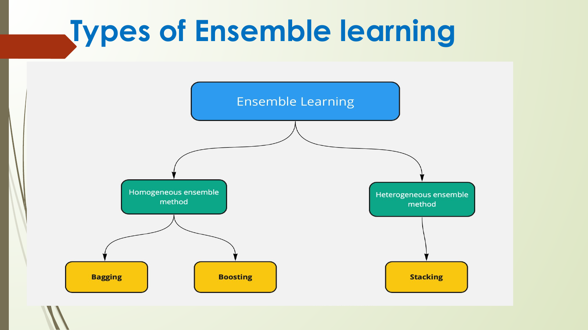

### Extracted Slide Text

- Types of Ensemble learning

### Page Description And Teaching Notes

Slide type: title or transition slide.
Main idea: the slide is visual-first, so the image should be treated as the source for the content and structure.
This page sets the context for the next topic. Treat it as a section marker: it tells the learner what concept or unit is starting before the deck moves into definitions, examples, or formulas.
- No reliable selectable text was extracted; use the slide image for the visible diagram, chart, or screenshot.
Important visible terms: Types, Ensemble.
Visual/layout description: the embedded image preserves the actual slide. Describe the title area first, then read bullets, formulas, tables, arrows, grouped boxes, or diagrams in their visible order. If the slide contains a diagram, explain the relationship shown by arrows/positioning before explaining the text labels.
Teaching note: after reading the slide, ask the learner to restate the page in one or two sentences and give one example. For formula or metric slides, also ask what each variable or metric means and when it should be used.
Exam/viva note: prepare the slide title as a short-answer question, then use the bullets or visual labels as the expected answer points.

## Page 39: Bagging (Bootstrap Aggregating):

### Extracted Slide Text

- Bagging (Bootstrap Aggregating):
- Models are trained independently on different
- random subsets of the training data.
- Their results are then combined—usually by
- averaging (for regression) or voting (for
- classification).
- This helps reduce variance and prevents over
- fitting.
- Example Algorithms:
- Random Forest (uses decision trees + bagging)

### Page Description And Teaching Notes

Slide type: concept explanation slide.
Main idea: Models are trained independently on different random subsets of the training data. Their results are then combined—usually by averaging (for regression) or voting (for classification). This helps reduce variance and prevents over.
This page explains a core concept in prose. The main task is to convert the definition into a clear statement of what the concept is, why it is used, and where it appears in a machine-learning workflow.
Detailed page understanding:
- `Models are trained independently on different` is a core visible point. Explain what it means, why it matters, and how it connects to the slide title.
- `random subsets of the training data.` is a core visible point. Explain what it means, why it matters, and how it connects to the slide title.
- `Their results are then combined—usually by` is a core visible point. Explain what it means, why it matters, and how it connects to the slide title.
- `averaging (for regression) or voting (for` is a core visible point. Explain what it means, why it matters, and how it connects to the slide title.
- `classification).` is a core visible point. Explain what it means, why it matters, and how it connects to the slide title.
- `This helps reduce variance and prevents over` states a benefit. Use it to justify why this method or concept is useful in a machine-learning workflow.
- `fitting.` is a core visible point. Explain what it means, why it matters, and how it connects to the slide title.
- `Example Algorithms:` is an application/example point. Convert it into a concrete real-world case while teaching.
- `Random Forest (uses decision trees + bagging)` is an application/example point. Convert it into a concrete real-world case while teaching.
Important visible terms: Bagging, Bootstrap Aggregating, Models, Their, This, Example Algorithms, Random Forest.
Visual/layout description: the embedded image preserves the actual slide. Describe the title area first, then read bullets, formulas, tables, arrows, grouped boxes, or diagrams in their visible order. If the slide contains a diagram, explain the relationship shown by arrows/positioning before explaining the text labels.
Teaching note: after reading the slide, ask the learner to restate the page in one or two sentences and give one example. For formula or metric slides, also ask what each variable or metric means and when it should be used.
Exam/viva note: prepare the slide title as a short-answer question, then use the bullets or visual labels as the expected answer points.

## Page 40: How Bagging Learning model

### Extracted Slide Text

- How Bagging Learning model
- works:

### Page Description And Teaching Notes

Slide type: title or transition slide.
Main idea: works:.
This page sets the context for the next topic. Treat it as a section marker: it tells the learner what concept or unit is starting before the deck moves into definitions, examples, or formulas.
Detailed page understanding:
- `works:` is a core visible point. Explain what it means, why it matters, and how it connects to the slide title.
Important visible terms: How Bagging Learning.
Visual/layout description: the embedded image preserves the actual slide. Describe the title area first, then read bullets, formulas, tables, arrows, grouped boxes, or diagrams in their visible order. If the slide contains a diagram, explain the relationship shown by arrows/positioning before explaining the text labels.
Teaching note: after reading the slide, ask the learner to restate the page in one or two sentences and give one example. For formula or metric slides, also ask what each variable or metric means and when it should be used.
Exam/viva note: prepare the slide title as a short-answer question, then use the bullets or visual labels as the expected answer points.

## Page 41: Boosting:

### Extracted Slide Text

- Boosting:
- Models are trained one after another. Each new model
- focuses on fixing the errors made by the previous ones.
- The final prediction is a weighted combination of all
- models, which helps reduce bias and improve accuracy.

### Page Description And Teaching Notes

Slide type: metric/table slide.
Main idea: Models are trained one after another. Each new model focuses on fixing the errors made by the previous ones. The final prediction is a weighted combination of all models, which helps reduce bias and improve accuracy.
This page organizes evaluation or comparison information. Focus on what each metric measures, when it is useful, and what mistake it prevents when judging a machine-learning model.
Detailed page understanding:
- `Models are trained one after another. Each new model` is a core visible point. Explain what it means, why it matters, and how it connects to the slide title.
- `focuses on fixing the errors made by the previous ones.` is a limitation or risk. Mention when the method may fail and what alternative or precaution can reduce the issue.
- `The final prediction is a weighted combination of all` gives the definition-level meaning. Explain it first in simple words, then connect it to how a model learns from data.
- `models, which helps reduce bias and improve accuracy.` states a benefit. Use it to justify why this method or concept is useful in a machine-learning workflow.
Important visible terms: Boosting, Models, Each, The.
Visual/layout description: the embedded image preserves the actual slide. Describe the title area first, then read bullets, formulas, tables, arrows, grouped boxes, or diagrams in their visible order. If the slide contains a diagram, explain the relationship shown by arrows/positioning before explaining the text labels.
Teaching note: after reading the slide, ask the learner to restate the page in one or two sentences and give one example. For formula or metric slides, also ask what each variable or metric means and when it should be used.
Exam/viva note: prepare the slide title as a short-answer question, then use the bullets or visual labels as the expected answer points.

## Page 42: Logistic Decision Random

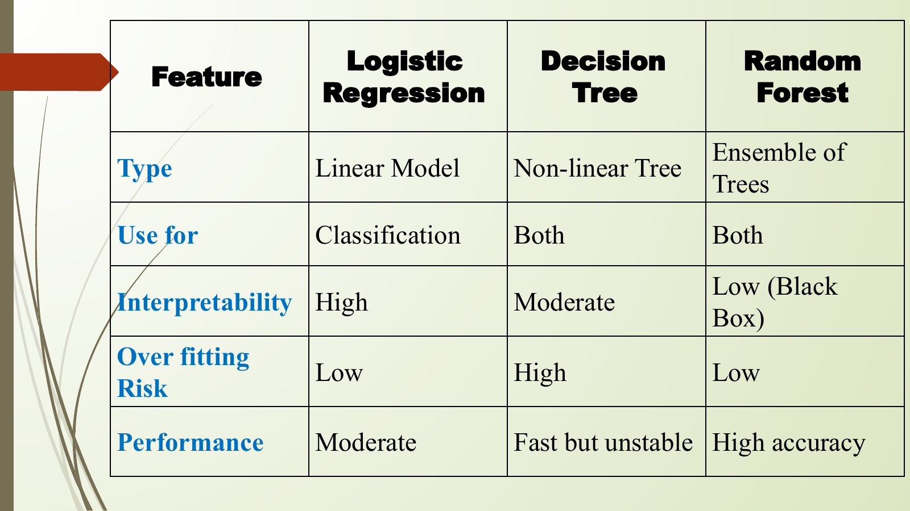

### Extracted Slide Text

- Logistic Decision Random
- Feature
- Regression Tree Forest
- Ensemble of
- Type Linear Model Non-linear Tree
- Trees
- Use for Classification Both Both
- Low (Black
- Interpretability High Moderate
- Box)
- Over fitting
- Low High Low
- Risk
- Performance Moderate Fast but unstable High accuracy

### Page Description And Teaching Notes

Slide type: metric/table slide.
Main idea: Feature Regression Tree Forest Ensemble of Type Linear Model Non-linear Tree Trees Use for Classification Both Both.
This page organizes evaluation or comparison information. Focus on what each metric measures, when it is useful, and what mistake it prevents when judging a machine-learning model.
Detailed page understanding:
- `Feature` is a core visible point. Explain what it means, why it matters, and how it connects to the slide title.
- `Regression Tree Forest` is a core visible point. Explain what it means, why it matters, and how it connects to the slide title.
- `Ensemble of` is a core visible point. Explain what it means, why it matters, and how it connects to the slide title.
- `Type Linear Model Non-linear Tree` is a core visible point. Explain what it means, why it matters, and how it connects to the slide title.
- `Trees` is a core visible point. Explain what it means, why it matters, and how it connects to the slide title.
- `Use for Classification Both Both` is an application/example point. Convert it into a concrete real-world case while teaching.
- `Low (Black` is a core visible point. Explain what it means, why it matters, and how it connects to the slide title.
- `Interpretability High Moderate` is a core visible point. Explain what it means, why it matters, and how it connects to the slide title.
- Additional bullets continue on the slide; use the extracted text list above for the complete wording.
- `Performance Moderate Fast but unstable High accuracy` is a core visible point. Explain what it means, why it matters, and how it connects to the slide title.
Important visible terms: Logistic Decision Random Feature, Regression Tree Forest Ensemble, Type Linear Model Non-linear, Tree Trees Use, Classification Both Both Low, Black Interpretability High Moderate, Box, Over.
Visual/layout description: the embedded image preserves the actual slide. Describe the title area first, then read bullets, formulas, tables, arrows, grouped boxes, or diagrams in their visible order. If the slide contains a diagram, explain the relationship shown by arrows/positioning before explaining the text labels.
Teaching note: after reading the slide, ask the learner to restate the page in one or two sentences and give one example. For formula or metric slides, also ask what each variable or metric means and when it should be used.
Exam/viva note: prepare the slide title as a short-answer question, then use the bullets or visual labels as the expected answer points.

## Page 43: Definition

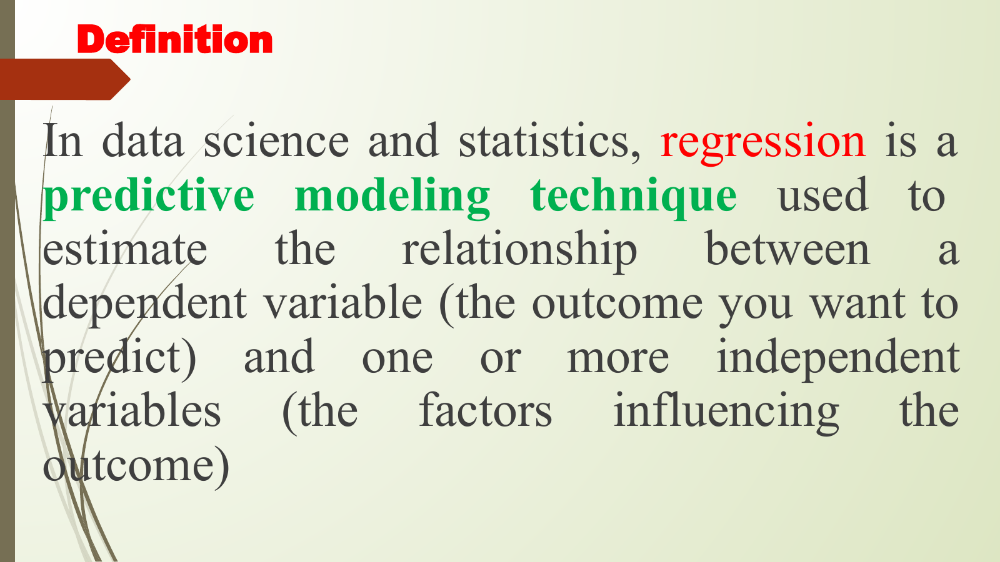

### Extracted Slide Text

- Definition
- In data science and statistics, regression is a
- predictive modeling technique used to
- estimate the relationship between a
- dependent variable (the outcome you want to
- predict) and one or more independent
- variables (the factors influencing the
- outcome)

### Page Description And Teaching Notes

Slide type: concept explanation slide.
Main idea: In data science and statistics, regression is a predictive modeling technique used to estimate the relationship between a dependent variable (the outcome you want to predict) and one or more independent variables (the factors influencing the.
This page explains a core concept in prose. The main task is to convert the definition into a clear statement of what the concept is, why it is used, and where it appears in a machine-learning workflow.
Detailed page understanding:
- `In data science and statistics, regression is a` gives the definition-level meaning. Explain it first in simple words, then connect it to how a model learns from data.
- `predictive modeling technique used to` is an application/example point. Convert it into a concrete real-world case while teaching.
- `estimate the relationship between a` is a core visible point. Explain what it means, why it matters, and how it connects to the slide title.
- `dependent variable (the outcome you want to` is a core visible point. Explain what it means, why it matters, and how it connects to the slide title.
- `predict) and one or more independent` is a core visible point. Explain what it means, why it matters, and how it connects to the slide title.
- `variables (the factors influencing the` is a core visible point. Explain what it means, why it matters, and how it connects to the slide title.
- `outcome)` is a core visible point. Explain what it means, why it matters, and how it connects to the slide title.
Important visible terms: Definition In.
Visual/layout description: the embedded image preserves the actual slide. Describe the title area first, then read bullets, formulas, tables, arrows, grouped boxes, or diagrams in their visible order. If the slide contains a diagram, explain the relationship shown by arrows/positioning before explaining the text labels.
Teaching note: after reading the slide, ask the learner to restate the page in one or two sentences and give one example. For formula or metric slides, also ask what each variable or metric means and when it should be used.
Exam/viva note: prepare the slide title as a short-answer question, then use the bullets or visual labels as the expected answer points.

## Page 44: Linear Regression

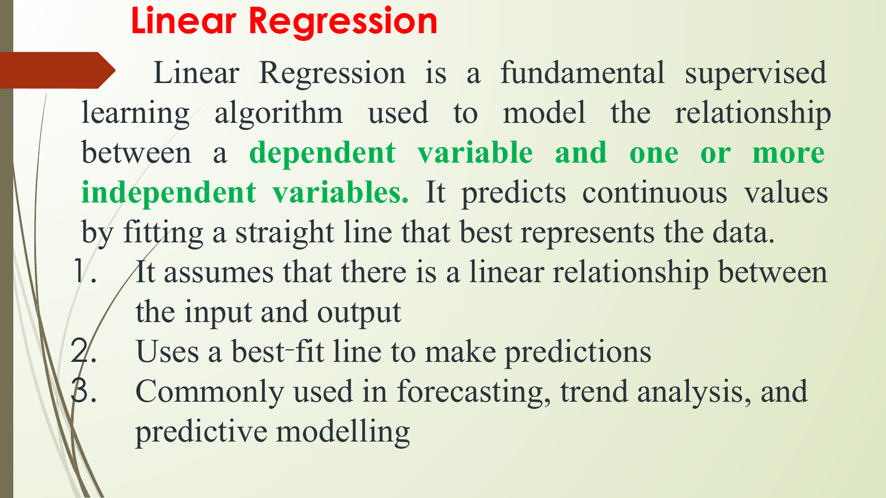

### Extracted Slide Text

- Linear Regression
- Linear Regression is a fundamental supervised
- learning algorithm used to model the relationship
- between a dependent variable and one or more
- independent variables. It predicts continuous values
- by fitting a straight line that best represents the data.
- 1. It assumes that there is a linear relationship between
- the input and output
- 2. Uses a best‑fit line to make predictions
- 3. Commonly used in forecasting, trend analysis, and
- predictive modelling

### Page Description And Teaching Notes

Slide type: bullet explanation slide.
Main idea: Linear Regression is a fundamental supervised learning algorithm used to model the relationship between a dependent variable and one or more independent variables. It predicts continuous values by fitting a straight line that best represents the data. 1. It assumes that there is a linear relationship between.
This page breaks the topic into separate points. Each bullet should be treated as a distinct exam or viva talking point, with the learner able to define it and give a small example.
Detailed page understanding:
- `Linear Regression is a fundamental supervised` gives the definition-level meaning. Explain it first in simple words, then connect it to how a model learns from data.
- `learning algorithm used to model the relationship` is an application/example point. Convert it into a concrete real-world case while teaching.
- `between a dependent variable and one or more` is a core visible point. Explain what it means, why it matters, and how it connects to the slide title.
- `independent variables. It predicts continuous values` is a core visible point. Explain what it means, why it matters, and how it connects to the slide title.
- `by fitting a straight line that best represents the data.` is a core visible point. Explain what it means, why it matters, and how it connects to the slide title.
- `1. It assumes that there is a linear relationship between` gives the definition-level meaning. Explain it first in simple words, then connect it to how a model learns from data.
- `the input and output` is a core visible point. Explain what it means, why it matters, and how it connects to the slide title.
- `2. Uses a best‑fit line to make predictions` is an application/example point. Convert it into a concrete real-world case while teaching.
- `3. Commonly used in forecasting, trend analysis, and` is an application/example point. Convert it into a concrete real-world case while teaching.
- `predictive modelling` is a core visible point. Explain what it means, why it matters, and how it connects to the slide title.
Important visible terms: Linear Regression Linear Regression, Uses, Commonly.
Visual/layout description: the embedded image preserves the actual slide. Describe the title area first, then read bullets, formulas, tables, arrows, grouped boxes, or diagrams in their visible order. If the slide contains a diagram, explain the relationship shown by arrows/positioning before explaining the text labels.
Teaching note: after reading the slide, ask the learner to restate the page in one or two sentences and give one example. For formula or metric slides, also ask what each variable or metric means and when it should be used.
Exam/viva note: prepare the slide title as a short-answer question, then use the bullets or visual labels as the expected answer points.

## Page 45: For example, suppose we want to predict a student’s exam

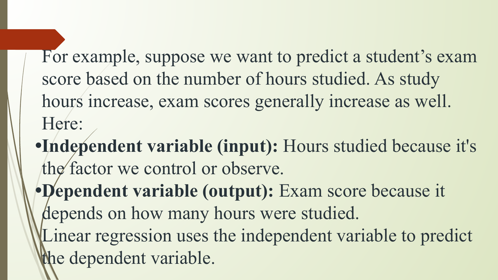

### Extracted Slide Text

- For example, suppose we want to predict a student’s exam
- score based on the number of hours studied. As study
- hours increase, exam scores generally increase as well.
- Here:
- •Independent variable (input): Hours studied because it's
- the factor we control or observe.
- •Dependent variable (output): Exam score because it
- depends on how many hours were studied.
- Linear regression uses the independent variable to predict
- the dependent variable.

### Page Description And Teaching Notes

Slide type: bullet explanation slide.
Main idea: score based on the number of hours studied. As study hours increase, exam scores generally increase as well. Here: •Independent variable (input): Hours studied because it's the factor we control or observe. •Dependent variable (output): Exam score because it.
This page breaks the topic into separate points. Each bullet should be treated as a distinct exam or viva talking point, with the learner able to define it and give a small example.
Detailed page understanding:
- `score based on the number of hours studied. As study` is a core visible point. Explain what it means, why it matters, and how it connects to the slide title.
- `hours increase, exam scores generally increase as well.` is a core visible point. Explain what it means, why it matters, and how it connects to the slide title.
- `Here:` is a core visible point. Explain what it means, why it matters, and how it connects to the slide title.
- `•Independent variable (input): Hours studied because it's` is an application/example point. Convert it into a concrete real-world case while teaching.
- `the factor we control or observe.` is a core visible point. Explain what it means, why it matters, and how it connects to the slide title.
- `•Dependent variable (output): Exam score because it` is an application/example point. Convert it into a concrete real-world case while teaching.
- `depends on how many hours were studied.` is a core visible point. Explain what it means, why it matters, and how it connects to the slide title.
- `Linear regression uses the independent variable to predict` is an application/example point. Convert it into a concrete real-world case while teaching.
- `the dependent variable.` is a core visible point. Explain what it means, why it matters, and how it connects to the slide title.
Important visible terms: For, Here, Independent, Hours, Dependent, Exam, Linear.
Visual/layout description: the embedded image preserves the actual slide. Describe the title area first, then read bullets, formulas, tables, arrows, grouped boxes, or diagrams in their visible order. If the slide contains a diagram, explain the relationship shown by arrows/positioning before explaining the text labels.
Teaching note: after reading the slide, ask the learner to restate the page in one or two sentences and give one example. For formula or metric slides, also ask what each variable or metric means and when it should be used.
Exam/viva note: prepare the slide title as a short-answer question, then use the bullets or visual labels as the expected answer points.

## Page 46: Best Fit Line

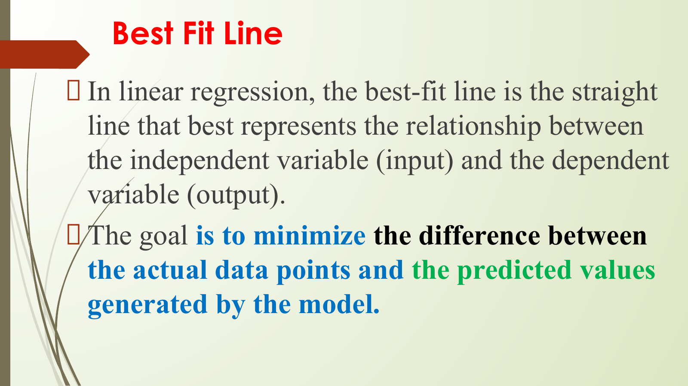

### Extracted Slide Text

- Best Fit Line
- In linear regression, the best-fit line is the straight
- line that best represents the relationship between
- the independent variable (input) and the dependent
- variable (output).
- The goal is to minimize the difference between
- the actual data points and the predicted values
- generated by the model.

### Page Description And Teaching Notes

Slide type: concept explanation slide.
Main idea: In linear regression, the best-fit line is the straight line that best represents the relationship between the independent variable (input) and the dependent variable (output). The goal is to minimize the difference between the actual data points and the predicted values.
This page explains a core concept in prose. The main task is to convert the definition into a clear statement of what the concept is, why it is used, and where it appears in a machine-learning workflow.
Detailed page understanding:
- `In linear regression, the best-fit line is the straight` is a core visible point. Explain what it means, why it matters, and how it connects to the slide title.
- `line that best represents the relationship between` is a core visible point. Explain what it means, why it matters, and how it connects to the slide title.
- `the independent variable (input) and the dependent` is a core visible point. Explain what it means, why it matters, and how it connects to the slide title.
- `variable (output).` is a core visible point. Explain what it means, why it matters, and how it connects to the slide title.
- `The goal is to minimize the difference between` is a core visible point. Explain what it means, why it matters, and how it connects to the slide title.
- `the actual data points and the predicted values` is a core visible point. Explain what it means, why it matters, and how it connects to the slide title.
- `generated by the model.` is a core visible point. Explain what it means, why it matters, and how it connects to the slide title.
Important visible terms: Best Fit Line In, The.
Visual/layout description: the embedded image preserves the actual slide. Describe the title area first, then read bullets, formulas, tables, arrows, grouped boxes, or diagrams in their visible order. If the slide contains a diagram, explain the relationship shown by arrows/positioning before explaining the text labels.
Teaching note: after reading the slide, ask the learner to restate the page in one or two sentences and give one example. For formula or metric slides, also ask what each variable or metric means and when it should be used.
Exam/viva note: prepare the slide title as a short-answer question, then use the bullets or visual labels as the expected answer points.

## Page 47: 1. Goal of the Best-Fit Line

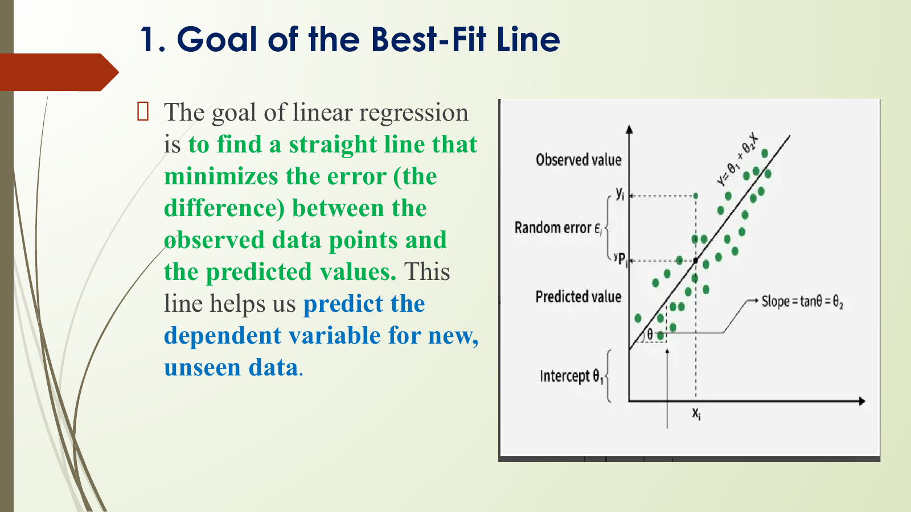

### Extracted Slide Text

- 1. Goal of the Best-Fit Line
- The goal of linear regression
- is to find a straight line that
- minimizes the error (the
- difference) between the
- observed data points and
- the predicted values. This
- line helps us predict the
- dependent variable for new,
- unseen data.

### Page Description And Teaching Notes

Slide type: bullet explanation slide.
Main idea: The goal of linear regression is to find a straight line that minimizes the error (the difference) between the observed data points and the predicted values. This.
This page breaks the topic into separate points. Each bullet should be treated as a distinct exam or viva talking point, with the learner able to define it and give a small example.
Detailed page understanding:
- `The goal of linear regression` is a core visible point. Explain what it means, why it matters, and how it connects to the slide title.
- `is to find a straight line that` is a core visible point. Explain what it means, why it matters, and how it connects to the slide title.
- `minimizes the error (the` is a limitation or risk. Mention when the method may fail and what alternative or precaution can reduce the issue.
- `difference) between the` is a core visible point. Explain what it means, why it matters, and how it connects to the slide title.
- `observed data points and` is a core visible point. Explain what it means, why it matters, and how it connects to the slide title.
- `the predicted values. This` is a core visible point. Explain what it means, why it matters, and how it connects to the slide title.
- `line helps us predict the` states a benefit. Use it to justify why this method or concept is useful in a machine-learning workflow.
- `dependent variable for new,` is a core visible point. Explain what it means, why it matters, and how it connects to the slide title.
- `unseen data.` is a core visible point. Explain what it means, why it matters, and how it connects to the slide title.
Important visible terms: Goal, Best-Fit Line The, This.
Visual/layout description: the embedded image preserves the actual slide. Describe the title area first, then read bullets, formulas, tables, arrows, grouped boxes, or diagrams in their visible order. If the slide contains a diagram, explain the relationship shown by arrows/positioning before explaining the text labels.
Teaching note: after reading the slide, ask the learner to restate the page in one or two sentences and give one example. For formula or metric slides, also ask what each variable or metric means and when it should be used.
Exam/viva note: prepare the slide title as a short-answer question, then use the bullets or visual labels as the expected answer points.

## Page 48: Here Y is called a dependent or target variable and X is called an

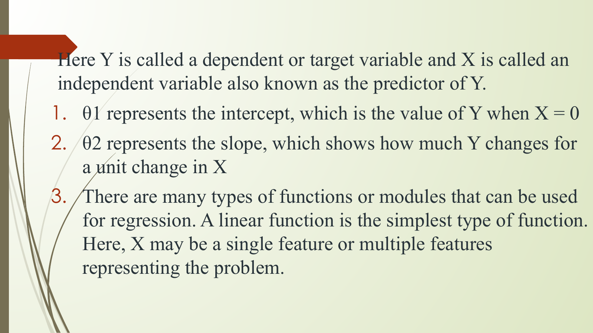

### Extracted Slide Text

- Here Y is called a dependent or target variable and X is called an
- independent variable also known as the predictor of Y.
- 1. θ1 represents the intercept, which is the value of Y when X = 0
- 2. θ2 represents the slope, which shows how much Y changes for
- a unit change in X
- 3. There are many types of functions or modules that can be used
- for regression. A linear function is the simplest type of function.
- Here, X may be a single feature or multiple features
- representing the problem.

### Page Description And Teaching Notes

Slide type: formula or calculation slide.
Main idea: independent variable also known as the predictor of Y. 1. θ1 represents the intercept, which is the value of Y when X = 0 2. θ2 represents the slope, which shows how much Y changes for a unit change in X 3. There are many types of functions or modules that can be used for regression. A linear function is the simplest type of function.
This page should be read carefully because it introduces a calculation, objective, or optimization idea. Identify the variables in the formula, what quantity is being minimized or measured, and how the equation supports model training or evaluation.
Detailed page understanding:
- `independent variable also known as the predictor of Y.` is a core visible point. Explain what it means, why it matters, and how it connects to the slide title.
- `1. θ1 represents the intercept, which is the value of Y when X = 0` is one item in the slide's list. Treat it as a separate subtopic and prepare a one-line explanation for it.
- `2. θ2 represents the slope, which shows how much Y changes for` is one item in the slide's list. Treat it as a separate subtopic and prepare a one-line explanation for it.
- `a unit change in X` is a core visible point. Explain what it means, why it matters, and how it connects to the slide title.
- `3. There are many types of functions or modules that can be used` is an application/example point. Convert it into a concrete real-world case while teaching.
- `for regression. A linear function is the simplest type of function.` is a core visible point. Explain what it means, why it matters, and how it connects to the slide title.
- `Here, X may be a single feature or multiple features` is a core visible point. Explain what it means, why it matters, and how it connects to the slide title.
- `representing the problem.` is a limitation or risk. Mention when the method may fail and what alternative or precaution can reduce the issue.
Important visible terms: Here Y, There, Here.
Visual/layout description: the embedded image preserves the actual slide. Describe the title area first, then read bullets, formulas, tables, arrows, grouped boxes, or diagrams in their visible order. If the slide contains a diagram, explain the relationship shown by arrows/positioning before explaining the text labels.
Teaching note: after reading the slide, ask the learner to restate the page in one or two sentences and give one example. For formula or metric slides, also ask what each variable or metric means and when it should be used.
Exam/viva note: prepare the slide title as a short-answer question, then use the bullets or visual labels as the expected answer points.

## Page 49: 2. Equation of the Best-Fit Line

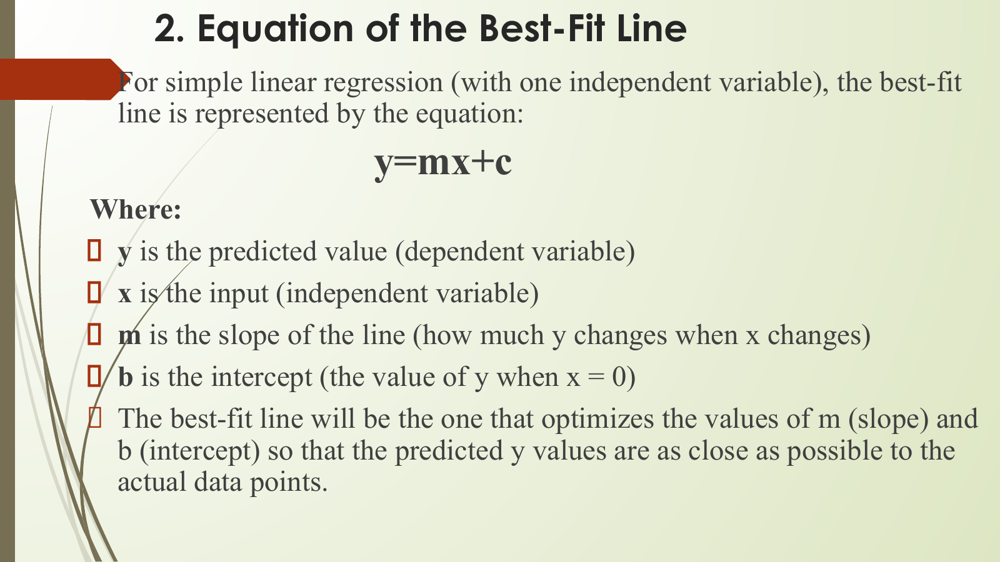

### Extracted Slide Text

- 2. Equation of the Best-Fit Line
- For simple linear regression (with one independent variable), the best-fit
- line is represented by the equation:
- y=mx+c
- Where:
- y is the predicted value (dependent variable)
- x is the input (independent variable)
- m is the slope of the line (how much y changes when x changes)
- b is the intercept (the value of y when x = 0)
- The best-fit line will be the one that optimizes the values of m (slope) and
- b (intercept) so that the predicted y values are as close as possible to the
- actual data points.

### Page Description And Teaching Notes

Slide type: formula or calculation slide.
Main idea: For simple linear regression (with one independent variable), the best-fit line is represented by the equation: y=mx+c Where: y is the predicted value (dependent variable) x is the input (independent variable).
This page should be read carefully because it introduces a calculation, objective, or optimization idea. Identify the variables in the formula, what quantity is being minimized or measured, and how the equation supports model training or evaluation.
Detailed page understanding:
- `For simple linear regression (with one independent variable), the best-fit` is a core visible point. Explain what it means, why it matters, and how it connects to the slide title.
- `line is represented by the equation:` is a core visible point. Explain what it means, why it matters, and how it connects to the slide title.
- `y=mx+c` is a core visible point. Explain what it means, why it matters, and how it connects to the slide title.
- `Where:` is a core visible point. Explain what it means, why it matters, and how it connects to the slide title.
- `y is the predicted value (dependent variable)` is a core visible point. Explain what it means, why it matters, and how it connects to the slide title.
- `x is the input (independent variable)` is a core visible point. Explain what it means, why it matters, and how it connects to the slide title.
- `m is the slope of the line (how much y changes when x changes)` is a core visible point. Explain what it means, why it matters, and how it connects to the slide title.
- `b is the intercept (the value of y when x = 0)` is a core visible point. Explain what it means, why it matters, and how it connects to the slide title.
- Additional bullets continue on the slide; use the extracted text list above for the complete wording.
- `actual data points.` is a core visible point. Explain what it means, why it matters, and how it connects to the slide title.
Important visible terms: Equation, Best-Fit Line For, Where, The.
Visual/layout description: the embedded image preserves the actual slide. Describe the title area first, then read bullets, formulas, tables, arrows, grouped boxes, or diagrams in their visible order. If the slide contains a diagram, explain the relationship shown by arrows/positioning before explaining the text labels.
Teaching note: after reading the slide, ask the learner to restate the page in one or two sentences and give one example. For formula or metric slides, also ask what each variable or metric means and when it should be used.
Exam/viva note: prepare the slide title as a short-answer question, then use the bullets or visual labels as the expected answer points.

## Page 50: 3. Minimizing the Error using the Least Squares

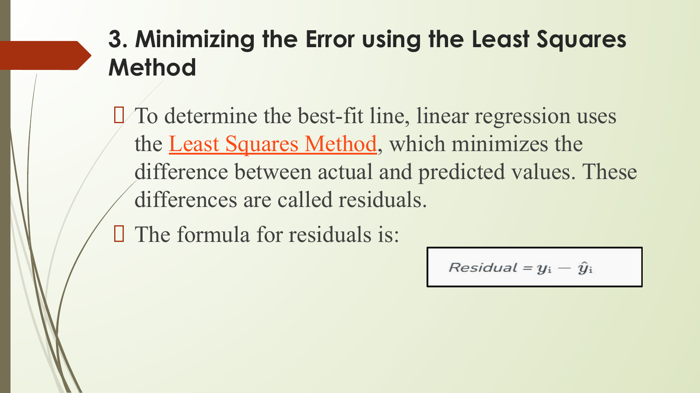

### Extracted Slide Text

- 3. Minimizing the Error using the Least Squares
- Method
- To determine the best-fit line, linear regression uses
- the Least Squares Method, which minimizes the
- difference between actual and predicted values. These
- differences are called residuals.
- The formula for residuals is:

### Page Description And Teaching Notes

Slide type: formula or calculation slide.
Main idea: Method To determine the best-fit line, linear regression uses the Least Squares Method, which minimizes the difference between actual and predicted values. These differences are called residuals. The formula for residuals is:.
This page should be read carefully because it introduces a calculation, objective, or optimization idea. Identify the variables in the formula, what quantity is being minimized or measured, and how the equation supports model training or evaluation.
Detailed page understanding:
- `Method` is a core visible point. Explain what it means, why it matters, and how it connects to the slide title.
- `To determine the best-fit line, linear regression uses` is an application/example point. Convert it into a concrete real-world case while teaching.
- `the Least Squares Method, which minimizes the` is a core visible point. Explain what it means, why it matters, and how it connects to the slide title.
- `difference between actual and predicted values. These` is a core visible point. Explain what it means, why it matters, and how it connects to the slide title.
- `differences are called residuals.` is a core visible point. Explain what it means, why it matters, and how it connects to the slide title.
- `The formula for residuals is:` is a core visible point. Explain what it means, why it matters, and how it connects to the slide title.
Important visible terms: Minimizing, Error, Least Squares Method To, Least Squares Method, These, The.
Visual/layout description: the embedded image preserves the actual slide. Describe the title area first, then read bullets, formulas, tables, arrows, grouped boxes, or diagrams in their visible order. If the slide contains a diagram, explain the relationship shown by arrows/positioning before explaining the text labels.
Teaching note: after reading the slide, ask the learner to restate the page in one or two sentences and give one example. For formula or metric slides, also ask what each variable or metric means and when it should be used.
Exam/viva note: prepare the slide title as a short-answer question, then use the bullets or visual labels as the expected answer points.

## Page 51: Unit II - Supervised Learning (Full Deck) Page 51

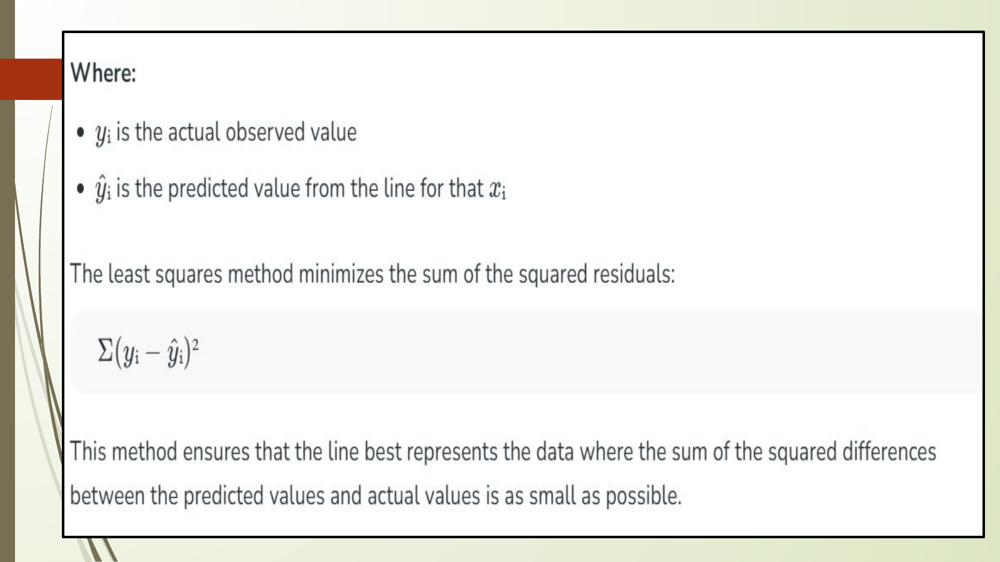

### Extracted Slide Text

- No selectable text extracted from this page.

### Page Description And Teaching Notes

Slide type: visual-only or image-heavy slide.
Main idea: the slide is visual-first, so the image should be treated as the source for the content and structure.
This page is primarily visual. The embedded slide image is the authoritative visual output; read it as a diagram or illustration first, then connect any visible labels to the surrounding pages.
- No reliable selectable text was extracted; use the slide image for the visible diagram, chart, or screenshot.
Visual/layout description: the embedded image preserves the actual slide. Describe the title area first, then read bullets, formulas, tables, arrows, grouped boxes, or diagrams in their visible order. If the slide contains a diagram, explain the relationship shown by arrows/positioning before explaining the text labels.
Teaching note: after reading the slide, ask the learner to restate the page in one or two sentences and give one example. For formula or metric slides, also ask what each variable or metric means and when it should be used.
Exam/viva note: prepare the slide title as a short-answer question, then use the bullets or visual labels as the expected answer points.

## Page 52: 4. Interpretation of the Best-Fit Line

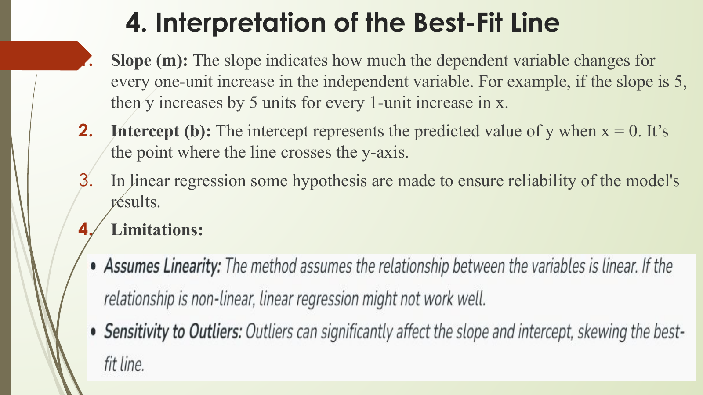

### Extracted Slide Text

- 4. Interpretation of the Best-Fit Line
- 1. Slope (m): The slope indicates how much the dependent variable changes for
- every one-unit increase in the independent variable. For example, if the slope is 5,
- then y increases by 5 units for every 1-unit increase in x.
- 2. Intercept (b): The intercept represents the predicted value of y when x = 0. It’s
- the point where the line crosses the y-axis.
- 3. In linear regression some hypothesis are made to ensure reliability of the model's
- results.
- 4. Limitations:

### Page Description And Teaching Notes

Slide type: formula or calculation slide.
Main idea: 1. Slope (m): The slope indicates how much the dependent variable changes for every one-unit increase in the independent variable. For example, if the slope is 5, then y increases by 5 units for every 1-unit increase in x. 2. Intercept (b): The intercept represents the predicted value of y when x = 0. It’s the point where the line crosses the y-axis. 3. In linear regression some hypothesis are made to ensure reliability of the model's.
This page should be read carefully because it introduces a calculation, objective, or optimization idea. Identify the variables in the formula, what quantity is being minimized or measured, and how the equation supports model training or evaluation.
Detailed page understanding:
- `1. Slope (m): The slope indicates how much the dependent variable changes for` is one item in the slide's list. Treat it as a separate subtopic and prepare a one-line explanation for it.
- `every one-unit increase in the independent variable. For example, if the slope is 5,` is an application/example point. Convert it into a concrete real-world case while teaching.
- `then y increases by 5 units for every 1-unit increase in x.` is a core visible point. Explain what it means, why it matters, and how it connects to the slide title.
- `2. Intercept (b): The intercept represents the predicted value of y when x = 0. It’s` is one item in the slide's list. Treat it as a separate subtopic and prepare a one-line explanation for it.
- `the point where the line crosses the y-axis.` is a core visible point. Explain what it means, why it matters, and how it connects to the slide title.
- `3. In linear regression some hypothesis are made to ensure reliability of the model's` gives the definition-level meaning. Explain it first in simple words, then connect it to how a model learns from data.
- `results.` is a core visible point. Explain what it means, why it matters, and how it connects to the slide title.
- `4. Limitations:` is a limitation or risk. Mention when the method may fail and what alternative or precaution can reduce the issue.
Important visible terms: Interpretation, Best-Fit Line, Slope, The, For, Intercept, Limitations.
Visual/layout description: the embedded image preserves the actual slide. Describe the title area first, then read bullets, formulas, tables, arrows, grouped boxes, or diagrams in their visible order. If the slide contains a diagram, explain the relationship shown by arrows/positioning before explaining the text labels.
Teaching note: after reading the slide, ask the learner to restate the page in one or two sentences and give one example. For formula or metric slides, also ask what each variable or metric means and when it should be used.
Exam/viva note: prepare the slide title as a short-answer question, then use the bullets or visual labels as the expected answer points.

## Page 53: Hypothesis Function

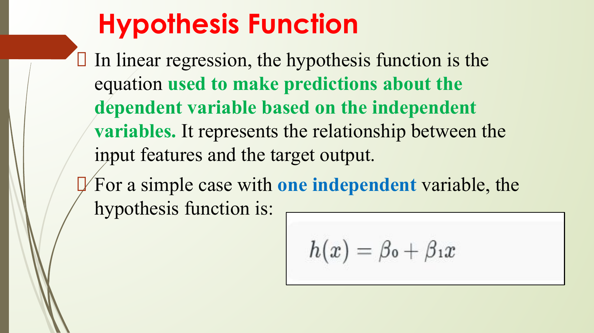

### Extracted Slide Text

- Hypothesis Function
- In linear regression, the hypothesis function is the
- equation used to make predictions about the
- dependent variable based on the independent
- variables. It represents the relationship between the
- input features and the target output.
- For a simple case with one independent variable, the
- hypothesis function is:

### Page Description And Teaching Notes

Slide type: formula or calculation slide.
Main idea: In linear regression, the hypothesis function is the equation used to make predictions about the dependent variable based on the independent variables. It represents the relationship between the input features and the target output. For a simple case with one independent variable, the.
This page should be read carefully because it introduces a calculation, objective, or optimization idea. Identify the variables in the formula, what quantity is being minimized or measured, and how the equation supports model training or evaluation.
Detailed page understanding:
- `In linear regression, the hypothesis function is the` is a core visible point. Explain what it means, why it matters, and how it connects to the slide title.
- `equation used to make predictions about the` is an application/example point. Convert it into a concrete real-world case while teaching.
- `dependent variable based on the independent` is a core visible point. Explain what it means, why it matters, and how it connects to the slide title.
- `variables. It represents the relationship between the` is a core visible point. Explain what it means, why it matters, and how it connects to the slide title.
- `input features and the target output.` is a core visible point. Explain what it means, why it matters, and how it connects to the slide title.
- `For a simple case with one independent variable, the` is a core visible point. Explain what it means, why it matters, and how it connects to the slide title.
- `hypothesis function is:` is a core visible point. Explain what it means, why it matters, and how it connects to the slide title.
Important visible terms: Hypothesis Function In, For.
Visual/layout description: the embedded image preserves the actual slide. Describe the title area first, then read bullets, formulas, tables, arrows, grouped boxes, or diagrams in their visible order. If the slide contains a diagram, explain the relationship shown by arrows/positioning before explaining the text labels.
Teaching note: after reading the slide, ask the learner to restate the page in one or two sentences and give one example. For formula or metric slides, also ask what each variable or metric means and when it should be used.
Exam/viva note: prepare the slide title as a short-answer question, then use the bullets or visual labels as the expected answer points.

## Page 54: For one independent variable

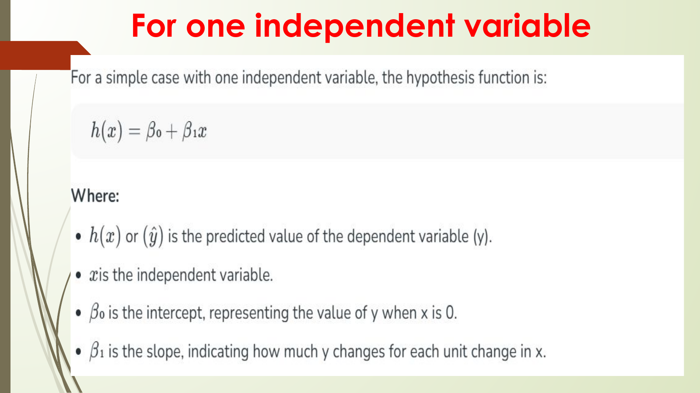

### Extracted Slide Text

- For one independent variable

### Page Description And Teaching Notes

Slide type: title or transition slide.
Main idea: the slide is visual-first, so the image should be treated as the source for the content and structure.
This page sets the context for the next topic. Treat it as a section marker: it tells the learner what concept or unit is starting before the deck moves into definitions, examples, or formulas.
- No reliable selectable text was extracted; use the slide image for the visible diagram, chart, or screenshot.
Important visible terms: For.
Visual/layout description: the embedded image preserves the actual slide. Describe the title area first, then read bullets, formulas, tables, arrows, grouped boxes, or diagrams in their visible order. If the slide contains a diagram, explain the relationship shown by arrows/positioning before explaining the text labels.
Teaching note: after reading the slide, ask the learner to restate the page in one or two sentences and give one example. For formula or metric slides, also ask what each variable or metric means and when it should be used.
Exam/viva note: prepare the slide title as a short-answer question, then use the bullets or visual labels as the expected answer points.

## Page 55: For more than one independent

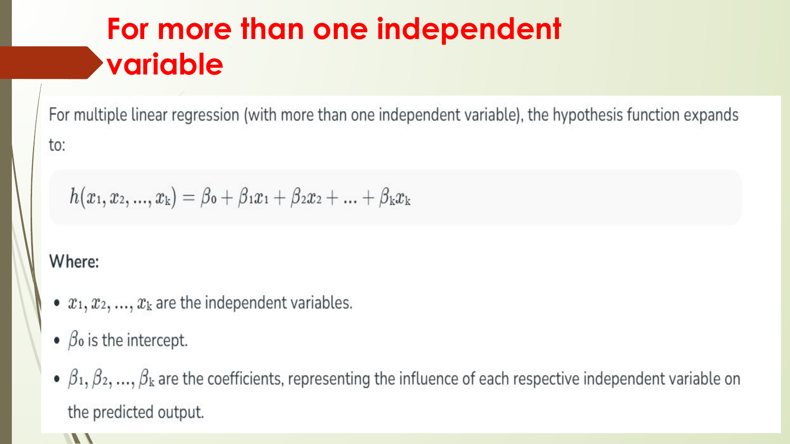

### Extracted Slide Text

- For more than one independent
- variable

### Page Description And Teaching Notes

Slide type: title or transition slide.
Main idea: variable.
This page sets the context for the next topic. Treat it as a section marker: it tells the learner what concept or unit is starting before the deck moves into definitions, examples, or formulas.
Detailed page understanding:
- `variable` is a core visible point. Explain what it means, why it matters, and how it connects to the slide title.
Important visible terms: For.
Visual/layout description: the embedded image preserves the actual slide. Describe the title area first, then read bullets, formulas, tables, arrows, grouped boxes, or diagrams in their visible order. If the slide contains a diagram, explain the relationship shown by arrows/positioning before explaining the text labels.
Teaching note: after reading the slide, ask the learner to restate the page in one or two sentences and give one example. For formula or metric slides, also ask what each variable or metric means and when it should be used.
Exam/viva note: prepare the slide title as a short-answer question, then use the bullets or visual labels as the expected answer points.

## Page 56: Cost Function

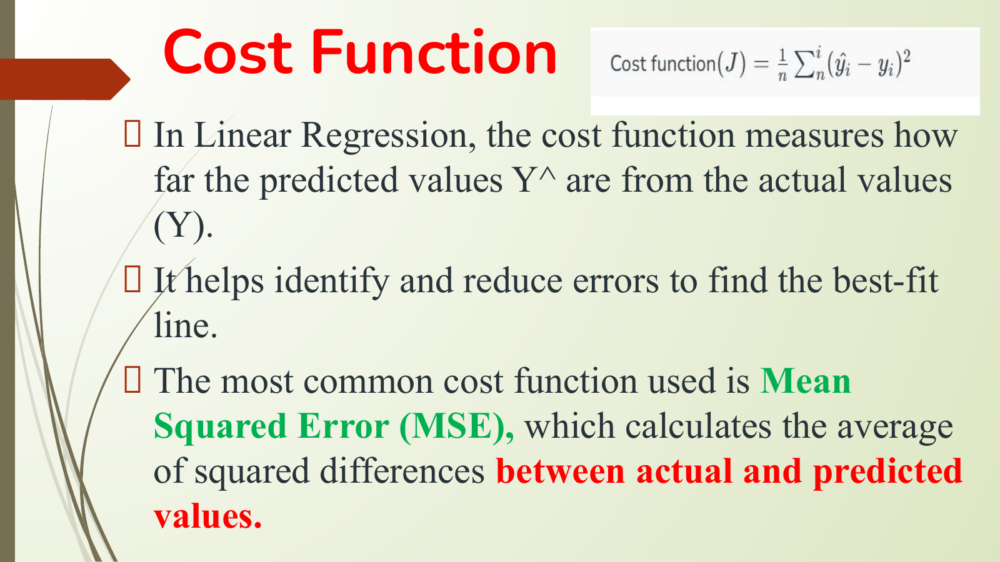

### Extracted Slide Text

- Cost Function
- In Linear Regression, the cost function measures how
- far the predicted values Y^ are from the actual values
- (Y).
- It helps identify and reduce errors to find the best-fit
- line.
- The most common cost function used is Mean
- Squared Error (MSE), which calculates the average
- of squared differences between actual and predicted
- values.

### Page Description And Teaching Notes

Slide type: formula or calculation slide.
Main idea: In Linear Regression, the cost function measures how far the predicted values Y^ are from the actual values (Y). It helps identify and reduce errors to find the best-fit line. The most common cost function used is Mean.
This page should be read carefully because it introduces a calculation, objective, or optimization idea. Identify the variables in the formula, what quantity is being minimized or measured, and how the equation supports model training or evaluation.
Detailed page understanding:
- `In Linear Regression, the cost function measures how` is a core visible point. Explain what it means, why it matters, and how it connects to the slide title.
- `far the predicted values Y^ are from the actual values` is a core visible point. Explain what it means, why it matters, and how it connects to the slide title.
- `(Y).` is a core visible point. Explain what it means, why it matters, and how it connects to the slide title.
- `It helps identify and reduce errors to find the best-fit` states a benefit. Use it to justify why this method or concept is useful in a machine-learning workflow.
- `line.` is a core visible point. Explain what it means, why it matters, and how it connects to the slide title.
- `The most common cost function used is Mean` is an application/example point. Convert it into a concrete real-world case while teaching.
- `Squared Error (MSE), which calculates the average` is a limitation or risk. Mention when the method may fail and what alternative or precaution can reduce the issue.
- `of squared differences between actual and predicted` is a core visible point. Explain what it means, why it matters, and how it connects to the slide title.
- `values.` is a core visible point. Explain what it means, why it matters, and how it connects to the slide title.
Important visible terms: Cost Function In Linear, Regression, The, Mean Squared Error, MSE.
Visual/layout description: the embedded image preserves the actual slide. Describe the title area first, then read bullets, formulas, tables, arrows, grouped boxes, or diagrams in their visible order. If the slide contains a diagram, explain the relationship shown by arrows/positioning before explaining the text labels.
Teaching note: after reading the slide, ask the learner to restate the page in one or two sentences and give one example. For formula or metric slides, also ask what each variable or metric means and when it should be used.
Exam/viva note: prepare the slide title as a short-answer question, then use the bullets or visual labels as the expected answer points.

## Page 57: Unit II - Supervised Learning (Full Deck) Page 57

### Extracted Slide Text

- No selectable text extracted from this page.

### Page Description And Teaching Notes

Slide type: visual-only or image-heavy slide.
Main idea: the slide is visual-first, so the image should be treated as the source for the content and structure.
This page is primarily visual. The embedded slide image is the authoritative visual output; read it as a diagram or illustration first, then connect any visible labels to the surrounding pages.
- No reliable selectable text was extracted; use the slide image for the visible diagram, chart, or screenshot.
Visual/layout description: the embedded image preserves the actual slide. Describe the title area first, then read bullets, formulas, tables, arrows, grouped boxes, or diagrams in their visible order. If the slide contains a diagram, explain the relationship shown by arrows/positioning before explaining the text labels.
Teaching note: after reading the slide, ask the learner to restate the page in one or two sentences and give one example. For formula or metric slides, also ask what each variable or metric means and when it should be used.
Exam/viva note: prepare the slide title as a short-answer question, then use the bullets or visual labels as the expected answer points.

## Page 58: Gradient Descent

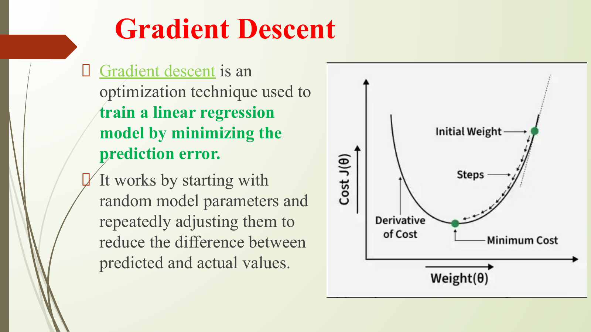

### Extracted Slide Text

- Gradient Descent
- Gradient descent is an
- optimization technique used to
- train a linear regression
- model by minimizing the
- prediction error.
- It works by starting with
- random model parameters and
- repeatedly adjusting them to
- reduce the difference between
- predicted and actual values.

### Page Description And Teaching Notes

Slide type: concept explanation slide.
Main idea: Gradient descent is an optimization technique used to train a linear regression model by minimizing the prediction error. It works by starting with.
This page explains a core concept in prose. The main task is to convert the definition into a clear statement of what the concept is, why it is used, and where it appears in a machine-learning workflow.
Detailed page understanding:
- `Gradient descent is an` gives the definition-level meaning. Explain it first in simple words, then connect it to how a model learns from data.
- `optimization technique used to` is an application/example point. Convert it into a concrete real-world case while teaching.
- `train a linear regression` is a core visible point. Explain what it means, why it matters, and how it connects to the slide title.
- `model by minimizing the` is a core visible point. Explain what it means, why it matters, and how it connects to the slide title.
- `prediction error.` is a limitation or risk. Mention when the method may fail and what alternative or precaution can reduce the issue.
- `It works by starting with` is a core visible point. Explain what it means, why it matters, and how it connects to the slide title.
- `random model parameters and` is a core visible point. Explain what it means, why it matters, and how it connects to the slide title.
- `repeatedly adjusting them to` is a core visible point. Explain what it means, why it matters, and how it connects to the slide title.
- `reduce the difference between` is a core visible point. Explain what it means, why it matters, and how it connects to the slide title.
- `predicted and actual values.` is a core visible point. Explain what it means, why it matters, and how it connects to the slide title.
Important visible terms: Gradient Descent Gradient.
Visual/layout description: the embedded image preserves the actual slide. Describe the title area first, then read bullets, formulas, tables, arrows, grouped boxes, or diagrams in their visible order. If the slide contains a diagram, explain the relationship shown by arrows/positioning before explaining the text labels.
Teaching note: after reading the slide, ask the learner to restate the page in one or two sentences and give one example. For formula or metric slides, also ask what each variable or metric means and when it should be used.
Exam/viva note: prepare the slide title as a short-answer question, then use the bullets or visual labels as the expected answer points.

## Page 59: How it works:

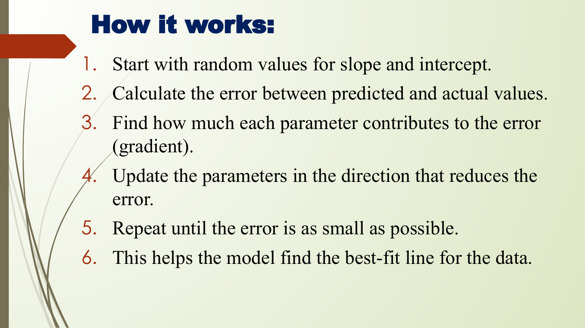

### Extracted Slide Text

- How it works:
- 1. Start with random values for slope and intercept.
- 2. Calculate the error between predicted and actual values.
- 3. Find how much each parameter contributes to the error
- (gradient).
- 4. Update the parameters in the direction that reduces the
- error.
- 5. Repeat until the error is as small as possible.
- 6. This helps the model find the best-fit line for the data.

### Page Description And Teaching Notes

Slide type: bullet explanation slide.
Main idea: 1. Start with random values for slope and intercept. 2. Calculate the error between predicted and actual values. 3. Find how much each parameter contributes to the error (gradient). 4. Update the parameters in the direction that reduces the error.
This page breaks the topic into separate points. Each bullet should be treated as a distinct exam or viva talking point, with the learner able to define it and give a small example.
Detailed page understanding:
- `1. Start with random values for slope and intercept.` is one item in the slide's list. Treat it as a separate subtopic and prepare a one-line explanation for it.
- `2. Calculate the error between predicted and actual values.` is a limitation or risk. Mention when the method may fail and what alternative or precaution can reduce the issue.
- `3. Find how much each parameter contributes to the error` is a limitation or risk. Mention when the method may fail and what alternative or precaution can reduce the issue.
- `(gradient).` is a core visible point. Explain what it means, why it matters, and how it connects to the slide title.
- `4. Update the parameters in the direction that reduces the` is one item in the slide's list. Treat it as a separate subtopic and prepare a one-line explanation for it.
- `error.` is a limitation or risk. Mention when the method may fail and what alternative or precaution can reduce the issue.
- `5. Repeat until the error is as small as possible.` gives the definition-level meaning. Explain it first in simple words, then connect it to how a model learns from data.
- `6. This helps the model find the best-fit line for the data.` states a benefit. Use it to justify why this method or concept is useful in a machine-learning workflow.
Important visible terms: How, Start, Calculate, Find, Update, Repeat, This.
Visual/layout description: the embedded image preserves the actual slide. Describe the title area first, then read bullets, formulas, tables, arrows, grouped boxes, or diagrams in their visible order. If the slide contains a diagram, explain the relationship shown by arrows/positioning before explaining the text labels.
Teaching note: after reading the slide, ask the learner to restate the page in one or two sentences and give one example. For formula or metric slides, also ask what each variable or metric means and when it should be used.
Exam/viva note: prepare the slide title as a short-answer question, then use the bullets or visual labels as the expected answer points.

## Page 60: Evaluation Metrics

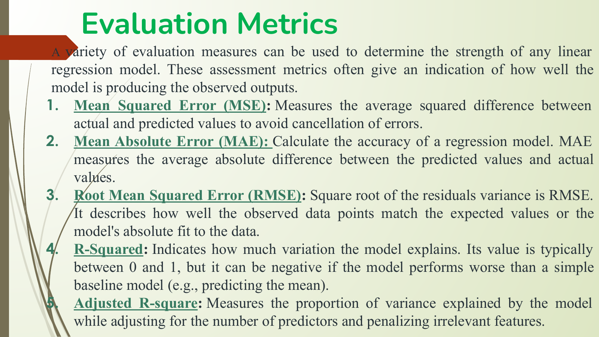

### Extracted Slide Text

- Evaluation Metrics
- A variety of evaluation measures can be used to determine the strength of any linear
- regression model. These assessment metrics often give an indication of how well the
- model is producing the observed outputs.
- 1. Mean Squared Error (MSE): Measures the average squared difference between
- actual and predicted values to avoid cancellation of errors.
- 2. Mean Absolute Error (MAE): Calculate the accuracy of a regression model. MAE
- measures the average absolute difference between the predicted values and actual
- values.
- 3. Root Mean Squared Error (RMSE): Square root of the residuals variance is RMSE.
- It describes how well the observed data points match the expected values or the
- model's absolute fit to the data.
- 4. R-Squared: Indicates how much variation the model explains. Its value is typically
- between 0 and 1, but it can be negative if the model performs worse than a simple
- baseline model (e.g., predicting the mean).
- 5. Adjusted R-square: Measures the proportion of variance explained by the model
- while adjusting for the number of predictors and penalizing irrelevant features.

### Page Description And Teaching Notes

Slide type: metric/table slide.
Main idea: A variety of evaluation measures can be used to determine the strength of any linear regression model. These assessment metrics often give an indication of how well the model is producing the observed outputs. 1. Mean Squared Error (MSE): Measures the average squared difference between actual and predicted values to avoid cancellation of errors. 2. Mean Absolute Error (MAE): Calculate the accuracy of a regression model. MAE.
This page organizes evaluation or comparison information. Focus on what each metric measures, when it is useful, and what mistake it prevents when judging a machine-learning model.
Detailed page understanding:
- `A variety of evaluation measures can be used to determine the strength of any linear` is an application/example point. Convert it into a concrete real-world case while teaching.
- `regression model. These assessment metrics often give an indication of how well the` is a core visible point. Explain what it means, why it matters, and how it connects to the slide title.
- `model is producing the observed outputs.` is a core visible point. Explain what it means, why it matters, and how it connects to the slide title.
- `1. Mean Squared Error (MSE): Measures the average squared difference between` is a limitation or risk. Mention when the method may fail and what alternative or precaution can reduce the issue.
- `actual and predicted values to avoid cancellation of errors.` is a limitation or risk. Mention when the method may fail and what alternative or precaution can reduce the issue.
- `2. Mean Absolute Error (MAE): Calculate the accuracy of a regression model. MAE` is a limitation or risk. Mention when the method may fail and what alternative or precaution can reduce the issue.
- `measures the average absolute difference between the predicted values and actual` is a core visible point. Explain what it means, why it matters, and how it connects to the slide title.
- `values.` is a core visible point. Explain what it means, why it matters, and how it connects to the slide title.
- Additional bullets continue on the slide; use the extracted text list above for the complete wording.
- `while adjusting for the number of predictors and penalizing irrelevant features.` is a core visible point. Explain what it means, why it matters, and how it connects to the slide title.
Important visible terms: Evaluation Metrics A, These, Mean Squared Error, MSE, Measures, Mean Absolute Error, MAE, Calculate.
Visual/layout description: the embedded image preserves the actual slide. Describe the title area first, then read bullets, formulas, tables, arrows, grouped boxes, or diagrams in their visible order. If the slide contains a diagram, explain the relationship shown by arrows/positioning before explaining the text labels.
Teaching note: after reading the slide, ask the learner to restate the page in one or two sentences and give one example. For formula or metric slides, also ask what each variable or metric means and when it should be used.
Exam/viva note: prepare the slide title as a short-answer question, then use the bullets or visual labels as the expected answer points.

## Page 61: Applications

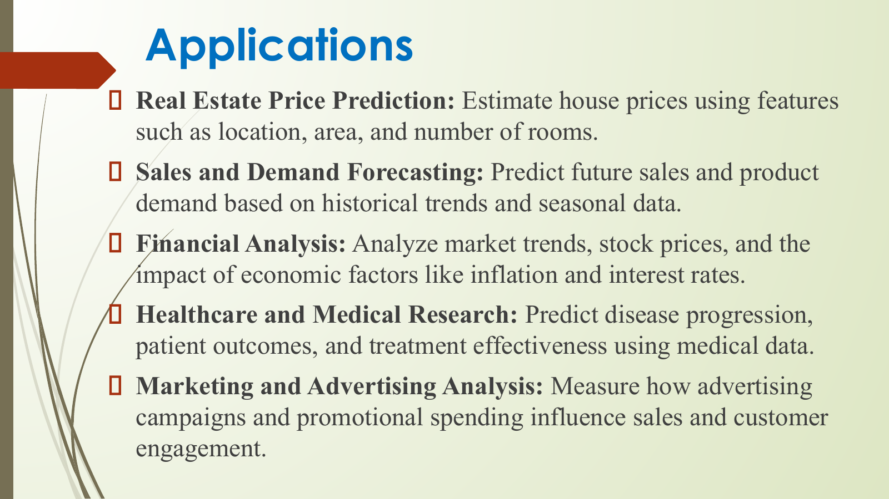

### Extracted Slide Text

- Applications
- Real Estate Price Prediction: Estimate house prices using features
- such as location, area, and number of rooms.
- Sales and Demand Forecasting: Predict future sales and product
- demand based on historical trends and seasonal data.
- Financial Analysis: Analyze market trends, stock prices, and the
- impact of economic factors like inflation and interest rates.
- Healthcare and Medical Research: Predict disease progression,
- patient outcomes, and treatment effectiveness using medical data.
- Marketing and Advertising Analysis: Measure how advertising
- campaigns and promotional spending influence sales and customer
- engagement.

### Page Description And Teaching Notes

Slide type: concept explanation slide.
Main idea: Real Estate Price Prediction: Estimate house prices using features such as location, area, and number of rooms. Sales and Demand Forecasting: Predict future sales and product demand based on historical trends and seasonal data. Financial Analysis: Analyze market trends, stock prices, and the impact of economic factors like inflation and interest rates.
This page explains a core concept in prose. The main task is to convert the definition into a clear statement of what the concept is, why it is used, and where it appears in a machine-learning workflow.
Detailed page understanding:
- `Real Estate Price Prediction: Estimate house prices using features` is an application/example point. Convert it into a concrete real-world case while teaching.
- `such as location, area, and number of rooms.` is a core visible point. Explain what it means, why it matters, and how it connects to the slide title.
- `Sales and Demand Forecasting: Predict future sales and product` is a core visible point. Explain what it means, why it matters, and how it connects to the slide title.
- `demand based on historical trends and seasonal data.` is a core visible point. Explain what it means, why it matters, and how it connects to the slide title.
- `Financial Analysis: Analyze market trends, stock prices, and the` is a core visible point. Explain what it means, why it matters, and how it connects to the slide title.
- `impact of economic factors like inflation and interest rates.` is a core visible point. Explain what it means, why it matters, and how it connects to the slide title.
- `Healthcare and Medical Research: Predict disease progression,` is a core visible point. Explain what it means, why it matters, and how it connects to the slide title.
- `patient outcomes, and treatment effectiveness using medical data.` is a core visible point. Explain what it means, why it matters, and how it connects to the slide title.
- Additional bullets continue on the slide; use the extracted text list above for the complete wording.
- `engagement.` is a core visible point. Explain what it means, why it matters, and how it connects to the slide title.
Important visible terms: Applications Real Estate Price, Prediction, Estimate, Sales, Demand Forecasting, Predict, Financial Analysis, Analyze.
Visual/layout description: the embedded image preserves the actual slide. Describe the title area first, then read bullets, formulas, tables, arrows, grouped boxes, or diagrams in their visible order. If the slide contains a diagram, explain the relationship shown by arrows/positioning before explaining the text labels.
Teaching note: after reading the slide, ask the learner to restate the page in one or two sentences and give one example. For formula or metric slides, also ask what each variable or metric means and when it should be used.
Exam/viva note: prepare the slide title as a short-answer question, then use the bullets or visual labels as the expected answer points.

## Page 62: Confusion Matrix

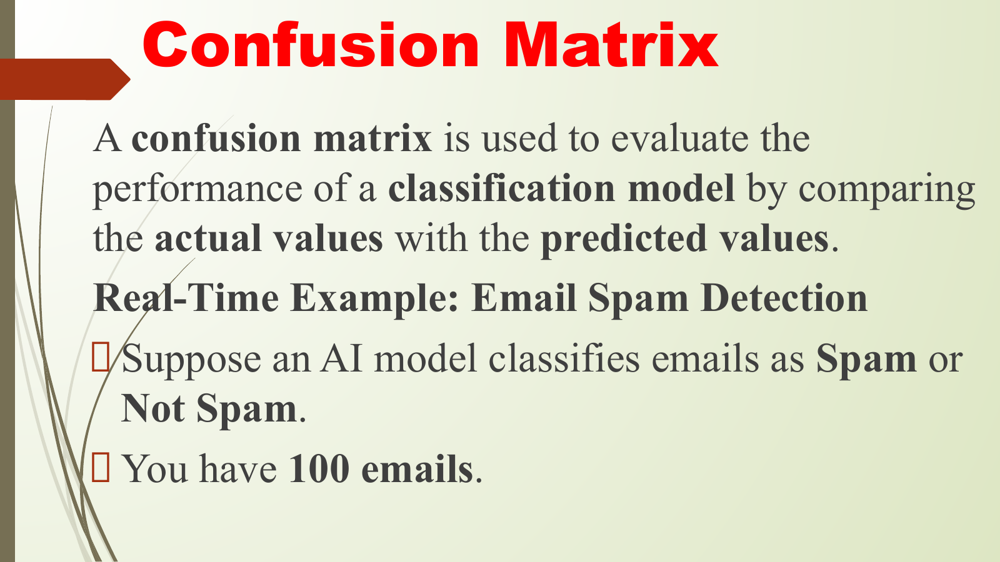

### Extracted Slide Text

- Confusion Matrix
- A confusion matrix is used to evaluate the
- performance of a classification model by comparing
- the actual values with the predicted values.
- Real-Time Example: Email Spam Detection
- Suppose an AI model classifies emails as Spam or
- Not Spam.
- You have 100 emails.

### Page Description And Teaching Notes

Slide type: metric/table slide.
Main idea: A confusion matrix is used to evaluate the performance of a classification model by comparing the actual values with the predicted values. Real-Time Example: Email Spam Detection Suppose an AI model classifies emails as Spam or Not Spam.
This page organizes evaluation or comparison information. Focus on what each metric measures, when it is useful, and what mistake it prevents when judging a machine-learning model.
Detailed page understanding:
- `A confusion matrix is used to evaluate the` is an application/example point. Convert it into a concrete real-world case while teaching.
- `performance of a classification model by comparing` is a core visible point. Explain what it means, why it matters, and how it connects to the slide title.
- `the actual values with the predicted values.` is a core visible point. Explain what it means, why it matters, and how it connects to the slide title.
- `Real-Time Example: Email Spam Detection` is an application/example point. Convert it into a concrete real-world case while teaching.
- `Suppose an AI model classifies emails as Spam or` is a core visible point. Explain what it means, why it matters, and how it connects to the slide title.
- `Not Spam.` is a core visible point. Explain what it means, why it matters, and how it connects to the slide title.
- `You have 100 emails.` is a core visible point. Explain what it means, why it matters, and how it connects to the slide title.
Important visible terms: Confusion Matrix A, Real-Time Example, Email Spam Detection Suppose, Spam, Not Spam, You.
Visual/layout description: the embedded image preserves the actual slide. Describe the title area first, then read bullets, formulas, tables, arrows, grouped boxes, or diagrams in their visible order. If the slide contains a diagram, explain the relationship shown by arrows/positioning before explaining the text labels.
Teaching note: after reading the slide, ask the learner to restate the page in one or two sentences and give one example. For formula or metric slides, also ask what each variable or metric means and when it should be used.
Exam/viva note: prepare the slide title as a short-answer question, then use the bullets or visual labels as the expected answer points.

## Page 63: Predicted

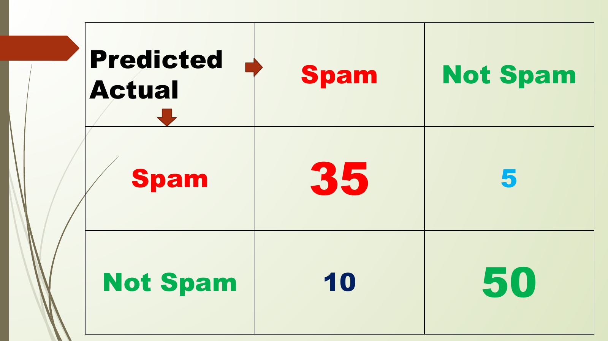

### Extracted Slide Text

- Predicted
- Spam Not Spam
- Actual
- Spam 35 5
- Not Spam 10 50

### Page Description And Teaching Notes

Slide type: concept explanation slide.
Main idea: Spam Not Spam Actual Spam 35 5 Not Spam 10 50.
This page explains a core concept in prose. The main task is to convert the definition into a clear statement of what the concept is, why it is used, and where it appears in a machine-learning workflow.
Detailed page understanding:
- `Spam Not Spam` is a core visible point. Explain what it means, why it matters, and how it connects to the slide title.
- `Actual` is a core visible point. Explain what it means, why it matters, and how it connects to the slide title.
- `Spam 35 5` is a core visible point. Explain what it means, why it matters, and how it connects to the slide title.
- `Not Spam 10 50` is a core visible point. Explain what it means, why it matters, and how it connects to the slide title.
Important visible terms: Predicted Spam Not Spam, Actual Spam, Not Spam.
Visual/layout description: the embedded image preserves the actual slide. Describe the title area first, then read bullets, formulas, tables, arrows, grouped boxes, or diagrams in their visible order. If the slide contains a diagram, explain the relationship shown by arrows/positioning before explaining the text labels.
Teaching note: after reading the slide, ask the learner to restate the page in one or two sentences and give one example. For formula or metric slides, also ask what each variable or metric means and when it should be used.
Exam/viva note: prepare the slide title as a short-answer question, then use the bullets or visual labels as the expected answer points.

## Page 64: Understanding Each Term

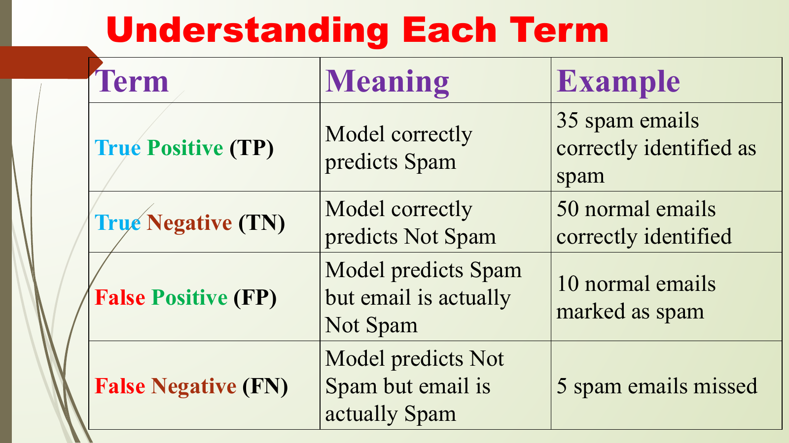

### Extracted Slide Text

- Understanding Each Term
- Term Meaning Example
- 35 spam emails
- Model correctly
- True Positive (TP) correctly identified as
- predicts Spam
- spam
- Model correctly 50 normal emails
- True Negative (TN)
- predicts Not Spam correctly identified
- Model predicts Spam
- 10 normal emails
- False Positive (FP) but email is actually
- marked as spam
- Not Spam
- Model predicts Not
- False Negative (FN) Spam but email is 5 spam emails missed
- actually Spam

### Page Description And Teaching Notes

Slide type: concept explanation slide.
Main idea: Term Meaning Example 35 spam emails Model correctly True Positive (TP) correctly identified as predicts Spam spam.
This page explains a core concept in prose. The main task is to convert the definition into a clear statement of what the concept is, why it is used, and where it appears in a machine-learning workflow.
Detailed page understanding:
- `Term Meaning Example` is an application/example point. Convert it into a concrete real-world case while teaching.
- `35 spam emails` is a core visible point. Explain what it means, why it matters, and how it connects to the slide title.
- `Model correctly` is a core visible point. Explain what it means, why it matters, and how it connects to the slide title.
- `True Positive (TP) correctly identified as` is a core visible point. Explain what it means, why it matters, and how it connects to the slide title.
- `predicts Spam` is a core visible point. Explain what it means, why it matters, and how it connects to the slide title.
- `spam` is a core visible point. Explain what it means, why it matters, and how it connects to the slide title.
- `Model correctly 50 normal emails` is a core visible point. Explain what it means, why it matters, and how it connects to the slide title.
- `True Negative (TN)` is a core visible point. Explain what it means, why it matters, and how it connects to the slide title.
- Additional bullets continue on the slide; use the extracted text list above for the complete wording.
- `actually Spam` is a core visible point. Explain what it means, why it matters, and how it connects to the slide title.
Important visible terms: Understanding Each Term Term, Meaning Example, Model, True Positive, Spam, True Negative, Not Spam, False Positive.
Visual/layout description: the embedded image preserves the actual slide. Describe the title area first, then read bullets, formulas, tables, arrows, grouped boxes, or diagrams in their visible order. If the slide contains a diagram, explain the relationship shown by arrows/positioning before explaining the text labels.
Teaching note: after reading the slide, ask the learner to restate the page in one or two sentences and give one example. For formula or metric slides, also ask what each variable or metric means and when it should be used.
Exam/viva note: prepare the slide title as a short-answer question, then use the bullets or visual labels as the expected answer points.

## Page 65: Performance Metrics

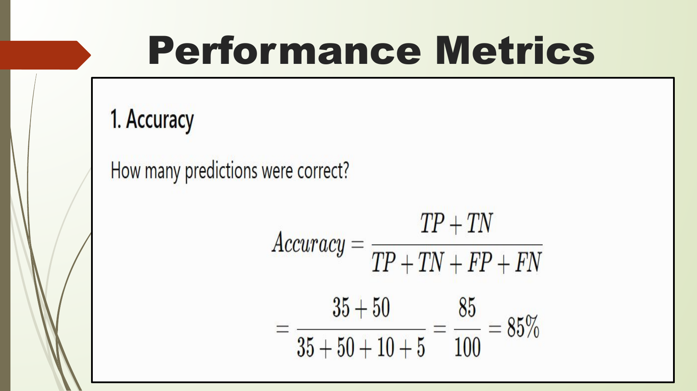

### Extracted Slide Text

- Performance Metrics

### Page Description And Teaching Notes

Slide type: title or transition slide.
Main idea: the slide is visual-first, so the image should be treated as the source for the content and structure.
This page sets the context for the next topic. Treat it as a section marker: it tells the learner what concept or unit is starting before the deck moves into definitions, examples, or formulas.
- No reliable selectable text was extracted; use the slide image for the visible diagram, chart, or screenshot.
Important visible terms: Performance Metrics.
Visual/layout description: the embedded image preserves the actual slide. Describe the title area first, then read bullets, formulas, tables, arrows, grouped boxes, or diagrams in their visible order. If the slide contains a diagram, explain the relationship shown by arrows/positioning before explaining the text labels.
Teaching note: after reading the slide, ask the learner to restate the page in one or two sentences and give one example. For formula or metric slides, also ask what each variable or metric means and when it should be used.
Exam/viva note: prepare the slide title as a short-answer question, then use the bullets or visual labels as the expected answer points.

## Page 66: Unit II - Supervised Learning (Full Deck) Page 66

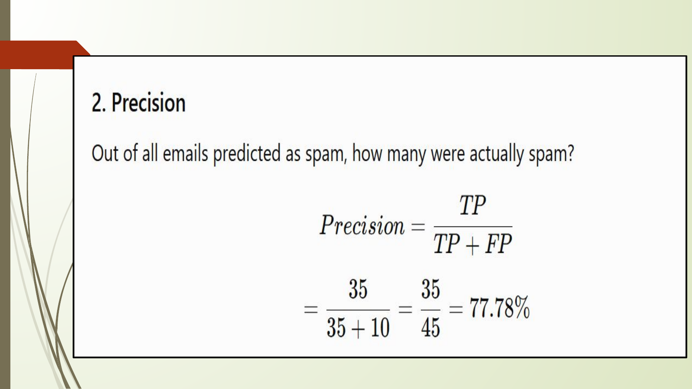

### Extracted Slide Text

- No selectable text extracted from this page.

### Page Description And Teaching Notes

Slide type: visual-only or image-heavy slide.
Main idea: the slide is visual-first, so the image should be treated as the source for the content and structure.
This page is primarily visual. The embedded slide image is the authoritative visual output; read it as a diagram or illustration first, then connect any visible labels to the surrounding pages.
- No reliable selectable text was extracted; use the slide image for the visible diagram, chart, or screenshot.
Visual/layout description: the embedded image preserves the actual slide. Describe the title area first, then read bullets, formulas, tables, arrows, grouped boxes, or diagrams in their visible order. If the slide contains a diagram, explain the relationship shown by arrows/positioning before explaining the text labels.
Teaching note: after reading the slide, ask the learner to restate the page in one or two sentences and give one example. For formula or metric slides, also ask what each variable or metric means and when it should be used.
Exam/viva note: prepare the slide title as a short-answer question, then use the bullets or visual labels as the expected answer points.

## Page 67: Unit II - Supervised Learning (Full Deck) Page 67

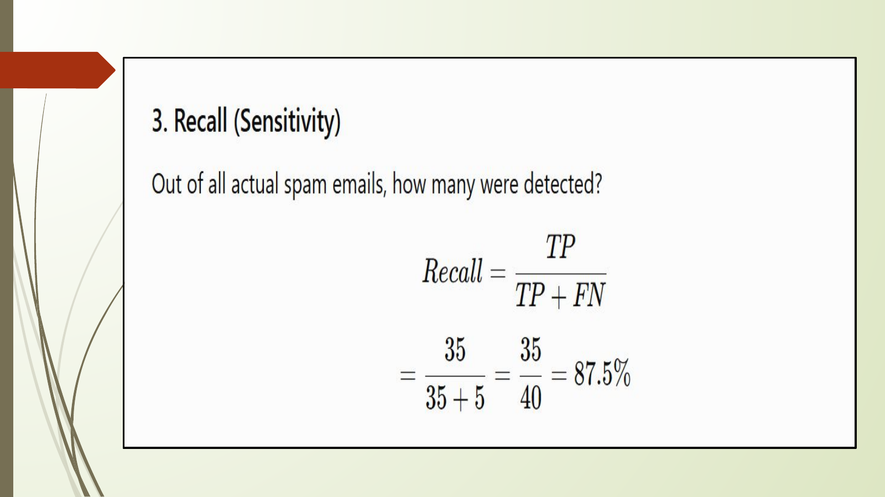

### Extracted Slide Text

- No selectable text extracted from this page.

### Page Description And Teaching Notes

Slide type: visual-only or image-heavy slide.
Main idea: the slide is visual-first, so the image should be treated as the source for the content and structure.
This page is primarily visual. The embedded slide image is the authoritative visual output; read it as a diagram or illustration first, then connect any visible labels to the surrounding pages.
- No reliable selectable text was extracted; use the slide image for the visible diagram, chart, or screenshot.
Visual/layout description: the embedded image preserves the actual slide. Describe the title area first, then read bullets, formulas, tables, arrows, grouped boxes, or diagrams in their visible order. If the slide contains a diagram, explain the relationship shown by arrows/positioning before explaining the text labels.
Teaching note: after reading the slide, ask the learner to restate the page in one or two sentences and give one example. For formula or metric slides, also ask what each variable or metric means and when it should be used.
Exam/viva note: prepare the slide title as a short-answer question, then use the bullets or visual labels as the expected answer points.

## Page 68: Unit II - Supervised Learning (Full Deck) Page 68

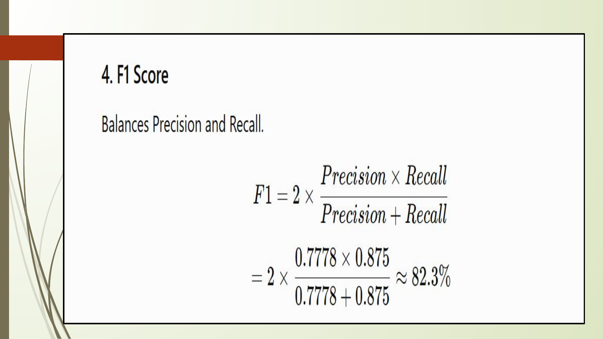

### Extracted Slide Text

- No selectable text extracted from this page.

### Page Description And Teaching Notes

Slide type: visual-only or image-heavy slide.
Main idea: the slide is visual-first, so the image should be treated as the source for the content and structure.
This page is primarily visual. The embedded slide image is the authoritative visual output; read it as a diagram or illustration first, then connect any visible labels to the surrounding pages.
- No reliable selectable text was extracted; use the slide image for the visible diagram, chart, or screenshot.
Visual/layout description: the embedded image preserves the actual slide. Describe the title area first, then read bullets, formulas, tables, arrows, grouped boxes, or diagrams in their visible order. If the slide contains a diagram, explain the relationship shown by arrows/positioning before explaining the text labels.
Teaching note: after reading the slide, ask the learner to restate the page in one or two sentences and give one example. For formula or metric slides, also ask what each variable or metric means and when it should be used.
Exam/viva note: prepare the slide title as a short-answer question, then use the bullets or visual labels as the expected answer points.

## Page 69: Real-Time Example: Disease Detection

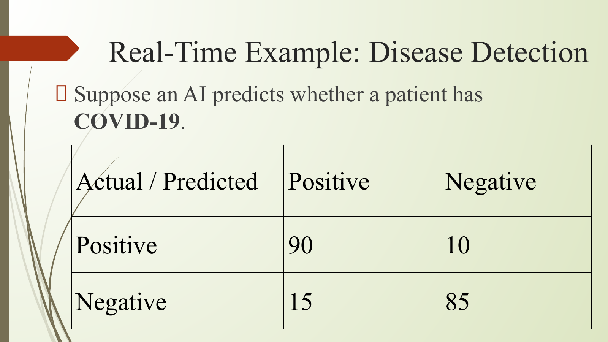

### Extracted Slide Text

- Real-Time Example: Disease Detection
- Suppose an AI predicts whether a patient has
- COVID-19.
- Actual / Predicted Positive Negative
- Positive 90 10
- Negative 15 85

### Page Description And Teaching Notes

Slide type: concept explanation slide.
Main idea: Suppose an AI predicts whether a patient has COVID-19. Actual / Predicted Positive Negative Positive 90 10 Negative 15 85.
This page explains a core concept in prose. The main task is to convert the definition into a clear statement of what the concept is, why it is used, and where it appears in a machine-learning workflow.
Detailed page understanding:
- `Suppose an AI predicts whether a patient has` is a core visible point. Explain what it means, why it matters, and how it connects to the slide title.
- `COVID-19.` is a core visible point. Explain what it means, why it matters, and how it connects to the slide title.
- `Actual / Predicted Positive Negative` is a core visible point. Explain what it means, why it matters, and how it connects to the slide title.
- `Positive 90 10` is a core visible point. Explain what it means, why it matters, and how it connects to the slide title.
- `Negative 15 85` is a core visible point. Explain what it means, why it matters, and how it connects to the slide title.
Important visible terms: Real-Time Example, Disease Detection Suppose, COVID-19, Actual, Predicted Positive Negative Positive, Negative.
Visual/layout description: the embedded image preserves the actual slide. Describe the title area first, then read bullets, formulas, tables, arrows, grouped boxes, or diagrams in their visible order. If the slide contains a diagram, explain the relationship shown by arrows/positioning before explaining the text labels.
Teaching note: after reading the slide, ask the learner to restate the page in one or two sentences and give one example. For formula or metric slides, also ask what each variable or metric means and when it should be used.
Exam/viva note: prepare the slide title as a short-answer question, then use the bullets or visual labels as the expected answer points.

## Page 70: 1. TP = 90: Sick patients correctly identified.

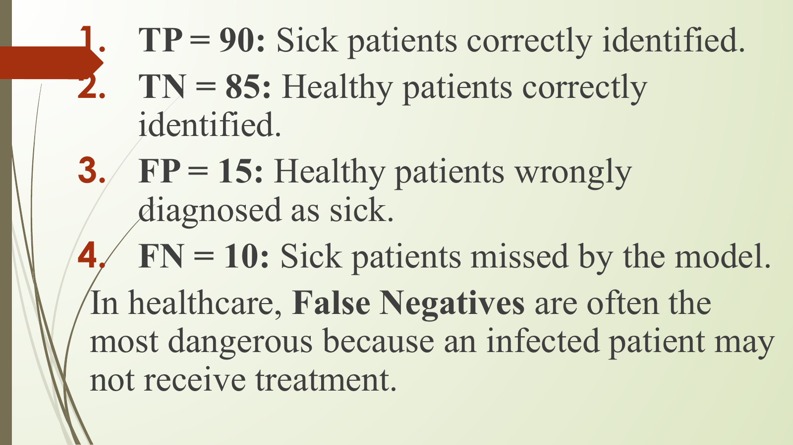

### Extracted Slide Text

- 1. TP = 90: Sick patients correctly identified.
- 2. TN = 85: Healthy patients correctly
- identified.
- 3. FP = 15: Healthy patients wrongly
- diagnosed as sick.
- 4. FN = 10: Sick patients missed by the model.
- In healthcare, False Negatives are often the
- most dangerous because an infected patient may
- not receive treatment.

### Page Description And Teaching Notes

Slide type: formula or calculation slide.
Main idea: 2. TN = 85: Healthy patients correctly identified. 3. FP = 15: Healthy patients wrongly diagnosed as sick. 4. FN = 10: Sick patients missed by the model. In healthcare, False Negatives are often the.
This page should be read carefully because it introduces a calculation, objective, or optimization idea. Identify the variables in the formula, what quantity is being minimized or measured, and how the equation supports model training or evaluation.
Detailed page understanding:
- `2. TN = 85: Healthy patients correctly` is one item in the slide's list. Treat it as a separate subtopic and prepare a one-line explanation for it.
- `identified.` is a core visible point. Explain what it means, why it matters, and how it connects to the slide title.
- `3. FP = 15: Healthy patients wrongly` is one item in the slide's list. Treat it as a separate subtopic and prepare a one-line explanation for it.
- `diagnosed as sick.` is a core visible point. Explain what it means, why it matters, and how it connects to the slide title.
- `4. FN = 10: Sick patients missed by the model.` is one item in the slide's list. Treat it as a separate subtopic and prepare a one-line explanation for it.
- `In healthcare, False Negatives are often the` is a core visible point. Explain what it means, why it matters, and how it connects to the slide title.
- `most dangerous because an infected patient may` is an application/example point. Convert it into a concrete real-world case while teaching.
- `not receive treatment.` is a core visible point. Explain what it means, why it matters, and how it connects to the slide title.
Important visible terms: Sick, Healthy, False Negatives.
Visual/layout description: the embedded image preserves the actual slide. Describe the title area first, then read bullets, formulas, tables, arrows, grouped boxes, or diagrams in their visible order. If the slide contains a diagram, explain the relationship shown by arrows/positioning before explaining the text labels.
Teaching note: after reading the slide, ask the learner to restate the page in one or two sentences and give one example. For formula or metric slides, also ask what each variable or metric means and when it should be used.
Exam/viva note: prepare the slide title as a short-answer question, then use the bullets or visual labels as the expected answer points.

## Page 71: •TP (True Positive): Correct positive

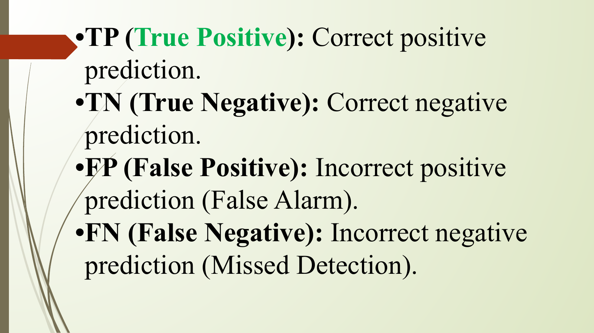

### Extracted Slide Text

- •TP (True Positive): Correct positive
- prediction.
- •TN (True Negative): Correct negative
- prediction.
- •FP (False Positive): Incorrect positive
- prediction (False Alarm).
- •FN (False Negative): Incorrect negative
- prediction (Missed Detection).

### Page Description And Teaching Notes

Slide type: bullet explanation slide.
Main idea: prediction. •TN (True Negative): Correct negative prediction. •FP (False Positive): Incorrect positive prediction (False Alarm). •FN (False Negative): Incorrect negative.
This page breaks the topic into separate points. Each bullet should be treated as a distinct exam or viva talking point, with the learner able to define it and give a small example.
Detailed page understanding:
- `prediction.` is a core visible point. Explain what it means, why it matters, and how it connects to the slide title.
- `•TN (True Negative): Correct negative` is one item in the slide's list. Treat it as a separate subtopic and prepare a one-line explanation for it.
- `prediction.` is a core visible point. Explain what it means, why it matters, and how it connects to the slide title.
- `•FP (False Positive): Incorrect positive` is one item in the slide's list. Treat it as a separate subtopic and prepare a one-line explanation for it.
- `prediction (False Alarm).` is a core visible point. Explain what it means, why it matters, and how it connects to the slide title.
- `•FN (False Negative): Incorrect negative` is one item in the slide's list. Treat it as a separate subtopic and prepare a one-line explanation for it.
- `prediction (Missed Detection).` is a core visible point. Explain what it means, why it matters, and how it connects to the slide title.
Important visible terms: True Positive, Correct, True Negative, False Positive, Incorrect, False Alarm, False Negative, Missed Detection.
Visual/layout description: the embedded image preserves the actual slide. Describe the title area first, then read bullets, formulas, tables, arrows, grouped boxes, or diagrams in their visible order. If the slide contains a diagram, explain the relationship shown by arrows/positioning before explaining the text labels.
Teaching note: after reading the slide, ask the learner to restate the page in one or two sentences and give one example. For formula or metric slides, also ask what each variable or metric means and when it should be used.
Exam/viva note: prepare the slide title as a short-answer question, then use the bullets or visual labels as the expected answer points.

## Page 72: Imagine a COVID test :

### Extracted Slide Text

- Imagine a COVID test :
- 1. TP: Sick person → Test says Sick ✅
- 2. TN: Healthy person → Test says Healthy ✅
- 3. FP: Healthy person → Test says Sick ❌ (False
- Alarm)
- 4. FN: Sick person → Test says Healthy ❌
- (Missed Case)

### Page Description And Teaching Notes

Slide type: bullet explanation slide.
Main idea: 1. TP: Sick person → Test says Sick ✅ 2. TN: Healthy person → Test says Healthy ✅ 3. FP: Healthy person → Test says Sick ❌ (False Alarm) 4. FN: Sick person → Test says Healthy ❌ (Missed Case).
This page breaks the topic into separate points. Each bullet should be treated as a distinct exam or viva talking point, with the learner able to define it and give a small example.
Detailed page understanding:
- `1. TP: Sick person → Test says Sick ✅` is one item in the slide's list. Treat it as a separate subtopic and prepare a one-line explanation for it.
- `2. TN: Healthy person → Test says Healthy ✅` is one item in the slide's list. Treat it as a separate subtopic and prepare a one-line explanation for it.
- `3. FP: Healthy person → Test says Sick ❌ (False` is one item in the slide's list. Treat it as a separate subtopic and prepare a one-line explanation for it.
- `Alarm)` is a core visible point. Explain what it means, why it matters, and how it connects to the slide title.
- `4. FN: Sick person → Test says Healthy ❌` is one item in the slide's list. Treat it as a separate subtopic and prepare a one-line explanation for it.
- `(Missed Case)` is a core visible point. Explain what it means, why it matters, and how it connects to the slide title.
Important visible terms: Imagine, COVID, Sick, Test, Healthy, False Alarm, Missed Case.
Visual/layout description: the embedded image preserves the actual slide. Describe the title area first, then read bullets, formulas, tables, arrows, grouped boxes, or diagrams in their visible order. If the slide contains a diagram, explain the relationship shown by arrows/positioning before explaining the text labels.
Teaching note: after reading the slide, ask the learner to restate the page in one or two sentences and give one example. For formula or metric slides, also ask what each variable or metric means and when it should be used.
Exam/viva note: prepare the slide title as a short-answer question, then use the bullets or visual labels as the expected answer points.

## Page 73: Bias –Variance Tradeoff

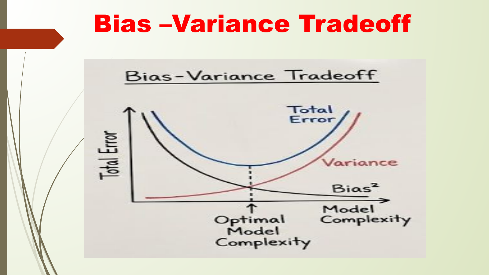

### Extracted Slide Text

- Bias –Variance Tradeoff

### Page Description And Teaching Notes

Slide type: title or transition slide.
Main idea: the slide is visual-first, so the image should be treated as the source for the content and structure.
This page sets the context for the next topic. Treat it as a section marker: it tells the learner what concept or unit is starting before the deck moves into definitions, examples, or formulas.
- No reliable selectable text was extracted; use the slide image for the visible diagram, chart, or screenshot.
Important visible terms: Bias, Variance Tradeoff.
Visual/layout description: the embedded image preserves the actual slide. Describe the title area first, then read bullets, formulas, tables, arrows, grouped boxes, or diagrams in their visible order. If the slide contains a diagram, explain the relationship shown by arrows/positioning before explaining the text labels.
Teaching note: after reading the slide, ask the learner to restate the page in one or two sentences and give one example. For formula or metric slides, also ask what each variable or metric means and when it should be used.
Exam/viva note: prepare the slide title as a short-answer question, then use the bullets or visual labels as the expected answer points.

## Page 74: Unit II - Supervised Learning (Full Deck) Page 74

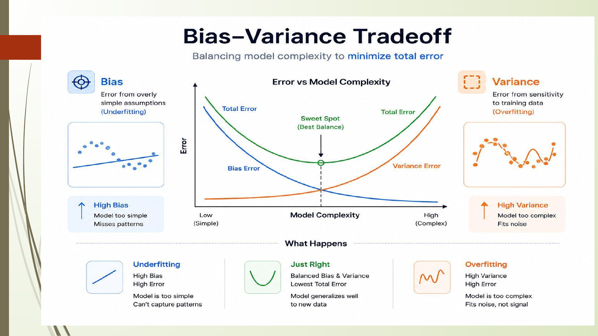

### Extracted Slide Text

- No selectable text extracted from this page.

### Page Description And Teaching Notes

Slide type: visual-only or image-heavy slide.
Main idea: the slide is visual-first, so the image should be treated as the source for the content and structure.
This page is primarily visual. The embedded slide image is the authoritative visual output; read it as a diagram or illustration first, then connect any visible labels to the surrounding pages.
- No reliable selectable text was extracted; use the slide image for the visible diagram, chart, or screenshot.
Visual/layout description: the embedded image preserves the actual slide. Describe the title area first, then read bullets, formulas, tables, arrows, grouped boxes, or diagrams in their visible order. If the slide contains a diagram, explain the relationship shown by arrows/positioning before explaining the text labels.
Teaching note: after reading the slide, ask the learner to restate the page in one or two sentences and give one example. For formula or metric slides, also ask what each variable or metric means and when it should be used.
Exam/viva note: prepare the slide title as a short-answer question, then use the bullets or visual labels as the expected answer points.

## Page 75: Bias and Variance .

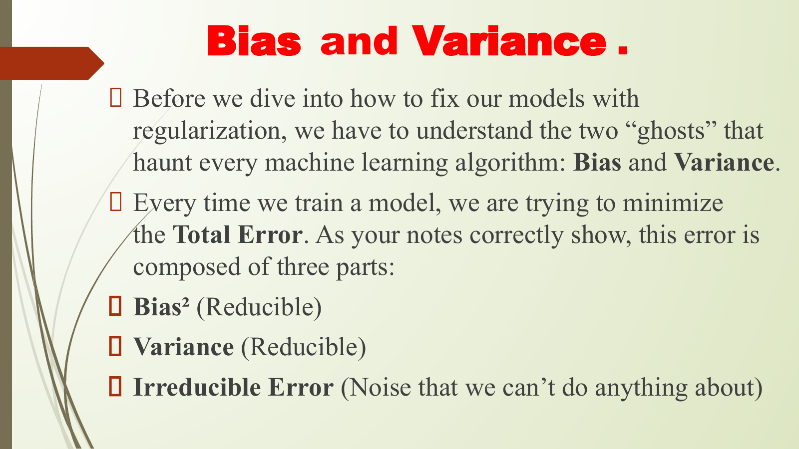

### Extracted Slide Text

- Bias and Variance .
- Before we dive into how to fix our models with
- regularization, we have to understand the two “ghosts” that
- haunt every machine learning algorithm: Bias and Variance.
- Every time we train a model, we are trying to minimize
- the Total Error. As your notes correctly show, this error is
- composed of three parts:
- Bias² (Reducible)
- Variance (Reducible)
- Irreducible Error (Noise that we can’t do anything about)

### Page Description And Teaching Notes

Slide type: formula or calculation slide.
Main idea: Before we dive into how to fix our models with regularization, we have to understand the two “ghosts” that haunt every machine learning algorithm: Bias and Variance. Every time we train a model, we are trying to minimize the Total Error. As your notes correctly show, this error is composed of three parts:.
This page should be read carefully because it introduces a calculation, objective, or optimization idea. Identify the variables in the formula, what quantity is being minimized or measured, and how the equation supports model training or evaluation.
Detailed page understanding:
- `Before we dive into how to fix our models with` is a core visible point. Explain what it means, why it matters, and how it connects to the slide title.
- `regularization, we have to understand the two “ghosts” that` is a core visible point. Explain what it means, why it matters, and how it connects to the slide title.
- `haunt every machine learning algorithm: Bias and Variance.` is a core visible point. Explain what it means, why it matters, and how it connects to the slide title.
- `Every time we train a model, we are trying to minimize` is a core visible point. Explain what it means, why it matters, and how it connects to the slide title.
- `the Total Error. As your notes correctly show, this error is` is a limitation or risk. Mention when the method may fail and what alternative or precaution can reduce the issue.
- `composed of three parts:` is a core visible point. Explain what it means, why it matters, and how it connects to the slide title.
- `Bias² (Reducible)` is a core visible point. Explain what it means, why it matters, and how it connects to the slide title.
- `Variance (Reducible)` is a core visible point. Explain what it means, why it matters, and how it connects to the slide title.
- `Irreducible Error (Noise that we can’t do anything about)` is a limitation or risk. Mention when the method may fail and what alternative or precaution can reduce the issue.
Important visible terms: Bias, Variance, Before, Every, Total Error, Reducible, Irreducible Error, Noise.
Visual/layout description: the embedded image preserves the actual slide. Describe the title area first, then read bullets, formulas, tables, arrows, grouped boxes, or diagrams in their visible order. If the slide contains a diagram, explain the relationship shown by arrows/positioning before explaining the text labels.
Teaching note: after reading the slide, ask the learner to restate the page in one or two sentences and give one example. For formula or metric slides, also ask what each variable or metric means and when it should be used.
Exam/viva note: prepare the slide title as a short-answer question, then use the bullets or visual labels as the expected answer points.

## Page 76: 1. What is Bias? (The “Underfitter”)

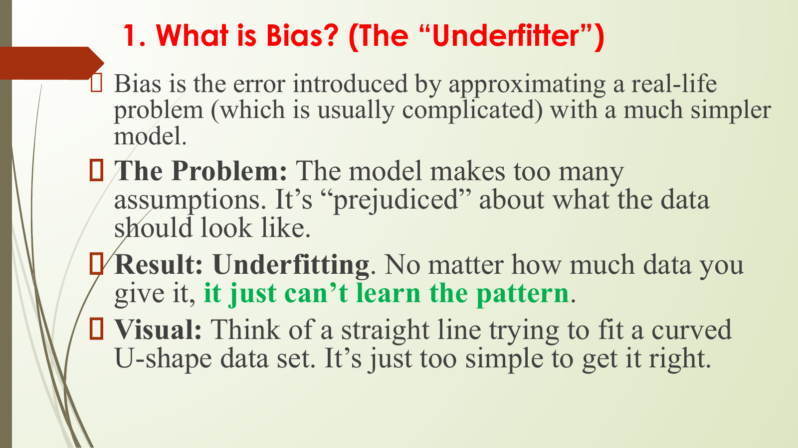

### Extracted Slide Text

- 1. What is Bias? (The “Underfitter”)
- Bias is the error introduced by approximating a real-life
- problem (which is usually complicated) with a much simpler
- model.
- The Problem: The model makes too many
- assumptions. It’s “prejudiced” about what the data
- should look like.
- Result: Underfitting. No matter how much data you
- give it, it just can’t learn the pattern.
- Visual: Think of a straight line trying to fit a curved
- U-shape data set. It’s just too simple to get it right.

### Page Description And Teaching Notes

Slide type: bullet explanation slide.
Main idea: Bias is the error introduced by approximating a real-life problem (which is usually complicated) with a much simpler model. The Problem: The model makes too many assumptions. It’s “prejudiced” about what the data should look like.
This page breaks the topic into separate points. Each bullet should be treated as a distinct exam or viva talking point, with the learner able to define it and give a small example.
Detailed page understanding:
- `Bias is the error introduced by approximating a real-life` is a limitation or risk. Mention when the method may fail and what alternative or precaution can reduce the issue.
- `problem (which is usually complicated) with a much simpler` is a limitation or risk. Mention when the method may fail and what alternative or precaution can reduce the issue.
- `model.` is a core visible point. Explain what it means, why it matters, and how it connects to the slide title.
- `The Problem: The model makes too many` is a limitation or risk. Mention when the method may fail and what alternative or precaution can reduce the issue.
- `assumptions. It’s “prejudiced” about what the data` is a core visible point. Explain what it means, why it matters, and how it connects to the slide title.
- `should look like.` is a core visible point. Explain what it means, why it matters, and how it connects to the slide title.
- `Result: Underfitting. No matter how much data you` is a core visible point. Explain what it means, why it matters, and how it connects to the slide title.
- `give it, it just can’t learn the pattern.` is a core visible point. Explain what it means, why it matters, and how it connects to the slide title.
- `Visual: Think of a straight line trying to fit a curved` is a core visible point. Explain what it means, why it matters, and how it connects to the slide title.
- `U-shape data set. It’s just too simple to get it right.` is a core visible point. Explain what it means, why it matters, and how it connects to the slide title.
Important visible terms: What, Bias, The, Underfitter, The Problem, Result, Underfitting, Visual.
Visual/layout description: the embedded image preserves the actual slide. Describe the title area first, then read bullets, formulas, tables, arrows, grouped boxes, or diagrams in their visible order. If the slide contains a diagram, explain the relationship shown by arrows/positioning before explaining the text labels.
Teaching note: after reading the slide, ask the learner to restate the page in one or two sentences and give one example. For formula or metric slides, also ask what each variable or metric means and when it should be used.
Exam/viva note: prepare the slide title as a short-answer question, then use the bullets or visual labels as the expected answer points.

## Page 77: Unit II - Supervised Learning (Full Deck) Page 77

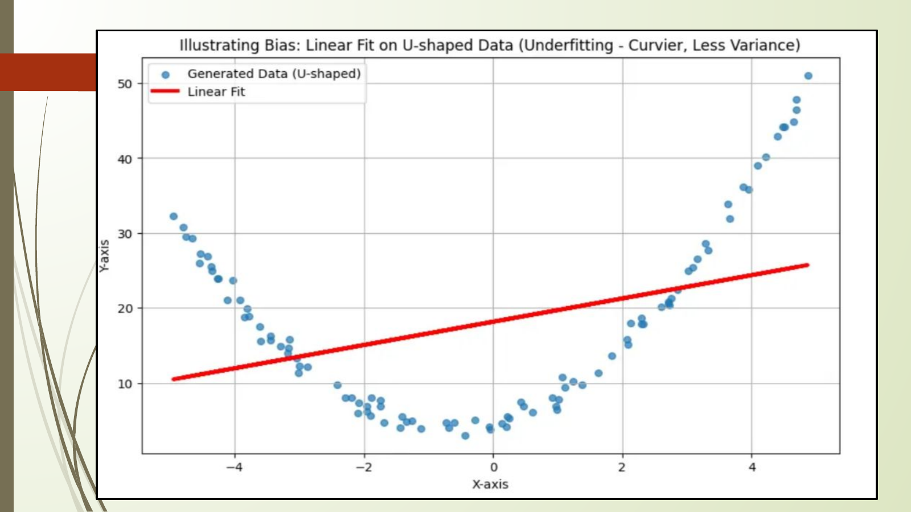

### Extracted Slide Text

- No selectable text extracted from this page.

### Page Description And Teaching Notes

Slide type: visual-only or image-heavy slide.
Main idea: the slide is visual-first, so the image should be treated as the source for the content and structure.
This page is primarily visual. The embedded slide image is the authoritative visual output; read it as a diagram or illustration first, then connect any visible labels to the surrounding pages.
- No reliable selectable text was extracted; use the slide image for the visible diagram, chart, or screenshot.
Visual/layout description: the embedded image preserves the actual slide. Describe the title area first, then read bullets, formulas, tables, arrows, grouped boxes, or diagrams in their visible order. If the slide contains a diagram, explain the relationship shown by arrows/positioning before explaining the text labels.
Teaching note: after reading the slide, ask the learner to restate the page in one or two sentences and give one example. For formula or metric slides, also ask what each variable or metric means and when it should be used.
Exam/viva note: prepare the slide title as a short-answer question, then use the bullets or visual labels as the expected answer points.

## Page 78: 2. What is Variance? (The “Overfitter”)

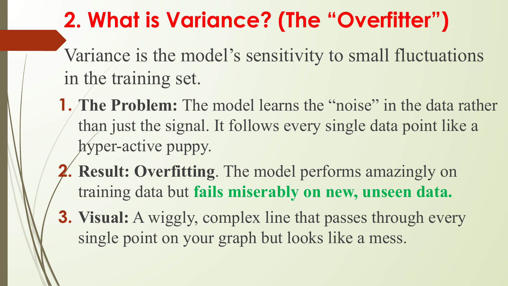

### Extracted Slide Text

- 2. What is Variance? (The “Overfitter”)
- Variance is the model’s sensitivity to small fluctuations
- in the training set.
- 1. The Problem: The model learns the “noise” in the data rather
- than just the signal. It follows every single data point like a
- hyper-active puppy.
- 2. Result: Overfitting. The model performs amazingly on
- training data but fails miserably on new, unseen data.
- 3. Visual: A wiggly, complex line that passes through every
- single point on your graph but looks like a mess.

### Page Description And Teaching Notes

Slide type: bullet explanation slide.
Main idea: Variance is the model’s sensitivity to small fluctuations in the training set. 1. The Problem: The model learns the “noise” in the data rather than just the signal. It follows every single data point like a hyper-active puppy. 2. Result: Overfitting. The model performs amazingly on.
This page breaks the topic into separate points. Each bullet should be treated as a distinct exam or viva talking point, with the learner able to define it and give a small example.
Detailed page understanding:
- `Variance is the model’s sensitivity to small fluctuations` is a core visible point. Explain what it means, why it matters, and how it connects to the slide title.
- `in the training set.` is a core visible point. Explain what it means, why it matters, and how it connects to the slide title.
- `1. The Problem: The model learns the “noise” in the data rather` is a limitation or risk. Mention when the method may fail and what alternative or precaution can reduce the issue.
- `than just the signal. It follows every single data point like a` is a core visible point. Explain what it means, why it matters, and how it connects to the slide title.
- `hyper-active puppy.` is a core visible point. Explain what it means, why it matters, and how it connects to the slide title.
- `2. Result: Overfitting. The model performs amazingly on` is one item in the slide's list. Treat it as a separate subtopic and prepare a one-line explanation for it.
- `training data but fails miserably on new, unseen data.` is a core visible point. Explain what it means, why it matters, and how it connects to the slide title.
- `3. Visual: A wiggly, complex line that passes through every` is one item in the slide's list. Treat it as a separate subtopic and prepare a one-line explanation for it.
- `single point on your graph but looks like a mess.` is a core visible point. Explain what it means, why it matters, and how it connects to the slide title.
Important visible terms: What, Variance, The, Overfitter, The Problem, Result, Overfitting, Visual.
Visual/layout description: the embedded image preserves the actual slide. Describe the title area first, then read bullets, formulas, tables, arrows, grouped boxes, or diagrams in their visible order. If the slide contains a diagram, explain the relationship shown by arrows/positioning before explaining the text labels.
Teaching note: after reading the slide, ask the learner to restate the page in one or two sentences and give one example. For formula or metric slides, also ask what each variable or metric means and when it should be used.
Exam/viva note: prepare the slide title as a short-answer question, then use the bullets or visual labels as the expected answer points.

## Page 79: Unit II - Supervised Learning (Full Deck) Page 79

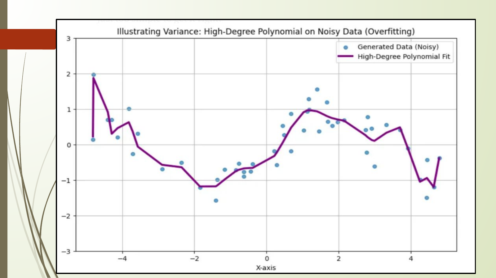

### Extracted Slide Text

- No selectable text extracted from this page.

### Page Description And Teaching Notes

Slide type: visual-only or image-heavy slide.
Main idea: the slide is visual-first, so the image should be treated as the source for the content and structure.
This page is primarily visual. The embedded slide image is the authoritative visual output; read it as a diagram or illustration first, then connect any visible labels to the surrounding pages.
- No reliable selectable text was extracted; use the slide image for the visible diagram, chart, or screenshot.
Visual/layout description: the embedded image preserves the actual slide. Describe the title area first, then read bullets, formulas, tables, arrows, grouped boxes, or diagrams in their visible order. If the slide contains a diagram, explain the relationship shown by arrows/positioning before explaining the text labels.
Teaching note: after reading the slide, ask the learner to restate the page in one or two sentences and give one example. For formula or metric slides, also ask what each variable or metric means and when it should be used.
Exam/viva note: prepare the slide title as a short-answer question, then use the bullets or visual labels as the expected answer points.

## Page 80: •Bias is the distance between the center of your ball cluster and the hole.

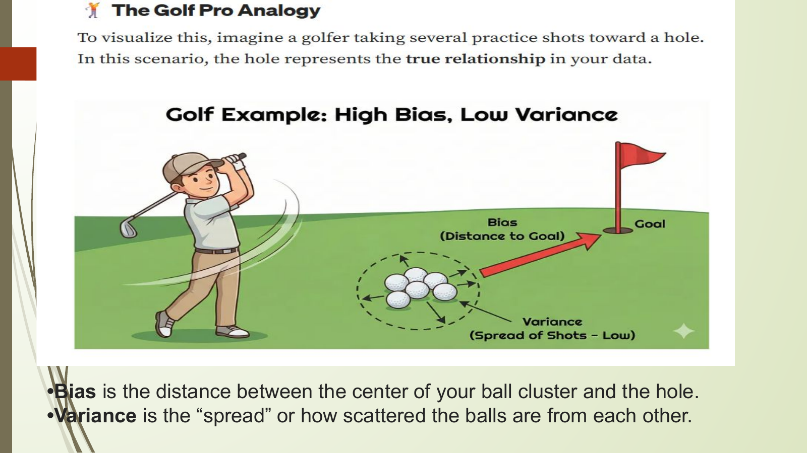

### Extracted Slide Text

- •Bias is the distance between the center of your ball cluster and the hole.
- •Variance is the “spread” or how scattered the balls are from each other.

### Page Description And Teaching Notes

Slide type: title or transition slide.
Main idea: •Variance is the “spread” or how scattered the balls are from each other.
This page sets the context for the next topic. Treat it as a section marker: it tells the learner what concept or unit is starting before the deck moves into definitions, examples, or formulas.
Detailed page understanding:
- `•Variance is the “spread” or how scattered the balls are from each other.` is one item in the slide's list. Treat it as a separate subtopic and prepare a one-line explanation for it.
Important visible terms: Bias, Variance.
Visual/layout description: the embedded image preserves the actual slide. Describe the title area first, then read bullets, formulas, tables, arrows, grouped boxes, or diagrams in their visible order. If the slide contains a diagram, explain the relationship shown by arrows/positioning before explaining the text labels.
Teaching note: after reading the slide, ask the learner to restate the page in one or two sentences and give one example. For formula or metric slides, also ask what each variable or metric means and when it should be used.
Exam/viva note: prepare the slide title as a short-answer question, then use the bullets or visual labels as the expected answer points.

## Page 81: The Four Scenarios on the Green:

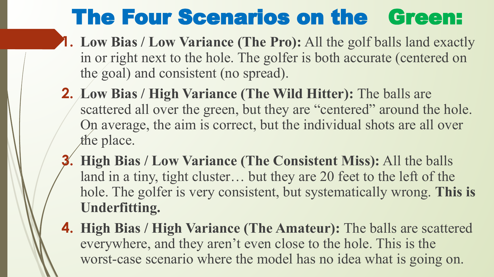

### Extracted Slide Text

- The Four Scenarios on the Green:
- 1. Low Bias / Low Variance (The Pro): All the golf balls land exactly
- in or right next to the hole. The golfer is both accurate (centered on
- the goal) and consistent (no spread).
- 2. Low Bias / High Variance (The Wild Hitter): The balls are
- scattered all over the green, but they are “centered” around the hole.
- On average, the aim is correct, but the individual shots are all over
- the place.
- 3. High Bias / Low Variance (The Consistent Miss): All the balls
- land in a tiny, tight cluster… but they are 20 feet to the left of the
- hole. The golfer is very consistent, but systematically wrong. This is
- Underfitting.
- 4. High Bias / High Variance (The Amateur): The balls are scattered
- everywhere, and they aren’t even close to the hole. This is the
- worst-case scenario where the model has no idea what is going on.

### Page Description And Teaching Notes

Slide type: bullet explanation slide.
Main idea: 1. Low Bias / Low Variance (The Pro): All the golf balls land exactly in or right next to the hole. The golfer is both accurate (centered on the goal) and consistent (no spread). 2. Low Bias / High Variance (The Wild Hitter): The balls are scattered all over the green, but they are “centered” around the hole. On average, the aim is correct, but the individual shots are all over.
This page breaks the topic into separate points. Each bullet should be treated as a distinct exam or viva talking point, with the learner able to define it and give a small example.
Detailed page understanding:
- `1. Low Bias / Low Variance (The Pro): All the golf balls land exactly` is one item in the slide's list. Treat it as a separate subtopic and prepare a one-line explanation for it.
- `in or right next to the hole. The golfer is both accurate (centered on` is a core visible point. Explain what it means, why it matters, and how it connects to the slide title.
- `the goal) and consistent (no spread).` is a core visible point. Explain what it means, why it matters, and how it connects to the slide title.
- `2. Low Bias / High Variance (The Wild Hitter): The balls are` is one item in the slide's list. Treat it as a separate subtopic and prepare a one-line explanation for it.
- `scattered all over the green, but they are “centered” around the hole.` is a core visible point. Explain what it means, why it matters, and how it connects to the slide title.
- `On average, the aim is correct, but the individual shots are all over` is a core visible point. Explain what it means, why it matters, and how it connects to the slide title.
- `the place.` is a core visible point. Explain what it means, why it matters, and how it connects to the slide title.
- `3. High Bias / Low Variance (The Consistent Miss): All the balls` is one item in the slide's list. Treat it as a separate subtopic and prepare a one-line explanation for it.
- Additional bullets continue on the slide; use the extracted text list above for the complete wording.
- `worst-case scenario where the model has no idea what is going on.` is a core visible point. Explain what it means, why it matters, and how it connects to the slide title.
Important visible terms: The Four Scenarios, Green, Low Bias, Low Variance, The Pro, All, The, High Variance.
Visual/layout description: the embedded image preserves the actual slide. Describe the title area first, then read bullets, formulas, tables, arrows, grouped boxes, or diagrams in their visible order. If the slide contains a diagram, explain the relationship shown by arrows/positioning before explaining the text labels.
Teaching note: after reading the slide, ask the learner to restate the page in one or two sentences and give one example. For formula or metric slides, also ask what each variable or metric means and when it should be used.
Exam/viva note: prepare the slide title as a short-answer question, then use the bullets or visual labels as the expected answer points.

## Page 82: Unit II - Supervised Learning (Full Deck) Page 82

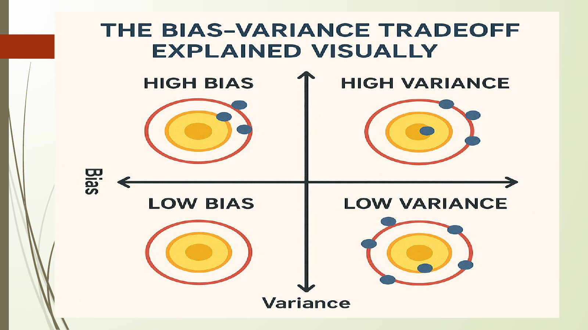

### Extracted Slide Text

- No selectable text extracted from this page.

### Page Description And Teaching Notes

Slide type: visual-only or image-heavy slide.
Main idea: the slide is visual-first, so the image should be treated as the source for the content and structure.
This page is primarily visual. The embedded slide image is the authoritative visual output; read it as a diagram or illustration first, then connect any visible labels to the surrounding pages.
- No reliable selectable text was extracted; use the slide image for the visible diagram, chart, or screenshot.
Visual/layout description: the embedded image preserves the actual slide. Describe the title area first, then read bullets, formulas, tables, arrows, grouped boxes, or diagrams in their visible order. If the slide contains a diagram, explain the relationship shown by arrows/positioning before explaining the text labels.
Teaching note: after reading the slide, ask the learner to restate the page in one or two sentences and give one example. For formula or metric slides, also ask what each variable or metric means and when it should be used.
Exam/viva note: prepare the slide title as a short-answer question, then use the bullets or visual labels as the expected answer points.

## Page 83: Why do we need to “Balance”

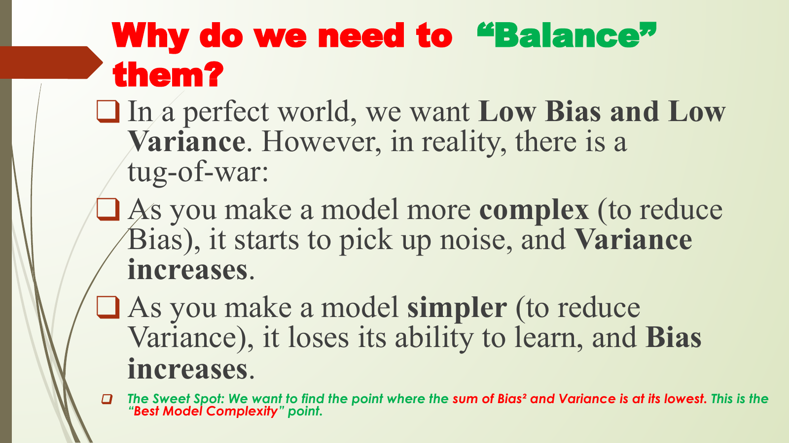

### Extracted Slide Text

- Why do we need to “Balance”
- them?
- ❑ In a perfect world, we want Low Bias and Low
- Variance. However, in reality, there is a
- tug-of-war:
- ❑ As you make a model more complex (to reduce
- Bias), it starts to pick up noise, and Variance
- increases.
- ❑ As you make a model simpler (to reduce
- Variance), it loses its ability to learn, and Bias
- increases.
- ❑ The Sweet Spot: We want to find the point where the sum of Bias² and Variance is at its lowest. This is the
- “Best Model Complexity” point.

### Page Description And Teaching Notes

Slide type: formula or calculation slide.
Main idea: them? ❑ In a perfect world, we want Low Bias and Low Variance. However, in reality, there is a tug-of-war: ❑ As you make a model more complex (to reduce Bias), it starts to pick up noise, and Variance.
This page should be read carefully because it introduces a calculation, objective, or optimization idea. Identify the variables in the formula, what quantity is being minimized or measured, and how the equation supports model training or evaluation.
Detailed page understanding:
- `them?` is a core visible point. Explain what it means, why it matters, and how it connects to the slide title.
- `❑ In a perfect world, we want Low Bias and Low` is one item in the slide's list. Treat it as a separate subtopic and prepare a one-line explanation for it.
- `Variance. However, in reality, there is a` gives the definition-level meaning. Explain it first in simple words, then connect it to how a model learns from data.
- `tug-of-war:` is a core visible point. Explain what it means, why it matters, and how it connects to the slide title.
- `❑ As you make a model more complex (to reduce` is one item in the slide's list. Treat it as a separate subtopic and prepare a one-line explanation for it.
- `Bias), it starts to pick up noise, and Variance` is a core visible point. Explain what it means, why it matters, and how it connects to the slide title.
- `increases.` is a core visible point. Explain what it means, why it matters, and how it connects to the slide title.
- `❑ As you make a model simpler (to reduce` is one item in the slide's list. Treat it as a separate subtopic and prepare a one-line explanation for it.
- Additional bullets continue on the slide; use the extracted text list above for the complete wording.
- `“Best Model Complexity” point.` is a core visible point. Explain what it means, why it matters, and how it connects to the slide title.
Important visible terms: Why, Balance, Low Bias, Low Variance, However, Bias, Variance, The Sweet Spot.
Visual/layout description: the embedded image preserves the actual slide. Describe the title area first, then read bullets, formulas, tables, arrows, grouped boxes, or diagrams in their visible order. If the slide contains a diagram, explain the relationship shown by arrows/positioning before explaining the text labels.
Teaching note: after reading the slide, ask the learner to restate the page in one or two sentences and give one example. For formula or metric slides, also ask what each variable or metric means and when it should be used.
Exam/viva note: prepare the slide title as a short-answer question, then use the bullets or visual labels as the expected answer points.

## Page 84: The Bridge to Regularization

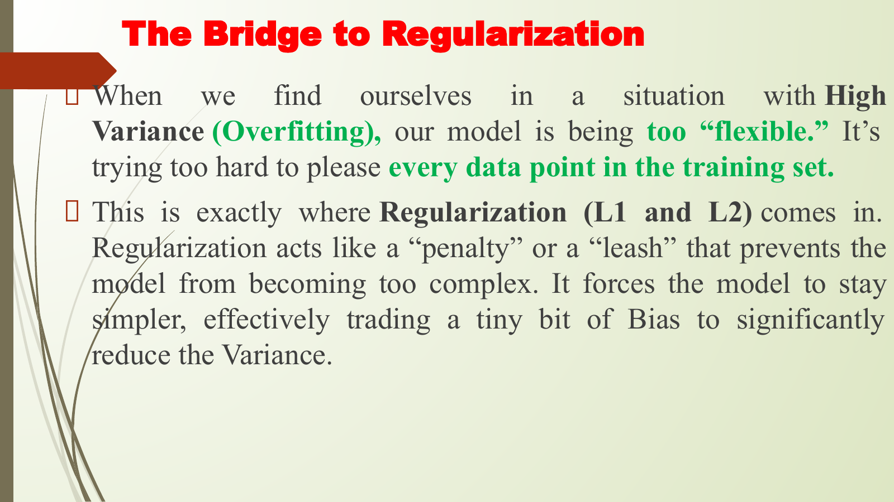

### Extracted Slide Text

- The Bridge to Regularization
- When we find ourselves in a situation with High
- Variance (Overfitting), our model is being too “flexible.” It’s
- trying too hard to please every data point in the training set.
- This is exactly where Regularization (L1 and L2) comes in.
- Regularization acts like a “penalty” or a “leash” that prevents the
- model from becoming too complex. It forces the model to stay
- simpler, effectively trading a tiny bit of Bias to significantly
- reduce the Variance.

### Page Description And Teaching Notes

Slide type: concept explanation slide.
Main idea: When we find ourselves in a situation with High Variance (Overfitting), our model is being too “flexible.” It’s trying too hard to please every data point in the training set. This is exactly where Regularization (L1 and L2) comes in. Regularization acts like a “penalty” or a “leash” that prevents the model from becoming too complex. It forces the model to stay.
This page explains a core concept in prose. The main task is to convert the definition into a clear statement of what the concept is, why it is used, and where it appears in a machine-learning workflow.
Detailed page understanding:
- `When we find ourselves in a situation with High` is a core visible point. Explain what it means, why it matters, and how it connects to the slide title.
- `Variance (Overfitting), our model is being too “flexible.” It’s` is a core visible point. Explain what it means, why it matters, and how it connects to the slide title.
- `trying too hard to please every data point in the training set.` is a core visible point. Explain what it means, why it matters, and how it connects to the slide title.
- `This is exactly where Regularization (L1 and L2) comes in.` is a core visible point. Explain what it means, why it matters, and how it connects to the slide title.
- `Regularization acts like a “penalty” or a “leash” that prevents the` is a core visible point. Explain what it means, why it matters, and how it connects to the slide title.
- `model from becoming too complex. It forces the model to stay` is a core visible point. Explain what it means, why it matters, and how it connects to the slide title.
- `simpler, effectively trading a tiny bit of Bias to significantly` is a core visible point. Explain what it means, why it matters, and how it connects to the slide title.
- `reduce the Variance.` is a core visible point. Explain what it means, why it matters, and how it connects to the slide title.
Important visible terms: The Bridge, Regularization When, High Variance, Overfitting, This, Regularization, Bias, Variance.
Visual/layout description: the embedded image preserves the actual slide. Describe the title area first, then read bullets, formulas, tables, arrows, grouped boxes, or diagrams in their visible order. If the slide contains a diagram, explain the relationship shown by arrows/positioning before explaining the text labels.
Teaching note: after reading the slide, ask the learner to restate the page in one or two sentences and give one example. For formula or metric slides, also ask what each variable or metric means and when it should be used.
Exam/viva note: prepare the slide title as a short-answer question, then use the bullets or visual labels as the expected answer points.

## Page 85: The Problem: High Variance &

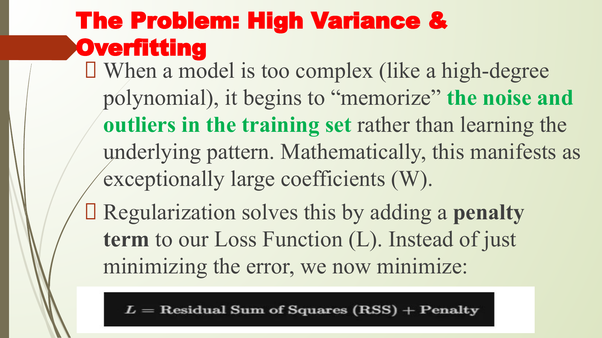

### Extracted Slide Text

- The Problem: High Variance &
- Overfitting
- When a model is too complex (like a high-degree
- polynomial), it begins to “memorize” the noise and
- outliers in the training set rather than learning the
- underlying pattern. Mathematically, this manifests as
- exceptionally large coefficients (W).
- Regularization solves this by adding a penalty
- term to our Loss Function (L). Instead of just
- minimizing the error, we now minimize:

### Page Description And Teaching Notes

Slide type: concept explanation slide.
Main idea: Overfitting When a model is too complex (like a high-degree polynomial), it begins to “memorize” the noise and outliers in the training set rather than learning the underlying pattern. Mathematically, this manifests as exceptionally large coefficients (W).
This page explains a core concept in prose. The main task is to convert the definition into a clear statement of what the concept is, why it is used, and where it appears in a machine-learning workflow.
Detailed page understanding:
- `Overfitting` is a core visible point. Explain what it means, why it matters, and how it connects to the slide title.
- `When a model is too complex (like a high-degree` is a core visible point. Explain what it means, why it matters, and how it connects to the slide title.
- `polynomial), it begins to “memorize” the noise and` is a core visible point. Explain what it means, why it matters, and how it connects to the slide title.
- `outliers in the training set rather than learning the` is a core visible point. Explain what it means, why it matters, and how it connects to the slide title.
- `underlying pattern. Mathematically, this manifests as` is a core visible point. Explain what it means, why it matters, and how it connects to the slide title.
- `exceptionally large coefficients (W).` is a core visible point. Explain what it means, why it matters, and how it connects to the slide title.
- `Regularization solves this by adding a penalty` is a core visible point. Explain what it means, why it matters, and how it connects to the slide title.
- `term to our Loss Function (L). Instead of just` is a core visible point. Explain what it means, why it matters, and how it connects to the slide title.
- `minimizing the error, we now minimize:` is a limitation or risk. Mention when the method may fail and what alternative or precaution can reduce the issue.
Important visible terms: The Problem, High Variance, Overfitting When, Mathematically, Regularization, Loss Function, Instead.
Visual/layout description: the embedded image preserves the actual slide. Describe the title area first, then read bullets, formulas, tables, arrows, grouped boxes, or diagrams in their visible order. If the slide contains a diagram, explain the relationship shown by arrows/positioning before explaining the text labels.
Teaching note: after reading the slide, ask the learner to restate the page in one or two sentences and give one example. For formula or metric slides, also ask what each variable or metric means and when it should be used.
Exam/viva note: prepare the slide title as a short-answer question, then use the bullets or visual labels as the expected answer points.

## Page 86: Regularization

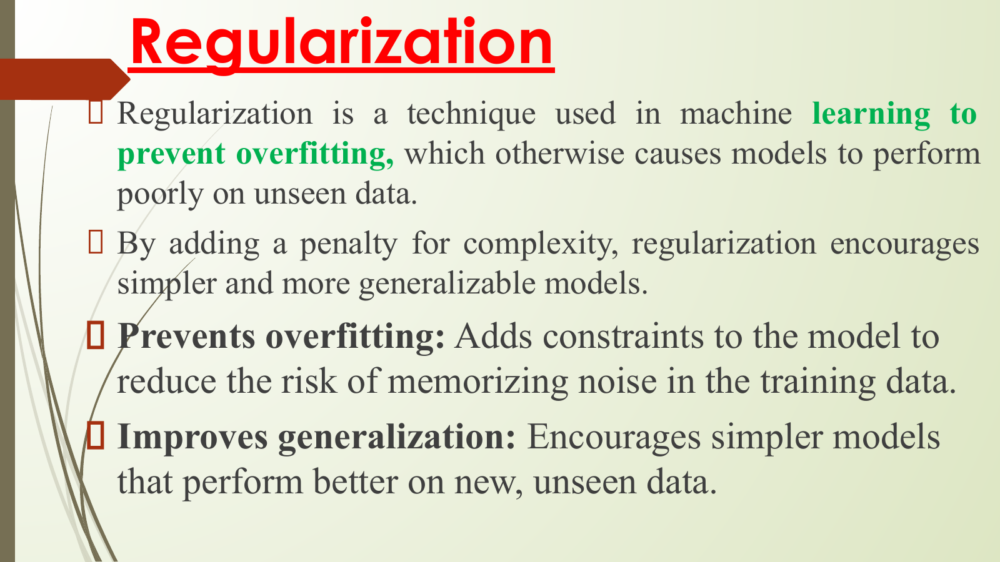

### Extracted Slide Text

- Regularization
- Regularization is a technique used in machine learning to
- prevent overfitting, which otherwise causes models to perform
- poorly on unseen data.
- By adding a penalty for complexity, regularization encourages
- simpler and more generalizable models.
- Prevents overfitting: Adds constraints to the model to
- reduce the risk of memorizing noise in the training data.
- Improves generalization: Encourages simpler models
- that perform better on new, unseen data.

### Page Description And Teaching Notes

Slide type: concept explanation slide.
Main idea: Regularization is a technique used in machine learning to prevent overfitting, which otherwise causes models to perform poorly on unseen data. By adding a penalty for complexity, regularization encourages simpler and more generalizable models. Prevents overfitting: Adds constraints to the model to.
This page explains a core concept in prose. The main task is to convert the definition into a clear statement of what the concept is, why it is used, and where it appears in a machine-learning workflow.
Detailed page understanding:
- `Regularization is a technique used in machine learning to` gives the definition-level meaning. Explain it first in simple words, then connect it to how a model learns from data.
- `prevent overfitting, which otherwise causes models to perform` is an application/example point. Convert it into a concrete real-world case while teaching.
- `poorly on unseen data.` is a core visible point. Explain what it means, why it matters, and how it connects to the slide title.
- `By adding a penalty for complexity, regularization encourages` is a core visible point. Explain what it means, why it matters, and how it connects to the slide title.
- `simpler and more generalizable models.` is a core visible point. Explain what it means, why it matters, and how it connects to the slide title.
- `Prevents overfitting: Adds constraints to the model to` is a core visible point. Explain what it means, why it matters, and how it connects to the slide title.
- `reduce the risk of memorizing noise in the training data.` is a core visible point. Explain what it means, why it matters, and how it connects to the slide title.
- `Improves generalization: Encourages simpler models` states a benefit. Use it to justify why this method or concept is useful in a machine-learning workflow.
- `that perform better on new, unseen data.` is a core visible point. Explain what it means, why it matters, and how it connects to the slide title.
Important visible terms: Regularization Regularization, Prevents, Adds, Improves, Encourages.
Visual/layout description: the embedded image preserves the actual slide. Describe the title area first, then read bullets, formulas, tables, arrows, grouped boxes, or diagrams in their visible order. If the slide contains a diagram, explain the relationship shown by arrows/positioning before explaining the text labels.
Teaching note: after reading the slide, ask the learner to restate the page in one or two sentences and give one example. For formula or metric slides, also ask what each variable or metric means and when it should be used.
Exam/viva note: prepare the slide title as a short-answer question, then use the bullets or visual labels as the expected answer points.

## Page 87: Regularization Techniques

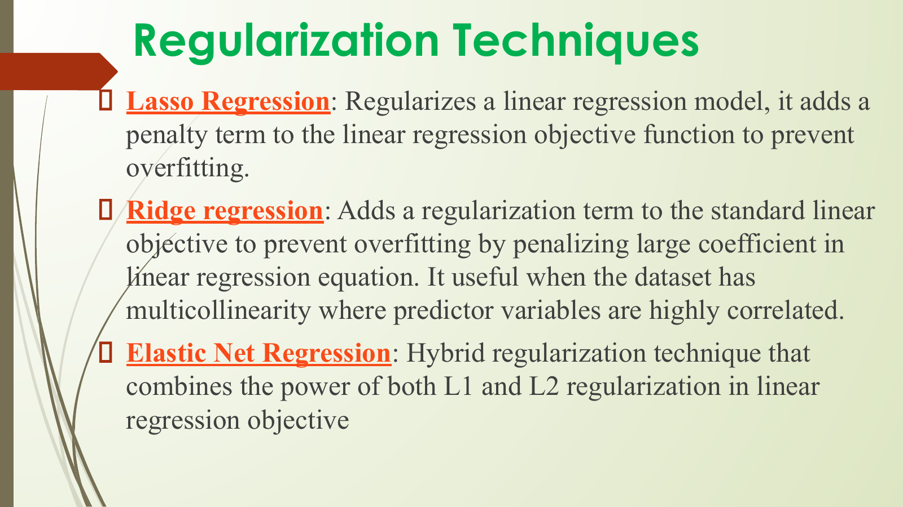

### Extracted Slide Text

- Regularization Techniques
- Lasso Regression: Regularizes a linear regression model, it adds a
- penalty term to the linear regression objective function to prevent
- overfitting.
- Ridge regression: Adds a regularization term to the standard linear
- objective to prevent overfitting by penalizing large coefficient in
- linear regression equation. It useful when the dataset has
- multicollinearity where predictor variables are highly correlated.
- Elastic Net Regression: Hybrid regularization technique that
- combines the power of both L1 and L2 regularization in linear
- regression objective

### Page Description And Teaching Notes

Slide type: formula or calculation slide.
Main idea: Lasso Regression: Regularizes a linear regression model, it adds a penalty term to the linear regression objective function to prevent overfitting. Ridge regression: Adds a regularization term to the standard linear objective to prevent overfitting by penalizing large coefficient in linear regression equation. It useful when the dataset has.
This page should be read carefully because it introduces a calculation, objective, or optimization idea. Identify the variables in the formula, what quantity is being minimized or measured, and how the equation supports model training or evaluation.
Detailed page understanding:
- `Lasso Regression: Regularizes a linear regression model, it adds a` is a core visible point. Explain what it means, why it matters, and how it connects to the slide title.
- `penalty term to the linear regression objective function to prevent` is a core visible point. Explain what it means, why it matters, and how it connects to the slide title.
- `overfitting.` is a core visible point. Explain what it means, why it matters, and how it connects to the slide title.
- `Ridge regression: Adds a regularization term to the standard linear` is a core visible point. Explain what it means, why it matters, and how it connects to the slide title.
- `objective to prevent overfitting by penalizing large coefficient in` is a core visible point. Explain what it means, why it matters, and how it connects to the slide title.
- `linear regression equation. It useful when the dataset has` is an application/example point. Convert it into a concrete real-world case while teaching.
- `multicollinearity where predictor variables are highly correlated.` is a core visible point. Explain what it means, why it matters, and how it connects to the slide title.
- `Elastic Net Regression: Hybrid regularization technique that` is a core visible point. Explain what it means, why it matters, and how it connects to the slide title.
- `combines the power of both L1 and L2 regularization in linear` is a core visible point. Explain what it means, why it matters, and how it connects to the slide title.
- `regression objective` is a core visible point. Explain what it means, why it matters, and how it connects to the slide title.
Important visible terms: Regularization Techniques Lasso Regression, Regularizes, Ridge, Adds, Elastic Net Regression, Hybrid.
Visual/layout description: the embedded image preserves the actual slide. Describe the title area first, then read bullets, formulas, tables, arrows, grouped boxes, or diagrams in their visible order. If the slide contains a diagram, explain the relationship shown by arrows/positioning before explaining the text labels.
Teaching note: after reading the slide, ask the learner to restate the page in one or two sentences and give one example. For formula or metric slides, also ask what each variable or metric means and when it should be used.
Exam/viva note: prepare the slide title as a short-answer question, then use the bullets or visual labels as the expected answer points.

## Page 88: Regularization in Machine Learning

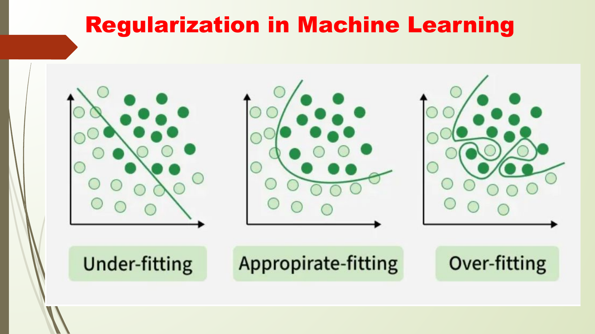

### Extracted Slide Text

- Regularization in Machine Learning

### Page Description And Teaching Notes

Slide type: title or transition slide.
Main idea: the slide is visual-first, so the image should be treated as the source for the content and structure.
This page sets the context for the next topic. Treat it as a section marker: it tells the learner what concept or unit is starting before the deck moves into definitions, examples, or formulas.
- No reliable selectable text was extracted; use the slide image for the visible diagram, chart, or screenshot.
Important visible terms: Regularization, Machine Learning.
Visual/layout description: the embedded image preserves the actual slide. Describe the title area first, then read bullets, formulas, tables, arrows, grouped boxes, or diagrams in their visible order. If the slide contains a diagram, explain the relationship shown by arrows/positioning before explaining the text labels.
Teaching note: after reading the slide, ask the learner to restate the page in one or two sentences and give one example. For formula or metric slides, also ask what each variable or metric means and when it should be used.
Exam/viva note: prepare the slide title as a short-answer question, then use the bullets or visual labels as the expected answer points.

## Page 89: Types of Regularization

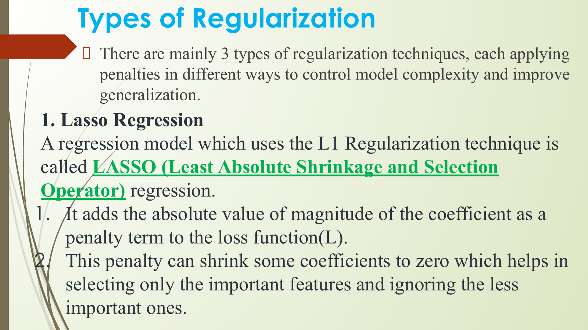

### Extracted Slide Text

- Types of Regularization
- There are mainly 3 types of regularization techniques, each applying
- penalties in different ways to control model complexity and improve
- generalization.
- 1. Lasso Regression
- A regression model which uses the L1 Regularization technique is
- called LASSO (Least Absolute Shrinkage and Selection
- Operator) regression.
- 1. It adds the absolute value of magnitude of the coefficient as a
- penalty term to the loss function(L).
- 2. This penalty can shrink some coefficients to zero which helps in
- selecting only the important features and ignoring the less
- important ones.

### Page Description And Teaching Notes

Slide type: bullet explanation slide.
Main idea: There are mainly 3 types of regularization techniques, each applying penalties in different ways to control model complexity and improve generalization. 1. Lasso Regression A regression model which uses the L1 Regularization technique is called LASSO (Least Absolute Shrinkage and Selection.
This page breaks the topic into separate points. Each bullet should be treated as a distinct exam or viva talking point, with the learner able to define it and give a small example.
Detailed page understanding:
- `There are mainly 3 types of regularization techniques, each applying` is a core visible point. Explain what it means, why it matters, and how it connects to the slide title.
- `penalties in different ways to control model complexity and improve` is a core visible point. Explain what it means, why it matters, and how it connects to the slide title.
- `generalization.` is a core visible point. Explain what it means, why it matters, and how it connects to the slide title.
- `1. Lasso Regression` is one item in the slide's list. Treat it as a separate subtopic and prepare a one-line explanation for it.
- `A regression model which uses the L1 Regularization technique is` is an application/example point. Convert it into a concrete real-world case while teaching.
- `called LASSO (Least Absolute Shrinkage and Selection` is a core visible point. Explain what it means, why it matters, and how it connects to the slide title.
- `Operator) regression.` is a core visible point. Explain what it means, why it matters, and how it connects to the slide title.
- `1. It adds the absolute value of magnitude of the coefficient as a` is one item in the slide's list. Treat it as a separate subtopic and prepare a one-line explanation for it.
- Additional bullets continue on the slide; use the extracted text list above for the complete wording.
- `important ones.` is a core visible point. Explain what it means, why it matters, and how it connects to the slide title.
Important visible terms: Types, Regularization There, Lasso Regression A, L1 Regularization, LASSO, Least Absolute Shrinkage, Selection Operator, This.
Visual/layout description: the embedded image preserves the actual slide. Describe the title area first, then read bullets, formulas, tables, arrows, grouped boxes, or diagrams in their visible order. If the slide contains a diagram, explain the relationship shown by arrows/positioning before explaining the text labels.
Teaching note: after reading the slide, ask the learner to restate the page in one or two sentences and give one example. For formula or metric slides, also ask what each variable or metric means and when it should be used.
Exam/viva note: prepare the slide title as a short-answer question, then use the bullets or visual labels as the expected answer points.

## Page 90: Lasso Regression

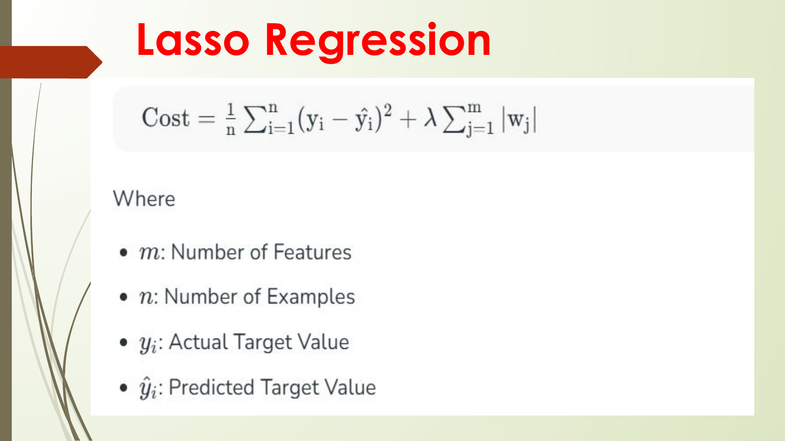

### Extracted Slide Text

- Lasso Regression

### Page Description And Teaching Notes

Slide type: title or transition slide.
Main idea: the slide is visual-first, so the image should be treated as the source for the content and structure.
This page sets the context for the next topic. Treat it as a section marker: it tells the learner what concept or unit is starting before the deck moves into definitions, examples, or formulas.
- No reliable selectable text was extracted; use the slide image for the visible diagram, chart, or screenshot.
Important visible terms: Lasso Regression.
Visual/layout description: the embedded image preserves the actual slide. Describe the title area first, then read bullets, formulas, tables, arrows, grouped boxes, or diagrams in their visible order. If the slide contains a diagram, explain the relationship shown by arrows/positioning before explaining the text labels.
Teaching note: after reading the slide, ask the learner to restate the page in one or two sentences and give one example. For formula or metric slides, also ask what each variable or metric means and when it should be used.
Exam/viva note: prepare the slide title as a short-answer question, then use the bullets or visual labels as the expected answer points.

## Page 91: from sklearn.linear_model import Lasso

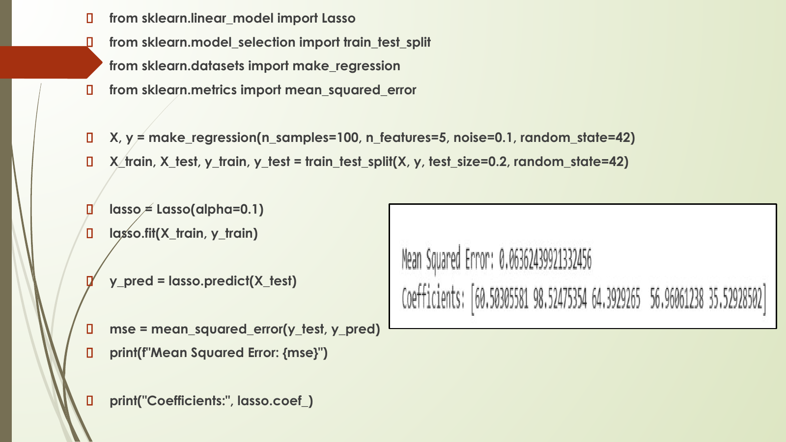

### Extracted Slide Text

- from sklearn.linear_model import Lasso
- from sklearn.model_selection import train_test_split
- from sklearn.datasets import make_regression
- from sklearn.metrics import mean_squared_error
- X, y = make_regression(n_samples=100, n_features=5, noise=0.1, random_state=42)
- X_train, X_test, y_train, y_test = train_test_split(X, y, test_size=0.2, random_state=42)
- lasso = Lasso(alpha=0.1)
- lasso.fit(X_train, y_train)
- y_pred = lasso.predict(X_test)
- mse = mean_squared_error(y_test, y_pred)
- print(f"Mean Squared Error: {mse}")
- print("Coefficients:", lasso.coef_)

### Page Description And Teaching Notes

Slide type: formula or calculation slide.
Main idea: from sklearn.model_selection import train_test_split from sklearn.datasets import make_regression from sklearn.metrics import mean_squared_error X, y = make_regression(n_samples=100, n_features=5, noise=0.1, random_state=42) X_train, X_test, y_train, y_test = train_test_split(X, y, test_size=0.2, random_state=42) lasso = Lasso(alpha=0.1).
This page should be read carefully because it introduces a calculation, objective, or optimization idea. Identify the variables in the formula, what quantity is being minimized or measured, and how the equation supports model training or evaluation.
Detailed page understanding:
- `from sklearn.model_selection import train_test_split` is a core visible point. Explain what it means, why it matters, and how it connects to the slide title.
- `from sklearn.datasets import make_regression` is a core visible point. Explain what it means, why it matters, and how it connects to the slide title.
- `from sklearn.metrics import mean_squared_error` is a limitation or risk. Mention when the method may fail and what alternative or precaution can reduce the issue.
- `X, y = make_regression(n_samples=100, n_features=5, noise=0.1, random_state=42)` is a core visible point. Explain what it means, why it matters, and how it connects to the slide title.
- `X_train, X_test, y_train, y_test = train_test_split(X, y, test_size=0.2, random_state=42)` is a core visible point. Explain what it means, why it matters, and how it connects to the slide title.
- `lasso = Lasso(alpha=0.1)` is a core visible point. Explain what it means, why it matters, and how it connects to the slide title.
- `lasso.fit(X_train, y_train)` is a core visible point. Explain what it means, why it matters, and how it connects to the slide title.
- `y_pred = lasso.predict(X_test)` is a core visible point. Explain what it means, why it matters, and how it connects to the slide title.
- Additional bullets continue on the slide; use the extracted text list above for the complete wording.
- `print("Coefficients:", lasso.coef_)` is a core visible point. Explain what it means, why it matters, and how it connects to the slide title.
Important visible terms: Lasso, Mean Squared Error, Coefficients.
Visual/layout description: the embedded image preserves the actual slide. Describe the title area first, then read bullets, formulas, tables, arrows, grouped boxes, or diagrams in their visible order. If the slide contains a diagram, explain the relationship shown by arrows/positioning before explaining the text labels.
Teaching note: after reading the slide, ask the learner to restate the page in one or two sentences and give one example. For formula or metric slides, also ask what each variable or metric means and when it should be used.
Exam/viva note: prepare the slide title as a short-answer question, then use the bullets or visual labels as the expected answer points.

## Page 92: X, y = make_regression(n_samples=100, n_features=5,

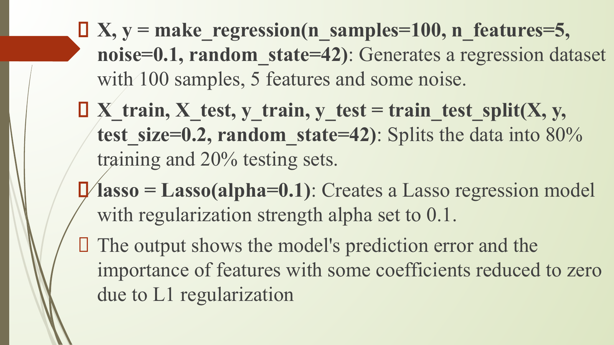

### Extracted Slide Text

- X, y = make_regression(n_samples=100, n_features=5,
- noise=0.1, random_state=42): Generates a regression dataset
- with 100 samples, 5 features and some noise.
- X_train, X_test, y_train, y_test = train_test_split(X, y,
- test_size=0.2, random_state=42): Splits the data into 80%
- training and 20% testing sets.
- lasso = Lasso(alpha=0.1): Creates a Lasso regression model
- with regularization strength alpha set to 0.1.
- The output shows the model's prediction error and the
- importance of features with some coefficients reduced to zero
- due to L1 regularization

### Page Description And Teaching Notes

Slide type: formula or calculation slide.
Main idea: noise=0.1, random_state=42): Generates a regression dataset with 100 samples, 5 features and some noise. X_train, X_test, y_train, y_test = train_test_split(X, y, test_size=0.2, random_state=42): Splits the data into 80% training and 20% testing sets. lasso = Lasso(alpha=0.1): Creates a Lasso regression model.
This page should be read carefully because it introduces a calculation, objective, or optimization idea. Identify the variables in the formula, what quantity is being minimized or measured, and how the equation supports model training or evaluation.
Detailed page understanding:
- `noise=0.1, random_state=42): Generates a regression dataset` is a core visible point. Explain what it means, why it matters, and how it connects to the slide title.
- `with 100 samples, 5 features and some noise.` is a core visible point. Explain what it means, why it matters, and how it connects to the slide title.
- `X_train, X_test, y_train, y_test = train_test_split(X, y,` is a core visible point. Explain what it means, why it matters, and how it connects to the slide title.
- `test_size=0.2, random_state=42): Splits the data into 80%` is a core visible point. Explain what it means, why it matters, and how it connects to the slide title.
- `training and 20% testing sets.` is a core visible point. Explain what it means, why it matters, and how it connects to the slide title.
- `lasso = Lasso(alpha=0.1): Creates a Lasso regression model` is a core visible point. Explain what it means, why it matters, and how it connects to the slide title.
- `with regularization strength alpha set to 0.1.` is a core visible point. Explain what it means, why it matters, and how it connects to the slide title.
- `The output shows the model's prediction error and the` is a limitation or risk. Mention when the method may fail and what alternative or precaution can reduce the issue.
- `importance of features with some coefficients reduced to zero` is a core visible point. Explain what it means, why it matters, and how it connects to the slide title.
- `due to L1 regularization` is a core visible point. Explain what it means, why it matters, and how it connects to the slide title.
Important visible terms: Generates, Splits, Lasso, Creates, The.
Visual/layout description: the embedded image preserves the actual slide. Describe the title area first, then read bullets, formulas, tables, arrows, grouped boxes, or diagrams in their visible order. If the slide contains a diagram, explain the relationship shown by arrows/positioning before explaining the text labels.
Teaching note: after reading the slide, ask the learner to restate the page in one or two sentences and give one example. For formula or metric slides, also ask what each variable or metric means and when it should be used.
Exam/viva note: prepare the slide title as a short-answer question, then use the bullets or visual labels as the expected answer points.

## Page 93: 2. Ridge Regression

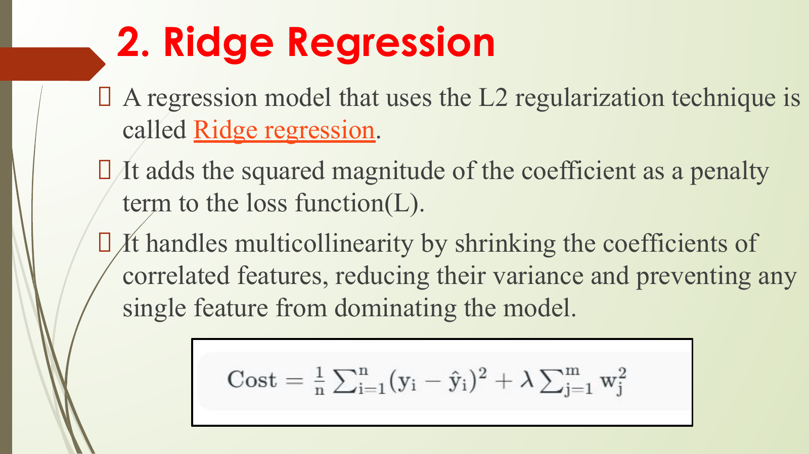

### Extracted Slide Text

- 2. Ridge Regression
- A regression model that uses the L2 regularization technique is
- called Ridge regression.
- It adds the squared magnitude of the coefficient as a penalty
- term to the loss function(L).
- It handles multicollinearity by shrinking the coefficients of
- correlated features, reducing their variance and preventing any
- single feature from dominating the model.

### Page Description And Teaching Notes

Slide type: bullet explanation slide.
Main idea: A regression model that uses the L2 regularization technique is called Ridge regression. It adds the squared magnitude of the coefficient as a penalty term to the loss function(L). It handles multicollinearity by shrinking the coefficients of correlated features, reducing their variance and preventing any.
This page breaks the topic into separate points. Each bullet should be treated as a distinct exam or viva talking point, with the learner able to define it and give a small example.
Detailed page understanding:
- `A regression model that uses the L2 regularization technique is` is an application/example point. Convert it into a concrete real-world case while teaching.
- `called Ridge regression.` is a core visible point. Explain what it means, why it matters, and how it connects to the slide title.
- `It adds the squared magnitude of the coefficient as a penalty` is a core visible point. Explain what it means, why it matters, and how it connects to the slide title.
- `term to the loss function(L).` is a core visible point. Explain what it means, why it matters, and how it connects to the slide title.
- `It handles multicollinearity by shrinking the coefficients of` is a core visible point. Explain what it means, why it matters, and how it connects to the slide title.
- `correlated features, reducing their variance and preventing any` is a core visible point. Explain what it means, why it matters, and how it connects to the slide title.
- `single feature from dominating the model.` is a core visible point. Explain what it means, why it matters, and how it connects to the slide title.
Important visible terms: Ridge Regression A, Ridge.
Visual/layout description: the embedded image preserves the actual slide. Describe the title area first, then read bullets, formulas, tables, arrows, grouped boxes, or diagrams in their visible order. If the slide contains a diagram, explain the relationship shown by arrows/positioning before explaining the text labels.
Teaching note: after reading the slide, ask the learner to restate the page in one or two sentences and give one example. For formula or metric slides, also ask what each variable or metric means and when it should be used.
Exam/viva note: prepare the slide title as a short-answer question, then use the bullets or visual labels as the expected answer points.

## Page 94: Where,

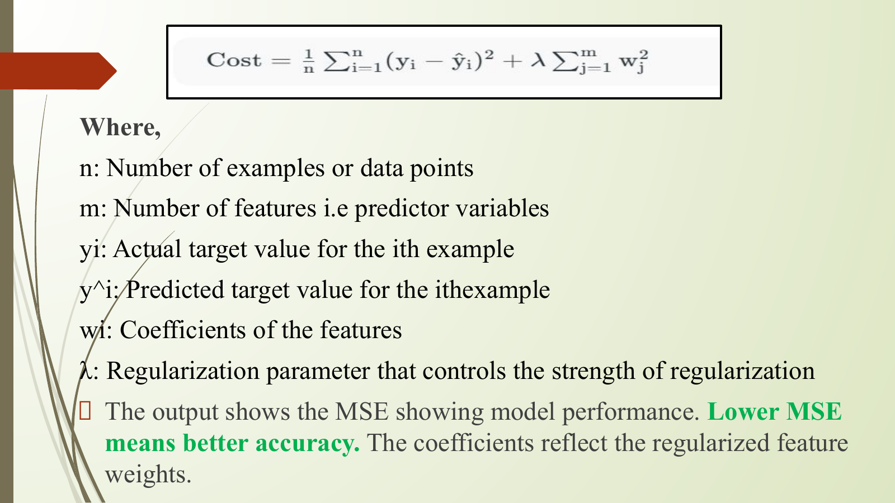

### Extracted Slide Text

- Where,
- n: Number of examples or data points
- m: Number of features i.e predictor variables
- yi: Actual target value for the ith example
- y^i: Predicted target value for the ithexample
- wi: Coefficients of the features
- λ: Regularization parameter that controls the strength of regularization
- The output shows the MSE showing model performance. Lower MSE
- means better accuracy. The coefficients reflect the regularized feature
- weights.

### Page Description And Teaching Notes

Slide type: metric/table slide.
Main idea: n: Number of examples or data points m: Number of features i.e predictor variables yi: Actual target value for the ith example y^i: Predicted target value for the ithexample wi: Coefficients of the features λ: Regularization parameter that controls the strength of regularization.
This page organizes evaluation or comparison information. Focus on what each metric measures, when it is useful, and what mistake it prevents when judging a machine-learning model.
Detailed page understanding:
- `n: Number of examples or data points` is an application/example point. Convert it into a concrete real-world case while teaching.
- `m: Number of features i.e predictor variables` is a core visible point. Explain what it means, why it matters, and how it connects to the slide title.
- `yi: Actual target value for the ith example` is an application/example point. Convert it into a concrete real-world case while teaching.
- `y^i: Predicted target value for the ithexample` is an application/example point. Convert it into a concrete real-world case while teaching.
- `wi: Coefficients of the features` is a core visible point. Explain what it means, why it matters, and how it connects to the slide title.
- `λ: Regularization parameter that controls the strength of regularization` is a core visible point. Explain what it means, why it matters, and how it connects to the slide title.
- `The output shows the MSE showing model performance. Lower MSE` is a core visible point. Explain what it means, why it matters, and how it connects to the slide title.
- `means better accuracy. The coefficients reflect the regularized feature` is a core visible point. Explain what it means, why it matters, and how it connects to the slide title.
- `weights.` is a core visible point. Explain what it means, why it matters, and how it connects to the slide title.
Important visible terms: Where, Number, Actual, Predicted, Coefficients, Regularization, The, MSE.
Visual/layout description: the embedded image preserves the actual slide. Describe the title area first, then read bullets, formulas, tables, arrows, grouped boxes, or diagrams in their visible order. If the slide contains a diagram, explain the relationship shown by arrows/positioning before explaining the text labels.
Teaching note: after reading the slide, ask the learner to restate the page in one or two sentences and give one example. For formula or metric slides, also ask what each variable or metric means and when it should be used.
Exam/viva note: prepare the slide title as a short-answer question, then use the bullets or visual labels as the expected answer points.

## Page 95: Unit II - Supervised Learning (Full Deck) Page 95

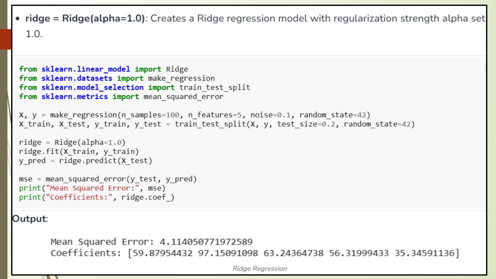

### Extracted Slide Text

- No selectable text extracted from this page.

### Page Description And Teaching Notes

Slide type: visual-only or image-heavy slide.
Main idea: the slide is visual-first, so the image should be treated as the source for the content and structure.
This page is primarily visual. The embedded slide image is the authoritative visual output; read it as a diagram or illustration first, then connect any visible labels to the surrounding pages.
- No reliable selectable text was extracted; use the slide image for the visible diagram, chart, or screenshot.
Visual/layout description: the embedded image preserves the actual slide. Describe the title area first, then read bullets, formulas, tables, arrows, grouped boxes, or diagrams in their visible order. If the slide contains a diagram, explain the relationship shown by arrows/positioning before explaining the text labels.
Teaching note: after reading the slide, ask the learner to restate the page in one or two sentences and give one example. For formula or metric slides, also ask what each variable or metric means and when it should be used.
Exam/viva note: prepare the slide title as a short-answer question, then use the bullets or visual labels as the expected answer points.

## Page 96: Lasso and Ridge

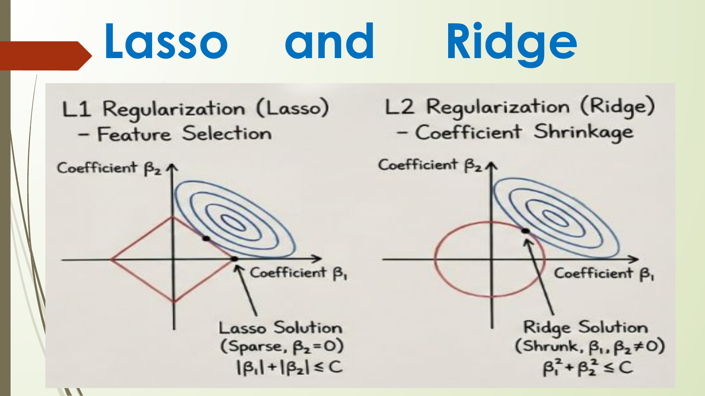

### Extracted Slide Text

- Lasso and Ridge

### Page Description And Teaching Notes

Slide type: title or transition slide.
Main idea: the slide is visual-first, so the image should be treated as the source for the content and structure.
This page sets the context for the next topic. Treat it as a section marker: it tells the learner what concept or unit is starting before the deck moves into definitions, examples, or formulas.
- No reliable selectable text was extracted; use the slide image for the visible diagram, chart, or screenshot.
Important visible terms: Lasso, Ridge.
Visual/layout description: the embedded image preserves the actual slide. Describe the title area first, then read bullets, formulas, tables, arrows, grouped boxes, or diagrams in their visible order. If the slide contains a diagram, explain the relationship shown by arrows/positioning before explaining the text labels.
Teaching note: after reading the slide, ask the learner to restate the page in one or two sentences and give one example. For formula or metric slides, also ask what each variable or metric means and when it should be used.
Exam/viva note: prepare the slide title as a short-answer question, then use the bullets or visual labels as the expected answer points.

## Page 97: 3. Elastic Net Regression

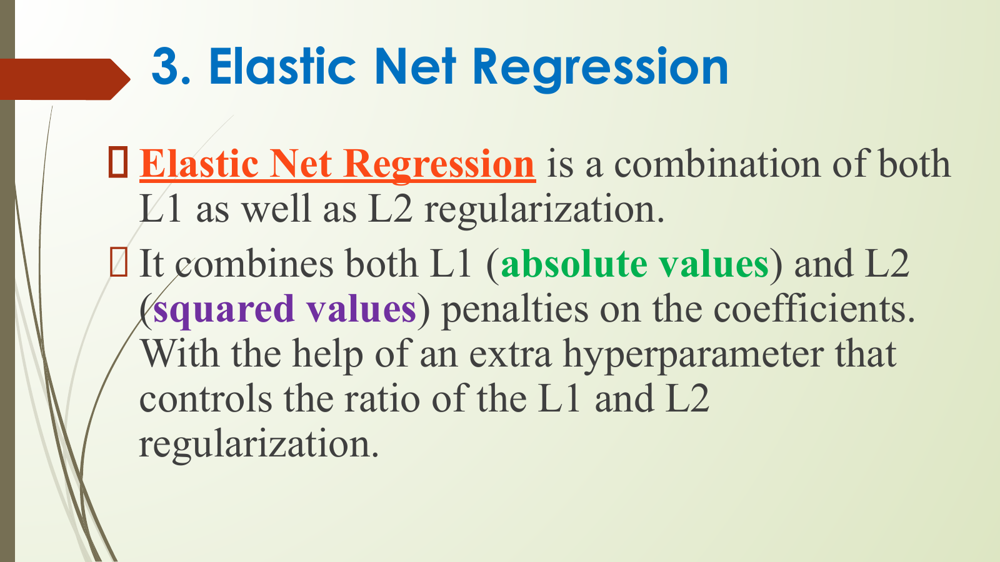

### Extracted Slide Text

- 3. Elastic Net Regression
- Elastic Net Regression is a combination of both
- L1 as well as L2 regularization.
- It combines both L1 (absolute values) and L2
- (squared values) penalties on the coefficients.
- With the help of an extra hyperparameter that
- controls the ratio of the L1 and L2
- regularization.

### Page Description And Teaching Notes

Slide type: bullet explanation slide.
Main idea: Elastic Net Regression is a combination of both L1 as well as L2 regularization. It combines both L1 (absolute values) and L2 (squared values) penalties on the coefficients. With the help of an extra hyperparameter that controls the ratio of the L1 and L2.
This page breaks the topic into separate points. Each bullet should be treated as a distinct exam or viva talking point, with the learner able to define it and give a small example.
Detailed page understanding:
- `Elastic Net Regression is a combination of both` gives the definition-level meaning. Explain it first in simple words, then connect it to how a model learns from data.
- `L1 as well as L2 regularization.` is a core visible point. Explain what it means, why it matters, and how it connects to the slide title.
- `It combines both L1 (absolute values) and L2` is a core visible point. Explain what it means, why it matters, and how it connects to the slide title.
- `(squared values) penalties on the coefficients.` is a core visible point. Explain what it means, why it matters, and how it connects to the slide title.
- `With the help of an extra hyperparameter that` is a core visible point. Explain what it means, why it matters, and how it connects to the slide title.
- `controls the ratio of the L1 and L2` is a core visible point. Explain what it means, why it matters, and how it connects to the slide title.
- `regularization.` is a core visible point. Explain what it means, why it matters, and how it connects to the slide title.
Important visible terms: Elastic Net Regression Elastic, Net Regression, With.
Visual/layout description: the embedded image preserves the actual slide. Describe the title area first, then read bullets, formulas, tables, arrows, grouped boxes, or diagrams in their visible order. If the slide contains a diagram, explain the relationship shown by arrows/positioning before explaining the text labels.
Teaching note: after reading the slide, ask the learner to restate the page in one or two sentences and give one example. For formula or metric slides, also ask what each variable or metric means and when it should be used.
Exam/viva note: prepare the slide title as a short-answer question, then use the bullets or visual labels as the expected answer points.

## Page 98: Unit II - Supervised Learning (Full Deck) Page 98

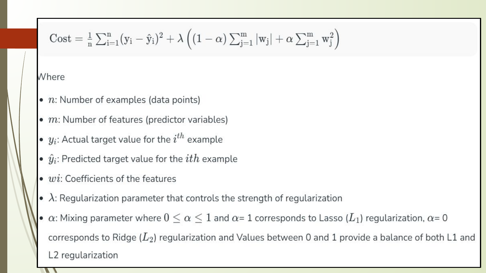

### Extracted Slide Text

- No selectable text extracted from this page.

### Page Description And Teaching Notes

Slide type: visual-only or image-heavy slide.
Main idea: the slide is visual-first, so the image should be treated as the source for the content and structure.
This page is primarily visual. The embedded slide image is the authoritative visual output; read it as a diagram or illustration first, then connect any visible labels to the surrounding pages.
- No reliable selectable text was extracted; use the slide image for the visible diagram, chart, or screenshot.
Visual/layout description: the embedded image preserves the actual slide. Describe the title area first, then read bullets, formulas, tables, arrows, grouped boxes, or diagrams in their visible order. If the slide contains a diagram, explain the relationship shown by arrows/positioning before explaining the text labels.
Teaching note: after reading the slide, ask the learner to restate the page in one or two sentences and give one example. For formula or metric slides, also ask what each variable or metric means and when it should be used.
Exam/viva note: prepare the slide title as a short-answer question, then use the bullets or visual labels as the expected answer points.

## Page 99: Unit II - Supervised Learning (Full Deck) Page 99

### Extracted Slide Text

- No selectable text extracted from this page.

### Page Description And Teaching Notes

Slide type: visual-only or image-heavy slide.
Main idea: the slide is visual-first, so the image should be treated as the source for the content and structure.
This page is primarily visual. The embedded slide image is the authoritative visual output; read it as a diagram or illustration first, then connect any visible labels to the surrounding pages.
- No reliable selectable text was extracted; use the slide image for the visible diagram, chart, or screenshot.
Visual/layout description: the embedded image preserves the actual slide. Describe the title area first, then read bullets, formulas, tables, arrows, grouped boxes, or diagrams in their visible order. If the slide contains a diagram, explain the relationship shown by arrows/positioning before explaining the text labels.
Teaching note: after reading the slide, ask the learner to restate the page in one or two sentences and give one example. For formula or metric slides, also ask what each variable or metric means and when it should be used.
Exam/viva note: prepare the slide title as a short-answer question, then use the bullets or visual labels as the expected answer points.

## Page 100: Benefits of Regularization

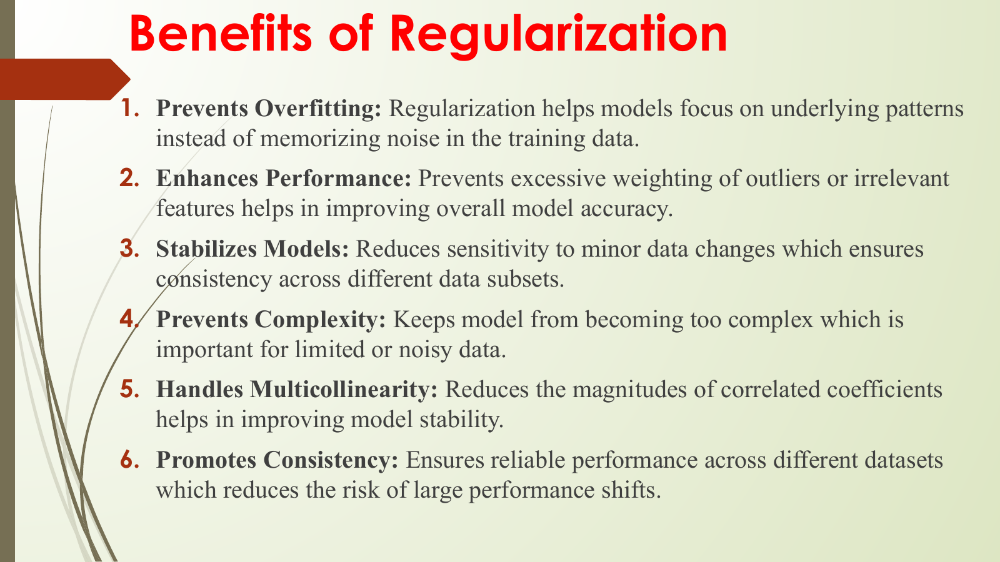

### Extracted Slide Text

- Benefits of Regularization
- 1. Prevents Overfitting: Regularization helps models focus on underlying patterns
- instead of memorizing noise in the training data.
- 2. Enhances Performance: Prevents excessive weighting of outliers or irrelevant
- features helps in improving overall model accuracy.
- 3. Stabilizes Models: Reduces sensitivity to minor data changes which ensures
- consistency across different data subsets.
- 4. Prevents Complexity: Keeps model from becoming too complex which is
- important for limited or noisy data.
- 5. Handles Multicollinearity: Reduces the magnitudes of correlated coefficients
- helps in improving model stability.
- 6. Promotes Consistency: Ensures reliable performance across different datasets
- which reduces the risk of large performance shifts.

### Page Description And Teaching Notes

Slide type: metric/table slide.
Main idea: 1. Prevents Overfitting: Regularization helps models focus on underlying patterns instead of memorizing noise in the training data. 2. Enhances Performance: Prevents excessive weighting of outliers or irrelevant features helps in improving overall model accuracy. 3. Stabilizes Models: Reduces sensitivity to minor data changes which ensures consistency across different data subsets.
This page organizes evaluation or comparison information. Focus on what each metric measures, when it is useful, and what mistake it prevents when judging a machine-learning model.
Detailed page understanding:
- `1. Prevents Overfitting: Regularization helps models focus on underlying patterns` states a benefit. Use it to justify why this method or concept is useful in a machine-learning workflow.
- `instead of memorizing noise in the training data.` is a core visible point. Explain what it means, why it matters, and how it connects to the slide title.
- `2. Enhances Performance: Prevents excessive weighting of outliers or irrelevant` is one item in the slide's list. Treat it as a separate subtopic and prepare a one-line explanation for it.
- `features helps in improving overall model accuracy.` states a benefit. Use it to justify why this method or concept is useful in a machine-learning workflow.
- `3. Stabilizes Models: Reduces sensitivity to minor data changes which ensures` is one item in the slide's list. Treat it as a separate subtopic and prepare a one-line explanation for it.
- `consistency across different data subsets.` is a core visible point. Explain what it means, why it matters, and how it connects to the slide title.
- `4. Prevents Complexity: Keeps model from becoming too complex which is` is one item in the slide's list. Treat it as a separate subtopic and prepare a one-line explanation for it.
- `important for limited or noisy data.` is a core visible point. Explain what it means, why it matters, and how it connects to the slide title.
- Additional bullets continue on the slide; use the extracted text list above for the complete wording.
- `which reduces the risk of large performance shifts.` is a core visible point. Explain what it means, why it matters, and how it connects to the slide title.
Important visible terms: Benefits, Regularization, Prevents Overfitting, Enhances Performance, Prevents, Stabilizes Models, Reduces, Prevents Complexity.
Visual/layout description: the embedded image preserves the actual slide. Describe the title area first, then read bullets, formulas, tables, arrows, grouped boxes, or diagrams in their visible order. If the slide contains a diagram, explain the relationship shown by arrows/positioning before explaining the text labels.
Teaching note: after reading the slide, ask the learner to restate the page in one or two sentences and give one example. For formula or metric slides, also ask what each variable or metric means and when it should be used.
Exam/viva note: prepare the slide title as a short-answer question, then use the bullets or visual labels as the expected answer points.

## Page 101: Unit II - Supervised Learning (Full Deck) Page 101

### Extracted Slide Text

- No selectable text extracted from this page.

### Page Description And Teaching Notes

Slide type: visual-only or image-heavy slide.
Main idea: the slide is visual-first, so the image should be treated as the source for the content and structure.
This page is primarily visual. The embedded slide image is the authoritative visual output; read it as a diagram or illustration first, then connect any visible labels to the surrounding pages.
- No reliable selectable text was extracted; use the slide image for the visible diagram, chart, or screenshot.
Visual/layout description: the embedded image preserves the actual slide. Describe the title area first, then read bullets, formulas, tables, arrows, grouped boxes, or diagrams in their visible order. If the slide contains a diagram, explain the relationship shown by arrows/positioning before explaining the text labels.
Teaching note: after reading the slide, ask the learner to restate the page in one or two sentences and give one example. For formula or metric slides, also ask what each variable or metric means and when it should be used.
Exam/viva note: prepare the slide title as a short-answer question, then use the bullets or visual labels as the expected answer points.
