# Unit III - Different Algorithms in Machine Learning

Source PDF: `ml class/UNIT-III Different Algorithms in Machine Learning.pptx.pdf`
Total pages: 32

These notes are written page by page. Every page includes the rendered slide image as visual output, the extracted text, and a detailed explanation of how to read the slide.

## Page 1: Unit-III: Different

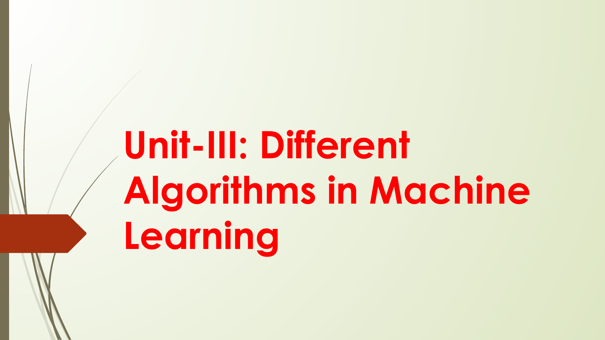

### Extracted Slide Text

- Unit-III: Different
- Algorithms in Machine
- Learning

### Page Description And Teaching Notes

Slide type: title or transition slide.
Main idea: Algorithms in Machine Learning.
This page sets the context for the next topic. Treat it as a section marker: it tells the learner what concept or unit is starting before the deck moves into definitions, examples, or formulas.
Detailed page understanding:
- `Algorithms in Machine` is a core visible point. Explain what it means, why it matters, and how it connects to the slide title.
- `Learning` is a core visible point. Explain what it means, why it matters, and how it connects to the slide title.
Important visible terms: Unit-III, Different Algorithms, Machine Learning.
Visual/layout description: the embedded image preserves the actual slide. Describe the title area first, then read bullets, formulas, tables, arrows, grouped boxes, or diagrams in their visible order. If the slide contains a diagram, explain the relationship shown by arrows/positioning before explaining the text labels.
Teaching note: after reading the slide, ask the learner to restate the page in one or two sentences and give one example. For formula or metric slides, also ask what each variable or metric means and when it should be used.
Exam/viva note: prepare the slide title as a short-answer question, then use the bullets or visual labels as the expected answer points.

## Page 2: 3.1

### Extracted Slide Text

- 3.1
- Evaluating Machine
- Learning algorithms
- and Model Selection

### Page Description And Teaching Notes

Slide type: bullet explanation slide.
Main idea: Evaluating Machine Learning algorithms and Model Selection.
This page breaks the topic into separate points. Each bullet should be treated as a distinct exam or viva talking point, with the learner able to define it and give a small example.
Detailed page understanding:
- `Evaluating Machine` is a core visible point. Explain what it means, why it matters, and how it connects to the slide title.
- `Learning algorithms` is a core visible point. Explain what it means, why it matters, and how it connects to the slide title.
- `and Model Selection` is a core visible point. Explain what it means, why it matters, and how it connects to the slide title.
Important visible terms: Evaluating Machine Learning, Model Selection.
Visual/layout description: the embedded image preserves the actual slide. Describe the title area first, then read bullets, formulas, tables, arrows, grouped boxes, or diagrams in their visible order. If the slide contains a diagram, explain the relationship shown by arrows/positioning before explaining the text labels.
Teaching note: after reading the slide, ask the learner to restate the page in one or two sentences and give one example. For formula or metric slides, also ask what each variable or metric means and when it should be used.
Exam/viva note: prepare the slide title as a short-answer question, then use the bullets or visual labels as the expected answer points.

## Page 3: Introduction

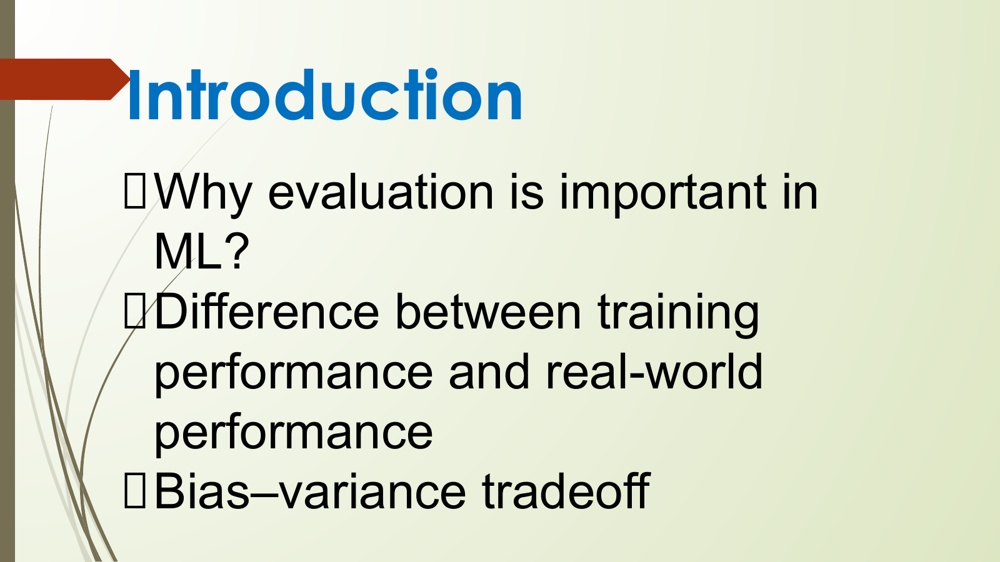

### Extracted Slide Text

- Introduction
- Why evaluation is important in
- ML?
- Difference between training
- performance and real-world
- performance
- Bias–variance tradeoff

### Page Description And Teaching Notes

Slide type: concept explanation slide.
Main idea: Why evaluation is important in ML? Difference between training performance and real-world performance Bias–variance tradeoff.
This page explains a core concept in prose. The main task is to convert the definition into a clear statement of what the concept is, why it is used, and where it appears in a machine-learning workflow.
Detailed page understanding:
- `Why evaluation is important in` is a core visible point. Explain what it means, why it matters, and how it connects to the slide title.
- `ML?` is a core visible point. Explain what it means, why it matters, and how it connects to the slide title.
- `Difference between training` is a core visible point. Explain what it means, why it matters, and how it connects to the slide title.
- `performance and real-world` is a core visible point. Explain what it means, why it matters, and how it connects to the slide title.
- `performance` is a core visible point. Explain what it means, why it matters, and how it connects to the slide title.
- `Bias–variance tradeoff` is a core visible point. Explain what it means, why it matters, and how it connects to the slide title.
Important visible terms: Introduction Why, Difference, Bias.
Visual/layout description: the embedded image preserves the actual slide. Describe the title area first, then read bullets, formulas, tables, arrows, grouped boxes, or diagrams in their visible order. If the slide contains a diagram, explain the relationship shown by arrows/positioning before explaining the text labels.
Teaching note: after reading the slide, ask the learner to restate the page in one or two sentences and give one example. For formula or metric slides, also ask what each variable or metric means and when it should be used.
Exam/viva note: prepare the slide title as a short-answer question, then use the bullets or visual labels as the expected answer points.

## Page 4: 2. Performance Metrics

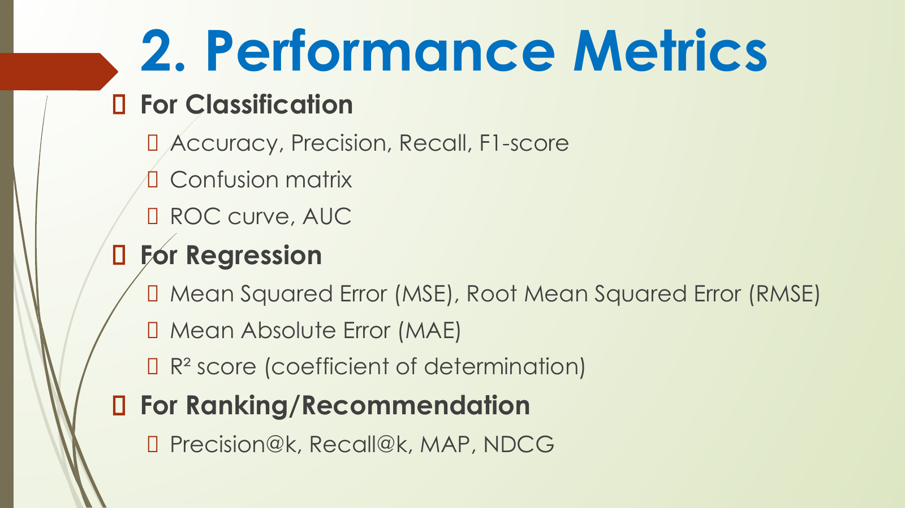

### Extracted Slide Text

- 2. Performance Metrics
- For Classification
- Accuracy, Precision, Recall, F1-score
- Confusion matrix
- ROC curve, AUC
- For Regression
- Mean Squared Error (MSE), Root Mean Squared Error (RMSE)
- Mean Absolute Error (MAE)
- R² score (coefficient of determination)
- For Ranking/Recommendation
- Precision@k, Recall@k, MAP, NDCG

### Page Description And Teaching Notes

Slide type: formula or calculation slide.
Main idea: For Classification Accuracy, Precision, Recall, F1-score Confusion matrix ROC curve, AUC For Regression Mean Squared Error (MSE), Root Mean Squared Error (RMSE).
This page should be read carefully because it introduces a calculation, objective, or optimization idea. Identify the variables in the formula, what quantity is being minimized or measured, and how the equation supports model training or evaluation.
Detailed page understanding:
- `For Classification` is a core visible point. Explain what it means, why it matters, and how it connects to the slide title.
- `Accuracy, Precision, Recall, F1-score` is a core visible point. Explain what it means, why it matters, and how it connects to the slide title.
- `Confusion matrix` is a core visible point. Explain what it means, why it matters, and how it connects to the slide title.
- `ROC curve, AUC` is a core visible point. Explain what it means, why it matters, and how it connects to the slide title.
- `For Regression` is a core visible point. Explain what it means, why it matters, and how it connects to the slide title.
- `Mean Squared Error (MSE), Root Mean Squared Error (RMSE)` is a limitation or risk. Mention when the method may fail and what alternative or precaution can reduce the issue.
- `Mean Absolute Error (MAE)` is a limitation or risk. Mention when the method may fail and what alternative or precaution can reduce the issue.
- `R² score (coefficient of determination)` is a core visible point. Explain what it means, why it matters, and how it connects to the slide title.
- `For Ranking/Recommendation` is a core visible point. Explain what it means, why it matters, and how it connects to the slide title.
- `Precision@k, Recall@k, MAP, NDCG` is a core visible point. Explain what it means, why it matters, and how it connects to the slide title.
Important visible terms: Performance Metrics For Classification, Accuracy, Precision, Recall, F1-score Confusion, ROC, AUC For Regression Mean, Squared Error.
Visual/layout description: the embedded image preserves the actual slide. Describe the title area first, then read bullets, formulas, tables, arrows, grouped boxes, or diagrams in their visible order. If the slide contains a diagram, explain the relationship shown by arrows/positioning before explaining the text labels.
Teaching note: after reading the slide, ask the learner to restate the page in one or two sentences and give one example. For formula or metric slides, also ask what each variable or metric means and when it should be used.
Exam/viva note: prepare the slide title as a short-answer question, then use the bullets or visual labels as the expected answer points.

## Page 5: 3. Validation Techniques

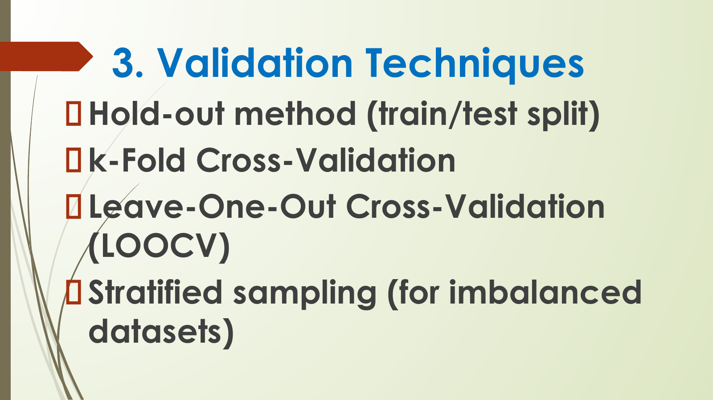

### Extracted Slide Text

- 3. Validation Techniques
- Hold-out method (train/test split)
- k-Fold Cross-Validation
- Leave-One-Out Cross-Validation
- (LOOCV)
- Stratified sampling (for imbalanced
- datasets)

### Page Description And Teaching Notes

Slide type: bullet explanation slide.
Main idea: Hold-out method (train/test split) k-Fold Cross-Validation Leave-One-Out Cross-Validation (LOOCV) Stratified sampling (for imbalanced datasets).
This page breaks the topic into separate points. Each bullet should be treated as a distinct exam or viva talking point, with the learner able to define it and give a small example.
Detailed page understanding:
- `Hold-out method (train/test split)` is a core visible point. Explain what it means, why it matters, and how it connects to the slide title.
- `k-Fold Cross-Validation` is a core visible point. Explain what it means, why it matters, and how it connects to the slide title.
- `Leave-One-Out Cross-Validation` is a core visible point. Explain what it means, why it matters, and how it connects to the slide title.
- `(LOOCV)` is a core visible point. Explain what it means, why it matters, and how it connects to the slide title.
- `Stratified sampling (for imbalanced` is a core visible point. Explain what it means, why it matters, and how it connects to the slide title.
- `datasets)` is a core visible point. Explain what it means, why it matters, and how it connects to the slide title.
Important visible terms: Validation Techniques Hold-out, Fold Cross-Validation Leave-One-Out Cross-Validation, LOOCV, Stratified.
Visual/layout description: the embedded image preserves the actual slide. Describe the title area first, then read bullets, formulas, tables, arrows, grouped boxes, or diagrams in their visible order. If the slide contains a diagram, explain the relationship shown by arrows/positioning before explaining the text labels.
Teaching note: after reading the slide, ask the learner to restate the page in one or two sentences and give one example. For formula or metric slides, also ask what each variable or metric means and when it should be used.
Exam/viva note: prepare the slide title as a short-answer question, then use the bullets or visual labels as the expected answer points.

## Page 6: 4. Model Selection Strategies

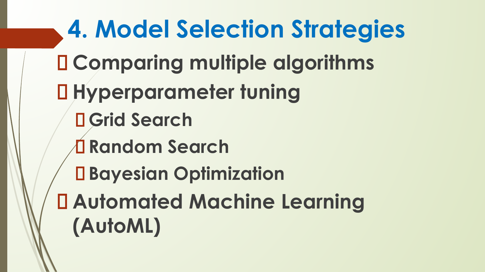

### Extracted Slide Text

- 4. Model Selection Strategies
- Comparing multiple algorithms
- Hyperparameter tuning
- Grid Search
- Random Search
- Bayesian Optimization
- Automated Machine Learning
- (AutoML)

### Page Description And Teaching Notes

Slide type: bullet explanation slide.
Main idea: Comparing multiple algorithms Hyperparameter tuning Grid Search Random Search Bayesian Optimization Automated Machine Learning.
This page breaks the topic into separate points. Each bullet should be treated as a distinct exam or viva talking point, with the learner able to define it and give a small example.
Detailed page understanding:
- `Comparing multiple algorithms` is a core visible point. Explain what it means, why it matters, and how it connects to the slide title.
- `Hyperparameter tuning` is a core visible point. Explain what it means, why it matters, and how it connects to the slide title.
- `Grid Search` is a core visible point. Explain what it means, why it matters, and how it connects to the slide title.
- `Random Search` is a core visible point. Explain what it means, why it matters, and how it connects to the slide title.
- `Bayesian Optimization` is a core visible point. Explain what it means, why it matters, and how it connects to the slide title.
- `Automated Machine Learning` is a core visible point. Explain what it means, why it matters, and how it connects to the slide title.
- `(AutoML)` is a core visible point. Explain what it means, why it matters, and how it connects to the slide title.
Important visible terms: Model Selection Strategies Comparing, Hyperparameter, Grid Search Random Search, Bayesian Optimization Automated Machine, Learning, AutoML.
Visual/layout description: the embedded image preserves the actual slide. Describe the title area first, then read bullets, formulas, tables, arrows, grouped boxes, or diagrams in their visible order. If the slide contains a diagram, explain the relationship shown by arrows/positioning before explaining the text labels.
Teaching note: after reading the slide, ask the learner to restate the page in one or two sentences and give one example. For formula or metric slides, also ask what each variable or metric means and when it should be used.
Exam/viva note: prepare the slide title as a short-answer question, then use the bullets or visual labels as the expected answer points.

## Page 7: 5. Overfitting and Underfitting

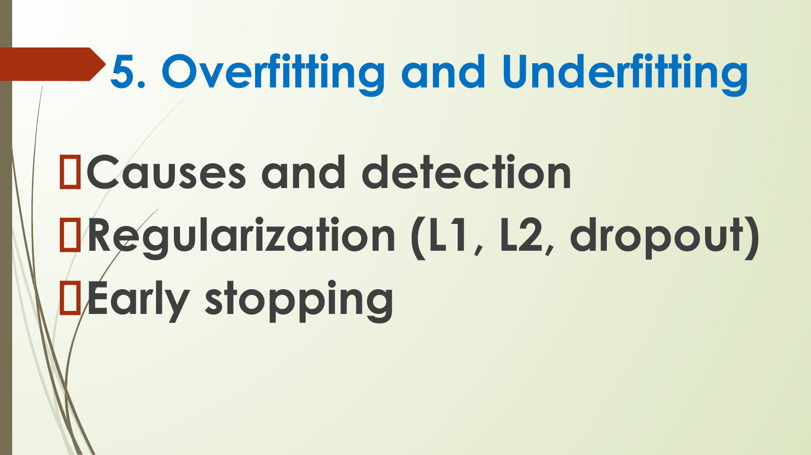

### Extracted Slide Text

- 5. Overfitting and Underfitting
- Causes and detection
- Regularization (L1, L2, dropout)
- Early stopping

### Page Description And Teaching Notes

Slide type: bullet explanation slide.
Main idea: Causes and detection Regularization (L1, L2, dropout) Early stopping.
This page breaks the topic into separate points. Each bullet should be treated as a distinct exam or viva talking point, with the learner able to define it and give a small example.
Detailed page understanding:
- `Causes and detection` is an application/example point. Convert it into a concrete real-world case while teaching.
- `Regularization (L1, L2, dropout)` is a core visible point. Explain what it means, why it matters, and how it connects to the slide title.
- `Early stopping` is a core visible point. Explain what it means, why it matters, and how it connects to the slide title.
Important visible terms: Overfitting, Underfitting Causes, Regularization, Early.
Visual/layout description: the embedded image preserves the actual slide. Describe the title area first, then read bullets, formulas, tables, arrows, grouped boxes, or diagrams in their visible order. If the slide contains a diagram, explain the relationship shown by arrows/positioning before explaining the text labels.
Teaching note: after reading the slide, ask the learner to restate the page in one or two sentences and give one example. For formula or metric slides, also ask what each variable or metric means and when it should be used.
Exam/viva note: prepare the slide title as a short-answer question, then use the bullets or visual labels as the expected answer points.

## Page 8: 6. Model Complexity and

### Extracted Slide Text

- 6. Model Complexity and
- Generalization
- Bias–variance tradeoff revisited
- Model capacity vs dataset size
- Occam’s razor principle in ML

### Page Description And Teaching Notes

Slide type: bullet explanation slide.
Main idea: Generalization Bias–variance tradeoff revisited Model capacity vs dataset size Occam’s razor principle in ML.
This page breaks the topic into separate points. Each bullet should be treated as a distinct exam or viva talking point, with the learner able to define it and give a small example.
Detailed page understanding:
- `Generalization` is a core visible point. Explain what it means, why it matters, and how it connects to the slide title.
- `Bias–variance tradeoff revisited` is a core visible point. Explain what it means, why it matters, and how it connects to the slide title.
- `Model capacity vs dataset size` is a core visible point. Explain what it means, why it matters, and how it connects to the slide title.
- `Occam’s razor principle in ML` is a core visible point. Explain what it means, why it matters, and how it connects to the slide title.
Important visible terms: Model Complexity, Generalization Bias, Model, Occam.
Visual/layout description: the embedded image preserves the actual slide. Describe the title area first, then read bullets, formulas, tables, arrows, grouped boxes, or diagrams in their visible order. If the slide contains a diagram, explain the relationship shown by arrows/positioning before explaining the text labels.
Teaching note: after reading the slide, ask the learner to restate the page in one or two sentences and give one example. For formula or metric slides, also ask what each variable or metric means and when it should be used.
Exam/viva note: prepare the slide title as a short-answer question, then use the bullets or visual labels as the expected answer points.

## Page 9: Unit III - Different Algorithms in Machine Learning Page 9

### Extracted Slide Text

- No selectable text extracted from this page.

### Page Description And Teaching Notes

Slide type: visual-only or image-heavy slide.
Main idea: the slide is visual-first, so the image should be treated as the source for the content and structure.
This page is primarily visual. The embedded slide image is the authoritative visual output; read it as a diagram or illustration first, then connect any visible labels to the surrounding pages.
- No reliable selectable text was extracted; use the slide image for the visible diagram, chart, or screenshot.
Visual/layout description: the embedded image preserves the actual slide. Describe the title area first, then read bullets, formulas, tables, arrows, grouped boxes, or diagrams in their visible order. If the slide contains a diagram, explain the relationship shown by arrows/positioning before explaining the text labels.
Teaching note: after reading the slide, ask the learner to restate the page in one or two sentences and give one example. For formula or metric slides, also ask what each variable or metric means and when it should be used.
Exam/viva note: prepare the slide title as a short-answer question, then use the bullets or visual labels as the expected answer points.

## Page 10: 3.2

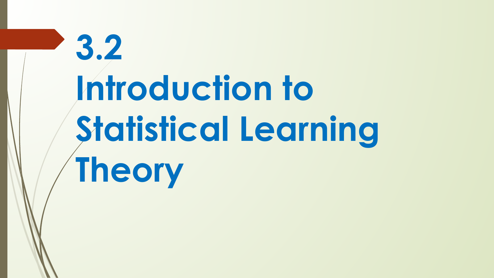

### Extracted Slide Text

- 3.2
- Introduction to
- Statistical Learning
- Theory

### Page Description And Teaching Notes

Slide type: bullet explanation slide.
Main idea: Introduction to Statistical Learning Theory.
This page breaks the topic into separate points. Each bullet should be treated as a distinct exam or viva talking point, with the learner able to define it and give a small example.
Detailed page understanding:
- `Introduction to` is a core visible point. Explain what it means, why it matters, and how it connects to the slide title.
- `Statistical Learning` is a core visible point. Explain what it means, why it matters, and how it connects to the slide title.
- `Theory` is a core visible point. Explain what it means, why it matters, and how it connects to the slide title.
Important visible terms: Introduction, Statistical Learning Theory.
Visual/layout description: the embedded image preserves the actual slide. Describe the title area first, then read bullets, formulas, tables, arrows, grouped boxes, or diagrams in their visible order. If the slide contains a diagram, explain the relationship shown by arrows/positioning before explaining the text labels.
Teaching note: after reading the slide, ask the learner to restate the page in one or two sentences and give one example. For formula or metric slides, also ask what each variable or metric means and when it should be used.
Exam/viva note: prepare the slide title as a short-answer question, then use the bullets or visual labels as the expected answer points.

## Page 11: Statistical Learning Theory (SLT) is a theoretical

### Extracted Slide Text

- Statistical Learning Theory (SLT) is a theoretical
- framework for understanding
- how machines learn from data and make
- predictions.
- It provides the mathematical foundations
- behind many modern machine learning
- algorithms and helps explain their performance,
- limitations, and generalization ability.

### Page Description And Teaching Notes

Slide type: concept explanation slide.
Main idea: framework for understanding how machines learn from data and make predictions. It provides the mathematical foundations behind many modern machine learning algorithms and helps explain their performance,.
This page explains a core concept in prose. The main task is to convert the definition into a clear statement of what the concept is, why it is used, and where it appears in a machine-learning workflow.
Detailed page understanding:
- `framework for understanding` is a core visible point. Explain what it means, why it matters, and how it connects to the slide title.
- `how machines learn from data and make` is a core visible point. Explain what it means, why it matters, and how it connects to the slide title.
- `predictions.` is a core visible point. Explain what it means, why it matters, and how it connects to the slide title.
- `It provides the mathematical foundations` is a core visible point. Explain what it means, why it matters, and how it connects to the slide title.
- `behind many modern machine learning` is a core visible point. Explain what it means, why it matters, and how it connects to the slide title.
- `algorithms and helps explain their performance,` states a benefit. Use it to justify why this method or concept is useful in a machine-learning workflow.
- `limitations, and generalization ability.` is a limitation or risk. Mention when the method may fail and what alternative or precaution can reduce the issue.
Important visible terms: Statistical Learning Theory, SLT.
Visual/layout description: the embedded image preserves the actual slide. Describe the title area first, then read bullets, formulas, tables, arrows, grouped boxes, or diagrams in their visible order. If the slide contains a diagram, explain the relationship shown by arrows/positioning before explaining the text labels.
Teaching note: after reading the slide, ask the learner to restate the page in one or two sentences and give one example. For formula or metric slides, also ask what each variable or metric means and when it should be used.
Exam/viva note: prepare the slide title as a short-answer question, then use the bullets or visual labels as the expected answer points.

## Page 12: Unit III - Different Algorithms in Machine Learning Page 12

### Extracted Slide Text

- No selectable text extracted from this page.

### Page Description And Teaching Notes

Slide type: visual-only or image-heavy slide.
Main idea: the slide is visual-first, so the image should be treated as the source for the content and structure.
This page is primarily visual. The embedded slide image is the authoritative visual output; read it as a diagram or illustration first, then connect any visible labels to the surrounding pages.
- No reliable selectable text was extracted; use the slide image for the visible diagram, chart, or screenshot.
Visual/layout description: the embedded image preserves the actual slide. Describe the title area first, then read bullets, formulas, tables, arrows, grouped boxes, or diagrams in their visible order. If the slide contains a diagram, explain the relationship shown by arrows/positioning before explaining the text labels.
Teaching note: after reading the slide, ask the learner to restate the page in one or two sentences and give one example. For formula or metric slides, also ask what each variable or metric means and when it should be used.
Exam/viva note: prepare the slide title as a short-answer question, then use the bullets or visual labels as the expected answer points.

## Page 13: Unit III - Different Algorithms in Machine Learning Page 13

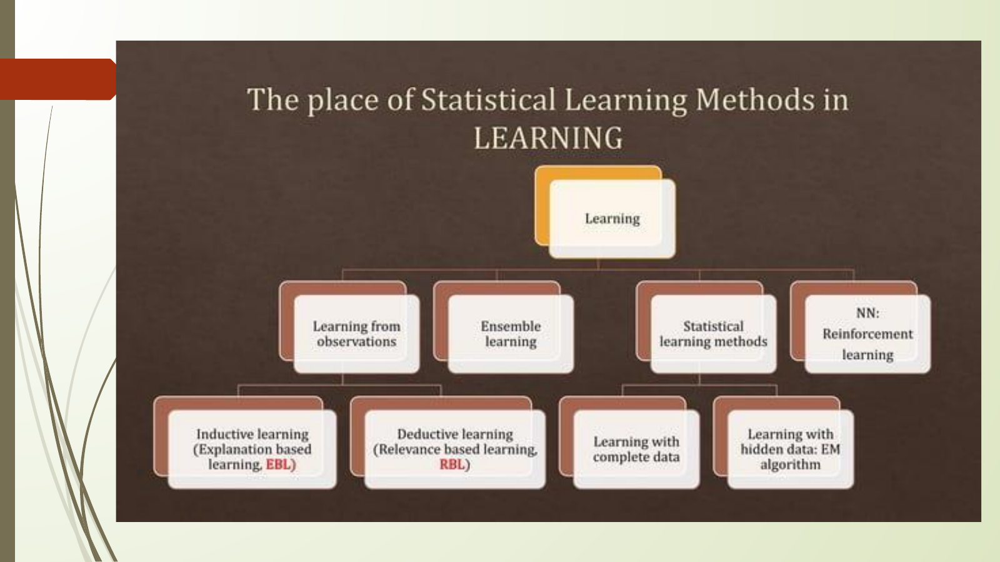

### Extracted Slide Text

- No selectable text extracted from this page.

### Page Description And Teaching Notes

Slide type: visual-only or image-heavy slide.
Main idea: the slide is visual-first, so the image should be treated as the source for the content and structure.
This page is primarily visual. The embedded slide image is the authoritative visual output; read it as a diagram or illustration first, then connect any visible labels to the surrounding pages.
- No reliable selectable text was extracted; use the slide image for the visible diagram, chart, or screenshot.
Visual/layout description: the embedded image preserves the actual slide. Describe the title area first, then read bullets, formulas, tables, arrows, grouped boxes, or diagrams in their visible order. If the slide contains a diagram, explain the relationship shown by arrows/positioning before explaining the text labels.
Teaching note: after reading the slide, ask the learner to restate the page in one or two sentences and give one example. For formula or metric slides, also ask what each variable or metric means and when it should be used.
Exam/viva note: prepare the slide title as a short-answer question, then use the bullets or visual labels as the expected answer points.

## Page 14: Learning Problem

### Extracted Slide Text

- Learning Problem
- Input: A dataset consisting of feature vectors
- and corresponding labels.
- Goal: Learn a function (hypothesis) that
- maps inputs to outputs with minimal error.
- Hypothesis Space (H)
- The set of all possible models the learning
- algorithm can choose from.
- Example: In linear regression, the hypothesis
- space is the set of all linear functions.

### Page Description And Teaching Notes

Slide type: concept explanation slide.
Main idea: Input: A dataset consisting of feature vectors and corresponding labels. Goal: Learn a function (hypothesis) that maps inputs to outputs with minimal error. Hypothesis Space (H) The set of all possible models the learning.
This page explains a core concept in prose. The main task is to convert the definition into a clear statement of what the concept is, why it is used, and where it appears in a machine-learning workflow.
Detailed page understanding:
- `Input: A dataset consisting of feature vectors` is a core visible point. Explain what it means, why it matters, and how it connects to the slide title.
- `and corresponding labels.` is a core visible point. Explain what it means, why it matters, and how it connects to the slide title.
- `Goal: Learn a function (hypothesis) that` is a core visible point. Explain what it means, why it matters, and how it connects to the slide title.
- `maps inputs to outputs with minimal error.` is a limitation or risk. Mention when the method may fail and what alternative or precaution can reduce the issue.
- `Hypothesis Space (H)` is a core visible point. Explain what it means, why it matters, and how it connects to the slide title.
- `The set of all possible models the learning` is a core visible point. Explain what it means, why it matters, and how it connects to the slide title.
- `algorithm can choose from.` is a core visible point. Explain what it means, why it matters, and how it connects to the slide title.
- `Example: In linear regression, the hypothesis` is an application/example point. Convert it into a concrete real-world case while teaching.
- `space is the set of all linear functions.` is a core visible point. Explain what it means, why it matters, and how it connects to the slide title.
Important visible terms: Learning Problem Input, Goal, Learn, Hypothesis Space, The, Example.
Visual/layout description: the embedded image preserves the actual slide. Describe the title area first, then read bullets, formulas, tables, arrows, grouped boxes, or diagrams in their visible order. If the slide contains a diagram, explain the relationship shown by arrows/positioning before explaining the text labels.
Teaching note: after reading the slide, ask the learner to restate the page in one or two sentences and give one example. For formula or metric slides, also ask what each variable or metric means and when it should be used.
Exam/viva note: prepare the slide title as a short-answer question, then use the bullets or visual labels as the expected answer points.

## Page 15: •Risk and Loss Functions

### Extracted Slide Text

- •Risk and Loss Functions
- Loss function: Measures the error of predictions (e.g.,
- squared error, hinge loss, cross-entropy).
- Expected Risk (True Risk): Average loss over the
- entire data distribution (unknown in practice).
- Empirical Risk: Average loss over the training dataset
- (known).
- Empirical Risk Minimization (ERM)
- A principle where the learner chooses the hypothesis
- that minimizes the training error.
- Problem: ERM may lead to overfitting if the
- hypothesis is too complex.

### Page Description And Teaching Notes

Slide type: bullet explanation slide.
Main idea: Loss function: Measures the error of predictions (e.g., squared error, hinge loss, cross-entropy). Expected Risk (True Risk): Average loss over the entire data distribution (unknown in practice). Empirical Risk: Average loss over the training dataset (known).
This page breaks the topic into separate points. Each bullet should be treated as a distinct exam or viva talking point, with the learner able to define it and give a small example.
Detailed page understanding:
- `Loss function: Measures the error of predictions (e.g.,` is a limitation or risk. Mention when the method may fail and what alternative or precaution can reduce the issue.
- `squared error, hinge loss, cross-entropy).` is a limitation or risk. Mention when the method may fail and what alternative or precaution can reduce the issue.
- `Expected Risk (True Risk): Average loss over the` is a core visible point. Explain what it means, why it matters, and how it connects to the slide title.
- `entire data distribution (unknown in practice).` is a core visible point. Explain what it means, why it matters, and how it connects to the slide title.
- `Empirical Risk: Average loss over the training dataset` is a core visible point. Explain what it means, why it matters, and how it connects to the slide title.
- `(known).` is a core visible point. Explain what it means, why it matters, and how it connects to the slide title.
- `Empirical Risk Minimization (ERM)` is a core visible point. Explain what it means, why it matters, and how it connects to the slide title.
- `A principle where the learner chooses the hypothesis` is a core visible point. Explain what it means, why it matters, and how it connects to the slide title.
- Additional bullets continue on the slide; use the extracted text list above for the complete wording.
- `hypothesis is too complex.` is a core visible point. Explain what it means, why it matters, and how it connects to the slide title.
Important visible terms: Risk, Loss Functions Loss, Measures, Expected Risk, True Risk, Average, Empirical Risk, Empirical Risk Minimization.
Visual/layout description: the embedded image preserves the actual slide. Describe the title area first, then read bullets, formulas, tables, arrows, grouped boxes, or diagrams in their visible order. If the slide contains a diagram, explain the relationship shown by arrows/positioning before explaining the text labels.
Teaching note: after reading the slide, ask the learner to restate the page in one or two sentences and give one example. For formula or metric slides, also ask what each variable or metric means and when it should be used.
Exam/viva note: prepare the slide title as a short-answer question, then use the bullets or visual labels as the expected answer points.

## Page 16: •Generalization

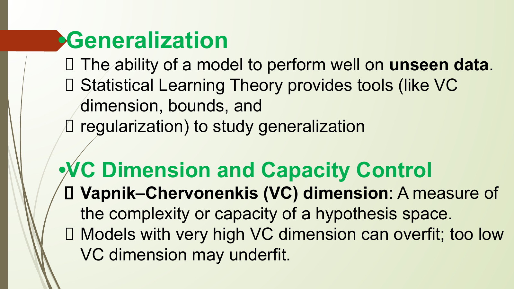

### Extracted Slide Text

- •Generalization
- The ability of a model to perform well on unseen data.
- Statistical Learning Theory provides tools (like VC
- dimension, bounds, and
- regularization) to study generalization
- •VC Dimension and Capacity Control
- Vapnik–Chervonenkis (VC) dimension: A measure of
- the complexity or capacity of a hypothesis space.
- Models with very high VC dimension can overfit; too low
- VC dimension may underfit.

### Page Description And Teaching Notes

Slide type: bullet explanation slide.
Main idea: The ability of a model to perform well on unseen data. Statistical Learning Theory provides tools (like VC dimension, bounds, and regularization) to study generalization •VC Dimension and Capacity Control Vapnik–Chervonenkis (VC) dimension: A measure of.
This page breaks the topic into separate points. Each bullet should be treated as a distinct exam or viva talking point, with the learner able to define it and give a small example.
Detailed page understanding:
- `The ability of a model to perform well on unseen data.` is a core visible point. Explain what it means, why it matters, and how it connects to the slide title.
- `Statistical Learning Theory provides tools (like VC` is a core visible point. Explain what it means, why it matters, and how it connects to the slide title.
- `dimension, bounds, and` is a core visible point. Explain what it means, why it matters, and how it connects to the slide title.
- `regularization) to study generalization` is a core visible point. Explain what it means, why it matters, and how it connects to the slide title.
- `•VC Dimension and Capacity Control` is one item in the slide's list. Treat it as a separate subtopic and prepare a one-line explanation for it.
- `Vapnik–Chervonenkis (VC) dimension: A measure of` is a core visible point. Explain what it means, why it matters, and how it connects to the slide title.
- `the complexity or capacity of a hypothesis space.` is a core visible point. Explain what it means, why it matters, and how it connects to the slide title.
- `Models with very high VC dimension can overfit; too low` is a core visible point. Explain what it means, why it matters, and how it connects to the slide title.
- `VC dimension may underfit.` is a core visible point. Explain what it means, why it matters, and how it connects to the slide title.
Important visible terms: Generalization The, Statistical Learning Theory, VC Dimension, Capacity Control Vapnik, Chervonenkis, Models.
Visual/layout description: the embedded image preserves the actual slide. Describe the title area first, then read bullets, formulas, tables, arrows, grouped boxes, or diagrams in their visible order. If the slide contains a diagram, explain the relationship shown by arrows/positioning before explaining the text labels.
Teaching note: after reading the slide, ask the learner to restate the page in one or two sentences and give one example. For formula or metric slides, also ask what each variable or metric means and when it should be used.
Exam/viva note: prepare the slide title as a short-answer question, then use the bullets or visual labels as the expected answer points.

## Page 17: •Structural Risk Minimization (SRM)

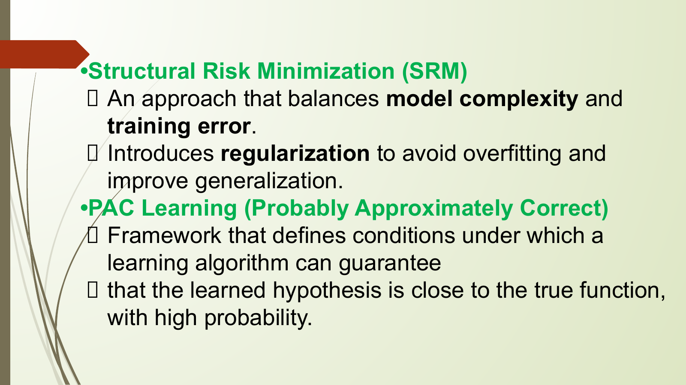

### Extracted Slide Text

- •Structural Risk Minimization (SRM)
- An approach that balances model complexity and
- training error.
- Introduces regularization to avoid overfitting and
- improve generalization.
- •PAC Learning (Probably Approximately Correct)
- Framework that defines conditions under which a
- learning algorithm can guarantee
- that the learned hypothesis is close to the true function,
- with high probability.

### Page Description And Teaching Notes

Slide type: bullet explanation slide.
Main idea: An approach that balances model complexity and training error. Introduces regularization to avoid overfitting and improve generalization. •PAC Learning (Probably Approximately Correct) Framework that defines conditions under which a.
This page breaks the topic into separate points. Each bullet should be treated as a distinct exam or viva talking point, with the learner able to define it and give a small example.
Detailed page understanding:
- `An approach that balances model complexity and` is a core visible point. Explain what it means, why it matters, and how it connects to the slide title.
- `training error.` is a limitation or risk. Mention when the method may fail and what alternative or precaution can reduce the issue.
- `Introduces regularization to avoid overfitting and` is a core visible point. Explain what it means, why it matters, and how it connects to the slide title.
- `improve generalization.` is a core visible point. Explain what it means, why it matters, and how it connects to the slide title.
- `•PAC Learning (Probably Approximately Correct)` is one item in the slide's list. Treat it as a separate subtopic and prepare a one-line explanation for it.
- `Framework that defines conditions under which a` is a core visible point. Explain what it means, why it matters, and how it connects to the slide title.
- `learning algorithm can guarantee` is a core visible point. Explain what it means, why it matters, and how it connects to the slide title.
- `that the learned hypothesis is close to the true function,` is a core visible point. Explain what it means, why it matters, and how it connects to the slide title.
- `with high probability.` is a core visible point. Explain what it means, why it matters, and how it connects to the slide title.
Important visible terms: Structural Risk Minimization, SRM, Introduces, PAC Learning, Probably Approximately Correct, Framework.
Visual/layout description: the embedded image preserves the actual slide. Describe the title area first, then read bullets, formulas, tables, arrows, grouped boxes, or diagrams in their visible order. If the slide contains a diagram, explain the relationship shown by arrows/positioning before explaining the text labels.
Teaching note: after reading the slide, ask the learner to restate the page in one or two sentences and give one example. For formula or metric slides, also ask what each variable or metric means and when it should be used.
Exam/viva note: prepare the slide title as a short-answer question, then use the bullets or visual labels as the expected answer points.

## Page 18: 3.3

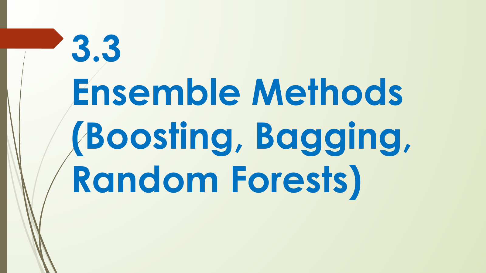

### Extracted Slide Text

- 3.3
- Ensemble Methods
- (Boosting, Bagging,
- Random Forests)

### Page Description And Teaching Notes

Slide type: bullet explanation slide.
Main idea: Ensemble Methods (Boosting, Bagging, Random Forests).
This page breaks the topic into separate points. Each bullet should be treated as a distinct exam or viva talking point, with the learner able to define it and give a small example.
Detailed page understanding:
- `Ensemble Methods` is a core visible point. Explain what it means, why it matters, and how it connects to the slide title.
- `(Boosting, Bagging,` is a core visible point. Explain what it means, why it matters, and how it connects to the slide title.
- `Random Forests)` is a core visible point. Explain what it means, why it matters, and how it connects to the slide title.
Important visible terms: Ensemble Methods, Boosting, Bagging, Random Forests.
Visual/layout description: the embedded image preserves the actual slide. Describe the title area first, then read bullets, formulas, tables, arrows, grouped boxes, or diagrams in their visible order. If the slide contains a diagram, explain the relationship shown by arrows/positioning before explaining the text labels.
Teaching note: after reading the slide, ask the learner to restate the page in one or two sentences and give one example. For formula or metric slides, also ask what each variable or metric means and when it should be used.
Exam/viva note: prepare the slide title as a short-answer question, then use the bullets or visual labels as the expected answer points.

## Page 19: Ensemble learning

### Extracted Slide Text

- Ensemble learning
- Ensemble learning is a technique in
- machine learning where multiple
- models (often called "weak learners")
- are trained and combined to solve the
- same problem.
- The idea is that a group of models
- working together can outperform a
- single strong model.

### Page Description And Teaching Notes

Slide type: concept explanation slide.
Main idea: Ensemble learning is a technique in machine learning where multiple models (often called "weak learners") are trained and combined to solve the same problem. The idea is that a group of models.
This page explains a core concept in prose. The main task is to convert the definition into a clear statement of what the concept is, why it is used, and where it appears in a machine-learning workflow.
Detailed page understanding:
- `Ensemble learning is a technique in` gives the definition-level meaning. Explain it first in simple words, then connect it to how a model learns from data.
- `machine learning where multiple` is a core visible point. Explain what it means, why it matters, and how it connects to the slide title.
- `models (often called "weak learners")` is a core visible point. Explain what it means, why it matters, and how it connects to the slide title.
- `are trained and combined to solve the` is a core visible point. Explain what it means, why it matters, and how it connects to the slide title.
- `same problem.` is a limitation or risk. Mention when the method may fail and what alternative or precaution can reduce the issue.
- `The idea is that a group of models` is a core visible point. Explain what it means, why it matters, and how it connects to the slide title.
- `working together can outperform a` is a core visible point. Explain what it means, why it matters, and how it connects to the slide title.
- `single strong model.` is a core visible point. Explain what it means, why it matters, and how it connects to the slide title.
Important visible terms: Ensemble, The.
Visual/layout description: the embedded image preserves the actual slide. Describe the title area first, then read bullets, formulas, tables, arrows, grouped boxes, or diagrams in their visible order. If the slide contains a diagram, explain the relationship shown by arrows/positioning before explaining the text labels.
Teaching note: after reading the slide, ask the learner to restate the page in one or two sentences and give one example. For formula or metric slides, also ask what each variable or metric means and when it should be used.
Exam/viva note: prepare the slide title as a short-answer question, then use the bullets or visual labels as the expected answer points.

## Page 20: When to Use Ensemble Learning?

### Extracted Slide Text

- When to Use Ensemble Learning?
- You have high variance or high bias in your model.
- Your base models are diverse and complementary.
- You want to increase model performance in competitions (e.g.,
- Kaggle).
- Real-Life Example
- ❑ Imagine trying to guess a movie’s rating:
- One friend uses past ratings
- Another reads online reviews
- A third watches the trailer
- Each has weaknesses alone, but combining their opinions gives
- a better estimate. That’s ensemble learning!

### Page Description And Teaching Notes

Slide type: bullet explanation slide.
Main idea: You have high variance or high bias in your model. Your base models are diverse and complementary. You want to increase model performance in competitions (e.g., Kaggle). Real-Life Example ❑ Imagine trying to guess a movie’s rating:.
This page breaks the topic into separate points. Each bullet should be treated as a distinct exam or viva talking point, with the learner able to define it and give a small example.
Detailed page understanding:
- `You have high variance or high bias in your model.` is a core visible point. Explain what it means, why it matters, and how it connects to the slide title.
- `Your base models are diverse and complementary.` is a core visible point. Explain what it means, why it matters, and how it connects to the slide title.
- `You want to increase model performance in competitions (e.g.,` is a core visible point. Explain what it means, why it matters, and how it connects to the slide title.
- `Kaggle).` is a core visible point. Explain what it means, why it matters, and how it connects to the slide title.
- `Real-Life Example` is an application/example point. Convert it into a concrete real-world case while teaching.
- `❑ Imagine trying to guess a movie’s rating:` is one item in the slide's list. Treat it as a separate subtopic and prepare a one-line explanation for it.
- `One friend uses past ratings` is an application/example point. Convert it into a concrete real-world case while teaching.
- `Another reads online reviews` is a core visible point. Explain what it means, why it matters, and how it connects to the slide title.
- Additional bullets continue on the slide; use the extracted text list above for the complete wording.
- `a better estimate. That’s ensemble learning!` is a core visible point. Explain what it means, why it matters, and how it connects to the slide title.
Important visible terms: When, Use Ensemble Learning, You, Your, Kaggle, Real-Life Example, Imagine, One.
Visual/layout description: the embedded image preserves the actual slide. Describe the title area first, then read bullets, formulas, tables, arrows, grouped boxes, or diagrams in their visible order. If the slide contains a diagram, explain the relationship shown by arrows/positioning before explaining the text labels.
Teaching note: after reading the slide, ask the learner to restate the page in one or two sentences and give one example. For formula or metric slides, also ask what each variable or metric means and when it should be used.
Exam/viva note: prepare the slide title as a short-answer question, then use the bullets or visual labels as the expected answer points.

## Page 21: Unit III - Different Algorithms in Machine Learning Page 21

### Extracted Slide Text

- No selectable text extracted from this page.

### Page Description And Teaching Notes

Slide type: visual-only or image-heavy slide.
Main idea: the slide is visual-first, so the image should be treated as the source for the content and structure.
This page is primarily visual. The embedded slide image is the authoritative visual output; read it as a diagram or illustration first, then connect any visible labels to the surrounding pages.
- No reliable selectable text was extracted; use the slide image for the visible diagram, chart, or screenshot.
Visual/layout description: the embedded image preserves the actual slide. Describe the title area first, then read bullets, formulas, tables, arrows, grouped boxes, or diagrams in their visible order. If the slide contains a diagram, explain the relationship shown by arrows/positioning before explaining the text labels.
Teaching note: after reading the slide, ask the learner to restate the page in one or two sentences and give one example. For formula or metric slides, also ask what each variable or metric means and when it should be used.
Exam/viva note: prepare the slide title as a short-answer question, then use the bullets or visual labels as the expected answer points.

## Page 22: Unit III - Different Algorithms in Machine Learning Page 22

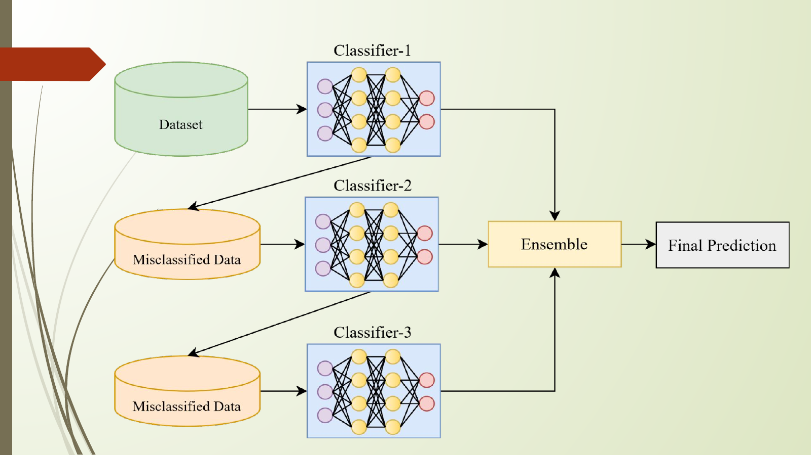

### Extracted Slide Text

- No selectable text extracted from this page.

### Page Description And Teaching Notes

Slide type: visual-only or image-heavy slide.
Main idea: the slide is visual-first, so the image should be treated as the source for the content and structure.
This page is primarily visual. The embedded slide image is the authoritative visual output; read it as a diagram or illustration first, then connect any visible labels to the surrounding pages.
- No reliable selectable text was extracted; use the slide image for the visible diagram, chart, or screenshot.
Visual/layout description: the embedded image preserves the actual slide. Describe the title area first, then read bullets, formulas, tables, arrows, grouped boxes, or diagrams in their visible order. If the slide contains a diagram, explain the relationship shown by arrows/positioning before explaining the text labels.
Teaching note: after reading the slide, ask the learner to restate the page in one or two sentences and give one example. For formula or metric slides, also ask what each variable or metric means and when it should be used.
Exam/viva note: prepare the slide title as a short-answer question, then use the bullets or visual labels as the expected answer points.

## Page 23: Accuracy: Highest

### Extracted Slide Text

- Accuracy: Highest

### Page Description And Teaching Notes

Slide type: title or transition slide.
Main idea: the slide is visual-first, so the image should be treated as the source for the content and structure.
This page sets the context for the next topic. Treat it as a section marker: it tells the learner what concept or unit is starting before the deck moves into definitions, examples, or formulas.
- No reliable selectable text was extracted; use the slide image for the visible diagram, chart, or screenshot.
Important visible terms: Accuracy, Highest.
Visual/layout description: the embedded image preserves the actual slide. Describe the title area first, then read bullets, formulas, tables, arrows, grouped boxes, or diagrams in their visible order. If the slide contains a diagram, explain the relationship shown by arrows/positioning before explaining the text labels.
Teaching note: after reading the slide, ask the learner to restate the page in one or two sentences and give one example. For formula or metric slides, also ask what each variable or metric means and when it should be used.
Exam/viva note: prepare the slide title as a short-answer question, then use the bullets or visual labels as the expected answer points.

## Page 24: Types of Ensemble learning

### Extracted Slide Text

- Types of Ensemble learning

### Page Description And Teaching Notes

Slide type: title or transition slide.
Main idea: the slide is visual-first, so the image should be treated as the source for the content and structure.
This page sets the context for the next topic. Treat it as a section marker: it tells the learner what concept or unit is starting before the deck moves into definitions, examples, or formulas.
- No reliable selectable text was extracted; use the slide image for the visible diagram, chart, or screenshot.
Important visible terms: Types, Ensemble.
Visual/layout description: the embedded image preserves the actual slide. Describe the title area first, then read bullets, formulas, tables, arrows, grouped boxes, or diagrams in their visible order. If the slide contains a diagram, explain the relationship shown by arrows/positioning before explaining the text labels.
Teaching note: after reading the slide, ask the learner to restate the page in one or two sentences and give one example. For formula or metric slides, also ask what each variable or metric means and when it should be used.
Exam/viva note: prepare the slide title as a short-answer question, then use the bullets or visual labels as the expected answer points.

## Page 25: Bagging (Bootstrap Aggregating):

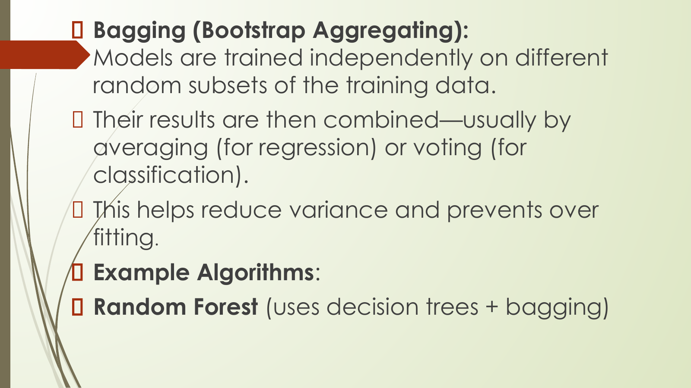

### Extracted Slide Text

- Bagging (Bootstrap Aggregating):
- Models are trained independently on different
- random subsets of the training data.
- Their results are then combined—usually by
- averaging (for regression) or voting (for
- classification).
- This helps reduce variance and prevents over
- fitting.
- Example Algorithms:
- Random Forest (uses decision trees + bagging)

### Page Description And Teaching Notes

Slide type: concept explanation slide.
Main idea: Models are trained independently on different random subsets of the training data. Their results are then combined—usually by averaging (for regression) or voting (for classification). This helps reduce variance and prevents over.
This page explains a core concept in prose. The main task is to convert the definition into a clear statement of what the concept is, why it is used, and where it appears in a machine-learning workflow.
Detailed page understanding:
- `Models are trained independently on different` is a core visible point. Explain what it means, why it matters, and how it connects to the slide title.
- `random subsets of the training data.` is a core visible point. Explain what it means, why it matters, and how it connects to the slide title.
- `Their results are then combined—usually by` is a core visible point. Explain what it means, why it matters, and how it connects to the slide title.
- `averaging (for regression) or voting (for` is a core visible point. Explain what it means, why it matters, and how it connects to the slide title.
- `classification).` is a core visible point. Explain what it means, why it matters, and how it connects to the slide title.
- `This helps reduce variance and prevents over` states a benefit. Use it to justify why this method or concept is useful in a machine-learning workflow.
- `fitting.` is a core visible point. Explain what it means, why it matters, and how it connects to the slide title.
- `Example Algorithms:` is an application/example point. Convert it into a concrete real-world case while teaching.
- `Random Forest (uses decision trees + bagging)` is an application/example point. Convert it into a concrete real-world case while teaching.
Important visible terms: Bagging, Bootstrap Aggregating, Models, Their, This, Example Algorithms, Random Forest.
Visual/layout description: the embedded image preserves the actual slide. Describe the title area first, then read bullets, formulas, tables, arrows, grouped boxes, or diagrams in their visible order. If the slide contains a diagram, explain the relationship shown by arrows/positioning before explaining the text labels.
Teaching note: after reading the slide, ask the learner to restate the page in one or two sentences and give one example. For formula or metric slides, also ask what each variable or metric means and when it should be used.
Exam/viva note: prepare the slide title as a short-answer question, then use the bullets or visual labels as the expected answer points.

## Page 26: How Bagging Learning model

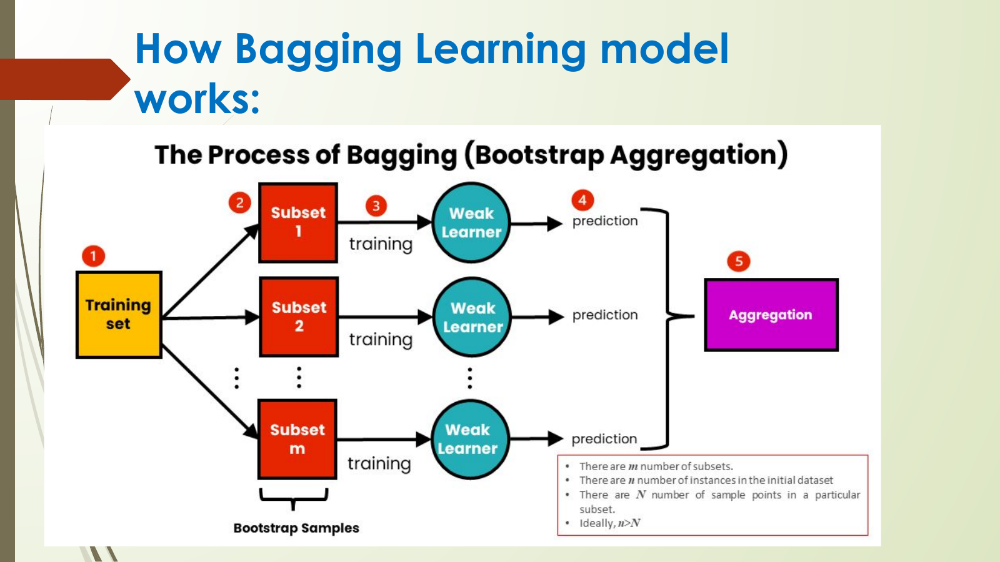

### Extracted Slide Text

- How Bagging Learning model
- works:

### Page Description And Teaching Notes

Slide type: title or transition slide.
Main idea: works:.
This page sets the context for the next topic. Treat it as a section marker: it tells the learner what concept or unit is starting before the deck moves into definitions, examples, or formulas.
Detailed page understanding:
- `works:` is a core visible point. Explain what it means, why it matters, and how it connects to the slide title.
Important visible terms: How Bagging Learning.
Visual/layout description: the embedded image preserves the actual slide. Describe the title area first, then read bullets, formulas, tables, arrows, grouped boxes, or diagrams in their visible order. If the slide contains a diagram, explain the relationship shown by arrows/positioning before explaining the text labels.
Teaching note: after reading the slide, ask the learner to restate the page in one or two sentences and give one example. For formula or metric slides, also ask what each variable or metric means and when it should be used.
Exam/viva note: prepare the slide title as a short-answer question, then use the bullets or visual labels as the expected answer points.

## Page 27: Boosting:

### Extracted Slide Text

- Boosting:
- Models are trained one after another. Each new model
- focuses on fixing the errors made by the previous ones.
- The final prediction is a weighted combination of all
- models, which helps reduce bias and improve accuracy.

### Page Description And Teaching Notes

Slide type: metric/table slide.
Main idea: Models are trained one after another. Each new model focuses on fixing the errors made by the previous ones. The final prediction is a weighted combination of all models, which helps reduce bias and improve accuracy.
This page organizes evaluation or comparison information. Focus on what each metric measures, when it is useful, and what mistake it prevents when judging a machine-learning model.
Detailed page understanding:
- `Models are trained one after another. Each new model` is a core visible point. Explain what it means, why it matters, and how it connects to the slide title.
- `focuses on fixing the errors made by the previous ones.` is a limitation or risk. Mention when the method may fail and what alternative or precaution can reduce the issue.
- `The final prediction is a weighted combination of all` gives the definition-level meaning. Explain it first in simple words, then connect it to how a model learns from data.
- `models, which helps reduce bias and improve accuracy.` states a benefit. Use it to justify why this method or concept is useful in a machine-learning workflow.
Important visible terms: Boosting, Models, Each, The.
Visual/layout description: the embedded image preserves the actual slide. Describe the title area first, then read bullets, formulas, tables, arrows, grouped boxes, or diagrams in their visible order. If the slide contains a diagram, explain the relationship shown by arrows/positioning before explaining the text labels.
Teaching note: after reading the slide, ask the learner to restate the page in one or two sentences and give one example. For formula or metric slides, also ask what each variable or metric means and when it should be used.
Exam/viva note: prepare the slide title as a short-answer question, then use the bullets or visual labels as the expected answer points.

## Page 28: Models are trained sequentially, each new

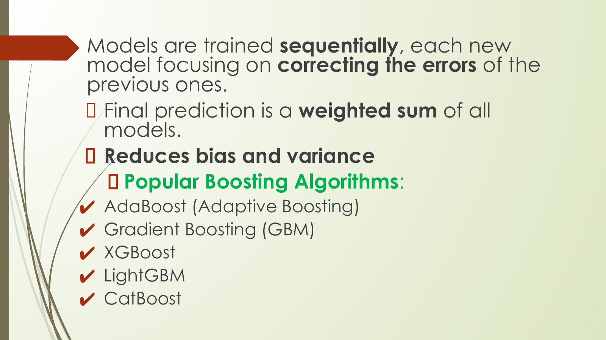

### Extracted Slide Text

- Models are trained sequentially, each new
- model focusing on correcting the errors of the
- previous ones.
- Final prediction is a weighted sum of all
- models.
- Reduces bias and variance
- Popular Boosting Algorithms:
- ✔ AdaBoost (Adaptive Boosting)
- ✔ Gradient Boosting (GBM)
- ✔ XGBoost
- ✔ LightGBM
- ✔ CatBoost

### Page Description And Teaching Notes

Slide type: bullet explanation slide.
Main idea: model focusing on correcting the errors of the previous ones. Final prediction is a weighted sum of all models. Reduces bias and variance Popular Boosting Algorithms:.
This page breaks the topic into separate points. Each bullet should be treated as a distinct exam or viva talking point, with the learner able to define it and give a small example.
Detailed page understanding:
- `model focusing on correcting the errors of the` is a limitation or risk. Mention when the method may fail and what alternative or precaution can reduce the issue.
- `previous ones.` is a core visible point. Explain what it means, why it matters, and how it connects to the slide title.
- `Final prediction is a weighted sum of all` gives the definition-level meaning. Explain it first in simple words, then connect it to how a model learns from data.
- `models.` is a core visible point. Explain what it means, why it matters, and how it connects to the slide title.
- `Reduces bias and variance` is a core visible point. Explain what it means, why it matters, and how it connects to the slide title.
- `Popular Boosting Algorithms:` is a core visible point. Explain what it means, why it matters, and how it connects to the slide title.
- `✔ AdaBoost (Adaptive Boosting)` is one item in the slide's list. Treat it as a separate subtopic and prepare a one-line explanation for it.
- `✔ Gradient Boosting (GBM)` is one item in the slide's list. Treat it as a separate subtopic and prepare a one-line explanation for it.
- Additional bullets continue on the slide; use the extracted text list above for the complete wording.
- `✔ CatBoost` is one item in the slide's list. Treat it as a separate subtopic and prepare a one-line explanation for it.
Important visible terms: Models, Final, Reduces, Popular Boosting Algorithms, AdaBoost, Adaptive Boosting, Gradient Boosting, GBM.
Visual/layout description: the embedded image preserves the actual slide. Describe the title area first, then read bullets, formulas, tables, arrows, grouped boxes, or diagrams in their visible order. If the slide contains a diagram, explain the relationship shown by arrows/positioning before explaining the text labels.
Teaching note: after reading the slide, ask the learner to restate the page in one or two sentences and give one example. For formula or metric slides, also ask what each variable or metric means and when it should be used.
Exam/viva note: prepare the slide title as a short-answer question, then use the bullets or visual labels as the expected answer points.

## Page 29: Stacking (Stacked Generalization)

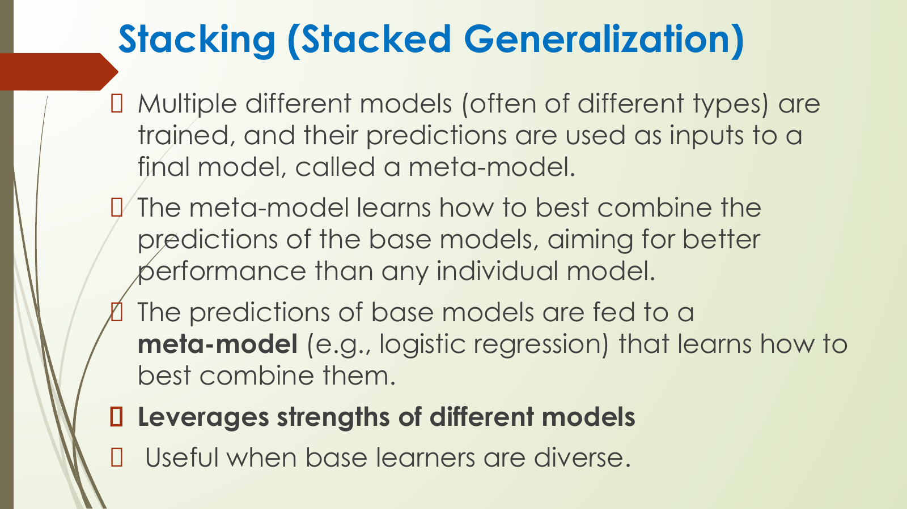

### Extracted Slide Text

- Stacking (Stacked Generalization)
- Multiple different models (often of different types) are
- trained, and their predictions are used as inputs to a
- final model, called a meta-model.
- The meta-model learns how to best combine the
- predictions of the base models, aiming for better
- performance than any individual model.
- The predictions of base models are fed to a
- meta-model (e.g., logistic regression) that learns how to
- best combine them.
- Leverages strengths of different models
- Useful when base learners are diverse.

### Page Description And Teaching Notes

Slide type: concept explanation slide.
Main idea: Multiple different models (often of different types) are trained, and their predictions are used as inputs to a final model, called a meta-model. The meta-model learns how to best combine the predictions of the base models, aiming for better performance than any individual model.
This page explains a core concept in prose. The main task is to convert the definition into a clear statement of what the concept is, why it is used, and where it appears in a machine-learning workflow.
Detailed page understanding:
- `Multiple different models (often of different types) are` is a core visible point. Explain what it means, why it matters, and how it connects to the slide title.
- `trained, and their predictions are used as inputs to a` is an application/example point. Convert it into a concrete real-world case while teaching.
- `final model, called a meta-model.` is a core visible point. Explain what it means, why it matters, and how it connects to the slide title.
- `The meta-model learns how to best combine the` is a core visible point. Explain what it means, why it matters, and how it connects to the slide title.
- `predictions of the base models, aiming for better` is a core visible point. Explain what it means, why it matters, and how it connects to the slide title.
- `performance than any individual model.` is a core visible point. Explain what it means, why it matters, and how it connects to the slide title.
- `The predictions of base models are fed to a` is a core visible point. Explain what it means, why it matters, and how it connects to the slide title.
- `meta-model (e.g., logistic regression) that learns how to` is a core visible point. Explain what it means, why it matters, and how it connects to the slide title.
- Additional bullets continue on the slide; use the extracted text list above for the complete wording.
- `Useful when base learners are diverse.` is an application/example point. Convert it into a concrete real-world case while teaching.
Important visible terms: Stacking, Stacked Generalization, Multiple, The, Leverages, Useful.
Visual/layout description: the embedded image preserves the actual slide. Describe the title area first, then read bullets, formulas, tables, arrows, grouped boxes, or diagrams in their visible order. If the slide contains a diagram, explain the relationship shown by arrows/positioning before explaining the text labels.
Teaching note: after reading the slide, ask the learner to restate the page in one or two sentences and give one example. For formula or metric slides, also ask what each variable or metric means and when it should be used.
Exam/viva note: prepare the slide title as a short-answer question, then use the bullets or visual labels as the expected answer points.

## Page 30: Unit III - Different Algorithms in Machine Learning Page 30

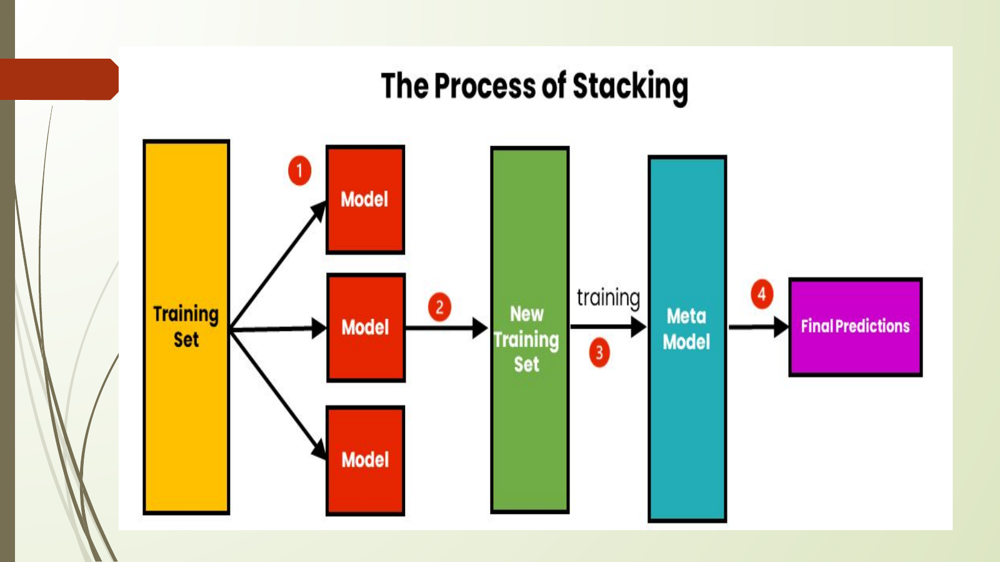

### Extracted Slide Text

- No selectable text extracted from this page.

### Page Description And Teaching Notes

Slide type: visual-only or image-heavy slide.
Main idea: the slide is visual-first, so the image should be treated as the source for the content and structure.
This page is primarily visual. The embedded slide image is the authoritative visual output; read it as a diagram or illustration first, then connect any visible labels to the surrounding pages.
- No reliable selectable text was extracted; use the slide image for the visible diagram, chart, or screenshot.
Visual/layout description: the embedded image preserves the actual slide. Describe the title area first, then read bullets, formulas, tables, arrows, grouped boxes, or diagrams in their visible order. If the slide contains a diagram, explain the relationship shown by arrows/positioning before explaining the text labels.
Teaching note: after reading the slide, ask the learner to restate the page in one or two sentences and give one example. For formula or metric slides, also ask what each variable or metric means and when it should be used.
Exam/viva note: prepare the slide title as a short-answer question, then use the bullets or visual labels as the expected answer points.

## Page 31: Unit III - Different Algorithms in Machine Learning Page 31

### Extracted Slide Text

- No selectable text extracted from this page.

### Page Description And Teaching Notes

Slide type: visual-only or image-heavy slide.
Main idea: the slide is visual-first, so the image should be treated as the source for the content and structure.
This page is primarily visual. The embedded slide image is the authoritative visual output; read it as a diagram or illustration first, then connect any visible labels to the surrounding pages.
- No reliable selectable text was extracted; use the slide image for the visible diagram, chart, or screenshot.
Visual/layout description: the embedded image preserves the actual slide. Describe the title area first, then read bullets, formulas, tables, arrows, grouped boxes, or diagrams in their visible order. If the slide contains a diagram, explain the relationship shown by arrows/positioning before explaining the text labels.
Teaching note: after reading the slide, ask the learner to restate the page in one or two sentences and give one example. For formula or metric slides, also ask what each variable or metric means and when it should be used.
Exam/viva note: prepare the slide title as a short-answer question, then use the bullets or visual labels as the expected answer points.

## Page 32: Real-Life Example

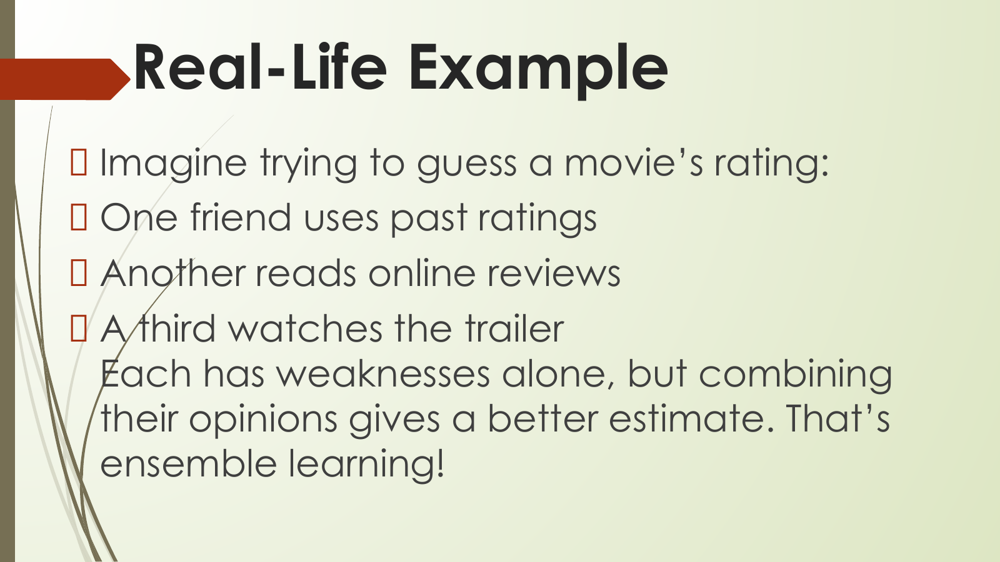

### Extracted Slide Text

- Real-Life Example
- Imagine trying to guess a movie’s rating:
- One friend uses past ratings
- Another reads online reviews
- A third watches the trailer
- Each has weaknesses alone, but combining
- their opinions gives a better estimate. That’s
- ensemble learning!

### Page Description And Teaching Notes

Slide type: concept explanation slide.
Main idea: Imagine trying to guess a movie’s rating: One friend uses past ratings Another reads online reviews A third watches the trailer Each has weaknesses alone, but combining their opinions gives a better estimate. That’s.
This page explains a core concept in prose. The main task is to convert the definition into a clear statement of what the concept is, why it is used, and where it appears in a machine-learning workflow.
Detailed page understanding:
- `Imagine trying to guess a movie’s rating:` is a core visible point. Explain what it means, why it matters, and how it connects to the slide title.
- `One friend uses past ratings` is an application/example point. Convert it into a concrete real-world case while teaching.
- `Another reads online reviews` is a core visible point. Explain what it means, why it matters, and how it connects to the slide title.
- `A third watches the trailer` is a core visible point. Explain what it means, why it matters, and how it connects to the slide title.
- `Each has weaknesses alone, but combining` is a core visible point. Explain what it means, why it matters, and how it connects to the slide title.
- `their opinions gives a better estimate. That’s` is a core visible point. Explain what it means, why it matters, and how it connects to the slide title.
- `ensemble learning!` is a core visible point. Explain what it means, why it matters, and how it connects to the slide title.
Important visible terms: Real-Life Example Imagine, One, Another, Each, That.
Visual/layout description: the embedded image preserves the actual slide. Describe the title area first, then read bullets, formulas, tables, arrows, grouped boxes, or diagrams in their visible order. If the slide contains a diagram, explain the relationship shown by arrows/positioning before explaining the text labels.
Teaching note: after reading the slide, ask the learner to restate the page in one or two sentences and give one example. For formula or metric slides, also ask what each variable or metric means and when it should be used.
Exam/viva note: prepare the slide title as a short-answer question, then use the bullets or visual labels as the expected answer points.
