# Unit III - Unsupervised Learning

Source PDF: `ml class/UNIT-III Unsupervised Learning.pptx.pdf`
Total pages: 76

These notes are written page by page. Every page includes the rendered slide image as visual output, the extracted text, and a detailed explanation of how to read the slide.

## Page 1: Unit-III: Unsupervised

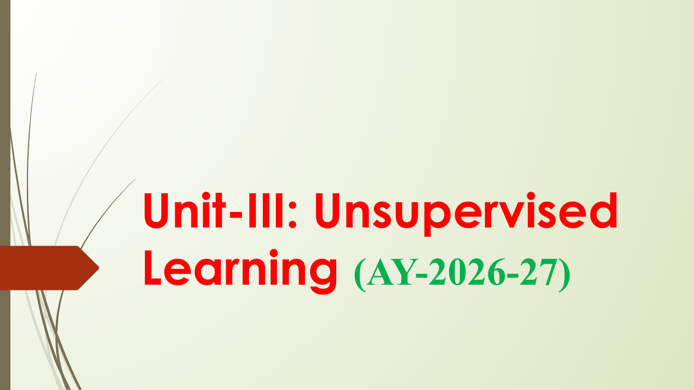

### Extracted Slide Text

- Unit-III: Unsupervised
- Learning (AY-2026-27)

### Page Description And Teaching Notes

Slide type: title or transition slide.
Main idea: Learning (AY-2026-27).
This page sets the context for the next topic. Treat it as a section marker: it tells the learner what concept or unit is starting before the deck moves into definitions, examples, or formulas.
Detailed page understanding:
- `Learning (AY-2026-27)` is a core visible point. Explain what it means, why it matters, and how it connects to the slide title.
Important visible terms: Unit-III, Unsupervised Learning, AY-2026-27.
Visual/layout description: the embedded image preserves the actual slide. Describe the title area first, then read bullets, formulas, tables, arrows, grouped boxes, or diagrams in their visible order. If the slide contains a diagram, explain the relationship shown by arrows/positioning before explaining the text labels.
Teaching note: after reading the slide, ask the learner to restate the page in one or two sentences and give one example. For formula or metric slides, also ask what each variable or metric means and when it should be used.
Exam/viva note: prepare the slide title as a short-answer question, then use the bullets or visual labels as the expected answer points.

## Page 2: 3.1

### Extracted Slide Text

- 3.1
- Evaluating Machine
- Learning algorithms
- and Model Selection

### Page Description And Teaching Notes

Slide type: bullet explanation slide.
Main idea: Evaluating Machine Learning algorithms and Model Selection.
This page breaks the topic into separate points. Each bullet should be treated as a distinct exam or viva talking point, with the learner able to define it and give a small example.
Detailed page understanding:
- `Evaluating Machine` is a core visible point. Explain what it means, why it matters, and how it connects to the slide title.
- `Learning algorithms` is a core visible point. Explain what it means, why it matters, and how it connects to the slide title.
- `and Model Selection` is a core visible point. Explain what it means, why it matters, and how it connects to the slide title.
Important visible terms: Evaluating Machine Learning, Model Selection.
Visual/layout description: the embedded image preserves the actual slide. Describe the title area first, then read bullets, formulas, tables, arrows, grouped boxes, or diagrams in their visible order. If the slide contains a diagram, explain the relationship shown by arrows/positioning before explaining the text labels.
Teaching note: after reading the slide, ask the learner to restate the page in one or two sentences and give one example. For formula or metric slides, also ask what each variable or metric means and when it should be used.
Exam/viva note: prepare the slide title as a short-answer question, then use the bullets or visual labels as the expected answer points.

## Page 3: Introduction

### Extracted Slide Text

- Introduction
- Why evaluation is important in
- ML?
- Difference between training
- performance and real-world
- performance
- Bias–variance tradeoff

### Page Description And Teaching Notes

Slide type: concept explanation slide.
Main idea: Why evaluation is important in ML? Difference between training performance and real-world performance Bias–variance tradeoff.
This page explains a core concept in prose. The main task is to convert the definition into a clear statement of what the concept is, why it is used, and where it appears in a machine-learning workflow.
Detailed page understanding:
- `Why evaluation is important in` is a core visible point. Explain what it means, why it matters, and how it connects to the slide title.
- `ML?` is a core visible point. Explain what it means, why it matters, and how it connects to the slide title.
- `Difference between training` is a core visible point. Explain what it means, why it matters, and how it connects to the slide title.
- `performance and real-world` is a core visible point. Explain what it means, why it matters, and how it connects to the slide title.
- `performance` is a core visible point. Explain what it means, why it matters, and how it connects to the slide title.
- `Bias–variance tradeoff` is a core visible point. Explain what it means, why it matters, and how it connects to the slide title.
Important visible terms: Introduction Why, Difference, Bias.
Visual/layout description: the embedded image preserves the actual slide. Describe the title area first, then read bullets, formulas, tables, arrows, grouped boxes, or diagrams in their visible order. If the slide contains a diagram, explain the relationship shown by arrows/positioning before explaining the text labels.
Teaching note: after reading the slide, ask the learner to restate the page in one or two sentences and give one example. For formula or metric slides, also ask what each variable or metric means and when it should be used.
Exam/viva note: prepare the slide title as a short-answer question, then use the bullets or visual labels as the expected answer points.

## Page 4: 2. Performance Metrics

### Extracted Slide Text

- 2. Performance Metrics
- For Classification
- Accuracy, Precision, Recall, F1-score
- Confusion matrix
- ROC curve, AUC
- For Regression
- Mean Squared Error (MSE), Root Mean Squared Error (RMSE)
- Mean Absolute Error (MAE)
- R² score (coefficient of determination)
- For Ranking/Recommendation
- Precision@k, Recall@k, MAP, NDCG

### Page Description And Teaching Notes

Slide type: formula or calculation slide.
Main idea: For Classification Accuracy, Precision, Recall, F1-score Confusion matrix ROC curve, AUC For Regression Mean Squared Error (MSE), Root Mean Squared Error (RMSE).
This page should be read carefully because it introduces a calculation, objective, or optimization idea. Identify the variables in the formula, what quantity is being minimized or measured, and how the equation supports model training or evaluation.
Detailed page understanding:
- `For Classification` is a core visible point. Explain what it means, why it matters, and how it connects to the slide title.
- `Accuracy, Precision, Recall, F1-score` is a core visible point. Explain what it means, why it matters, and how it connects to the slide title.
- `Confusion matrix` is a core visible point. Explain what it means, why it matters, and how it connects to the slide title.
- `ROC curve, AUC` is a core visible point. Explain what it means, why it matters, and how it connects to the slide title.
- `For Regression` is a core visible point. Explain what it means, why it matters, and how it connects to the slide title.
- `Mean Squared Error (MSE), Root Mean Squared Error (RMSE)` is a limitation or risk. Mention when the method may fail and what alternative or precaution can reduce the issue.
- `Mean Absolute Error (MAE)` is a limitation or risk. Mention when the method may fail and what alternative or precaution can reduce the issue.
- `R² score (coefficient of determination)` is a core visible point. Explain what it means, why it matters, and how it connects to the slide title.
- `For Ranking/Recommendation` is a core visible point. Explain what it means, why it matters, and how it connects to the slide title.
- `Precision@k, Recall@k, MAP, NDCG` is a core visible point. Explain what it means, why it matters, and how it connects to the slide title.
Important visible terms: Performance Metrics For Classification, Accuracy, Precision, Recall, F1-score Confusion, ROC, AUC For Regression Mean, Squared Error.
Visual/layout description: the embedded image preserves the actual slide. Describe the title area first, then read bullets, formulas, tables, arrows, grouped boxes, or diagrams in their visible order. If the slide contains a diagram, explain the relationship shown by arrows/positioning before explaining the text labels.
Teaching note: after reading the slide, ask the learner to restate the page in one or two sentences and give one example. For formula or metric slides, also ask what each variable or metric means and when it should be used.
Exam/viva note: prepare the slide title as a short-answer question, then use the bullets or visual labels as the expected answer points.

## Page 5: 3. Validation Techniques

### Extracted Slide Text

- 3. Validation Techniques
- Hold-out method (train/test split)
- k-Fold Cross-Validation
- Leave-One-Out Cross-Validation
- (LOOCV)
- Stratified sampling (for imbalanced
- datasets)

### Page Description And Teaching Notes

Slide type: bullet explanation slide.
Main idea: Hold-out method (train/test split) k-Fold Cross-Validation Leave-One-Out Cross-Validation (LOOCV) Stratified sampling (for imbalanced datasets).
This page breaks the topic into separate points. Each bullet should be treated as a distinct exam or viva talking point, with the learner able to define it and give a small example.
Detailed page understanding:
- `Hold-out method (train/test split)` is a core visible point. Explain what it means, why it matters, and how it connects to the slide title.
- `k-Fold Cross-Validation` is a core visible point. Explain what it means, why it matters, and how it connects to the slide title.
- `Leave-One-Out Cross-Validation` is a core visible point. Explain what it means, why it matters, and how it connects to the slide title.
- `(LOOCV)` is a core visible point. Explain what it means, why it matters, and how it connects to the slide title.
- `Stratified sampling (for imbalanced` is a core visible point. Explain what it means, why it matters, and how it connects to the slide title.
- `datasets)` is a core visible point. Explain what it means, why it matters, and how it connects to the slide title.
Important visible terms: Validation Techniques Hold-out, Fold Cross-Validation Leave-One-Out Cross-Validation, LOOCV, Stratified.
Visual/layout description: the embedded image preserves the actual slide. Describe the title area first, then read bullets, formulas, tables, arrows, grouped boxes, or diagrams in their visible order. If the slide contains a diagram, explain the relationship shown by arrows/positioning before explaining the text labels.
Teaching note: after reading the slide, ask the learner to restate the page in one or two sentences and give one example. For formula or metric slides, also ask what each variable or metric means and when it should be used.
Exam/viva note: prepare the slide title as a short-answer question, then use the bullets or visual labels as the expected answer points.

## Page 6: 4. Model Selection Strategies

### Extracted Slide Text

- 4. Model Selection Strategies
- Comparing multiple algorithms
- Hyperparameter tuning
- Grid Search
- Random Search
- Bayesian Optimization
- Automated Machine Learning
- (AutoML)

### Page Description And Teaching Notes

Slide type: bullet explanation slide.
Main idea: Comparing multiple algorithms Hyperparameter tuning Grid Search Random Search Bayesian Optimization Automated Machine Learning.
This page breaks the topic into separate points. Each bullet should be treated as a distinct exam or viva talking point, with the learner able to define it and give a small example.
Detailed page understanding:
- `Comparing multiple algorithms` is a core visible point. Explain what it means, why it matters, and how it connects to the slide title.
- `Hyperparameter tuning` is a core visible point. Explain what it means, why it matters, and how it connects to the slide title.
- `Grid Search` is a core visible point. Explain what it means, why it matters, and how it connects to the slide title.
- `Random Search` is a core visible point. Explain what it means, why it matters, and how it connects to the slide title.
- `Bayesian Optimization` is a core visible point. Explain what it means, why it matters, and how it connects to the slide title.
- `Automated Machine Learning` is a core visible point. Explain what it means, why it matters, and how it connects to the slide title.
- `(AutoML)` is a core visible point. Explain what it means, why it matters, and how it connects to the slide title.
Important visible terms: Model Selection Strategies Comparing, Hyperparameter, Grid Search Random Search, Bayesian Optimization Automated Machine, Learning, AutoML.
Visual/layout description: the embedded image preserves the actual slide. Describe the title area first, then read bullets, formulas, tables, arrows, grouped boxes, or diagrams in their visible order. If the slide contains a diagram, explain the relationship shown by arrows/positioning before explaining the text labels.
Teaching note: after reading the slide, ask the learner to restate the page in one or two sentences and give one example. For formula or metric slides, also ask what each variable or metric means and when it should be used.
Exam/viva note: prepare the slide title as a short-answer question, then use the bullets or visual labels as the expected answer points.

## Page 7: 5. Overfitting and Underfitting

### Extracted Slide Text

- 5. Overfitting and Underfitting
- Causes and detection
- Regularization (L1, L2, dropout)
- Early stopping

### Page Description And Teaching Notes

Slide type: bullet explanation slide.
Main idea: Causes and detection Regularization (L1, L2, dropout) Early stopping.
This page breaks the topic into separate points. Each bullet should be treated as a distinct exam or viva talking point, with the learner able to define it and give a small example.
Detailed page understanding:
- `Causes and detection` is an application/example point. Convert it into a concrete real-world case while teaching.
- `Regularization (L1, L2, dropout)` is a core visible point. Explain what it means, why it matters, and how it connects to the slide title.
- `Early stopping` is a core visible point. Explain what it means, why it matters, and how it connects to the slide title.
Important visible terms: Overfitting, Underfitting Causes, Regularization, Early.
Visual/layout description: the embedded image preserves the actual slide. Describe the title area first, then read bullets, formulas, tables, arrows, grouped boxes, or diagrams in their visible order. If the slide contains a diagram, explain the relationship shown by arrows/positioning before explaining the text labels.
Teaching note: after reading the slide, ask the learner to restate the page in one or two sentences and give one example. For formula or metric slides, also ask what each variable or metric means and when it should be used.
Exam/viva note: prepare the slide title as a short-answer question, then use the bullets or visual labels as the expected answer points.

## Page 8: 6. Model Complexity and

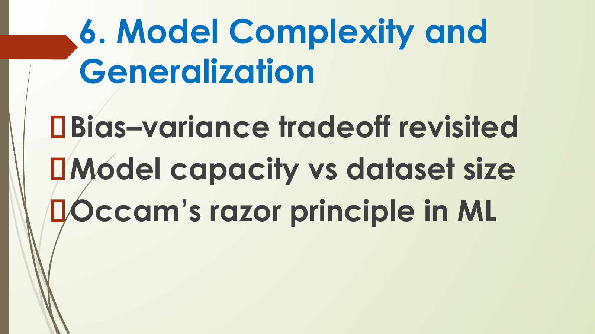

### Extracted Slide Text

- 6. Model Complexity and
- Generalization
- Bias–variance tradeoff revisited
- Model capacity vs dataset size
- Occam’s razor principle in ML

### Page Description And Teaching Notes

Slide type: bullet explanation slide.
Main idea: Generalization Bias–variance tradeoff revisited Model capacity vs dataset size Occam’s razor principle in ML.
This page breaks the topic into separate points. Each bullet should be treated as a distinct exam or viva talking point, with the learner able to define it and give a small example.
Detailed page understanding:
- `Generalization` is a core visible point. Explain what it means, why it matters, and how it connects to the slide title.
- `Bias–variance tradeoff revisited` is a core visible point. Explain what it means, why it matters, and how it connects to the slide title.
- `Model capacity vs dataset size` is a core visible point. Explain what it means, why it matters, and how it connects to the slide title.
- `Occam’s razor principle in ML` is a core visible point. Explain what it means, why it matters, and how it connects to the slide title.
Important visible terms: Model Complexity, Generalization Bias, Model, Occam.
Visual/layout description: the embedded image preserves the actual slide. Describe the title area first, then read bullets, formulas, tables, arrows, grouped boxes, or diagrams in their visible order. If the slide contains a diagram, explain the relationship shown by arrows/positioning before explaining the text labels.
Teaching note: after reading the slide, ask the learner to restate the page in one or two sentences and give one example. For formula or metric slides, also ask what each variable or metric means and when it should be used.
Exam/viva note: prepare the slide title as a short-answer question, then use the bullets or visual labels as the expected answer points.

## Page 9: Unit III - Unsupervised Learning Page 9

### Extracted Slide Text

- No selectable text extracted from this page.

### Page Description And Teaching Notes

Slide type: visual-only or image-heavy slide.
Main idea: the slide is visual-first, so the image should be treated as the source for the content and structure.
This page is primarily visual. The embedded slide image is the authoritative visual output; read it as a diagram or illustration first, then connect any visible labels to the surrounding pages.
- No reliable selectable text was extracted; use the slide image for the visible diagram, chart, or screenshot.
Visual/layout description: the embedded image preserves the actual slide. Describe the title area first, then read bullets, formulas, tables, arrows, grouped boxes, or diagrams in their visible order. If the slide contains a diagram, explain the relationship shown by arrows/positioning before explaining the text labels.
Teaching note: after reading the slide, ask the learner to restate the page in one or two sentences and give one example. For formula or metric slides, also ask what each variable or metric means and when it should be used.
Exam/viva note: prepare the slide title as a short-answer question, then use the bullets or visual labels as the expected answer points.

## Page 10: 3.2

### Extracted Slide Text

- 3.2
- Introduction to
- Statistical Learning
- Theory

### Page Description And Teaching Notes

Slide type: bullet explanation slide.
Main idea: Introduction to Statistical Learning Theory.
This page breaks the topic into separate points. Each bullet should be treated as a distinct exam or viva talking point, with the learner able to define it and give a small example.
Detailed page understanding:
- `Introduction to` is a core visible point. Explain what it means, why it matters, and how it connects to the slide title.
- `Statistical Learning` is a core visible point. Explain what it means, why it matters, and how it connects to the slide title.
- `Theory` is a core visible point. Explain what it means, why it matters, and how it connects to the slide title.
Important visible terms: Introduction, Statistical Learning Theory.
Visual/layout description: the embedded image preserves the actual slide. Describe the title area first, then read bullets, formulas, tables, arrows, grouped boxes, or diagrams in their visible order. If the slide contains a diagram, explain the relationship shown by arrows/positioning before explaining the text labels.
Teaching note: after reading the slide, ask the learner to restate the page in one or two sentences and give one example. For formula or metric slides, also ask what each variable or metric means and when it should be used.
Exam/viva note: prepare the slide title as a short-answer question, then use the bullets or visual labels as the expected answer points.

## Page 11: Statistical Learning Theory (SLT) is a theoretical

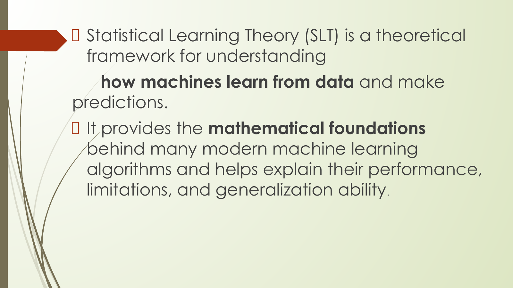

### Extracted Slide Text

- Statistical Learning Theory (SLT) is a theoretical
- framework for understanding
- how machines learn from data and make
- predictions.
- It provides the mathematical foundations
- behind many modern machine learning
- algorithms and helps explain their performance,
- limitations, and generalization ability.

### Page Description And Teaching Notes

Slide type: concept explanation slide.
Main idea: framework for understanding how machines learn from data and make predictions. It provides the mathematical foundations behind many modern machine learning algorithms and helps explain their performance,.
This page explains a core concept in prose. The main task is to convert the definition into a clear statement of what the concept is, why it is used, and where it appears in a machine-learning workflow.
Detailed page understanding:
- `framework for understanding` is a core visible point. Explain what it means, why it matters, and how it connects to the slide title.
- `how machines learn from data and make` is a core visible point. Explain what it means, why it matters, and how it connects to the slide title.
- `predictions.` is a core visible point. Explain what it means, why it matters, and how it connects to the slide title.
- `It provides the mathematical foundations` is a core visible point. Explain what it means, why it matters, and how it connects to the slide title.
- `behind many modern machine learning` is a core visible point. Explain what it means, why it matters, and how it connects to the slide title.
- `algorithms and helps explain their performance,` states a benefit. Use it to justify why this method or concept is useful in a machine-learning workflow.
- `limitations, and generalization ability.` is a limitation or risk. Mention when the method may fail and what alternative or precaution can reduce the issue.
Important visible terms: Statistical Learning Theory, SLT.
Visual/layout description: the embedded image preserves the actual slide. Describe the title area first, then read bullets, formulas, tables, arrows, grouped boxes, or diagrams in their visible order. If the slide contains a diagram, explain the relationship shown by arrows/positioning before explaining the text labels.
Teaching note: after reading the slide, ask the learner to restate the page in one or two sentences and give one example. For formula or metric slides, also ask what each variable or metric means and when it should be used.
Exam/viva note: prepare the slide title as a short-answer question, then use the bullets or visual labels as the expected answer points.

## Page 12: Unit III - Unsupervised Learning Page 12

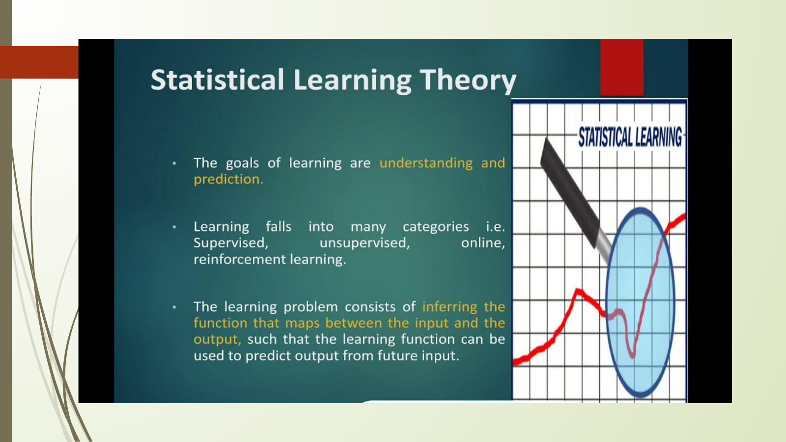

### Extracted Slide Text

- No selectable text extracted from this page.

### Page Description And Teaching Notes

Slide type: visual-only or image-heavy slide.
Main idea: the slide is visual-first, so the image should be treated as the source for the content and structure.
This page is primarily visual. The embedded slide image is the authoritative visual output; read it as a diagram or illustration first, then connect any visible labels to the surrounding pages.
- No reliable selectable text was extracted; use the slide image for the visible diagram, chart, or screenshot.
Visual/layout description: the embedded image preserves the actual slide. Describe the title area first, then read bullets, formulas, tables, arrows, grouped boxes, or diagrams in their visible order. If the slide contains a diagram, explain the relationship shown by arrows/positioning before explaining the text labels.
Teaching note: after reading the slide, ask the learner to restate the page in one or two sentences and give one example. For formula or metric slides, also ask what each variable or metric means and when it should be used.
Exam/viva note: prepare the slide title as a short-answer question, then use the bullets or visual labels as the expected answer points.

## Page 13: Unit III - Unsupervised Learning Page 13

### Extracted Slide Text

- No selectable text extracted from this page.

### Page Description And Teaching Notes

Slide type: visual-only or image-heavy slide.
Main idea: the slide is visual-first, so the image should be treated as the source for the content and structure.
This page is primarily visual. The embedded slide image is the authoritative visual output; read it as a diagram or illustration first, then connect any visible labels to the surrounding pages.
- No reliable selectable text was extracted; use the slide image for the visible diagram, chart, or screenshot.
Visual/layout description: the embedded image preserves the actual slide. Describe the title area first, then read bullets, formulas, tables, arrows, grouped boxes, or diagrams in their visible order. If the slide contains a diagram, explain the relationship shown by arrows/positioning before explaining the text labels.
Teaching note: after reading the slide, ask the learner to restate the page in one or two sentences and give one example. For formula or metric slides, also ask what each variable or metric means and when it should be used.
Exam/viva note: prepare the slide title as a short-answer question, then use the bullets or visual labels as the expected answer points.

## Page 14: Learning Problem

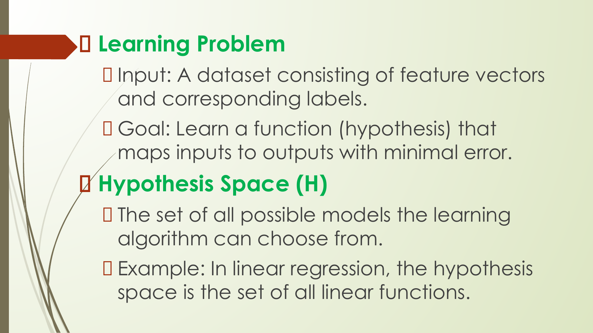

### Extracted Slide Text

- Learning Problem
- Input: A dataset consisting of feature vectors
- and corresponding labels.
- Goal: Learn a function (hypothesis) that
- maps inputs to outputs with minimal error.
- Hypothesis Space (H)
- The set of all possible models the learning
- algorithm can choose from.
- Example: In linear regression, the hypothesis
- space is the set of all linear functions.

### Page Description And Teaching Notes

Slide type: concept explanation slide.
Main idea: Input: A dataset consisting of feature vectors and corresponding labels. Goal: Learn a function (hypothesis) that maps inputs to outputs with minimal error. Hypothesis Space (H) The set of all possible models the learning.
This page explains a core concept in prose. The main task is to convert the definition into a clear statement of what the concept is, why it is used, and where it appears in a machine-learning workflow.
Detailed page understanding:
- `Input: A dataset consisting of feature vectors` is a core visible point. Explain what it means, why it matters, and how it connects to the slide title.
- `and corresponding labels.` is a core visible point. Explain what it means, why it matters, and how it connects to the slide title.
- `Goal: Learn a function (hypothesis) that` is a core visible point. Explain what it means, why it matters, and how it connects to the slide title.
- `maps inputs to outputs with minimal error.` is a limitation or risk. Mention when the method may fail and what alternative or precaution can reduce the issue.
- `Hypothesis Space (H)` is a core visible point. Explain what it means, why it matters, and how it connects to the slide title.
- `The set of all possible models the learning` is a core visible point. Explain what it means, why it matters, and how it connects to the slide title.
- `algorithm can choose from.` is a core visible point. Explain what it means, why it matters, and how it connects to the slide title.
- `Example: In linear regression, the hypothesis` is an application/example point. Convert it into a concrete real-world case while teaching.
- `space is the set of all linear functions.` is a core visible point. Explain what it means, why it matters, and how it connects to the slide title.
Important visible terms: Learning Problem Input, Goal, Learn, Hypothesis Space, The, Example.
Visual/layout description: the embedded image preserves the actual slide. Describe the title area first, then read bullets, formulas, tables, arrows, grouped boxes, or diagrams in their visible order. If the slide contains a diagram, explain the relationship shown by arrows/positioning before explaining the text labels.
Teaching note: after reading the slide, ask the learner to restate the page in one or two sentences and give one example. For formula or metric slides, also ask what each variable or metric means and when it should be used.
Exam/viva note: prepare the slide title as a short-answer question, then use the bullets or visual labels as the expected answer points.

## Page 15: •Risk and Loss Functions

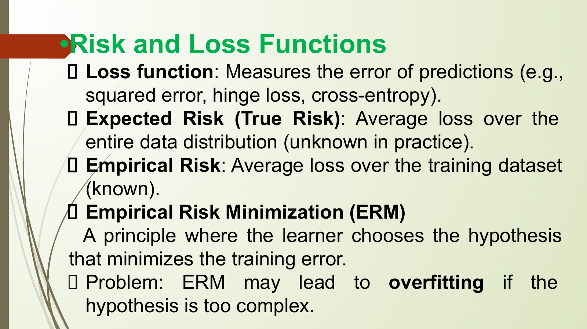

### Extracted Slide Text

- •Risk and Loss Functions
- Loss function: Measures the error of predictions (e.g.,
- squared error, hinge loss, cross-entropy).
- Expected Risk (True Risk): Average loss over the
- entire data distribution (unknown in practice).
- Empirical Risk: Average loss over the training dataset
- (known).
- Empirical Risk Minimization (ERM)
- A principle where the learner chooses the hypothesis
- that minimizes the training error.
- Problem: ERM may lead to overfitting if the
- hypothesis is too complex.

### Page Description And Teaching Notes

Slide type: bullet explanation slide.
Main idea: Loss function: Measures the error of predictions (e.g., squared error, hinge loss, cross-entropy). Expected Risk (True Risk): Average loss over the entire data distribution (unknown in practice). Empirical Risk: Average loss over the training dataset (known).
This page breaks the topic into separate points. Each bullet should be treated as a distinct exam or viva talking point, with the learner able to define it and give a small example.
Detailed page understanding:
- `Loss function: Measures the error of predictions (e.g.,` is a limitation or risk. Mention when the method may fail and what alternative or precaution can reduce the issue.
- `squared error, hinge loss, cross-entropy).` is a limitation or risk. Mention when the method may fail and what alternative or precaution can reduce the issue.
- `Expected Risk (True Risk): Average loss over the` is a core visible point. Explain what it means, why it matters, and how it connects to the slide title.
- `entire data distribution (unknown in practice).` is a core visible point. Explain what it means, why it matters, and how it connects to the slide title.
- `Empirical Risk: Average loss over the training dataset` is a core visible point. Explain what it means, why it matters, and how it connects to the slide title.
- `(known).` is a core visible point. Explain what it means, why it matters, and how it connects to the slide title.
- `Empirical Risk Minimization (ERM)` is a core visible point. Explain what it means, why it matters, and how it connects to the slide title.
- `A principle where the learner chooses the hypothesis` is a core visible point. Explain what it means, why it matters, and how it connects to the slide title.
- Additional bullets continue on the slide; use the extracted text list above for the complete wording.
- `hypothesis is too complex.` is a core visible point. Explain what it means, why it matters, and how it connects to the slide title.
Important visible terms: Risk, Loss Functions Loss, Measures, Expected Risk, True Risk, Average, Empirical Risk, Empirical Risk Minimization.
Visual/layout description: the embedded image preserves the actual slide. Describe the title area first, then read bullets, formulas, tables, arrows, grouped boxes, or diagrams in their visible order. If the slide contains a diagram, explain the relationship shown by arrows/positioning before explaining the text labels.
Teaching note: after reading the slide, ask the learner to restate the page in one or two sentences and give one example. For formula or metric slides, also ask what each variable or metric means and when it should be used.
Exam/viva note: prepare the slide title as a short-answer question, then use the bullets or visual labels as the expected answer points.

## Page 16: •Generalization

### Extracted Slide Text

- •Generalization
- The ability of a model to perform well on unseen data.
- Statistical Learning Theory provides tools (like VC
- dimension, bounds, and
- regularization) to study generalization
- •VC Dimension and Capacity Control
- Vapnik–Chervonenkis (VC) dimension: A measure of
- the complexity or capacity of a hypothesis space.
- Models with very high VC dimension can overfit; too low
- VC dimension may underfit.

### Page Description And Teaching Notes

Slide type: bullet explanation slide.
Main idea: The ability of a model to perform well on unseen data. Statistical Learning Theory provides tools (like VC dimension, bounds, and regularization) to study generalization •VC Dimension and Capacity Control Vapnik–Chervonenkis (VC) dimension: A measure of.
This page breaks the topic into separate points. Each bullet should be treated as a distinct exam or viva talking point, with the learner able to define it and give a small example.
Detailed page understanding:
- `The ability of a model to perform well on unseen data.` is a core visible point. Explain what it means, why it matters, and how it connects to the slide title.
- `Statistical Learning Theory provides tools (like VC` is a core visible point. Explain what it means, why it matters, and how it connects to the slide title.
- `dimension, bounds, and` is a core visible point. Explain what it means, why it matters, and how it connects to the slide title.
- `regularization) to study generalization` is a core visible point. Explain what it means, why it matters, and how it connects to the slide title.
- `•VC Dimension and Capacity Control` is one item in the slide's list. Treat it as a separate subtopic and prepare a one-line explanation for it.
- `Vapnik–Chervonenkis (VC) dimension: A measure of` is a core visible point. Explain what it means, why it matters, and how it connects to the slide title.
- `the complexity or capacity of a hypothesis space.` is a core visible point. Explain what it means, why it matters, and how it connects to the slide title.
- `Models with very high VC dimension can overfit; too low` is a core visible point. Explain what it means, why it matters, and how it connects to the slide title.
- `VC dimension may underfit.` is a core visible point. Explain what it means, why it matters, and how it connects to the slide title.
Important visible terms: Generalization The, Statistical Learning Theory, VC Dimension, Capacity Control Vapnik, Chervonenkis, Models.
Visual/layout description: the embedded image preserves the actual slide. Describe the title area first, then read bullets, formulas, tables, arrows, grouped boxes, or diagrams in their visible order. If the slide contains a diagram, explain the relationship shown by arrows/positioning before explaining the text labels.
Teaching note: after reading the slide, ask the learner to restate the page in one or two sentences and give one example. For formula or metric slides, also ask what each variable or metric means and when it should be used.
Exam/viva note: prepare the slide title as a short-answer question, then use the bullets or visual labels as the expected answer points.

## Page 17: •Structural Risk Minimization (SRM)

### Extracted Slide Text

- •Structural Risk Minimization (SRM)
- An approach that balances model complexity and
- training error.
- Introduces regularization to avoid overfitting and
- improve generalization.
- •PAC Learning (Probably Approximately Correct)
- Framework that defines conditions under which a
- learning algorithm can guarantee
- that the learned hypothesis is close to the true function,
- with high probability.

### Page Description And Teaching Notes

Slide type: bullet explanation slide.
Main idea: An approach that balances model complexity and training error. Introduces regularization to avoid overfitting and improve generalization. •PAC Learning (Probably Approximately Correct) Framework that defines conditions under which a.
This page breaks the topic into separate points. Each bullet should be treated as a distinct exam or viva talking point, with the learner able to define it and give a small example.
Detailed page understanding:
- `An approach that balances model complexity and` is a core visible point. Explain what it means, why it matters, and how it connects to the slide title.
- `training error.` is a limitation or risk. Mention when the method may fail and what alternative or precaution can reduce the issue.
- `Introduces regularization to avoid overfitting and` is a core visible point. Explain what it means, why it matters, and how it connects to the slide title.
- `improve generalization.` is a core visible point. Explain what it means, why it matters, and how it connects to the slide title.
- `•PAC Learning (Probably Approximately Correct)` is one item in the slide's list. Treat it as a separate subtopic and prepare a one-line explanation for it.
- `Framework that defines conditions under which a` is a core visible point. Explain what it means, why it matters, and how it connects to the slide title.
- `learning algorithm can guarantee` is a core visible point. Explain what it means, why it matters, and how it connects to the slide title.
- `that the learned hypothesis is close to the true function,` is a core visible point. Explain what it means, why it matters, and how it connects to the slide title.
- `with high probability.` is a core visible point. Explain what it means, why it matters, and how it connects to the slide title.
Important visible terms: Structural Risk Minimization, SRM, Introduces, PAC Learning, Probably Approximately Correct, Framework.
Visual/layout description: the embedded image preserves the actual slide. Describe the title area first, then read bullets, formulas, tables, arrows, grouped boxes, or diagrams in their visible order. If the slide contains a diagram, explain the relationship shown by arrows/positioning before explaining the text labels.
Teaching note: after reading the slide, ask the learner to restate the page in one or two sentences and give one example. For formula or metric slides, also ask what each variable or metric means and when it should be used.
Exam/viva note: prepare the slide title as a short-answer question, then use the bullets or visual labels as the expected answer points.

## Page 18: Hierarchical Clustering in

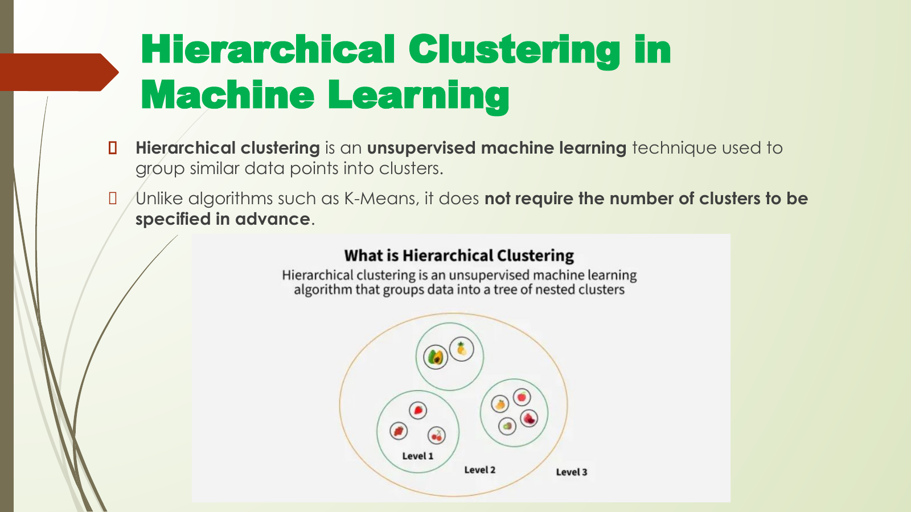

### Extracted Slide Text

- Hierarchical Clustering in
- Machine Learning
- Hierarchical clustering is an unsupervised machine learning technique used to
- group similar data points into clusters.
- Unlike algorithms such as K-Means, it does not require the number of clusters to be
- specified in advance.

### Page Description And Teaching Notes

Slide type: concept explanation slide.
Main idea: Machine Learning Hierarchical clustering is an unsupervised machine learning technique used to group similar data points into clusters. Unlike algorithms such as K-Means, it does not require the number of clusters to be specified in advance.
This page explains a core concept in prose. The main task is to convert the definition into a clear statement of what the concept is, why it is used, and where it appears in a machine-learning workflow.
Detailed page understanding:
- `Machine Learning` is a core visible point. Explain what it means, why it matters, and how it connects to the slide title.
- `Hierarchical clustering is an unsupervised machine learning technique used to` gives the definition-level meaning. Explain it first in simple words, then connect it to how a model learns from data.
- `group similar data points into clusters.` is a core visible point. Explain what it means, why it matters, and how it connects to the slide title.
- `Unlike algorithms such as K-Means, it does not require the number of clusters to be` is a core visible point. Explain what it means, why it matters, and how it connects to the slide title.
- `specified in advance.` is a core visible point. Explain what it means, why it matters, and how it connects to the slide title.
Important visible terms: Hierarchical Clustering, Machine Learning Hierarchical, Unlike, K-Means.
Visual/layout description: the embedded image preserves the actual slide. Describe the title area first, then read bullets, formulas, tables, arrows, grouped boxes, or diagrams in their visible order. If the slide contains a diagram, explain the relationship shown by arrows/positioning before explaining the text labels.
Teaching note: after reading the slide, ask the learner to restate the page in one or two sentences and give one example. For formula or metric slides, also ask what each variable or metric means and when it should be used.
Exam/viva note: prepare the slide title as a short-answer question, then use the bullets or visual labels as the expected answer points.

## Page 19: Agglomerative Hierarchical

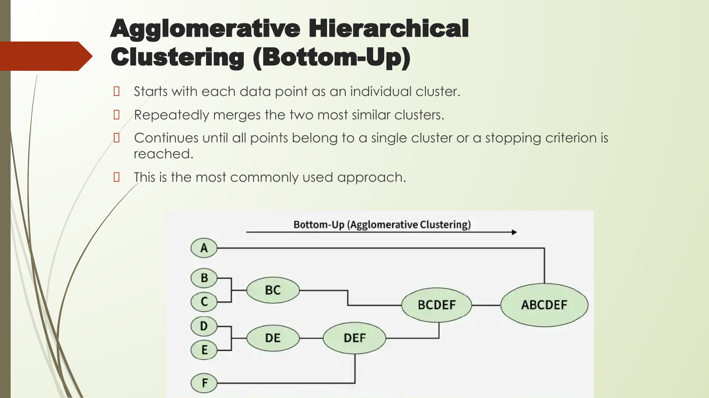

### Extracted Slide Text

- Agglomerative Hierarchical
- Clustering (Bottom-Up)
- Starts with each data point as an individual cluster.
- Repeatedly merges the two most similar clusters.
- Continues until all points belong to a single cluster or a stopping criterion is
- reached.
- This is the most commonly used approach.

### Page Description And Teaching Notes

Slide type: concept explanation slide.
Main idea: Clustering (Bottom-Up) Starts with each data point as an individual cluster. Repeatedly merges the two most similar clusters. Continues until all points belong to a single cluster or a stopping criterion is reached. This is the most commonly used approach.
This page explains a core concept in prose. The main task is to convert the definition into a clear statement of what the concept is, why it is used, and where it appears in a machine-learning workflow.
Detailed page understanding:
- `Clustering (Bottom-Up)` is a core visible point. Explain what it means, why it matters, and how it connects to the slide title.
- `Starts with each data point as an individual cluster.` is a core visible point. Explain what it means, why it matters, and how it connects to the slide title.
- `Repeatedly merges the two most similar clusters.` is a core visible point. Explain what it means, why it matters, and how it connects to the slide title.
- `Continues until all points belong to a single cluster or a stopping criterion is` is a core visible point. Explain what it means, why it matters, and how it connects to the slide title.
- `reached.` is a core visible point. Explain what it means, why it matters, and how it connects to the slide title.
- `This is the most commonly used approach.` is an application/example point. Convert it into a concrete real-world case while teaching.
Important visible terms: Agglomerative Hierarchical Clustering, Bottom-Up, Starts, Repeatedly, Continues, This.
Visual/layout description: the embedded image preserves the actual slide. Describe the title area first, then read bullets, formulas, tables, arrows, grouped boxes, or diagrams in their visible order. If the slide contains a diagram, explain the relationship shown by arrows/positioning before explaining the text labels.
Teaching note: after reading the slide, ask the learner to restate the page in one or two sentences and give one example. For formula or metric slides, also ask what each variable or metric means and when it should be used.
Exam/viva note: prepare the slide title as a short-answer question, then use the bullets or visual labels as the expected answer points.

## Page 20: Unit III - Unsupervised Learning Page 20

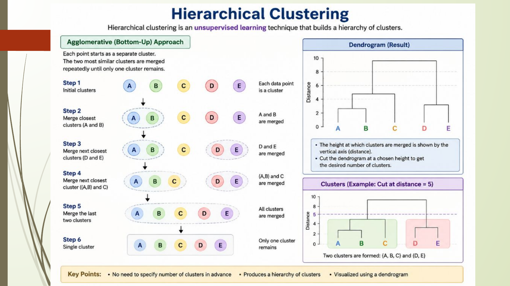

### Extracted Slide Text

- No selectable text extracted from this page.

### Page Description And Teaching Notes

Slide type: visual-only or image-heavy slide.
Main idea: the slide is visual-first, so the image should be treated as the source for the content and structure.
This page is primarily visual. The embedded slide image is the authoritative visual output; read it as a diagram or illustration first, then connect any visible labels to the surrounding pages.
- No reliable selectable text was extracted; use the slide image for the visible diagram, chart, or screenshot.
Visual/layout description: the embedded image preserves the actual slide. Describe the title area first, then read bullets, formulas, tables, arrows, grouped boxes, or diagrams in their visible order. If the slide contains a diagram, explain the relationship shown by arrows/positioning before explaining the text labels.
Teaching note: after reading the slide, ask the learner to restate the page in one or two sentences and give one example. For formula or metric slides, also ask what each variable or metric means and when it should be used.
Exam/viva note: prepare the slide title as a short-answer question, then use the bullets or visual labels as the expected answer points.

## Page 21: Agglomerative hierarchical

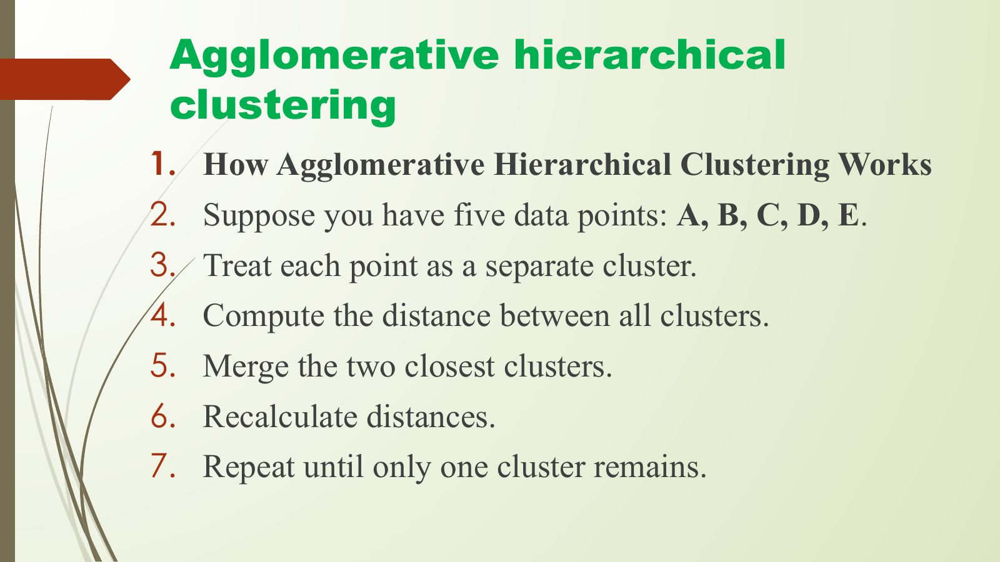

### Extracted Slide Text

- Agglomerative hierarchical
- clustering
- 1. How Agglomerative Hierarchical Clustering Works
- 2. Suppose you have five data points: A, B, C, D, E.
- 3. Treat each point as a separate cluster.
- 4. Compute the distance between all clusters.
- 5. Merge the two closest clusters.
- 6. Recalculate distances.
- 7. Repeat until only one cluster remains.

### Page Description And Teaching Notes

Slide type: bullet explanation slide.
Main idea: clustering 1. How Agglomerative Hierarchical Clustering Works 2. Suppose you have five data points: A, B, C, D, E. 3. Treat each point as a separate cluster. 4. Compute the distance between all clusters. 5. Merge the two closest clusters.
This page breaks the topic into separate points. Each bullet should be treated as a distinct exam or viva talking point, with the learner able to define it and give a small example.
Detailed page understanding:
- `clustering` is a core visible point. Explain what it means, why it matters, and how it connects to the slide title.
- `1. How Agglomerative Hierarchical Clustering Works` is one item in the slide's list. Treat it as a separate subtopic and prepare a one-line explanation for it.
- `2. Suppose you have five data points: A, B, C, D, E.` is one item in the slide's list. Treat it as a separate subtopic and prepare a one-line explanation for it.
- `3. Treat each point as a separate cluster.` is one item in the slide's list. Treat it as a separate subtopic and prepare a one-line explanation for it.
- `4. Compute the distance between all clusters.` is one item in the slide's list. Treat it as a separate subtopic and prepare a one-line explanation for it.
- `5. Merge the two closest clusters.` is one item in the slide's list. Treat it as a separate subtopic and prepare a one-line explanation for it.
- `6. Recalculate distances.` is one item in the slide's list. Treat it as a separate subtopic and prepare a one-line explanation for it.
- `7. Repeat until only one cluster remains.` is one item in the slide's list. Treat it as a separate subtopic and prepare a one-line explanation for it.
Important visible terms: Agglomerative, How Agglomerative Hierarchical Clustering, Works, Suppose, Treat, Compute, Merge, Recalculate.
Visual/layout description: the embedded image preserves the actual slide. Describe the title area first, then read bullets, formulas, tables, arrows, grouped boxes, or diagrams in their visible order. If the slide contains a diagram, explain the relationship shown by arrows/positioning before explaining the text labels.
Teaching note: after reading the slide, ask the learner to restate the page in one or two sentences and give one example. For formula or metric slides, also ask what each variable or metric means and when it should be used.
Exam/viva note: prepare the slide title as a short-answer question, then use the bullets or visual labels as the expected answer points.

## Page 22: Linkage Methods

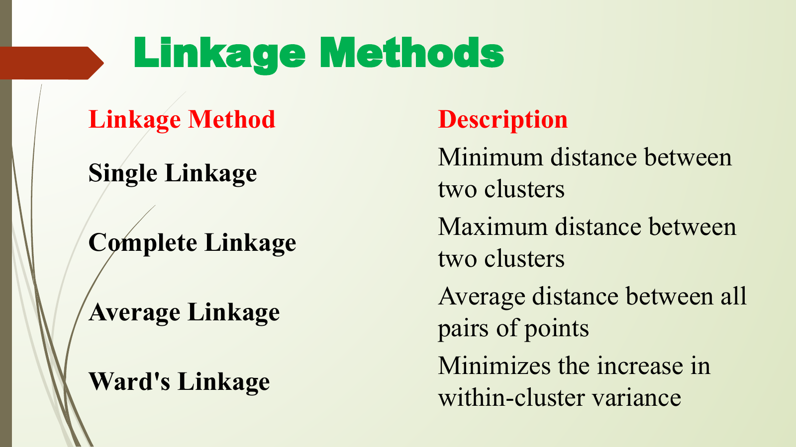

### Extracted Slide Text

- Linkage Methods
- Linkage Method Description
- Minimum distance between
- Single Linkage
- two clusters
- Maximum distance between
- Complete Linkage
- two clusters
- Average distance between all
- Average Linkage
- pairs of points
- Minimizes the increase in
- Ward's Linkage
- within-cluster variance

### Page Description And Teaching Notes

Slide type: concept explanation slide.
Main idea: Linkage Method Description Minimum distance between Single Linkage two clusters Maximum distance between Complete Linkage.
This page explains a core concept in prose. The main task is to convert the definition into a clear statement of what the concept is, why it is used, and where it appears in a machine-learning workflow.
Detailed page understanding:
- `Linkage Method Description` is a core visible point. Explain what it means, why it matters, and how it connects to the slide title.
- `Minimum distance between` is a core visible point. Explain what it means, why it matters, and how it connects to the slide title.
- `Single Linkage` is a core visible point. Explain what it means, why it matters, and how it connects to the slide title.
- `two clusters` is a core visible point. Explain what it means, why it matters, and how it connects to the slide title.
- `Maximum distance between` is a core visible point. Explain what it means, why it matters, and how it connects to the slide title.
- `Complete Linkage` is a core visible point. Explain what it means, why it matters, and how it connects to the slide title.
- `two clusters` is a core visible point. Explain what it means, why it matters, and how it connects to the slide title.
- `Average distance between all` is a core visible point. Explain what it means, why it matters, and how it connects to the slide title.
- Additional bullets continue on the slide; use the extracted text list above for the complete wording.
- `within-cluster variance` is a core visible point. Explain what it means, why it matters, and how it connects to the slide title.
Important visible terms: Linkage Methods Linkage Method, Description Minimum, Single Linkage, Maximum, Complete Linkage, Average, Average Linkage, Minimizes.
Visual/layout description: the embedded image preserves the actual slide. Describe the title area first, then read bullets, formulas, tables, arrows, grouped boxes, or diagrams in their visible order. If the slide contains a diagram, explain the relationship shown by arrows/positioning before explaining the text labels.
Teaching note: after reading the slide, ask the learner to restate the page in one or two sentences and give one example. For formula or metric slides, also ask what each variable or metric means and when it should be used.
Exam/viva note: prepare the slide title as a short-answer question, then use the bullets or visual labels as the expected answer points.

## Page 23: Unit III - Unsupervised Learning Page 23

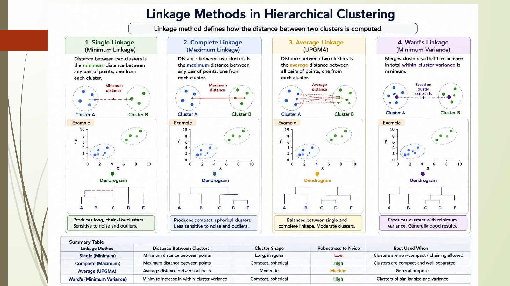

### Extracted Slide Text

- No selectable text extracted from this page.

### Page Description And Teaching Notes

Slide type: visual-only or image-heavy slide.
Main idea: the slide is visual-first, so the image should be treated as the source for the content and structure.
This page is primarily visual. The embedded slide image is the authoritative visual output; read it as a diagram or illustration first, then connect any visible labels to the surrounding pages.
- No reliable selectable text was extracted; use the slide image for the visible diagram, chart, or screenshot.
Visual/layout description: the embedded image preserves the actual slide. Describe the title area first, then read bullets, formulas, tables, arrows, grouped boxes, or diagrams in their visible order. If the slide contains a diagram, explain the relationship shown by arrows/positioning before explaining the text labels.
Teaching note: after reading the slide, ask the learner to restate the page in one or two sentences and give one example. For formula or metric slides, also ask what each variable or metric means and when it should be used.
Exam/viva note: prepare the slide title as a short-answer question, then use the bullets or visual labels as the expected answer points.

## Page 24: Divisive Hierarchical Clustering (Top-Down)

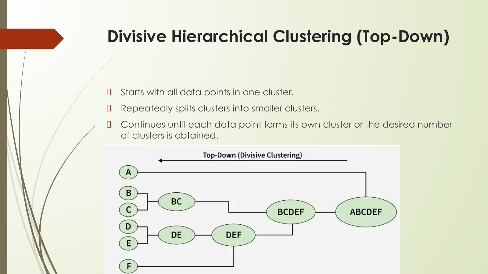

### Extracted Slide Text

- Divisive Hierarchical Clustering (Top-Down)
- Starts with all data points in one cluster.
- Repeatedly splits clusters into smaller clusters.
- Continues until each data point forms its own cluster or the desired number
- of clusters is obtained.

### Page Description And Teaching Notes

Slide type: concept explanation slide.
Main idea: Starts with all data points in one cluster. Repeatedly splits clusters into smaller clusters. Continues until each data point forms its own cluster or the desired number of clusters is obtained.
This page explains a core concept in prose. The main task is to convert the definition into a clear statement of what the concept is, why it is used, and where it appears in a machine-learning workflow.
Detailed page understanding:
- `Starts with all data points in one cluster.` is a core visible point. Explain what it means, why it matters, and how it connects to the slide title.
- `Repeatedly splits clusters into smaller clusters.` is a core visible point. Explain what it means, why it matters, and how it connects to the slide title.
- `Continues until each data point forms its own cluster or the desired number` is a core visible point. Explain what it means, why it matters, and how it connects to the slide title.
- `of clusters is obtained.` is a core visible point. Explain what it means, why it matters, and how it connects to the slide title.
Important visible terms: Divisive Hierarchical Clustering, Top-Down, Starts, Repeatedly, Continues.
Visual/layout description: the embedded image preserves the actual slide. Describe the title area first, then read bullets, formulas, tables, arrows, grouped boxes, or diagrams in their visible order. If the slide contains a diagram, explain the relationship shown by arrows/positioning before explaining the text labels.
Teaching note: after reading the slide, ask the learner to restate the page in one or two sentences and give one example. For formula or metric slides, also ask what each variable or metric means and when it should be used.
Exam/viva note: prepare the slide title as a short-answer question, then use the bullets or visual labels as the expected answer points.

## Page 25: Unit III - Unsupervised Learning Page 25

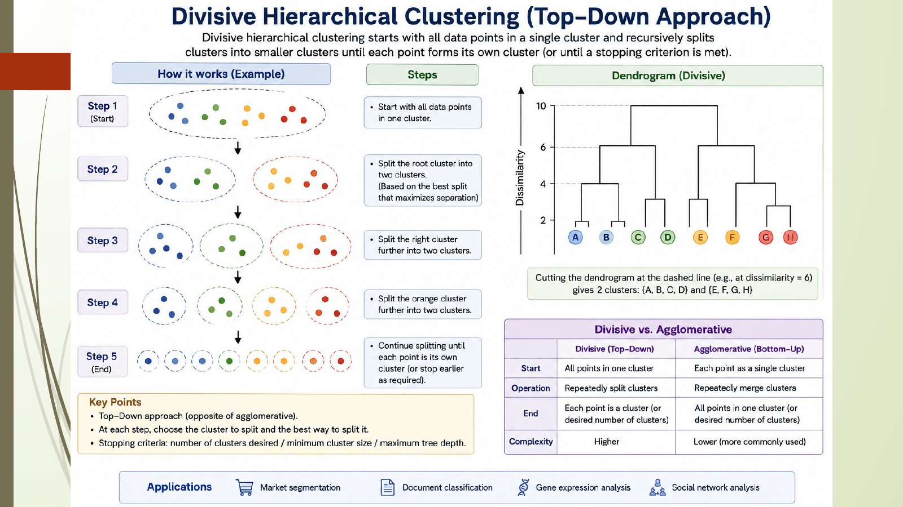

### Extracted Slide Text

- No selectable text extracted from this page.

### Page Description And Teaching Notes

Slide type: visual-only or image-heavy slide.
Main idea: the slide is visual-first, so the image should be treated as the source for the content and structure.
This page is primarily visual. The embedded slide image is the authoritative visual output; read it as a diagram or illustration first, then connect any visible labels to the surrounding pages.
- No reliable selectable text was extracted; use the slide image for the visible diagram, chart, or screenshot.
Visual/layout description: the embedded image preserves the actual slide. Describe the title area first, then read bullets, formulas, tables, arrows, grouped boxes, or diagrams in their visible order. If the slide contains a diagram, explain the relationship shown by arrows/positioning before explaining the text labels.
Teaching note: after reading the slide, ask the learner to restate the page in one or two sentences and give one example. For formula or metric slides, also ask what each variable or metric means and when it should be used.
Exam/viva note: prepare the slide title as a short-answer question, then use the bullets or visual labels as the expected answer points.

## Page 26: Dendrogram

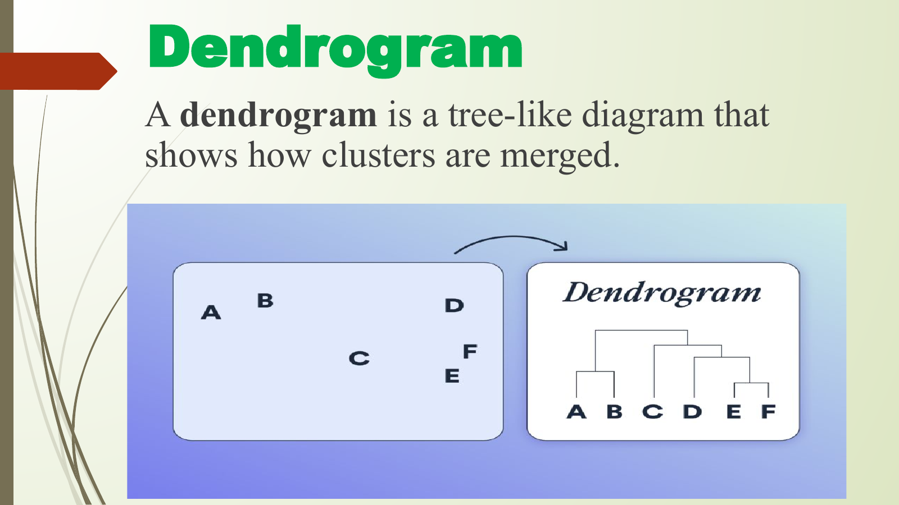

### Extracted Slide Text

- Dendrogram
- A dendrogram is a tree-like diagram that
- shows how clusters are merged.

### Page Description And Teaching Notes

Slide type: title or transition slide.
Main idea: A dendrogram is a tree-like diagram that shows how clusters are merged.
This page sets the context for the next topic. Treat it as a section marker: it tells the learner what concept or unit is starting before the deck moves into definitions, examples, or formulas.
Detailed page understanding:
- `A dendrogram is a tree-like diagram that` gives the definition-level meaning. Explain it first in simple words, then connect it to how a model learns from data.
- `shows how clusters are merged.` is a core visible point. Explain what it means, why it matters, and how it connects to the slide title.
Important visible terms: Dendrogram A.
Visual/layout description: the embedded image preserves the actual slide. Describe the title area first, then read bullets, formulas, tables, arrows, grouped boxes, or diagrams in their visible order. If the slide contains a diagram, explain the relationship shown by arrows/positioning before explaining the text labels.
Teaching note: after reading the slide, ask the learner to restate the page in one or two sentences and give one example. For formula or metric slides, also ask what each variable or metric means and when it should be used.
Exam/viva note: prepare the slide title as a short-answer question, then use the bullets or visual labels as the expected answer points.

## Page 27: The dendrogram is a tree diagram that displays the

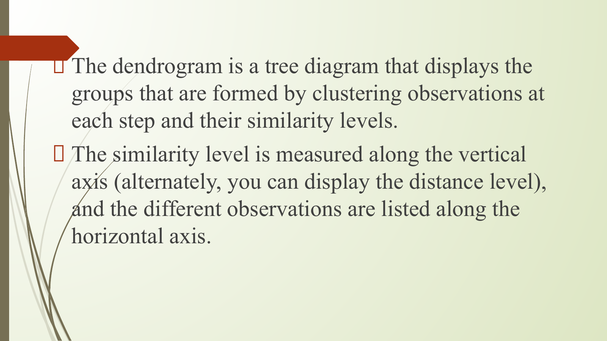

### Extracted Slide Text

- The dendrogram is a tree diagram that displays the
- groups that are formed by clustering observations at
- each step and their similarity levels.
- The similarity level is measured along the vertical
- axis (alternately, you can display the distance level),
- and the different observations are listed along the
- horizontal axis.

### Page Description And Teaching Notes

Slide type: process or diagram slide.
Main idea: groups that are formed by clustering observations at each step and their similarity levels. The similarity level is measured along the vertical axis (alternately, you can display the distance level), and the different observations are listed along the horizontal axis.
This page describes a flow, algorithm, or sequence. Read the visual from start to finish and explain how each stage transforms data, parameters, or decisions into the next stage.
Detailed page understanding:
- `groups that are formed by clustering observations at` is a core visible point. Explain what it means, why it matters, and how it connects to the slide title.
- `each step and their similarity levels.` is a core visible point. Explain what it means, why it matters, and how it connects to the slide title.
- `The similarity level is measured along the vertical` is a core visible point. Explain what it means, why it matters, and how it connects to the slide title.
- `axis (alternately, you can display the distance level),` is a core visible point. Explain what it means, why it matters, and how it connects to the slide title.
- `and the different observations are listed along the` is a core visible point. Explain what it means, why it matters, and how it connects to the slide title.
- `horizontal axis.` is a core visible point. Explain what it means, why it matters, and how it connects to the slide title.
Important visible terms: The.
Visual/layout description: the embedded image preserves the actual slide. Describe the title area first, then read bullets, formulas, tables, arrows, grouped boxes, or diagrams in their visible order. If the slide contains a diagram, explain the relationship shown by arrows/positioning before explaining the text labels.
Teaching note: after reading the slide, ask the learner to restate the page in one or two sentences and give one example. For formula or metric slides, also ask what each variable or metric means and when it should be used.
Exam/viva note: prepare the slide title as a short-answer question, then use the bullets or visual labels as the expected answer points.

## Page 28: Interpretation

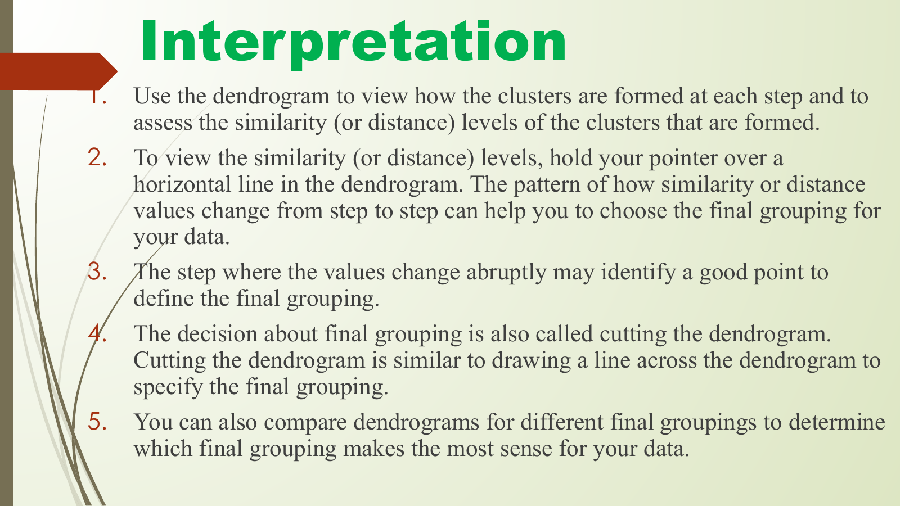

### Extracted Slide Text

- Interpretation
- 1. Use the dendrogram to view how the clusters are formed at each step and to
- assess the similarity (or distance) levels of the clusters that are formed.
- 2. To view the similarity (or distance) levels, hold your pointer over a
- horizontal line in the dendrogram. The pattern of how similarity or distance
- values change from step to step can help you to choose the final grouping for
- your data.
- 3. The step where the values change abruptly may identify a good point to
- define the final grouping.
- 4. The decision about final grouping is also called cutting the dendrogram.
- Cutting the dendrogram is similar to drawing a line across the dendrogram to
- specify the final grouping.
- 5. You can also compare dendrograms for different final groupings to determine
- which final grouping makes the most sense for your data.

### Page Description And Teaching Notes

Slide type: bullet explanation slide.
Main idea: 1. Use the dendrogram to view how the clusters are formed at each step and to assess the similarity (or distance) levels of the clusters that are formed. 2. To view the similarity (or distance) levels, hold your pointer over a horizontal line in the dendrogram. The pattern of how similarity or distance values change from step to step can help you to choose the final grouping for your data.
This page breaks the topic into separate points. Each bullet should be treated as a distinct exam or viva talking point, with the learner able to define it and give a small example.
Detailed page understanding:
- `1. Use the dendrogram to view how the clusters are formed at each step and to` is an application/example point. Convert it into a concrete real-world case while teaching.
- `assess the similarity (or distance) levels of the clusters that are formed.` is a core visible point. Explain what it means, why it matters, and how it connects to the slide title.
- `2. To view the similarity (or distance) levels, hold your pointer over a` is one item in the slide's list. Treat it as a separate subtopic and prepare a one-line explanation for it.
- `horizontal line in the dendrogram. The pattern of how similarity or distance` is a core visible point. Explain what it means, why it matters, and how it connects to the slide title.
- `values change from step to step can help you to choose the final grouping for` is a core visible point. Explain what it means, why it matters, and how it connects to the slide title.
- `your data.` is a core visible point. Explain what it means, why it matters, and how it connects to the slide title.
- `3. The step where the values change abruptly may identify a good point to` is one item in the slide's list. Treat it as a separate subtopic and prepare a one-line explanation for it.
- `define the final grouping.` is a core visible point. Explain what it means, why it matters, and how it connects to the slide title.
- Additional bullets continue on the slide; use the extracted text list above for the complete wording.
- `which final grouping makes the most sense for your data.` is a core visible point. Explain what it means, why it matters, and how it connects to the slide title.
Important visible terms: Interpretation, Use, The, Cutting, You.
Visual/layout description: the embedded image preserves the actual slide. Describe the title area first, then read bullets, formulas, tables, arrows, grouped boxes, or diagrams in their visible order. If the slide contains a diagram, explain the relationship shown by arrows/positioning before explaining the text labels.
Teaching note: after reading the slide, ask the learner to restate the page in one or two sentences and give one example. For formula or metric slides, also ask what each variable or metric means and when it should be used.
Exam/viva note: prepare the slide title as a short-answer question, then use the bullets or visual labels as the expected answer points.

## Page 29: Unit III - Unsupervised Learning Page 29

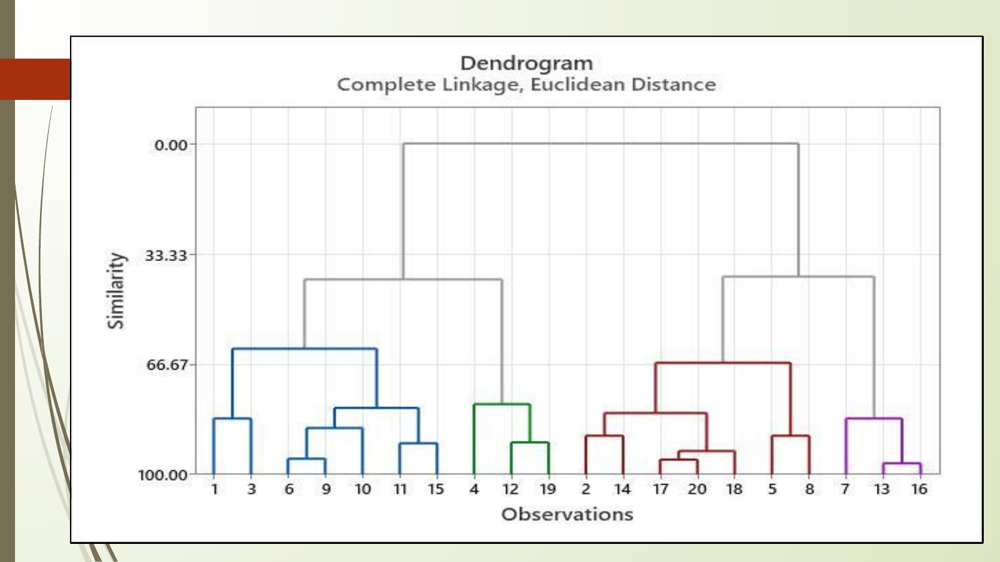

### Extracted Slide Text

- No selectable text extracted from this page.

### Page Description And Teaching Notes

Slide type: visual-only or image-heavy slide.
Main idea: the slide is visual-first, so the image should be treated as the source for the content and structure.
This page is primarily visual. The embedded slide image is the authoritative visual output; read it as a diagram or illustration first, then connect any visible labels to the surrounding pages.
- No reliable selectable text was extracted; use the slide image for the visible diagram, chart, or screenshot.
Visual/layout description: the embedded image preserves the actual slide. Describe the title area first, then read bullets, formulas, tables, arrows, grouped boxes, or diagrams in their visible order. If the slide contains a diagram, explain the relationship shown by arrows/positioning before explaining the text labels.
Teaching note: after reading the slide, ask the learner to restate the page in one or two sentences and give one example. For formula or metric slides, also ask what each variable or metric means and when it should be used.
Exam/viva note: prepare the slide title as a short-answer question, then use the bullets or visual labels as the expected answer points.

## Page 30: 1. This dendrogram was created using a final partition of

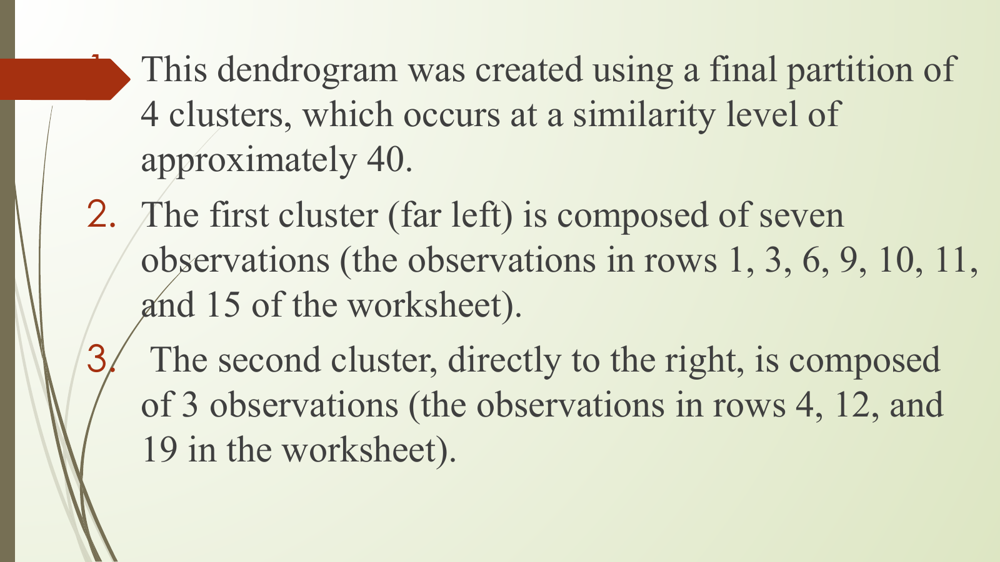

### Extracted Slide Text

- 1. This dendrogram was created using a final partition of
- 4 clusters, which occurs at a similarity level of
- approximately 40.
- 2. The first cluster (far left) is composed of seven
- observations (the observations in rows 1, 3, 6, 9, 10, 11,
- and 15 of the worksheet).
- 3. The second cluster, directly to the right, is composed
- of 3 observations (the observations in rows 4, 12, and
- 19 in the worksheet).

### Page Description And Teaching Notes

Slide type: bullet explanation slide.
Main idea: 4 clusters, which occurs at a similarity level of approximately 40. 2. The first cluster (far left) is composed of seven observations (the observations in rows 1, 3, 6, 9, 10, 11, and 15 of the worksheet). 3. The second cluster, directly to the right, is composed.
This page breaks the topic into separate points. Each bullet should be treated as a distinct exam or viva talking point, with the learner able to define it and give a small example.
Detailed page understanding:
- `4 clusters, which occurs at a similarity level of` is a core visible point. Explain what it means, why it matters, and how it connects to the slide title.
- `approximately 40.` is a core visible point. Explain what it means, why it matters, and how it connects to the slide title.
- `2. The first cluster (far left) is composed of seven` is one item in the slide's list. Treat it as a separate subtopic and prepare a one-line explanation for it.
- `observations (the observations in rows 1, 3, 6, 9, 10, 11,` is a core visible point. Explain what it means, why it matters, and how it connects to the slide title.
- `and 15 of the worksheet).` is a core visible point. Explain what it means, why it matters, and how it connects to the slide title.
- `3. The second cluster, directly to the right, is composed` is one item in the slide's list. Treat it as a separate subtopic and prepare a one-line explanation for it.
- `of 3 observations (the observations in rows 4, 12, and` is a core visible point. Explain what it means, why it matters, and how it connects to the slide title.
- `19 in the worksheet).` is a core visible point. Explain what it means, why it matters, and how it connects to the slide title.
Important visible terms: This, The.
Visual/layout description: the embedded image preserves the actual slide. Describe the title area first, then read bullets, formulas, tables, arrows, grouped boxes, or diagrams in their visible order. If the slide contains a diagram, explain the relationship shown by arrows/positioning before explaining the text labels.
Teaching note: after reading the slide, ask the learner to restate the page in one or two sentences and give one example. For formula or metric slides, also ask what each variable or metric means and when it should be used.
Exam/viva note: prepare the slide title as a short-answer question, then use the bullets or visual labels as the expected answer points.

## Page 31: 6. The third cluster is composed of 7 observations (the

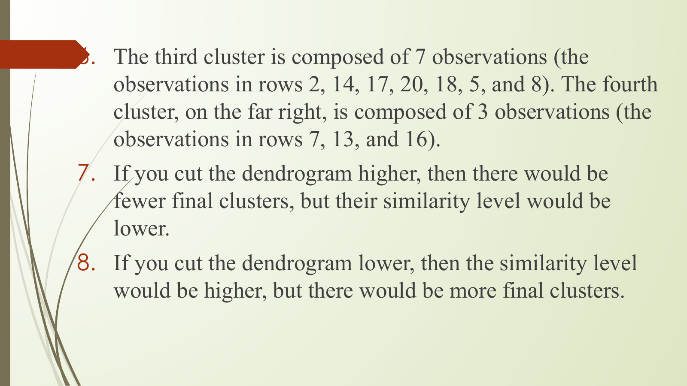

### Extracted Slide Text

- 6. The third cluster is composed of 7 observations (the
- observations in rows 2, 14, 17, 20, 18, 5, and 8). The fourth
- cluster, on the far right, is composed of 3 observations (the
- observations in rows 7, 13, and 16).
- 7. If you cut the dendrogram higher, then there would be
- fewer final clusters, but their similarity level would be
- lower.
- 8. If you cut the dendrogram lower, then the similarity level
- would be higher, but there would be more final clusters.

### Page Description And Teaching Notes

Slide type: bullet explanation slide.
Main idea: observations in rows 2, 14, 17, 20, 18, 5, and 8). The fourth cluster, on the far right, is composed of 3 observations (the observations in rows 7, 13, and 16). 7. If you cut the dendrogram higher, then there would be fewer final clusters, but their similarity level would be lower.
This page breaks the topic into separate points. Each bullet should be treated as a distinct exam or viva talking point, with the learner able to define it and give a small example.
Detailed page understanding:
- `observations in rows 2, 14, 17, 20, 18, 5, and 8). The fourth` is a core visible point. Explain what it means, why it matters, and how it connects to the slide title.
- `cluster, on the far right, is composed of 3 observations (the` is a core visible point. Explain what it means, why it matters, and how it connects to the slide title.
- `observations in rows 7, 13, and 16).` is a core visible point. Explain what it means, why it matters, and how it connects to the slide title.
- `7. If you cut the dendrogram higher, then there would be` is one item in the slide's list. Treat it as a separate subtopic and prepare a one-line explanation for it.
- `fewer final clusters, but their similarity level would be` is a core visible point. Explain what it means, why it matters, and how it connects to the slide title.
- `lower.` is a core visible point. Explain what it means, why it matters, and how it connects to the slide title.
- `8. If you cut the dendrogram lower, then the similarity level` is one item in the slide's list. Treat it as a separate subtopic and prepare a one-line explanation for it.
- `would be higher, but there would be more final clusters.` is a core visible point. Explain what it means, why it matters, and how it connects to the slide title.
Important visible terms: The.
Visual/layout description: the embedded image preserves the actual slide. Describe the title area first, then read bullets, formulas, tables, arrows, grouped boxes, or diagrams in their visible order. If the slide contains a diagram, explain the relationship shown by arrows/positioning before explaining the text labels.
Teaching note: after reading the slide, ask the learner to restate the page in one or two sentences and give one example. For formula or metric slides, also ask what each variable or metric means and when it should be used.
Exam/viva note: prepare the slide title as a short-answer question, then use the bullets or visual labels as the expected answer points.

## Page 32: Apriori algorithm for association

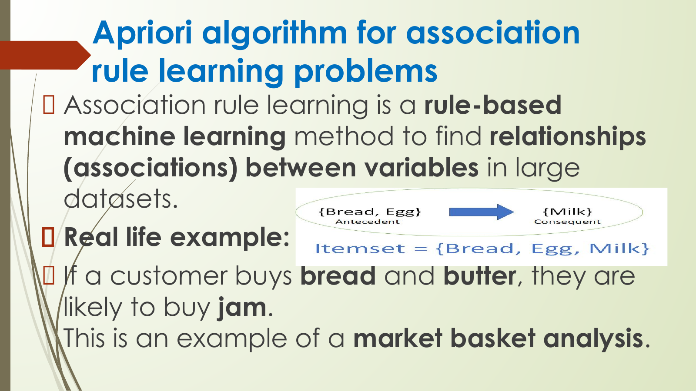

### Extracted Slide Text

- Apriori algorithm for association
- rule learning problems
- Association rule learning is a rule-based
- machine learning method to find relationships
- (associations) between variables in large
- datasets.
- Real life example:
- If a customer buys bread and butter, they are
- likely to buy jam.
- This is an example of a market basket analysis.

### Page Description And Teaching Notes

Slide type: concept explanation slide.
Main idea: rule learning problems Association rule learning is a rule-based machine learning method to find relationships (associations) between variables in large datasets. Real life example:.
This page explains a core concept in prose. The main task is to convert the definition into a clear statement of what the concept is, why it is used, and where it appears in a machine-learning workflow.
Detailed page understanding:
- `rule learning problems` is a limitation or risk. Mention when the method may fail and what alternative or precaution can reduce the issue.
- `Association rule learning is a rule-based` gives the definition-level meaning. Explain it first in simple words, then connect it to how a model learns from data.
- `machine learning method to find relationships` is a core visible point. Explain what it means, why it matters, and how it connects to the slide title.
- `(associations) between variables in large` is a core visible point. Explain what it means, why it matters, and how it connects to the slide title.
- `datasets.` is a core visible point. Explain what it means, why it matters, and how it connects to the slide title.
- `Real life example:` is an application/example point. Convert it into a concrete real-world case while teaching.
- `If a customer buys bread and butter, they are` is a core visible point. Explain what it means, why it matters, and how it connects to the slide title.
- `likely to buy jam.` is a core visible point. Explain what it means, why it matters, and how it connects to the slide title.
- `This is an example of a market basket analysis.` gives the definition-level meaning. Explain it first in simple words, then connect it to how a model learns from data.
Important visible terms: Apriori, Association, Real, This.
Visual/layout description: the embedded image preserves the actual slide. Describe the title area first, then read bullets, formulas, tables, arrows, grouped boxes, or diagrams in their visible order. If the slide contains a diagram, explain the relationship shown by arrows/positioning before explaining the text labels.
Teaching note: after reading the slide, ask the learner to restate the page in one or two sentences and give one example. For formula or metric slides, also ask what each variable or metric means and when it should be used.
Exam/viva note: prepare the slide title as a short-answer question, then use the bullets or visual labels as the expected answer points.

## Page 33: Steps of Apriori Algorithm

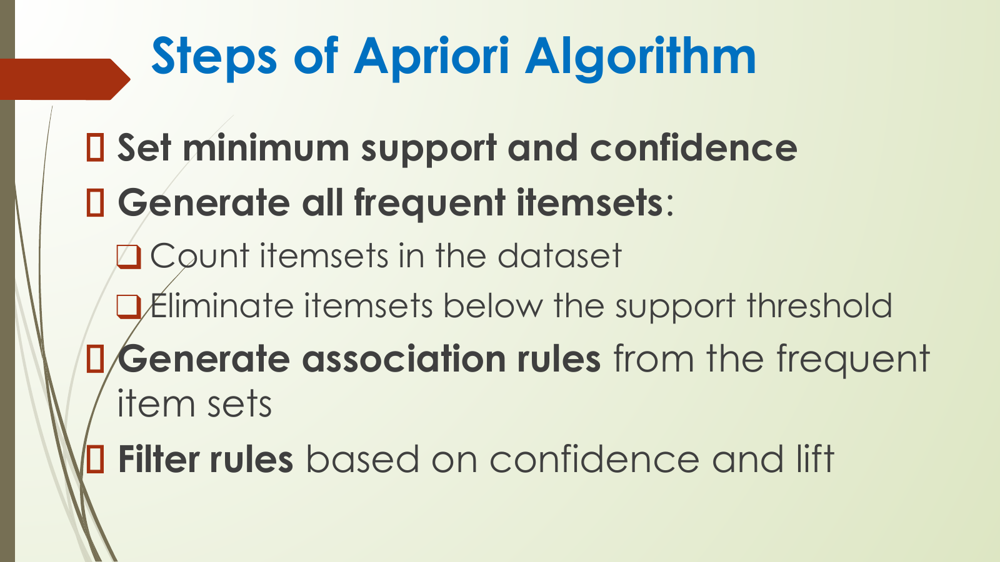

### Extracted Slide Text

- Steps of Apriori Algorithm
- Set minimum support and confidence
- Generate all frequent itemsets:
- ❑ Count itemsets in the dataset
- ❑ Eliminate itemsets below the support threshold
- Generate association rules from the frequent
- item sets
- Filter rules based on confidence and lift

### Page Description And Teaching Notes

Slide type: metric/table slide.
Main idea: Set minimum support and confidence Generate all frequent itemsets: ❑ Count itemsets in the dataset ❑ Eliminate itemsets below the support threshold Generate association rules from the frequent item sets.
This page organizes evaluation or comparison information. Focus on what each metric measures, when it is useful, and what mistake it prevents when judging a machine-learning model.
Detailed page understanding:
- `Set minimum support and confidence` is a core visible point. Explain what it means, why it matters, and how it connects to the slide title.
- `Generate all frequent itemsets:` is a core visible point. Explain what it means, why it matters, and how it connects to the slide title.
- `❑ Count itemsets in the dataset` is one item in the slide's list. Treat it as a separate subtopic and prepare a one-line explanation for it.
- `❑ Eliminate itemsets below the support threshold` is one item in the slide's list. Treat it as a separate subtopic and prepare a one-line explanation for it.
- `Generate association rules from the frequent` is a core visible point. Explain what it means, why it matters, and how it connects to the slide title.
- `item sets` is a core visible point. Explain what it means, why it matters, and how it connects to the slide title.
- `Filter rules based on confidence and lift` is a core visible point. Explain what it means, why it matters, and how it connects to the slide title.
Important visible terms: Steps, Apriori Algorithm Set, Generate, Count, Eliminate, Filter.
Visual/layout description: the embedded image preserves the actual slide. Describe the title area first, then read bullets, formulas, tables, arrows, grouped boxes, or diagrams in their visible order. If the slide contains a diagram, explain the relationship shown by arrows/positioning before explaining the text labels.
Teaching note: after reading the slide, ask the learner to restate the page in one or two sentences and give one example. For formula or metric slides, also ask what each variable or metric means and when it should be used.
Exam/viva note: prepare the slide title as a short-answer question, then use the bullets or visual labels as the expected answer points.

## Page 34: Unit III - Unsupervised Learning Page 34

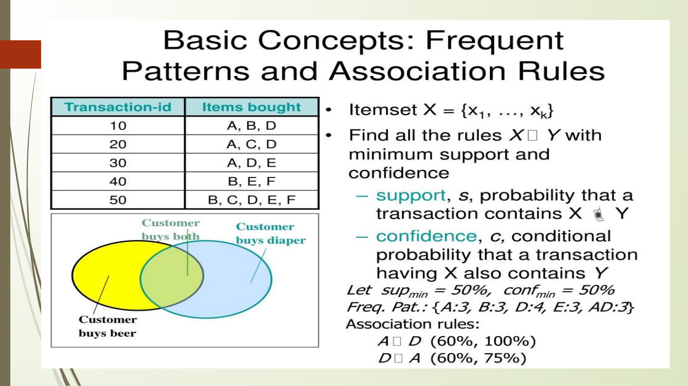

### Extracted Slide Text

- No selectable text extracted from this page.

### Page Description And Teaching Notes

Slide type: visual-only or image-heavy slide.
Main idea: the slide is visual-first, so the image should be treated as the source for the content and structure.
This page is primarily visual. The embedded slide image is the authoritative visual output; read it as a diagram or illustration first, then connect any visible labels to the surrounding pages.
- No reliable selectable text was extracted; use the slide image for the visible diagram, chart, or screenshot.
Visual/layout description: the embedded image preserves the actual slide. Describe the title area first, then read bullets, formulas, tables, arrows, grouped boxes, or diagrams in their visible order. If the slide contains a diagram, explain the relationship shown by arrows/positioning before explaining the text labels.
Teaching note: after reading the slide, ask the learner to restate the page in one or two sentences and give one example. For formula or metric slides, also ask what each variable or metric means and when it should be used.
Exam/viva note: prepare the slide title as a short-answer question, then use the bullets or visual labels as the expected answer points.

## Page 35: Unit III - Unsupervised Learning Page 35

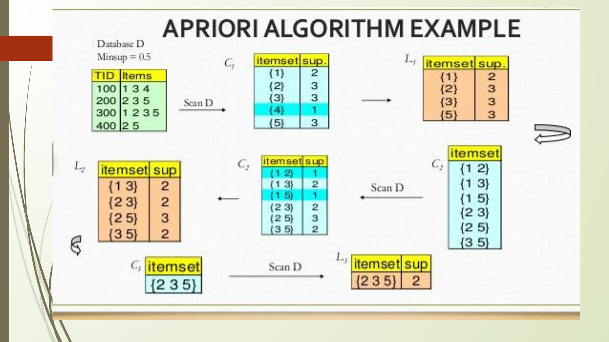

### Extracted Slide Text

- No selectable text extracted from this page.

### Page Description And Teaching Notes

Slide type: visual-only or image-heavy slide.
Main idea: the slide is visual-first, so the image should be treated as the source for the content and structure.
This page is primarily visual. The embedded slide image is the authoritative visual output; read it as a diagram or illustration first, then connect any visible labels to the surrounding pages.
- No reliable selectable text was extracted; use the slide image for the visible diagram, chart, or screenshot.
Visual/layout description: the embedded image preserves the actual slide. Describe the title area first, then read bullets, formulas, tables, arrows, grouped boxes, or diagrams in their visible order. If the slide contains a diagram, explain the relationship shown by arrows/positioning before explaining the text labels.
Teaching note: after reading the slide, ask the learner to restate the page in one or two sentences and give one example. For formula or metric slides, also ask what each variable or metric means and when it should be used.
Exam/viva note: prepare the slide title as a short-answer question, then use the bullets or visual labels as the expected answer points.

## Page 36: How Apriori Algorithm model works

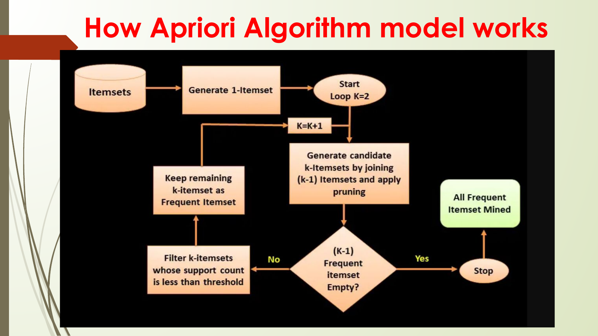

### Extracted Slide Text

- How Apriori Algorithm model works

### Page Description And Teaching Notes

Slide type: title or transition slide.
Main idea: the slide is visual-first, so the image should be treated as the source for the content and structure.
This page sets the context for the next topic. Treat it as a section marker: it tells the learner what concept or unit is starting before the deck moves into definitions, examples, or formulas.
- No reliable selectable text was extracted; use the slide image for the visible diagram, chart, or screenshot.
Important visible terms: How Apriori Algorithm.
Visual/layout description: the embedded image preserves the actual slide. Describe the title area first, then read bullets, formulas, tables, arrows, grouped boxes, or diagrams in their visible order. If the slide contains a diagram, explain the relationship shown by arrows/positioning before explaining the text labels.
Teaching note: after reading the slide, ask the learner to restate the page in one or two sentences and give one example. For formula or metric slides, also ask what each variable or metric means and when it should be used.
Exam/viva note: prepare the slide title as a short-answer question, then use the bullets or visual labels as the expected answer points.

## Page 37: Applications of Apriori Algorithm

### Extracted Slide Text

- Applications of Apriori Algorithm
- E-commerce: Used to recommend products
- that are often bought together like laptop +
- laptop bag, increasing sales.
- Food Delivery Services: Identifies popular
- combos such as burger + fries, to offer combo
- deals to customers.
- Streaming Services: Recommends related
- movies or shows based on what users often
- watch together like action + superhero
- movies.

### Page Description And Teaching Notes

Slide type: concept explanation slide.
Main idea: E-commerce: Used to recommend products that are often bought together like laptop + laptop bag, increasing sales. Food Delivery Services: Identifies popular combos such as burger + fries, to offer combo deals to customers.
This page explains a core concept in prose. The main task is to convert the definition into a clear statement of what the concept is, why it is used, and where it appears in a machine-learning workflow.
Detailed page understanding:
- `E-commerce: Used to recommend products` is an application/example point. Convert it into a concrete real-world case while teaching.
- `that are often bought together like laptop +` is a core visible point. Explain what it means, why it matters, and how it connects to the slide title.
- `laptop bag, increasing sales.` is a core visible point. Explain what it means, why it matters, and how it connects to the slide title.
- `Food Delivery Services: Identifies popular` is a core visible point. Explain what it means, why it matters, and how it connects to the slide title.
- `combos such as burger + fries, to offer combo` is a core visible point. Explain what it means, why it matters, and how it connects to the slide title.
- `deals to customers.` is a core visible point. Explain what it means, why it matters, and how it connects to the slide title.
- `Streaming Services: Recommends related` is a core visible point. Explain what it means, why it matters, and how it connects to the slide title.
- `movies or shows based on what users often` is an application/example point. Convert it into a concrete real-world case while teaching.
- `watch together like action + superhero` is a core visible point. Explain what it means, why it matters, and how it connects to the slide title.
- `movies.` is a core visible point. Explain what it means, why it matters, and how it connects to the slide title.
Important visible terms: Applications, Apriori Algorithm E-commerce, Used, Food Delivery Services, Identifies, Streaming Services, Recommends.
Visual/layout description: the embedded image preserves the actual slide. Describe the title area first, then read bullets, formulas, tables, arrows, grouped boxes, or diagrams in their visible order. If the slide contains a diagram, explain the relationship shown by arrows/positioning before explaining the text labels.
Teaching note: after reading the slide, ask the learner to restate the page in one or two sentences and give one example. For formula or metric slides, also ask what each variable or metric means and when it should be used.
Exam/viva note: prepare the slide title as a short-answer question, then use the bullets or visual labels as the expected answer points.

## Page 38: Financial Services: Analyzes spending habits to

### Extracted Slide Text

- Financial Services: Analyzes spending habits to
- suggest personalized offers such as credit card
- deals based on frequent purchases.
- Travel & Hospitality: Creates travel packages like
- flight + hotel by finding commonly purchased
- services together.
- Health & Fitness: Suggests workout plans or
- supplements based on users' past activities like
- protein shakes + workouts.

### Page Description And Teaching Notes

Slide type: concept explanation slide.
Main idea: suggest personalized offers such as credit card deals based on frequent purchases. Travel & Hospitality: Creates travel packages like flight + hotel by finding commonly purchased services together. Health & Fitness: Suggests workout plans or.
This page explains a core concept in prose. The main task is to convert the definition into a clear statement of what the concept is, why it is used, and where it appears in a machine-learning workflow.
Detailed page understanding:
- `suggest personalized offers such as credit card` is a core visible point. Explain what it means, why it matters, and how it connects to the slide title.
- `deals based on frequent purchases.` is a core visible point. Explain what it means, why it matters, and how it connects to the slide title.
- `Travel & Hospitality: Creates travel packages like` is a core visible point. Explain what it means, why it matters, and how it connects to the slide title.
- `flight + hotel by finding commonly purchased` is a core visible point. Explain what it means, why it matters, and how it connects to the slide title.
- `services together.` is a core visible point. Explain what it means, why it matters, and how it connects to the slide title.
- `Health & Fitness: Suggests workout plans or` is a core visible point. Explain what it means, why it matters, and how it connects to the slide title.
- `supplements based on users' past activities like` is an application/example point. Convert it into a concrete real-world case while teaching.
- `protein shakes + workouts.` is a core visible point. Explain what it means, why it matters, and how it connects to the slide title.
Important visible terms: Financial Services, Analyzes, Travel, Hospitality, Creates, Health, Fitness, Suggests.
Visual/layout description: the embedded image preserves the actual slide. Describe the title area first, then read bullets, formulas, tables, arrows, grouped boxes, or diagrams in their visible order. If the slide contains a diagram, explain the relationship shown by arrows/positioning before explaining the text labels.
Teaching note: after reading the slide, ask the learner to restate the page in one or two sentences and give one example. For formula or metric slides, also ask what each variable or metric means and when it should be used.
Exam/viva note: prepare the slide title as a short-answer question, then use the bullets or visual labels as the expected answer points.

## Page 39: Discriminant function

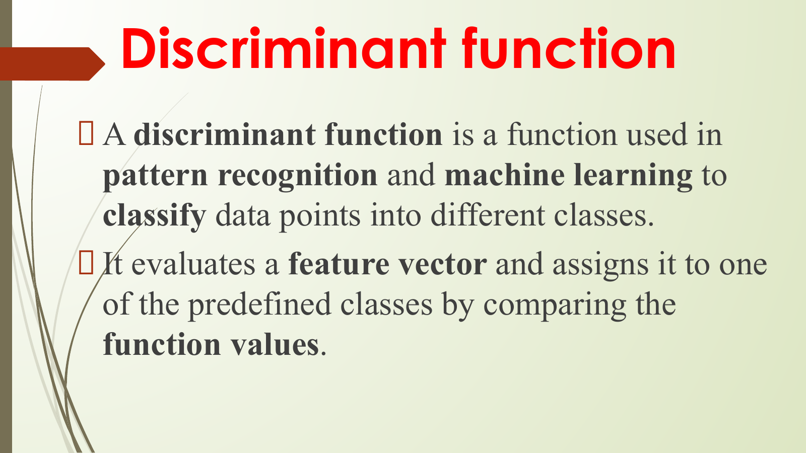

### Extracted Slide Text

- Discriminant function
- A discriminant function is a function used in
- pattern recognition and machine learning to
- classify data points into different classes.
- It evaluates a feature vector and assigns it to one
- of the predefined classes by comparing the
- function values.

### Page Description And Teaching Notes

Slide type: concept explanation slide.
Main idea: A discriminant function is a function used in pattern recognition and machine learning to classify data points into different classes. It evaluates a feature vector and assigns it to one of the predefined classes by comparing the function values.
This page explains a core concept in prose. The main task is to convert the definition into a clear statement of what the concept is, why it is used, and where it appears in a machine-learning workflow.
Detailed page understanding:
- `A discriminant function is a function used in` gives the definition-level meaning. Explain it first in simple words, then connect it to how a model learns from data.
- `pattern recognition and machine learning to` is a core visible point. Explain what it means, why it matters, and how it connects to the slide title.
- `classify data points into different classes.` is a core visible point. Explain what it means, why it matters, and how it connects to the slide title.
- `It evaluates a feature vector and assigns it to one` is a core visible point. Explain what it means, why it matters, and how it connects to the slide title.
- `of the predefined classes by comparing the` is a core visible point. Explain what it means, why it matters, and how it connects to the slide title.
- `function values.` is a core visible point. Explain what it means, why it matters, and how it connects to the slide title.
Important visible terms: Discriminant.
Visual/layout description: the embedded image preserves the actual slide. Describe the title area first, then read bullets, formulas, tables, arrows, grouped boxes, or diagrams in their visible order. If the slide contains a diagram, explain the relationship shown by arrows/positioning before explaining the text labels.
Teaching note: after reading the slide, ask the learner to restate the page in one or two sentences and give one example. For formula or metric slides, also ask what each variable or metric means and when it should be used.
Exam/viva note: prepare the slide title as a short-answer question, then use the bullets or visual labels as the expected answer points.

## Page 40: Unit III - Unsupervised Learning Page 40

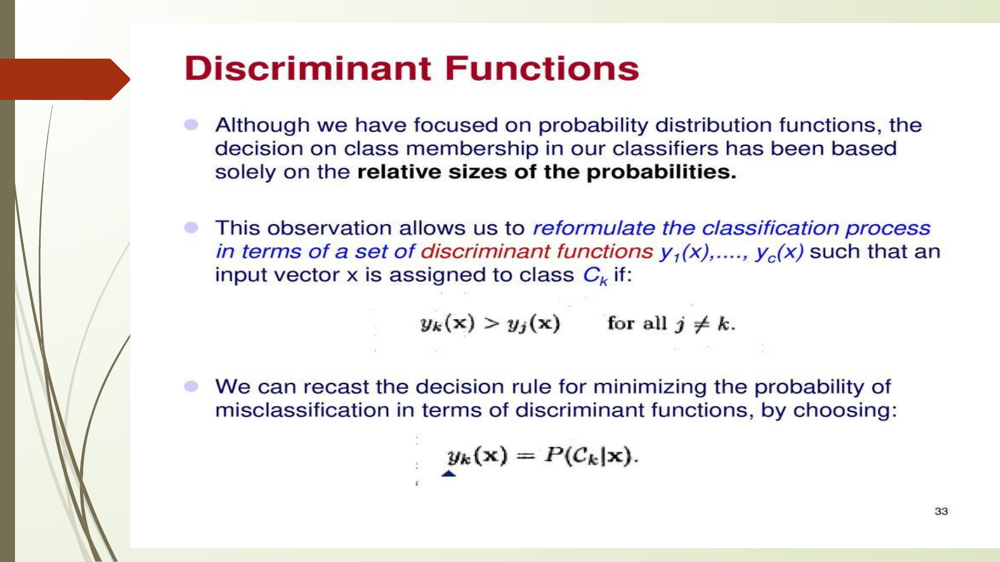

### Extracted Slide Text

- No selectable text extracted from this page.

### Page Description And Teaching Notes

Slide type: visual-only or image-heavy slide.
Main idea: the slide is visual-first, so the image should be treated as the source for the content and structure.
This page is primarily visual. The embedded slide image is the authoritative visual output; read it as a diagram or illustration first, then connect any visible labels to the surrounding pages.
- No reliable selectable text was extracted; use the slide image for the visible diagram, chart, or screenshot.
Visual/layout description: the embedded image preserves the actual slide. Describe the title area first, then read bullets, formulas, tables, arrows, grouped boxes, or diagrams in their visible order. If the slide contains a diagram, explain the relationship shown by arrows/positioning before explaining the text labels.
Teaching note: after reading the slide, ask the learner to restate the page in one or two sentences and give one example. For formula or metric slides, also ask what each variable or metric means and when it should be used.
Exam/viva note: prepare the slide title as a short-answer question, then use the bullets or visual labels as the expected answer points.

## Page 41: Unit III - Unsupervised Learning Page 41

### Extracted Slide Text

- No selectable text extracted from this page.

### Page Description And Teaching Notes

Slide type: visual-only or image-heavy slide.
Main idea: the slide is visual-first, so the image should be treated as the source for the content and structure.
This page is primarily visual. The embedded slide image is the authoritative visual output; read it as a diagram or illustration first, then connect any visible labels to the surrounding pages.
- No reliable selectable text was extracted; use the slide image for the visible diagram, chart, or screenshot.
Visual/layout description: the embedded image preserves the actual slide. Describe the title area first, then read bullets, formulas, tables, arrows, grouped boxes, or diagrams in their visible order. If the slide contains a diagram, explain the relationship shown by arrows/positioning before explaining the text labels.
Teaching note: after reading the slide, ask the learner to restate the page in one or two sentences and give one example. For formula or metric slides, also ask what each variable or metric means and when it should be used.
Exam/viva note: prepare the slide title as a short-answer question, then use the bullets or visual labels as the expected answer points.

## Page 42: Unit III - Unsupervised Learning Page 42

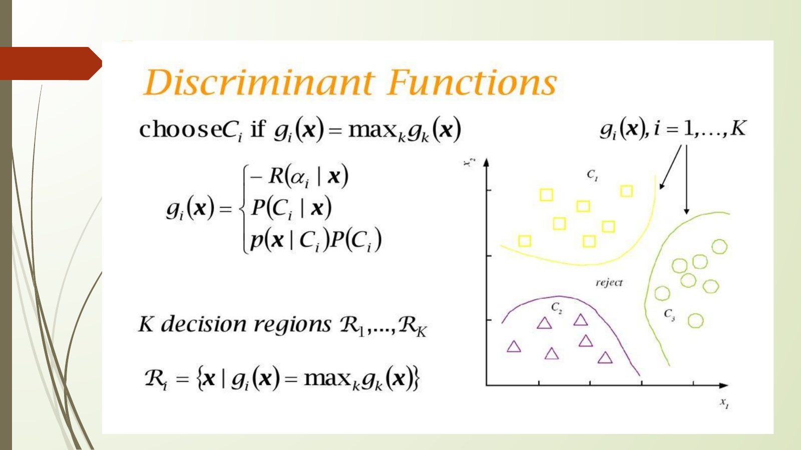

### Extracted Slide Text

- No selectable text extracted from this page.

### Page Description And Teaching Notes

Slide type: visual-only or image-heavy slide.
Main idea: the slide is visual-first, so the image should be treated as the source for the content and structure.
This page is primarily visual. The embedded slide image is the authoritative visual output; read it as a diagram or illustration first, then connect any visible labels to the surrounding pages.
- No reliable selectable text was extracted; use the slide image for the visible diagram, chart, or screenshot.
Visual/layout description: the embedded image preserves the actual slide. Describe the title area first, then read bullets, formulas, tables, arrows, grouped boxes, or diagrams in their visible order. If the slide contains a diagram, explain the relationship shown by arrows/positioning before explaining the text labels.
Teaching note: after reading the slide, ask the learner to restate the page in one or two sentences and give one example. For formula or metric slides, also ask what each variable or metric means and when it should be used.
Exam/viva note: prepare the slide title as a short-answer question, then use the bullets or visual labels as the expected answer points.

## Page 43: Why Use Discriminant

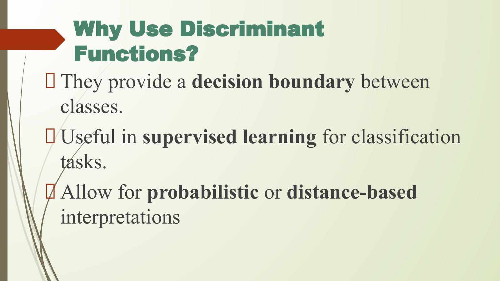

### Extracted Slide Text

- Why Use Discriminant
- Functions?
- They provide a decision boundary between
- classes.
- Useful in supervised learning for classification
- tasks.
- Allow for probabilistic or distance-based
- interpretations

### Page Description And Teaching Notes

Slide type: concept explanation slide.
Main idea: Functions? They provide a decision boundary between classes. Useful in supervised learning for classification tasks. Allow for probabilistic or distance-based.
This page explains a core concept in prose. The main task is to convert the definition into a clear statement of what the concept is, why it is used, and where it appears in a machine-learning workflow.
Detailed page understanding:
- `Functions?` is a core visible point. Explain what it means, why it matters, and how it connects to the slide title.
- `They provide a decision boundary between` is a core visible point. Explain what it means, why it matters, and how it connects to the slide title.
- `classes.` is a core visible point. Explain what it means, why it matters, and how it connects to the slide title.
- `Useful in supervised learning for classification` is an application/example point. Convert it into a concrete real-world case while teaching.
- `tasks.` is a core visible point. Explain what it means, why it matters, and how it connects to the slide title.
- `Allow for probabilistic or distance-based` is a core visible point. Explain what it means, why it matters, and how it connects to the slide title.
- `interpretations` is a core visible point. Explain what it means, why it matters, and how it connects to the slide title.
Important visible terms: Why Use Discriminant Functions, They, Useful, Allow.
Visual/layout description: the embedded image preserves the actual slide. Describe the title area first, then read bullets, formulas, tables, arrows, grouped boxes, or diagrams in their visible order. If the slide contains a diagram, explain the relationship shown by arrows/positioning before explaining the text labels.
Teaching note: after reading the slide, ask the learner to restate the page in one or two sentences and give one example. For formula or metric slides, also ask what each variable or metric means and when it should be used.
Exam/viva note: prepare the slide title as a short-answer question, then use the bullets or visual labels as the expected answer points.

## Page 44: Types of Discriminant

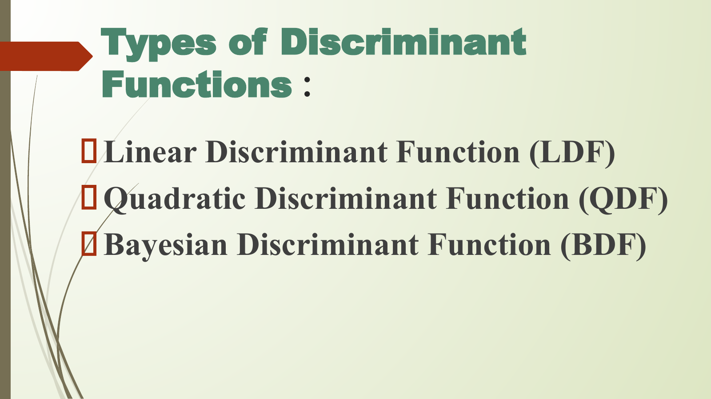

### Extracted Slide Text

- Types of Discriminant
- Functions :
- Linear Discriminant Function (LDF)
- Quadratic Discriminant Function (QDF)
- Bayesian Discriminant Function (BDF)

### Page Description And Teaching Notes

Slide type: concept explanation slide.
Main idea: Functions : Linear Discriminant Function (LDF) Quadratic Discriminant Function (QDF) Bayesian Discriminant Function (BDF).
This page explains a core concept in prose. The main task is to convert the definition into a clear statement of what the concept is, why it is used, and where it appears in a machine-learning workflow.
Detailed page understanding:
- `Functions :` is a core visible point. Explain what it means, why it matters, and how it connects to the slide title.
- `Linear Discriminant Function (LDF)` is a core visible point. Explain what it means, why it matters, and how it connects to the slide title.
- `Quadratic Discriminant Function (QDF)` is a core visible point. Explain what it means, why it matters, and how it connects to the slide title.
- `Bayesian Discriminant Function (BDF)` is a core visible point. Explain what it means, why it matters, and how it connects to the slide title.
Important visible terms: Types, Discriminant Functions, Linear Discriminant Function, LDF, Quadratic Discriminant Function, QDF, Bayesian Discriminant Function, BDF.
Visual/layout description: the embedded image preserves the actual slide. Describe the title area first, then read bullets, formulas, tables, arrows, grouped boxes, or diagrams in their visible order. If the slide contains a diagram, explain the relationship shown by arrows/positioning before explaining the text labels.
Teaching note: after reading the slide, ask the learner to restate the page in one or two sentences and give one example. For formula or metric slides, also ask what each variable or metric means and when it should be used.
Exam/viva note: prepare the slide title as a short-answer question, then use the bullets or visual labels as the expected answer points.

## Page 45: Applications Of

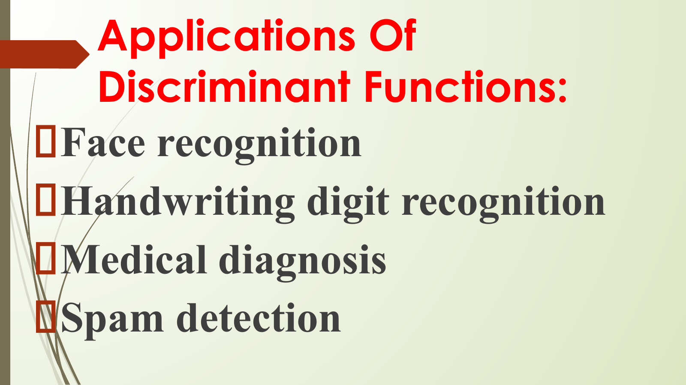

### Extracted Slide Text

- Applications Of
- Discriminant Functions:
- Face recognition
- Handwriting digit recognition
- Medical diagnosis
- Spam detection

### Page Description And Teaching Notes

Slide type: concept explanation slide.
Main idea: Discriminant Functions: Face recognition Handwriting digit recognition Medical diagnosis Spam detection.
This page explains a core concept in prose. The main task is to convert the definition into a clear statement of what the concept is, why it is used, and where it appears in a machine-learning workflow.
Detailed page understanding:
- `Discriminant Functions:` is a core visible point. Explain what it means, why it matters, and how it connects to the slide title.
- `Face recognition` is a core visible point. Explain what it means, why it matters, and how it connects to the slide title.
- `Handwriting digit recognition` is a core visible point. Explain what it means, why it matters, and how it connects to the slide title.
- `Medical diagnosis` is a core visible point. Explain what it means, why it matters, and how it connects to the slide title.
- `Spam detection` is a core visible point. Explain what it means, why it matters, and how it connects to the slide title.
Important visible terms: Applications Of Discriminant Functions, Face, Handwriting, Medical, Spam.
Visual/layout description: the embedded image preserves the actual slide. Describe the title area first, then read bullets, formulas, tables, arrows, grouped boxes, or diagrams in their visible order. If the slide contains a diagram, explain the relationship shown by arrows/positioning before explaining the text labels.
Teaching note: after reading the slide, ask the learner to restate the page in one or two sentences and give one example. For formula or metric slides, also ask what each variable or metric means and when it should be used.
Exam/viva note: prepare the slide title as a short-answer question, then use the bullets or visual labels as the expected answer points.

## Page 46: Linear Discriminant Function:

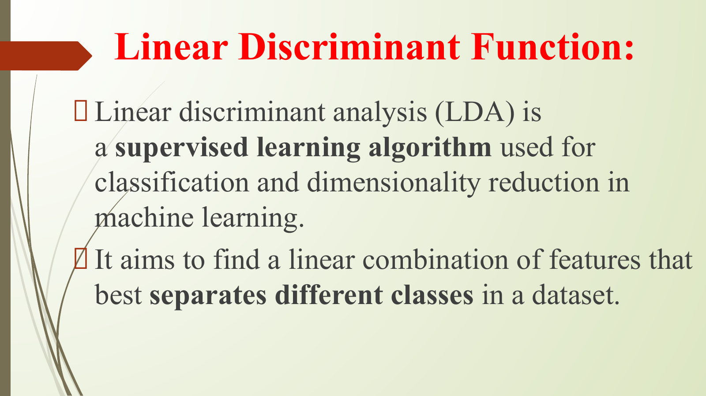

### Extracted Slide Text

- Linear Discriminant Function:
- Linear discriminant analysis (LDA) is
- a supervised learning algorithm used for
- classification and dimensionality reduction in
- machine learning.
- It aims to find a linear combination of features that
- best separates different classes in a dataset.

### Page Description And Teaching Notes

Slide type: concept explanation slide.
Main idea: Linear discriminant analysis (LDA) is a supervised learning algorithm used for classification and dimensionality reduction in machine learning. It aims to find a linear combination of features that best separates different classes in a dataset.
This page explains a core concept in prose. The main task is to convert the definition into a clear statement of what the concept is, why it is used, and where it appears in a machine-learning workflow.
Detailed page understanding:
- `Linear discriminant analysis (LDA) is` is a core visible point. Explain what it means, why it matters, and how it connects to the slide title.
- `a supervised learning algorithm used for` is an application/example point. Convert it into a concrete real-world case while teaching.
- `classification and dimensionality reduction in` is a core visible point. Explain what it means, why it matters, and how it connects to the slide title.
- `machine learning.` is a core visible point. Explain what it means, why it matters, and how it connects to the slide title.
- `It aims to find a linear combination of features that` is a core visible point. Explain what it means, why it matters, and how it connects to the slide title.
- `best separates different classes in a dataset.` is a core visible point. Explain what it means, why it matters, and how it connects to the slide title.
Important visible terms: Linear Discriminant Function, Linear, LDA.
Visual/layout description: the embedded image preserves the actual slide. Describe the title area first, then read bullets, formulas, tables, arrows, grouped boxes, or diagrams in their visible order. If the slide contains a diagram, explain the relationship shown by arrows/positioning before explaining the text labels.
Teaching note: after reading the slide, ask the learner to restate the page in one or two sentences and give one example. For formula or metric slides, also ask what each variable or metric means and when it should be used.
Exam/viva note: prepare the slide title as a short-answer question, then use the bullets or visual labels as the expected answer points.

## Page 47: +

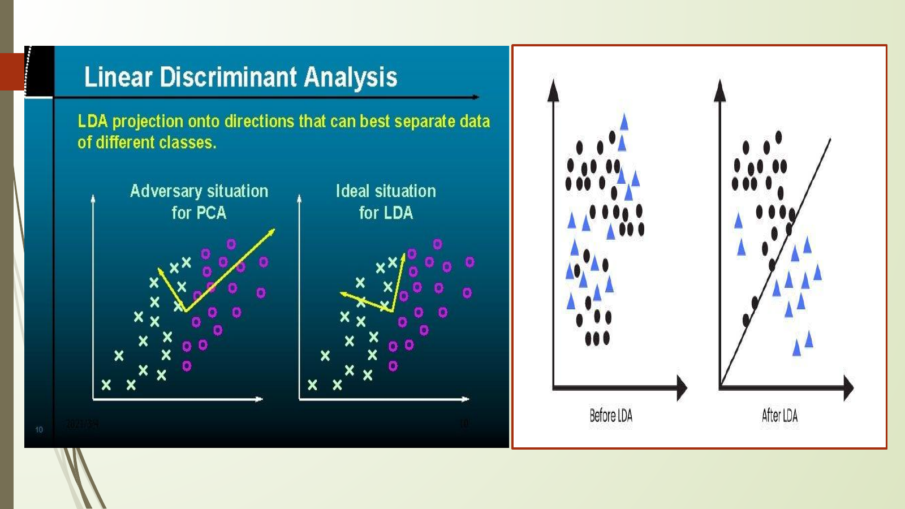

### Extracted Slide Text

- +

### Page Description And Teaching Notes

Slide type: title or transition slide.
Main idea: the slide is visual-first, so the image should be treated as the source for the content and structure.
This page sets the context for the next topic. Treat it as a section marker: it tells the learner what concept or unit is starting before the deck moves into definitions, examples, or formulas.
- No reliable selectable text was extracted; use the slide image for the visible diagram, chart, or screenshot.
Visual/layout description: the embedded image preserves the actual slide. Describe the title area first, then read bullets, formulas, tables, arrows, grouped boxes, or diagrams in their visible order. If the slide contains a diagram, explain the relationship shown by arrows/positioning before explaining the text labels.
Teaching note: after reading the slide, ask the learner to restate the page in one or two sentences and give one example. For formula or metric slides, also ask what each variable or metric means and when it should be used.
Exam/viva note: prepare the slide title as a short-answer question, then use the bullets or visual labels as the expected answer points.

## Page 48: Unit III - Unsupervised Learning Page 48

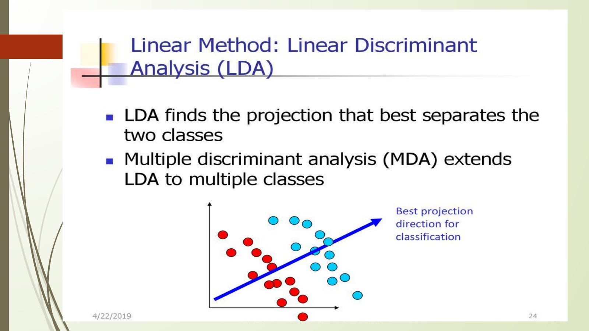

### Extracted Slide Text

- No selectable text extracted from this page.

### Page Description And Teaching Notes

Slide type: visual-only or image-heavy slide.
Main idea: the slide is visual-first, so the image should be treated as the source for the content and structure.
This page is primarily visual. The embedded slide image is the authoritative visual output; read it as a diagram or illustration first, then connect any visible labels to the surrounding pages.
- No reliable selectable text was extracted; use the slide image for the visible diagram, chart, or screenshot.
Visual/layout description: the embedded image preserves the actual slide. Describe the title area first, then read bullets, formulas, tables, arrows, grouped boxes, or diagrams in their visible order. If the slide contains a diagram, explain the relationship shown by arrows/positioning before explaining the text labels.
Teaching note: after reading the slide, ask the learner to restate the page in one or two sentences and give one example. For formula or metric slides, also ask what each variable or metric means and when it should be used.
Exam/viva note: prepare the slide title as a short-answer question, then use the bullets or visual labels as the expected answer points.

## Page 49: Hypothesis Space

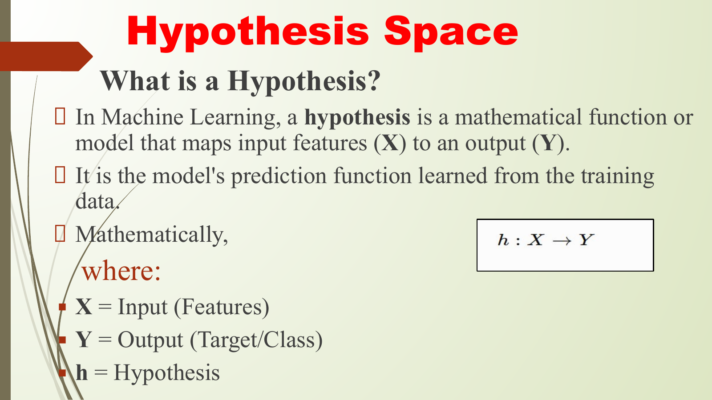

### Extracted Slide Text

- Hypothesis Space
- What is a Hypothesis?
- In Machine Learning, a hypothesis is a mathematical function or
- model that maps input features (X) to an output (Y).
- It is the model's prediction function learned from the training
- data.
- Mathematically,
- where:
- ▪ X = Input (Features)
- ▪ Y = Output (Target/Class)
- ▪ h = Hypothesis

### Page Description And Teaching Notes

Slide type: formula or calculation slide.
Main idea: What is a Hypothesis? In Machine Learning, a hypothesis is a mathematical function or model that maps input features (X) to an output (Y). It is the model's prediction function learned from the training data. Mathematically,.
This page should be read carefully because it introduces a calculation, objective, or optimization idea. Identify the variables in the formula, what quantity is being minimized or measured, and how the equation supports model training or evaluation.
Detailed page understanding:
- `What is a Hypothesis?` gives the definition-level meaning. Explain it first in simple words, then connect it to how a model learns from data.
- `In Machine Learning, a hypothesis is a mathematical function or` gives the definition-level meaning. Explain it first in simple words, then connect it to how a model learns from data.
- `model that maps input features (X) to an output (Y).` is a core visible point. Explain what it means, why it matters, and how it connects to the slide title.
- `It is the model's prediction function learned from the training` is a core visible point. Explain what it means, why it matters, and how it connects to the slide title.
- `data.` is a core visible point. Explain what it means, why it matters, and how it connects to the slide title.
- `Mathematically,` is a core visible point. Explain what it means, why it matters, and how it connects to the slide title.
- `where:` is a core visible point. Explain what it means, why it matters, and how it connects to the slide title.
- `▪ X = Input (Features)` is one item in the slide's list. Treat it as a separate subtopic and prepare a one-line explanation for it.
- `▪ Y = Output (Target/Class)` is one item in the slide's list. Treat it as a separate subtopic and prepare a one-line explanation for it.
- `▪ h = Hypothesis` is one item in the slide's list. Treat it as a separate subtopic and prepare a one-line explanation for it.
Important visible terms: Hypothesis Space What, Hypothesis, In Machine Learning, Mathematically, Input, Features, Output, Target/Class.
Visual/layout description: the embedded image preserves the actual slide. Describe the title area first, then read bullets, formulas, tables, arrows, grouped boxes, or diagrams in their visible order. If the slide contains a diagram, explain the relationship shown by arrows/positioning before explaining the text labels.
Teaching note: after reading the slide, ask the learner to restate the page in one or two sentences and give one example. For formula or metric slides, also ask what each variable or metric means and when it should be used.
Exam/viva note: prepare the slide title as a short-answer question, then use the bullets or visual labels as the expected answer points.

## Page 50: Example:

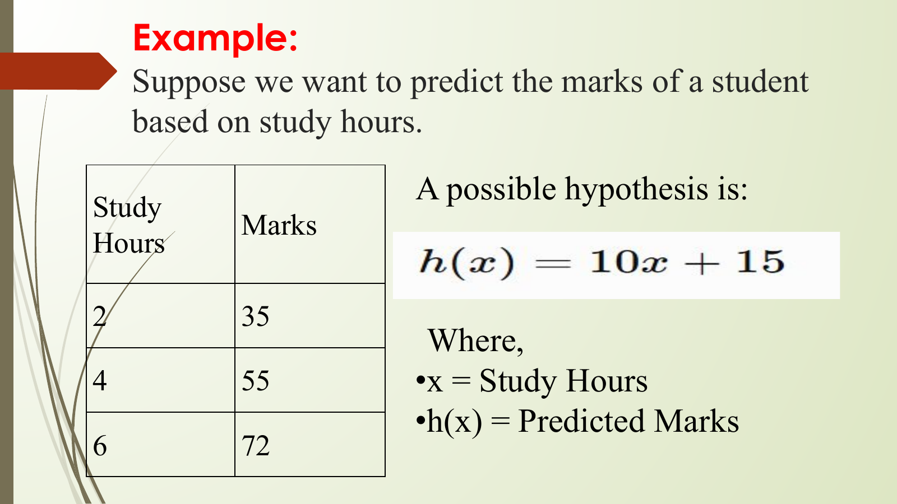

### Extracted Slide Text

- Example:
- Suppose we want to predict the marks of a student
- based on study hours.
- A possible hypothesis is:
- Study
- Marks
- Hours
- 2 35
- Where,
- 4 55 •x = Study Hours
- •h(x) = Predicted Marks
- 6 72

### Page Description And Teaching Notes

Slide type: formula or calculation slide.
Main idea: Suppose we want to predict the marks of a student based on study hours. A possible hypothesis is: Study Marks Hours.
This page should be read carefully because it introduces a calculation, objective, or optimization idea. Identify the variables in the formula, what quantity is being minimized or measured, and how the equation supports model training or evaluation.
Detailed page understanding:
- `Suppose we want to predict the marks of a student` is a core visible point. Explain what it means, why it matters, and how it connects to the slide title.
- `based on study hours.` is a core visible point. Explain what it means, why it matters, and how it connects to the slide title.
- `A possible hypothesis is:` is a core visible point. Explain what it means, why it matters, and how it connects to the slide title.
- `Study` is a core visible point. Explain what it means, why it matters, and how it connects to the slide title.
- `Marks` is a core visible point. Explain what it means, why it matters, and how it connects to the slide title.
- `Hours` is a core visible point. Explain what it means, why it matters, and how it connects to the slide title.
- `2 35` is a core visible point. Explain what it means, why it matters, and how it connects to the slide title.
- `Where,` is a core visible point. Explain what it means, why it matters, and how it connects to the slide title.
- Additional bullets continue on the slide; use the extracted text list above for the complete wording.
- `6 72` is a core visible point. Explain what it means, why it matters, and how it connects to the slide title.
Important visible terms: Example, Suppose, Study Marks Hours, Where, Study Hours, Predicted Marks.
Visual/layout description: the embedded image preserves the actual slide. Describe the title area first, then read bullets, formulas, tables, arrows, grouped boxes, or diagrams in their visible order. If the slide contains a diagram, explain the relationship shown by arrows/positioning before explaining the text labels.
Teaching note: after reading the slide, ask the learner to restate the page in one or two sentences and give one example. For formula or metric slides, also ask what each variable or metric means and when it should be used.
Exam/viva note: prepare the slide title as a short-answer question, then use the bullets or visual labels as the expected answer points.

## Page 51: What is Hypothesis Space?

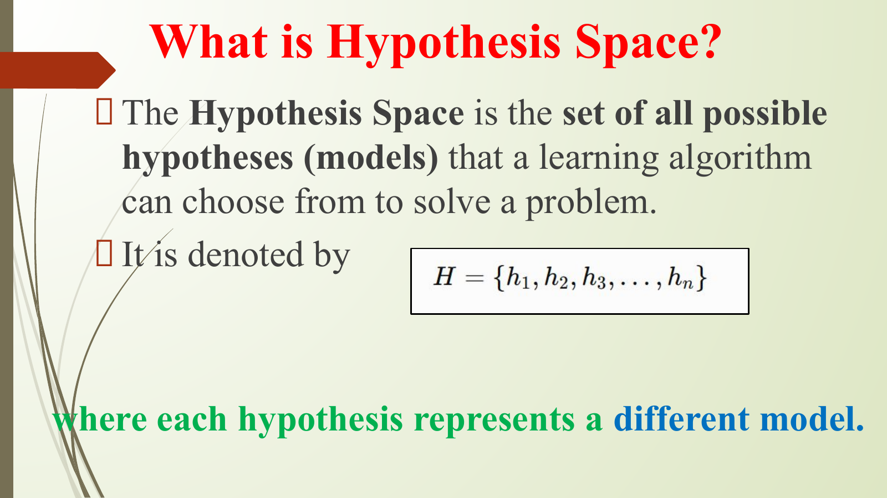

### Extracted Slide Text

- What is Hypothesis Space?
- The Hypothesis Space is the set of all possible
- hypotheses (models) that a learning algorithm
- can choose from to solve a problem.
- It is denoted by
- where each hypothesis represents a different model.

### Page Description And Teaching Notes

Slide type: concept explanation slide.
Main idea: The Hypothesis Space is the set of all possible hypotheses (models) that a learning algorithm can choose from to solve a problem. It is denoted by where each hypothesis represents a different model.
This page explains a core concept in prose. The main task is to convert the definition into a clear statement of what the concept is, why it is used, and where it appears in a machine-learning workflow.
Detailed page understanding:
- `The Hypothesis Space is the set of all possible` is a core visible point. Explain what it means, why it matters, and how it connects to the slide title.
- `hypotheses (models) that a learning algorithm` is a core visible point. Explain what it means, why it matters, and how it connects to the slide title.
- `can choose from to solve a problem.` is a limitation or risk. Mention when the method may fail and what alternative or precaution can reduce the issue.
- `It is denoted by` is a core visible point. Explain what it means, why it matters, and how it connects to the slide title.
- `where each hypothesis represents a different model.` is a core visible point. Explain what it means, why it matters, and how it connects to the slide title.
Important visible terms: What, Hypothesis Space, The Hypothesis Space.
Visual/layout description: the embedded image preserves the actual slide. Describe the title area first, then read bullets, formulas, tables, arrows, grouped boxes, or diagrams in their visible order. If the slide contains a diagram, explain the relationship shown by arrows/positioning before explaining the text labels.
Teaching note: after reading the slide, ask the learner to restate the page in one or two sentences and give one example. For formula or metric slides, also ask what each variable or metric means and when it should be used.
Exam/viva note: prepare the slide title as a short-answer question, then use the bullets or visual labels as the expected answer points.

## Page 52: Hypothesis Space is the collection of all candidate functions that

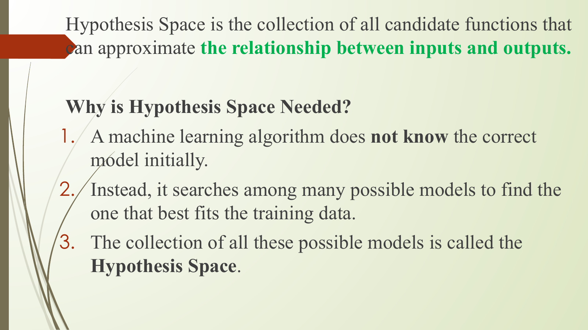

### Extracted Slide Text

- Hypothesis Space is the collection of all candidate functions that
- can approximate the relationship between inputs and outputs.
- Why is Hypothesis Space Needed?
- 1. A machine learning algorithm does not know the correct
- model initially.
- 2. Instead, it searches among many possible models to find the
- one that best fits the training data.
- 3. The collection of all these possible models is called the
- Hypothesis Space.

### Page Description And Teaching Notes

Slide type: bullet explanation slide.
Main idea: can approximate the relationship between inputs and outputs. Why is Hypothesis Space Needed? 1. A machine learning algorithm does not know the correct model initially. 2. Instead, it searches among many possible models to find the one that best fits the training data.
This page breaks the topic into separate points. Each bullet should be treated as a distinct exam or viva talking point, with the learner able to define it and give a small example.
Detailed page understanding:
- `can approximate the relationship between inputs and outputs.` is a core visible point. Explain what it means, why it matters, and how it connects to the slide title.
- `Why is Hypothesis Space Needed?` is a core visible point. Explain what it means, why it matters, and how it connects to the slide title.
- `1. A machine learning algorithm does not know the correct` is one item in the slide's list. Treat it as a separate subtopic and prepare a one-line explanation for it.
- `model initially.` is a core visible point. Explain what it means, why it matters, and how it connects to the slide title.
- `2. Instead, it searches among many possible models to find the` is one item in the slide's list. Treat it as a separate subtopic and prepare a one-line explanation for it.
- `one that best fits the training data.` is a core visible point. Explain what it means, why it matters, and how it connects to the slide title.
- `3. The collection of all these possible models is called the` is one item in the slide's list. Treat it as a separate subtopic and prepare a one-line explanation for it.
- `Hypothesis Space.` is a core visible point. Explain what it means, why it matters, and how it connects to the slide title.
Important visible terms: Hypothesis Space, Why, Hypothesis Space Needed, Instead, The.
Visual/layout description: the embedded image preserves the actual slide. Describe the title area first, then read bullets, formulas, tables, arrows, grouped boxes, or diagrams in their visible order. If the slide contains a diagram, explain the relationship shown by arrows/positioning before explaining the text labels.
Teaching note: after reading the slide, ask the learner to restate the page in one or two sentences and give one example. For formula or metric slides, also ask what each variable or metric means and when it should be used.
Exam/viva note: prepare the slide title as a short-answer question, then use the bullets or visual labels as the expected answer points.

## Page 53: Real-Life Analogy

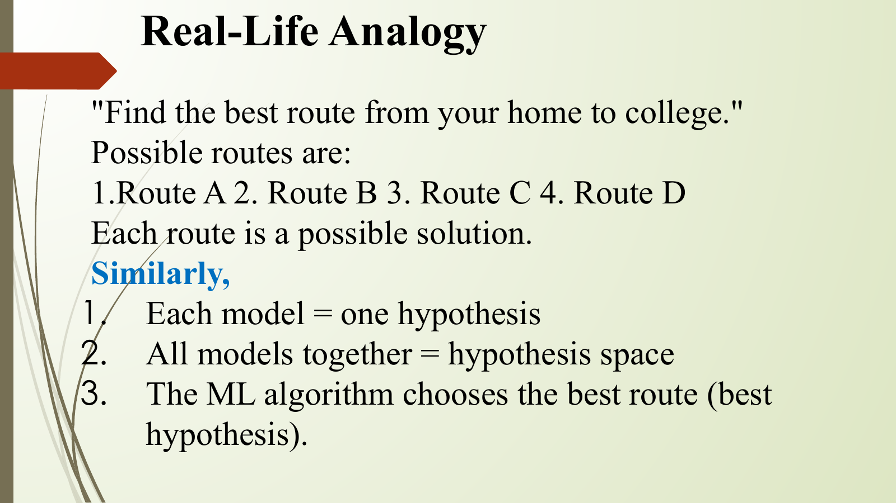

### Extracted Slide Text

- Real-Life Analogy
- "Find the best route from your home to college."
- Possible routes are:
- 1.Route A 2. Route B 3. Route C 4. Route D
- Each route is a possible solution.
- Similarly,
- 1. Each model = one hypothesis
- 2. All models together = hypothesis space
- 3. The ML algorithm chooses the best route (best
- hypothesis).

### Page Description And Teaching Notes

Slide type: formula or calculation slide.
Main idea: "Find the best route from your home to college." Possible routes are: 1.Route A 2. Route B 3. Route C 4. Route D Each route is a possible solution. Similarly, 1. Each model = one hypothesis.
This page should be read carefully because it introduces a calculation, objective, or optimization idea. Identify the variables in the formula, what quantity is being minimized or measured, and how the equation supports model training or evaluation.
Detailed page understanding:
- `"Find the best route from your home to college."` is a core visible point. Explain what it means, why it matters, and how it connects to the slide title.
- `Possible routes are:` is a core visible point. Explain what it means, why it matters, and how it connects to the slide title.
- `1.Route A 2. Route B 3. Route C 4. Route D` is one item in the slide's list. Treat it as a separate subtopic and prepare a one-line explanation for it.
- `Each route is a possible solution.` gives the definition-level meaning. Explain it first in simple words, then connect it to how a model learns from data.
- `Similarly,` is a core visible point. Explain what it means, why it matters, and how it connects to the slide title.
- `1. Each model = one hypothesis` is one item in the slide's list. Treat it as a separate subtopic and prepare a one-line explanation for it.
- `2. All models together = hypothesis space` is one item in the slide's list. Treat it as a separate subtopic and prepare a one-line explanation for it.
- `3. The ML algorithm chooses the best route (best` is one item in the slide's list. Treat it as a separate subtopic and prepare a one-line explanation for it.
- `hypothesis).` is a core visible point. Explain what it means, why it matters, and how it connects to the slide title.
Important visible terms: Real-Life Analogy, Find, Possible, Route A, Route B, Route C, Route D Each, Similarly.
Visual/layout description: the embedded image preserves the actual slide. Describe the title area first, then read bullets, formulas, tables, arrows, grouped boxes, or diagrams in their visible order. If the slide contains a diagram, explain the relationship shown by arrows/positioning before explaining the text labels.
Teaching note: after reading the slide, ask the learner to restate the page in one or two sentences and give one example. For formula or metric slides, also ask what each variable or metric means and when it should be used.
Exam/viva note: prepare the slide title as a short-answer question, then use the bullets or visual labels as the expected answer points.

## Page 54: Example of Hypothesis Space

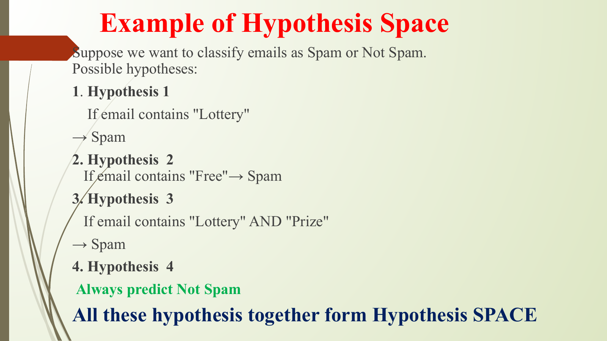

### Extracted Slide Text

- Example of Hypothesis Space
- Suppose we want to classify emails as Spam or Not Spam.
- Possible hypotheses:
- 1. Hypothesis 1
- If email contains "Lottery"
- → Spam
- 2. Hypothesis 2
- If email contains "Free"→ Spam
- 3. Hypothesis 3
- If email contains "Lottery" AND "Prize"
- → Spam
- 4. Hypothesis 4
- Always predict Not Spam
- All these hypothesis together form Hypothesis SPACE

### Page Description And Teaching Notes

Slide type: bullet explanation slide.
Main idea: Suppose we want to classify emails as Spam or Not Spam. Possible hypotheses: 1. Hypothesis 1 If email contains "Lottery" → Spam 2. Hypothesis 2.
This page breaks the topic into separate points. Each bullet should be treated as a distinct exam or viva talking point, with the learner able to define it and give a small example.
Detailed page understanding:
- `Suppose we want to classify emails as Spam or Not Spam.` is a core visible point. Explain what it means, why it matters, and how it connects to the slide title.
- `Possible hypotheses:` is a core visible point. Explain what it means, why it matters, and how it connects to the slide title.
- `1. Hypothesis 1` is one item in the slide's list. Treat it as a separate subtopic and prepare a one-line explanation for it.
- `If email contains "Lottery"` is a core visible point. Explain what it means, why it matters, and how it connects to the slide title.
- `→ Spam` is a core visible point. Explain what it means, why it matters, and how it connects to the slide title.
- `2. Hypothesis 2` is one item in the slide's list. Treat it as a separate subtopic and prepare a one-line explanation for it.
- `If email contains "Free"→ Spam` is a core visible point. Explain what it means, why it matters, and how it connects to the slide title.
- `3. Hypothesis 3` is one item in the slide's list. Treat it as a separate subtopic and prepare a one-line explanation for it.
- Additional bullets continue on the slide; use the extracted text list above for the complete wording.
- `All these hypothesis together form Hypothesis SPACE` is a core visible point. Explain what it means, why it matters, and how it connects to the slide title.
Important visible terms: Example, Hypothesis Space Suppose, Spam, Not Spam, Possible, Hypothesis, Lottery, Free.
Visual/layout description: the embedded image preserves the actual slide. Describe the title area first, then read bullets, formulas, tables, arrows, grouped boxes, or diagrams in their visible order. If the slide contains a diagram, explain the relationship shown by arrows/positioning before explaining the text labels.
Teaching note: after reading the slide, ask the learner to restate the page in one or two sentences and give one example. For formula or metric slides, also ask what each variable or metric means and when it should be used.
Exam/viva note: prepare the slide title as a short-answer question, then use the bullets or visual labels as the expected answer points.

## Page 55: Mathematical Representation

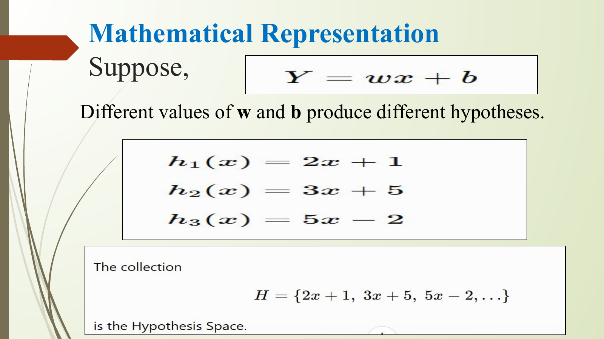

### Extracted Slide Text

- Mathematical Representation
- Suppose,
- Different values of w and b produce different hypotheses.

### Page Description And Teaching Notes

Slide type: title or transition slide.
Main idea: Suppose, Different values of w and b produce different hypotheses.
This page sets the context for the next topic. Treat it as a section marker: it tells the learner what concept or unit is starting before the deck moves into definitions, examples, or formulas.
Detailed page understanding:
- `Suppose,` is a core visible point. Explain what it means, why it matters, and how it connects to the slide title.
- `Different values of w and b produce different hypotheses.` is a core visible point. Explain what it means, why it matters, and how it connects to the slide title.
Important visible terms: Mathematical Representation Suppose, Different.
Visual/layout description: the embedded image preserves the actual slide. Describe the title area first, then read bullets, formulas, tables, arrows, grouped boxes, or diagrams in their visible order. If the slide contains a diagram, explain the relationship shown by arrows/positioning before explaining the text labels.
Teaching note: after reading the slide, ask the learner to restate the page in one or two sentences and give one example. For formula or metric slides, also ask what each variable or metric means and when it should be used.
Exam/viva note: prepare the slide title as a short-answer question, then use the bullets or visual labels as the expected answer points.

## Page 56: VC Dimension

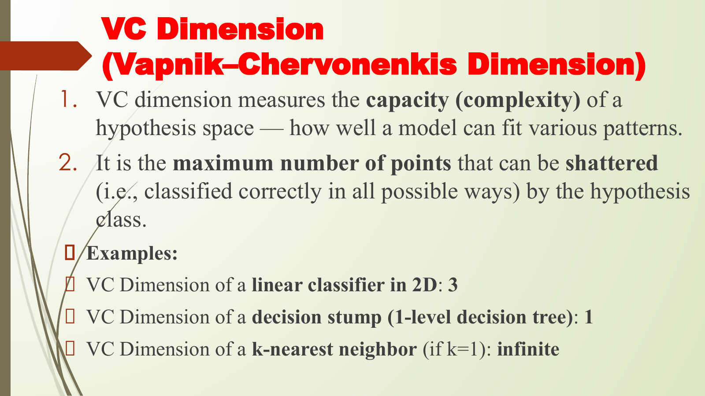

### Extracted Slide Text

- VC Dimension
- (Vapnik–Chervonenkis Dimension)
- 1. VC dimension measures the capacity (complexity) of a
- hypothesis space — how well a model can fit various patterns.
- 2. It is the maximum number of points that can be shattered
- (i.e., classified correctly in all possible ways) by the hypothesis
- class.
- Examples:
- VC Dimension of a linear classifier in 2D: 3
- VC Dimension of a decision stump (1-level decision tree): 1
- VC Dimension of a k-nearest neighbor (if k=1): infinite

### Page Description And Teaching Notes

Slide type: formula or calculation slide.
Main idea: (Vapnik–Chervonenkis Dimension) 1. VC dimension measures the capacity (complexity) of a hypothesis space — how well a model can fit various patterns. 2. It is the maximum number of points that can be shattered (i.e., classified correctly in all possible ways) by the hypothesis class.
This page should be read carefully because it introduces a calculation, objective, or optimization idea. Identify the variables in the formula, what quantity is being minimized or measured, and how the equation supports model training or evaluation.
Detailed page understanding:
- `(Vapnik–Chervonenkis Dimension)` is a core visible point. Explain what it means, why it matters, and how it connects to the slide title.
- `1. VC dimension measures the capacity (complexity) of a` is one item in the slide's list. Treat it as a separate subtopic and prepare a one-line explanation for it.
- `hypothesis space — how well a model can fit various patterns.` is a core visible point. Explain what it means, why it matters, and how it connects to the slide title.
- `2. It is the maximum number of points that can be shattered` is one item in the slide's list. Treat it as a separate subtopic and prepare a one-line explanation for it.
- `(i.e., classified correctly in all possible ways) by the hypothesis` is a core visible point. Explain what it means, why it matters, and how it connects to the slide title.
- `class.` is a core visible point. Explain what it means, why it matters, and how it connects to the slide title.
- `Examples:` is an application/example point. Convert it into a concrete real-world case while teaching.
- `VC Dimension of a linear classifier in 2D: 3` is a core visible point. Explain what it means, why it matters, and how it connects to the slide title.
- `VC Dimension of a decision stump (1-level decision tree): 1` is a core visible point. Explain what it means, why it matters, and how it connects to the slide title.
- `VC Dimension of a k-nearest neighbor (if k=1): infinite` is a core visible point. Explain what it means, why it matters, and how it connects to the slide title.
Important visible terms: VC Dimension, Vapnik, Chervonenkis Dimension, Examples.
Visual/layout description: the embedded image preserves the actual slide. Describe the title area first, then read bullets, formulas, tables, arrows, grouped boxes, or diagrams in their visible order. If the slide contains a diagram, explain the relationship shown by arrows/positioning before explaining the text labels.
Teaching note: after reading the slide, ask the learner to restate the page in one or two sentences and give one example. For formula or metric slides, also ask what each variable or metric means and when it should be used.
Exam/viva note: prepare the slide title as a short-answer question, then use the bullets or visual labels as the expected answer points.

## Page 57: VC Dimension

### Extracted Slide Text

- VC Dimension

### Page Description And Teaching Notes

Slide type: title or transition slide.
Main idea: the slide is visual-first, so the image should be treated as the source for the content and structure.
This page sets the context for the next topic. Treat it as a section marker: it tells the learner what concept or unit is starting before the deck moves into definitions, examples, or formulas.
- No reliable selectable text was extracted; use the slide image for the visible diagram, chart, or screenshot.
Important visible terms: VC Dimension.
Progressive reveal note: this page appears to continue the same slide state as the previous page, so compare the embedded images for the exact visual change.
Visual/layout description: the embedded image preserves the actual slide. Describe the title area first, then read bullets, formulas, tables, arrows, grouped boxes, or diagrams in their visible order. If the slide contains a diagram, explain the relationship shown by arrows/positioning before explaining the text labels.
Teaching note: after reading the slide, ask the learner to restate the page in one or two sentences and give one example. For formula or metric slides, also ask what each variable or metric means and when it should be used.
Exam/viva note: prepare the slide title as a short-answer question, then use the bullets or visual labels as the expected answer points.

## Page 58: Unit III - Unsupervised Learning Page 58

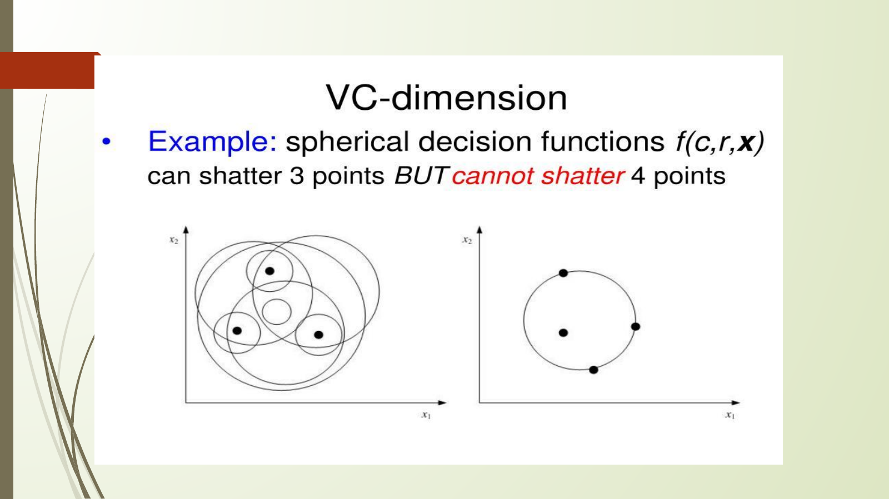

### Extracted Slide Text

- No selectable text extracted from this page.

### Page Description And Teaching Notes

Slide type: visual-only or image-heavy slide.
Main idea: the slide is visual-first, so the image should be treated as the source for the content and structure.
This page is primarily visual. The embedded slide image is the authoritative visual output; read it as a diagram or illustration first, then connect any visible labels to the surrounding pages.
- No reliable selectable text was extracted; use the slide image for the visible diagram, chart, or screenshot.
Visual/layout description: the embedded image preserves the actual slide. Describe the title area first, then read bullets, formulas, tables, arrows, grouped boxes, or diagrams in their visible order. If the slide contains a diagram, explain the relationship shown by arrows/positioning before explaining the text labels.
Teaching note: after reading the slide, ask the learner to restate the page in one or two sentences and give one example. For formula or metric slides, also ask what each variable or metric means and when it should be used.
Exam/viva note: prepare the slide title as a short-answer question, then use the bullets or visual labels as the expected answer points.

## Page 59: The Vapnik-Chervonenkis (VC) dimension is a measure of the

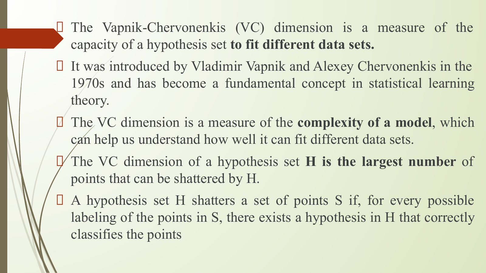

### Extracted Slide Text

- The Vapnik-Chervonenkis (VC) dimension is a measure of the
- capacity of a hypothesis set to fit different data sets.
- It was introduced by Vladimir Vapnik and Alexey Chervonenkis in the
- 1970s and has become a fundamental concept in statistical learning
- theory.
- The VC dimension is a measure of the complexity of a model, which
- can help us understand how well it can fit different data sets.
- The VC dimension of a hypothesis set H is the largest number of
- points that can be shattered by H.
- A hypothesis set H shatters a set of points S if, for every possible
- labeling of the points in S, there exists a hypothesis in H that correctly
- classifies the points

### Page Description And Teaching Notes

Slide type: concept explanation slide.
Main idea: capacity of a hypothesis set to fit different data sets. It was introduced by Vladimir Vapnik and Alexey Chervonenkis in the 1970s and has become a fundamental concept in statistical learning theory. The VC dimension is a measure of the complexity of a model, which can help us understand how well it can fit different data sets.
This page explains a core concept in prose. The main task is to convert the definition into a clear statement of what the concept is, why it is used, and where it appears in a machine-learning workflow.
Detailed page understanding:
- `capacity of a hypothesis set to fit different data sets.` is a core visible point. Explain what it means, why it matters, and how it connects to the slide title.
- `It was introduced by Vladimir Vapnik and Alexey Chervonenkis in the` is a core visible point. Explain what it means, why it matters, and how it connects to the slide title.
- `1970s and has become a fundamental concept in statistical learning` is a core visible point. Explain what it means, why it matters, and how it connects to the slide title.
- `theory.` is a core visible point. Explain what it means, why it matters, and how it connects to the slide title.
- `The VC dimension is a measure of the complexity of a model, which` gives the definition-level meaning. Explain it first in simple words, then connect it to how a model learns from data.
- `can help us understand how well it can fit different data sets.` is a core visible point. Explain what it means, why it matters, and how it connects to the slide title.
- `The VC dimension of a hypothesis set H is the largest number of` is a core visible point. Explain what it means, why it matters, and how it connects to the slide title.
- `points that can be shattered by H.` is a core visible point. Explain what it means, why it matters, and how it connects to the slide title.
- Additional bullets continue on the slide; use the extracted text list above for the complete wording.
- `classifies the points` is a core visible point. Explain what it means, why it matters, and how it connects to the slide title.
Important visible terms: The Vapnik-Chervonenkis, Vladimir Vapnik, Alexey Chervonenkis, The VC.
Visual/layout description: the embedded image preserves the actual slide. Describe the title area first, then read bullets, formulas, tables, arrows, grouped boxes, or diagrams in their visible order. If the slide contains a diagram, explain the relationship shown by arrows/positioning before explaining the text labels.
Teaching note: after reading the slide, ask the learner to restate the page in one or two sentences and give one example. For formula or metric slides, also ask what each variable or metric means and when it should be used.
Exam/viva note: prepare the slide title as a short-answer question, then use the bullets or visual labels as the expected answer points.

## Page 60: Unit III - Unsupervised Learning Page 60

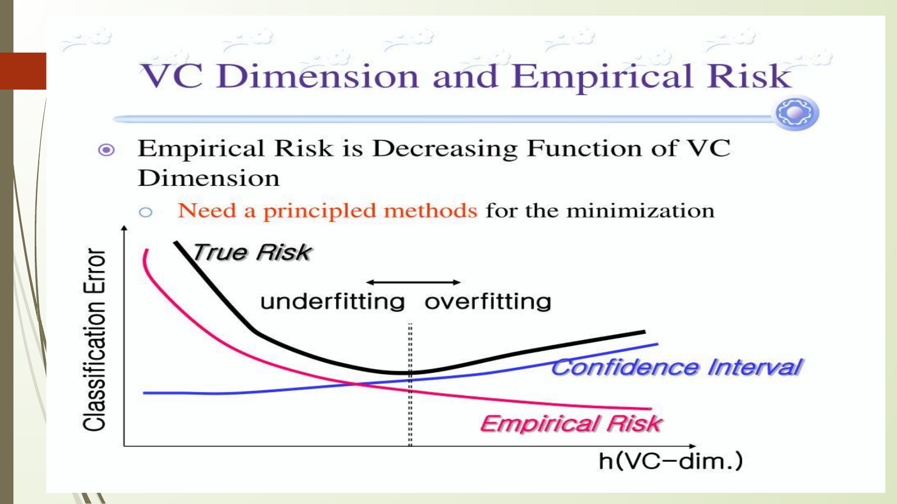

### Extracted Slide Text

- No selectable text extracted from this page.

### Page Description And Teaching Notes

Slide type: visual-only or image-heavy slide.
Main idea: the slide is visual-first, so the image should be treated as the source for the content and structure.
This page is primarily visual. The embedded slide image is the authoritative visual output; read it as a diagram or illustration first, then connect any visible labels to the surrounding pages.
- No reliable selectable text was extracted; use the slide image for the visible diagram, chart, or screenshot.
Visual/layout description: the embedded image preserves the actual slide. Describe the title area first, then read bullets, formulas, tables, arrows, grouped boxes, or diagrams in their visible order. If the slide contains a diagram, explain the relationship shown by arrows/positioning before explaining the text labels.
Teaching note: after reading the slide, ask the learner to restate the page in one or two sentences and give one example. For formula or metric slides, also ask what each variable or metric means and when it should be used.
Exam/viva note: prepare the slide title as a short-answer question, then use the bullets or visual labels as the expected answer points.

## Page 61: Why is it

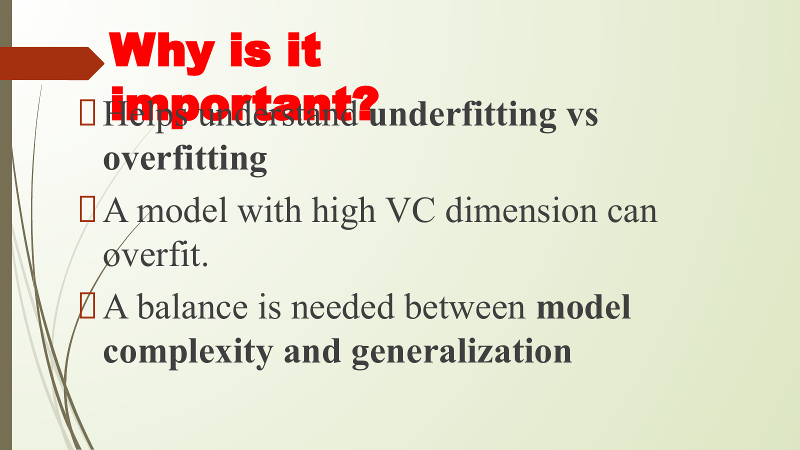

### Extracted Slide Text

- Why is it
- important?
- Helps understand underfitting vs
- overfitting
- A model with high VC dimension can
- overfit.
- A balance is needed between model
- complexity and generalization

### Page Description And Teaching Notes

Slide type: concept explanation slide.
Main idea: important? Helps understand underfitting vs overfitting A model with high VC dimension can overfit. A balance is needed between model.
This page explains a core concept in prose. The main task is to convert the definition into a clear statement of what the concept is, why it is used, and where it appears in a machine-learning workflow.
Detailed page understanding:
- `important?` is a core visible point. Explain what it means, why it matters, and how it connects to the slide title.
- `Helps understand underfitting vs` states a benefit. Use it to justify why this method or concept is useful in a machine-learning workflow.
- `overfitting` is a core visible point. Explain what it means, why it matters, and how it connects to the slide title.
- `A model with high VC dimension can` is a core visible point. Explain what it means, why it matters, and how it connects to the slide title.
- `overfit.` is a core visible point. Explain what it means, why it matters, and how it connects to the slide title.
- `A balance is needed between model` is a core visible point. Explain what it means, why it matters, and how it connects to the slide title.
- `complexity and generalization` is a core visible point. Explain what it means, why it matters, and how it connects to the slide title.
Important visible terms: Why, Helps.
Visual/layout description: the embedded image preserves the actual slide. Describe the title area first, then read bullets, formulas, tables, arrows, grouped boxes, or diagrams in their visible order. If the slide contains a diagram, explain the relationship shown by arrows/positioning before explaining the text labels.
Teaching note: after reading the slide, ask the learner to restate the page in one or two sentences and give one example. For formula or metric slides, also ask what each variable or metric means and when it should be used.
Exam/viva note: prepare the slide title as a short-answer question, then use the bullets or visual labels as the expected answer points.

## Page 62: 3.3

### Extracted Slide Text

- 3.3
- Ensemble Methods
- (Boosting, Bagging,
- Random Forests)

### Page Description And Teaching Notes

Slide type: bullet explanation slide.
Main idea: Ensemble Methods (Boosting, Bagging, Random Forests).
This page breaks the topic into separate points. Each bullet should be treated as a distinct exam or viva talking point, with the learner able to define it and give a small example.
Detailed page understanding:
- `Ensemble Methods` is a core visible point. Explain what it means, why it matters, and how it connects to the slide title.
- `(Boosting, Bagging,` is a core visible point. Explain what it means, why it matters, and how it connects to the slide title.
- `Random Forests)` is a core visible point. Explain what it means, why it matters, and how it connects to the slide title.
Important visible terms: Ensemble Methods, Boosting, Bagging, Random Forests.
Visual/layout description: the embedded image preserves the actual slide. Describe the title area first, then read bullets, formulas, tables, arrows, grouped boxes, or diagrams in their visible order. If the slide contains a diagram, explain the relationship shown by arrows/positioning before explaining the text labels.
Teaching note: after reading the slide, ask the learner to restate the page in one or two sentences and give one example. For formula or metric slides, also ask what each variable or metric means and when it should be used.
Exam/viva note: prepare the slide title as a short-answer question, then use the bullets or visual labels as the expected answer points.

## Page 63: Ensemble learning

### Extracted Slide Text

- Ensemble learning
- Ensemble learning is a technique in
- machine learning where multiple
- models (often called "weak learners")
- are trained and combined to solve the
- same problem.
- The idea is that a group of models
- working together can outperform a
- single strong model.

### Page Description And Teaching Notes

Slide type: concept explanation slide.
Main idea: Ensemble learning is a technique in machine learning where multiple models (often called "weak learners") are trained and combined to solve the same problem. The idea is that a group of models.
This page explains a core concept in prose. The main task is to convert the definition into a clear statement of what the concept is, why it is used, and where it appears in a machine-learning workflow.
Detailed page understanding:
- `Ensemble learning is a technique in` gives the definition-level meaning. Explain it first in simple words, then connect it to how a model learns from data.
- `machine learning where multiple` is a core visible point. Explain what it means, why it matters, and how it connects to the slide title.
- `models (often called "weak learners")` is a core visible point. Explain what it means, why it matters, and how it connects to the slide title.
- `are trained and combined to solve the` is a core visible point. Explain what it means, why it matters, and how it connects to the slide title.
- `same problem.` is a limitation or risk. Mention when the method may fail and what alternative or precaution can reduce the issue.
- `The idea is that a group of models` is a core visible point. Explain what it means, why it matters, and how it connects to the slide title.
- `working together can outperform a` is a core visible point. Explain what it means, why it matters, and how it connects to the slide title.
- `single strong model.` is a core visible point. Explain what it means, why it matters, and how it connects to the slide title.
Important visible terms: Ensemble, The.
Visual/layout description: the embedded image preserves the actual slide. Describe the title area first, then read bullets, formulas, tables, arrows, grouped boxes, or diagrams in their visible order. If the slide contains a diagram, explain the relationship shown by arrows/positioning before explaining the text labels.
Teaching note: after reading the slide, ask the learner to restate the page in one or two sentences and give one example. For formula or metric slides, also ask what each variable or metric means and when it should be used.
Exam/viva note: prepare the slide title as a short-answer question, then use the bullets or visual labels as the expected answer points.

## Page 64: When to Use Ensemble Learning?

### Extracted Slide Text

- When to Use Ensemble Learning?
- You have high variance or high bias in your model.
- Your base models are diverse and complementary.
- You want to increase model performance in competitions (e.g.,
- Kaggle).
- Real-Life Example
- ❑ Imagine trying to guess a movie’s rating:
- One friend uses past ratings
- Another reads online reviews
- A third watches the trailer
- Each has weaknesses alone, but combining their opinions gives
- a better estimate. That’s ensemble learning!

### Page Description And Teaching Notes

Slide type: bullet explanation slide.
Main idea: You have high variance or high bias in your model. Your base models are diverse and complementary. You want to increase model performance in competitions (e.g., Kaggle). Real-Life Example ❑ Imagine trying to guess a movie’s rating:.
This page breaks the topic into separate points. Each bullet should be treated as a distinct exam or viva talking point, with the learner able to define it and give a small example.
Detailed page understanding:
- `You have high variance or high bias in your model.` is a core visible point. Explain what it means, why it matters, and how it connects to the slide title.
- `Your base models are diverse and complementary.` is a core visible point. Explain what it means, why it matters, and how it connects to the slide title.
- `You want to increase model performance in competitions (e.g.,` is a core visible point. Explain what it means, why it matters, and how it connects to the slide title.
- `Kaggle).` is a core visible point. Explain what it means, why it matters, and how it connects to the slide title.
- `Real-Life Example` is an application/example point. Convert it into a concrete real-world case while teaching.
- `❑ Imagine trying to guess a movie’s rating:` is one item in the slide's list. Treat it as a separate subtopic and prepare a one-line explanation for it.
- `One friend uses past ratings` is an application/example point. Convert it into a concrete real-world case while teaching.
- `Another reads online reviews` is a core visible point. Explain what it means, why it matters, and how it connects to the slide title.
- Additional bullets continue on the slide; use the extracted text list above for the complete wording.
- `a better estimate. That’s ensemble learning!` is a core visible point. Explain what it means, why it matters, and how it connects to the slide title.
Important visible terms: When, Use Ensemble Learning, You, Your, Kaggle, Real-Life Example, Imagine, One.
Visual/layout description: the embedded image preserves the actual slide. Describe the title area first, then read bullets, formulas, tables, arrows, grouped boxes, or diagrams in their visible order. If the slide contains a diagram, explain the relationship shown by arrows/positioning before explaining the text labels.
Teaching note: after reading the slide, ask the learner to restate the page in one or two sentences and give one example. For formula or metric slides, also ask what each variable or metric means and when it should be used.
Exam/viva note: prepare the slide title as a short-answer question, then use the bullets or visual labels as the expected answer points.

## Page 65: Unit III - Unsupervised Learning Page 65

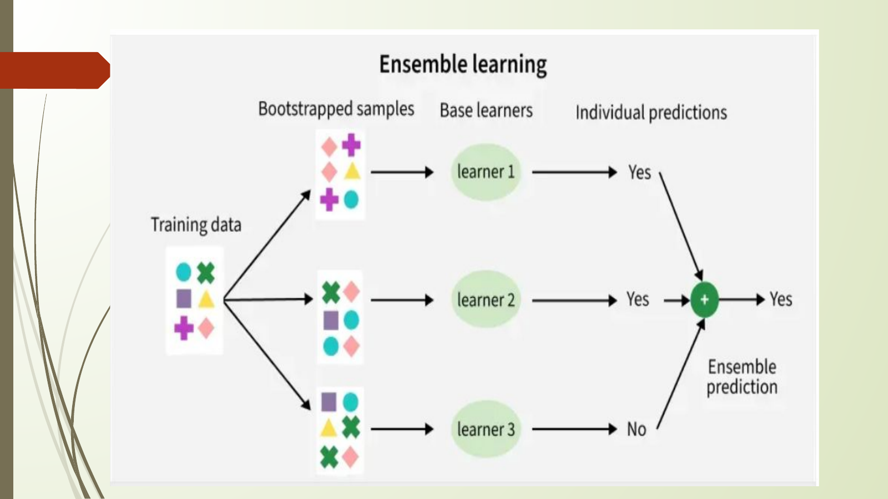

### Extracted Slide Text

- No selectable text extracted from this page.

### Page Description And Teaching Notes

Slide type: visual-only or image-heavy slide.
Main idea: the slide is visual-first, so the image should be treated as the source for the content and structure.
This page is primarily visual. The embedded slide image is the authoritative visual output; read it as a diagram or illustration first, then connect any visible labels to the surrounding pages.
- No reliable selectable text was extracted; use the slide image for the visible diagram, chart, or screenshot.
Visual/layout description: the embedded image preserves the actual slide. Describe the title area first, then read bullets, formulas, tables, arrows, grouped boxes, or diagrams in their visible order. If the slide contains a diagram, explain the relationship shown by arrows/positioning before explaining the text labels.
Teaching note: after reading the slide, ask the learner to restate the page in one or two sentences and give one example. For formula or metric slides, also ask what each variable or metric means and when it should be used.
Exam/viva note: prepare the slide title as a short-answer question, then use the bullets or visual labels as the expected answer points.

## Page 66: Unit III - Unsupervised Learning Page 66

### Extracted Slide Text

- No selectable text extracted from this page.

### Page Description And Teaching Notes

Slide type: visual-only or image-heavy slide.
Main idea: the slide is visual-first, so the image should be treated as the source for the content and structure.
This page is primarily visual. The embedded slide image is the authoritative visual output; read it as a diagram or illustration first, then connect any visible labels to the surrounding pages.
- No reliable selectable text was extracted; use the slide image for the visible diagram, chart, or screenshot.
Visual/layout description: the embedded image preserves the actual slide. Describe the title area first, then read bullets, formulas, tables, arrows, grouped boxes, or diagrams in their visible order. If the slide contains a diagram, explain the relationship shown by arrows/positioning before explaining the text labels.
Teaching note: after reading the slide, ask the learner to restate the page in one or two sentences and give one example. For formula or metric slides, also ask what each variable or metric means and when it should be used.
Exam/viva note: prepare the slide title as a short-answer question, then use the bullets or visual labels as the expected answer points.

## Page 67: Accuracy: Highest

### Extracted Slide Text

- Accuracy: Highest

### Page Description And Teaching Notes

Slide type: title or transition slide.
Main idea: the slide is visual-first, so the image should be treated as the source for the content and structure.
This page sets the context for the next topic. Treat it as a section marker: it tells the learner what concept or unit is starting before the deck moves into definitions, examples, or formulas.
- No reliable selectable text was extracted; use the slide image for the visible diagram, chart, or screenshot.
Important visible terms: Accuracy, Highest.
Visual/layout description: the embedded image preserves the actual slide. Describe the title area first, then read bullets, formulas, tables, arrows, grouped boxes, or diagrams in their visible order. If the slide contains a diagram, explain the relationship shown by arrows/positioning before explaining the text labels.
Teaching note: after reading the slide, ask the learner to restate the page in one or two sentences and give one example. For formula or metric slides, also ask what each variable or metric means and when it should be used.
Exam/viva note: prepare the slide title as a short-answer question, then use the bullets or visual labels as the expected answer points.

## Page 68: Types of Ensemble learning

### Extracted Slide Text

- Types of Ensemble learning

### Page Description And Teaching Notes

Slide type: title or transition slide.
Main idea: the slide is visual-first, so the image should be treated as the source for the content and structure.
This page sets the context for the next topic. Treat it as a section marker: it tells the learner what concept or unit is starting before the deck moves into definitions, examples, or formulas.
- No reliable selectable text was extracted; use the slide image for the visible diagram, chart, or screenshot.
Important visible terms: Types, Ensemble.
Visual/layout description: the embedded image preserves the actual slide. Describe the title area first, then read bullets, formulas, tables, arrows, grouped boxes, or diagrams in their visible order. If the slide contains a diagram, explain the relationship shown by arrows/positioning before explaining the text labels.
Teaching note: after reading the slide, ask the learner to restate the page in one or two sentences and give one example. For formula or metric slides, also ask what each variable or metric means and when it should be used.
Exam/viva note: prepare the slide title as a short-answer question, then use the bullets or visual labels as the expected answer points.

## Page 69: Bagging (Bootstrap Aggregating):

### Extracted Slide Text

- Bagging (Bootstrap Aggregating):
- Models are trained independently on different
- random subsets of the training data.
- Their results are then combined—usually by
- averaging (for regression) or voting (for
- classification).
- This helps reduce variance and prevents over
- fitting.
- Example Algorithms:
- Random Forest (uses decision trees + bagging)

### Page Description And Teaching Notes

Slide type: concept explanation slide.
Main idea: Models are trained independently on different random subsets of the training data. Their results are then combined—usually by averaging (for regression) or voting (for classification). This helps reduce variance and prevents over.
This page explains a core concept in prose. The main task is to convert the definition into a clear statement of what the concept is, why it is used, and where it appears in a machine-learning workflow.
Detailed page understanding:
- `Models are trained independently on different` is a core visible point. Explain what it means, why it matters, and how it connects to the slide title.
- `random subsets of the training data.` is a core visible point. Explain what it means, why it matters, and how it connects to the slide title.
- `Their results are then combined—usually by` is a core visible point. Explain what it means, why it matters, and how it connects to the slide title.
- `averaging (for regression) or voting (for` is a core visible point. Explain what it means, why it matters, and how it connects to the slide title.
- `classification).` is a core visible point. Explain what it means, why it matters, and how it connects to the slide title.
- `This helps reduce variance and prevents over` states a benefit. Use it to justify why this method or concept is useful in a machine-learning workflow.
- `fitting.` is a core visible point. Explain what it means, why it matters, and how it connects to the slide title.
- `Example Algorithms:` is an application/example point. Convert it into a concrete real-world case while teaching.
- `Random Forest (uses decision trees + bagging)` is an application/example point. Convert it into a concrete real-world case while teaching.
Important visible terms: Bagging, Bootstrap Aggregating, Models, Their, This, Example Algorithms, Random Forest.
Visual/layout description: the embedded image preserves the actual slide. Describe the title area first, then read bullets, formulas, tables, arrows, grouped boxes, or diagrams in their visible order. If the slide contains a diagram, explain the relationship shown by arrows/positioning before explaining the text labels.
Teaching note: after reading the slide, ask the learner to restate the page in one or two sentences and give one example. For formula or metric slides, also ask what each variable or metric means and when it should be used.
Exam/viva note: prepare the slide title as a short-answer question, then use the bullets or visual labels as the expected answer points.

## Page 70: How Bagging Learning model

### Extracted Slide Text

- How Bagging Learning model
- works:

### Page Description And Teaching Notes

Slide type: title or transition slide.
Main idea: works:.
This page sets the context for the next topic. Treat it as a section marker: it tells the learner what concept or unit is starting before the deck moves into definitions, examples, or formulas.
Detailed page understanding:
- `works:` is a core visible point. Explain what it means, why it matters, and how it connects to the slide title.
Important visible terms: How Bagging Learning.
Visual/layout description: the embedded image preserves the actual slide. Describe the title area first, then read bullets, formulas, tables, arrows, grouped boxes, or diagrams in their visible order. If the slide contains a diagram, explain the relationship shown by arrows/positioning before explaining the text labels.
Teaching note: after reading the slide, ask the learner to restate the page in one or two sentences and give one example. For formula or metric slides, also ask what each variable or metric means and when it should be used.
Exam/viva note: prepare the slide title as a short-answer question, then use the bullets or visual labels as the expected answer points.

## Page 71: Boosting:

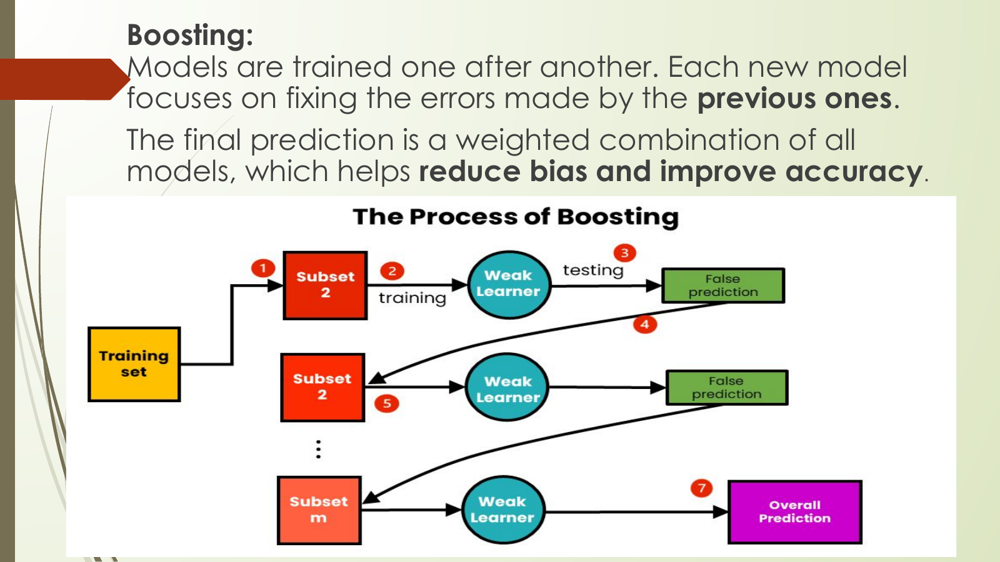

### Extracted Slide Text

- Boosting:
- Models are trained one after another. Each new model
- focuses on fixing the errors made by the previous ones.
- The final prediction is a weighted combination of all
- models, which helps reduce bias and improve accuracy.

### Page Description And Teaching Notes

Slide type: metric/table slide.
Main idea: Models are trained one after another. Each new model focuses on fixing the errors made by the previous ones. The final prediction is a weighted combination of all models, which helps reduce bias and improve accuracy.
This page organizes evaluation or comparison information. Focus on what each metric measures, when it is useful, and what mistake it prevents when judging a machine-learning model.
Detailed page understanding:
- `Models are trained one after another. Each new model` is a core visible point. Explain what it means, why it matters, and how it connects to the slide title.
- `focuses on fixing the errors made by the previous ones.` is a limitation or risk. Mention when the method may fail and what alternative or precaution can reduce the issue.
- `The final prediction is a weighted combination of all` gives the definition-level meaning. Explain it first in simple words, then connect it to how a model learns from data.
- `models, which helps reduce bias and improve accuracy.` states a benefit. Use it to justify why this method or concept is useful in a machine-learning workflow.
Important visible terms: Boosting, Models, Each, The.
Visual/layout description: the embedded image preserves the actual slide. Describe the title area first, then read bullets, formulas, tables, arrows, grouped boxes, or diagrams in their visible order. If the slide contains a diagram, explain the relationship shown by arrows/positioning before explaining the text labels.
Teaching note: after reading the slide, ask the learner to restate the page in one or two sentences and give one example. For formula or metric slides, also ask what each variable or metric means and when it should be used.
Exam/viva note: prepare the slide title as a short-answer question, then use the bullets or visual labels as the expected answer points.

## Page 72: Models are trained sequentially, each new

### Extracted Slide Text

- Models are trained sequentially, each new
- model focusing on correcting the errors of the
- previous ones.
- Final prediction is a weighted sum of all
- models.
- Reduces bias and variance
- Popular Boosting Algorithms:
- ✔ AdaBoost (Adaptive Boosting)
- ✔ Gradient Boosting (GBM)
- ✔ XGBoost
- ✔ LightGBM
- ✔ CatBoost

### Page Description And Teaching Notes

Slide type: bullet explanation slide.
Main idea: model focusing on correcting the errors of the previous ones. Final prediction is a weighted sum of all models. Reduces bias and variance Popular Boosting Algorithms:.
This page breaks the topic into separate points. Each bullet should be treated as a distinct exam or viva talking point, with the learner able to define it and give a small example.
Detailed page understanding:
- `model focusing on correcting the errors of the` is a limitation or risk. Mention when the method may fail and what alternative or precaution can reduce the issue.
- `previous ones.` is a core visible point. Explain what it means, why it matters, and how it connects to the slide title.
- `Final prediction is a weighted sum of all` gives the definition-level meaning. Explain it first in simple words, then connect it to how a model learns from data.
- `models.` is a core visible point. Explain what it means, why it matters, and how it connects to the slide title.
- `Reduces bias and variance` is a core visible point. Explain what it means, why it matters, and how it connects to the slide title.
- `Popular Boosting Algorithms:` is a core visible point. Explain what it means, why it matters, and how it connects to the slide title.
- `✔ AdaBoost (Adaptive Boosting)` is one item in the slide's list. Treat it as a separate subtopic and prepare a one-line explanation for it.
- `✔ Gradient Boosting (GBM)` is one item in the slide's list. Treat it as a separate subtopic and prepare a one-line explanation for it.
- Additional bullets continue on the slide; use the extracted text list above for the complete wording.
- `✔ CatBoost` is one item in the slide's list. Treat it as a separate subtopic and prepare a one-line explanation for it.
Important visible terms: Models, Final, Reduces, Popular Boosting Algorithms, AdaBoost, Adaptive Boosting, Gradient Boosting, GBM.
Visual/layout description: the embedded image preserves the actual slide. Describe the title area first, then read bullets, formulas, tables, arrows, grouped boxes, or diagrams in their visible order. If the slide contains a diagram, explain the relationship shown by arrows/positioning before explaining the text labels.
Teaching note: after reading the slide, ask the learner to restate the page in one or two sentences and give one example. For formula or metric slides, also ask what each variable or metric means and when it should be used.
Exam/viva note: prepare the slide title as a short-answer question, then use the bullets or visual labels as the expected answer points.

## Page 73: Stacking (Stacked Generalization)

### Extracted Slide Text

- Stacking (Stacked Generalization)
- Multiple different models (often of different types) are
- trained, and their predictions are used as inputs to a
- final model, called a meta-model.
- The meta-model learns how to best combine the
- predictions of the base models, aiming for better
- performance than any individual model.
- The predictions of base models are fed to a
- meta-model (e.g., logistic regression) that learns how to
- best combine them.
- Leverages strengths of different models
- Useful when base learners are diverse.

### Page Description And Teaching Notes

Slide type: concept explanation slide.
Main idea: Multiple different models (often of different types) are trained, and their predictions are used as inputs to a final model, called a meta-model. The meta-model learns how to best combine the predictions of the base models, aiming for better performance than any individual model.
This page explains a core concept in prose. The main task is to convert the definition into a clear statement of what the concept is, why it is used, and where it appears in a machine-learning workflow.
Detailed page understanding:
- `Multiple different models (often of different types) are` is a core visible point. Explain what it means, why it matters, and how it connects to the slide title.
- `trained, and their predictions are used as inputs to a` is an application/example point. Convert it into a concrete real-world case while teaching.
- `final model, called a meta-model.` is a core visible point. Explain what it means, why it matters, and how it connects to the slide title.
- `The meta-model learns how to best combine the` is a core visible point. Explain what it means, why it matters, and how it connects to the slide title.
- `predictions of the base models, aiming for better` is a core visible point. Explain what it means, why it matters, and how it connects to the slide title.
- `performance than any individual model.` is a core visible point. Explain what it means, why it matters, and how it connects to the slide title.
- `The predictions of base models are fed to a` is a core visible point. Explain what it means, why it matters, and how it connects to the slide title.
- `meta-model (e.g., logistic regression) that learns how to` is a core visible point. Explain what it means, why it matters, and how it connects to the slide title.
- Additional bullets continue on the slide; use the extracted text list above for the complete wording.
- `Useful when base learners are diverse.` is an application/example point. Convert it into a concrete real-world case while teaching.
Important visible terms: Stacking, Stacked Generalization, Multiple, The, Leverages, Useful.
Visual/layout description: the embedded image preserves the actual slide. Describe the title area first, then read bullets, formulas, tables, arrows, grouped boxes, or diagrams in their visible order. If the slide contains a diagram, explain the relationship shown by arrows/positioning before explaining the text labels.
Teaching note: after reading the slide, ask the learner to restate the page in one or two sentences and give one example. For formula or metric slides, also ask what each variable or metric means and when it should be used.
Exam/viva note: prepare the slide title as a short-answer question, then use the bullets or visual labels as the expected answer points.

## Page 74: Unit III - Unsupervised Learning Page 74

### Extracted Slide Text

- No selectable text extracted from this page.

### Page Description And Teaching Notes

Slide type: visual-only or image-heavy slide.
Main idea: the slide is visual-first, so the image should be treated as the source for the content and structure.
This page is primarily visual. The embedded slide image is the authoritative visual output; read it as a diagram or illustration first, then connect any visible labels to the surrounding pages.
- No reliable selectable text was extracted; use the slide image for the visible diagram, chart, or screenshot.
Visual/layout description: the embedded image preserves the actual slide. Describe the title area first, then read bullets, formulas, tables, arrows, grouped boxes, or diagrams in their visible order. If the slide contains a diagram, explain the relationship shown by arrows/positioning before explaining the text labels.
Teaching note: after reading the slide, ask the learner to restate the page in one or two sentences and give one example. For formula or metric slides, also ask what each variable or metric means and when it should be used.
Exam/viva note: prepare the slide title as a short-answer question, then use the bullets or visual labels as the expected answer points.

## Page 75: Unit III - Unsupervised Learning Page 75

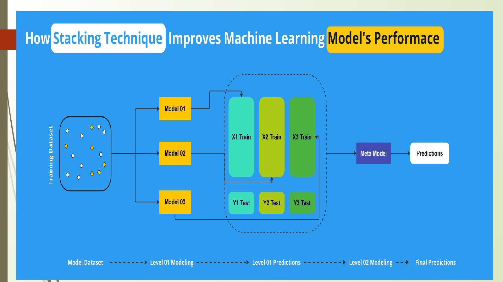

### Extracted Slide Text

- No selectable text extracted from this page.

### Page Description And Teaching Notes

Slide type: visual-only or image-heavy slide.
Main idea: the slide is visual-first, so the image should be treated as the source for the content and structure.
This page is primarily visual. The embedded slide image is the authoritative visual output; read it as a diagram or illustration first, then connect any visible labels to the surrounding pages.
- No reliable selectable text was extracted; use the slide image for the visible diagram, chart, or screenshot.
Visual/layout description: the embedded image preserves the actual slide. Describe the title area first, then read bullets, formulas, tables, arrows, grouped boxes, or diagrams in their visible order. If the slide contains a diagram, explain the relationship shown by arrows/positioning before explaining the text labels.
Teaching note: after reading the slide, ask the learner to restate the page in one or two sentences and give one example. For formula or metric slides, also ask what each variable or metric means and when it should be used.
Exam/viva note: prepare the slide title as a short-answer question, then use the bullets or visual labels as the expected answer points.

## Page 76: Real-Life Example

### Extracted Slide Text

- Real-Life Example
- Imagine trying to guess a movie’s rating:
- One friend uses past ratings
- Another reads online reviews
- A third watches the trailer
- Each has weaknesses alone, but combining
- their opinions gives a better estimate. That’s
- ensemble learning!

### Page Description And Teaching Notes

Slide type: concept explanation slide.
Main idea: Imagine trying to guess a movie’s rating: One friend uses past ratings Another reads online reviews A third watches the trailer Each has weaknesses alone, but combining their opinions gives a better estimate. That’s.
This page explains a core concept in prose. The main task is to convert the definition into a clear statement of what the concept is, why it is used, and where it appears in a machine-learning workflow.
Detailed page understanding:
- `Imagine trying to guess a movie’s rating:` is a core visible point. Explain what it means, why it matters, and how it connects to the slide title.
- `One friend uses past ratings` is an application/example point. Convert it into a concrete real-world case while teaching.
- `Another reads online reviews` is a core visible point. Explain what it means, why it matters, and how it connects to the slide title.
- `A third watches the trailer` is a core visible point. Explain what it means, why it matters, and how it connects to the slide title.
- `Each has weaknesses alone, but combining` is a core visible point. Explain what it means, why it matters, and how it connects to the slide title.
- `their opinions gives a better estimate. That’s` is a core visible point. Explain what it means, why it matters, and how it connects to the slide title.
- `ensemble learning!` is a core visible point. Explain what it means, why it matters, and how it connects to the slide title.
Important visible terms: Real-Life Example Imagine, One, Another, Each, That.
Visual/layout description: the embedded image preserves the actual slide. Describe the title area first, then read bullets, formulas, tables, arrows, grouped boxes, or diagrams in their visible order. If the slide contains a diagram, explain the relationship shown by arrows/positioning before explaining the text labels.
Teaching note: after reading the slide, ask the learner to restate the page in one or two sentences and give one example. For formula or metric slides, also ask what each variable or metric means and when it should be used.
Exam/viva note: prepare the slide title as a short-answer question, then use the bullets or visual labels as the expected answer points.
